Introduction to Statistics for Astronomers and Physicists
================
Dr Angus H Wright
2022-02-08


# Welcome and Introduction <!--{{{-->

<!--Setup {{{-->
<style type="text/css">
.python { 
  background-color: 
    RColorBrewer::brewer.pal(1,"Set2");
} 
.out { 
  max-height: 300px;
  overflow-y: auto;
  background-color: inherit;
}
</style>
<!--}}}-->

Welcome to the Introduction to Statistics for Astronomers and Physicists
course for the Summer Semester 2021.

## Course Philosophy <!--{{{-->

This course is designed to be a practical introduction to statistics for
astronomers and physicists who are starting their research careers and
have had little (or perhaps no) previous education in statistics and
statistical data analysis. The course (and these lecture notes) are not
designed to be a statistics reference text. Rather the material
presented here is designed to guide students on a suitable path towards
robust data analysis and research.

The course will present many aspects of data analysis that are widely
relevant to modern astronomy and physics. We will borrow heavily from
standard statistical problems and thought experiments in an effort to
convey important points, and demonstrate common statistical and logical
fallacies. Problems will almost always be explored using a mixture of
tools simultaneously: plain English, math, computer code, graphs, and
more.

<!--}}}-->
<!--}}}-->

# Course Outline <!--{{{-->

This course will be taught in 4 parts, each spanning from 2-4 weeks

**Section 1: Data Description, Analysis, and Modelling (Weeks 1-2)**

When working in empirical science, modelling and understanding datasets
is paramount. In this module we start by discussing the fundamentals of
data modelling. We start by discussing theories of point and interval
estimation, in the context of summary statics (e.g. expectation values,
confidence intervals), and estimation of data correlation and
covariance. Students will learn the fundamentals of data mining and
analysis, in a way that is applicable to all physical sciences.

Topics include:

-   Types of data
-   Point & interval estimation
-   Correlation & covariance
-   Fundamentals of data exploration/mining
-   Introduction to data visualisation

**Section 2: Probability & Decision Making (Weeks 3-5)**

For all aspects of modern science, an understanding of probability is
required. We cover a range of topics in probability, from decision
theory and the fundamentals of probability theory, to standard
probabilistic distributions and their origin. From this module, students
will gain an insight into different statistical distributions that
govern modern observational sciences, the interpretation of these
distributions, and how one accurately models distributions of data in an
unbiased manner.

Topics include:

-   Decision theory
-   Fundamentals of probability
-   Statistical distributions and their origins

**Section 3: Bayesian Statistics (Weeks 6-8)**

Bayes theorem led to a revolution in statistics, via the concepts of
prior and posterior evidence. In modern astronomy and physics,
applications of Bayesian statistics are widespread. We begin with a
study of Bayes theorem, and the fundamental differences between
frequentest and Bayesian analysis. We explore applications of Bayesian
statistics, through well studied statistical problems (both within and
outside of physics).

Topics include:

-   Frequentist & Bayesian statistics
-   Bayes theory
-   Prior specification
-   Hypothesis testing

**Section 4: Parameter Simulation, Optimisation, and Analysis (Weeks
9-12)**

We apply our understanding of Bayesian statistics to the common problems
of parameter simulation, optimisation, and inference. Students will
learn the fundamentals of Monte Carlo Simulation, Markov Chain Monte
Carlo (MCMC) analysis, hypothesis testing, and quantifying
goodness-of-fit. We discuss common errors in parameter inference,
including standard physical and astrophysical biases that corrupt
statistical analyses.

Topics include:

-   Monte Carlo Simulation
-   Markov-Chain Monte Carlo
-   Fitting high dimensional data
-   Machine Learning

<!--}}}-->

# Rmarkdown <!--{{{-->

Slides and lecture notes for this course are prepared in **Rmarkdown**,
and provided to you after the lectures.

The utility of **Rmarkdown** is that it allows running execution of code
chunks alongside markdown-style text, in a wide array of languages,
including **R**, **python**, bash, Rcpp, javascript, and more. This
allows us to present examples in multiple languages easily within one
document. For example, if I want to plot a function, I can do so:
<table style="width: 90%">
<colgroup>
<col span="1" style="width: 45%;">
<col span="1" style="width: 45%;">
</colgroup>
<tbody>
<tr>
<td rblock>
<!--{{{-->

``` r
#in R
theta=seq(0,2,by=0.01)
sinu=1+sin(2*pi*theta)
magplot(theta,sinu,type='l')
```

</td>
<!--}}}-->
<td pythonblock>
<!--{{{-->

``` python
#or in python
import numpy as np
import matplotlib.pyplot as plt
theta=np.arange(0.,2.,0.01)
sinu=1+np.sin(2*np.pi*theta)
plt.plot(theta,sinu)
plt.show()
```

</td>
<!--}}}-->
</tr>
<tr>
<td rblock>
<!--{{{-->
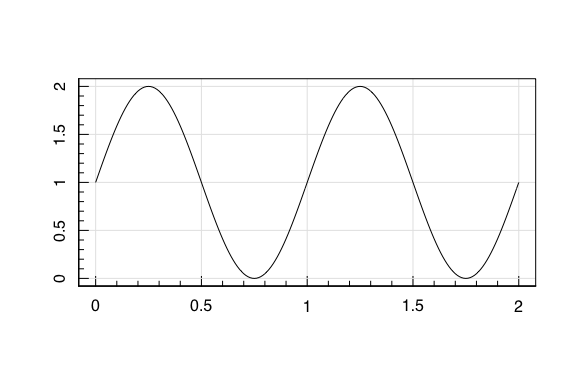
</td>
<!--}}}-->
<td pythonblock>
<!--{{{-->
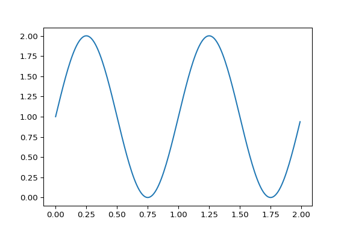
</td>
<!--}}}-->
</tr>
</tbody>
</table>
Information generated and stored within blocks is persistent, and
code-blocks with different engines can also cross-communicate. This
means that, for example, we can:
<table style="width: 90%">
<colgroup>
<col span="1" style="width: 45%;">
<col span="1" style="width: 45%;">
</colgroup>
<tbody>
<tr>
<td rblock>
<!--{{{-->

``` r
#Create some data in R
#E.g. random draws from f~N(0,1)
x=rnorm(1e3) 
y=rnorm(1e3) 
#Default plot in R
plot(x,y)
```

</td>
<!--}}}-->
<td pythonblock>
<!--{{{-->

``` python
#and access it directly in python
plt.scatter(r.x,r.y)
plt.show()
```

</td>
<!--}}}-->
</tr>
<tr>
<td rblock>
<!--{{{-->
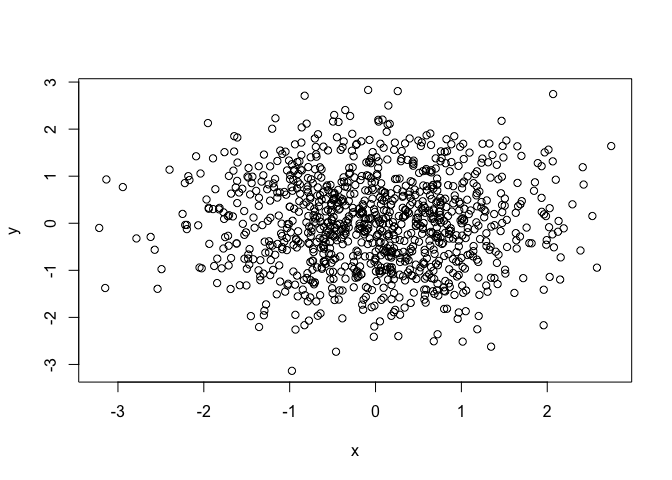
</td>
<!--}}}-->
<td pythonblock>
<!--{{{-->
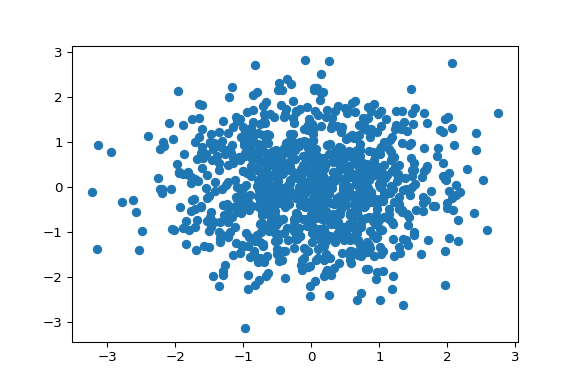
</td>
<!--}}}-->
</tr>
</tbody>
</table>
<!--}}}-->

# Slido <!--{{{-->

In addition to the lecture notes and slides, all students can post
on-the-fly questions about the materials via slido. To access slido, you
simply scan the QR code with your smartphone camera or join at slido.com
using the event ID listed in the window.

Once you are connected to the event, you simply post your questions
whenever you like. You should all try to **ask as many questions as you
like**! The reasons that this will work best when you ask as many
questions as possible are:

-   Questions can be asked anonymously, so you can ask freely and
    without anxiety.
-   All questions are good questions!!
-   Once a question is registered, everyone is able to add support by
    clicking the “thumbs up”.
    -   Think of this as being a way of saying “Oh! I want to know the
        answer to that too!”.
    -   Questions are ranked by popularity, so vote for questions you
        want to have answered too!
    -   I’ll try to answer all questions, but the most popular questions
        will float to the top and get answered quickly!
-   **Most importantly**: I will be able to use questions that were
    asked and/or were popular to update the lecture notes
    -   Course notes will better cover things you don’t understand
    -   Course will be more relevant to you
    -   The course will improve over time!

So ask whenever and about whatever you think is
relevant/interesting/unclear. The more the better!

<!--}}}-->

# Statistics and Computing <!--{{{-->

This is a lecture course on Statistics and Statistical methods; so why
do we care about computer code?!

It is of course possible to discuss statistics entirely on-paper.
However using computer code allows us to explore practical statistics in
real time, rather than limiting ourselves purely to equations and
diagrams (**Full disclosure**: We will use these a lot in this course
too!).

Additionally (and probably more importantly) the goal of this course is
for you to learn how to apply statistics to the problems that you will
encounter over the course of your academic careers; and to do so
*properly*. Therefore, an entirely on-paper statistics course isn’t
likely to be overly useful. My goal is for you to be able to leave this
course with the skills to actually apply these concepts in real-life
applications without difficulty.

<!--}}}-->

# Why do we need programming? <!--{{{-->

Modern physics and astronomy requires an understanding of programming.
From theoreticians writing models to experimentalists writing analysis
pipelines, most physicists and astronomers will use read, write, or use
a computer program every day.

An excellent example of this is the N-body simulation. In 1941, Erik
Holmberg performed the first simulations of colliding galaxies, 20 years
prior to a famous work by Sebastian von Hoerner that established the
field (and name) N-body Simulations.

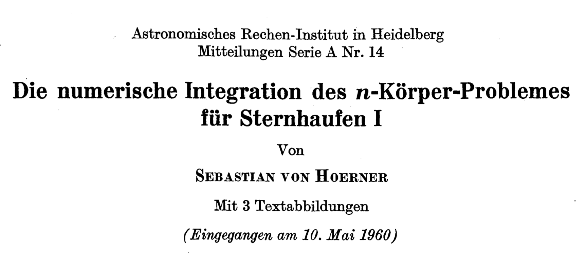


Holmberg’s work was exceptional for a number of reasons, but has become
famous because of *how* it was completed. Holmberg simulated the
collisions of rotating spiral galaxies:


And generated tidal disruption features that are now seen commonly in
merging spiral galaxies:


The surprise? His work was computed entirely *by hand*. Holmberg used
arrangements of lightbulbs to simulate groups of stars, and photometers
to compute the gravitational pull of all mass-elements on each-other per
unit time.

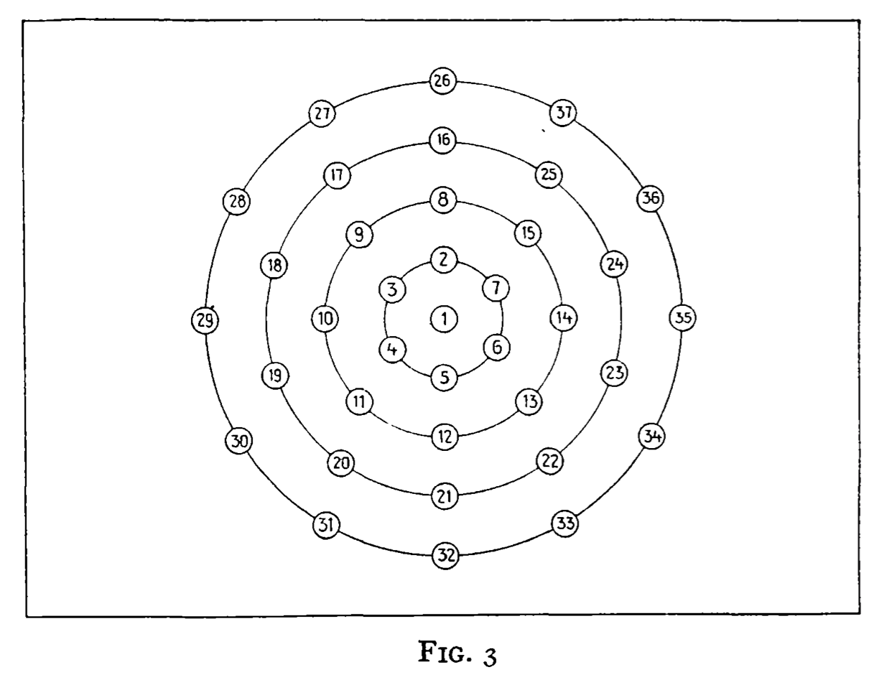

Of course nowadays we can run a simulation like this in seconds on any
laptop (or smartphone, if you really want to!). This allows measurements
to be more accurate, more detailed, and more reproducible. All of these
are fundamental to modern natural science.

<!--}}}-->

# Modern Science and the Requirement of Programming <!--{{{-->

The ubiquitousness of programming in the modern physical sciences is
linked to the important role that statistics plays in these fields.
Modern science is increasingly reliant on large and/or complex datasets,
which fundamentally must be analysed using modern statistical methods. A
classic example is model optimisation (which we will cover in detail in
this course): let us take a relatively simple dataset that we know
follows a generic beta distribution, and attempt to model this dataset
using a function containing 2 parameters:

$ 
Y = Beta(X, \\alpha,\\beta) + {\\rm noise} \\\\
0\\leq X \\leq 1 \\\\
\\alpha, \\beta \\in \[0,\\infty)
$

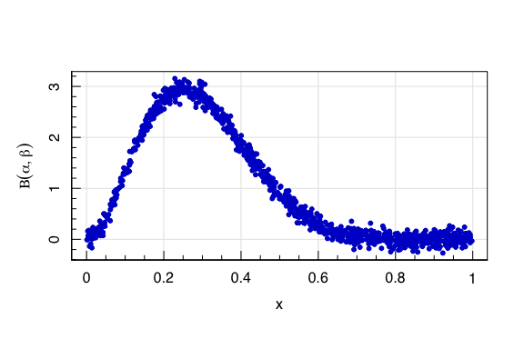
One might be inclined to attempt to fit a model to these data by-hand,
using trial and error:

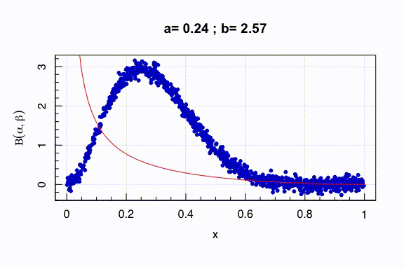

Using this approach we can get a reasonable fit with
*α* = 2.8, *β* = 6.7:

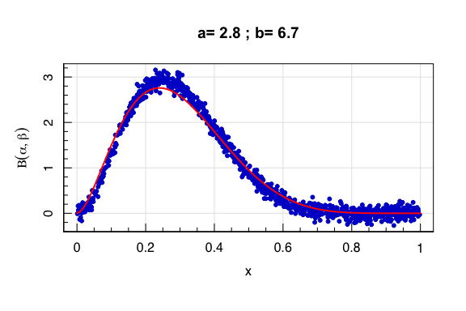

But is this solution near the truth? How close is good enough? And what
are the uncertainties on the parameters? These are all important in
modern science, and they are precisely the sort of questions/problems
that computers/programs are designed to tackle. With just one command,
we can use R/python to reach a more accurate solution, in a fraction of
the time.

``` r
#Estimate parameters using Nonlinear Least Squares (nls) in R 
fit_R=nls(y~dbeta(x,alpha,beta), #The function to fit
          data=list(x=x,y=y),    #The data 
          start=list(alpha=2,beta=5), #The initial guess
          algorithm='port',      #The algorithm 
          lower=c(0,0))          #The lower bounds
best_R=summary(fit_R)$parameters
```

``` python
#Estimate parameters using scipy.optimize.curve_fit in python
import scipy.optimize
import scipy.stats
best_py, cov_py = scipy.optimize.curve_fit(
         scipy.stats.beta.pdf, #The function to fit
         r.x, r.y,         #The data
         p0=[2,5],         #The initial guess 
         bounds=(0,np.inf),#The lower and upper bounds
         method='trf')     #The fitting algorithm
```

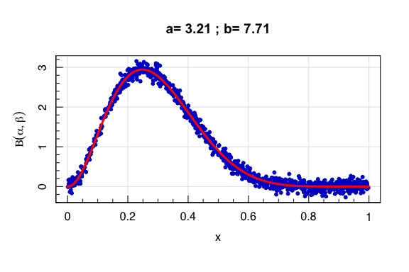
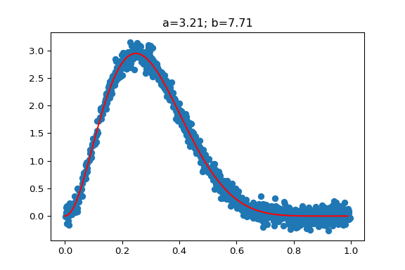

Obviously these fits are superior to those which we can reach by-hand in
terms of accuracy, effort, and runtime. But the most important benefit
is in terms of *uncertainty estimation*. Statistical computing is
important for a wide range of reasons, but arguably the first and most
important reason is for the computation of measures of uncertainty.

``` r
#Model statistics in R
summary(fit_R)
```

``` out
## 
## Formula: y ~ dbeta(x, alpha, beta)
## 
## Parameters:
##       Estimate Std. Error t value Pr(>|t|)    
## alpha  3.21166    0.01453   221.0   <2e-16 ***
## beta   7.70586    0.03728   206.7   <2e-16 ***
## ---
## Signif. codes:  0 '***' 0.001 '**' 0.01 '*' 0.05 '.' 0.1 ' ' 1
## 
## Residual standard error: 0.09854 on 998 degrees of freedom
## 
## Algorithm "port", convergence message: both X-convergence and relative convergence (5)
```

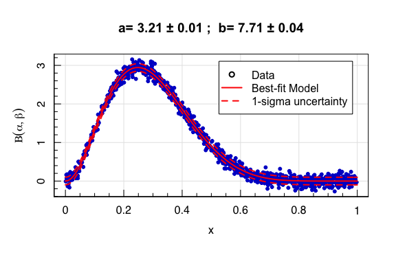

And the equivalent in **python**:

``` python
#Model parameters and covariance in python
print(best_py,cov_py) 
```

``` out
## [3.21166224 7.70585894] [[0.00021118 0.00050005]
##  [0.00050005 0.00138966]]
```

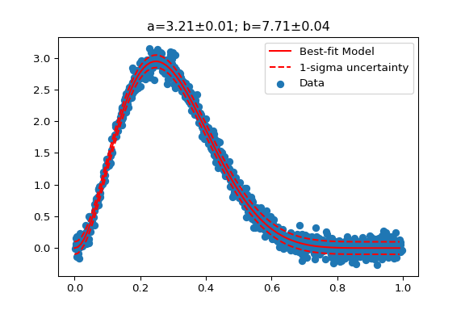

<!--}}}-->

# Do I need to know R or Python? <!--{{{-->

Despite what the internet will tell you, today there is very little
separating the two languages in terms of functionality. Both languages
can be run as a subprocess of the other, both have well developed tools
for data analysis and machine learning, and both have a wealth of
tutorials and guides to help new users enter the game.

-   <p style="color:blue">
    Overall, there is one major consideration that will (and should)
    drive your choice of which language to learn first:
    </p>

-   <center>
    <font size="12" color="black"> What languages do your colleagues use
    most? </font>
    </center>

<!--}}}-->

# Focus on whichever suits you best (and understand both if you can) <!--{{{-->

Any perceived benefit or detriment of the languages will invariably be
overwhelmed by whether or not you are able to share and discuss code
together with your colleagues. So, this is mostly a case where joining
the herd is probably the sensible choice.

## **What’s the difference between R and Python?**

### R

**R** was originally developed as a statistics and data analysis
language, and so many data analysis tools are available natively within
base **R**. Additional tools are available through the Comprehensive R
Archive Network (CRAN), which contains over 10k packages that are all
*required* to be fully documented. This means that if you want to
perform a particular flavour of statistical analysis, there is a good
chance that well developed code already exists within **R** to do it (or
at least to get you started).

### Python

**Python**’s strength lies within the its use as a general programming
language beyond data analysis. Packages are available to install via
conda, and are generally reliable despite (often) a lack of
documentation.

### What do I use?

Personally I code primarily in **R**. This is useful for this course, as
much of the analysis tools that we will use are available in base **R**.
Nonetheless, as I said above, it is entirely possible to redo much of
this analysis in **python**. Typically the only draw-back to doing so is
that the code is longer (most complex models in **R** can be specified
in few lines).

### What will you see in this course?

In practice, the vast majority of examples in this course will be
programmed in **R**.

***However***, I am happy to rewrite examples in **python** that you
think would be particularly useful!

So please let me know which of the examples/problems that we explore
during the course that you would like to see written in **python**, and
I will add them to the course notes.

Finally, as you will likely see in the following sections, if you can
understand one, then you can probably understand both. In this lecture
we will go through some examples of **R** and **python** code, so that
you have an introduction to the important parts (and can follow along
without much trouble).

<!--}}}-->

# A Crash Course in R and Python <!--{{{-->

<!--Intro{{{-->

For the remainder of this chapter, we will be going through a crash
course in **R/python** basics. There are *many* online tools that you
can use to teach yourself both of these languages. In this course, you
will be seeing a fair bit of **R** (in particular) but also **python**.
If you are already familiar with **python**, then this section may be
useful as a “Rosetta stone” of sorts. If you are unfamiliar with either
language, then this section will hopefully give an introduction to the
syntax/methods for using **R** and/or **python**.

A few important NBs:

-   Much of the information here focuses on *simplicity* rather than
    *efficiency/elegance*.

-   There may be other/better ways to perform the below operations.

-   This list of “good/important things to know” is certainly not
    exhaustive.

-   You can always learn more advanced operations in **R** and
    **python** via [this very useful website](https://www.google.com).

Additionally, I am *certainly* not a **python** expert. I have tried to
construct the below comparisons/conversions between **R** and **python**
in the fairest possible manner. If you think that there is a
simpler/more efficient/more elegant implementation of any **python**
snippets below (or if something I’ve written is just plain wrong!) then
please let me know and I will update the notes accordingly!

The following slides cover:

> -   Variable assignment
> -   Variable types
> -   Data types
> -   Code structure
> -   Data indexing
> -   Installing and loading libraries/packages
> -   Reading and Writing data
> -   Plotting
> -   Interfacing between **R** and **python** <!--}}}-->

# **Installing and loading Libraries** <!--{{{-->

The first important step in using **R** and **python** efficiently is to
understand how to install and load libraries/packages. These are tools
which have been written by a third party and made available for all
users to access and use. Both **R** and **python** have a plethora of
available packages. It is very rare to need to code up a statistical
method yourself, as it has most likely already been written (with speed
tricks and important checks/balances). Packages in **R** are installed
from *within* the **R** session, whereas **python** packages are
installed from the command line with a separate function “pip”:
<table style="width: 90%">
<colgroup>
<col span="1" style="width: 45%;">
<col span="1" style="width: 45%;">
</colgroup>
<tbody>
<tr>
<td rblock>
<!--{{{-->

``` r
#within the R session
#Install a packages called "remotes"
install.packages("remotes") 
```

</td>
<!--}}}-->
<td pythonblock>
<!--{{{-->

``` bash
#from the _commandline_
#install the numpy package using pip 
pip install numpy
```

</td>
<!--}}}-->
</tr>
</tbody>
</table>
To load these packages into **R** and **python** something we’ve already
seen a few times:
<table style="width: 90%">
<colgroup>
<col span="1" style="width: 45%;">
<col span="1" style="width: 45%;">
</colgroup>
<tbody>
<tr>
<td rblock>
<!--{{{-->

``` r
#in R: load the remotes package
library("remotes") 
```

</td>
<!--}}}-->
<td pythonblock>
<!--{{{-->

``` python
#in python: load numpy
import numpy as np
```

</td>
<!--}}}-->
</tr>
</tbody>
</table>

The “as np” section of the import in **python** is not required, but it
makes using the package in **python** a lot simpler. This is because
**python** tends to push users towards “object-oriented” programming
style, whereas **R** lends itself naturally to a more “functional”
programming style. We’ll discuss what this means later.

In **R**, packages are available primarily through CRAN. Some packages
are available through the separate “Bioconductor” entity, and these must
be installed differently (but similarly easily). The “remotes” package
that we just installed and subsequently loaded, however, allows us to
directly install packages that are on, e.g., github. **Python** has
similar functionality within pip:
<table style="width: 90%">
<colgroup>
<col span="1" style="width: 45%;">
<col span="1" style="width: 45%;">
</colgroup>
<tbody>
<tr>
<td rblock>
<!--{{{-->

``` r
#in R: load the remotes package
library("remotes") 
#and install the "Rfits" package 
#from github user ASGR:
install_github("ASGR/Rfits")
```

</td>
<!--}}}-->
<td pythonblock>
<!--{{{-->

``` bash
#from the commandline
#pip install the django package
pip install git+https://github.com/django/django.git
```

</td>
<!--}}}-->
</tr>
</tbody>
</table>
<!--}}}-->

# **Code Structure and Control Functions** <!--{{{-->

An important difference between the **python** and **R** languages is
the format of the code itself. **Python** imposes strict formatting
requirements on the code, whereby blocks of code are linked together via
leading whitespaces (i.e. indentation). **R** imposes no formatting
restriction on codeblocks, instead using brackets. This means that **R**
can seem overly verbose with brackets at times. As a demonstration, here
is the formatting required for a standard set of control functions that
are used in **R** and python: if, for, and while statements.

<table style="width: 90%">
<colgroup>
<col span="1" style="width: 45%;">
<col span="1" style="width: 45%;">
</colgroup>
<tbody>
<tr>
<td rblock>
<!--{{{-->

``` r
#Conditional statements in R
#If statements 
if (condition) { 
  #Evaluate if condition == true
} else { 
  #Evaluate if condition == false
}

#For statements 
for (var in sequence) { 
  #Evaluate 
}

#While statements 
while (condition) { 
  #Evaluate until condition == false
}
```

</td>
<!--}}}-->
<td pythonblock>
<!--{{{-->

``` python
#Conditional statements in python
#If statements 
if condition:  
  #Evaluate if condition == true
else:
  #Evaluate if condition == false

#For statements 
for var in sequence:  
  #Evaluate 

#While statements 
while condition: 
  #Evaluate until condition == false
```

</td>
<!--}}}-->
</tr>
</tbody>
</table>

As you can see, the code here looks largely the same for both languages.
The key point to understand is that the formatting in the **R** code
block is there by choice, not necessity. This is clearest with nested
loops:

``` r
#Valid Nested for loops in R 
mat<-matrix(0,3,3)
#Standard nested For loops 
for (col in 1:ncol(mat)) { 
  for (row in 1:col) { 
    mat[row,col]<-1
  }
}
mat
```

``` out
##      [,1] [,2] [,3]
## [1,]    1    1    1
## [2,]    0    1    1
## [3,]    0    0    1
```

``` r
#Without the brackets works...
mat<-matrix(0,3,3)
for (col in 1:ncol(mat)) 
  for (row in 1:col) 
    mat[row,col]<-2
mat
```

``` out
##      [,1] [,2] [,3]
## [1,]    2    2    2
## [2,]    0    2    2
## [3,]    0    0    2
```

``` r
#... but only for one line at a time
mat<-matrix(0,3,3)
for (col in 1:ncol(mat)) 
  for (row in 1:col) 
    silly<-"mistake"
    mat[row,col]<-3
mat
```

``` out
##      [,1] [,2] [,3]
## [1,]    0    0    0
## [2,]    0    0    0
## [3,]    0    0    3
```

``` r
#To hammer the point: 
#This works too (but please don't)
mat<-matrix(0,3,3)
for 
(col 
in 
1:ncol(mat)
)
{
for (row in 1:col) { mat[row,col]<-4
}} 
mat
```

``` out
##      [,1] [,2] [,3]
## [1,]    4    4    4
## [2,]    0    4    4
## [3,]    0    0    4
```

Conversely python has only one valid format for nested loops:

``` python
#Valid Nested for loops in python 
mat=np.zeros([3,3])
#Standard nested For loops 
for col in range(mat.shape[0]): 
  for row in range(col):  
    mat[row,col]=1
mat
```

``` out
## array([[0., 1., 1.],
##        [0., 0., 1.],
##        [0., 0., 0.]])
```

<!--}}}-->

# **Built-in Functions** <!--{{{-->

One major difference between **R** and **python** regards functions that
are built into the base language. In **R**, many statistical and
mathematical operations are available within the base language, because
of its history/development from the statistics language “S”. As a
result, one can do a great many powerful things in base **R**
(i.e. without the need to look for, install, and load additional
packages). In **python**, the majority of the base **R** functionality
can be inherited from three of the most widely used (by physicists and
astronomers at least) packages in python: *numpy*, *scipy*, and
*astropy*. As a result, most scientific **python** programs will start
by importing one or all of these packages.

We’ve already seen this in practice here, where (for example) we’ve
utilised the numpy vectorisation, linear algebra functions, and scipy
model optimisation in order to reproduce behaviour that was available in
base **R**. Another important functionality which we hid was the ability
to generate data following various statistical distributions. This is
core to many statistics applications that we will explore, and so we’ll
revisit it now. In the section on “Modern Science and the Requirement of
Programming”, we generated data that followed a Beta function: $ Y =
Beta(X, ,) + {} $ (NB: we will look more into this and other functions
later in the course). In **R** we can generate this data using the suite
of Beta distribution functions, which allow the calculation of the
density, distribution function, quantile function, and random generation
from the function:

``` r
#Documentation for the Beta functions in R
help(dbeta) # or ?dbeta 
```

The above launches the documentation page for this **R**. As we have
noted previously, **R** has *very* rigorous standards of documentation
for all functions that are present on CRAN and in the base code,
including:

-   Function description;
-   Function usage;
-   Argument definitions;
-   Detailed information about the function and its uses;
-   Notes about possible pitfalls;
-   Authorship and citation information;
-   References to related publications;
-   Lists of related functions; and
-   **Examples**.

The last item is particularly useful, as examples for almost all
functions in R can be run by just using the “example” function:

``` r
#Running examples for functions in R
example(dbeta)
```

Documentation for **python** functions can also be seen in a similar
manner, if they exist (which they do for most mainstream functions in
some form or another):

``` python
#Documentation for the Beta functions in python
help(scipy.stats.beta)
```

``` out
## Help on beta_gen in module scipy.stats._continuous_distns object:
## 
## class beta_gen(scipy.stats._distn_infrastructure.rv_continuous)
##  |  beta_gen(momtype=1, a=None, b=None, xtol=1e-14, badvalue=None, name=None, longname=None, shapes=None, extradoc=None, seed=None)
##  |  
##  |  A beta continuous random variable.
##  |  
##  |  %(before_notes)s
##  |  
##  |  Notes
##  |  -----
##  |  The probability density function for `beta` is:
##  |  
##  |  .. math::
##  |  
##  |      f(x, a, b) = \frac{\Gamma(a+b) x^{a-1} (1-x)^{b-1}}
##  |                        {\Gamma(a) \Gamma(b)}
##  |  
##  |  for :math:`0 <= x <= 1`, :math:`a > 0`, :math:`b > 0`, where
##  |  :math:`\Gamma` is the gamma function (`scipy.special.gamma`).
##  |  
##  |  `beta` takes :math:`a` and :math:`b` as shape parameters.
##  |  
##  |  %(after_notes)s
##  |  
##  |  %(example)s
##  |  
##  |  Method resolution order:
##  |      beta_gen
##  |      scipy.stats._distn_infrastructure.rv_continuous
##  |      scipy.stats._distn_infrastructure.rv_generic
##  |      builtins.object
##  |  
##  |  Methods defined here:
##  |  
##  |  fit(self, data, *args, **kwds)
##  |      Return MLEs for shape (if applicable), location, and scale
##  |      parameters from data.
##  |      
##  |      MLE stands for Maximum Likelihood Estimate.  Starting estimates for
##  |      the fit are given by input arguments; for any arguments not provided
##  |      with starting estimates, ``self._fitstart(data)`` is called to generate
##  |      such.
##  |      
##  |      One can hold some parameters fixed to specific values by passing in
##  |      keyword arguments ``f0``, ``f1``, ..., ``fn`` (for shape parameters)
##  |      and ``floc`` and ``fscale`` (for location and scale parameters,
##  |      respectively).
##  |      
##  |      Parameters
##  |      ----------
##  |      data : array_like
##  |          Data to use in calculating the MLEs.
##  |      arg1, arg2, arg3,... : floats, optional
##  |          Starting value(s) for any shape-characterizing arguments (those not
##  |          provided will be determined by a call to ``_fitstart(data)``).
##  |          No default value.
##  |      kwds : floats, optional
##  |          - `loc`: initial guess of the distribution's location parameter.
##  |          - `scale`: initial guess of the distribution's scale parameter.
##  |      
##  |          Special keyword arguments are recognized as holding certain
##  |          parameters fixed:
##  |      
##  |          - f0...fn : hold respective shape parameters fixed.
##  |            Alternatively, shape parameters to fix can be specified by name.
##  |            For example, if ``self.shapes == "a, b"``, ``fa`` and ``fix_a``
##  |            are equivalent to ``f0``, and ``fb`` and ``fix_b`` are
##  |            equivalent to ``f1``.
##  |      
##  |          - floc : hold location parameter fixed to specified value.
##  |      
##  |          - fscale : hold scale parameter fixed to specified value.
##  |      
##  |          - optimizer : The optimizer to use.  The optimizer must take ``func``,
##  |            and starting position as the first two arguments,
##  |            plus ``args`` (for extra arguments to pass to the
##  |            function to be optimized) and ``disp=0`` to suppress
##  |            output as keyword arguments.
##  |      
##  |      Returns
##  |      -------
##  |      mle_tuple : tuple of floats
##  |          MLEs for any shape parameters (if applicable), followed by those
##  |          for location and scale. For most random variables, shape statistics
##  |          will be returned, but there are exceptions (e.g. ``norm``).
##  |      
##  |      Notes
##  |      -----
##  |      This fit is computed by maximizing a log-likelihood function, with
##  |      penalty applied for samples outside of range of the distribution. The
##  |      returned answer is not guaranteed to be the globally optimal MLE, it
##  |      may only be locally optimal, or the optimization may fail altogether.
##  |      If the data contain any of np.nan, np.inf, or -np.inf, the fit routine
##  |      will throw a RuntimeError.
##  |      
##  |      In the special case where both `floc` and `fscale` are given, a
##  |      `ValueError` is raised if any value `x` in `data` does not satisfy
##  |      `floc < x < floc + fscale`.
##  |      
##  |      Examples
##  |      --------
##  |      
##  |      Generate some data to fit: draw random variates from the `beta`
##  |      distribution
##  |      
##  |      >>> from scipy.stats import beta
##  |      >>> a, b = 1., 2.
##  |      >>> x = beta.rvs(a, b, size=1000)
##  |      
##  |      Now we can fit all four parameters (``a``, ``b``, ``loc`` and ``scale``):
##  |      
##  |      >>> a1, b1, loc1, scale1 = beta.fit(x)
##  |      
##  |      We can also use some prior knowledge about the dataset: let's keep
##  |      ``loc`` and ``scale`` fixed:
##  |      
##  |      >>> a1, b1, loc1, scale1 = beta.fit(x, floc=0, fscale=1)
##  |      >>> loc1, scale1
##  |      (0, 1)
##  |      
##  |      We can also keep shape parameters fixed by using ``f``-keywords. To
##  |      keep the zero-th shape parameter ``a`` equal 1, use ``f0=1`` or,
##  |      equivalently, ``fa=1``:
##  |      
##  |      >>> a1, b1, loc1, scale1 = beta.fit(x, fa=1, floc=0, fscale=1)
##  |      >>> a1
##  |      1
##  |      
##  |      Not all distributions return estimates for the shape parameters.
##  |      ``norm`` for example just returns estimates for location and scale:
##  |      
##  |      >>> from scipy.stats import norm
##  |      >>> x = norm.rvs(a, b, size=1000, random_state=123)
##  |      >>> loc1, scale1 = norm.fit(x)
##  |      >>> loc1, scale1
##  |      (0.92087172783841631, 2.0015750750324668)
##  |  
##  |  ----------------------------------------------------------------------
##  |  Methods inherited from scipy.stats._distn_infrastructure.rv_continuous:
##  |  
##  |  __getstate__(self)
##  |  
##  |  __init__(self, momtype=1, a=None, b=None, xtol=1e-14, badvalue=None, name=None, longname=None, shapes=None, extradoc=None, seed=None)
##  |      Initialize self.  See help(type(self)) for accurate signature.
##  |  
##  |  cdf(self, x, *args, **kwds)
##  |      Cumulative distribution function of the given RV.
##  |      
##  |      Parameters
##  |      ----------
##  |      x : array_like
##  |          quantiles
##  |      arg1, arg2, arg3,... : array_like
##  |          The shape parameter(s) for the distribution (see docstring of the
##  |          instance object for more information)
##  |      loc : array_like, optional
##  |          location parameter (default=0)
##  |      scale : array_like, optional
##  |          scale parameter (default=1)
##  |      
##  |      Returns
##  |      -------
##  |      cdf : ndarray
##  |          Cumulative distribution function evaluated at `x`
##  |  
##  |  expect(self, func=None, args=(), loc=0, scale=1, lb=None, ub=None, conditional=False, **kwds)
##  |      Calculate expected value of a function with respect to the
##  |      distribution by numerical integration.
##  |      
##  |      The expected value of a function ``f(x)`` with respect to a
##  |      distribution ``dist`` is defined as::
##  |      
##  |                  ub
##  |          E[f(x)] = Integral(f(x) * dist.pdf(x)),
##  |                  lb
##  |      
##  |      where ``ub`` and ``lb`` are arguments and ``x`` has the ``dist.pdf(x)``
##  |      distribution. If the bounds ``lb`` and ``ub`` correspond to the
##  |      support of the distribution, e.g. ``[-inf, inf]`` in the default
##  |      case, then the integral is the unrestricted expectation of ``f(x)``.
##  |      Also, the function ``f(x)`` may be defined such that ``f(x)`` is ``0``
##  |      outside a finite interval in which case the expectation is
##  |      calculated within the finite range ``[lb, ub]``.
##  |      
##  |      Parameters
##  |      ----------
##  |      func : callable, optional
##  |          Function for which integral is calculated. Takes only one argument.
##  |          The default is the identity mapping f(x) = x.
##  |      args : tuple, optional
##  |          Shape parameters of the distribution.
##  |      loc : float, optional
##  |          Location parameter (default=0).
##  |      scale : float, optional
##  |          Scale parameter (default=1).
##  |      lb, ub : scalar, optional
##  |          Lower and upper bound for integration. Default is set to the
##  |          support of the distribution.
##  |      conditional : bool, optional
##  |          If True, the integral is corrected by the conditional probability
##  |          of the integration interval.  The return value is the expectation
##  |          of the function, conditional on being in the given interval.
##  |          Default is False.
##  |      
##  |      Additional keyword arguments are passed to the integration routine.
##  |      
##  |      Returns
##  |      -------
##  |      expect : float
##  |          The calculated expected value.
##  |      
##  |      Notes
##  |      -----
##  |      The integration behavior of this function is inherited from
##  |      `scipy.integrate.quad`. Neither this function nor
##  |      `scipy.integrate.quad` can verify whether the integral exists or is
##  |      finite. For example ``cauchy(0).mean()`` returns ``np.nan`` and
##  |      ``cauchy(0).expect()`` returns ``0.0``.
##  |      
##  |      The function is not vectorized.
##  |      
##  |      Examples
##  |      --------
##  |      
##  |      To understand the effect of the bounds of integration consider
##  |      
##  |      >>> from scipy.stats import expon
##  |      >>> expon(1).expect(lambda x: 1, lb=0.0, ub=2.0)
##  |      0.6321205588285578
##  |      
##  |      This is close to
##  |      
##  |      >>> expon(1).cdf(2.0) - expon(1).cdf(0.0)
##  |      0.6321205588285577
##  |      
##  |      If ``conditional=True``
##  |      
##  |      >>> expon(1).expect(lambda x: 1, lb=0.0, ub=2.0, conditional=True)
##  |      1.0000000000000002
##  |      
##  |      The slight deviation from 1 is due to numerical integration.
##  |  
##  |  fit_loc_scale(self, data, *args)
##  |      Estimate loc and scale parameters from data using 1st and 2nd moments.
##  |      
##  |      Parameters
##  |      ----------
##  |      data : array_like
##  |          Data to fit.
##  |      arg1, arg2, arg3,... : array_like
##  |          The shape parameter(s) for the distribution (see docstring of the
##  |          instance object for more information).
##  |      
##  |      Returns
##  |      -------
##  |      Lhat : float
##  |          Estimated location parameter for the data.
##  |      Shat : float
##  |          Estimated scale parameter for the data.
##  |  
##  |  isf(self, q, *args, **kwds)
##  |      Inverse survival function (inverse of `sf`) at q of the given RV.
##  |      
##  |      Parameters
##  |      ----------
##  |      q : array_like
##  |          upper tail probability
##  |      arg1, arg2, arg3,... : array_like
##  |          The shape parameter(s) for the distribution (see docstring of the
##  |          instance object for more information)
##  |      loc : array_like, optional
##  |          location parameter (default=0)
##  |      scale : array_like, optional
##  |          scale parameter (default=1)
##  |      
##  |      Returns
##  |      -------
##  |      x : ndarray or scalar
##  |          Quantile corresponding to the upper tail probability q.
##  |  
##  |  logcdf(self, x, *args, **kwds)
##  |      Log of the cumulative distribution function at x of the given RV.
##  |      
##  |      Parameters
##  |      ----------
##  |      x : array_like
##  |          quantiles
##  |      arg1, arg2, arg3,... : array_like
##  |          The shape parameter(s) for the distribution (see docstring of the
##  |          instance object for more information)
##  |      loc : array_like, optional
##  |          location parameter (default=0)
##  |      scale : array_like, optional
##  |          scale parameter (default=1)
##  |      
##  |      Returns
##  |      -------
##  |      logcdf : array_like
##  |          Log of the cumulative distribution function evaluated at x
##  |  
##  |  logpdf(self, x, *args, **kwds)
##  |      Log of the probability density function at x of the given RV.
##  |      
##  |      This uses a more numerically accurate calculation if available.
##  |      
##  |      Parameters
##  |      ----------
##  |      x : array_like
##  |          quantiles
##  |      arg1, arg2, arg3,... : array_like
##  |          The shape parameter(s) for the distribution (see docstring of the
##  |          instance object for more information)
##  |      loc : array_like, optional
##  |          location parameter (default=0)
##  |      scale : array_like, optional
##  |          scale parameter (default=1)
##  |      
##  |      Returns
##  |      -------
##  |      logpdf : array_like
##  |          Log of the probability density function evaluated at x
##  |  
##  |  logsf(self, x, *args, **kwds)
##  |      Log of the survival function of the given RV.
##  |      
##  |      Returns the log of the "survival function," defined as (1 - `cdf`),
##  |      evaluated at `x`.
##  |      
##  |      Parameters
##  |      ----------
##  |      x : array_like
##  |          quantiles
##  |      arg1, arg2, arg3,... : array_like
##  |          The shape parameter(s) for the distribution (see docstring of the
##  |          instance object for more information)
##  |      loc : array_like, optional
##  |          location parameter (default=0)
##  |      scale : array_like, optional
##  |          scale parameter (default=1)
##  |      
##  |      Returns
##  |      -------
##  |      logsf : ndarray
##  |          Log of the survival function evaluated at `x`.
##  |  
##  |  nnlf(self, theta, x)
##  |      Return negative loglikelihood function.
##  |      
##  |      Notes
##  |      -----
##  |      This is ``-sum(log pdf(x, theta), axis=0)`` where `theta` are the
##  |      parameters (including loc and scale).
##  |  
##  |  pdf(self, x, *args, **kwds)
##  |      Probability density function at x of the given RV.
##  |      
##  |      Parameters
##  |      ----------
##  |      x : array_like
##  |          quantiles
##  |      arg1, arg2, arg3,... : array_like
##  |          The shape parameter(s) for the distribution (see docstring of the
##  |          instance object for more information)
##  |      loc : array_like, optional
##  |          location parameter (default=0)
##  |      scale : array_like, optional
##  |          scale parameter (default=1)
##  |      
##  |      Returns
##  |      -------
##  |      pdf : ndarray
##  |          Probability density function evaluated at x
##  |  
##  |  ppf(self, q, *args, **kwds)
##  |      Percent point function (inverse of `cdf`) at q of the given RV.
##  |      
##  |      Parameters
##  |      ----------
##  |      q : array_like
##  |          lower tail probability
##  |      arg1, arg2, arg3,... : array_like
##  |          The shape parameter(s) for the distribution (see docstring of the
##  |          instance object for more information)
##  |      loc : array_like, optional
##  |          location parameter (default=0)
##  |      scale : array_like, optional
##  |          scale parameter (default=1)
##  |      
##  |      Returns
##  |      -------
##  |      x : array_like
##  |          quantile corresponding to the lower tail probability q.
##  |  
##  |  sf(self, x, *args, **kwds)
##  |      Survival function (1 - `cdf`) at x of the given RV.
##  |      
##  |      Parameters
##  |      ----------
##  |      x : array_like
##  |          quantiles
##  |      arg1, arg2, arg3,... : array_like
##  |          The shape parameter(s) for the distribution (see docstring of the
##  |          instance object for more information)
##  |      loc : array_like, optional
##  |          location parameter (default=0)
##  |      scale : array_like, optional
##  |          scale parameter (default=1)
##  |      
##  |      Returns
##  |      -------
##  |      sf : array_like
##  |          Survival function evaluated at x
##  |  
##  |  ----------------------------------------------------------------------
##  |  Methods inherited from scipy.stats._distn_infrastructure.rv_generic:
##  |  
##  |  __call__(self, *args, **kwds)
##  |      Freeze the distribution for the given arguments.
##  |      
##  |      Parameters
##  |      ----------
##  |      arg1, arg2, arg3,... : array_like
##  |          The shape parameter(s) for the distribution.  Should include all
##  |          the non-optional arguments, may include ``loc`` and ``scale``.
##  |      
##  |      Returns
##  |      -------
##  |      rv_frozen : rv_frozen instance
##  |          The frozen distribution.
##  |  
##  |  __setstate__(self, state)
##  |  
##  |  entropy(self, *args, **kwds)
##  |      Differential entropy of the RV.
##  |      
##  |      Parameters
##  |      ----------
##  |      arg1, arg2, arg3,... : array_like
##  |          The shape parameter(s) for the distribution (see docstring of the
##  |          instance object for more information).
##  |      loc : array_like, optional
##  |          Location parameter (default=0).
##  |      scale : array_like, optional  (continuous distributions only).
##  |          Scale parameter (default=1).
##  |      
##  |      Notes
##  |      -----
##  |      Entropy is defined base `e`:
##  |      
##  |      >>> drv = rv_discrete(values=((0, 1), (0.5, 0.5)))
##  |      >>> np.allclose(drv.entropy(), np.log(2.0))
##  |      True
##  |  
##  |  freeze(self, *args, **kwds)
##  |      Freeze the distribution for the given arguments.
##  |      
##  |      Parameters
##  |      ----------
##  |      arg1, arg2, arg3,... : array_like
##  |          The shape parameter(s) for the distribution.  Should include all
##  |          the non-optional arguments, may include ``loc`` and ``scale``.
##  |      
##  |      Returns
##  |      -------
##  |      rv_frozen : rv_frozen instance
##  |          The frozen distribution.
##  |  
##  |  interval(self, alpha, *args, **kwds)
##  |      Confidence interval with equal areas around the median.
##  |      
##  |      Parameters
##  |      ----------
##  |      alpha : array_like of float
##  |          Probability that an rv will be drawn from the returned range.
##  |          Each value should be in the range [0, 1].
##  |      arg1, arg2, ... : array_like
##  |          The shape parameter(s) for the distribution (see docstring of the
##  |          instance object for more information).
##  |      loc : array_like, optional
##  |          location parameter, Default is 0.
##  |      scale : array_like, optional
##  |          scale parameter, Default is 1.
##  |      
##  |      Returns
##  |      -------
##  |      a, b : ndarray of float
##  |          end-points of range that contain ``100 * alpha %`` of the rv's
##  |          possible values.
##  |  
##  |  mean(self, *args, **kwds)
##  |      Mean of the distribution.
##  |      
##  |      Parameters
##  |      ----------
##  |      arg1, arg2, arg3,... : array_like
##  |          The shape parameter(s) for the distribution (see docstring of the
##  |          instance object for more information)
##  |      loc : array_like, optional
##  |          location parameter (default=0)
##  |      scale : array_like, optional
##  |          scale parameter (default=1)
##  |      
##  |      Returns
##  |      -------
##  |      mean : float
##  |          the mean of the distribution
##  |  
##  |  median(self, *args, **kwds)
##  |      Median of the distribution.
##  |      
##  |      Parameters
##  |      ----------
##  |      arg1, arg2, arg3,... : array_like
##  |          The shape parameter(s) for the distribution (see docstring of the
##  |          instance object for more information)
##  |      loc : array_like, optional
##  |          Location parameter, Default is 0.
##  |      scale : array_like, optional
##  |          Scale parameter, Default is 1.
##  |      
##  |      Returns
##  |      -------
##  |      median : float
##  |          The median of the distribution.
##  |      
##  |      See Also
##  |      --------
##  |      rv_discrete.ppf
##  |          Inverse of the CDF
##  |  
##  |  moment(self, n, *args, **kwds)
##  |      n-th order non-central moment of distribution.
##  |      
##  |      Parameters
##  |      ----------
##  |      n : int, n >= 1
##  |          Order of moment.
##  |      arg1, arg2, arg3,... : float
##  |          The shape parameter(s) for the distribution (see docstring of the
##  |          instance object for more information).
##  |      loc : array_like, optional
##  |          location parameter (default=0)
##  |      scale : array_like, optional
##  |          scale parameter (default=1)
##  |  
##  |  rvs(self, *args, **kwds)
##  |      Random variates of given type.
##  |      
##  |      Parameters
##  |      ----------
##  |      arg1, arg2, arg3,... : array_like
##  |          The shape parameter(s) for the distribution (see docstring of the
##  |          instance object for more information).
##  |      loc : array_like, optional
##  |          Location parameter (default=0).
##  |      scale : array_like, optional
##  |          Scale parameter (default=1).
##  |      size : int or tuple of ints, optional
##  |          Defining number of random variates (default is 1).
##  |      random_state : {None, int, `~np.random.RandomState`, `~np.random.Generator`}, optional
##  |          If `seed` is `None` the `~np.random.RandomState` singleton is used.
##  |          If `seed` is an int, a new ``RandomState`` instance is used, seeded
##  |          with seed.
##  |          If `seed` is already a ``RandomState`` or ``Generator`` instance,
##  |          then that object is used.
##  |          Default is None.
##  |      
##  |      Returns
##  |      -------
##  |      rvs : ndarray or scalar
##  |          Random variates of given `size`.
##  |  
##  |  stats(self, *args, **kwds)
##  |      Some statistics of the given RV.
##  |      
##  |      Parameters
##  |      ----------
##  |      arg1, arg2, arg3,... : array_like
##  |          The shape parameter(s) for the distribution (see docstring of the
##  |          instance object for more information)
##  |      loc : array_like, optional
##  |          location parameter (default=0)
##  |      scale : array_like, optional (continuous RVs only)
##  |          scale parameter (default=1)
##  |      moments : str, optional
##  |          composed of letters ['mvsk'] defining which moments to compute:
##  |          'm' = mean,
##  |          'v' = variance,
##  |          's' = (Fisher's) skew,
##  |          'k' = (Fisher's) kurtosis.
##  |          (default is 'mv')
##  |      
##  |      Returns
##  |      -------
##  |      stats : sequence
##  |          of requested moments.
##  |  
##  |  std(self, *args, **kwds)
##  |      Standard deviation of the distribution.
##  |      
##  |      Parameters
##  |      ----------
##  |      arg1, arg2, arg3,... : array_like
##  |          The shape parameter(s) for the distribution (see docstring of the
##  |          instance object for more information)
##  |      loc : array_like, optional
##  |          location parameter (default=0)
##  |      scale : array_like, optional
##  |          scale parameter (default=1)
##  |      
##  |      Returns
##  |      -------
##  |      std : float
##  |          standard deviation of the distribution
##  |  
##  |  support(self, *args, **kwargs)
##  |      Return the support of the distribution.
##  |      
##  |      Parameters
##  |      ----------
##  |      arg1, arg2, ... : array_like
##  |          The shape parameter(s) for the distribution (see docstring of the
##  |          instance object for more information).
##  |      loc : array_like, optional
##  |          location parameter, Default is 0.
##  |      scale : array_like, optional
##  |          scale parameter, Default is 1.
##  |      Returns
##  |      -------
##  |      a, b : float
##  |          end-points of the distribution's support.
##  |  
##  |  var(self, *args, **kwds)
##  |      Variance of the distribution.
##  |      
##  |      Parameters
##  |      ----------
##  |      arg1, arg2, arg3,... : array_like
##  |          The shape parameter(s) for the distribution (see docstring of the
##  |          instance object for more information)
##  |      loc : array_like, optional
##  |          location parameter (default=0)
##  |      scale : array_like, optional
##  |          scale parameter (default=1)
##  |      
##  |      Returns
##  |      -------
##  |      var : float
##  |          the variance of the distribution
##  |  
##  |  ----------------------------------------------------------------------
##  |  Data descriptors inherited from scipy.stats._distn_infrastructure.rv_generic:
##  |  
##  |  __dict__
##  |      dictionary for instance variables (if defined)
##  |  
##  |  __weakref__
##  |      list of weak references to the object (if defined)
##  |  
##  |  random_state
##  |      Get or set the RandomState object for generating random variates.
##  |      
##  |      This can be either None, int, a RandomState instance, or a
##  |      np.random.Generator instance.
##  |      
##  |      If None (or np.random), use the RandomState singleton used by np.random.
##  |      If already a RandomState or Generator instance, use it.
##  |      If an int, use a new RandomState instance seeded with seed.
```

This is an example of where **R** and **python** have the same
functionality in the base code (i.e. with the help functions), and where
**python** requires the additional scipy package to perform functions
available in base **R** (i.e. with the beta distributions). Note thought
that this is not necessarily a limitation/criticism of either language,
as loading an additional package is generally trivial in both languages.

Put simply, **R** and **python** base functions differ mostly in the
fact that most functions available within *numpy* and *scipy* are
available within base **R**.

<!--}}}-->

# **Variable assignment** <!--{{{-->

Variable assignment in **R** and **python** can be done in the standard
way using “=”.

<table style="width: 90%">
<colgroup>
<col span="1" style="width: 45%;">
<col span="1" style="width: 45%;">
</colgroup>
<tbody>
<tr>
<td rblock>
<!--{{{-->

``` r
#in R
a=10
b=a+4
print(b)
```

``` out
## [1] 14
```

</td>
<!--}}}-->
<td pythonblock>
<!--{{{-->

``` python
#or in python
a=10
b=a+4
print(b)
```

``` out
## 14
```

</td>
<!--}}}-->
</tr>
</tbody>
</table>

More traditionally the **R** assignment character is the “arrow”: `<-`.
That is, I can rewrite the **R** assignments above as:

``` r
#using arrows in R
rm("b") #get rid of the old "b"
exists("b") #Good, it's gone!
```

``` out
## [1] FALSE
```

``` r
a<-10
b<-a+4
print(b)
```

``` out
## [1] 14
```

The arrow notation is mostly historical, and in practice there is little
difference between the arrow notation and the equals notation. Some
small differences: While assignment with the “=” is assumed to be
right-to-left, assignment in the arrow notation follows the direction of
the arrow… This means that it’s possible to assign left-to-right:

``` r
#right-to-left arrows
rm('b') #get rid of the old "b"
exists('b') #Good, it's gone!
```

``` out
## [1] FALSE
```

``` r
10->a
a+4->b
print(b)
```

``` out
## [1] 14
```

But of course, in practice you will never use this functionality. The
arrow notation has **one common catastrophic failure**, which is the
difference in behaviour between “a&lt;-3” (‘assign 3 to a’) and “a&lt;
-3” (‘is a less than minus 3?’). The main reason for the arrow’s
continued existence is that the “=” has a secondary function as “named
keyword specification” in function calls, which we will discuss below.

Generally, for new users to **R** (and especially those who frequently
switch between **R** and python), using the “=” notation is probably
preferable. In this course you will see that I primarily use the arrow
notation, because I was taught **R** by picky R-purists during my
Masters, and never broke the habit. **Full Disclosure:** this means that
I *frequently* have to rewrite my python assignments because I
mistakenly fall into **R** notation.

2/10 would not recommend.

<!--}}}-->

# **Custom Functions** <!--{{{-->

Functions in **R** and **python** are specified in similar ways, but
with slightly different syntax. Lets construct a custom function that
computes the root-mean-square of two vectors:

<table style="width: 90%">
<colgroup>
<col span="1" style="width: 45%;">
<col span="1" style="width: 45%;">
</colgroup>
<tbody>
<tr>
<td rblock>
<!--{{{-->

``` r
#Custom Functions in R
rms<-function(a,b) { 
  return(sqrt(a^2+b^2))
}
x<-seq(0,1,len=10)
y<-seq(2,3,len=10)
rms(a=x,b=y)
```

``` out
##  [1] 2.000000 2.114033 2.233306 2.357023 2.484520 2.615245 2.748737 2.884612 3.022549 3.162278
```

</td>
<!--}}}-->
<td pythonblock>
<!--{{{-->

``` python
#Custom Functions in python
def rms(a,b): 
  return np.sqrt(a**2+b**2)

x=np.linspace(0,1,num=10)
y=np.linspace(2,3,num=10)
rms(a=x,b=y)
```

``` out
## array([2.        , 2.11403307, 2.23330569, 2.3570226 , 2.48451997,
##        2.61524495, 2.74873708, 2.88461222, 3.022549  , 3.16227766])
```

</td>
<!--}}}-->
</tr>
</tbody>
</table>
<!--}}}-->

# **Variable types** <!--{{{-->

R and **python** have subtly different variable types, which prior to
the release of Python3 meant that the behaviour of R and **python**
(when confronted with the same expression) could behave very
differently. However, this is now less frequently the case. Nonetheless,
understanding the different variable types is important.

Python has distinct data types for integers (“int”), real numbers
(“float”), complex-numbers (“complex”), and strings (“str”). There are
more, but for now let’s focus on these. This is slightly simplified in
**R**, where there is nominally no distinction between integers and
real-numbers: all real-numbers are classes as the “numeric” type.
Therefore, broadly speaking, you can consider **R** to have two variable
types: “numeric” for real numbers and “character” for strings (again,
there are others, but let’s focus on these for now).

<table style="width: 90%">
<colgroup>
<col span="1" style="width: 45%;">
<col span="1" style="width: 45%;">
</colgroup>
<tbody>
<tr>
<td rblock>
<!--{{{-->

``` r
#Types in R
a=3        #numeric
a=3.1415   #numeric
a="3.1415" #character
```

</td>
<!--}}}-->
<td pythonblock>
<!--{{{-->

``` python
#Types in python
a=3        #int
a=3.1415   #float
a="3.1415" #str
```

</td>
<!--}}}-->
</tr>
</tbody>
</table>
Prior to **python3** this had important consequences, due to the way in
variables are dynamically “typecast” (that is, how they decide what
‘type’ a new variable will inherit during mathematics). In **python2**
the operation “14/10” would result in 1, because these are integers and
the divisor used “integer floor division”. This was updated in python3
to produce the far more logical behaviour below:
<table style="width: 90%">
<colgroup>
<col span="1" style="width: 45%;">
<col span="1" style="width: 45%;">
</colgroup>
<tbody>
<tr>
<td rblock>
<!--{{{-->

``` r
#Arithmetic in R
a=10
b=14
print(b/a)
```

``` out
## [1] 1.4
```

</td>
<!--}}}-->
<td pythonblock>
<!--{{{-->

``` python
#Arithmatic in python3
a=10
b=14
print(b/a)
```

``` out
## 1.4
```

</td>
<!--}}}-->
</tr>
</tbody>
</table>

Both **R** and **python** here have the same result, because **python3**
defines “/” as a ‘float’ operator, and dynamically typecasts the
integers to float prior to computation. In **R** the need for this
housekeeping is less obvious, because even integer numbers are “numeric”
from the start, but formally a similar process takes place behind the
scenes. This is another example of where the behaviour of **R** and
**python** are converging.

You can see this behaviour directly by looking at the “class” (in R) or
“type” (in python) of the variables:
<table style="width: 90%">
<colgroup>
<col span="1" style="width: 45%;">
<col span="1" style="width: 45%;">
</colgroup>
<tbody>
<tr>
<td rblock>
<!--{{{-->

``` r
#Variable classes in R
c=b/a
class(a); class(b); class(c)
```

``` out
## [1] "numeric"
```

``` out
## [1] "numeric"
```

``` out
## [1] "numeric"
```

</td>
<!--}}}-->
<td pythonblock>
<!--{{{-->

``` python
#Variable types in python
c=b/a
type(a); type(b); type(c)
```

``` out
## <class 'int'>
## <class 'int'>
## <class 'float'>
```

</td>
<!--}}}-->
</tr>
</tbody>
</table>

Note that if we force **R** to treat the input variables as integers, we
see the same dynamic typecasting:

<!--{{{-->

``` r
#Typecast in R
a=as.integer(a)
b=as.integer(b)
c=b/a
class(a); class(b); class(c)
```

``` out
## [1] "integer"
```

``` out
## [1] "integer"
```

``` out
## [1] "numeric"
```

<!--}}}-->
So, in basically all practical respects, **python** has converged to the
**R** behaviour in this regard. So much so that the formal comparisons
now typecast as well:
<table style="width: 90%">
<colgroup>
<col span="1" style="width: 45%;">
<col span="1" style="width: 45%;">
</colgroup>
<tbody>
<tr>
<td rblock>
<!--{{{-->

``` r
#Integers in R
as.integer(10) == as.numeric(10)
```

``` out
## [1] TRUE
```

</td>
<!--}}}-->
<td pythonblock>
<!--{{{-->

``` python
#Integers in python
int(10) == float(10) 
```

``` out
## True
```

</td>
<!--}}}-->
</tr>
</tbody>
</table>

Which makes sense, because the value of 10 is still the same whether
you’re counting discretely (integers) or continuously (numeric/float).
<!--}}}-->

# **Data types** <!--{{{-->

Collections of variables can be made in different ways. These
collections of variables are actually classed as different variable
types (so should go in the previous section), but for
ease-of-introduction we’re making a distinction between “types of
variables” and “types of collections of variables”. In **R** and
**python** there are many different ways to combine chunks of variables.
We’re going to focus on a subset of these within **R** (specifically
‘vectors’, ‘arrays’, ‘lists’, and ‘data.frames’) and on their **python**
equivalents (‘numpy arrays’, ‘numpy ndarrays’, ‘dictionaries’, and
‘pandas data frames’).

# Vectors and np.arrays <!--{{{-->

Collections of variables of a single type can be combined into vectors
in both **R** and **python**. In **R**, the vector is a fundamental unit
to the structure of the language, and as a result essentially all
operations that you perform can be done in a vectorised fashion. In
**python**, (the most widely used implementation of) vectors are
implemented within the numpy package.

Let’s make a simple vector in **R** and **python**, and then look at its
format:
<table style="width: 90%">
<colgroup>
<col span="1" style="width: 45%;">
<col span="1" style="width: 45%;">
</colgroup>
<tbody>
<tr>
<td rblock>
<!--{{{-->

``` r
#Vectors in R
vec=c(1,2,3,4,5,6)
print(vec); class(vec)
```

``` out
## [1] 1 2 3 4 5 6
```

``` out
## [1] "numeric"
```

</td>
<!--}}}-->
<td pythonblock>
<!--{{{-->

``` python
#Vectors in python
vec=np.array([1,2,3,4,5,6])
print(vec); type(vec)
```

``` out
## [1 2 3 4 5 6]
## <class 'numpy.ndarray'>
```

</td>
<!--}}}-->
</tr>
</tbody>
</table>

In **R** we have used the concatenate command “c” to construct our
vector of integers. Note that, because the vector is a fundamental
object in **R**, it simply retains the type “numeric”; however in
**python** this form of variable has the new type numpy.ndarray. As you
can guess from the name, this is a special 1-dimensional case of the
n-dimensional array we will discuss next. The implementation of
numpy.ndarray is essentially the same as base vectors in **R**, which
means that simple vector arithmetic is possible simply in both
languages.

<table style="width: 90%">
<colgroup>
<col span="1" style="width: 45%;">
<col span="1" style="width: 45%;">
</colgroup>
<tbody>
<tr>
<td rblock>
<!--{{{-->

``` r
#Vector Arithmetic in R
a=seq(0,100,length=12)
b=seq(100,30,length=12)
#now do some arbitrary arithmetic
sum((a+b)/sqrt(a^2+b^2))
```

``` out
## [1] 15.37089
```

</td>
<!--}}}-->
<td pythonblock>
<!--{{{-->

``` python
#Vector Arithmetic in python
a=np.linspace(0,100,num=12)
b=np.linspace(100,30,num=12)
#now do some arbitrary arithmetic
((a+b)/np.sqrt(a**2+b**2)).sum()
```

``` out
## 15.370885778564148
```

</td>
<!--}}}-->
</tr>
</tbody>
</table>

Note that there are two important differences between these snippets.
Firstly, here I’ve used the caret (“^”) exponentiation operator in
**R**. In **python** *the caret signifies bitwise XOR, and has nothing
to do with exponentiation*. Note though that you can also exponentiate
in **R** using the python/C/fortran double-star “\*\*” notation as well.
But if you frequently use notation in **R** (as I do…) then this is
possible gotcha. Secondly, you’ll see that in the **python** snippet the
sum() command is tacked onto the end of the command, rather than
wrapping the command (as in the **R** snippet). I didn’t *have* to write
it this way, but did so to give you your first taste of the
object-oriented syntax of most **python** code. We’ll discuss this more
a bit later. <!--}}}-->

# Arrays and np.ndarrays <!--{{{-->

In **python** the 1D np.array is a special case of the ndarray, whereas
in **R** vectors and arrays are different classes. Internally this is
because vectors do not contain a “dimension” attribute (i.e. the do not
carry dimension status because they are “vectors”; they must have only
one dimension). Or more accurately, arrays and matrices in **R** are
actually just vectors which contain an additional dimension attribute.
We can of course create a 1-dimensional array in R, and the distinction
from the vector is simply the dimension attribute.

``` r
#Vectors vs Arrays in R
a=seq(0,100,length=12)
b=array(seq(100,30,length=12))
str(a); str(b); identical(a,b)
```

``` out
##  num [1:12] 0 9.09 18.18 27.27 36.36 ...
```

``` out
##  num [1:12(1d)] 100 93.6 87.3 80.9 74.5 ...
```

``` out
## [1] FALSE
```

``` r
#but arithmetic is identical
sum((a+b)/sqrt(a^2+b^2))
```

``` out
## [1] 15.37089
```

When we make the step up to two-dimensional arrays in **R**, we find
that there is another class: “matrix”. The matrix is the special case of
the 2D-array, and functionally is identical to a 2D-array:

``` r
#Vectors vs Arrays in R
a=array(1:50,dim=c(10,5)) #2D array with dim 10x5
b=matrix(1:50,nrow=10,ncol=5) #matrix with dim 10x5
class(a); class(b); identical(a,b)
```

``` out
## [1] "matrix" "array"
```

``` out
## [1] "matrix" "array"
```

``` out
## [1] TRUE
```

The main reason for the distinction between matrices and arrays is
because the 2D matrix is ubiquitous in mathematics, and are natively
supported by base **R**. As a result there are *many* functions that
operate on matrices directly, but which are not designed for higher
dimensional arrays. Having the separate “matrix” class makes handling
compatibility in base **R** and other functions trivial. In **python**
one can generate arrays with 2 or more dimensions using a range of
techniques, depending primarily on how you want these arrays to be
initialised (i.e. with 0s, 1s, or with arbitrary numbers).

``` python
#Multidimensional arrays in python
a=np.ones([10,5]) #filled with 1s
b=np.zeros([10,5]) #filled with 0s
c=np.ndarray([10,5]) #filled arbitrarily 
```

To construct an multidimensional array from a predefined vector of
numbers, then this is done best by creating a vector and “reshaping” it
into the desired multi-dimensional array. However, we should not some
different behaviour here in R and **python**. In **R**, we initialise an
array by providing a “data” vector to the array function.
**Importantly**: the data vector is replicated until the desired array
is filled. This means that arrays with repeated structure etc can be
trivially generated; but note that arrays in **R** are always filled
by-column.

``` r
#multidimensional array in R
a=array(seq(0,1,len=12),dim=c(3,5,2))
b=array(seq(0,1,len=10),dim=c(3,5,2))
print(a); print(b)
```

``` out
## , , 1
## 
##            [,1]      [,2]      [,3]      [,4]       [,5]
## [1,] 0.00000000 0.2727273 0.5454545 0.8181818 0.00000000
## [2,] 0.09090909 0.3636364 0.6363636 0.9090909 0.09090909
## [3,] 0.18181818 0.4545455 0.7272727 1.0000000 0.18181818
## 
## , , 2
## 
##           [,1]      [,2]      [,3]       [,4]      [,5]
## [1,] 0.2727273 0.5454545 0.8181818 0.00000000 0.2727273
## [2,] 0.3636364 0.6363636 0.9090909 0.09090909 0.3636364
## [3,] 0.4545455 0.7272727 1.0000000 0.18181818 0.4545455
```

``` out
## , , 1
## 
##           [,1]      [,2]      [,3]      [,4]      [,5]
## [1,] 0.0000000 0.3333333 0.6666667 1.0000000 0.2222222
## [2,] 0.1111111 0.4444444 0.7777778 0.0000000 0.3333333
## [3,] 0.2222222 0.5555556 0.8888889 0.1111111 0.4444444
## 
## , , 2
## 
##           [,1]      [,2]      [,3]      [,4]      [,5]
## [1,] 0.5555556 0.8888889 0.1111111 0.4444444 0.7777778
## [2,] 0.6666667 1.0000000 0.2222222 0.5555556 0.8888889
## [3,] 0.7777778 0.0000000 0.3333333 0.6666667 1.0000000
```

In **python**, we cannot reshape a vector into an array with more/fewer
entries than the original vector (which makes sense, because we are
“reshaping”, not instantiating a new object):

``` python
#multidimensional array with repition in python
a=np.linspace(0,1,num=12).reshape([3,5,2]) #FAILS
```

    ## Error in py_call_impl(callable, dots$args, dots$keywords): ValueError: cannot reshape array of size 12 into shape (3,5,2)
    ## 
    ## Detailed traceback: 
    ##   File "<string>", line 1, in <module>

However we can create array with regular structure using the
‘concatenate’ or ‘repeat’ functions in combination with ‘reshape’.

``` python
#Variable repetion in array creation
a=np.linspace(0,1,num=10)
a=np.concatenate((a,a,a)).reshape([3,5,2])
b=np.linspace(0,1,num=10).repeat(3).reshape([3,5,2]) 
print(a); np.all(a==r.b); np.all(b==r.b)
```

``` out
## [[[0.         0.11111111]
##   [0.22222222 0.33333333]
##   [0.44444444 0.55555556]
##   [0.66666667 0.77777778]
##   [0.88888889 1.        ]]
## 
##  [[0.         0.11111111]
##   [0.22222222 0.33333333]
##   [0.44444444 0.55555556]
##   [0.66666667 0.77777778]
##   [0.88888889 1.        ]]
## 
##  [[0.         0.11111111]
##   [0.22222222 0.33333333]
##   [0.44444444 0.55555556]
##   [0.66666667 0.77777778]
##   [0.88888889 1.        ]]]
## False
## False
```

Firstly we notice that the default plotting of arrays in **python** is
different to that in R; whereas **R** splits by index at the highest
level, **python** splits at the lowest. This is because in **python**
follows the “C” convention of filling arrays by incrementing the last
index most rapidly (which you can see in the print; the last index
increments sequentially). This difference is much more than cosmetic;
notice that neither of the arrays a or b are filled in the same manner
as the **R** equivalent.

Internally the **python** “concatenate” method produces behaviour most
like R’s vector recycling, so we’ll focus on getting this to match
between **R** and **python**. If we assume that the discrepancy is
caused by the R/python fill-order philosophy, then we can use reshape’s
“order” option to try an alternative filling style.

``` python
#Alternate reshape ordering in python
a=np.linspace(0,1,num=10)
a=np.concatenate((a,a,a)).reshape([3,5,2],order='F')
np.all(a==r.b)
```

``` out
## True
```

Bingo! Here we have specified the ‘order’ option to be ‘F’ for
‘Fortran’-style for filling the array, where the first index iterates
the fastest (rather than the last index, which is the default “C”
functionality). This then produces a match between the languages. Of
course, when working within **R** or **python** alone you just need to
be internally consistent. But this difference might be important when
switching between languages (or mixing them, as discussed later).

<!--}}}-->

# Lists and dictionaries <!--{{{-->

Python and **R** both have the functionality to specify complex
structures of data called lists. In **R**, the “list” is an extremely
flexible data structure that is generally used for storing highly
complex combinations of data types. Python has two implementations of
list-like structures: the list (which is indexed by number) and the
dictionary (which is indexed by name). There are fundamental differences
to how these are implemented under-the-hood in **python**, but for now
we’ll focus on their use.

Declaration of lists in **R** uses the list() function:

``` r
#Lists in R
mylist=list(a=a,b=b,vec=c(1,2,3,4,5,6),str="this is a string")
str(mylist)
```

``` out
## List of 4
##  $ a  : num [1:3, 1:5, 1:2] 0 0.0909 0.1818 0.2727 0.3636 ...
##  $ b  : num [1:3, 1:5, 1:2] 0 0.111 0.222 0.333 0.444 ...
##  $ vec: num [1:6] 1 2 3 4 5 6
##  $ str: chr "this is a string"
```

In **python** we declare lists with square brackets and dictionaries
with curly brackets:

``` python
#Lists in python
mylist=[a,b,(1,2,3,4,5,6),
        "this is a string"]
print(mylist)
```

``` out
## [array([[[0.        , 0.55555556],
##         [0.33333333, 0.88888889],
##         [0.66666667, 0.11111111],
##         [1.        , 0.44444444],
##         [0.22222222, 0.77777778]],
## 
##        [[0.11111111, 0.66666667],
##         [0.44444444, 1.        ],
##         [0.77777778, 0.22222222],
##         [0.        , 0.55555556],
##         [0.33333333, 0.88888889]],
## 
##        [[0.22222222, 0.77777778],
##         [0.55555556, 0.        ],
##         [0.88888889, 0.33333333],
##         [0.11111111, 0.66666667],
##         [0.44444444, 1.        ]]]), array([[[0.        , 0.        ],
##         [0.        , 0.11111111],
##         [0.11111111, 0.11111111],
##         [0.22222222, 0.22222222],
##         [0.22222222, 0.33333333]],
## 
##        [[0.33333333, 0.33333333],
##         [0.44444444, 0.44444444],
##         [0.44444444, 0.55555556],
##         [0.55555556, 0.55555556],
##         [0.66666667, 0.66666667]],
## 
##        [[0.66666667, 0.77777778],
##         [0.77777778, 0.77777778],
##         [0.88888889, 0.88888889],
##         [0.88888889, 1.        ],
##         [1.        , 1.        ]]]), (1, 2, 3, 4, 5, 6), 'this is a string']
```

``` python
mydict={"a":a,"b":b,
        "vec":(1,2,3,4,5,6),
        "str":"this is a string"}
print(mydict)
```

``` out
## {'a': array([[[0.        , 0.55555556],
##         [0.33333333, 0.88888889],
##         [0.66666667, 0.11111111],
##         [1.        , 0.44444444],
##         [0.22222222, 0.77777778]],
## 
##        [[0.11111111, 0.66666667],
##         [0.44444444, 1.        ],
##         [0.77777778, 0.22222222],
##         [0.        , 0.55555556],
##         [0.33333333, 0.88888889]],
## 
##        [[0.22222222, 0.77777778],
##         [0.55555556, 0.        ],
##         [0.88888889, 0.33333333],
##         [0.11111111, 0.66666667],
##         [0.44444444, 1.        ]]]), 'b': array([[[0.        , 0.        ],
##         [0.        , 0.11111111],
##         [0.11111111, 0.11111111],
##         [0.22222222, 0.22222222],
##         [0.22222222, 0.33333333]],
## 
##        [[0.33333333, 0.33333333],
##         [0.44444444, 0.44444444],
##         [0.44444444, 0.55555556],
##         [0.55555556, 0.55555556],
##         [0.66666667, 0.66666667]],
## 
##        [[0.66666667, 0.77777778],
##         [0.77777778, 0.77777778],
##         [0.88888889, 0.88888889],
##         [0.88888889, 1.        ],
##         [1.        , 1.        ]]]), 'vec': (1, 2, 3, 4, 5, 6), 'str': 'this is a string'}
```

While the list and dictionary types in **python** must be referenced by
number and name respectively, the **R** list can be accessed in both
manners (i.e. they are ordered *and* named, rather than
one-or-the-other):

<table style="width: 90%">
<colgroup>
<col span="1" style="width: 45%;">
<col span="1" style="width: 45%;">
</colgroup>
<tbody>
<tr>
<td rblock>
<!--{{{-->

``` r
#List indexing in R
mylist[[4]]; mylist[["str"]]; mylist$str 
```

``` out
## [1] "this is a string"
```

``` out
## [1] "this is a string"
```

``` out
## [1] "this is a string"
```

</td>
<!--}}}-->
<td pythonblock>
<!--{{{-->

``` python
#Lists indexing in python
mylist[3]; mydict["str"]; #This works
```

``` out
## 'this is a string'
## 'this is a string'
```

``` python
mydict[3]; mylist["str"]; #These error
```

    ## Error in py_call_impl(callable, dots$args, dots$keywords): KeyError: 3
    ## 
    ## Detailed traceback: 
    ##   File "<string>", line 1, in <module>

</td>
<!--}}}-->
</tr>
</tbody>
</table>

Notice that the list in **R** is also accessible using attribute-like
referencing ($, we’ll discuss more about this a bit later).

Lists are useful due to their flexibility. You can make lists of lists
of lists, filled with arbitrary data types and structures of arbitrary
size.

## The Python ‘tuple’

There is a special form of *uneditable* list in **python** called the
‘tuple’. The tuple is important because of its frequent use in return
statements, where a function can return multiple/many objects all at
once, grouped together into an uneditable list: the tuple.

Tuples are important to understand because of the way that **python**
interprets unbracketed commas: as tuple creation statements! This means
that you can specify a set of variables, separated by commas, and this
will be interpreted as being a tuple. As a result, if a function returns
a tuple of objects, these objects can be “unpacked” on-the-fly as the
function is evaluated:

``` python
#Tuples in python 
#Tuples are formally defined using parentheses 
tup = ( np.zeros([2,2]), "string", 90. ) 
tup 
```

``` out
## (array([[0., 0.],
##        [0., 0.]]), 'string', 90.0)
```

``` python
#But this works too!
tup = np.zeros([3,3]), "stringier", 0.99 
tup
```

``` out
## (array([[0., 0., 0.],
##        [0., 0., 0.],
##        [0., 0., 0.]]), 'stringier', 0.99)
```

Once defined, a tuple cannot be modified:

``` python
#Tuples cannot be edited
tup[1]='modified'
```

    ## Error in py_call_impl(callable, dots$args, dots$keywords): TypeError: 'tuple' object does not support item assignment
    ## 
    ## Detailed traceback: 
    ##   File "<string>", line 1, in <module>

The most common use of tuples in **python** is in function return
statements, where you can do something interesting called “unpacking”:

``` python
#Define a function that returns a tuple 
def myFunction(): 
  return ( np.ones([2,2]), "new string", 10. ) 
#Unpack the results on-the-fly
mat, newstr, val = myFunction()
print(newstr)
```

``` out
## new string
```

Notice that **python** has interpreted the comma-separated list as being
a tuple declaration, even without parentheses. This tuple is then
matched to the tuple that was returned from the function, and is
unpacked element-by-element. This unpacking is *unnamed*. That is, you
need to know the position-order of the values returned by the function
and unpack it in the correct order, lest the following happen:

``` python
#Bad Unpack 
newstr, mat, val = myFunction()
#Whoops
print(newstr)
```

``` out
## [[1. 1.]
##  [1. 1.]]
```

Positional unpacking in this manner is fundamental to ‘pythonic’ code.
Such positional unpacking is also possible within R using various
extensions (such as the zeallot and wrapr packages), however **R** never
prioritised such positional returns, opting instead for named returns.
We’ll see some examples of this later on.

<!--}}}-->

# Data frames and pandas data frames <!--{{{-->

The final data type is a generalisation on the matrix/2D array, which
allows for arbitrary variable types per column. In R the data.frame is a
native data type, and the more advanced “data.table” type is available
through the “data.table” package. In **python**, “DataFrame” is
available through the pandas package, and is designed to very closely
mimic the data.frame/data.table functionality within **R**.

The utility of data frames is that they are a natural way for us to
store catalogues of information. Additionally, data frames can be
accessed in the same manner as *both* list and array data, because they
hold similarities to both types. This means that we can define a data
frame with arbitrary variable types per column, and access these data in
whichever way we find most suitable.

Let’s make use of one of R’s available datasets [(of which there are
lots!)](https://stat.ethz.ch/R-manual/R-devel/library/datasets/html/00Index.html),
called “Hitters” and containing “Major League Baseball Data from the
1986 and 1987 seasons”:

``` r
#Data Frames in R
df=get(data("Hitters",package='ISLR'))
#Let's just look at a few columns
df=df[,1:4]
print(head(df))
```

``` out
##                   AtBat Hits HmRun Runs
## -Andy Allanson      293   66     1   30
## -Alan Ashby         315   81     7   24
## -Alvin Davis        479  130    18   66
## -Andre Dawson       496  141    20   65
## -Andres Galarraga   321   87    10   39
## -Alfredo Griffin    594  169     4   74
```

And for simplicity we’ll use the same **R** data frame and convert it to
a pandas data.frame in python:

``` python
#Data Frames in python
import pandas as pd
#For simplicity, inherit R's data 
df=pd.DataFrame(r.df)
print(df.head())
```

``` out
##                    AtBat  Hits  HmRun  Runs
## -Andy Allanson       293    66      1    30
## -Alan Ashby          315    81      7    24
## -Alvin Davis         479   130     18    66
## -Andre Dawson        496   141     20    65
## -Andres Galarraga    321    87     10    39
```

Note that the data frames here are named in both columns and rows, and
so can be accessed by either name or index (this is not unique to data
frames in **R**, though). :

<table style="width: 90%">
<colgroup>
<col span="1" style="width: 45%;">
<col span="1" style="width: 45%;">
</colgroup>
<tbody>
<tr>
<td rblock>
<!--{{{-->

``` r
#Data Frame referencing in R
print(df[141,])
```

``` out
##               AtBat Hits HmRun Runs
## -Jose Canseco   600  144    33   85
```

``` r
#Index like an array with name/number/both
df[141,'HmRun']; df['-Jose Canseco',3]; 
```

``` out
## [1] 33
```

``` out
## [1] 33
```

``` r
#Index like a list
df$HmRun[141]; df[["HmRun"]][141]
```

``` out
## [1] 33
```

``` out
## [1] 33
```

</td>
<!--}}}-->
<td pythonblock>
<!--{{{-->

``` python
#Data Frame referencing in python
print(df.iloc[[82]])
#Index by numbers with iloc
```

``` out
##                 AtBat  Hits  HmRun  Runs
## -Don Mattingly    677   238     31   117
```

``` python
print(df.iloc[82,2])
#Index by name with loc
```

``` out
## 31
```

``` python
print(df.loc['-Don Mattingly','HmRun'])
#Index in dictionary/list style
```

``` out
## 31
```

``` python
print(df.HmRun[82])
```

``` out
## 31
```

</td>
<!--}}}-->
</tr>
</tbody>
</table>

One of the strengths of data frames is the easy of subsetting/selecting
data, as is a common task in lots of data analysis. For example, we can
select the players with more than 30 home runs using a logical
statement:

<table style="width: 90%">
<colgroup>
<col span="1" style="width: 45%;">
<col span="1" style="width: 45%;">
</colgroup>
<tbody>
<tr>
<td rblock>
<!--{{{-->

``` r
#Data Frame subsetting in R (I)
print(df[df$HmRun>30,]) 
```

``` out
##                 AtBat Hits HmRun Runs
## -Don Baylor       585  139    31   93
## -Dave Kingman     561  118    35   70
## -Don Mattingly    677  238    31  117
## -Dave Parker      637  174    31   89
## -George Bell      641  198    31  101
## -Glenn Davis      574  152    31   91
## -Gary Gaetti      596  171    34   91
## -Jesse Barfield   589  170    40  107
## -Jose Canseco     600  144    33   85
## -Kirby Puckett    680  223    31  119
## -Rob Deer         466  108    33   75
```

</td>
<!--}}}-->
<td pythonblock>
<!--{{{-->

``` python
#Data Frame subsetting in python (I)
print(df.loc[df.HmRun>30])
```

``` out
##                  AtBat  Hits  HmRun  Runs
## -Don Baylor        585   139     31    93
## -Dave Kingman      561   118     35    70
## -Don Mattingly     677   238     31   117
## -Dave Parker       637   174     31    89
## -George Bell       641   198     31   101
## -Glenn Davis       574   152     31    91
## -Gary Gaetti       596   171     34    91
## -Jesse Barfield    589   170     40   107
## -Jose Canseco      600   144     33    85
## -Kirby Puckett     680   223     31   119
## -Rob Deer          466   108     33    75
```

</td>
<!--}}}-->
</tr>
</tbody>
</table>

or using indexing with the **R** “which” or **python** “np.where”
functions:

<table style="width: 90%">
<colgroup>
<col span="1" style="width: 45%;">
<col span="1" style="width: 45%;">
</colgroup>
<tbody>
<tr>
<td rblock>
<!--{{{-->

``` r
#Data Frame subsetting in R (II)
print(df[which(df$HmRun>30),]) 
```

``` out
##                 AtBat Hits HmRun Runs
## -Don Baylor       585  139    31   93
## -Dave Kingman     561  118    35   70
## -Don Mattingly    677  238    31  117
## -Dave Parker      637  174    31   89
## -George Bell      641  198    31  101
## -Glenn Davis      574  152    31   91
## -Gary Gaetti      596  171    34   91
## -Jesse Barfield   589  170    40  107
## -Jose Canseco     600  144    33   85
## -Kirby Puckett    680  223    31  119
## -Rob Deer         466  108    33   75
```

</td>
<!--}}}-->
<td pythonblock>
<!--{{{-->

``` python
#Data Frame subsetting in python (II)
print(df.iloc[np.where(df.HmRun>30)])
```

``` out
##                  AtBat  Hits  HmRun  Runs
## -Don Baylor        585   139     31    93
## -Dave Kingman      561   118     35    70
## -Don Mattingly     677   238     31   117
## -Dave Parker       637   174     31    89
## -George Bell       641   198     31   101
## -Glenn Davis       574   152     31    91
## -Gary Gaetti       596   171     34    91
## -Jesse Barfield    589   170     40   107
## -Jose Canseco      600   144     33    85
## -Kirby Puckett     680   223     31   119
## -Rob Deer          466   108     33    75
```

</td>
<!--}}}-->
</tr>
</tbody>
</table>

This allows us to trivially select complex subsets of data for analysis.
For example, we can look at the correlation between the rate of
successful hits and runs:

``` r
#Data Frame manipulation in R
df$HitRate<-df$Hits/df$AtBat #Define a new column
df[["RunRate"]]<-df$Runs/df$AtBat #This works too
#Ratio of mean RunRate, split by median in HitRate
print(
  mean(df[df$HitRate>median(df$HitRate),"RunRate"])/ 
  mean(df[df$HitRate<median(df$HitRate),"RunRate"])  
)
```

``` out
## [1] 1.195583
```

And the equivalent in Python:

``` python
#Data Frame manipulation in python
df['HitRate']=df.Hits/df.AtBat #Define a new column
df.insert(4,"RunRate",df.Runs/df.AtBat) #This works too
##Ratio of mean RunRate, split by median in HitRate
hiMean=df.RunRate.loc[df.HitRate>np.median(df.HitRate)].mean()
loMean=df.RunRate.loc[df.HitRate<np.median(df.HitRate)].mean()  
print(hiMean/loMean)
```

``` out
## 1.195582607621297
```

As you can see, these operations are all pretty equivalent in **R** and
**python**. **R** does have an ace in the hole, though, with the
“data.table” package. Data tables are similar to data frames in many
ways (in fact they are always jointly classed as data.table and
data.frame), but are *much* faster for doing operations. So fast, in
fact, that in benchmarking with large datasets they frequently unbeaten
in [*any language*](https://h2oai.github.io/db-benchmark/). For example,
let’s use another dataset of airline arrivals into New York in 2013, to
compute the average arrival-time delay by carrier using data.table and
pandas data.frame:

<!--aggregate(flights$arr_delay, by=list(flights$carrier), mean, na.rm=TRUE)-->

``` r
#Data Tables manipulation in R
library(microbenchmark)
library(data.table)
df=get(data("flights",package='nycflights13'))
#Make our data.table
dt=as.data.table(df)
print(dt)
```

``` out
##         year month day dep_time sched_dep_time dep_delay arr_time sched_arr_time arr_delay carrier
##      1: 2013     1   1      517            515         2      830            819        11      UA
##      2: 2013     1   1      533            529         4      850            830        20      UA
##      3: 2013     1   1      542            540         2      923            850        33      AA
##      4: 2013     1   1      544            545        -1     1004           1022       -18      B6
##      5: 2013     1   1      554            600        -6      812            837       -25      DL
##     ---                                                                                           
## 336772: 2013     9  30       NA           1455        NA       NA           1634        NA      9E
## 336773: 2013     9  30       NA           2200        NA       NA           2312        NA      9E
## 336774: 2013     9  30       NA           1210        NA       NA           1330        NA      MQ
## 336775: 2013     9  30       NA           1159        NA       NA           1344        NA      MQ
## 336776: 2013     9  30       NA            840        NA       NA           1020        NA      MQ
##         flight tailnum origin dest air_time distance hour minute           time_hour
##      1:   1545  N14228    EWR  IAH      227     1400    5     15 2013-01-01 05:00:00
##      2:   1714  N24211    LGA  IAH      227     1416    5     29 2013-01-01 05:00:00
##      3:   1141  N619AA    JFK  MIA      160     1089    5     40 2013-01-01 05:00:00
##      4:    725  N804JB    JFK  BQN      183     1576    5     45 2013-01-01 05:00:00
##      5:    461  N668DN    LGA  ATL      116      762    6      0 2013-01-01 06:00:00
##     ---                                                                             
## 336772:   3393    <NA>    JFK  DCA       NA      213   14     55 2013-09-30 14:00:00
## 336773:   3525    <NA>    LGA  SYR       NA      198   22      0 2013-09-30 22:00:00
## 336774:   3461  N535MQ    LGA  BNA       NA      764   12     10 2013-09-30 12:00:00
## 336775:   3572  N511MQ    LGA  CLE       NA      419   11     59 2013-09-30 11:00:00
## 336776:   3531  N839MQ    LGA  RDU       NA      431    8     40 2013-09-30 08:00:00
```

``` r
#Compute the mean departure and arrival delays by carrier
print(dt[,.(arr=mean(arr_delay,na.rm=T),dep=mean(dep_delay,na.rm=T)),by=carrier])
```

``` out
##     carrier        arr       dep
##  1:      UA  3.5580111 12.106073
##  2:      AA  0.3642909  8.586016
##  3:      B6  9.4579733 13.022522
##  4:      DL  1.6443409  9.264505
##  5:      EV 15.7964311 19.955390
##  6:      MQ 10.7747334 10.552041
##  7:      US  2.1295951  3.782418
##  8:      WN  9.6491199 17.711744
##  9:      VX  1.7644644 12.869421
## 10:      FL 20.1159055 18.726075
## 11:      AS -9.9308886  5.804775
## 12:      9E  7.3796692 16.725769
## 13:      F9 21.9207048 20.215543
## 14:      HA -6.9152047  4.900585
## 15:      YV 15.5569853 18.996330
## 16:      OO 11.9310345 12.586207
```

``` r
#Benchmark the computation 
print(microbenchmark(
  datatable=dt[,.(arr=mean(arr_delay,na.rm=T),dep=mean(dep_delay,na.rm=T)),by=carrier]
))
```

``` out
## Unit: milliseconds
##       expr      min       lq    mean   median       uq      max neval
##  datatable 8.937029 10.70033 11.5101 11.03757 11.38827 17.43237   100
```

And now in python:

``` python
import timeit
#Data Frame manipulation in python
df=pd.DataFrame(r.df)
#Setup a timer
time=np.zeros(100)
#Do 100 computations in the benchmarking
for i in range(100):
  start = timeit.default_timer()
  #Compute the mean of the arrival and departure delays by carrier
  group=df.groupby('carrier',as_index=False,sort=False,
    observed=True,dropna=False).agg({'arr_delay':'mean',
                                     'dep_delay':'mean'})
  stop = timeit.default_timer()
  time[i]=(stop - start)*1E3 #milliseconds
print('Pandas DataFrame (min, mean, max)\n', 
       time.min(), time.mean(), time.max() )
```

``` out
## Pandas DataFrame (min, mean, max)
##  14.278837999999183 15.887632079999998 19.773587000000425
```

This example is found to be true in wider benchmarking tests like those
linked above, and is increasingly apparent with larger and larger
datasets. So this is an example where R’s data-analysis focus leads to a
measurable difference between the languages.

<!--}}}-->
<!--}}}-->

# **!! *IMPORTANT* !!** <!--{{{-->

We have already seen a few examples of where **R** and **python**
differ, and many many ways in which they are similar. There is one
difference between the languages, however, that is absolutely
fundamental and *cannot* be avoided. An important one (which the
keen-eyed of you may have already noticed!) is to do with the indexing
convention.

> -   **R** objects are “1-indexed”
> -   **python** objects are “0-indexed”

This means that the first element in an array (i.e. the element without
any other elements in-front of it…) is the “$1^{\\rm st}$” element in R,
and the “$0^{\\rm th}$” element in python:

<table style="width: 90%">
<colgroup>
<col span="1" style="width: 45%;">
<col span="1" style="width: 45%;">
</colgroup>
<tbody>
<tr>
<td rblock>
<!--{{{-->

``` r
#Indexing in R
arr=c("a","b","c","d","e")
arr[1]
```

``` out
## [1] "a"
```

``` r
arr[length(arr)]
```

``` out
## [1] "e"
```

</td>
<!--}}}-->
<td pythonblock>
<!--{{{-->

``` python
#Indexing in python
arr=np.array(["a","b","c","d","e"])
arr[1]
```

``` out
## 'b'
```

``` python
arr[arr.shape[0] - 1]
```

``` out
## 'e'
```

</td>
<!--}}}-->
</tr>
</tbody>
</tbody>
</table>

It is clear from above, this has some very obvious consequences if
converting between **R** and **python** code.

In practice it is useful to think of 1-indexing as being a counting
index (“first element, second element, third element, …”), whereas
0-indexing is an offset index (’zero elements away from first, one
element away from first, two…“). Apart from simply changing the numbers
that are needed to access the same entries in an array, the different
choice of indexing has an influence over other behaviours too. For
example, in **python**’s 0-indexing, the $-1^{\\rm th}$ element can be
interpreted as being”one element before first", which wraps-around and
becomes the *last* element:

``` python
#Negative indexing in python
ind=np.array([0,1,2])
arr[ind]; arr[ind-1]
```

``` out
## array(['a', 'b', 'c'], dtype='<U1')
## array(['e', 'a', 'b'], dtype='<U1')
```

Conversely in **R** negative (and zero!) indices mean something quite
different; they are element deletions.

``` r
#Zero and Negative indexing in R
arr[0]; arr[c(0,1)]; arr[-1]; arr[c(-1,0)] 
```

``` out
## character(0)
```

``` out
## [1] "a"
```

``` out
## [1] "b" "c" "d" "e"
```

``` out
## [1] "b" "c" "d" "e"
```

A zero index in R literally means “no element”, keeping consistent with
the ‘counting’ index philosophy. This means that zero indices are
ignored when included with other non-zero indices. The negative indices
remove the elements that are referenced. To avoid confusion with
**python**-like indexing, **R** does not allow the mixture of negative
(deletion) indices with positive (reference) indices.

Finally, the indexing difference means that sequence construction
differs between the languages (so to be consistent with the indexing):

<table style="width: 90%">
<colgroup>
<col span="1" style="width: 45%;">
<col span="1" style="width: 45%;">
</colgroup>
<tbody>
<tr>
<td rblock>
<!--{{{-->

``` r
#Sequence generation in R
seq(5)
```

``` out
## [1] 1 2 3 4 5
```

</td>
<!--}}}-->
<td pythonblock>
<!--{{{-->

``` python
#Sequence generation in python 
np.arange(5)
```

``` out
## array([0, 1, 2, 3, 4])
```

</td>
<!--}}}-->
</tr>
</tbody>
</tbody>
</table>
<!--}}}-->

# **Object Orientated vs Functional Code** <!--{{{-->

As mentioned above, **R** and **python** differ somewhat in the type of
programming to which they lend themselves. **R** is very much a
functional programming language at heart, meaning that tasks are
completed by running functions. Conversely, python is primarily geared
towards object-oriented programming. That said, both **R** and
**python** have the ability to be run in a functional or object-oriented
fashion, but most code written in each language is geared one-way or the
other. What this means in practice is that frequently the same code will
look quite different in **R** and **python**. But if you understand the
difference between functional and object-oriented styles of programming,
it will make things clearer. To demonstrate the distinction between
functional and object oriented programming, let’s look at some simple
matrix multiplication of eigenvectors and eigenvalues:

<table style="width: 90%">
<colgroup>
<col span="1" style="width: 45%;">
<col span="1" style="width: 45%;">
</colgroup>
<tbody>
<tr>
<td rblock>
<!--{{{-->

``` r
#Functional code in R
#Start with a symmetric matrix
mat<-matrix(c(6,2,2,3),nrow=2)
#Calculate the eigenvalues and eigenvectors 
eig<-eigen(mat)
#Check the results: A = V.diag(λ).V^T 
eig$vectors %*% diag(eig$values) %*% t(eig$vectors)
```

``` out
##      [,1] [,2]
## [1,]    6    2
## [2,]    2    3
```

</td>
<!--}}}-->
<td pythonblock>
<!--{{{-->

``` python
#Object-Oriented python
#Start with a symmetric matrix
mat=np.array([6,2,2,3]).reshape(2,2)
#Calculate the eigenvalues and eigenvectors 
eigVals, eigVecs = np.linalg.eig(mat)
#Check the results: A = V.diag(λ).V^T 
eigVecs.dot(np.diag(eigVals)).dot(eigVecs.T)
```

``` out
## array([[6., 2.],
##        [2., 3.]])
```

</td>
<!--}}}-->
</tr>
</tbody>
</tbody>
</table>

The different philosophies are most apparent in the dot products. In
**R**, the external function `%*%` operates on the different objects,
whereas in **python** the objects themselves have attributes that are
enacted and chained together. We can actually make the difference
clearer on the **R** side by invoking the matrix multiplication function
in a more ‘traditional’ fashion:

``` r
#Fully Functional inner/dot products in R
`%*%`(`%*%`(eig$vectors,diag(eig$values)),t(eig$vectors))
```

``` out
##      [,1] [,2]
## [1,]    6    2
## [2,]    2    3
```

While we would generally never write this in normal day-to-day
programming, it makes the functional philosophy clearer. Operations in
**R** generally tend to invoke functions which wrap other functions.
Conversely in **python**, operations tend to be focussed on the objects
that we want to operate on themselves. However, it is worth noting that
Python3.5 introduced a stand-alone functional-operator for matrix
multiplication that brings the **R** and **python** implementations back
into line:

``` python
#Using the functional @ operator in Python 3.5+:
eigVecs @ np.diag(eigVals) @ eigVecs.T
```

``` out
## array([[6., 2.],
##        [2., 3.]])
```

It’s worth noting that object orientation can be considered applicable
to modules/functions as well in **python**. For example, the
eigendecomposition for non-symmetric matrices follows the rule:
*A* = *V**λ**V*<sup> − 1</sup>, where *V*<sup> − 1</sup> denotes the
inverse of V. In **R**, matrix inversion is computed using the “solve”
function. In **python**, matrix inversion is part of the numpy “linear
algebra” subset of functions. These are accessible via numpy through its
“linalg” attribute, much in the same way that “dot” was accessible
previously for our object “mat”:

<table style="width: 90%">
<colgroup>
<col span="1" style="width: 45%;">
<col span="1" style="width: 45%;">
</colgroup>
<tbody>
<tr>
<td rblock>
<!--{{{-->

``` r
#Non-symmetric eigendecomposition in R
mat<-matrix(c(1,3,2,4),nrow=2)
#Calculate the eigenvalues and eigenvectors 
eig<-eigen(mat)
#Check the results: A - V.diag(λ).V^-1 = 0 
eig$vectors %*% diag(eig$values) %*% solve(eig$vectors)
```

``` out
##      [,1] [,2]
## [1,]    1    2
## [2,]    3    4
```

</td>
<!--}}}-->
<td pythonblock>
<!--{{{-->

``` python
#Non-symmetric eigendecomposition in python 
mat=np.array([1,3,2,4]).reshape(2,2)
#Calculate the eigenvalues and eigenvectors 
eigVals, eigVecs = np.linalg.eig(mat)
#Check the results: A - V.diag(λ).V^-1 = 0 
eigVecs @ np.diag(eigVals) @ np.linalg.inv(eigVecs)
```

``` out
## array([[1., 3.],
##        [2., 4.]])
```

</td>
<!--}}}-->
</tr>
</tbody>
</tbody>
</table>
<!--}}}-->

# **Object Oriented Programming and Classes** <!--{{{-->

In **python** programming in particular, you are guaranteed to run into
object classes. These are fundamental to object oriented programming,
because these form the bases of the objects themselves.

A class essentially describes a combination of variables (“properties”)
and methods that are linked to a particular object/task. Said in words
this doesn’t mean much, though, so it’s easiest to understand classes
using examples. In Python we define a class in a similar manner to
function definitions:

``` python
#Class definition in python
class Human: 
  name="Angus"
  occupation="Lecturer"
  height=165.0
  age=31

person1= Human()
print(person1.name)
```

``` out
## Angus
```

``` python
print(person1)
```

``` out
## <__main__.Human object at 0x13006cd90>
```

Here we created a class “Human” and used the class to create a variable
“person1”. The class has properties “name”,“occupation”,“height”, and
“age”, and we’ve printed the name by of “person1” using the “name”
attribute. But if we print the whole person object we get a cryptic
message showing the class and the location of the object in memory.

The power of classes comes with the combination of attributes and
methods. There are three main methods that every class should have:
initialisation (“\_\_init\_\_”), print (“\_\_str\_\_”), and
representation (“\_\_repr\_\_”). Let’s continue with our “Human” class,
but now add an initialisation method and a print method:

``` python
#Class definition in python
class Human: 
  def __init__(self, name, occupation, height, weight, age): 
    self.name=name
    self.occupation=occupation
    self.height=height
    self.weight=weight
    self.age=age
   
  def __str__(self): 
    return f'Person named {self.name} is {self.age} years old, {self.height}cm tall ' \
           f'and weighs {self.weight}kg.'  

person1= Human("Angus","Lecturer",165.0,65.0,30)
print(person1.name)
```

``` out
## Angus
```

``` python
print(person1)
```

``` out
## Person named Angus is 30 years old, 165.0cm tall and weighs 65.0kg.
```

You can see that now we can make an arbitrary “Human” on the fly,
initialised with the information that we want. Additionally, when we
print the object we now get a meaningful result.

We can define additional arbitrary functions to the class:

``` python
#Class definition in python
class Human: 
  def __init__(self, name, occupation, height, weight, age): 
    self.name=name
    self.occupation=occupation
    self.height=height
    self.weight=weight
    self.age=age
  
  def __str__(self): 
    return f'Person named {self.name} is {self.age} years old, {self.height}cm tall ' \
           f'and weighs {self.weight}kg.'  
  
  def grow1(self): 
    self.age += 1 
    self.weight += 1.0
    self.height -= 0.5
    return self 
  
  def grow_n(self,n): 
    self.age += n 
    self.weight += 1.0*n
    self.height -= 0.5*n
    return self 


person1= Human("Angus","Lecturer",165.0,65.0,30)
print(person1)
```

``` out
## Person named Angus is 30 years old, 165.0cm tall and weighs 65.0kg.
```

``` python
print(person1.grow1())
```

``` out
## Person named Angus is 31 years old, 164.5cm tall and weighs 66.0kg.
```

``` python
print(person1.grow_n(10).grow1().grow1())
```

``` out
## Person named Angus is 43 years old, 158.5cm tall and weighs 78.0kg.
```

``` python
print(person1)
```

``` out
## Person named Angus is 43 years old, 158.5cm tall and weighs 78.0kg.
```

Note that the functions which act on self act in-place!

## Object orientation in R

There are actually 4 different ways to implement object-oriented
programming in R, that are known as S3, S4, RC, and R6. We won’t use OOP
in R in this course, but it’s worth demonstrating briefly how one
performs the above class generation in R using the R6 method (which is
closest to pythons formalism).

``` r
#Unlike S3, S4, and RC, R6 is currently not in base R.
library(R6)
#Class definition in R
Human <- R6Class("Human", list(
  name = NULL,
  occupation=NULL,
  height = NA, 
  weight = NA, 
  age = NA,
  initialize = function(name, occupation, height, weight, age) {
    self$name <- name
    self$occupation <- occupation
    self$height <- height
    self$weight <- weight
    self$age <- age
  },
  print = function() { 
    cat(paste('Person named',self$name,'is',self$age,'years old, '))
    cat(paste(self$height,'cm tall and weighs ',self$weight,'kg.\n',sep=''))
  },
  grow1 = function(){  
    self$age <- self$age + 1 
    self$weight <- self$weight + 1.0
    self$height <- self$height - 0.5
    return=self 
  },
  grow_n = function(n){ 
    self$age <- self$age + n 
    self$weight <- self$weight + 1.0*n
    self$height <- self$height - 0.5*n
    return=self 
  }
))

person1= Human$new("Angus","Lecturer",165.0,65.0,30)
print(person1)
```

``` out
## Person named Angus is 30 years old, 165cm tall and weighs 65kg.
```

``` r
print(person1$grow1())
```

``` out
## Person named Angus is 31 years old, 164.5cm tall and weighs 66kg.
```

``` r
print(person1$grow_n(10)$grow1()$grow1())
```

``` out
## Person named Angus is 43 years old, 158.5cm tall and weighs 78kg.
```

``` r
print(person1)
```

``` out
## Person named Angus is 43 years old, 158.5cm tall and weighs 78kg.
```

<!--}}}-->

# **Reading and Writing Data** <!--{{{-->

Reading and writing data will not be overly important in this course,
however it is obviously an important part of understanding and using
**R** and **python** on a day-to-day basis. Both R and Python have the
ability to read most standard formats in a fast way. Here we compile a
sample of read/write functions in each language, for reference.

In **R** the base code can read and write ascii files, albeit in a
slow-ish manner. As such it is normally advantageous to use the
data.table read/write functions, which are *blazingly* fast, for reading
ascii data. Similarly in **python**, pandas has a read\_csv function
that is C based and is reasonably fast.

Let’s generate some data and test the read speeds of a few various
methods. We’ll generate 1 million rows of data in 4 columns containing
integers, reals, and strings.

``` r
#Generate some fake data 
rstring<-function(n) { paste0(sample(LETTERS, n, TRUE),collapse='') }
cat<-data.frame(Index=sample(seq.int(1e4),size=1E6,replace=TRUE),
                Val_1=runif(1E6),
                Val_2=rnorm(1E6,sd=100),
                strings=replicate(1E6,rstring(10), TRUE))
head(cat)
```

``` out
##   Index      Val_1      Val_2    strings
## 1  4076 0.03858613  -41.51230 WZPURIVXSY
## 2  1472 0.96546539  -30.99264 MCWZMUOTWN
## 3  4378 0.84349645  -33.31439 UDBTNZOGEB
## 4  3444 0.66701142  -16.47328 BWHSVPMVDX
## 5  3341 0.99644972 -144.75735 HRHQDGFREY
## 6  9914 0.87023490  193.42360 HAUEZNUXAC
```

``` r
#Output the data with data.table
library(data.table)
fwrite(file='fakedata.csv',cat)
```

Now let’s read the dateset with R and python:
<table style="width: 90%">
<colgroup>
<col span="1" style="width: 45%;">
<col span="1" style="width: 45%;">
</colgroup>
<tbody>
<tr>
<td rblock>
<!--{{{-->

``` r
#ASCII File IO in R
#Read the file with the default read.csv 
system.time(cat<-read.csv("fakedata.csv"))
```

``` out
##    user  system elapsed 
##   4.288   0.384   4.522
```

``` r
#Read the file with data.table::fread
system.time(cat<-fread("fakedata.csv"))
```

``` out
##    user  system elapsed 
##   0.313   0.020   0.342
```

</td>
<!--}}}-->
<td pythonblock>
<!--{{{-->

``` python
#ASCII File IO in python
def numpyrun(): 
  #Read with the numpy GenFromTxt
  start=timeit.default_timer()
  cat=np.genfromtxt("fakedata.csv")
  stop=timeit.default_timer()
  return (stop-start)
def pandasrun(): 
  #Read with the pandas read_csv
  start=timeit.default_timer()
  cat=pd.read_csv("fakedata.csv")
  stop=timeit.default_timer()
  return (stop-start)

print(numpyrun())
```

``` out
## 2.881628754000001
```

``` python
print(pandasrun())
```

``` out
## 0.6217877469999991
```

</td>
<!--}}}-->
</tr>
</tbody>
</tbody>
</table>

There are also functions in both **R** and **python** for
reading/writing binary data in standard science formats (e.g. FITS) and
formats that are designed for rapid reading/writing in each language
(e.g. RDS, pickle, feather, etc).

<!--}}}-->

# **Plotting my Data** <!--{{{-->

Both **R** and **python** have very sophisticated plotting capabilities.

In particular, **python**’s *matplotlib* is a widely used tool for
producing figures. There are a large number of examples of how one
produces figures with matplotlib available
[online](https://matplotlib.org/stable/gallery/index.html).

In **R** one can trivially plot lots of things using the base code, and
base plots are frequently customised (behind the scenes) to make the
results more useful. Additionally, there are multiple packages available
that add functionality to the base plotting routines (such as
*magicaxis*), or replace the base plotting entirely (such as *ggplot*).

As a demonstration, here is how we plotted the data+model+uncertainty
figures from our section “Modern Science and the Requirement of
Programming”. Here is the base R plotting routine:

``` r
#Plotting in R with base "plot"
#Plot the scatter plot with a title 
plot(x,y,ylab=expression(paste('Beta'(alpha,beta))),xlab='x',pch=20,col='blue3',
        main=paste("a=",round(digits=2,best_R[1]),"±",round(digits=2,best_R[3]),"; ",
                   "b=",round(digits=2,best_R[2]),"±",round(digits=2,best_R[4])))
#Overplot the best-fit model line
lines(model.x,model.y,col='red',lwd=2,lty=1)
#Overplot the uncertainty region
lines(model.x,conf.int[,1],col='red',lwd=2,lty=2)
lines(model.x,conf.int[,2],col='red',lwd=2,lty=2)
#Add a legend
legend('topright',legend=c('Data','Best-fit Model','1-sigma uncertainty'),
       pch=c(1,NA,NA),lty=c(NA,1,2),col=c("black","red","red"),lwd=2,
       inset=c(0.05,0.05))
```

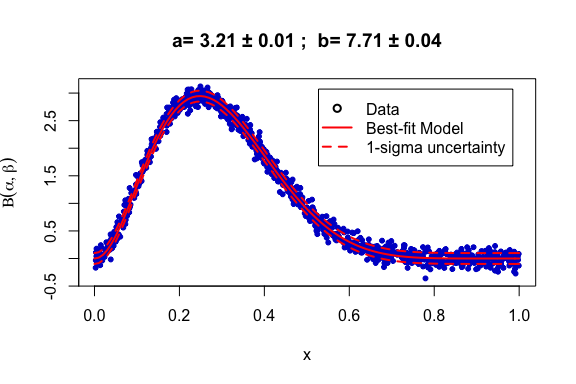

We can use the “magicaxis” package, which provides a layer on-top of
base plotting to optimise how figures are styled:

``` r
#Plotting in R with magicaxis
library(magicaxis)
#Plot the scatter plot with a title 
magplot(x,y,ylab=expression(paste('Beta'(alpha,beta))),xlab='x',pch=20,col='blue3',
        main=paste("a=",round(digits=2,best_R[1]),"±",round(digits=2,best_R[3]),"; ",
                   "b=",round(digits=2,best_R[2]),"±",round(digits=2,best_R[4])))
#Overplot the best-fit model line
lines(model.x,model.y,col='red',lwd=2,lty=1)
#Overplot the uncertainty region
lines(model.x,conf.int[,1],col='red',lwd=2,lty=2)
lines(model.x,conf.int[,2],col='red',lwd=2,lty=2)
#Add a legend
legend('topright',legend=c('Data','Best-fit Model','1-sigma uncertainty'),
       pch=c(1,NA,NA),lty=c(NA,1,2),col=c("black","red","red"),lwd=2,inset=c(0.05,0.05))
```

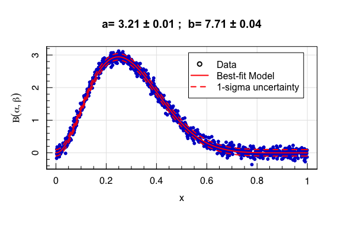

Here is our equivalent plot in **python** using matplotlib:

``` python
#Plotting with matplotlib in python 
import matplotlib.pyplot as plt
#Do the standard scatter plot 
plt.scatter(r.x,r.y,label='Data')
#Overplot the best-fit model line 
plt.plot(model_x,scipy.stats.beta.pdf(model_x,best_py[0],best_py[1]),color='r',label='Best-fit Model')
#Overplot the uncertainty region 
plt.plot(model_x,scipy.stats.beta.pdf(model_x,best_py[0],best_py[1])-r.sigma,'--',color='r',label='1-sigma uncertainty')
plt.plot(model_x,scipy.stats.beta.pdf(model_x,best_py[0],best_py[1])+r.sigma,'--',color='r')
#Add a title 
plt.title("a="+str(np.round(best_py[0],2))+"±"+str(np.round(sigma_py[0,0],2))+"; "+
          "b="+str(np.round(best_py[1],2))+"±"+str(np.round(sigma_py[1,1],2)))
#Add a legend 
plt.legend()
```

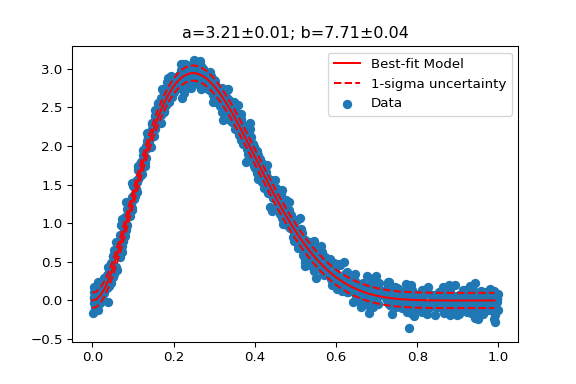

Finally, as a demonstration of the available plotting tools in R, I’m
again going to exploit the “example” tool…

Here we have an example of sky-plots with *magicaxis*:

``` r
#Sky-plots in R with magicaxis
example("magproj")
```

``` out
## 
## magprj> # GAMA fields:
## magprj> par(mar=c(0.1,0.1,0.1,0.1))
## 
## magprj> magproj(c(129,141), c(-2,3), type='b', projection='aitoff', centre=c(180,0),
## magprj+ fliplong=TRUE, labloc=c(90,-45), col='red', labeltype = 'sex', crunch=TRUE)
```

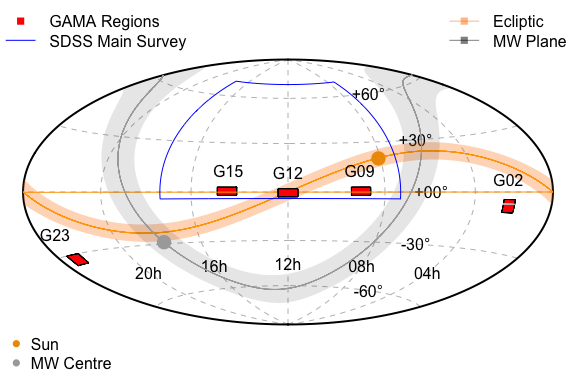

``` out
## 
## magprj> magproj(c(211.5,223.5), c(-2,3), col='red', add=TRUE)
## 
## magprj> magproj(c(30.2,38.8), c(-10.25,-3.72), col='red', add=TRUE)
## 
## magprj> magproj(c(30.2,38.8), -6, type='l', add=TRUE, col='grey')
## 
## magprj> magproj(c(339,351), c(-35,-30), col='red', add=TRUE)
## 
## magprj> magecliptic(width=10,col=hsv(1/12,alpha=0.3),border=NA)
## 
## magprj> magecliptic(width=0,col='orange')
## 
## magprj> magMWplane(width=20,col=hsv(v=0,alpha=0.1),border=NA)
## 
## magprj> magMWplane(width=0,col='darkgrey')
## 
## magprj> magMW(pch=16, cex=2, col='darkgrey')
## 
## magprj> magsun(c(7,26), pch=16, cex=2, col='orange2') #An important date!
## 
## magprj> magproj(c(174,186), c(-3,2), col='red', add=TRUE)
## 
## magprj> #Plus SDSS:
## magprj> magproj(c(110,260), c(-4,70), border='blue', add=TRUE)
## 
## magprj> magproj(c(35,135,180,217.5,345), c(-3.72,3,2,3,-30)+10, type='t',
## magprj+ plottext=c('G02','G09','G12','G15','G23'), add=TRUE)
## 
## magprj> legend('topleft', legend=c('GAMA Regions','SDSS Main Survey'), col=c('red','blue'),
## magprj+ pch=c(15,NA), lty=c(NA,1), bty='n')
## 
## magprj> legend('topright', legend=c('Ecliptic','MW Plane'), col=c(hsv(c(1/12,0), v=c(1,0),
## magprj+ alpha=0.5)), pch=c(15,15), lty=c(1,1), bty='n')
## 
## magprj> legend('bottomleft', legend=c('Sun', 'MW Centre'), col=c('orange2','darkgrey'), pch=16,
## magprj+ bty='n')
```

Or image plotting a colour image with *magicaxis*:

``` r
#Sky-plots in R with magicaxis
library(FITSio)
example("magimageWCSRGB", run.dontrun = TRUE)
```

``` out
## 
## mWCSRG> image=readFITS(system.file("extdata", 'VIKING/mystery_VIKING_Z.fits', package="ProFound"))
## 
## mWCSRG> #Convenient image plotting for lists containing headers:
## mWCSRG> 
## mWCSRG> magimageWCS(image$imDat, header=image$hdr)
```

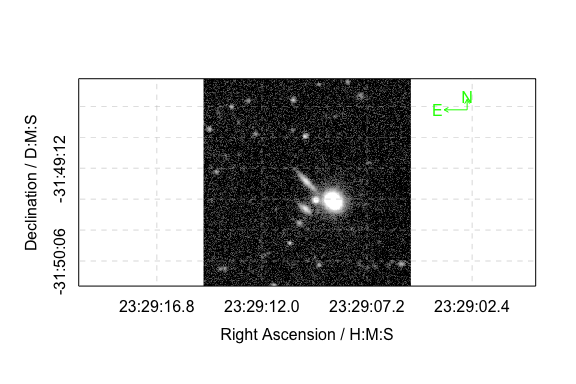

``` out
## 
## mWCSRG> magimageWCS(image)
```

``` out
## 
## mWCSRG> #First using the outer margins for tick labels:
## mWCSRG> 
## mWCSRG> par(mar=c(3.1,3.1,1.1,1.1))
## 
## mWCSRG> magimageWCS(image)
```

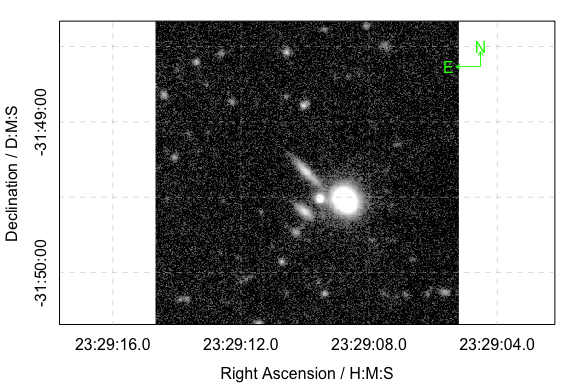

``` out
## 
## mWCSRG> magimageWCS(image, coord.type='deg')
```

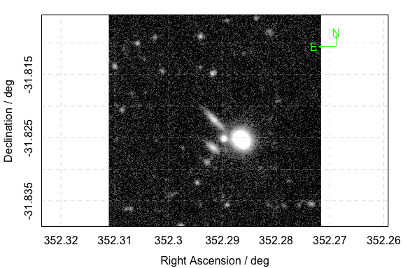

``` out
## 
## mWCSRG> #Now removing the margins and putting labels inside the image:
## mWCSRG> 
## mWCSRG> par(mar=c(0,0,0,0))
## 
## mWCSRG> magimageWCS(image, margin=FALSE)
```

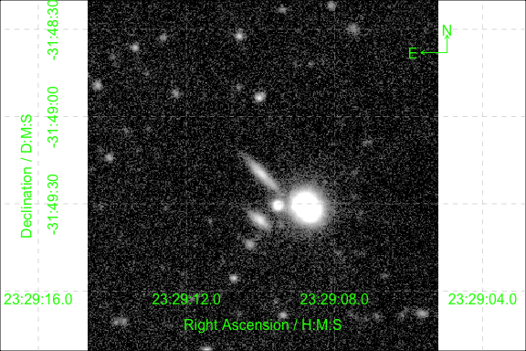

``` out
## 
## mWCSRG> magimageWCS(image, margin=FALSE, coord.type='deg')
```

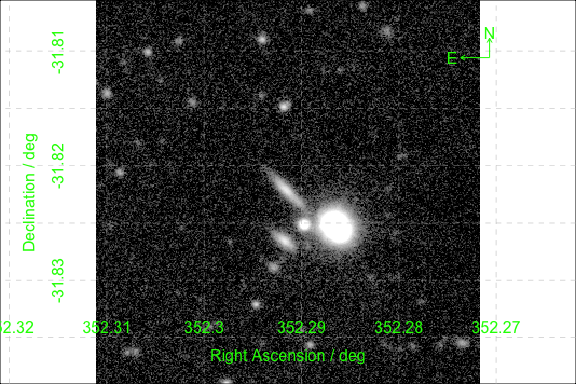

``` out
## 
## mWCSRG> #We can make a WCS colour image of mismatched images:
## mWCSRG> 
## mWCSRG> VISTA_K=readFITS(system.file("extdata", 'VISTA_K.fits', package="magicaxis"))
## 
## mWCSRG> VST_r=readFITS(system.file("extdata", 'VST_r.fits', package="magicaxis"))
## 
## mWCSRG> GALEX_NUV=readFITS(system.file("extdata", 'GALEX_NUV.fits', package="magicaxis"))
## 
## mWCSRG> magimageWCSRGB(VISTA_K, VST_r, GALEX_NUV)
```


``` out
## 
## mWCSRG> magimageWCSRGB(VISTA_K, VST_r, GALEX_NUV, saturation=0.5)
```

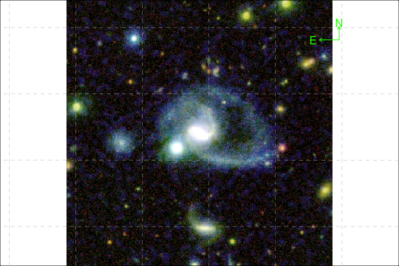

``` out
## 
## mWCSRG> #To make direct magimageRGB plots of the outputs you must turn off magmap scaling:
## mWCSRG> 
## mWCSRG> temp=magimageWCSRGB(VISTA_K, VST_r, GALEX_NUV)
```


``` out
## 
## mWCSRG> magimageRGB(R=temp$R, G=temp$G, B=temp$B, magmap=FALSE)
```


``` out
## 
## mWCSRG> #We can map onto various WCS schemes easily too:
## mWCSRG> 
## mWCSRG> magimageWCSRGB(VISTA_K, VST_r, GALEX_NUV, VISTA_K$hdr)
```

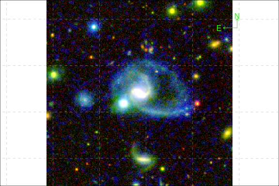

``` out
## 
## mWCSRG> magimageWCSRGB(VISTA_K, VST_r, GALEX_NUV, VST_r$hdr)
```

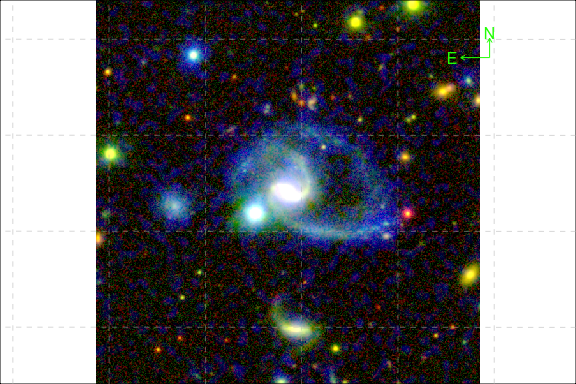

``` out
## 
## mWCSRG> magimageWCSRGB(VISTA_K, VST_r, GALEX_NUV, GALEX_NUV$hdr)
```

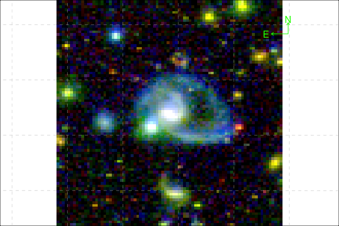

Finally, here’s an example of the default plot for data frames in R:

``` r
#Data frame plots in R 
#Make a data frame with random gaussian data
cat<-data.frame(X=rnorm(1e3))
#Add some spuriously correlated variables 
cat$Y<-cat$X+rnorm(1e3,sd=0.5)
cat$Z<-cat$Y^2+rnorm(1e3)
#Include a character variable, just because we can
cat$Str<-sample(LETTERS[1:5],1e3,replace=TRUE,prob=c(0.05,0.5,0.2,0.15,0.1))
#This is our data
cat
```

``` out
##                  X            Y            Z Str
## 1     0.3770401800  0.078027138  1.316253558   C
## 2     0.2216067387 -0.684462720  0.383819486   C
## 3    -0.0998030113 -0.181049067 -0.902474471   B
## 4    -1.0094761552 -1.460223617  2.630086876   E
## 5    -0.6870717578 -0.745839978  1.277415190   B
## 6    -0.4156203843 -1.097942929  2.511945773   E
## 7    -0.0684604666 -0.036788350  0.669011638   D
## 8     1.5132369065  0.678726667  0.423148068   B
## 9    -2.2565961830 -2.735243145  8.069938552   C
## 10    0.2141732752  0.420410764 -0.409203833   E
## 11   -1.2519177908 -1.890096264  2.778191306   B
## 12    0.2797530078  0.936066516  0.800396477   B
## 13   -0.1501132241  0.084523902  1.022803550   B
## 14    0.4967476975  0.596357980  1.386070715   C
## 15   -1.3463748909 -1.704716351  2.916871897   D
## 16   -1.2481578672 -1.637331025  3.028365191   B
## 17   -0.1897489669 -0.514947681 -0.064129288   C
## 18    0.5684351853  0.116365234 -0.447161689   B
## 19   -2.2548739771 -1.948023963  3.526981365   A
## 20   -1.2695060351 -1.694572596  2.544647776   B
## 21   -1.6357550994 -1.120731856  1.106377685   B
## 22   -0.1507600883 -0.413183224 -0.384476154   C
## 23    1.5575207758  1.731235367  2.907542718   E
## 24   -0.3218716529 -0.347317771  0.267860152   D
## 25   -0.7804959286 -0.274827701 -0.344796695   C
## 26    0.5217429502  0.403571601 -0.019822870   C
## 27   -0.2662176001  0.259340597  0.571558776   D
## 28   -0.2027629827 -0.246514512  0.722274972   D
## 29    1.5817260448  1.700285222  2.300945109   E
## 30   -0.0372563202 -0.271577895  0.636222125   D
## 31   -0.3958643575 -0.612604479  0.415789263   E
## 32   -0.5329550721 -1.166017026  0.895683830   B
## 33    0.1657843974  0.394749650  0.327489761   C
## 34   -0.8103750742  0.354935060 -0.192894495   C
## 35    0.7698415759  0.754623514  0.865387450   D
## 36   -0.2106218835 -0.564206066  0.993305772   E
## 37    0.4373385997 -0.487798670  2.422017436   C
## 38   -0.9868617238 -0.735765088  1.621097451   B
## 39    0.0621843688 -0.770360946 -0.042498028   B
## 40    2.8365235891  3.324855506 12.020813127   A
## 41   -1.1987341534 -1.508537183  2.522427337   D
## 42    0.9974867975  0.568606766 -0.439943960   D
## 43   -0.5113294052 -0.989111174  1.076761661   C
## 44    0.3966270540  0.644323528  1.589829078   D
## 45    0.2129965993  0.523204204  0.923655173   D
## 46    0.3663245799  0.349946605  0.208515128   B
## 47    0.0333398500 -0.004091839 -1.502143606   B
## 48    0.5151113997  0.357022686 -1.122881402   C
## 49    0.3745586748  0.519344635  2.516154090   D
## 50   -0.5570442882 -0.187189167 -0.421440227   D
## 51   -1.5544648482 -1.438961885  3.183229402   A
## 52    0.4423746133  0.256898742 -0.505437304   B
## 53   -0.5991604832 -0.581799701  2.999134529   B
## 54    0.2147620606  0.731436893  1.124052691   E
## 55    0.0403568954 -0.887238573 -0.254701408   C
## 56   -0.2846519158 -0.343971685  1.739343834   C
## 57   -0.3744854256 -0.629426744 -0.198606125   B
## 58   -1.6991732392 -0.792418957  0.120291516   B
## 59   -2.6187097109 -3.294831784 10.645038317   D
## 60   -0.5116858110 -0.269202582  0.687307861   B
## 61   -2.1205582693 -1.443254239  0.307006237   C
## 62    0.5686443012  0.955555203 -0.927214607   B
## 63    1.5804914397  1.766460338  4.048451614   B
## 64    0.3355555248 -0.164290122  0.394135304   B
## 65    1.0933348804  0.490767393 -1.521458311   C
## 66   -0.3240859775 -0.827026525 -1.401034160   B
## 67    0.4558961302  0.263640479 -0.304881496   E
## 68    0.1946666269  0.530320935  0.822254360   D
## 69   -0.9474152474 -0.398987381  1.429266359   B
## 70    0.3662294283  1.292872480  1.602905323   B
## 71    0.2128197635  0.169169421  0.361164190   C
## 72    1.7147872242  1.371678415  0.895862675   B
## 73    0.0692052056  0.030037003  0.295698846   E
## 74    0.7706828683  0.363027144  1.463847915   B
## 75    0.4862344282 -0.043978725  1.327993926   B
## 76    1.8028248886  1.954661764  5.019260225   D
## 77   -0.6329674634 -0.779621245  1.508085737   B
## 78    0.1152775942 -0.371787537 -0.954780639   B
## 79   -1.0936639960 -1.123897678  1.750733222   C
## 80    1.7276968138  2.041789035  6.380729523   C
## 81    1.6684132103  0.867499903  0.161412742   D
## 82    0.6391656190  0.444191360 -1.101228058   E
## 83    0.2868449961  0.438493121  1.020333491   C
## 84   -2.2133255943 -1.546872041  2.263195865   B
## 85   -1.0660598879 -0.923512354  0.015568518   B
## 86    0.5349038367  0.126336357  0.894352409   D
## 87    0.5162181985  0.475567468  0.534027065   B
## 88   -1.2730731880 -0.934924063  0.068277588   C
## 89    0.3920201249 -0.083466581 -0.218902689   B
## 90    0.5808964919 -0.333918819 -0.039700451   C
## 91    1.2573689546  1.284334602  3.531243725   B
## 92   -0.4403107440 -1.153049959  0.865760609   B
## 93   -0.8674428530 -0.740017903  0.293782866   C
## 94   -0.5173407753 -0.562726481 -0.369403967   C
## 95   -0.6087478040 -0.651500702 -0.548344602   C
## 96    1.2037273828  1.639840268  4.655991477   B
## 97   -0.6880223302 -0.984113019 -0.460668992   B
## 98   -1.2015051273 -2.713508942  5.040232480   B
## 99   -1.3612290829 -1.476484062  2.664825529   B
## 100   1.3185079701  1.473122012  1.978373695   A
## 101   0.4207124708 -0.160783504  0.360358492   E
## 102   0.4282111093  0.590017154  1.209166629   B
## 103   0.8474084007 -0.031996002 -1.654349840   C
## 104  -1.6426062758 -2.286973227  5.666891258   B
## 105   0.6760891175  0.710288324  0.387826863   B
## 106   1.0922347387  1.010847753 -0.334927381   C
## 107  -1.7393765466 -2.149249571  4.572533898   B
## 108   0.0248565261  0.868545898  1.369532226   B
## 109  -0.4365999146 -0.150324698  0.107034464   E
## 110  -2.2978341107 -1.897183425  3.169758687   B
## 111  -0.0707646110 -0.555468531  0.585947384   C
## 112  -0.2011585897 -1.092903870  0.985728708   B
## 113   0.9179469923  0.409650903 -3.125063101   B
## 114  -1.4804733119 -1.477291623  2.126818572   B
## 115  -0.3782876927  0.553968522  1.420865840   D
## 116   1.1572865902  1.288223684  0.950076627   B
## 117   0.3654372265  1.121237756  1.228726810   B
## 118  -1.3867675146 -0.870980228 -0.989670852   B
## 119   1.0260313147  0.713062634  0.472444599   A
## 120  -1.4832568222 -1.834193696  2.674548460   B
## 121   0.4531122371 -0.103000062 -1.159893465   E
## 122  -0.8880862387 -0.963763309  0.125562967   E
## 123   1.5107835948  1.769594092  2.943030666   B
## 124   1.8210782874  1.769968069  3.336908861   B
## 125  -1.0535103441 -0.843540771  0.834959457   B
## 126  -0.6760156860 -0.653861804  0.972070234   E
## 127   1.7564294399  2.212125247  4.801038916   A
## 128   0.7599053224  0.296695104  1.305961592   B
## 129  -1.8852242384 -1.749701506  3.186490216   D
## 130   0.6026844256  0.152787674 -0.311596644   C
## 131  -1.6712883422 -1.336729979  0.828481628   B
## 132  -0.2620180693 -0.562433591  1.169990942   D
## 133   0.3106190059  0.890551469  0.935627308   C
## 134   1.8281974869  3.061783270  6.982162018   B
## 135  -1.7209493799 -2.990676166  9.040912350   B
## 136  -0.5057638627 -0.750666025  0.095202817   E
## 137  -0.7279562176 -0.570470175 -0.326114999   A
## 138   1.8801013737  2.395648640  5.354937072   D
## 139   0.6195206138  0.638401627  0.791610912   C
## 140   0.5925665799  1.181314184  0.801227826   B
## 141  -0.6584222249 -0.709268323 -0.057650989   D
## 142   1.2376033220  1.169257079  1.423061881   C
## 143  -0.8735600193 -1.636885117  4.631714296   B
## 144   0.0294285414 -0.263347327 -2.710329150   D
## 145   0.2380956567 -0.119814651  1.601077142   E
## 146  -0.4479324463  0.050899204 -0.729996409   B
## 147   1.5996477246  0.583368929  2.073704431   B
## 148  -1.4669172566  0.004996512  0.066093172   A
## 149  -0.4211319265  0.533131634 -0.144704698   B
## 150  -0.3678869602 -0.460357610  1.020109702   C
## 151  -0.1918207199 -0.935905605  3.522843899   B
## 152   0.3564473462 -0.482326415  0.370094795   B
## 153   0.1078392598 -0.666881017  1.745094329   D
## 154  -0.1383138786  0.652106721 -0.730400724   B
## 155  -0.9234665996 -0.724726761  0.253205658   B
## 156   0.0470306512 -0.739137799  0.353026024   B
## 157  -0.1647063535  0.755796515 -1.014253635   B
## 158   0.1692233846  0.772194741 -0.256380361   B
## 159  -0.0067534443  0.290253708  0.120233806   B
## 160  -0.2081728823 -0.403180691  0.532978113   A
## 161   1.8214652989  1.873824734  3.439131321   C
## 162   0.2028101738  1.285742865  1.907024171   B
## 163   0.5199352926  1.290987002  2.405646339   B
## 164  -1.5883744363 -1.301427113  2.753000443   B
## 165  -0.1288521053  0.213514695  0.538287392   C
## 166   0.7744558248  0.640711255 -0.081636015   B
## 167  -0.1652331776  0.018524870  1.480617297   C
## 168   0.7126428620  0.593895501  0.100041271   B
## 169   0.3600685657  0.250343726 -0.931541239   B
## 170   0.9096565621  1.669059126  2.688966411   B
## 171   1.0357214773  0.186951773 -0.419447440   B
## 172   0.7770232539  1.306205651  0.914471968   B
## 173   0.4994973490  0.948887630  1.726519880   B
## 174  -0.1141213088 -0.700669161  1.206662588   B
## 175  -0.1878086240 -1.057192402  0.925409839   B
## 176   2.1889014969  2.729214821  6.778913370   B
## 177  -1.2679382340 -0.992267242 -0.869328961   A
## 178   1.8326180784  1.875050483  2.447588879   B
## 179   0.1029426083  0.052369604 -0.055328868   D
## 180   0.1139325076 -0.147921833  1.170092663   E
## 181   1.1948938441  1.074588336 -0.570893134   B
## 182  -1.9778709170 -2.210931977  5.583053250   D
## 183   1.4713158332  0.890661797  0.680496216   D
## 184   0.4697996881  0.396136657  0.571406244   D
## 185   0.8686251134  1.317368277  1.748578997   B
## 186   0.7026241730 -0.287386865  0.112846390   C
## 187  -1.4013288483 -1.436891301  1.296450582   B
## 188   1.1215360027  0.883828668 -0.445790244   E
## 189  -1.5242179976 -1.836545101  3.444270640   B
## 190   0.6857294210  1.040048124  0.618746306   A
## 191  -0.5048271528 -0.335627970 -0.158787043   B
## 192   0.8930156899  0.377703330  1.627650767   B
## 193  -0.5965032877 -1.515479383  2.423081152   B
## 194   1.2739197982  1.238444744  1.283562568   D
## 195   0.2288670868  0.867270408 -0.414529209   B
## 196  -0.8330580613 -0.986449407 -0.186320423   B
## 197   0.3226654938  0.428208891 -0.119093844   B
## 198  -0.3992284800  0.291443178  0.589881712   B
## 199   0.0998237019  0.261160352 -0.075675108   C
## 200   1.8251473951  1.233321522  2.420521817   B
## 201  -0.0713817959 -1.306100684  0.995530864   B
## 202   0.0076291252 -0.325125147 -0.691147952   E
## 203   1.9380016619  0.997912836  1.930740618   E
## 204   1.7629973131  1.201990648  1.539456962   D
## 205  -0.1177170924  0.169341291  1.113456914   E
## 206   0.0721758590  0.505926163  1.716523000   B
## 207  -1.2640955303 -1.160377528  2.759805709   B
## 208  -0.7324361101  0.102320989 -0.509902054   B
## 209  -0.1240290336 -0.408250143  0.105333871   B
## 210   0.8869877557  0.449021318 -1.405682981   C
## 211   1.2648727918  1.819686524  1.930973189   B
## 212   0.3734540792 -0.074071863  1.671317862   B
## 213  -2.2717387405 -2.315376205  4.219293606   B
## 214   0.4972498530  0.097679812 -0.778256345   C
## 215   0.3085487402  0.175093281 -0.809029629   E
## 216   1.6487014359  1.376791889  0.986911443   E
## 217  -0.9226417399 -0.301613678  0.233453846   B
## 218   0.9580965539 -0.024444905  0.741434263   B
## 219  -0.3174814087  0.365959770  0.586420894   A
## 220  -0.7103302867 -1.665361104  3.522148998   B
## 221   0.4681721461  1.397311192  1.468221692   B
## 222   1.2777801030  0.870959316  2.180306505   B
## 223  -1.2209649579 -1.737677449  3.461882104   C
## 224  -0.4454749258 -0.006232513  1.238596741   B
## 225  -1.4694555437 -0.456739248 -0.309732860   E
## 226  -1.0755783487 -1.062371621  2.324568094   D
## 227  -0.1506321874 -0.352577873 -0.207902952   E
## 228   0.4490331279  0.366150832 -0.013041400   D
## 229  -0.9024088912 -0.760444138  0.738788458   B
## 230  -0.1246480523 -0.941464040  0.271169143   B
## 231   2.1601323767  3.182499386 11.565637090   C
## 232  -0.1799246310 -0.702322582  0.870080434   C
## 233  -2.7823712610 -2.641426010  7.581874214   C
## 234  -1.1005109893 -1.230370988  1.665585360   B
## 235  -1.0040258390 -1.499159817  2.495298830   C
## 236  -1.5681512945 -1.756717289  4.582010768   C
## 237  -0.2779304841 -0.494068877  0.548207793   C
## 238  -1.0676125253 -1.045268527 -0.181661903   E
## 239  -0.3825829516 -0.714390633  0.905594055   B
## 240  -0.0349257126  0.092223774  0.863674690   B
## 241  -0.3935165798 -0.237951261  0.538042265   C
## 242   0.7295550527  1.285184390  2.764565019   B
## 243  -0.4704586841  0.143425888 -1.901731292   B
## 244  -0.3741163716  0.447516576  2.801325831   D
## 245  -1.3648410928 -1.247101445  0.322043122   A
## 246   0.0035226744  0.023179047  0.588325585   C
## 247   2.2936599035  2.714311305  8.081266326   B
## 248  -1.4472804315 -1.722676913  3.137588248   C
## 249   0.3251332640  0.232456876  0.958507505   C
## 250   0.1974982096  0.809570945  0.715580999   C
## 251   0.6848578545  1.145108327  2.694173533   B
## 252   0.6230088683  0.905698054  0.200625841   A
## 253   1.5412704420  0.582413863  1.187687101   B
## 254  -2.6888125434 -2.733007332  5.385414809   B
## 255   0.3501040483 -0.077180004  0.040778560   B
## 256  -0.3726361498 -0.666385621  0.018640045   B
## 257   0.0344756907 -0.167565552 -0.307827252   D
## 258  -1.0138546642 -0.838727596 -1.077819297   C
## 259  -0.1454603665 -0.681668778  2.778788035   A
## 260   0.4708178692  0.173693234 -1.667184013   D
## 261   2.3152538991  2.050805175  3.791501790   B
## 262   0.8573477215  0.523949112  0.228241025   D
## 263  -0.8237712520 -0.217467781  0.188121534   C
## 264   0.6535129237 -0.464587695  0.800262291   B
## 265  -1.0817804947 -1.172579950  0.836071972   B
## 266   3.3142108717  3.231936288 10.264291354   B
## 267  -1.4772619112 -1.716219775  3.725763163   B
## 268  -0.7455835781 -1.515663508  2.418978749   D
## 269   0.0642415384  0.344852783  0.217718562   D
## 270   0.1133221659  0.191949632  0.620685026   D
## 271   0.5222723593  0.291994542  2.269831000   B
## 272  -1.7554295664 -1.792313730  2.242462530   B
## 273   0.3172319854 -0.370745329 -2.041920224   B
## 274   0.6112405066  0.604641264 -0.074074773   B
## 275   0.1010095103 -0.739769009 -0.129712847   A
## 276  -0.3507032599 -0.878296367  0.735562340   A
## 277  -0.0489874152  0.182621709 -0.099633912   D
## 278  -1.0632077940 -0.298581095  1.666005038   C
## 279  -0.0621111589 -0.344414138  1.385968890   B
## 280  -0.3357355324  0.113537331 -0.464977826   C
## 281  -1.1541486366 -0.796543570  1.330096112   D
## 282  -0.7746870070 -1.242885114  2.593738260   B
## 283   1.1753211344  1.035150170 -0.763910203   D
## 284   0.0005089939  0.381477509  0.486734279   B
## 285   0.8042034009  1.020265884  0.185967234   A
## 286   0.1878217187  0.532658393  0.102495978   C
## 287  -0.6870788758 -1.001581626  0.182073960   D
## 288   0.1605953457 -0.504952428  1.777410908   B
## 289  -0.0456684257  0.035593336 -0.721280073   C
## 290   0.4467295464  0.310567239 -0.811498420   C
## 291   1.3304191920  1.271721758  1.522564500   B
## 292   0.2509225489 -0.732731608  0.248575785   B
## 293   0.6617333806 -0.065465816 -0.187449474   B
## 294  -0.4042944298 -1.155857509  0.788442000   A
## 295  -0.5368764990 -0.058293668 -1.052305784   B
## 296   1.4696100213  1.896014787  4.030476648   D
## 297   0.3727176999  0.389859230  0.816613773   B
## 298  -0.4816663801  0.776888144 -0.034599703   C
## 299   0.3719746501  0.127017939  0.729997749   A
## 300   0.1030530737  0.219645651 -0.391601632   D
## 301  -1.2510311697 -1.546652729  3.307897348   C
## 302  -1.0886150515 -1.463312770  2.519045934   D
## 303   0.3332153232  0.668291021  0.267237213   A
## 304   0.0181455191  0.140595413  1.770837709   C
## 305   0.8843600561  0.786112864 -0.014298757   B
## 306   0.3929809345  0.068835565 -0.210389788   B
## 307  -0.3141194642 -0.378684454 -0.001565943   D
## 308   0.9641445161  0.231172088 -0.940686603   B
## 309  -2.0880440516 -1.404660263  1.670093094   C
## 310  -0.6127609944 -0.613563198 -0.315097659   E
## 311  -0.6982220960  0.101712573 -0.537554926   B
## 312   0.9600261280  0.509497640  0.049090662   B
## 313  -0.0111856027  0.067324159 -0.592528301   C
## 314   2.2373420924  1.974177707  3.835617792   C
## 315  -0.0315127721 -0.737882760  1.290097584   B
## 316  -0.2656977059 -0.521386906  0.204695332   B
## 317  -0.8684124118 -1.157612801  0.686114380   D
## 318   0.5574528230  0.864301063  1.400103101   E
## 319  -1.0966316239 -1.426696569 -0.003417848   C
## 320  -0.6828299994 -0.206640002  0.374373811   D
## 321   0.4485739765  0.217381491 -0.237280342   C
## 322  -1.7318759996 -1.213894332  2.663870068   B
## 323   0.8557347430  0.702786985  1.698825142   B
## 324  -0.5679827050 -0.576125453  1.708973572   C
## 325  -1.8118489000 -1.969164200  3.697058187   C
## 326  -1.8278704504 -1.798034066  3.107860027   B
## 327  -0.3879574729 -0.377496060 -0.487916141   B
## 328  -0.5217327666 -0.959067780  2.300082730   D
## 329  -1.2829027534 -2.295924306  4.238679409   A
## 330   1.3135743962  0.702746311 -2.250883497   E
## 331  -0.1892177964 -0.643225099  0.729916001   D
## 332   0.2348896196  0.196283576  0.747009742   B
## 333  -1.5990267226 -1.963697253  4.302155840   B
## 334   0.0636864155 -0.406971443  1.666674332   B
## 335   0.0326684402  0.049818098  0.166967727   E
## 336   1.4524091340  2.059172880  2.515920486   B
## 337  -0.8064376924 -0.507513302  0.949120571   B
## 338  -0.1921399218 -0.950951144  1.487570413   D
## 339  -0.8592774499 -1.007651114 -0.292628564   B
## 340   0.2153201345 -0.540068112 -0.595347853   C
## 341  -0.7634339708 -1.165300018  2.031058107   B
## 342  -0.8866219905 -0.611356425 -1.182134646   D
## 343  -0.0657647293 -0.096030953 -1.509041119   B
## 344   0.3003334083  0.845054106  0.080642509   E
## 345  -0.2308590031 -0.397299827 -0.177989695   C
## 346   0.4478731974 -0.133964788 -0.366864268   D
## 347  -0.0028452032  0.269191537  0.010721460   B
## 348  -0.2478024899  0.363050018  0.066739518   B
## 349  -0.5251175929 -1.027628392  1.159409491   E
## 350   0.4884873088  0.025231327  1.378811628   D
## 351   0.1383891171  0.408171660  0.704705204   B
## 352   0.8470038640  0.976476737  0.406217070   B
## 353  -0.0337351418  0.336750155 -0.886893933   E
## 354  -0.9256342060 -0.598957877  0.176715250   D
## 355   0.5542432108 -0.164198462 -0.212729204   B
## 356   0.5366548190 -0.426692426 -0.222040914   B
## 357  -0.1535700500 -0.494306405  2.006751755   E
## 358   0.5535883609  1.173066212  1.376512696   B
## 359  -0.8832578195 -0.881290138  1.387380579   B
## 360   0.0794928679  0.394469524 -1.052040101   C
## 361   0.0700776674  0.417397049 -1.101931282   C
## 362  -0.1872419621  0.388535629  1.192484057   B
## 363  -0.8046350857 -1.087110730  2.388823895   C
## 364   1.2631328101  1.375835626  2.638298219   E
## 365  -0.0206707127  1.405960589  1.229991396   B
## 366  -0.4308044035 -0.915947069  1.690734197   C
## 367   1.5755292182  1.559935579  2.284804474   B
## 368   0.2949255698 -0.144791586  0.178700353   D
## 369  -1.1340660701 -2.274686159  5.828459674   B
## 370  -1.7747342452 -1.386047846  1.608213705   C
## 371  -0.9937528143 -1.288157226  1.074601136   B
## 372  -0.4874760457 -0.229823086 -0.248169800   C
## 373   1.4450898610  1.611775533  4.227004550   B
## 374  -0.0849964010  0.017945580 -0.153570599   B
## 375   0.0785520377 -0.388128083 -0.922919974   B
## 376   0.2701584479  0.380386618 -1.484940237   C
## 377   0.7780082372  1.066974284  0.455505787   B
## 378  -0.0003756404 -0.311857799 -0.369711827   D
## 379   0.4436948881  0.173622122  0.259918518   D
## 380   0.6296549809 -0.140612274 -0.332560879   B
## 381  -0.5131360896 -0.338748666  0.963861945   B
## 382   1.4675996889  2.177762712  4.452027277   C
## 383  -0.4020369801  0.179324598  0.991459311   B
## 384   1.3094215278  1.557742306  1.748429153   E
## 385  -0.1433297666 -0.705053667  1.461382353   C
## 386  -0.1630012682 -0.227060625  0.625273479   B
## 387   0.4117741288  0.560910492  0.728303379   B
## 388   0.9591364817  0.895467919  1.982596872   C
## 389   0.7029543466  0.653325383 -0.791009354   D
## 390   1.8854054038  0.736485028  1.695677888   C
## 391   1.3162734774  2.114746969  3.178219590   D
## 392   0.7756906059  0.325312303 -1.368278540   E
## 393   1.4100672136  0.527907512  2.455782438   B
## 394  -1.4680060330 -1.920154709  3.547834178   B
## 395   0.0940301736  0.325892271  0.329961877   D
## 396  -0.7344566977 -0.021626008 -0.129760527   A
## 397   2.0914755886  2.050715446  2.745129153   B
## 398   0.1105647273  0.019556937 -1.323290687   B
## 399  -0.3364084886  0.656889682 -0.979756637   E
## 400  -0.9155048514 -0.766921300 -0.132053326   A
## 401   0.5413993697  1.555908841  2.261513062   D
## 402   0.5424122521  0.967676308  0.905358469   B
## 403   1.1595666974  1.263821306  1.908877456   B
## 404  -0.0131339406 -0.502748487  0.901623079   D
## 405  -0.4902001293 -0.764962089  0.586363606   B
## 406  -0.5660434602 -0.784677362 -1.695605623   D
## 407   0.6030547398  0.412453159 -1.377410691   D
## 408   0.3775773275  0.432524997  1.081008131   E
## 409   0.1914280054 -0.251317954  0.657774314   C
## 410  -0.5505748837 -0.966970479 -0.015980085   B
## 411   1.0749606727  1.665828744  2.041433779   B
## 412   0.8969649791  1.317264251  0.246027635   C
## 413   0.1886496172  0.791131725  0.274715619   B
## 414   0.4785520854  0.308455079 -0.887898181   B
## 415   0.0118713264 -0.201707824  0.928750174   A
## 416   2.4016116878  2.528522046  4.666989419   E
## 417   1.4528826016  0.458230799 -1.104920735   E
## 418   0.3689374334  0.845226614  2.174288757   B
## 419  -0.0158673910  0.402904252 -2.714724408   D
## 420  -0.7709511912 -1.171076173  0.583857363   A
## 421   0.9097892746  0.628493740  2.083947399   C
## 422  -0.2970036571 -0.455501815  0.774492955   B
## 423  -0.7264746007 -1.639496544  2.935990644   C
## 424   0.0086747705  0.322499604  1.280198730   B
## 425  -0.7138670168 -1.151873319  0.042119401   B
## 426  -1.0156308973 -1.155965174  1.971950492   B
## 427  -1.7708361933 -2.058939264  3.167136704   B
## 428  -0.7596390951 -1.002243947  0.187295330   C
## 429  -0.8985051709 -0.192498450 -0.017066190   D
## 430  -0.6200985707 -0.906387767  1.369075745   B
## 431   1.3288698491  1.035011270  2.143049518   B
## 432   0.0419198362  0.684454937 -0.294764601   B
## 433  -0.2687131493 -0.371723185 -0.590219123   C
## 434  -0.0961216206 -0.249047706 -0.737246339   B
## 435  -0.9175349586 -0.179224721  0.542402061   B
## 436  -0.4105154223  0.151878322  0.314364988   B
## 437  -0.0487499204  0.749006705  1.197970579   B
## 438  -0.8400411925 -0.049884305 -1.528196900   B
## 439   1.5801023767  2.203507668  5.035423515   D
## 440   0.0218761574 -0.595782000 -0.388297323   B
## 441   0.4145465663  0.779415066  1.280444099   B
## 442   0.4641035346  0.336622730 -0.851360991   B
## 443  -0.2133826875 -0.326653345  1.481663296   B
## 444  -0.7749718496 -0.471980971 -1.394127746   C
## 445   1.4535615245  1.666986541  2.708254736   C
## 446  -0.4720757516 -0.405501902  1.414747539   B
## 447   1.1009699078  0.793444744  0.677293736   C
## 448  -1.4065657865 -0.926477063  1.149235436   B
## 449   1.3184756126  0.477776465 -0.605860694   D
## 450   1.0039193163  0.563419362 -0.309189993   E
## 451   0.1705996704  0.056089138 -0.223164126   B
## 452  -1.1571634286 -1.747061779  3.438766704   B
## 453   0.2746913735 -0.407107497  2.476570654   D
## 454  -1.1997977395 -1.157024694  1.351806751   E
## 455  -1.8885767674 -1.436035948  2.237472805   B
## 456   1.0441304058  0.794350377  1.778739411   B
## 457  -0.4338243616  0.124101453  0.340249501   B
## 458   0.7590106925  0.553328624 -0.768193980   B
## 459   1.0510713336  0.723703558  1.288580036   C
## 460  -0.7096026042  0.021281807  0.193468134   B
## 461   0.0573356786  0.357671287 -0.336875409   D
## 462   1.5212134515  1.350702119  2.278050622   C
## 463  -0.2777049088 -0.137106974  0.209740892   E
## 464  -0.9435051053 -1.705716910  1.934845715   B
## 465   0.6868478320  0.823308946  0.063059030   C
## 466   0.0341800679  0.605166577 -0.602020415   C
## 467  -1.2786947508 -1.659931392  1.274053323   D
## 468   0.3717424076  0.299930301  0.858891175   B
## 469  -0.2679839477  0.237677566  1.461101544   B
## 470   0.1577515310  0.154278474  0.709836378   E
## 471   0.0814699960  0.145997517  0.848691454   A
## 472  -0.8112767228 -0.244308631 -1.519812004   D
## 473  -0.2864056469 -0.016677420  0.544995667   C
## 474   0.7059580973  0.949929270  2.377282918   E
## 475   0.2667624102  0.104749746  0.396044461   C
## 476   0.8245714030 -0.020813108  2.161839272   D
## 477   0.7459780411 -0.125660857  1.148757999   B
## 478  -0.2329907419  0.173558722  0.582748835   A
## 479  -0.0862428400 -0.152247747 -0.413662247   C
## 480  -1.4021357217 -1.622494184 -0.092993484   B
## 481  -0.4477794368 -0.329329590 -2.874122058   B
## 482  -0.0309178467 -0.636824454 -1.244841113   C
## 483   0.6124081925  0.643474406  0.825380418   B
## 484  -0.0346930768 -0.437992967 -2.005098736   B
## 485   1.0686679424  0.419179891  1.309358574   B
## 486   0.8082956863  0.506132664 -0.077210433   B
## 487   1.6092583141  2.409402546  5.662476934   A
## 488   0.3780723832 -0.179496814  0.005531711   C
## 489  -0.2804686015 -0.637641720  0.984953066   B
## 490   0.6641759266  1.053013826 -0.803544684   B
## 491   0.0145388611 -0.225680111 -1.287025085   B
## 492  -2.6181840136 -2.134021607  3.645593684   B
## 493  -1.3652813354 -1.708397849  2.111897878   D
## 494  -0.1423101149 -0.540579824  0.722923116   B
## 495  -0.0876573278  0.054930626 -0.394882765   B
## 496  -0.9197596000 -2.126490066  4.679055777   D
## 497  -0.0927375692 -0.752749803  0.289522960   B
## 498   0.6103711087  1.609497538  2.628419169   B
## 499  -1.3254130025 -1.093569569  3.041787322   E
## 500   1.3453823530  1.182276253  1.988207345   D
## 501   1.0685401818  1.442512872  2.272727137   E
## 502  -0.6518114560 -0.619969885  0.142071170   C
## 503   1.0051766799  1.324914793  0.812666792   C
## 504  -0.7847557784 -0.140111190 -1.390819430   C
## 505   1.6684410481  1.132007360 -0.380313370   D
## 506  -0.5256713192 -0.676062237 -0.415077453   B
## 507   0.9015057889  1.755503758  3.872969797   D
## 508   0.6705418637 -0.164490918  1.303417503   B
## 509  -1.5598721614 -1.820725428  3.761015197   B
## 510  -0.4868933852 -0.854580132  1.578073162   C
## 511  -0.1019620761  0.075836066 -0.250251673   B
## 512   0.1040743044  0.222306225  1.976199692   B
## 513   1.1871968828  1.705747724  5.314510273   B
## 514  -0.1596956160 -0.140657981  0.298948168   D
## 515  -0.1905684877  0.173535446  0.062047335   D
## 516   0.4452608359  0.181263223 -0.171002274   D
## 517  -2.0494277988 -2.997526909  9.889060420   B
## 518   1.3866687368  0.651743201  0.930147556   B
## 519   0.1145091290 -0.265623503  0.244320619   B
## 520   0.1647767848  0.811530235  0.470175244   C
## 521  -0.0399742051 -0.462764964  0.976077907   B
## 522   0.5359426020  0.642625682 -1.361578590   B
## 523   1.4388657985  1.430883987 -0.627517840   D
## 524   0.4916857069  0.057353319  1.685475835   B
## 525  -0.3658672563 -0.619064356  0.092676451   E
## 526   0.6876996801  0.866912883 -0.376309710   B
## 527   0.4889247159  1.225452182  1.345075883   B
## 528  -0.1911740065 -1.080396740  0.839011638   B
## 529   0.4802505001  1.268997930  3.291313850   E
## 530  -0.3026927378 -0.017190142  1.563006595   C
## 531   0.8815094612  0.742221489 -0.226353788   B
## 532  -0.6357764823 -0.309207983 -0.218765385   C
## 533  -0.1717307419  0.187968324  1.039221506   E
## 534  -0.1998644341 -0.604113296 -0.197727537   E
## 535   0.0503722171  0.283968922  0.709087312   A
## 536   0.4237731640 -0.038716505 -0.769972837   B
## 537  -0.6394545284 -1.732241443  4.442223631   D
## 538   1.2060327985  1.382632316  2.520403458   C
## 539   2.2852237476  2.247847202  4.017113690   A
## 540  -0.1443451660 -0.624579206 -0.392432293   C
## 541  -1.4213399754 -1.411487782  0.191775557   B
## 542  -0.3435851922 -0.340012986 -0.807883635   D
## 543   0.2837877061  0.976971728  1.332236475   D
## 544  -0.6677257185 -0.690663707 -0.214304466   E
## 545   0.2618260388  0.212941556  0.283732051   B
## 546  -0.2961918894 -0.203879698  0.158125355   C
## 547  -0.5115712459 -0.307823709 -1.038766586   C
## 548   0.2648999568  0.193530713 -0.017569104   B
## 549  -1.6596410989 -2.432676640  6.916162578   C
## 550  -0.8333984594 -1.871623354  3.912292048   B
## 551   1.8743944530  1.544675842  2.833175799   D
## 552   0.4784538893  0.497332138 -0.028845056   D
## 553   0.3874926055  0.636352580 -0.098148644   B
## 554  -0.9151084732 -1.376897245  1.380635415   B
## 555  -1.2299913818 -1.299554344  1.219266499   E
## 556  -0.8741605003 -1.120951358  1.455846114   B
## 557   0.3259901254  0.590295816 -1.163039329   C
## 558  -0.4285869645 -0.521854819  1.151730329   B
## 559  -1.0006500522 -1.707996339  3.243909120   D
## 560  -0.3645814299 -0.803189443  0.245481788   B
## 561   1.7550649163  2.356502570  6.082701655   B
## 562  -0.5422154790  0.113245218  0.348652601   B
## 563   0.0444603857  0.621101137  1.736378548   B
## 564   1.0949381061  0.370767354  0.887101412   E
## 565  -0.5622011683 -1.258004091  0.466579904   B
## 566   1.1400675041  1.226894433  1.367573958   E
## 567  -0.3082031268 -0.401457584  0.623845754   B
## 568  -0.9137860619 -0.648493302  0.186918964   C
## 569   2.1162804276  2.128519955  4.580358286   B
## 570   0.1705438772  0.556222620  1.484648818   B
## 571   0.6761094175  0.263724156  0.161453306   B
## 572   0.2199329340  1.337010914  0.579455982   B
## 573   1.1044140069  2.411665905  5.431868200   C
## 574  -2.3103687207 -2.822120241  7.765780203   B
## 575  -0.6267615424 -0.726308833  0.429928320   A
## 576  -0.5184125182 -0.975842622 -0.296351376   B
## 577   0.0936572236  0.368804838  0.462825364   D
## 578   0.0779621886  0.551097513  1.024519154   B
## 579  -0.6868612560 -1.328920122  0.755930215   B
## 580   0.7597409472  1.554239605  3.574613352   E
## 581  -0.2254213498 -0.387905177  1.926365950   C
## 582  -0.5778611012 -1.297669159  1.295344747   E
## 583  -1.8788785273 -2.505806000  4.417822697   D
## 584  -0.6943939616 -0.507966690  1.237069983   B
## 585   1.0570470358  1.031748885  1.317306118   B
## 586   1.3083760756  0.810087084 -0.048971485   B
## 587  -0.5526660937 -0.274679588  0.524625168   B
## 588   0.7097928011  0.802697793  0.155548469   C
## 589   0.5561585218  0.913138599 -1.296124980   B
## 590  -0.1715707948 -0.960623244  0.379906418   C
## 591   0.5193524983  0.098279211  1.743611336   B
## 592  -0.5728053769 -0.680220518 -0.185950590   B
## 593  -0.2479125349 -0.672852674 -1.349589131   D
## 594   0.1599102094 -0.672810405  2.153148972   D
## 595   0.5182433446  0.854498048 -0.768231724   B
## 596   0.2165501154  0.118122621  0.122842585   E
## 597   0.1356803961 -0.052329981 -0.283976316   D
## 598   1.3091322053  1.106029773  0.770754733   B
## 599   0.6958870257  1.388722618  2.101434707   D
## 600  -0.6031707610 -0.578702920  0.120017507   B
## 601   1.5291891311  1.111104038 -0.452220526   C
## 602   0.6641432025  0.778283884 -0.051928395   C
## 603   1.1954898488  0.951681421 -0.090371634   B
## 604  -0.0427197971 -0.350904580  0.499798086   B
## 605  -1.0511471617 -1.028882992  0.835293344   A
## 606  -1.2409462652 -1.227103890  2.004860820   C
## 607   0.1745726305 -0.251470111 -1.302671533   B
## 608   0.8988371227  0.747010294 -0.063941730   B
## 609   0.6950654944  0.457300709  0.005468819   B
## 610  -0.5788295635 -1.190586287  0.831937392   B
## 611   0.3441495938  0.065940115 -0.938438408   A
## 612   1.8400819555  2.413783171  5.525681244   A
## 613  -0.8532016986 -0.302197345  1.001547279   B
## 614   0.5644254114 -0.230810258  0.008668032   B
## 615   0.8090581602  0.240879264  0.037883841   B
## 616  -1.7175252844 -1.608761254  3.059568389   E
## 617  -1.2120250928 -1.730149960  2.127742908   B
## 618  -1.8078573193 -2.055151174  5.371205212   E
## 619  -0.2319522706 -0.056691043  1.653084531   B
## 620   0.3704228091  0.301031503 -0.190962756   B
## 621  -0.2552889151  0.489143606 -0.720828787   B
## 622  -1.0928534229 -1.402488951  1.790950585   C
## 623  -0.6037026873 -1.132390374  1.244597042   D
## 624  -0.6267957030 -0.939481712  0.396618965   C
## 625  -0.4964518934 -0.699160863  0.691661903   B
## 626  -0.6065107079 -0.088905476  0.761838274   B
## 627   0.6629100579  1.406531356  1.162757509   D
## 628   2.0203360097  2.273447271  4.794656465   C
## 629  -0.6062670756 -0.058273448  0.683959734   B
## 630  -2.1358984252 -2.208339358  5.785300136   B
## 631  -0.3130149963 -1.092013274  2.032630429   A
## 632   1.5590584983  0.973501963  0.966388273   C
## 633   0.4036734825  1.096134080  1.326254601   E
## 634   0.9734410705  0.785450227 -0.331555057   D
## 635   0.4843747169  0.849610808 -0.646832998   B
## 636   1.5367779930  1.569925527  2.800672616   C
## 637   0.8657375499  1.654605672  2.267181524   E
## 638   0.4558678300 -0.042160955 -0.693802070   C
## 639  -0.0373323872 -0.720443834  1.711888607   B
## 640  -0.3425662837 -1.190875809  3.159133847   E
## 641  -0.0562276816  1.151634117  0.294644985   B
## 642   0.0183052644 -0.619132254  0.180642478   B
## 643  -0.4641456456 -1.095239935  1.187573222   B
## 644   0.5062023234  1.322044667  2.011526543   C
## 645   0.3643838511 -0.064802530  0.468401318   B
## 646  -0.9822935842 -0.938340198  2.086435093   E
## 647  -0.0608715488  0.367064631  1.663734632   B
## 648  -1.2185849255 -0.556040065  2.144482459   D
## 649   0.5326361534  0.411435922 -0.727612220   C
## 650   1.0799936498  0.575230913  0.484959134   C
## 651   1.9794859852  2.109360219  5.962839551   B
## 652   1.9792198247  2.060369509  6.572861125   B
## 653  -0.1255566714  0.444977925  1.073797831   B
## 654  -0.2921646952 -0.486573551 -0.155028971   B
## 655  -2.3436689328 -3.206938815 11.578264678   B
## 656   0.6727121758  0.997549572  2.121981854   D
## 657   0.2255095945  0.038959270  0.109567783   E
## 658  -0.1773765268  0.603795324 -0.795234413   B
## 659  -0.4237793245 -0.856043034  0.074600896   C
## 660   0.4697063676  0.314976032  1.971608696   C
## 661  -0.4663743208 -1.078021651  0.943529694   C
## 662  -0.6294271937 -0.277955832 -1.730256137   B
## 663   0.1533357755 -0.093736409  0.581000571   D
## 664  -0.2730468229 -0.371432590 -0.689516670   B
## 665   0.1967972733  0.189027627  2.606335367   D
## 666  -0.6466174302 -0.833746632  0.644657439   B
## 667  -0.6288775037 -0.171679651  0.107029016   B
## 668   2.3427160684  3.063989629  9.870725441   B
## 669  -0.6485499960 -0.660409103  0.755145717   E
## 670   0.5604939650  0.900179965  0.493104170   B
## 671   0.2525328672  0.341752016  0.365871799   B
## 672  -1.3195001288 -0.877470458  1.238992171   B
## 673   0.8635357842  0.033175595  0.764183824   B
## 674  -1.0111630894 -0.983358684 -0.002522855   B
## 675  -0.1915590559 -0.525970690 -0.342300800   B
## 676   0.7546036533  0.918619325  2.568990241   B
## 677  -1.3906260255 -1.673243162  4.328397763   B
## 678  -0.3834367673 -0.919674682  1.661319525   B
## 679   0.5816899436  0.330419400  1.397873307   C
## 680   0.7153857661  1.117991072  1.964024594   B
## 681  -1.6613755435 -1.168939006  0.740117707   B
## 682  -0.0724769383  0.415444890 -0.646145986   B
## 683   0.1528063914 -0.221716725 -0.182619152   A
## 684  -0.4477904701 -0.009994393  1.047651265   B
## 685  -2.6259874296 -2.699544555  8.411851173   C
## 686  -1.2041457922 -0.856040707  2.759996337   D
## 687  -0.8862412338 -1.590578772  0.405987312   C
## 688   0.9595933051  0.656936166  0.231879143   C
## 689   1.2952086116  2.430217292  5.225912875   B
## 690  -1.0262233313 -0.637581666 -1.251014958   C
## 691  -0.6082777916 -0.485670296  1.478694694   D
## 692  -0.2854815799 -0.563538674 -0.855118005   B
## 693  -0.6271447204 -0.501269248  0.976868829   C
## 694   0.9784203812  0.960533514  1.871506902   B
## 695   0.8422856469  1.342180716  3.180730416   B
## 696   0.6219661766  0.421098063  2.150280184   C
## 697  -0.9039869032  0.184524441  0.143206507   D
## 698   0.4598321025  0.910939010  1.303016774   B
## 699  -0.5898075021 -1.173077688  0.560241696   B
## 700  -0.7633075920 -0.246457716  1.696052327   B
## 701   0.0700365255 -0.206798152  0.538938079   E
## 702  -1.1107001590 -2.289243203  6.286665573   B
## 703  -2.3228112642 -1.995583003  4.599566463   B
## 704   0.1684155803 -0.259174000 -1.007681358   D
## 705  -0.1713476974 -0.664343858  1.525731661   D
## 706   0.8843654934  0.415405800 -0.572913931   B
## 707   0.3033086744  0.283982939 -0.798657808   E
## 708  -0.2869885523 -0.054032066 -0.747986604   B
## 709  -1.0976064899 -1.718955922  1.385456541   A
## 710  -0.3686747557  0.020113532  0.319675775   C
## 711  -0.3817426750 -0.115299500 -1.110642390   B
## 712   0.2904961180  0.225442574  0.527484772   B
## 713  -0.0294252324  0.477712792  0.656300938   A
## 714   0.7169895927  1.037708084  0.690248969   B
## 715  -0.7815874623 -0.747819212 -1.015602825   E
## 716  -0.0516939369  0.263212692  0.295859991   C
## 717   0.6753320665 -0.015870041 -0.514553496   D
## 718  -0.9088218796  0.056114701 -0.741921553   C
## 719  -1.0503584425 -0.861053521  1.735683944   B
## 720   0.1392346429 -0.070196450 -0.321144465   B
## 721  -1.3495406371 -2.529762594  7.409939891   B
## 722   0.6017953043  0.917112000  0.784215434   B
## 723   1.9873991919  2.218523492  4.540992502   C
## 724   0.8751954018  1.086243965  2.101347260   B
## 725   1.5059132525  1.914892358  4.001997761   B
## 726  -1.5720492984 -2.499983936  5.158401261   B
## 727  -0.1364636129 -0.769470380  0.918001590   B
## 728  -0.9155142587  0.234598667  1.656208503   E
## 729  -1.6493780642 -1.447047421  1.942510428   B
## 730  -0.5853857086 -0.593949472  1.502085835   B
## 731  -0.2117493874 -0.942243972 -1.821044382   B
## 732   0.2224821766  0.739268830  1.517140172   B
## 733  -2.1072034452 -2.452865230  4.732529157   C
## 734  -0.3988510002 -0.831052665  0.311831442   C
## 735  -0.2396036127 -0.554389120  0.465773630   C
## 736  -1.1671783260 -1.211285796  0.784811750   B
## 737  -0.7990924892 -0.838132810  1.396889109   C
## 738   1.4675597257  0.640724010 -0.034340323   E
## 739  -0.0809994364  0.190189497 -0.620320779   B
## 740   1.2885602817  1.156879679  2.764733773   B
## 741   0.2834049894  0.380774142  0.880439151   B
## 742   1.6753993839  2.364083426  3.665027827   E
## 743  -1.0604771832 -0.769374728  1.319558455   B
## 744  -1.3739100600 -1.532121278  3.085427137   D
## 745   0.0054753936 -0.874286563 -0.400947154   D
## 746   0.5013429398  0.756108424 -0.614444842   C
## 747   0.4965696105  0.498386609 -0.022898101   B
## 748  -0.7394835958 -0.447514749  0.568269586   D
## 749  -0.9316895562 -1.092567298  1.510400080   C
## 750  -0.7670551190 -0.970151882  1.921508043   C
## 751  -1.3042356810 -0.756615851  0.312125977   B
## 752  -0.1900156932 -0.115630682  0.865484301   B
## 753  -1.2440494809 -0.835002039  0.388381860   C
## 754  -0.3356987787 -0.520745953 -0.514567127   D
## 755   0.4468573924  0.648834210  0.949100474   B
## 756  -0.2529717378 -0.182527419 -0.872227839   B
## 757  -2.3778051830 -1.601108099  1.490490117   E
## 758   0.0527267733 -0.737307720  1.610721253   B
## 759  -0.6100538567 -1.069211203  2.145736931   C
## 760  -2.0732964491 -2.101223296  2.588778660   C
## 761   0.6896474474  0.392077493  1.865072759   C
## 762   0.1304957212 -0.652011926  0.908810718   B
## 763   0.0271616501 -0.860823389  0.115466635   B
## 764   0.1577124504  0.132423576 -0.236985307   D
## 765  -0.8304270396 -2.611665441  6.641719257   B
## 766   1.0297787603  0.580379638  0.931818842   D
## 767  -0.8867382055 -0.415831786  1.353217573   E
## 768  -2.1989771656 -2.767373171  7.377505359   B
## 769   2.0709965701  2.223531085  5.889721306   C
## 770  -0.4066236496 -0.598451857  0.238661168   E
## 771  -0.2288238178 -0.037654834  0.823500107   B
## 772   1.2594886046  1.587696752  1.778302568   C
## 773   0.7439036092  0.924764507  4.243055757   C
## 774   1.9479345012  1.454628654  2.037973363   C
## 775   1.4388371651  1.252961094  2.835837195   B
## 776   0.4737087850 -0.446826114 -0.809894343   B
## 777   0.3873642782 -0.141650902  1.524515344   D
## 778  -0.3261556943  0.364726120  0.993575004   C
## 779  -1.3996280670 -2.202119869  3.981389908   B
## 780   0.3814492585  0.434810842  0.156797169   E
## 781   1.0157889737  1.111444023  2.580221884   B
## 782  -0.0753527945 -0.552996166  0.755543391   B
## 783  -1.1887011580 -1.478991180  1.883383443   A
## 784  -0.4585531191 -0.256465599 -1.713648056   B
## 785  -3.5084064700 -3.724113087 13.358887761   E
## 786  -1.3458402783 -0.922174035  1.239757781   B
## 787  -0.3230208350 -1.205582835  2.190742038   B
## 788  -0.0803452588  0.330562659 -0.065396639   C
## 789  -0.1201512643 -0.430046319  0.819670665   E
## 790  -1.0204394554 -1.411462400  2.630578383   D
## 791   0.3549317251  0.219717537  1.131427122   B
## 792  -0.7038833903 -0.567000379  1.203035577   D
## 793  -0.4459045260 -0.585459386  0.252547855   D
## 794   0.2125492877  0.322308509 -0.722866610   D
## 795   0.8709882410  0.031038662  0.180583063   C
## 796  -1.3855995398 -1.505571328  2.986287347   D
## 797   1.7241438959  1.701553565  2.412544749   D
## 798  -0.6012776975 -0.799321640  2.065023735   A
## 799   0.0231936561  0.093130119  0.496245893   B
## 800   0.4616593648  0.355723061  0.898477615   A
## 801   0.6084069550 -0.678357434 -1.658381565   B
## 802   0.0932250462 -0.362386692 -1.257113724   B
## 803  -0.8453867935 -1.509573381  2.682371949   B
## 804   0.0816324611  0.679298175  0.383680489   A
## 805  -1.7114122508 -0.813704973 -0.977888978   C
## 806  -1.3992237296 -1.107710240  1.796402860   B
## 807  -1.1031226215 -1.707504488  3.462289478   C
## 808   0.7177150149  1.075038986  1.193873464   E
## 809   1.9102441412  2.056415658  3.649836959   C
## 810  -0.8309435222 -0.871587844  0.047536463   E
## 811  -0.6893955033 -0.932696213  2.423818450   B
## 812  -0.0868030325 -0.359252866 -0.102785321   B
## 813  -0.3271194443  0.117382284  0.963514746   C
## 814   0.4019285281 -0.021045465 -0.217045247   D
## 815  -0.7431589578 -0.594423968  0.002668019   B
## 816   0.0855541834  0.036551242  0.917628843   B
## 817  -0.1805164438  0.236039549 -0.323037531   E
## 818  -0.4369183825 -0.496068131  3.000784220   D
## 819   1.6481189367  2.305082524  4.091618240   C
## 820   1.8968115759  2.229486383  5.508619828   B
## 821   0.9585071306  1.434133866  1.497141194   C
## 822   1.0061000251  1.901680164  2.585506971   B
## 823  -1.7128744783 -1.641443868  2.194079040   D
## 824  -0.4895002720  0.112669423 -1.431186382   D
## 825  -0.7436729985 -1.149975540  1.281244259   C
## 826  -0.2380984152  0.218229642 -0.408695561   C
## 827   2.3868735133  3.243496453  9.910685472   D
## 828  -0.1008247152  0.367884750 -0.731527914   B
## 829  -0.1183305539  0.382531729  1.501059594   E
## 830   1.1386252853  0.986883451  0.402045473   B
## 831   1.6662872631  0.420650564  0.098645705   B
## 832  -0.5289626389 -0.378795772 -1.040853785   B
## 833   0.5819497977  0.020887042  0.236827003   D
## 834   2.1361285079  2.052167363  4.923447007   C
## 835   1.4086090564  1.888958318  4.468521102   D
## 836  -0.1224047249 -0.413304692 -0.876689086   E
## 837   1.1753999697  1.851854383  3.635293635   B
## 838  -1.2391526240 -1.553928890  0.602970179   D
## 839  -0.4690149634 -0.368455523  1.350541307   C
## 840   0.6053655812  1.550443231  3.207139958   D
## 841   0.5077900073  0.222143618  0.915989887   B
## 842  -0.0074109364  0.393858946 -0.703513554   D
## 843   0.5501178081  0.840087840 -0.137781412   B
## 844  -0.1562384112 -0.901084051  0.510685125   B
## 845   1.7640328458  2.166856313  2.958730228   C
## 846   2.4676528255  3.380502244 11.461354865   D
## 847   1.2285691090  1.074111183  2.622142076   D
## 848  -0.0624018808 -0.748436074 -0.917754033   B
## 849  -0.4560537249 -0.676040199  1.077772242   A
## 850   0.9973776817  0.927583367  0.693493775   B
## 851  -1.7798122976 -1.498458123  3.467007643   B
## 852   0.1950448309  0.210918272 -0.790010794   B
## 853   0.0598155044 -0.186475998  0.514726054   C
## 854  -0.6588144543 -1.547003815  1.851216060   C
## 855   0.1907481243 -0.579013821  0.677801620   B
## 856  -0.3655458960 -0.553920125  0.222887209   C
## 857  -0.3376411767 -0.181889200 -0.307424882   B
## 858  -0.6054416040 -0.693084900 -0.037625685   D
## 859   0.2975538956 -0.183365374 -0.138126342   B
## 860   1.7698047748  1.658437873  3.481971089   D
## 861  -0.4245864203 -0.533352996  3.289854860   B
## 862  -1.2875051286 -1.532422278  0.999495139   B
## 863   1.1776413381  1.278242199  0.565654373   C
## 864  -1.7588239753 -1.456567071 -0.327523421   B
## 865   2.6976575648  3.081784370  9.134912362   B
## 866  -0.0715241784  0.100974020  0.217649665   C
## 867   0.2005913016 -0.103628391 -0.097321251   B
## 868   0.5895365117  1.055627553  0.944987174   D
## 869   0.4092482595  0.075066178 -1.674432527   C
## 870   0.2735358194 -0.105678031  0.490342684   A
## 871   0.0263750979 -0.749775589  1.171244034   B
## 872  -0.7739535734 -0.208932584  0.398258097   C
## 873   0.6081832480  0.723342883 -0.803612962   B
## 874  -2.6319489042 -1.761102547  1.856997808   B
## 875  -2.1901012207 -1.787690548  3.425475415   B
## 876  -0.4878373527 -0.368978246  0.258581274   B
## 877  -0.5134205051 -0.766905165  2.000317517   B
## 878  -1.4202112016 -1.089726645  1.746553139   B
## 879  -0.6914276201 -0.543258507 -1.148503785   B
## 880   1.0332788164  0.544588672  0.929600396   B
## 881  -0.5992574322  0.481114155  0.621963292   B
## 882   0.0085713877  0.430573251 -1.202242340   B
## 883   0.0415059434 -0.219077251  1.512595111   D
## 884  -2.7553101223 -2.042385570  4.590911379   E
## 885  -0.7795572533 -0.186613644 -0.816376155   B
## 886  -1.5763221097 -1.523623236  1.112253821   B
## 887  -0.6708469440 -0.389848808 -0.475503794   B
## 888   2.0639588571  1.358047637  2.177279205   B
## 889  -0.7313226679 -1.112063599  2.123588668   E
## 890   0.1447074010  0.028094661 -0.138627104   C
## 891  -0.6138115999 -0.674145733 -1.393423803   B
## 892  -0.6852005235 -0.409277738 -0.965714246   D
## 893  -1.4943751348 -2.050997798  6.506917357   A
## 894   0.8520609293  0.633557754  0.396789709   B
## 895   0.1366558512 -0.175361956  0.271845008   C
## 896   1.0240436111  2.264585597  4.909376792   B
## 897  -1.2159818014 -1.325155066  1.143533832   B
## 898  -0.9429075314 -1.384412003  0.918274572   B
## 899  -0.4296636033 -1.184895538  1.806107599   E
## 900  -0.5970863322 -0.358476475  0.180429981   C
## 901   0.0861091934 -0.164229316  2.507667812   B
## 902  -0.7654081459 -1.020817242  1.807745043   B
## 903  -0.6638282052 -0.790398095  1.780194011   C
## 904  -0.9297654295 -1.523257680 -0.112172682   C
## 905  -0.5707178224 -0.927046472 -0.121487937   B
## 906  -0.1979390926  0.340639365  0.897839849   B
## 907   0.5466746045  0.181375028 -0.388372334   D
## 908  -0.8811618377 -1.008312702 -1.334574426   B
## 909   0.1714276433 -0.306677745 -0.671355608   B
## 910   1.4693552741  2.137172796  6.404900244   D
## 911   1.0513429384  1.198468325 -0.714979454   B
## 912   0.5697154932  0.604726816 -1.094044778   B
## 913   0.0989208952  0.167354893 -0.120228439   B
## 914   2.0187443141  2.577613910  7.104308927   B
## 915   0.2242071648  0.540169145  0.826598014   D
## 916  -0.0472492091  0.400697396 -0.125671698   D
## 917  -0.5739565667 -0.947832645 -1.318181604   B
## 918  -0.1176184395 -0.341636336  0.605327220   D
## 919  -1.1747386803 -0.988881996  1.198703151   B
## 920  -0.7531863446 -1.289226182  0.874075577   B
## 921  -0.5890060321 -1.067194709  1.472029595   D
## 922   1.0072240744  0.351285458  1.253384464   C
## 923  -0.9811821222 -1.029223112  0.878431565   B
## 924   1.2382887945  1.336849030  2.754570813   B
## 925   0.6397534397  0.474915917  2.022944915   D
## 926  -0.0140219900  0.136634900 -0.143616376   D
## 927  -1.1512242509 -1.294203641  2.984546809   B
## 928  -0.2096790012  0.053400697 -0.147944788   C
## 929  -0.1767856618 -0.272555655  1.528616921   B
## 930  -0.2351636382 -0.428998707 -0.069324830   A
## 931  -0.1141107643 -0.326846399  1.118953745   E
## 932   0.1849334774  0.211601699 -0.824164604   C
## 933   0.5389445981  0.409514986  0.787970339   C
## 934  -0.6165386101  0.408240398  0.389256915   B
## 935  -0.7953549818 -0.178616270 -0.080277416   D
## 936   2.2780496507  3.060402745  6.833059903   B
## 937   0.2261157640 -0.010457272  0.760024318   B
## 938   1.0478930875  1.882964518  2.020957958   B
## 939  -0.8564879451 -1.327010687  1.464598543   C
## 940  -0.0228413756 -0.281771717  0.154814103   E
## 941   0.0753525644  0.023518567 -1.900544786   E
## 942   1.2047202047  2.077957218  4.931093651   A
## 943  -0.4497909492 -0.648123831 -1.016984116   E
## 944  -1.4547666610 -2.046378078  3.758834470   B
## 945  -0.5047976233  0.140965277 -0.948248753   B
## 946   0.4895226899  0.073176611  0.227116810   B
## 947  -0.7664354376 -1.370079080  1.394113555   B
## 948   1.2785619931  0.367170508  1.008500869   C
## 949  -0.5222715927 -0.917417289  1.395915899   B
## 950   0.6483256090  1.689789686  1.920782409   D
## 951   0.4602027380  0.833428969  0.315565855   B
## 952  -0.4380086741 -0.648334258 -0.099135819   B
## 953   0.5939950029  1.196266204  3.000265692   B
## 954   1.4138450529  0.658536094 -0.111011895   B
## 955  -0.3181597825 -0.444170002 -0.452454505   B
## 956   1.3636046013  1.105544511  1.623600178   B
## 957   0.6832749947  0.844641014 -0.078023291   B
## 958   0.6989242883  0.621175399  0.756153424   B
## 959  -0.2612775760 -0.016777856 -1.172682731   E
## 960   0.2903672034  0.368154718  0.774691276   E
## 961   0.3033126351 -0.196579362  0.277352125   E
## 962  -0.5842019684 -0.643553605  1.253473420   C
## 963   0.2429334205  0.540407072 -2.092624677   B
## 964  -0.9252096668 -0.765007214  0.059571653   C
## 965   0.4364803108  0.864218484  1.654506967   B
## 966  -0.8197751216 -0.690951653 -0.598266923   C
## 967  -1.0206712302 -0.235033681  1.479261554   A
## 968  -0.8314279749 -0.761463729  1.303730507   B
## 969  -1.4408653022 -2.442677084  6.251274515   A
## 970  -1.0068788305 -1.264719674  0.387560696   B
## 971   0.6052138815  1.656470171  3.380472454   D
## 972   0.7557701524  0.588543176  0.431850450   E
## 973   1.5223973471  1.864547890  4.663342150   C
## 974   0.6786648567  0.527227648  0.754385354   B
## 975   0.7361610958  0.763509649  0.964518874   B
## 976   2.0435962195  2.450228473  6.513204228   C
## 977  -0.1754539388 -0.416002137  0.545823846   C
## 978  -0.1465802704 -0.535204592  0.911967448   C
## 979  -1.2012412026 -1.739317961  1.502893922   D
## 980  -2.3042325774 -3.108205095  8.478456712   D
## 981   1.8273913912  2.598458021  7.510930925   B
## 982  -0.4352255720 -1.154490053  3.368744361   D
## 983  -0.5226749069 -0.799896571  1.341307530   E
## 984   0.9596266758  0.729309057 -0.446345092   B
## 985   0.3426377345  0.607611897  0.955651578   B
## 986   2.0425961157  2.968874835  9.101197476   C
## 987   0.5245585909  0.824440372 -1.080959295   C
## 988  -0.0430099862 -0.474642779 -0.552745573   C
## 989   0.5050998594  0.368457987 -0.537558118   D
## 990  -0.3482825935 -0.480803980  0.583037360   B
## 991   0.1175251418  0.222290670 -0.112070976   B
## 992   0.5301321765  0.827596783  1.173498627   E
## 993   0.1175407085  0.881770625  0.814081209   A
## 994  -1.9466726319 -2.017848119  4.389020958   C
## 995   0.9012478832  1.147936725  0.364353692   B
## 996  -0.0289980878  0.002348282 -2.227166899   B
## 997  -0.9960188100 -0.706137810  0.174768443   E
## 998   0.3894778603  0.520445835  0.802156078   C
## 999  -0.3147696451 -0.570166110  1.936559049   E
## 1000  1.1877595393  0.939509061  0.890281985   B
```

``` r
#This is the default plot (but with transparent filled dots)
plot(cat,pch=20,col=hsv(v=0,a=0.1))
```

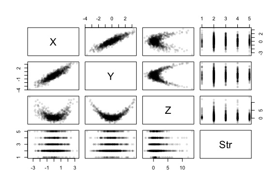

<!--}}}-->
<!--}}}-->
