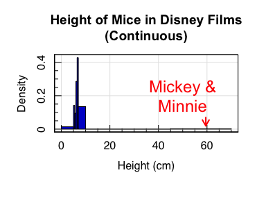

Introduction to Statistics for Astronomers and Physicists
================
Dr Angus H Wright
2022-02-08


# Section 1: Introduction <!--{{{-->

<!--Setup {{{-->
<style type="text/css">
.python { 
  background-color: 
    RColorBrewer::brewer.pal(1,"Set2");
} 
.out { 
  max-height: 300px;
  overflow-y: auto;
  background-color: inherit;
}
</style>
<!--}}}-->

In the simplest possible terms, there are two skills that are required
to analyse any question using data and statistics. The first skill
involves understanding how to describe a given dataset, which frequently
involves reducing the information contained within the data into
interpretable chunks. The second skill involves being able to draw
justifiable conclusions from the data at hand. In this section, we will
develop the first skill, starting in the simplest possible terms and
building complexity from there.

## **Data Description and Summarisation (Weeks 1-2)**

When working in empirical science, modelling and understanding datasets
is paramount. In this module we start by discussing the fundamentals of
data modelling. We start by discussing theories of point and interval
estimation, in the context of summary statics (e.g. expectation values,
confidence intervals), and estimation of data correlation and
covariance. Students will learn the fundamentals of data mining and
analysis, in a way that is applicable to all physical sciences.

Topics include:

> -   Part (a):
>     -   Notation and Nomenclature
>     -   Types of Data
>     -   Frequency Measures and Graphical Data
>     -   Measures of Central Tendency and Dispersion
> -   Part (b):
>     -   Graphical Comparisons between Distributions
>     -   Comparison between various Point and Dispersion Statistics
>     -   Correlation and Covariance
>     -   Practical Data Mining

<!--}}}-->

# Notation and Nomenclature <!--{{{-->

Throughout this course we will discuss many datasets and use them to
develop our understanding of statistical methods. It is therefore
sensible for us to first develop an understanding of the fundamental
units of data that we will be discussing throughout this course.

Let us start with some definitions and a description of the notation
that we will use throughout this course. We will borrow heavily from
“standard” statistical notation and also from “set notation”:

-   An **observation** *ω* is any individual measurement that we have
    made.
-   A **sample**
    {*ω*<sub>1</sub>, *ω*<sub>2</sub>, *ω*<sub>3</sub>, …, *ω*<sub>*n*</sub>}
    is any collection/set of individual measurements.
-   The number of observations in a sample is \|*ω*\| = *n* (called
    ‘cardinality’ in set theory/notation).
-   A **population** *Ω* is the collection of all measurements.

Each observation *ω* generally has one-or-more **variable(s)**
associated with it (otherwise there was no observation!), which we
define using upper-case Roman letters (*X*, *Y*, *Z*) or sometimes using
subscripts on *X*
(i.e. *X*<sub>1</sub>, *X*<sub>2</sub>, …, *X*<sub>*p*</sub>) if there
are many variables to consider. The observations of each variable are
lower-case;
e.g. {*y*<sub>1</sub>, *y*<sub>2</sub>, …, *y*<sub>*n*</sub>} are *n*
observations of variable *Y*.

If a variable is known to follow a particular probabilistic distribution
(we’ll use this a lot later in the course), then the variable is defined
using a tilde (\`∼’).

**NB:** the distinction between observations *ω* and variables is simply
to allow multiple variables to be attributed to each observation. You
can easily think of this in terms of a table/matrix/data.frame:

``` out
##           X   Y   Z
## omega_1 x_1 y_1 z_1
## omega_2 x_2 y_2 z_2
## omega_3 x_3 y_3 z_3
## omega_4 x_4 y_4 z_4
## omega_5 x_5 y_5 z_5
```

The distinction between a *sample* and a *population* is an important
one. In standard experimental physics and astronomy, we are almost never
presented with a population, because a population is the set of *all
measurements*, in the most literal sense. Instead, we almost exclusively
work with samples of observations, which we use to *infer* the
properties of the population.

This leads to another important notation distinction. When discussing
the properties of populations and samples, statisticians generally
distinguish the former by using Greek letters, while the latter are
given Roman letters. For example, the population mean and standard
deviation are generally given the symbols *μ* and *σ* respectively,
whereas the sample mean and standard deviation are generally given the
symbols *x̄* and *s* respectively.

Finally, an estimator for an arbitrary true parameter (e.g. *θ*) is
denoted by placing a hat/caret over the parameter (i.e. *θ̂*).

## Putting it all together

I make a sample *ω* of *n* observations for a single variable *X* that
is follows a normal (i.e. Gaussian) distribution with population mean
*μ* and standard deviation *σ*.

<!--Joint Codeblock-{{{-->
<table style="width: 95%">
<colgroup>
<col span="1" style="width: 50%;">
<col span="1" style="width: 50%;">
</colgroup>
<tbody>
<tr>
<td rblock>
<!--{{{-->

$$ \\omega \\in \\Omega, \\quad\\rm{where}\\, \|\\omega\|=n $$

*X* ∼ *N*(*μ*, *σ*)

$$
X : \\omega \\mapsto \\{ x\_1, x\_2, x\_3, \\dots, x\_n \\}\\quad{\\rm or} \\\\
X(\\omega)=\\{ x\_1, x\_2, x\_3, \\dots, x\_n \\}
$$
</td>
<!--}}}-->
<td plaintext>
<!--{{{-->

We have *n* observations *ω* from the population *Ω*

Variable *X* is drawn from a Normal *μ*, *σ* distribution

The values of *X* for each observation *ω* are
*x*<sub>1</sub>, *x*<sub>2</sub>, …, *x*<sub>*n*</sub>
</td>
<!--}}}-->
</tr>
</tbody>
</table>
<!--}}}-->

With this sample of *n* observations we now want to do our science. For
this experiment, our science goal is simply to estimate the value of
*μ*. We decide to define our estimate of *μ* as simply the mean of our
observations of *X*:

*μ̂* ≡ *x̄*

We compute the mean, submit the resulting estimate to Nature, and win a
Nobel Prize. Great job everyone!

<!--}}}-->

# Fundamentals of Data Description <!--{{{-->

When starting to analyse data, we first need an appreciation that “data”
comes in many forms. More importantly, understanding the “type” of data
that you are exploring will almost certainly be required for you to know
what type of analysis you can use to explore it.

# Fundamentals: Quantitative vs Qualitative Data

> -   **Qualitative Data** are those for which ranking is not
>     possible/sensible.
> -   **Quantitative Data** can be ranked/ordered in a natural manner.

Here we give an example of qualitative data, where rearrangement of the
ordering has no influence over the interpretation of the dataset.

``` out
## 
## Melissa Bridget   Clare  George   Frank   Harry 
##       8       9       8       7       3       5
```

``` out
## 
##   Frank  George   Harry Bridget   Clare Melissa 
##       3       7       5       9       8       8
```

With Qualitative data, there’s no logical reason to arrange these data
one-way or another. However with quantitative data the converse is true:

``` out
## Outcome of 6 coin tosses (number of heads thrown):
```

``` out
## 
##  1  2  3  4  5  6 
## 11  9  7  2  0  1
```

``` out
## Outcome of 6 coin tosses (number of heads thrown):
```

``` out
## 
##  5  1  2  4  3  6 
##  0 11  9  2  7  1
```

# Fundamentals: Discrete vs Continuous Data

For quantitative data, there is an additional question of whether the
data are discretely varying or continuous. Qualitative data are all
discrete, by definition.

-   Data which is **discrete** can only take a finite number of values
    in any specified interval.

That is, while there can be a (countably) infinite number of possible
discrete values, the number of values that can be taken over a finite
range is *not* infinite. An example of discrete variables are those
which are limited to the integers, and which are generally associated
with counting events. I.e. numbers of electrons in a detector, numbers
of galaxies, number of successful “heads” in a string of coin tosses,
etc.

-   Conversely, data which are **continuous** are not limited to a
    finite number of values in a finite range.

Examples of continuous variables are the real numbers, which in a finite
range can take an uncountably infinite number of values.

# Fundamentals: Scales of Data

Scales refer to the amount and/or type of information contained within a
particular variable.

-   Data with a **nominal scale** cannot be ordered in a meaningful way.
    These include all qualitative variables.
-   Data with an **ordinal scale** can be ordered, however the
    differences in their values cannot be interpreted in a meaningful
    manner.
-   Data with a **continuous scale** can be ordered, and differences
    between their values can be interpreted in a meaningful manner.

We’ve already seen examples of nominal and continuous scale data (names
and coin-tosses respectively). An example of ordinal scale data is
rankings of “Mood”:


# Fundamentals: Frequency Measures

When provided with a dataset containing one or more variables, often the
first step in analysing the dataset is determining the distribution of
data values per variable. This step might seen trivial, however
frequently it is a crucial first step in performing proper statistical
analysis.

Let’s start with a sample dataset of 45 students, who were asked a
survey about whether they like dogs or cats.

``` r
#Cat/Dog Survey using R
#Our Cat/Dog Survey is stored in "obs" 
print(str(obs))
```

``` out
## 'data.frame':    45 obs. of  2 variables:
##  $ Student   : int  1 2 3 4 5 6 7 8 9 10 ...
##  $ Preference: chr  "Dog" "Dog" "Dog" "Cat" ...
## NULL
```

Our survey is stored in a variable “Preference”. Let’s look now at the
different values that “Preference” can take:

``` r
#Absolute Frequencies of a vector in R
table(obs$Preference)
```

``` out
## 
## Cat Dog 
##  18  27
```

So we can see that dogs have slightly beaten the cats here. This total
measurement of the number of responses for each option is the **absolute
frequency**. Often, though, we’re not interested in the absolute number
of results that gave a particular answer, because we are using a
*sample* to infer an estimate of a *population*. In this instance, we’re
interested in an estimate of the **relative frequency**, which we get by
dividing the absolute frequencies by the total number of responses.

``` r
#Relative frequencies of a vector in R
table(obs$Preference)/nrow(obs) #If using a data.frame of observations
```

``` out
## 
## Cat Dog 
## 0.4 0.6
```

``` r
table(obs$Preference)/length(obs$Preference) #If using a vector of observations
```

``` out
## 
## Cat Dog 
## 0.4 0.6
```

So 60% of respondents preferred dogs to cats, given the relative
frequency of their responses.

<!--}}}-->

# Graphical Representations of Data <!--{{{-->

Looking at values of absolute or relative frequency is useful when the
number of possible responses is small (like what we have on our slido
polls). However when the number of possible responses is large, this can
become unwieldy.

Recall our “NYC Flights” dataset from Section 0. This contained flight
records for all domestic flights that flew into New York City in 2013.
We’re going to look now at the number of flights into NYC per-airline:

``` r
df<-get(data("flights",package='nycflights13'))
print(str(df))
```

``` out
## tibble [336,776 × 19] (S3: tbl_df/tbl/data.frame)
##  $ year          : int [1:336776] 2013 2013 2013 2013 2013 2013 2013 2013 2013 2013 ...
##  $ month         : int [1:336776] 1 1 1 1 1 1 1 1 1 1 ...
##  $ day           : int [1:336776] 1 1 1 1 1 1 1 1 1 1 ...
##  $ dep_time      : int [1:336776] 517 533 542 544 554 554 555 557 557 558 ...
##  $ sched_dep_time: int [1:336776] 515 529 540 545 600 558 600 600 600 600 ...
##  $ dep_delay     : num [1:336776] 2 4 2 -1 -6 -4 -5 -3 -3 -2 ...
##  $ arr_time      : int [1:336776] 830 850 923 1004 812 740 913 709 838 753 ...
##  $ sched_arr_time: int [1:336776] 819 830 850 1022 837 728 854 723 846 745 ...
##  $ arr_delay     : num [1:336776] 11 20 33 -18 -25 12 19 -14 -8 8 ...
##  $ carrier       : chr [1:336776] "UA" "UA" "AA" "B6" ...
##  $ flight        : int [1:336776] 1545 1714 1141 725 461 1696 507 5708 79 301 ...
##  $ tailnum       : chr [1:336776] "N14228" "N24211" "N619AA" "N804JB" ...
##  $ origin        : chr [1:336776] "EWR" "LGA" "JFK" "JFK" ...
##  $ dest          : chr [1:336776] "IAH" "IAH" "MIA" "BQN" ...
##  $ air_time      : num [1:336776] 227 227 160 183 116 150 158 53 140 138 ...
##  $ distance      : num [1:336776] 1400 1416 1089 1576 762 ...
##  $ hour          : num [1:336776] 5 5 5 5 6 5 6 6 6 6 ...
##  $ minute        : num [1:336776] 15 29 40 45 0 58 0 0 0 0 ...
##  $ time_hour     : POSIXct[1:336776], format: "2013-01-01 05:00:00" "2013-01-01 05:00:00" "2013-01-01 05:00:00" ...
## NULL
```

Looking at absolute frequencies can sometimes be of interest, like
asking how flights arrived per month:

``` r
#Number of flights per month 
table(df$month)
```

``` out
## 
##     1     2     3     4     5     6     7     8     9    10    11    12 
## 27004 24951 28834 28330 28796 28243 29425 29327 27574 28889 27268 28135
```

Looking at relative frequencies is sometimes more interesting, like
looking at the fraction of flights that belong to each airline:

``` r
#Fraction of flights per carrier
table(df$carrier)/nrow(df)
```

``` out
## 
##           9E           AA           AS           B6           DL           EV           F9 
## 5.481388e-02 9.718329e-02 2.120104e-03 1.622295e-01 1.428546e-01 1.608577e-01 2.033993e-03 
##           FL           HA           MQ           OO           UA           US           VX 
## 9.680025e-03 1.015512e-03 7.838148e-02 9.501865e-05 1.741959e-01 6.097822e-02 1.532770e-02 
##           WN           YV 
## 3.644856e-02 1.784569e-03
```

``` r
#Percentage of flights per carrier
round(table(df$carrier)/nrow(df)*100,digits=2)
```

``` out
## 
##    9E    AA    AS    B6    DL    EV    F9    FL    HA    MQ    OO    UA    US    VX    WN    YV 
##  5.48  9.72  0.21 16.22 14.29 16.09  0.20  0.97  0.10  7.84  0.01 17.42  6.10  1.53  3.64  0.18
```

``` r
#What do each of the codes correspond to?
print(get(data("airlines",package='nycflights13')))
```

``` out
## # A tibble: 16 x 2
##    carrier name                       
##    <chr>   <chr>                      
##  1 9E      Endeavor Air Inc.          
##  2 AA      American Airlines Inc.     
##  3 AS      Alaska Airlines Inc.       
##  4 B6      JetBlue Airways            
##  5 DL      Delta Air Lines Inc.       
##  6 EV      ExpressJet Airlines Inc.   
##  7 F9      Frontier Airlines Inc.     
##  8 FL      AirTran Airways Corporation
##  9 HA      Hawaiian Airlines Inc.     
## 10 MQ      Envoy Air                  
## 11 OO      SkyWest Airlines Inc.      
## 12 UA      United Air Lines Inc.      
## 13 US      US Airways Inc.            
## 14 VX      Virgin America             
## 15 WN      Southwest Airlines Co.     
## 16 YV      Mesa Airlines Inc.
```

This information is still digestible, but we’re clearly reaching the
point where adding more information would make it difficult for our
brains to extract the *important* details. For example, if we want to
look at the arrival and departure cities:

``` r
table(df$origin) #I can understand this, and extract useful information 
```

``` out
## 
##    EWR    JFK    LGA 
## 120835 111279 104662
```

``` r
table(df$dest) #I would be unlikely to extract useful information here
```

``` out
## 
##   ABQ   ACK   ALB   ANC   ATL   AUS   AVL   BDL   BGR   BHM   BNA   BOS   BQN   BTV   BUF   BUR 
##   254   265   439     8 17215  2439   275   443   375   297  6333 15508   896  2589  4681   371 
##   BWI   BZN   CAE   CAK   CHO   CHS   CLE   CLT   CMH   CRW   CVG   DAY   DCA   DEN   DFW   DSM 
##  1781    36   116   864    52  2884  4573 14064  3524   138  3941  1525  9705  7266  8738   569 
##   DTW   EGE   EYW   FLL   GRR   GSO   GSP   HDN   HNL   HOU   IAD   IAH   ILM   IND   JAC   JAX 
##  9384   213    17 12055   765  1606   849    15   707  2115  5700  7198   110  2077    25  2720 
##   LAS   LAX   LEX   LGA   LGB   MCI   MCO   MDW   MEM   MHT   MIA   MKE   MSN   MSP   MSY   MTJ 
##  5997 16174     1     1   668  2008 14082  4113  1789  1009 11728  2802   572  7185  3799    15 
##   MVY   MYR   OAK   OKC   OMA   ORD   ORF   PBI   PDX   PHL   PHX   PIT   PSE   PSP   PVD   PWM 
##   221    59   312   346   849 17283  1536  6554  1354  1632  4656  2875   365    19   376  2352 
##   RDU   RIC   ROC   RSW   SAN   SAT   SAV   SBN   SDF   SEA   SFO   SJC   SJU   SLC   SMF   SNA 
##  8163  2454  2416  3537  2737   686   804    10  1157  3923 13331   329  5819  2467   284   825 
##   SRQ   STL   STT   SYR   TPA   TUL   TVC   TYS   XNA 
##  1211  4339   522  1761  7466   315   101   631  1036
```

For this purpose, we utilise graphical representations of data to
visualise large and complex datasets and extract important information.

<!--}}}-->

# Graphs: Bar chart <!--{{{-->

The bar chart is a tool used for visualising nominal and ordinal values,
provided that the number of categories is not large.

Keeping with the NYC Flights data from the last section, we can now look
at the number and fraction of flights by carrier with a bar chart:


And once again demonstrate that the reordering of the data has no impact
on its interpretability:


The bar chart is a useful tool for comparing nominal and ordinal data,
given a small number of groupings. Our carrier plot is already pushing
the boundaries. When the number of groupings becomes even larger, the
chart can become unwieldy:


In this regime we will likely want to preprocessed these data using
other measures prior to the production of such a visual summary, like by
throwing away the least common destinations and ordering by frequency:


<!--}}}-->

# Graphs: Histogram <!--{{{-->

For data on with a continuous scale (i.e. where differences in values
have quantifiable meaning), the bar-chart becomes less useful. For
example, one could create a bar-chart of our 6 coin-tosses dataset:


But there is an obvious issue here: we’ve discarded the information
about the continuous scale. Instead, we want to preserve the information
regarding the separation between values, and opt for a histogram.

In a histogram we are computing the number of observations within
intervals of our choosing:

``` out
## 
## (0.75,1.25] (1.25,1.75] (1.75,2.25] (2.25,2.75] (2.75,3.25] (3.25,3.75] (3.75,4.25] (4.25,4.75] 
##          11           0           9           0           7           0           2           0 
## (4.75,5.25] (5.25,5.75] (5.75,6.25] 
##           0           0           1
```

which we then show graphically:

``` out
## [1] "Summary of used sample:"
##    Min. 1st Qu.  Median    Mean 3rd Qu.    Max. 
##   1.000   1.000   2.000   2.133   3.000   6.000 
## [1] "sd / MAD / 1-sig / 2-sig range:"
## [1] 1.195778 1.482600 1.000000 1.840246
## [1] "Using 30 out of 30 (100%) data points (0 < xlo & 0 > xhi)"
```


In our previous coin-tossing dataset the intermediate bins are 0 by
definition, because we are looking at a discrete dataset containing only
integers: *ω* ∈ ℤ. But the method is unchanged if we wanted to extend
the histogram to continuous data. Additionally, one can variably adapt
the bin widths, to account for complex dataset. With this combination,
histograms become a versatile too to interpret any data on the
continuous scale (discrete or otherwise): <!--Joint Codeblock-{{{-->
<table style="width: 95%">
<colgroup>
<col span="1" style="width: 50%;">
<col span="1" style="width: 50%;">
</colgroup>
<tbody>
<tr>
<td rblock>
<!--{{{-->

</td>
<!--}}}-->
<td pythonblock>
<!--{{{-->

</td>
<!--}}}-->
</tr>
</tbody>
</table>
<!--}}}-->

Two important notes about histograms:

> -   The bin-width has meaning, because the data scale is continuous.
> -   The area of the bins is proportional to the relative frequency
>     (**unless** you have variable bin size *and* plot absolute
>     frequency).

The combination of these two things means histograms can be adapted to
show the data you’re most interested in. Generally I think that
histograms should never use the combination of variable bin sizes and
absolute frequency, because this can give the wrong impression about the
data:

<!--Joint Codeblock-{{{-->
<table style="width: 95%">
<colgroup>
<col span="1" style="width: 50%;">
<col span="1" style="width: 50%;">
</colgroup>
<tbody>
<tr>
<td rblock>
<!--{{{-->

</td>
<!--}}}-->
<td pythonblock>
<!--{{{-->

</td>
<!--}}}-->
</tr>
</tbody>
</table>
<!--}}}-->

Specifying that all bins should be shown as densities (or that the bins
should all be equidistant) remedies this issue. Importantly, when
plotting densities, the integral of the histogram becomes 1 (more on
this when we discuss probabilities).

<!--Joint Codeblock-{{{-->
<table style="width: 95%">
<colgroup>
<col span="1" style="width: 50%;">
<col span="1" style="width: 50%;">
</colgroup>
<tbody>
<tr>
<td rblock>
<!--{{{-->

</td>
<!--}}}-->
<td pythonblock>
<!--{{{-->

</td>
<!--}}}-->
</tr>
</tbody>
</table>
<!--}}}-->
<!--}}}-->

# Graphs: Kernel Density Estimate <!--{{{-->

The drawback of histogram representation is that we’re artificially
creating discreteness in a dataset that need not be discrete. The
solution to this problem is **kernel density estimation**, where data
are categorised continuously rather than discretely using some window
function (i.e. the kernel).

A kernel density estimate (KDE) is defined as:

$$
f\_n(x) = \\frac{1}{nh}\\sum\_{i=1}^{n} K\\left(\\frac{x-x\_i}{h}\\right)
$$
where *n* is the sample size and *K* is a kernel function with some
bandwidth *h*. Standard examples of the kernel function are the
rectangular/tophat kernel, or the Gaussian kernel.

To visualise the KDE process, below is an example where we have computed
a Gaussian KDE using randomly distributed data, and we are adding one
data point to the KDE at a time:

<!--R Animated Figure Template-{{{-->


<!--}}}-->

The end result is the below KDE, which we can compare to the equivalent
histogram:


<!--}}}-->

# Graphs: ECDF <!--{{{-->

For data on a continuous scale, we can construct a number of different
graphical tools to help us explore and describe data. One such tool is
the Empirical Cumulative Distribution Function (ECDF).

To look at the ECDF, let’s start with some discrete data: our coin-toss
dataset.


We can then look at the cumulative version of this histogram, in
relative frequency:


The ECDF is a similar measure to this, but normalised such that it shows
the fraction of data which are counted up to *x*:


Similar to the histogram, this is immediately generalisable to
non-discrete data:

<!--Joint Codeblock-{{{-->
<table style="width: 95%">
<colgroup>
<col span="1" style="width: 50%;">
<col span="1" style="width: 50%;">
</colgroup>
<tbody>
<tr>
<td rblock>
<!--{{{-->

``` r
#Density of Random Gaussian data
#Generate 1E4 random gaussian data points 
x<-rnorm(1e4)
#Plot the KDE of these data
magplot(density(x),xlab='x',ylab='Density')
```


</td>
<!--}}}-->
<td pythonblock>
<!--{{{-->

``` r
#ECDF of Random Gaussian data
plot.ecdf(x)
```


</td>
<!--}}}-->
</tr>
</tbody>
</table>
<!--}}}-->

# The Quantile function <!--{{{-->

The ECDF is a useful statistic for demonstrating the fraction of data
that sit above/below a particular value of the given variable. However,
frequently we are interested in the opposite of this: we want to know
the value of a variable at particular fractions of cumulative relative
frequency.

This function is called the **quantile function**.

Note, however, that the continuous version of the ECDF is still
technically a step-function, and so it cannot be inverted:

``` r
#ECDF of Random Gaussian data
plot.ecdf(x,xlim=c(-0.1,0.1),ylim=c(0.45,0.50))
```


Instead (in practice) the quantile function is computed using weighted
averaging of ordered data. In **R**, this is possible using the
‘quantile’ function, and in **python** similarly using the ‘np.quantile’
function:

``` r
#ECDF of Random Gaussian data in R
magplot(seq(0,1,by=0.01),quantile(x,probs=seq(0,1,by=0.01)),
        xlab='Quantile', ylab='Value',type='l')
```


However, in a typically **R** fashion, there are 9 different algorithms
provided which can be used to calculate quantiles, each which use a
subtly different weighting to interpolate between data values. These
algorithms can be chosen using the “type” keyword, however (in practice)
it’s highly unlikely you will ever need to use anything other than the
default, which in effect performs a linear interpolation between data
points.

<!--}}}-->
<!--}}}-->

# Measures of Central Tendency and Dispersion <!--{{{-->

Frequently in data analysis we are interested in comparing the
properties of different samples of data across a range of variables. In
these circumstances it is generally advantageous to reduce distributions
of data into one-point summary statistics. Choice of *which* summary
statistic to use, however, is often important. In the following
sections, we will present a range of summary statistics that probe the
measure of central tendency of the data (e.g. mean, median, mode), and
the dispersion of the data (e.g. standard deviation, RMS, MAD).

<!--}}}-->

# Point Estimation <!--{{{-->

## Arithmetic Mean <!--{{{-->

The natural starting point for a discussion on point estimates for an
arbitrary variable is to discuss the arithmetic mean:

$$
\\bar{x} = \\frac{1}{n}\\sum\_{i=1}^{n}x\_i.
$$

This is the common “average” or “mean” with which we are all familiar.

<!--}}}-->

## Median <!--{{{-->

The median is the point that divides a dataset into two equal parts. For
data with an odd number of observations, this is trivially the middle
(that is, the $\[(n+1)/2\]^{\\rm th}$) entry of the rank-ordered
dataset. For even-numbered observations where there is no ‘middle’
value, the median is generally defined to be the mean of the two middle
values. Therefore, the median is formally defined as:
$$
\\tilde{x}\_{0.5} = 
\\begin{cases} 
  x\_{\[(n+1)/2\]} & n\\in 2\\mathbb{Z}-1 \\\\
  (x\_{\[n/2\]}+x\_{\[n/2+1\]})/2 & n\\in2\\mathbb{Z}
\\end{cases}
$$

Recall, though, that this is the same prescription that we invoked when
computing the quantile function previously. Therefore the median can be
described using the quantile function:

``` r
#Median vs quantile 0.5
median(x)==quantile(x,prob=0.5,type=7)
```

``` out
##  50% 
## TRUE
```

<!--}}}-->

## Mode <!--{{{-->

The next frequently used point statistic is the mode, which is the most
frequently observed data-point in the variable. For continuous data, the
mode is frequently estimated using a discretized or smoothed
representation of the data, such as the KDE:

``` r
#Mode of Random Gaussian data
#Plot the KDE of these data
dens<-density(x)
magplot(dens,xlab='x',ylab='Density')
abline(v=dens$x[which(dens$y==max(dens$y))],col='red',lty=2)
```


<!--}}}-->
<!--}}}-->

# Dispersion Estimation <!--{{{-->

In addition to just an estimate of the central tendency of data, we
often also require an estimate of the data dispersions/spread. This is
primarily important for a few reasons:

-   Different distributions can have the same central tendency;
-   When quantifying the possible range of a variable, a point estimate
    is obviously insufficient; and
-   Even if we *do* just want a point estimate, that estimate of the
    central tendency will always be imperfect. Crucially, the
    uncertainty on it is intimately linked to the data dispersion.

## Absolute Deviation <!--{{{-->

Dispersion is a measure of deviation from a particular point. so we can
construct an arbitrary dispersion metric as being, for example, the
arithmetic mean of all deviations between the data and a point *A*:
$$
D(A) = \\frac{1}{n}\\sum\_{i=1}^{n} (x\_i-A). 
$$

We can now run this dispersion metric for an arbitrary dataset:

``` r
#Deviation of a dataset 
#Construct a dataset, using the exponential function
obs<-rexp(1e3,rate=1)
#Construct our dispersion metric
disp<-function(x,A) {
  return(1/length(x) * sum(x-A))
}
#Plot our dataset 
maghist(obs,col='blue',xlab='x',ylab='Frequency')
```

``` out
## [1] "Summary of used sample:"
##     Min.  1st Qu.   Median     Mean  3rd Qu.     Max. 
## 0.000271 0.292221 0.719642 1.027222 1.394388 8.916248 
## [1] "sd / MAD / 1-sig / 2-sig range:"
## [1] 1.0328637 0.7655033 0.8324781 2.0132008
## [1] "Using 1000 out of 1000"
```

``` r
#Calculate the dispersion around A=0
abline(v=disp(obs,A=0),col='red')
#Draw a legend 
legend('topright',legend='Dispersion Estimate',col='red',lty=1)
```


So this dispersion measure looks sensible. Let’s try another dataset,
which is Gaussian rather than Exponential:

``` r
#Deviation of a dataset II
#Construct a dataset, using the Gaussian function
obs<-rnorm(1e3)
#Plot our dataset 
maghist(obs,col='blue',xlab='x',ylab='Frequency')
```

``` out
## [1] "Summary of used sample:"
##     Min.  1st Qu.   Median     Mean  3rd Qu.     Max. 
## -3.91663 -0.63143  0.01941  0.03943  0.69745  3.35308 
## [1] "sd / MAD / 1-sig / 2-sig range:"
## [1] 1.0126762 0.9870919 1.0513575 1.9139114
## [1] "Using 1000 out of 1000"
```

``` r
#Calculate the dispersion around A=0
abline(v=disp(obs,A=0),col='red')
#Draw a legend 
legend('topright',legend='Dispersion Estimate',col='red',lty=1)
```


So clearly this measure has broken down here. We have a dataset with a
large degree of dispersion but a measurement that is  ∼ 0, because the
reference point is in the middle of the dataset.

To counter this effect we can instead use the **absolute deviation**:
$$
D(A) = \\frac{1}{n}\\sum\_{i=1}^{n} \|x\_i-A\|. 
$$

``` r
#Absolute Deviation of a dataset 
#Reconstruct our dispersion metric
disp<-function(x,A) {
  return(1/length(x) * sum(abs(x-A)))
}
#Plot our dataset 
maghist(obs,col='blue',xlab='x',ylab='Frequency',verbose=FALSE)
#Calculate the dispersion around A=0
abline(v=c(-1,1)*disp(obs,A=0),col='red')
#Draw a legend 
legend('topright',legend='Dispersion Estimate',col='red',lty=1)
```


This dispersion measure still carries with it the choice of *A*. It is
intuitive to define the dispersion with respect to one of the point
estimates that we’ve already discussed, such as the mean or median. When
we set our absolute deviation reference point to be the arithmetic mean
of the distribution, *A* = *x̄*, we recover the **absolute mean
deviation**:
$$
D(\\bar{x}) = \\frac{1}{n}\\sum\_{i=1}^{n} \|x\_i-\\bar{x}\|. 
$$
When we set reference point to the median *A* = *x̃*<sub>0.5</sub>, we
recover the **absolute median deviation**:
$$
D(\\tilde{x}\_{0.5}) = \\frac{1}{n}\\sum\_{i=1}^{n} \|x\_i-\\tilde{x}\_{0.5}\|. 
$$

<!--}}}-->

## Variance & Standard Deviation <!--{{{-->

The absolute value, however, is not the only method to avoid dispersion
measures that have cancellation between positive and negative
deviations. Instead we can consider the arithmetic mean of the squares
of the deviation, known as the **mean squared error (or MSE)** with
respect to our reference point *A*:
$$
s^2(A) = \\frac{1}{n}\\sum\_{i=1}^{n} (x\_i-A)^2. 
$$
The MSE holds a somewhat special place in statistics because of its use
in determining whether estimators of various parameters are unbiased or
not; something that we will explore in later chapters.

When we set *A* to be the arithmetic mean *A* = *x̄*, we recover the
so-called **variance** of the sample.
$$
\\tilde{s}^2 \\equiv s^2(\\bar{x}) = \\frac{1}{n}\\sum\_{i=1}^{n} (x\_i-\\bar{x})^2. 
$$

The positive square root of the variance is called the **sample standard
deviation**:
$$
\\tilde{s} = \\sqrt{\\frac{1}{n}\\sum\_{i=1}^{n} (x\_i-\\bar{x})^2}. 
$$
The sample variance and standard deviation are fundamental quantities in
statistics. An important caveat, though, is the distinction between the
sample and population variance. It can be shown that the sample variance
is not an unbiased estimate of the population variance. Rather, an
unbiased estimate of the population variance is:
$$
\\tilde{s}^2 = \\frac{1}{n-1}\\sum\_{i=1}^{n} (x\_i-\\bar{x})^2. 
$$
In practice, we will always use this formulation of the variance (and
the equivalent form of the standard deviation) because we are
essentially always attempting to quantify population properties from a
sample of observations.

<!--}}}-->

## Median Absolute Deviation from Median <!--{{{-->

As the standard deviation contains the aritmetic mean of the data, it
can be sensitive to outlier values (something we’ll look more at in the
next section). As such it is sometimes preferable to use a dispersion
estimator that has less sensitivity to outliers.

We have previously formulated an absolute median deviation dispersion
estimator, using the arithmetic mean of the absolute deviations from
median. We can instead extend such a dispersion measure to use
exclusively median statistics, and compute the **median absolute
deviation from the median (or MAD)**:
$$
{\\rm MAD}(x) = {\\rm median}(\|x\_i-\\tilde{x}\_{0.5}\|)
$$

The MAD estimate is not a simple replacement for the standard deviation,
though, because the two statistics aren’t equivalent:

``` r
#Generate some Gaussian data
x<-rnorm(1e3)
#Create our MAD function 
mad_disp<-function(x) {
  return(median(abs(x-median(x))))
}
sd(x); mad_disp(x); 
```

``` out
## [1] 0.985294
```

``` out
## [1] 0.666789
```

However, it can be shown that the difference between the MAD and true
standard deviation (for normally distributed data) is simply a
multiplicative factor. Therefore we can define the **normalised MAD (or
nMAD)**:
$$
{\\rm nMAD}(x) = 1.4826\\times{\\rm median}(\|x\_i-\\tilde{x}\_{0.5}\|).
$$

Again, in practice we will always use the latter formalism (and this is
the default implementation in **R**):

``` r
#Look at the native MAD function in R
args(mad)
```

``` out
## function (x, center = median(x), constant = 1.4826, na.rm = FALSE, 
##     low = FALSE, high = FALSE) 
## NULL
```

``` r
sd(x); mad(x); 
```

``` out
## [1] 0.985294
```

``` out
## [1] 0.9885813
```

<!--}}}-->
<!--}}}-->
