Introduction to Statistics for Astronomers and Physicists
================
Dr Angus H Wright
2022-02-09


# Section 1: Introduction <!--{{{-->

<!--Setup {{{-->
<style type="text/css">
.python { 
  background-color: 
    RColorBrewer::brewer.pal(1,"Set2");
} 
.out { 
  max-height: 300px;
  overflow-y: auto;
  background-color: inherit;
}
</style>
<!--}}}-->

**Section 3: Bayesian Statistics (Weeks 7-9)**

Bayes theorem led to a revolution in statistics, via the concepts of
prior and posterior evidence. In modern astronomy and physics,
applications of Bayesian statistics are widespread. We begin with a
study of Bayes theorem, and the fundamental differences between
frequentest and Bayesian analysis. We explore applications of Bayesian
statistics, through well studied statistical problems (both within and
outside of physics).

<!--}}}-->

# Where we finished last time <!--{{{-->

## Summarising Posterior Information

The posterior distribution is a complete summary of the inference about
*θ*. In essence, the posterior distribution **is** the inference about
*θ*. However, for many applications, we wish to summarise the
information contained within the posterior into some digestible
quantity.

## Point Estimates <!--{{{-->

We can do this by specifying some form of **Loss Function**
*L*(*θ*, *a*), which measures the penalty in estimating a value of *θ*
given an individual datum at *a*.

There are a range of potential loss functions that are common to use,
and the particular choice of the loss function will often depend on the
problem being analysed. The most common loss functions (some of which we
have already seen!) are:

> 1.  Quadratic Loss (minimised by mean):
>     *L*(*θ*, *a*) = (*θ* − *a*)<sup>2</sup>
> 2.  Absolute Error Loss (minimised by median):
>     *L*(*θ*, *a*) = \|*θ* − *a*\|
> 3.  0 − 1 Loss (minimised by mode):
>     $$
>     L(\\theta,a)=
>     \\begin{cases}
>     0 & \\textrm{if}\\; \|a-\\theta\|\\leq \\epsilon \\\\
>     1 & \\textrm{if}\\; \|a-\\theta\|&gt;  \\epsilon \\\\
>     \\end{cases}
>     $$
> 4.  Linear Loss: for specified *g*, *h* &gt; 0
>     $$
>     L(\\theta,a)=
>     \\begin{cases}
>     g(a-\\theta) & \\textrm{if}\\; a&gt;    \\theta \\\\
>     h(a-\\theta) & \\textrm{if}\\; a\\leq \\theta \\\\
>     \\end{cases}
>     $$
>     <!--}}}-->

## Credability Intervals <!--{{{-->

The idea of **credability intervals** is analagous to confidence
intervals in classical statistics. The reasoning is that point estimates
give no measure of accuracy, so it is prefereable to specify the region
in which a parameter is **likely** to reside.

<!--}}}-->
<!--}}}-->

# Predictive Distributions <!--{{{-->

So far we have focussed on parameter estimation. We’ve shown how the
Bayesian framework combines sample information and prior information to
give parameter inference in the form of the posterior distribution.
However commonly we are interested in making *predictions* about the
future.

In making a prediction, on the basis of an estimated model, there are
two sources of uncertainty:

1.  Uncertainty in the parameter values which have been assigned on the
    basis of previous data; and
2.  Uncertainty due to the fact that any future value of the parameter
    is itself a random event.

In classical statistics, it is standard practice to fit a model to the
existant data and them make predictions assuming that the model is
correct. There is only the second source of uncertainty included in this
analysis. This leads to predictions that are believed to be **more
precise** than they really are. There is simply, however, no
satisfactory way around this problem in the framework of classical
statistics, because parameters are considered constant in the
likelihood.

In the Bayesian framework, however, it is straightforward to allow for
both sources of uncertainty by averaging over the uncertainty in the
parameter estimates themselves.

Suppose we have past observations
*x* = {*x*<sub>1</sub>, …, *x*<sub>*n*</sub>} of a variable with the
density function (or likelihood) *p*(*x*\|*θ*), and we wish to make
inference about the distribution of any future value *y* from this
process.

With a prior *p*(*θ*), Bayes theorem gives us the posterior
*p*(*θ*\|*x*), and then the **predictive density function** of *y* given
*x* is:
*p*(*y*\|*x*) = ∫*p*(*y*\|*θ*)*p*(*θ*\|*x*)d*θ*
that is, the integral of the likelihood of a single point times the
posterior.

Though simple in principle, computation of the posterior predictive
distribution can again be difficult. However once again there are some
conjugate families that make generating posterior predicitve
distributions tractable. For others, these can be computed numerically
(but at cost).

## Predicting a coin toss

Consider our Binomial coin toss with unknown bias *θ*:
*x* ∼ Bin(*n*, *θ*). The conjugate prior to the binomial likelihood is
*p*(*θ*) ∼ Be(*p*, *q*), giving the posterior
*θ*\|*x* ∼ Be(*p* + *x*, *q* + *n* − *x*).

Suppose we intend to make *N* further observations in the future, and we
let *z* be the number of successful throws out of the *N* trials.

$$
z\|\\theta\\sim\\textrm{Bin}(N,\\theta) \\\\
\\therefore p(z\|\\theta)={N\\choose z} \\theta^z(1-\\theta)^{N-z}
$$
We can compute the predictive distribution of *z* given our observations
using the posterior distribution:
$$
\\begin{align}
p(z\|x)&=\\int p(z\|\\theta)p(\\theta\|x)\\textrm{d}\\theta\\\\
&=\\int\_0^1 {N \\choose z}\\theta^z(1-\\theta)^{N-z} \\frac{\\theta^{p+x-1}(1-\\theta)^{q+n-x-1}}{\\textrm{Be}(p+q,q+n-x)}\\textrm{d}\\theta\\\\
&= {N\\choose z}\\frac{1}{\\textrm{Be}(p+q,q+n-x)}\\int\_0^1\\theta^{p+x-1}(1-\\theta)^{q+n-x-1}\\textrm{d}\\theta \\\\ \\\\
\\therefore p(z\|x)&= {N \\choose z} \\frac{\\textrm{Be}(z+p+q,q+2n-x-z)}{\\textrm{Be}(p+q,q+n-x)}.
\\end{align}
$$

Remember back to our first exploration into Bayes Theorem with our three
scenarios (Section 3a). We can now *predict* the outcomes of a
subsequent 10 trials for each scenario given the data
(*x* = 10, *n* = 10) and our priors.

``` r
p_zx<-function(z=0:10,N=10,x=10,n=10,p,q) { 
  return=choose(N,z)*beta(z+p+q,q+2*n-x-z)/beta(p+q,q+n-x)
}
magplot(0:10,p_zx(p=0.1,q=100),xlim=c(0,10),ylim=c(0,1),type='l',lwd=2,col='red3',ylab=expression(p(z*"|"*x)),xlab='z')
lines(0:10,p_zx(p=0.7,q=1),col='green3',lwd=2,lty=2)
lines(0:10,p_zx(p=10,q=0.5),col='blue3',lwd=2)
legend('topleft',legend=c("Fortune Teller","Wine Critic","Classical Musician"),
       lty=c(1,2,1),lwd=2,col=c("red3","green3","blue3"),
       bty='n',inset=0.05)
```

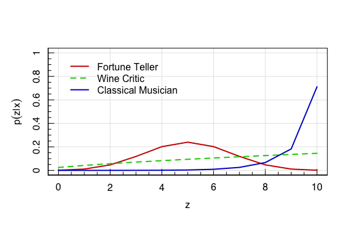

<!--}}}-->

# Posterior Simulation <!--{{{-->

The last, arguably most popular/useful method of posterior
interpretation is posterior simulation. This is related to the long
discussion that we had on simulation and sampling from unknown
distributions three lectures ago (Section 2*d*).

## Bayesian Posteriors and Sampling

As we’ve already seen, even simple combinations of priors and posteriors
can lead to complex posteriors, if we can’t use a conjugate analysis.

As a result, using a posterior to do parameter inference requires some
means of describing the (often complex) posterior in some digestible
manner. This generally means using point statistics and/or credability
intervals, both of which require us to understand the distribution that
we want to analyse (that is, to know the PDF). But we’ve already
demonstrated that knowing the analytic form of the posterior PDF can be
difficult if not impossible in most cases. Fortunately, sampling comes
to the rescue.

# Posterior Simulation, and Markov Chain Monte Carlo

More than any other technique, **Markov Chain Monte Carlo** has been
responsible for the current resurgence of Bayesian Statistics in the
natural sciences. This is because **MCMC** allows us to estimate a vast
array of Bayesian models with ease.

The idea of MCMC was first introduced as a method for the efficient
simulation of energy levels of atoms in crystalline lattices. It was
subsequently adapted for broader use within statistics.

The concept of MCMC is as follows:

Suppose we have some arbitrary “**target distribution**” *π*:
*π*(*x*),  *x* ∈ *Ω* ∈ ℝ<sup>*p*</sup>.

If *π* is sufficiently complex that we are unable to sample from it
directly, then an indirect method for sampling from it is to construct a
**Markov Chain** within a state space *Ω*, whose “stationary
distribution” is *π*(*x*). If we run the chain for long enough,
simulated values from the chain can be treated as samples from the
target distribution and used as a basis for summarising the important
features of *π*.

There is *a lot* of jargon in that last paragraph, but don’t fret. We
will make this clear in the following slides.

<!--}}}-->

# The Markov Chain <!--{{{-->

What is a **markov chain**?

A sequence of random variables *X*<sub>*t*</sub> is defined as a Markov
Chain if it follows the conditional probability:
*P*(*X*<sub>*t* + 1</sub> = *x*<sub>*t* + 1</sub>\|*X*<sub>*t*</sub> = *x*<sub>*t*</sub>, *X*<sub>*t* − 1</sub> = *x*<sub>*t* − 1</sub>, …, *X*<sub>0</sub> = *x*<sub>0</sub>) = *P*(*X*<sub>*t* + 1</sub> = *y*\|*X*<sub>*t*</sub> = *x*<sub>*t*</sub>)
That is, it is a sequence of numbers that, given the current state, is
independent of the past. The probability of transition from state
*x* = *x*<sub>*t*</sub> to *y* = *x*<sub>*t* + 1</sub> is given by some
**transition probability**.

## Transition Probability <!--{{{-->

The *n*<sup>th</sup> step transition probability
*P*<sup>*n*</sup>(*x*, *y*) of a Markov Chain moving from state *x* to
state *y* *in precisely *n* steps* is given by:
$$
\\begin{align}
P^n(x,y) &= P(X\_n=y\|X\_0=x) \\\\
&= \\sum\_{x\_1}\\dots\\sum\_{x\_{n-1}} P(x,x\_1)P(x\_1,x\_2)\\dots P(x\_{n-1},y)
\\end{align}
$$
More generally, the transition probability can be visualised, for a
finite state space *Ω* as an \|*Ω*\| × \|*Ω*\| matrix of probabilities
of transitioning from state *x* to state *y*:
*P*(*x*, *y*) = *P*(*X*<sub>1</sub> = *y*\|*X*<sub>0</sub> = *x*);  *x*, *y* ∈ *Ω*.

All entries in *P*(*x*, *y*) are therefore probabilities
(i.e. *P*(*x*, *y*) ∈ \[0, 1\]), and the rows of *P*(*x*, *y*) must sum
to unity (because from every point *X*<sub>0</sub> = *x*, you have to go
*somewhere* in *Ω*).

<!--}}}-->

# Visualising the Markov Chain <!--{{{-->

You may already be familiar with the concept of the Markov chain, even
if you don’t know it by that name specifically. This is because there is
a special type of Markov Chain that is somewhat well known: the **random
walk**.

A random walk is a Markov chain whereby the transition probability is
uniform for the points adjacent to *x*:
$$ 
P(x,y)=
\\begin{pmatrix}
0 & 1 & 0 & 0 & \\dots & 0 & 0 & 0 & 0\\\\
0.5 & 0 & 0.5 & 0& \\dots & 0 & 0 & 0 & 0\\\\
0 & 0.5 & 0 & 0.5 & \\dots & 0 & 0 & 0 & 0\\\\
\\vdots & \\vdots & \\vdots & \\vdots & \\ddots & \\vdots & \\vdots & \\vdots & \\vdots\\\\
0 & 0 & 0 & 0 & \\dots & 0.5 & 0 & 0.5 & 0\\\\
0 & 0 & 0 & 0 & \\dots & 0 & 0.5 & 0 & 0.5\\\\
0 & 0 & 0 & 0 & \\dots & 0 & 0 & 1 & 0 \\\\
\\end{pmatrix}
$$

In a program, we can code up such a sequence trivially:

``` r
set.seed(1904)
step<-function(x) return(x+sample(c(-1,1),size=1))
step(0)
```

``` out
## [1] -1
```

``` r
step(0)
```

``` out
## [1] 1
```

A “random walk” is therefore just a sequence of steps:

``` r
rand.walk<-function(x0=0,n=100) {
  x<-rep(NA,n+1)
  x[1]<-x0
  for (i in 1:n) {
    x[i+1]<-step(x[i])
  }
  return(x)
}
plot(0:100,rand.walk(n=100),xlab='step number',ylab='location',type='s')
```

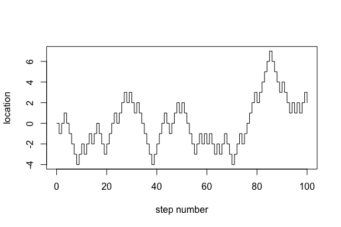

Simplifying this code into a (faster) implementation:

``` r
rand.walk<-function(x0=0,n=100) {
  x<-cumsum(c(x0,sample(c(-1,1),size=n,replace=TRUE)))
  return(x)
}
plot(0:1E5,rand.walk(n=1E5),xlab='step number',ylab='location',type='s')
```

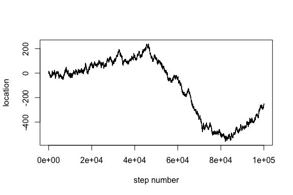
We can also run many of the Markov Chains from the same starting point:

``` r
walkers<-replicate(30,rand.walk(n=1E5))
plot(0:1E5,ylim=range(walkers),xlab='step number',ylab='location',type='n')
for (i in 1:ncol(walkers)) { 
  lines(0:1E5,walkers[,i],type='s',col=hsv(v=0,a=0.4))
}
```

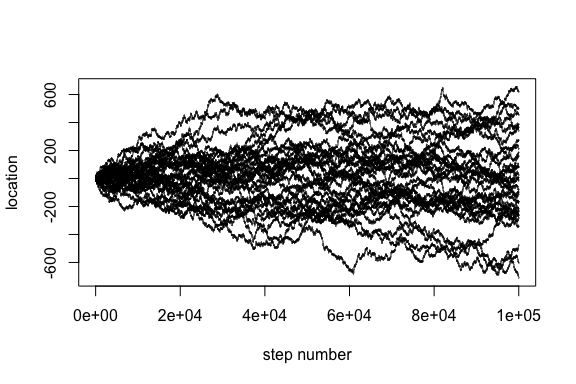

Using this random walk, we can now explore the transition probability we
discussed earlier:
$$
\\begin{align}
P^n(x,y) &= P(X\_n=y\|X\_0=x) \\\\
&= \\sum\_{x\_1}\\dots\\sum\_{x\_{n-1}} P(x,x\_1)P(x\_1,x\_2)\\dots P(x\_{n-1},y)
\\end{align}
$$
Analytically, this probability requires us to sum over all possible
values of *x*<sub>1</sub>, *x*<sub>2</sub>, …, *x*<sub>*n* − 1</sub>.
One question we might want to ask, though, is: what is the probability
of returning to my starting point as a function of the number of steps?

We can use our walker script will allow us to calculate this probability
relatively trivially:

``` r
walk.home<-function(x0=0,...) { 
  return(
    ifelse(any(rand.walk(x0=x0,...)[-1]==x0),1,0)
  )
}
arrived<-replicate(30,walk.home(n=1E2))
print(sum(arrived)/length(arrived))
```

``` out
## [1] 0.9333333
```

We can test this probability for a range of numbers of steps:

``` r
prob<-NULL
steps<-10^seq(0,5,len=20)
for (step_len in steps) { 
  arrived<-replicate(500,walk.home(n=step_len))
  prob<-c(prob,sum(arrived)/length(arrived))
}
magplot(steps,prob,ylim=c(0,1),log='x',xlab='step number',
ylab='probability of arriving home',type='l')
```

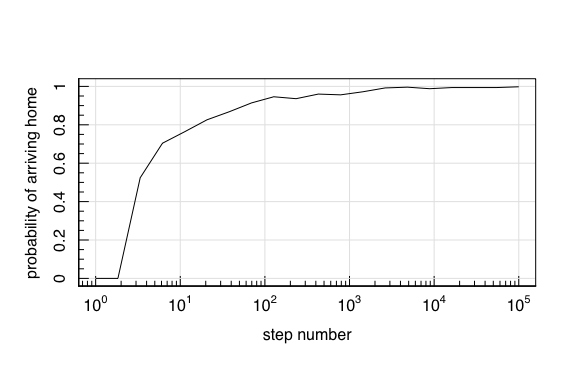

So with enough steps in 1*D*, a random walk is ∼guaranteed to make it
home.

## Higher Dimensions

What about in the more realistic case of 2D?

Do you think that:

> 1.  There’s a guarantee of returning home, similar to 1*D*? or
> 2.  The probability will plateau at *P*(arriving home) &lt; 1?

<!--}}}-->

# Higher Dimensional Random Walk

We can further generalise our random walk script to N dimensions fairly
easily:

``` r
rand.walk.nD<-function(x0=0,nStep=100,nD=1) {
  #Define the nStep steps as ±1
  steps<-sample(c(-1,1),size=nStep,replace=TRUE)
  #Select the axis in which each step occurs
  dims<-sample(1:nD,size=nStep,replace=TRUE)
  #Setup the walk coordinates
  x<-matrix(0,ncol=nD,nrow=nStep)
  #Loop over each dimension
  for (i in 1:nD) { 
    #For this dimension, assign the steps
    x[dims==i,i]<-steps[dims==i]
    #Calculate the cumulative sum
    x[,i]<-cumsum(x[,i])
  }
  #Return
  return(x)
}
```

We can then use our new function to plot random walks in 2*D*. First,
with few steps per chain:

``` r
#Plot a few walks with various steps
set.seed(666)
layout(cbind(1,2))
magplot(rand.walk.nD(nStep=1e2,nD=2),xlab='location x',ylab='location y',
     type='l',col=hsv(v=0,a=0.3),xlim=c(-15,15),ylim=c(-15,15),asp=1,lwd=2)
lines(rand.walk.nD(nStep=1E2,nD=2),col=hsv(h=2/3,v=0.8,a=0.3),lwd=2)
lines(rand.walk.nD(nStep=1E2,nD=2),col=hsv(h=0,v=0.8,a=0.3),lwd=2)
magplot(rand.walk.nD(nStep=1E2,nD=2),xlab='location x',ylab='location y',
     type='l',col=hsv(v=0,a=0.3),xlim=c(-15,15),ylim=c(-15,15),asp=1,lwd=2)
lines(rand.walk.nD(nStep=1E2,nD=2),col=hsv(h=2/3,v=0.8,a=0.3),lwd=2)
lines(rand.walk.nD(nStep=1E2,nD=2),col=hsv(h=0,v=0.8,a=0.3),lwd=2)
```

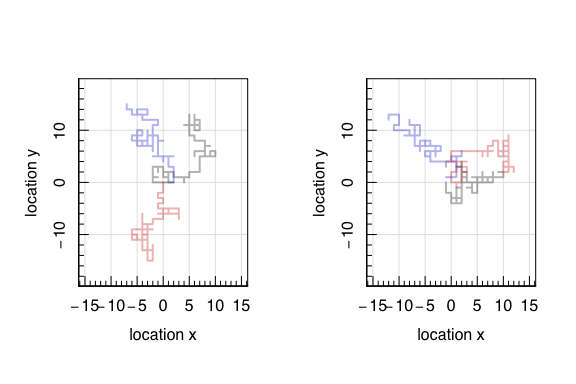
Adding more steps:

``` r
#Plot a few walks with various steps
set.seed(666)
layout(cbind(1,2))
magplot(rand.walk.nD(nStep=1E4,nD=2),xlab='location x',ylab='location y',
     type='l',col=hsv(v=0,a=0.3),xlim=c(-100,100),ylim=c(-100,100),asp=1,lwd=2)
lines(rand.walk.nD(nStep=1E4,nD=2),col=hsv(h=2/3,v=0.8,a=0.3),lwd=2)
lines(rand.walk.nD(nStep=1E4,nD=2),col=hsv(h=0,v=0.8,a=0.3))
magplot(rand.walk.nD(nStep=1E4,nD=2),xlab='location x',ylab='location y',
     type='l',col=hsv(v=0,a=0.3),xlim=c(-100,100),ylim=c(-100,100),asp=1,lwd=2)
lines(rand.walk.nD(nStep=1E4,nD=2),col=hsv(h=2/3,v=0.8,a=0.3),lwd=2)
lines(rand.walk.nD(nStep=1E4,nD=2),col=hsv(h=0,v=0.8,a=0.3),lwd=2)
```

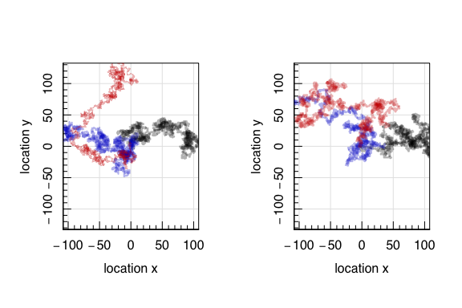
And more again:

``` r
#Plot a few walks with various steps
set.seed(666)
layout(cbind(1,2))
magplot(rand.walk.nD(nStep=1E5,nD=2),xlab='location x',ylab='location y',lwd=2,
     type='l',col=hsv(v=0,a=0.3),xlim=c(-350,450),ylim=c(-300,200),asp=1)
lines(rand.walk.nD(nStep=1E5,nD=2),col=hsv(h=2/3,v=0.8,a=0.3),lwd=2)
lines(rand.walk.nD(nStep=1E5,nD=2),col=hsv(h=0,v=0.8,a=0.3),lwd=2)
magplot(rand.walk.nD(nStep=1E5,nD=2),xlab='location x',ylab='location y',
     type='l',col=hsv(v=0,a=0.3),xlim=c(-200,200),ylim=c(-300,300),asp=1,lwd=2)
lines(rand.walk.nD(nStep=1E5,nD=2),col=hsv(h=2/3,v=0.8,a=0.3),lwd=2)
lines(rand.walk.nD(nStep=1E5,nD=2),col=hsv(h=0,v=0.8,a=0.3),lwd=2)
```

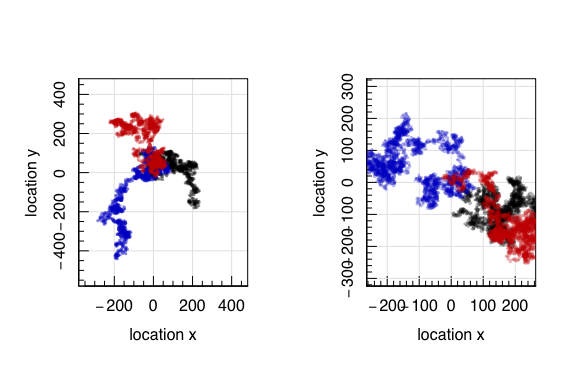

We can see that these 6 random walks all meander around the plane.

And so now we can ask the question of whether we ever return to the
origin in 2D with a random walk as well. We can generate many random
walks, as before, and find the number that return to the origin:

``` r
library(matrixStats)
#Define our new walk home function
walk.home.nD<-function(x0=0,...) { 
  return(
    ifelse(any(rowAlls(rand.walk.nD(x0=x0,...)[-1,,drop=FALSE]==x0)),1,0) 
  )
}
#Compute the probability of returning home
steps<-10^seq(1,5,len=5)
prob<-matrix(NA,nrow=length(steps),ncol=3)
for (nD in 1:3) { 
  for (i in 1:length(steps)) { 
    arrived<-replicate(1e3,walk.home.nD(nStep=steps[i],nD=nD))
    prob[i,nD]<-sum(arrived)/length(arrived)
  }
}
magplot(steps,xlim=range(steps),ylim=c(0,1),log='x',xlab='step number',
ylab='probability of arriving home',type='n')
colours<-c("blue3","black","red3")
for (nD in 1:3) { 
  lines(steps,prob[,nD],lwd=2,col=colours[nD])
}
legend('bottom',legend=paste0(1:3,"D"),col=colours,lwd=2,bty='n',inset=0.02)
```

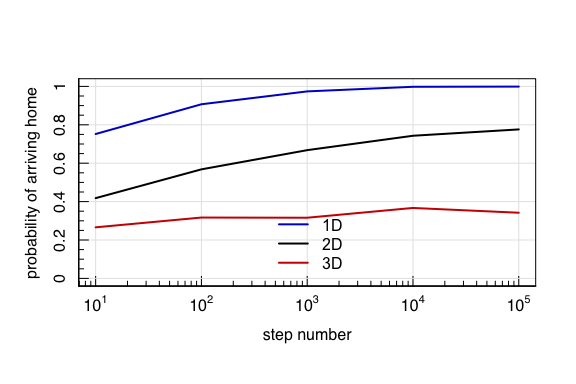

If you expand the figure out to much higher numbers of steps, it turns
out that you do return home with certainty (as *n*<sub>step</sub> → ∞)
in both one and two-dimensions. However in 3D, you only have a  ∼ 35%
chance of making it home.

The drunken human is much more likely to chance upon their home than is
the drunken fish!

<!--}}}-->

# Important Markov Chain Properties <!--{{{-->

There are two primary properties of a Markov chain that are important to
be aware of, as they will become important later.

## Aperiodicity

The period *d**x* of a particular chain state *x* is formally the
largest common divisor of the set
{*n* ≥ 1 : *P*<sup>*n*</sup>(*x*, *x*) &gt; 0}; that is, the value that
describes the rate at which a chain is able to revisit a state *x* given
that it is currently at state *x*.

The Markov Chain is **aperiodic** if *d**x* = 1: the chain is able to
return to t state *x* without any formal waiting/cycling period. Note
that  
*P*<sup>*n*</sup>(*x*, *x*) &gt; 0 implies that *d**x* = 1. If a chain
is periodic, then it is only able to revisit certain parts of the state
space at finite intervals.

## Irreducibility

A markov chain is said to be ***π*-irreducible** if, for every
*x*, *y* ∈ *Ω*:
*π*(*y*) &gt; 0 → *P*(*x*<sub>*n*</sub> = *y*\|*x*<sub>0</sub> = *x*) &gt; 0.
Irreducibility means that the chain can move from anywhere in the state
space (*x*) to any other point in the state space (*y*) in a finite
number of steps (*n*).

<!--}}}-->

# Building an MCMC Sampler: The Gibbs Sampler <!--{{{-->

The first MCMC sampler that we are going to look at is the **Gibbs
Sampler**. Consider a pair of variables *X*, *Y*, whose joint
distribution is denoted by *π*(*x*, *y*).

The Gibbs Sampler generates a sample from *π*(*x*), i.e. the marginal
density of *π* with respect to x, by sampling (in turn) from the
conditional distributions *π*(*x*\|*y*) and *π*(*y*\|*x*), which
frequently known in statistical models of complex data. This is done by
generating a “gibbs sequence” of random variables:
*Y*<sub>0</sub><sup>′</sup>, *X*<sub>0</sub><sup>′</sup>, *Y*<sub>1</sub><sup>′</sup>, *X*<sub>1</sub><sup>′</sup>, …, *Y*<sub>*N*</sub><sup>′</sup>, *X*<sub>*N*</sub><sup>′</sup>
The initial value *Y*<sub>0</sub><sup>′</sup> is chosen arbitrarily, and
all other values are found iteratively by generating values from:
$$
X^\\prime\_t \\sim \\pi(x\|Y^\\prime\_t) \\\\
Y^\\prime\_{t+1} \\sim \\pi(x\|X^\\prime\_t)
$$
This is known as **Gibbs Sampling**.

It turns out that, under reasonably general conditions, the distribution
of *X*<sub>*N*</sub><sup>′</sup> converges to *π*(*x*) as *N* → ∞. Said
differently, provided *N* is large enough, the final observation of
*X*<sub>*N*</sub><sup>′</sup> is effectively a sample from *π*(*x*).

# The Gibbs Sampler: Algorithm <!--{{{-->

1.  Initialise
    *X⃗* = (*X*<sub>0</sub><sup>(1)</sup>,…,*X*<sub>0</sub><sup>(*d*)</sup>)
2.  Simulate *X*<sub>1</sub><sup>(1)</sup> from the conditional
    distributions of
    *π*(*X*<sup>(1)</sup>\|*X*<sub>0</sub><sup>(2)</sup>, …, *X*<sub>0</sub><sup>(*d*)</sup>)
3.  Simulate *X*<sub>1</sub><sup>(2)</sup> from the conditional
    distributions of
    *π*(*X*<sup>(2)</sup>\|*X*<sub>1</sub><sup>(1)</sup>, *X*<sub>0</sub><sup>(3)</sup>, …, *X*<sub>0</sub><sup>(*d*)</sup>)
4.  …
5.  Iterate

## Demonstration: Bivariate Gaussian

Consider a single observation (*y*<sub>1</sub>, *y*<sub>2</sub>) from a
bivariate normally distributed population with unknown mean
*θ* = (*θ*<sub>1</sub>, *θ*<sub>2</sub>) and known covariance matrix:
$$
\\begin{pmatrix}
1 & \\rho \\\\
\\rho & 1 \\\\ 
\\end{pmatrix}
$$

With a uniform prior distribution on *θ*, the posterior distribution is
$$
{\\theta\_1 \\choose \\theta\_2}\|y\\sim N\\left({y\_1 \\choose y\_2},
\\begin{pmatrix}
1 & \\rho \\\\
\\rho & 1 \\\\ 
\\end{pmatrix}
\\right)
$$
Although we can sample from this directly, let’s pretend that we cannot.

To apply the Gibbs sampler we must first know the form of the
conditional posterior distributions. From the properties of the
multivariate normal distribution these are:
$$
\\theta\_1\|\\theta\_2,y\\sim N(y\_1+\\rho(\\theta\_2-y\_2),1-\\rho^2) \\\\
\\theta\_2\|\\theta\_1,y\\sim N(y\_2+\\rho(\\theta\_1-y\_1),1-\\rho^2) \\\\
$$

Let’s set *ρ* = 0.8, and (*y*<sub>1</sub>, *y*<sub>2</sub>) = (0, 0),
and use the initial guess
*X*<sub>0</sub><sup>1</sup>, *X*<sub>0</sub><sup>2</sup> = ( ± 2.5,  ± 2.5)
(that is, we’re running 4 distinct chains).

``` r
#Gibbs Sampler in R 
Gibbs<-function(start,n=1e3,rho=0.8) {
  #Initialise the variables 
  X<-Y<-rep(NA,n)
  #Enter the initial guesses 
  X[1]<-start[1]
  Y[1]<-start[2]
  #Loop over the next n steps
  for (i in 2:n) { 
    #Generate the sample for X
    X[i]<-rnorm(1,rho*Y[i-1],sqrt(1-rho^2))
    Y[i]<-rnorm(1,rho*X[i],sqrt(1-rho^2))
  }
  return(cbind(X,Y))
}
```

Let’s start by plotting the first 15 samples from each of our Gibbs
sequences:

``` r
#Define the initial guesses 
set.seed(666)
starts<-expand.grid(c(-2.5,2.5),c(-2.5,2.5))
#Construct the Gibbs Samples 
samps<-{}
for (j in 1:nrow(starts)) 
  samps[[j]]<-Gibbs(start=unlist(starts[j,]),n=15)
#Plot the samples 
magplot(starts,type='p',xlab=expression(theta_1),ylab=expression(theta_2),
        xlim=c(-5,5),ylim=c(-5,5),lwd=2,cex=2)
colours<-c("red3","green3","orange","blue3")
for (i in 1:nrow(starts)){ 
  lines(samps[[i]],lty=1,lwd=2,col=seqinr::col2alpha(colours[i],0.8))
}
```

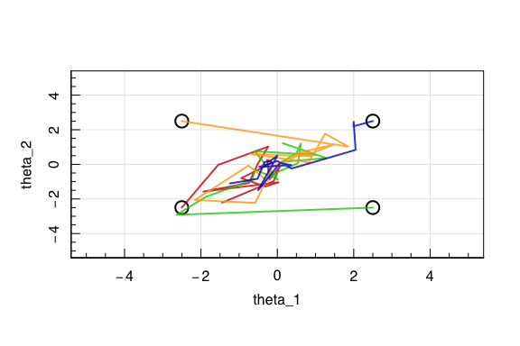
You can see our four starting guesses as the black circles, and the
subsequent samples of the sequence.

Let’s now crank it up to many samples:

``` r
#Define the initial guesses 
set.seed(666)
starts<-expand.grid(c(-2.5,2.5),c(-2.5,2.5))
#Construct the Gibbs Samples 
samps<-{}
for (j in 1:nrow(starts)) 
  samps[[j]]<-Gibbs(start=unlist(starts[j,]))
#Plot the samples 
magplot(starts,type='p',xlab=expression(theta_1),ylab=expression(theta_2),
        xlim=c(-5,5),ylim=c(-5,5),lwd=2,cex=2)
colours<-c("red3","green3","orange","blue3")
for (i in 1:nrow(starts)){ 
  lines(samps[[i]],lty=1,lwd=2,col=seqinr::col2alpha(colours[i],0.2))
}
```

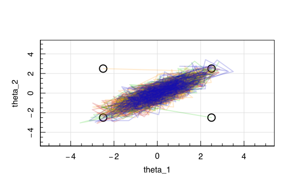
With so many samples the individual points now become more useful to
plot:

``` r
#Define the initial guesses 
#Plot the samples without consideration of the order
magplot(starts,type='p',xlab=expression(theta_1),ylab=expression(theta_2),
        xlim=c(-5,5),ylim=c(-5,5),lwd=2,cex=2)
colours<-c("red3","green3","orange","blue3")
for (i in 1:nrow(starts)){ 
  points(samps[[i]],pch=20,cex=1,col=seqinr::col2alpha(colours[i],0.3))
}
```

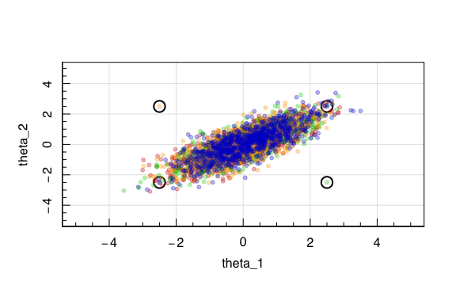

<!--}}}-->
<!--}}}-->

# The Metropolis-Hastings Algorithm <!--{{{-->

An alternative, more general, way to construct an MCMC sampler is as a
form of generalised rejection sampling, where the values are drawn from
appropriate approximate distributions and are “corrected” in order that
they, asyptotically, behave as random observations from the target
distribution.

This is the motivation for the **Metropolis-Hastings Algorithm**, which
sequentially draws candidate observations from a distribution,
conditional only on the last observation, thereby inducing a markov
chain.

The important aspect of the algorithm is that the approximating
candidate distribution is improved at each step in the simulation, if we
chose to let it depend on th previous observations. This is distinct
from rejection sampling (which we’ve already discussed) where the
candidate distribution must remain the same.

## The MH Algorithm

Set *t* = 1 and while *t* ≤ *N*:

1.  Generate *y* from *Q*(*x*<sub>*t*</sub>, .) and *U* from *U*(0, 1);
2.  let *x*<sub>*t* + 1</sub> = *y* if
    *U* ≤ *α*(*x*<sub>*t*</sub>, *y*), otherwise let
    *x*<sub>*t* + 1</sub> = *x*<sub>*t*</sub>.
3.  *t* = *t* + 1; iterate.

where

> -   *Q*(., .) is the **candidate generation function**, which can be
>     interpreted as saying that, when a process is at the point *x*,
>     the density generates a value *y* from *Q*(*x*, *y*).
> -   *α*(., .) is the **acceptance probability**, defined by:
>     $$
>     \\alpha(x,y)=
>     \\begin{cases}
>     \\min\\left(1, \\frac{\\pi(y)Q(y,x)}{\\pi(x)Q(x,y)}\\right) & \\textrm{if}\\;\\; \\pi(x)Q(x,y) &gt; 0 \\\\
>     0 & \\textrm{otherwise.}\\\\
>     \\end{cases}
>     $$
>     That is, if the move is accepted, the provrdd moves to *y*,
>     otherwise it remains at *x*.

This process produces samples from the target distribution.

## Special Cases of *Q*(*x*, *y*)

### Gibbs

The Gibbs Sampler is therefore a special case of the MH algorithm, where
the candidate generating function *Q*(*x*, *y*) is the conditional
distribution:
*Q*(*x*, *y*) = *π*(*x*\|*y*)
and the acceptance probability is unity for all *x*, *y*:
*α*(*x*, *y*) = 1  ∀(*x*, *y*).

### Random-Walk Metropolis-Hastings

If we use a candidate generation function of the form:
*Q*(*x*, *y*) = *f*(\|*y* − *x*\|)
for some arbitrary density function *f*, the kernal driving the proposal
is therefore a **random walk**, like what we explored previously. This
is because the observation is of the form
*y*<sub>*t* + 1</sub> = *x*<sub>*t*</sub> + *z*, where *z* ∼ *f*.

There are many common choices for *f*, some of which you are probably
already thinking about: the uniform distribution, multivariate normal,
and Student t-distributions are all of this form, simple, and analytic,
and so are very useful in this application.

Note also that, if *f* is symmetric:
*f*(*z*) = *f*( − *z*),
then the acceptance probability is of the form:
$$
\\alpha(x,y)=\\min\\left(1,\\frac{\\pi(x)}{\\pi(y)}\\right), 
$$
meaning that acceptance is determined simply by the ratio of target
distribution densities at the current and proposed positions.

### The Independence Sampler

If *Q*(*x*, *y*) = *f*(*y*), then the candidate location is drawn
independent of the current state of the chain. In this case the
acceptance probability can be written as:
$$
\\alpha(x,y)=\\min\\left(1,\\frac{w(y)}{w(x)}\\right),
$$
where *w*(*x*) = *π*(*x*)/*f*(*x*) is the importance weight function
that would be used in **importance sampling**, given observations
generated from *f*. In this way importance sampling and independence
sampling are not dissimilar: importance sampling builds up mass by
frequently returning to the state *x*, given a large *w*(*x*). The
Independence sampler, however, builds up mass on *x* by not *leaving*.

# MH Demonstration: Bivariate Gaussian

The target density is a bivariate unit normal distribution
*π*(*θ*\|*y*) = *N*(*θ*\|0, *I*) where *I* is the 2 × 2 identity matrix.
The proposal distribution is also a bivariate Gaussian, which is centred
at the current iteration:
*Q*(*θ*<sup>*t*</sup>\|*θ*<sup>*t* − 1</sup>) = *N*(*θ*<sup>⋆</sup>\|*θ*<sup>*t* − 1</sup>, 0.2<sup>*I*</sup>).
This is therefore a random walk proposal with symmetric probability.

``` r
#Example of writing our own MH algorithm in R
#Load the "multivariate Normal" package
library(mvtnorm)
#Write our Bivariate Normal MH function 
bvnm.MH<-function(n,start) { 
  #Initialise the variables
  X<-Y<-rep(NA,n)
  X[1]<-start[1]
  Y[1]<-start[2]
  Id<-diag(2) # The identity matrix
  #Loop over our iterations 
  for (i in 2:n) { 
    #Generate a proposal point
    prop<-rmvnorm(1,c(X[i-1],Y[i-1]),0.2*Id)
    #Compute the acceptance probability pi(y)/pi(x)
    accept<-dmvnorm(prop,c(0,0),Id)/
            dmvnorm(c(X[i-1],Y[i-1]),c(0,0),Id)
    #Draw a random univariate 
    u<-runif(1)
    #Test the acceptance criteria
    if (u<accept) { 
      #Accept the new data point
      X[i]<-prop[1]
      Y[i]<-prop[2]
    } else { 
      X[i]<-X[i-1]
      Y[i]<-Y[i-1]
    }
  }
  return(cbind(X,Y))
}
```

Now that we have our MH algorithm set up, we can run a chain:

``` r
#Running our MH Code
chain<-bvnm.MH(1e3,start=c(-10,10))
magplot(chain,type='l',col='blue3',lwd=2,xlab=expression(theta[1]),
        ylab=expression(theta[2]))
```


# Important Questions in MCMC <!--{{{-->

Iterative simulation from the posterior adds two primary difficulties to
simulation inference. Namely:

1.  How long does a chain need to run before it is “long enough”?
2.  How many samples do we need to perform unbiased inference?

There are two primary ways of dealing with these questions.

## Burn in

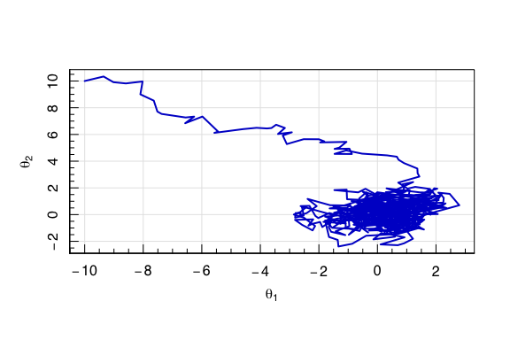

If the chain has not been run for a sufficiently large number of
iterations, the simulated samples may be grossly unrepresentative of the
posterior that we wish to infer. The long trail of samples that travel
from the starting guess into the main cloud of samples is a principle
example. These samples are known as the **burn in**, and should be
discarded.

``` r
#Burn in 
layout(cbind(1,2))
magplot(chain[,1],type='l',col='blue3',lwd=2,xlab="Step Number",
        ylab=expression(theta[1]))
magplot(chain[,2],type='l',col='blue3',lwd=2,xlab="Step Number",
        ylab=expression(theta[2]))
```

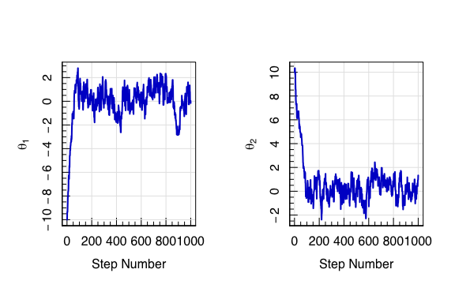
Particularly for small numbers of samples (i.e. short chains) these
burn-in samples can be pathological. However in all chains they clearly
do not sample the target distribution, so should be discarded.

``` r
#Removing Burn in 
chain<-chain[-200:0,]
layout(cbind(1,2))
magplot(chain[,1],type='l',col='blue3',lwd=2,xlab="Step Number",
        ylab=expression(theta[1]))
magplot(chain[,2],type='l',col='blue3',lwd=2,xlab="Step Number",
        ylab=expression(theta[2]))
```

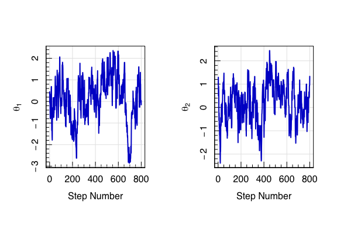

## Thinning

We want our final posterior samples to be i.i.d observations from the
target distribution. However, the iterative nature of the MCMC means
that the sequence of draws is **not** independent.

``` r
#Correlation in Samples 
layout(cbind(1,2))
magplot(chain[-1,1],chain[-nrow(chain),1],pch=20,col='blue3',lwd=2,
        ylab=expression(theta[1]^"i+1"),xlab=expression(theta[1]^i),asp=1)
magplot(chain[-1,2],chain[-nrow(chain),2],pch=20,col='blue3',lwd=2,
        ylab=expression(theta[2]^"i+1"),xlab=expression(theta[2]^i),asp=1)
```

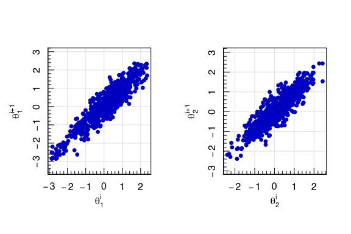

However we can circumvent this by **thinning** the samples to every
$n^{\\textrm{th}$ sample (but of course this necessitates a longer
chain).

``` r
#Independence in thinning
chain<-bvnm.MH(5e4,start=c(-10,10))
chain<-chain[-200:0,]
thin<-function(x,by) x[seq(1,nrow(x),by=by),]
layout(matrix(1:4,2,2,byrow=TRUE))
par(mar=c(3,4,1,1))
chain.fifth<-thin(chain,by=5)
chain.twent<-thin(chain,by=20)
chain.hundr<-thin(chain,by=100)
colour<-seqinr::col2alpha('blue3',0.3)
magplot(chain[-1,1],chain[-nrow(chain),1],pch=20,col=colour,lwd=2,
        ylab=expression(theta[1]^"i+1"),xlab=expression(theta[1]^i),asp=1)
magplot(chain.fifth[-1,1],chain.fifth[-nrow(chain.fifth),1],pch=20,col=colour,lwd=2,
        ylab=expression(theta[1]^"i+5"),xlab=expression(theta[1]^i),asp=1)
magplot(chain.twent[-1,1],chain.twent[-nrow(chain.twent),1],pch=20,col=colour,lwd=2,
        ylab=expression(theta[1]^"i+20"),xlab=expression(theta[1]^i),asp=1)
magplot(chain.hundr[-1,1],chain.hundr[-nrow(chain.hundr),1],pch=20,col=colour,lwd=2,
        ylab=expression(theta[1]^"i+100"),xlab=expression(theta[1]^i),asp=1)
```

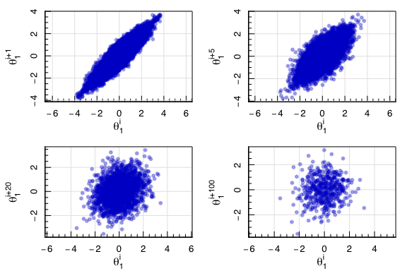
So the thinning to every  ∼ 10<sup>th</sup> sample is reasonably
independent, without producing a significant decrease in the accepted
number of samples (as with the 100<sup>th</sup> sample thinning.
<!--}}}-->

# A Bayesian MH Problem <!--{{{-->

Now that we have the MH algorithm formalised, we can try tackling a
proper Bayesian problem. Let’s go back to our old standard problem, coin
tosses, but with a bit of a twist.

We are given a bag of coins, and are told that a certain fraction of the
coins are biased. We are not told how many coins are biased, nor what
their biasing is. We draw a random coin from the bag 1000 times, toss it
3 times, and record the number of observed heads.

``` r
#Generate and Plot some data
set.seed(42)
data<-simulate.throws(1e3)
maghist(data,xlab='Number of Heads in 3 tosses',ylab='Count',verbose=FALSE)
```

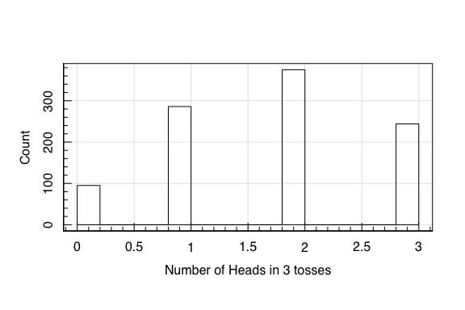

We want to infer, given the observations, the likely values of the
fraction of coins in the bag which are biased *θ*<sub>1</sub>, and the
amount of biasing that affects each biased coin *θ*<sub>2</sub>. That
is, we want to know the posterior distribution
*P*(*θ*<sub>1</sub>, *θ*<sub>2</sub>\|*x*).

Recall the procedure for performing Bayesian Inference:

> 1.  Specification of the likelihood model *p*(*x*\|*θ*);
> 2.  Determination of the prior *p*(*θ*);
> 3.  Calculation of the posterior distribution *p*(*θ*\|*x*); and
> 4.  Draw inference from the posterior distribution.

## The likelihood model

In our case, the likelihood model consists of 3 parts:

1.  The probability of drawing a biased coin from the bag
2.  The probability of a biased coin showing *x* heads in 3 trials
3.  The probability of a fair coin showing *x* heads in 3 trails

All of these probabilities can be described using binomials:

1.  biased coin\|*θ*<sub>1</sub> ∼ Bin(1, *θ*<sub>1</sub>)
2.  *x* heads\|biased coin, *θ*<sub>2</sub> ∼ Bin(3, *θ*<sub>2</sub>)
3.  *x* heads\|fair coin ∼ Bin(3, 0.5)

So we can construct our likelihood from these probabilities:
$$
\\begin{align}
P(X\|\\theta\_1,\\theta\_2) &= P(X\|n,0.5)(1-\\theta\_1)+P(X\|n,\\theta\_2)\\theta\_1 \\\\
&=\\left\[\\textrm{Bin}(3,0.5)(1-\\theta\_1)+\\textrm{Bin}(3,\\theta\_2)\\theta\_1\\right\]
\\end{align}
$$
for *θ*<sub>1</sub>, *θ*<sub>2</sub> ∈ \[0, 1\].

Which in **R** code is simply:

``` r
#Define a handy "interval" function 
interval<-function(x,min,max) ifelse(x>=min & x<=max,x,0)
likelihood<-function(x,n,theta1,theta2) { 
  #Ensure that theta's are in 0,1
  theta1=interval(theta1,0,1)
  theta2=interval(theta2,0,1)
  #Calculate the value of the likelihood at this theta1,theta2
  val=dbinom(x=x,size=n,prob=0.5)*(1-theta1)+
      dbinom(x=x,size=n,prob=theta2)*theta1
  #Return the value
  return(val)
}
```

## The Priors

We have no idea what the values of the biases on the coins are, nor
about what fraction of coins in the bag are biased. Therefore, we ought
to impose an uninformative uniform prior on all possible values of
*θ*<sub>1</sub>, *θ*<sub>2</sub>.
$$
P(\\theta\_i)=
\\begin{cases}
1 & 0\\leq \\theta\_i\\leq 1\\\\
0 & \\textrm{otherwise}
\\end{cases}
$$

``` r
prior<-function(theta1,theta2) { 
  #Calculate the value of the prior at theta1,theta2
  val=dunif(x=theta1,min=0,max=1)*
      dunif(x=theta2,min=0,max=1)
  #Return the value
  return(val)
}
```

## Calculate the posterior distribution

This is where our sampler comes in. We know from Bayes theorem that the
posterior is proportional to the likelihood times the prior, and we want
to sample from this unknown distribution to produce points that we can
use to perform inference about the properties of the posterior.

``` r
coins.MH<-function(n,start) { 
  #Initialise the variables
  X<-Y<-rep(NA,n)
  X[1]<-start[1]
  Y[1]<-start[2]
  #Loop over our iterations 
  Id<-diag(2)
  #Define the posterior evaluation
  log.posterior<-function(x,n,theta1,theta2) 
    return(log(prior(theta1,theta2))+sum(log(likelihood(x=x,n=n,theta1=theta1,theta2=theta2))))
  #Loop over the steps in the chain  
  for (i in 2:n) { 
    #Generate a proposal point 
    prop<-rmvnorm(1,c(X[i-1],Y[i-1]),0.05*Id)
    #Compute the acceptance probability pi(y)/pi(x)
    #Use logarithms to avoid rounding errors
    accept<-exp(log.posterior(x=data,n=3,theta1=prop[1],theta2=prop[2])-
                log.posterior(x=data,n=3,theta1=X[i-1] ,theta2=Y[i-1] ))
    if (!is.finite(accept)) { accept<-0 } 
    #Draw a random univariate 
    u<-runif(1)
    #Test the acceptance criteria
    if (u<accept) { 
      #Accept the new data point
      X[i]<-prop[1]
      Y[i]<-prop[2]
    } else { 
      X[i]<-X[i-1]
      Y[i]<-Y[i-1]
    }
  }
  return(cbind(X,Y))
}
```

We now run our chain to construct our posterior samples:

``` r
#Running our MH Code
set.seed(42)
data<-simulate.throws(1e3)
chain<-coins.MH(1e4,start=c(0.8,0.1))
magplot(chain,type='l',col=seqinr::col2alpha('blue3',0.3),lwd=2,
        xlab=expression(theta[1]),ylab=expression(theta[2]))
```

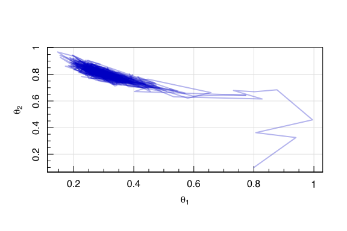

What are the three things that we’ve forgotten?

1.  Burn in removal
2.  Trimming
3.  Multiple starting points

So let’s do those. First:

``` r
#Building more samples 
set.seed(42)
library(foreach)
library(doParallel)
```

    ## Loading required package: iterators

    ## Loading required package: parallel

``` r
registerDoParallel(cores=4)
chain<-foreach(i=1:8,.combine='rbind',.inorder=TRUE)%dopar%{
  return(
    cbind(coins.MH(1e4,start=c(runif(1),runif(1))),i)
  )
}
magplot(chain[,1:2],type='n',pch=20,col=seqinr::col2alpha('blue3',0.3),lwd=2,
        xlab=expression(theta[1]),ylab=expression(theta[2]),asp=1)
colours<-RColorBrewer::brewer.pal(8,"Set2")
for (i in 1:max(chain[,3])) { 
  lines(chain[which(chain[,3]==i),1:2],
        col=seqinr::col2alpha(colours[i],0.3),lwd=2)
}
```

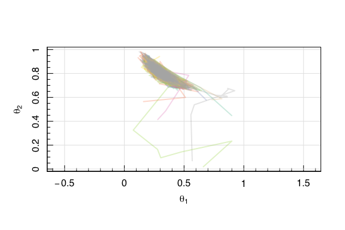

``` r
#Cleaning up our posterior samples: Burn in removal
layout(cbind(1,2))
magplot(chain[,1],type='l',col='blue3',lwd=2,xlab="Step Number",
        ylab=expression(theta[1]))
magplot(chain[,2],type='l',col='blue3',lwd=2,xlab="Step Number",
        ylab=expression(theta[2]))
```

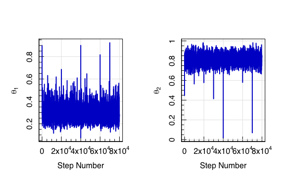

``` r
chain<-chain[-1e2:0,]
magplot(chain[,1],type='l',col='blue3',lwd=2,xlab="Step Number",
        ylab=expression(theta[1]))
magplot(chain[,2],type='l',col='blue3',lwd=2,xlab="Step Number",
        ylab=expression(theta[2]))
```


And now our thinning:

``` r
#Cleaning up our posterior samples: Thinning 
layout(matrix(1:4,2,2,byrow=TRUE))
par(mar=c(3,4,1,1))
chain.fifth<-thin(chain,by=5)
chain.twent<-thin(chain,by=20)
chain.hundr<-thin(chain,by=100)
magplot(chain[-1,1],chain[-nrow(chain),1],pch=20,col=colour,lwd=2,
        ylab=expression(theta[1]^"i+1"),xlab=expression(theta[1]^i),asp=1)
magplot(chain.fifth[-1,1],chain.fifth[-nrow(chain.fifth),1],pch=20,col=colour,lwd=2,
        ylab=expression(theta[1]^"i+5"),xlab=expression(theta[1]^i),asp=1)
magplot(chain.twent[-1,1],chain.twent[-nrow(chain.twent),1],pch=20,col=colour,lwd=2,
        ylab=expression(theta[1]^"i+20"),xlab=expression(theta[1]^i),asp=1)
magplot(chain.hundr[-1,1],chain.hundr[-nrow(chain.hundr),1],pch=20,col=colour,lwd=2,
        ylab=expression(theta[1]^"i+100"),xlab=expression(theta[1]^i),asp=1)
```

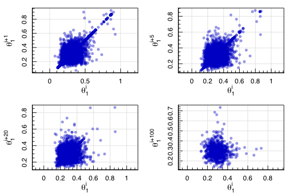

With our cleaned samples we can now do our posterior inference:

``` r
#Final posterior samples 
chain<-thin(chain,10)
magplot(chain[,-3],type='p',pch=20,col=seqinr::col2alpha('blue3',0.3),lwd=2,
        xlab=expression(theta[1]),ylab=expression(theta[2]),asp=1)
```

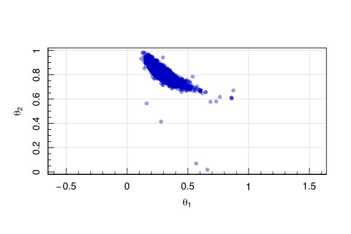

Recall that these posterior samples allow us to trivially compute the
marginal distributions:

``` r
#Final posterior samples 
layout(cbind(1,2))
magplot(density(chain[,1],bw=0.05),col='blue3',lwd=2,
        xlab=expression(theta[1]),ylab="PDF")
magplot(density(chain[,2],bw=0.05),col='blue3',lwd=2,
        xlab=expression(theta[2]),ylab="PDF")
```

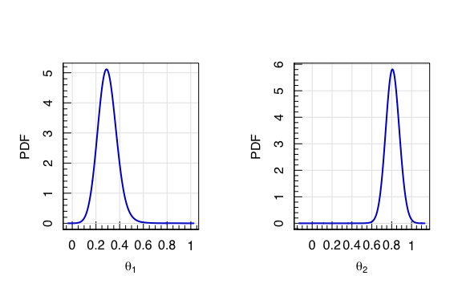

<!--}}}-->
<!--}}}-->
