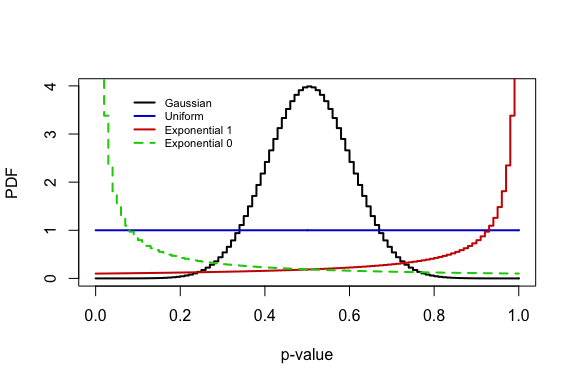
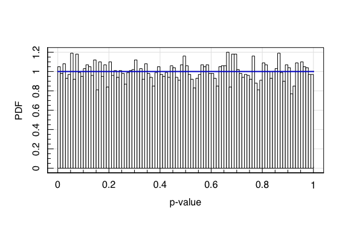
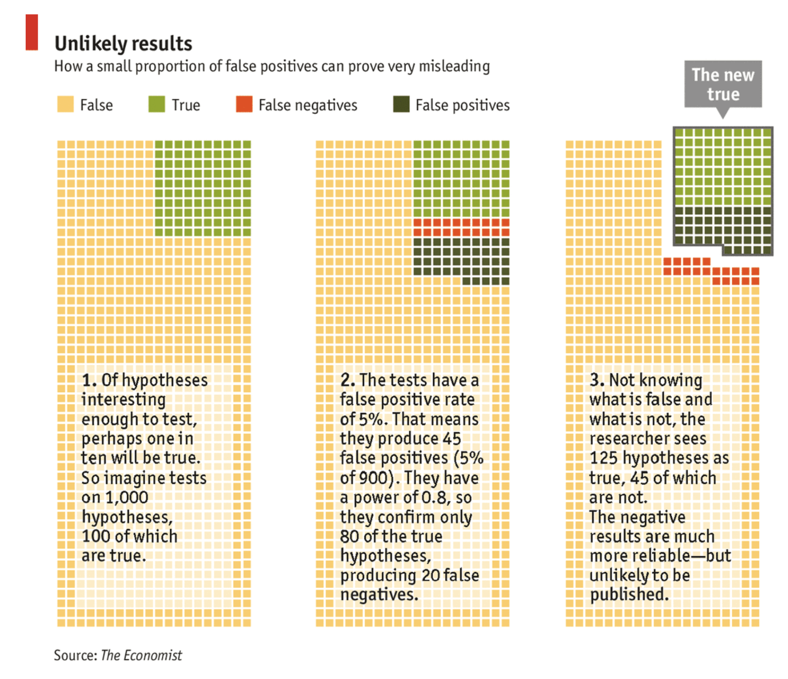

Introduction to Statistics for Astronomers and Physicists
================
Dr Angus H Wright
2022-02-09


# Section 4: Introduction <!--{{{-->

<!--Setup {{{-->
<style type="text/css">
.python { 
  background-color: 
    RColorBrewer::brewer.pal(1,"Set2");
} 
.out { 
  max-height: 300px;
  overflow-y: auto;
  background-color: inherit;
}
</style>

**Parameter Simulation, Optimisation, & Inference**

(or “Applying statistics in modern scientific analyses”)

We apply our understanding of Bayesian statistics to the common problems
of parameter simulation, optimisation, and inference. Students will
learn the fundamentals of hypothesis testing, quantifying
goodness-of-fit, and parameter inference. We discuss common errors in
parameter inference, including standard physical and astrophysical
biases that corrupt statistical analyses. <!--}}}-->

<!--}}}-->

# The reason we’re here <!--{{{-->

Our goal in this course is to formulate a basis for performing
statistical analyses, in the natural sciences, that you can use for the
rest of your academic careers.

To do that, you need to be able to do the following:

> -   Be able to explore and understand complex datasets (Section 1)
> -   Understand the probabilistic nature of experiments and
>     experimental variables (Section 2)
> -   Have access to tools that allow you to estimate models from data
>     (Section 3)
> -   Understand how to interpret models/results to perform accurate
>     **statistical inference** (Section 4).

<!--}}}-->

# A Significant Conundrum <!--{{{-->

Modern and future experiments will never produce data that covers the
entire population *Ω* of possible observations. Particles will always
bounce off one-another in slightly different ways. Different parts of
the universe will always present us with new and unique galaxies. There
will always be more coins to toss and more die to roll.

As a result, we will always be attempting to analyses models of
variables *θ* using samples of data, and therefore attempting inference
using estimates of *θ* that are random variables.

As a result, regardless of the experiment being undertaken, it is
generally relevant to ask whether or not an observed relationship,
parameter estimate, and/or measurement is “significantly” different from
previous work and/or expectations from (e.g.) theory.

Said differently, whenever we measure a variable, it is sensible for us
to ask whether or not the estimated value is consistent with our model
and/or previous estimates, given the expected random fluctuations of a
random variable.

## A simple demonstration: <!--{{{-->

Suppose we have a theory that the true average height of all human
beings is 184cm. Measuring the height of every human being is naturally
unfeasible, so we are forced to take a sample of *n* humans and just
measure their average height. This estimate of the average height is a
random variable, as it will vary from sample-to-sample. We wish to come
up with a method for determining whether or not any difference between
our estimate of the average height *θ* and 184cm is caused by random
variation due to our sampling, or whether it demonstrates that the
**true** average height is unlikely to be 184cm.

One method for performing such a determination would be to construct
some interval (given the data) within which you expect the *true* value
of *θ* to reside with some (quite high) probability: say 95%. If you
construct this interval and find that our hypothesised value of 184cm
resides outside it, then we can draw one of two conclusions:

1.  the value of *θ* = 184cm is unlikely to be correct; **or**
2.  we just got very unlucky with our chosen sample.

This procedure provides us with a mechanism for determining whether the
data that we have provides evidence to *contradict* a particular
hypothesis.

<!--}}}-->
<!--}}}-->

# Aside: the merits of contradiction <!--{{{-->

In the previous slide we formulated a method for assessing whether or
not evidence contradicted a particular hypothesis. Why not, instead,
come up with a measure of whether or not the data **agrees** with some
hypothesis?

Let me answer that question with another question:

-   How much evidence does it take to prove something is true?
-   How much evidence does it take to prove something is false?

This is somewhat the nature of scientific inquiry:

-   No amount of evidence can give absolute certainty that a hypothesis
    is true, it can only fail to show that it is false.
-   However you only need one piece of evidence to disprove a
    hypothesis.

<!--}}}-->

# Significance <!--{{{-->

Given our observed sample of human heights, we want to assess the
**significance** of the evidence against our particular hypothesis.

We can do this by calculating the fraction of samples of *n* humans that
would produce a sample mean that is as extreme as the one we observe
**if** the hypothesis is true.

Our hypothesis is that the population mean is *μ̂*, and we observe some
mean *x̄* from our sample of *n* observations. We approximate the
variance of *μ* using the variance of our sample *s*<sup>2</sup>, which
gives us an estimate of the standard error on *μ̂*: $s/\\sqrt{n}$.

We can then define a new random variable *t* which we call our *test
statistic*:
$$
t = \\frac{\\bar{x}-\\mu}{s/\\sqrt{n}},
$$

You may recall that this is the **student t-statistic** from Section
2*c*. The distribution of this variable therefore follows the student
t-distribution. This distribution has an analytic PDF, and means that we
can now trivially calculate the probability of observing a sample of
data that have mean *x̄* given *μ*, *n*, and *s*. Recall that the PDF of
the student t-distribution is:
$$
p(t; \\nu)   =   \\frac{\\Gamma(\\frac{\\nu+1}{2})}{\\Gamma\\left(\\frac{\\nu}{2}\\right)\\sqrt{\\pi \\nu}}\\left(1+\\frac{t^2}{\\nu}\\right)^{-(\\nu+1)/2}
$$
where *ν* = *N* − 1 is the degrees of freedom. The fraction of samples
that have less extreme values of *x̄* **if** the true population mean is
*μ* = *μ̂* is:
*f* = ∫<sub> − \|*t*\|</sub><sup>\|*t*\|</sup>*p*<sub>*t*</sub>(*x*; *ν*)d*x*

Consider a very positive (or very negative) value of *t*; in these
circumstances, *f* will be close to 1 (as  − \|*t*\| ≤ *x* ≤ \|*t*\|
contains all the probability mass of the distribution).

This indicates that essentially all random samples with *ν* degrees of
freedom would have less extreme values of *t* given the hypothesis that
*μ* = *μ̂*. A more convenient method of formulating this number is to
look at its complement:
*p* = 1 − *f*
which is the fraction of samples that have as extreme a value of *t*
given *μ* = *μ̂*. This is known as the **p-value**.

<!--}}}-->

# The p-value <!--{{{-->

In this lecturers opinion, the **p-value** is easily the most
misunderstood, misused, and/or misrepresented concept in statistics. So
what is the p-value, and what is it not.

> -   **What does the p-value tell you**: The p-value represents the
>     fraction of samples that would produce a test statistic that is as
>     extreme as the one observed, given that the proposed (generally
>     null) hypothesis is true.

> -   **What is the p-value *not* tell you**: The p-value does *not*
>     tell you anything about the probability that the proposed
>     hypothesis is correct, *nor* about whether or not the data can be
>     explained as being produced by random chance.

Nonetheless, the p-value is widely used in the academic literature as a
tool for hypothesis testing, and/or for justification that experimental
evidence is incompatible with the *null hypothesis* (i.e. that there is
no underlying effect/difference).

If we assume that we are willing to believe an effect if it has a
p-value of *α* or less; otherwise you reject the effect in favour of the
null hypothesis. The probability that you accept a hypothesis that is
actually *false*, is the fraction of samples that would give you a
satisfactory p-value even though the null hypothesis was true. But this
value is just *α*. So you can consider the p-value as being the
probability that you have accepted a hypothesis that is false.

## Using the p-value

In his original 1920 publication, Fisher used *p* &lt; 0.05 as an
example of a value that might be used to justify rejection of the null
hypothesis, when taken in the context of the entire experimental
landscape.

We’ve said already what the p-value describes. So now a question:

**Given purely random measurement bias, what distribution does the
p-value take under many realisations of an experiment?**

``` r
#What distribution should the p-value have? 
curve(dnorm(x,mean=0.5,sd=0.1),type='s',col='black',lwd=2,xlab='p-value',ylab='PDF')
curve(dunif(x),type='s',col='blue3',lwd=2,add=T)
curve(dbeta(x,shape1=1,shape2=0.1),type='s',col='red3',lwd=2,add=T)
curve(dbeta(x,shape1=0.1,shape2=1),type='s',col='green3',lwd=2,lty=2,add=T)
legend('topleft',inset=c(0.1,0.05),legend=c("Gaussian","Uniform","Exponential 1","Exponential 0"),
       col=c('black','blue3','red3','green3'),lwd=2,lty=c(1,1,1,2),bty='n',cex=0.7)
```



``` r
#Visualising the p-value in R
set.seed(666)
#Generate random data
obs<-rnorm(1e4)
#Calculate the p-value 
pval<-pnorm(abs(obs))-pnorm(-abs(obs))
#Plot the p-value 
maghist(pval,breaks=1e2,xlab='p-value',ylab='PDF',verbose=FALSE,col='white',
        freq=FALSE)
curve(dunif,lwd=2,col='blue3',add=T,type='s')
```


Which makes sense; the p-value describes the fraction of samples that
have more extreme values than that which we observed, assuming the null
hypothesis. If the null hypothesis is true, then we should see a p-value
as extreme as *α* occur *α*% of the time.

But this begs an important question: if every scientist were to use
*p* &lt; 0.05 as a metric for “a significant result worthy of
publication”, what fraction of published results ought to be false
positives?

<!--}}}-->

# How much published research is wrong? <!--{{{-->

Let’s assume that we’re looking at a field of research where there are
500 ongoing experiments, all exploring different possible physical
relationships. Of those 500 experiments, 50 of them are real physical
relationships.

If all researchers use a metric of *p* &lt; 0.05 as their determination
for whether an effect is real or not, *and researchers only publish when
they find a significant result*, what will the fraction of published
results that are wrong?

# A simple simulation

We can construct a simulation to demonstrate this situation. We simply
simulate 500 draws from a Gaussian, where 50 draws have *μ* ≠ 0 and the
rest have *μ* = 0. We can then compute the p-value for each of these
experiments, and “publish” those with ‘significant’ findings. Assume
that we know the true parameter variance *s*<sup>2</sup> = 1, for
simplicity.

``` r
#simulated experiments in R
set.seed(666)
run.experiments<-function(n=1e3,frac.true=0.1,p.thresh=0.05,stat.pwr=0.8,pub.only=FALSE) {
### n: Number of experiments being analysed 
### frac.true: Fraction of true relationships
### p.thresh: P-value required for significance 
### stat.pwr: Statistical Power per experiment 
#Number of true relationships; 10% of total
real<-c(rep(TRUE,n*frac.true),rep(FALSE,n*(1-frac.true)))
#Accurate measurements for the true relationships?
accurate<-ifelse(runif(n*frac.true)<=stat.pwr,TRUE,FALSE)
#Lucky measurements for the false relationships?
measurement<-rnorm(n*(1-frac.true))
lucky<-ifelse(pnorm(abs(measurement))-pnorm(-abs(measurement))<=p.thresh,TRUE,FALSE)
#So the Results
significant<-rep(NA,n)
#Real relationship with an accurate measurement 
significant[ real][ accurate]<-TRUE
#Real relationship with an inaccurate measurement 
significant[ real][!accurate]<-FALSE
#False relationship with a lucky sample 
significant[!real][ lucky]<-TRUE
#False relationship with an unlucky sample 
significant[!real][!lucky]<-FALSE
#Results: 
if (!pub.only) { 
  cat("All Results:\n")
  print(table(paste(ifelse(real,"TrueEffect","NoEffect"),
                    ifelse(significant,"SignificantResult","NoResult"),sep='+'))/n
  )
}
cat("Published Results:\n")
print(table(paste(ifelse(real[significant],"TrueEffect","NoEffect"),
                  "SignificantResult",sep='+'))/length(which(significant))
)
}
run.experiments()
```

``` out
## All Results:
## 
##            NoEffect+NoResult   NoEffect+SignificantResult          TrueEffect+NoResult 
##                        0.852                        0.048                        0.023 
## TrueEffect+SignificantResult 
##                        0.077 
## Published Results:
## 
##   NoEffect+SignificantResult TrueEffect+SignificantResult 
##                        0.384                        0.616
```

Standard scientific practice is that only measured relationships get
published, so while we have 85% insignificant findings, these generally
never see the light of day. Instead we only look at the significant
results.

So: If *everything is working as it should*, roughly one-third of all
published papers that use *p* ≤ 0.05 as a threshold for publication
ought to be false-positives. This fraction is determined by the
following important numbers:

-   The **Statistical Power**: how probable an experiment is to find a
    true relationship when one does exist
-   The **Ratio of true-to-false hypotheses**: if we have many many more
    false hypotheses than true ones, this effect is exacerbated
-   The **Significance Threshold**: what magic number people select for
    determining whether or not an effect is significant (i.e. the
    p-value threshold).

If we have particularly insightful and disciplined researchers:

``` r
run.experiments(frac.true=0.5,stat.pwr = 0.95,pub.only=TRUE)
```

``` out
## Published Results:
## 
##   NoEffect+SignificantResult TrueEffect+SignificantResult 
##                   0.05870841                   0.94129159
```

But if, for example, researchers are incentivised to explore greater
numbers of exotic hypotheses with less and less prior justification:

``` r
run.experiments(frac.true=0.01,pub.only=TRUE)
```

``` out
## Published Results:
## 
##   NoEffect+SignificantResult TrueEffect+SignificantResult 
##                    0.8787879                    0.1212121
```



<!--}}}-->
<!--}}}-->

# Pratical Statistical Inference <!--{{{-->

So it’s clear that the use of a standard threshold for p-values as a
measure of significance can lead to problematic numbers of incorrect
results being published in the literature.

However, as we just saw, this effect can be calculated simply. So why is
it a problem, provided that we can easily demonstrate the effect, and so
account for it? Why not, for example, use the high-energy physics mantra
of *p* &lt; 0.001 and be done with it?

``` r
set.seed(666)
run.experiments(p.thresh=0.001,pub.only=TRUE)
```

``` out
## Published Results:
## 
##   NoEffect+SignificantResult TrueEffect+SignificantResult 
##                   0.01282051                   0.98717949
```

# The Problem is Choice


At it’s simplest level, when provided an arbitrary dataset, our
statistical analyses will involve two steps:

1.  **Data mining**: where we explore and summarise the data; and
2.  **Data modelling**: where we extract model parameters/trends, and
    test hypotheses.

However in reality each of these steps involves many stages: With
experimental data:

-   Samples must be defined;
-   Observations must be taken;
-   Defective data must be identified and removed; and more.

When modelling the data:

-   formulate our hypotheses;
-   construct the likelihood;
-   perform our inference; and more.

In this lecture, we’re going to explore some of the dangers iherent to
these processes. We will establish some of the fundamentals of
hypothesis testing, specifically with respect to determining the
significance of evidence.

## However:

While we could simply go through the definitions, standards, and best
practices for determining the significance of evidence, I think it is
more educational (and shocking, and fun) to go about this from the
*opposite* direction.

As such, today’s lecture will be all about…

<!--}}}-->

# Bad Statistics: <br>(Non-exhaustive) Examples of what **not** to do <!--{{{-->

In this lecture, we’re going to go through a step-by-step guide to **bad
statistics**. We will use simulated data and real experiments to show
how poor use of statistics can lead to pathologically incorrect
conclusions, in a (hopefully light-hearted!) effort to demonstrate the
pitfalls that careless scientists can find themselves falling into.

This discussion of bad statistics will focus on a few main areas:

> -   Variable Selection
> -   Sample Selection
> -   Data Modification
> -   Additional Observation
> -   Confirmation

**Importantly**: for the sake of this lecture, we are going to
completely ignore the concept of spurious correlations (which we spoke
about at the beginning of the lecture course). This effect, in reality,
makes much of what we are about to discuss *much* worse.

<!--}}}-->

# Variable Selection <!--{{{-->

We are scientists working to determine any interesting relationships
present in our data.

Our dataset contains *n* = 1*e*2 observations (of galaxies, or particle
collisions, etc), and we measured 20 different variables for each
observation. So our dataset looks something like this:

``` out
##              V1            V2          V3            V4           V5           V6           V7
## 1    1.37095845  1.200965e+00 -2.00092924 -0.0046207678  1.334912585  1.029140719 -0.248482933
## 2   -0.56469817  1.044751e+00  0.33377720  0.7602421677 -0.869271764  0.914774868  0.422320386
## 3    0.36312841 -1.003209e+00  1.17132513  0.0389909129  0.055486955 -0.002456267  0.987653294
## 4    0.63286260  1.848482e+00  2.05953924  0.7350721416  0.049066913  0.136009552  0.835568172
## 5    0.40426832 -6.667734e-01 -1.37686160 -0.1464726270 -0.578355728 -0.720153545 -0.660521859
## 6   -0.10612452  1.055138e-01 -1.15085557 -0.0578873354 -0.998738656 -0.198124330  1.564069493
## 7    1.51152200 -4.222559e-01 -0.70582139  0.4823694661 -0.002432780 -1.029208806 -1.622975935
## 8   -0.09465904 -1.223502e-01 -1.05405578  0.9929436368  0.655511883 -0.966955896  0.863896373
## 9    2.01842371  1.881930e-01 -0.64574372 -1.2463954980  1.476842279 -1.220813089 -0.511602773
## 10  -0.06271410  1.191610e-01 -0.18537797 -0.0334875248 -1.909152788  0.836207704 -1.917365025
## 11   1.30486965 -2.509255e-02 -1.20122205 -0.0709621812 -0.702439473  1.114971798 -1.865813849
## 12   2.28664539  1.080727e-01  2.03697217 -0.7589206537 -0.311430218 -0.412944853  0.245179063
## 13  -1.38886070 -4.854352e-01  0.10777474 -1.0343593609 -1.663157031 -1.128977398  2.223534302
## 14  -0.27878877 -5.042171e-01 -0.08410810 -0.6307319540 -0.750533442 -0.087931332  0.273376064
## 15  -0.13332134 -1.661099e+00  0.49561964  0.5868077200 -0.777351759  2.241903693  1.130784795
## 16   0.63595040 -3.823337e-01  0.03741519 -0.4163226562 -0.722569700  2.041313171  0.838669374
## 17  -0.28425292 -5.126503e-01 -0.13208804 -0.7848878095 -2.188834599 -1.719800337 -0.654615278
## 18  -2.65645542  2.701891e+00  1.47678742  0.1634163195  0.213418550 -0.356906656  0.953960978
## 19  -2.44046693 -1.362116e+00 -0.21703021 -1.2367142351 -0.631922936  1.533280492  0.352951465
## 20   1.32011335  1.372562e-01 -1.28360220  1.0458737762  1.520491194 -0.038244097  0.206599293
## 21  -0.30663859 -1.493625e+00  0.38566789 -0.4845954162  0.795955949  1.597413242  1.001113234
## 22  -1.78130843 -1.470436e+00 -0.35151287  0.1891288117 -1.453529565 -0.333585393  0.747451992
## 23  -0.17191736  1.247024e-01 -0.52179609  0.0510063316  0.098395421  0.604985924 -0.626574837
## 24   1.21467470 -9.966391e-01 -1.06813120 -0.0002406689 -0.593770984  0.224241239  0.395223686
## 25   1.89519346 -1.822614e-03  0.42836590  1.8093820424  0.888281169  3.229069495 -0.892167954
## 26  -0.43046913 -4.282589e-01 -0.17401823 -0.8253279571  0.053070415  0.920452567  0.630818410
## 27  -0.25726938 -6.136716e-01  0.51566773  1.1454704522 -0.557023626 -1.206539069 -0.432705183
## 28  -1.76316309 -2.024678e+00 -0.23436528  0.0315731876  0.438397036 -0.603881169  0.452138644
## 29   0.46009735 -1.224748e+00 -0.65850343 -0.8352058053  0.152608159  0.370235285  0.367999045
## 30  -0.63999488  1.795164e-01  1.25023660 -0.0687636490 -0.164617582 -1.901000647 -0.270387490
## 31   0.45545012  5.676206e-01 -0.27176372  0.7467716870  2.019890621 -1.804409945  0.465512618
## 32   0.70483734 -4.928774e-01  0.94795200 -0.4255187344 -0.529385886 -1.121822606  0.574356226
## 33   1.03510352  6.288407e-05 -1.20158243 -0.7720822352 -0.470786973 -0.347929607 -0.230699990
## 34  -0.60892638  1.122890e+00 -0.46611610  0.1527641067 -1.545936924  1.238902149  1.172242508
## 35   0.50495512  1.439856e+00 -0.26935140  0.9885968452 -0.040526723 -0.274197565  1.392702707
## 36  -1.71700868 -1.097114e+00 -0.39096541 -0.0734583347  0.890356305  0.162380716 -0.661991256
## 37  -0.78445901 -1.173196e-01  1.34870701 -1.3870265536 -2.071387851 -0.064606910 -0.777369207
## 38  -0.85090759  1.201498e+00 -0.02276470 -1.3066759044 -0.250065120 -0.705237097  0.513538579
## 39  -2.41420765 -4.697296e-01  0.24422585 -0.7683953251 -1.181650427  1.362197269 -0.913312238
## 40   0.03612261 -5.246948e-02 -0.94237171 -0.5271081254  1.441937265 -1.096513188 -0.449423805
## 41   0.20599860 -8.610730e-02 -0.72921728 -0.0214270650  1.357895539 -0.228433519  0.802932699
## 42  -0.36105730 -8.876790e-01  0.99806891  0.6704980710  0.334502847 -0.347828081 -0.573476851
## 43   0.75816324 -4.446840e-01  1.25848166 -0.4346170386  1.429338080  0.532128620 -1.928125168
## 44  -0.72670483 -2.944488e-02  1.24886369 -1.1138797833 -0.867317851  1.607234562  0.664390834
## 45  -1.36828104 -4.138688e-01 -1.38063705  0.6071059949  0.950651725  0.513814526 -1.602540224
## 46   0.43281803  1.113386e+00  2.04996069  0.2754569687 -0.585011509  1.382373161 -1.354600257
## 47  -0.81139318 -4.809928e-01  1.01687283  1.1573470694  0.320957523  0.763097049 -3.017932679
## 48   1.44410126 -4.331690e-01 -0.02671746 -1.6824808595 -0.299396017 -0.624584545  0.831237822
## 49  -0.43144620  6.968626e-01  0.70360778  0.0873190889 -0.278543083  0.081543800  0.251097089
## 50   0.65564788 -1.056368e+00 -0.97138523  1.3533618939  0.546115158  1.376079111  0.462293466
## 51   0.32192527 -4.069848e-02 -1.09615624  0.7241738007 -1.303821154 -1.561265786  0.844792223
## 52  -0.78383894 -1.551545e+00  0.04905045 -0.8325528258 -0.250914465  0.324770661 -0.041971524
## 53   1.57572752  1.167170e+00 -1.19849586  0.7325284868  0.171007374 -0.156790317 -1.105575906
## 54   0.64289931 -2.736457e-01  0.19001900 -0.8719268700 -0.403467479  0.877783861  0.563775652
## 55   0.08976065 -4.678453e-01  1.29770590 -0.4533975112  0.104659441  0.750166575  1.303364756
## 56   0.27655075 -1.238252e+00 -1.03387372  1.1875342786 -0.318880787  0.301053404 -1.500220938
## 57   0.67928882 -7.762034e-03 -0.73844075 -0.2901453118  1.618343936  1.492811117 -0.606989235
## 58   0.08983289 -8.002822e-01  0.04656394  0.8285461450  0.714188601 -1.525493800 -0.292245066
## 59  -2.99309008 -5.334923e-01 -1.01759612 -0.2912277088  2.965865370  0.910717558 -1.289683343
## 60   0.28488295  1.287675e+00 -0.38328396 -1.5763624047 -0.795077605 -1.579532028  0.694105849
## 61  -0.36723464 -1.755259e-01  0.87275541 -0.8488156969  0.814365915  0.587716257 -0.599181903
## 62   0.18523056 -1.071782e+00  0.96954501 -1.0885198620  2.098030810  0.089642296  1.256906644
## 63   0.58182373  1.632069e-01  0.38384667 -0.4842905711  0.300980055  0.967261657  0.053508014
## 64   1.39973683 -3.627384e-01 -1.85155566 -0.3363112090 -1.083075142  0.078812353  0.728092518
## 65  -0.72729206  5.900135e-01 -0.05399674 -0.1533578907 -1.006322502 -1.568699836  1.561098068
## 66   1.30254263  1.432422e+00  1.06477321 -0.2432472286 -0.035414565 -2.007823184  0.265624754
## 67   0.33584812 -9.926925e-01  0.81319504  1.8922020416  1.309124361  0.540973524  1.076726259
## 68   1.03850610  4.546503e-01 -0.19081647 -1.3859983373  0.750400487 -0.073376598  0.210697932
## 69   0.92072857  8.489806e-02 -2.69992981 -0.4148243007 -2.138368328 -0.571018394 -1.511673526
## 70   0.72087816  8.955656e-01  0.06096664  0.3490815281 -0.700354109 -0.311068460  0.022402260
## 71  -1.04311894 -2.297781e-01  0.57375170  1.6284422658 -0.009056475 -0.671415067  0.718136206
## 72  -0.09018639  8.366191e-01  0.04580358  0.0885218957 -1.458133487 -0.157340452  0.489457018
## 73   0.62351816 -1.745056e+00  0.15741254  1.2391507084  0.694529646 -0.931305071 -0.173888346
## 74  -0.95352336  1.689459e+00  0.43156537 -1.6445555358 -2.461335475 -1.983009479 -1.217699489
## 75  -0.54282881  8.647780e-01 -0.39654974  1.4463565254  0.143289764 -0.219599804  0.646398369
## 76   0.58099650 -1.507760e-01  1.30997823 -0.6905601717 -0.391222119  1.045275869 -0.916456028
## 77   0.76817874 -1.449007e+00  0.47039340 -0.2764310855 -0.491164086  1.877329566 -1.251823442
## 78   0.46376759  6.430087e-01 -1.24267027 -1.1094187599 -0.283647452  0.002606196  0.594927718
## 79  -0.88577630  4.831939e-01  1.38157546  0.1338693164  0.314794805 -0.080669935 -1.232810665
## 80  -1.09978090 -6.355626e-03  1.20445894  1.7853390517  0.396326578  0.962982281  0.244364415
## 81   1.51270701  1.514559e-01  0.82407396  2.4221633553 -0.225603711  0.053571017  0.002772185
## 82   0.25792144 -5.841090e-01 -1.66262940 -1.0768289021 -1.924950430 -0.434898409 -1.328209686
## 83   0.08844023  3.688067e-01 -0.56930634  0.4859411104 -1.439229298 -1.737297255  1.179696412
## 84  -0.12089654  2.946543e-01  0.63551382  1.3885217387 -1.469657774 -1.263695600 -0.592804999
## 85  -1.19432890 -2.792594e-01  0.04372201 -0.1956568173  0.761863447  0.406308512  1.199978316
## 86   0.61199690 -1.336237e+00  0.34801230 -0.2181747977 -0.243614982 -1.459653968 -0.475033680
## 87  -0.21713985  7.007488e-01  2.45959355 -0.3047779545  0.269676607  1.048457370 -0.575057096
## 88  -0.18275671  5.541966e-01 -0.81838032  0.5978327241 -1.558927521 -1.346430539 -0.031226025
## 89   0.93334633 -8.363066e-01 -2.11320011  1.3974294108 -0.535588007 -0.193570558 -0.358056996
## 90   0.82177311 -1.594588e+00  0.27369527  0.6876197612  0.562451973 -0.002335957 -0.356601078
## 91   1.39211638  2.049586e-01 -0.68759684  0.3201880143 -0.178326123 -0.012829734 -0.877664383
## 92  -0.47617392 -3.450880e-01  0.44604105 -0.3018699258 -0.115135986  0.151947322 -1.212897125
## 93   0.65034856  2.526117e-01 -0.81238472  0.4983486856 -0.072061472  0.598511131  0.613286619
## 94   1.39111046 -1.294002e+00  2.21205548 -0.5495369179  1.210909807 -0.126212437 -0.806203341
## 95  -1.11078888 -9.591704e-01 -0.12370597 -0.2792565036 -0.614896901 -0.248535566 -1.376456930
## 96  -0.86079259  1.085775e+00 -0.47733551  1.0965134431  0.676126458  0.160327395 -0.507847899
## 97  -1.13173868  4.037749e-01 -0.16626149  0.4420130882  0.898599606 -0.433641942 -0.800935487
## 98  -1.45921400  5.864875e-01  0.86256338  0.2410162940 -1.189317904  1.537412419 -2.192785686
## 99   0.07998255  1.815228e+00  0.09734049 -0.2556076554  0.121258850 -2.170246577 -0.290937149
## 100  0.65320434  1.288214e-01 -1.62561674  0.9310329015 -0.011221686  1.027004619  0.167174121
##               V8           V9          V10          V11         V12          V13          V14
## 1    0.294692356  0.688807752  0.941924217  2.325058494 -0.65028443 -0.746516452 -1.185546937
## 2    0.392741265  0.725083018 -0.248614037  0.524122181 -1.00318323  0.036606120 -0.658389291
## 3   -1.000843713  0.217380211  0.096478860  0.970733416 -0.53511391  0.323309624  1.089507949
## 4   -0.325727120 -0.201656732 -0.433930941  0.376973397 -0.11041457  0.379676032  0.508785941
## 5   -1.008348805 -1.365689861  2.178667867 -0.995933397  0.60043017  0.876556496 -0.135906626
## 6   -0.635431482 -0.308937609 -2.958779619 -0.597482913  0.41584506  0.933387988 -0.108782737
## 7   -1.209840688 -0.452902887  0.080888239  0.165251423 -0.10575065 -2.428807523  0.754900160
## 8   -1.116463801  0.663229145  0.110137805 -2.928477179 -0.85656254  1.727994023 -0.223811322
## 9    0.629881163  1.308629537  0.213448326 -0.847914227  1.12732733  0.456002646  0.074955171
## 10  -0.272521570  0.501040310 -1.557819613  0.798584512  0.91628162 -0.570360346 -1.645954802
## 11  -0.258841168 -1.128288535  0.216211546 -0.298455988 -0.72437959 -1.114624402  1.774009365
## 12   1.729558180  1.670997305  0.187663817 -0.283611377  0.68677909  0.905064266  0.765967916
## 13  -0.058392165  1.010353032  1.258622125  0.869519307  0.45008579  0.328096015  0.832287843
## 14  -0.537063785  0.223521216  0.523517781 -0.544355285  1.04522161  1.078089960 -1.905457522
## 15   0.747286696 -2.206484593  1.115454277  0.628803235  0.14962903 -0.060315554 -0.020836676
## 16  -0.487257835 -0.954585619 -0.957502242 -1.422334458 -1.14106715 -0.243518762 -0.408933912
## 17   1.372907781 -0.068573067 -0.124405580 -1.227512633  0.80249940  2.241422561 -1.376386307
## 18  -0.377672361  0.761305902  0.191737829 -1.674105516 -0.72871653 -2.035992971  0.727430374
## 19  -0.616152614 -1.179904200  0.272217251  0.084398482  0.52720929  0.390914465  1.234130781
## 20  -1.168125051  3.211198957 -0.693814464 -0.206125664  1.67347877  0.384813343 -0.553224406
## 21   0.328640359 -2.553824851  1.479171921  1.441871640 -1.41882802  0.438695600 -0.229190178
## 22   1.466510627 -0.235933949 -0.611767022 -0.041782103  1.56191080  0.558140902  1.711461989
## 23  -0.356009545 -0.259562643 -1.614309974  1.353754478  1.35316101 -0.276406383 -1.649807903
## 24   0.261467642 -0.663366917  0.402490111  1.945225276 -0.52869678  1.166288079  0.744220785
## 25   0.333328855 -0.318990711  0.664555447 -0.490938234 -0.25127278 -2.454277235 -0.314021324
## 26   1.422193240  0.742395158  0.944127071  0.388439075 -0.68584769 -0.805566259 -0.115310841
## 27   0.663876601 -0.874292676 -0.946260798 -0.844893259 -0.57036765 -0.119144551 -0.610974343
## 28  -1.073655156 -2.082813766 -0.248288449  0.737990368  0.57963138  0.163216234  1.096695379
## 29  -0.696901775  0.093767903 -1.328436469 -1.079760331 -0.89895901  0.406479508 -1.127167611
## 30  -0.746130457 -0.001819812  0.844763742 -1.026473876 -0.19032989  0.639339996  0.962609492
## 31   0.141572872 -0.013100652  0.347696732  0.288793362 -0.14390338 -1.508517637  1.406464016
## 32  -0.003947221  0.667968075  0.913762586  0.090811319 -0.09657265  0.007670604 -1.641649509
## 33   0.367937501 -0.013167703  0.608274553  0.262623177  0.18144672  0.524168022 -1.126904193
## 34  -0.657342915  0.776047030 -0.607547988  0.069334913  1.59657421  1.326335872  0.591545481
## 35  -0.376346670 -2.010735333  0.179658071 -0.528643819 -0.45133174 -0.113567734 -0.956309120
## 36   0.741360060 -1.128180495 -1.908409419 -0.130202165 -0.79488022  1.599149478 -0.691529886
## 37  -0.099606756  0.348799572  0.502946258  1.620158744  0.79228435 -0.281528099 -0.445352767
## 38  -0.654289879 -0.352898482  0.968899153 -0.017895123  0.38047230 -0.049898139 -0.344484228
## 39   0.971164374  0.944774598 -0.875737126 -1.318489399  0.23578798  0.160214127  0.703698185
## 40   0.013496312 -1.004719853 -2.136024539 -0.844560161  0.59098826 -0.502380562 -0.603005765
## 41  -0.916534667  0.723902732 -1.522827582 -1.101814872 -1.41193020  0.715938049  0.089350412
## 42   1.709688561 -0.668832741 -1.113118208 -0.900090143  1.06329579 -1.345787303  0.737494637
## 43  -1.168100990 -1.113040194  1.240983896 -1.261083920  0.45391788 -0.005643565 -1.540379445
## 44  -1.781036260 -0.342805189  0.003481935 -2.625848902  0.95131298 -0.540542550 -0.689632293
## 45  -2.253132449  0.049779323 -1.237794586  0.669065749 -0.59851771 -0.547073741  0.859793460
## 46   0.651125970 -1.227681962  0.555699119  0.660041509 -1.84194005  1.151445387 -0.376519741
## 47  -0.532832626 -0.764005911 -2.183149349 -0.250600435 -0.48458953  1.052219682 -2.535083470
## 48  -0.275559357 -1.246182062 -0.247024457 -0.723797317 -0.90684682  1.598026529 -0.857809229
## 49   0.289626973  1.016773978  1.112856928 -0.812181632  2.22276245 -0.263796793  0.816026407
## 50  -0.466484062  0.723612624 -0.341673237  0.398734336 -0.41346658  0.032400788 -0.426588909
## 51  -1.608060175 -1.032527137  1.305438342  0.226563574 -0.21567385 -1.551583308 -0.404636840
## 52  -1.949783796  0.557346004  1.795323871  0.421643580  1.06297852 -0.388179430 -0.145769224
## 53  -0.340699918 -0.255581423 -1.167835227  0.004837944  0.62034653  1.764148122  0.719466368
## 54   0.174725527 -1.113391757 -1.152287625  0.618983915  0.67306665 -0.416527728 -0.491090752
## 55  -2.277777561  0.421197440 -0.914455469  0.431133944  2.63370956 -1.166338689  0.475958438
## 56   0.290524481 -0.322950312  0.528728033  0.558312370  0.16611440  0.041894566  0.573153668
## 57   0.422306357  0.880179901  0.835078927  0.495961281  1.90517554  1.246489130 -1.018859578
## 58   1.294737363 -0.194863607  1.209136974  1.661885741  0.25371840 -1.577971304 -0.061872234
## 59   0.164714019  1.188054982  1.299472545 -1.055034612 -1.45902197 -0.253820472 -0.538305102
## 60   0.204953841 -0.509764512  1.075732304  1.508324687 -2.22724824  0.467830542  0.416954726
## 61   0.604603627  0.219548011  0.939801024 -0.334208657  0.64968355  1.977529994 -1.508276656
## 62  -0.019140769  0.370294421  0.163374693 -0.064980744 -0.99924986 -0.615605795  1.539169928
## 63  -0.079714347  0.279108394 -0.888138559  0.081081539  0.04197238  1.519421601  1.346018089
## 64   0.115984464  0.201942437 -0.726160983 -0.448214796  1.77704370 -0.432895194 -0.842855778
## 65   0.744173364 -0.012996542  0.407597006 -2.553806950  0.34718268 -1.031017708 -0.669874228
## 66  -0.431290604 -0.090865006  1.683536339 -0.312932535 -0.28709745 -1.134334498 -0.908487448
## 67  -0.499528952  1.365031365  1.705979824  0.041383152 -1.92457665 -0.221098125 -0.136540642
## 68  -0.865162077  0.908130569 -1.926166701 -1.737728061 -0.80064911 -0.022414699 -0.501037963
## 69  -0.957757283 -0.609888171 -0.833998015  0.549939660 -0.57561797 -0.322901828  0.112638447
## 70   0.326799971  1.396437221  1.419132516 -0.597273693  0.68420573  1.052223160 -1.875217563
## 71   1.547372226  0.144798373 -1.064109715  1.447741806  0.48345735  0.189541166  0.158546714
## 72  -0.968859569 -0.640606772 -1.613577472  0.264868114  0.01396341 -0.105827609  0.015562671
## 73  -0.188440426  0.169802260  0.599811089 -0.788782808  0.18024373 -0.602554473 -1.600603461
## 74  -1.030001161 -0.157187487  1.732964705  0.167732221 -0.28812325 -1.296015931  0.275973089
## 75   0.908086442  0.100939595  1.934504562  0.257583108  0.03022722 -1.959326639  0.054952640
## 76  -0.317381865 -0.973394154  0.532820576  0.912047367  0.27167411  0.213411731 -0.230573355
## 77   0.179003967 -0.819825275  0.719665756 -0.156872383  0.44915843  0.025335870 -0.013216291
## 78   0.348028188  1.362918969  0.560093386 -2.033375708  1.82762766  1.365023188  0.384949196
## 79  -1.054279021  0.961370931 -0.018086932 -1.299665823 -1.11202371  0.291093808  0.346723717
## 80  -0.104744288 -0.883724474 -3.371739083 -0.857250660  1.47480743  0.797217701 -0.431612761
## 81  -0.228342617 -0.900092115  0.760703245  0.426265295  0.67151246  0.040986374  1.150178039
## 82   0.675355562  1.723333133 -0.391226852 -0.284836263 -1.54532854 -0.818324050 -0.036532193
## 83  -1.233244694  1.909042162  1.009901224 -0.614368542 -0.27704723  0.289640643 -0.135801422
## 84  -1.199961544 -0.777141196 -0.626973147 -0.844890832 -0.62934299  0.339787111  0.944618046
## 85   0.765866577 -1.302305263 -1.634577370  0.153694957 -0.93300045 -0.817392731  0.992041362
## 86  -0.588097861  2.623495167  1.245242652 -0.851432276 -1.53788648 -0.028749315 -0.700669755
## 87  -0.660295830  0.229628914  0.181377447 -0.397921073 -0.49410205  2.000781651 -0.991058672
## 88   0.113013522  0.186749892  3.495304264 -0.939977226 -0.43536002 -1.129266063 -0.705618053
## 89  -0.320398800  0.076136635  0.915591913 -1.388253741 -0.32354468  1.472178592 -1.175775893
## 90   1.866381497  1.404860186  1.048506517  0.955184589 -2.06111362 -0.227068916 -1.781196952
## 91   0.259531456 -0.191722235  0.763824937 -1.317495470  0.44150256  1.482310596  0.310607522
## 92   0.161560071  1.459392164 -0.603387377  0.073029146  0.74635125 -0.843053174 -0.145110361
## 93   0.931074909 -0.220655451 -0.370429663 -0.568185849  0.78964287 -0.066195327  0.642549754
## 94  -0.059946749  0.505145886  1.059825938 -1.058450669  0.77074051  0.311233498 -0.001659362
## 95   0.048739700 -1.033497006  1.055110530  0.259313538  0.20050632 -0.112590228  0.409162962
## 96  -1.072875401  0.170473471  0.582972161  0.373134505  1.46835003  0.658738839 -0.496058147
## 97  -2.292971430  1.200668161 -0.986567436  1.264666769 -0.87645548 -0.166861500 -0.960107959
## 98  -1.207206850 -0.163405915  1.684621812  0.325224996 -1.22660469  1.208873465  0.778132225
## 99   0.114109430  1.282475863 -1.366841046 -0.138467320  0.33783792  0.170419434  0.761120616
## 100 -1.033297079  2.727196388 -0.433214349  2.602468897  0.44082409  0.692419636 -1.733712184
##              V15          V16         V17           V18         V19         V20
## 1    0.877294652 -0.601382998  0.02931665  1.4482016746 -1.22133337  0.09782704
## 2   -1.773371439 -0.135816137  1.93431434 -0.0858556606 -0.45298599  1.46502103
## 3   -0.045687324 -0.987272785  0.83751088 -1.5737698017 -0.70231993  0.99043585
## 4   -0.394872254  0.831925015 -0.18534633  1.2924761595 -0.67438039  1.41438675
## 5   -0.128056266 -0.795059516  0.53332918  0.0844677556 -2.30302319 -1.33589777
## 6    1.096237732  0.340464612  1.78495624  0.9670459965 -0.14933290  0.57958364
## 7   -1.255217861  0.870429820  0.18962782  1.9391129942  0.94868959 -0.36182121
## 8   -0.265483695 -1.182161005 -0.56908751  1.0798726382  1.15636246 -0.04685245
## 9    2.553302490  1.022893976  1.45189294 -0.3535935268  2.07435249 -0.59947747
## 10  -1.478306306 -2.108434576  1.86899345 -0.1349231247  0.26528997  0.21510449
## 11  -0.626587568  0.229762638 -0.98455489 -0.9871324333 -1.05200383  0.09363149
## 12  -0.041052022  1.511710792  0.71875676 -0.8217081461  0.50234224 -2.11983442
## 13   0.199953220  0.555437989  0.12934730  0.4895309225  1.09984502  0.85244309
## 14  -0.533305601  0.914878801  0.70164131 -0.2992774589  1.88650483  0.15437457
## 15  -0.266032318 -0.553396624  0.52669783  0.6582548986  0.81125350 -0.97186164
## 16   1.084147814  0.298376090 -0.02051310  0.8324095497  1.41824381 -1.10142784
## 17  -0.180745480  1.106379540  0.43825105  0.3634632612  0.43916990 -0.69024489
## 18   0.251555319 -1.329149585 -1.21052857 -0.3986456586 -1.27750161 -1.58363492
## 19   0.369542235  1.001694129 -1.40441994 -1.4979299895 -0.86137321  0.13776607
## 20   0.407034259 -1.409303874  0.72074916  0.1146281753  1.88698587  1.50234395
## 21   0.492505019 -0.498781025  0.08603550 -1.0378166173  0.70408731  0.19288159
## 22   0.054632579  2.622756852 -0.13161704  0.6459788713 -0.66772053  0.52715473
## 23  -0.708674076  0.510665566 -1.67605198  0.7728454001 -0.70571434 -1.48320629
## 24  -0.058270752 -0.090843194 -0.56949799  0.3160141581 -0.92071858 -1.53920072
## 25  -0.963421822  0.978765679  0.19220515 -1.0381128248  0.14847329 -0.89643289
## 26   0.093393297 -0.243808657 -0.48632292 -0.7551372901 -0.25001736  0.72106998
## 27  -0.347901133  0.621808959  0.08128401 -0.4915043097 -0.94176895 -0.88450194
## 28  -0.118334438 -0.344595220  0.38489725  0.1472257451  1.21419902  0.55859853
## 29  -1.099090957 -2.355224546 -0.13750197  2.3565030433  0.01856643 -0.21873750
## 30  -0.283076412  0.472387633  0.42759311 -0.9206687671  0.75783170  0.38362348
## 31  -1.089734673 -0.511480195 -0.24306445 -2.1568477832 -0.38006270 -1.03912011
## 32  -0.405665544 -0.573602200 -0.31835283 -0.1204000496  0.17494871 -0.94899225
## 33   0.526907260  0.003797204 -0.25410639 -0.8392443296  1.03352331 -0.10416095
## 34   0.240419982  1.342550930  0.63888743 -2.1724399087  0.67572400 -0.20871110
## 35   0.898362457  0.295461512  0.82106538 -0.8743079762  0.94128124 -1.78873020
## 36   0.487968127  0.841786944  2.33547909 -0.3735793489 -1.82663007  0.53708442
## 37   0.111991365  0.629064298 -0.98330756 -1.1021977121  0.17720438 -1.94969607
## 38   0.998313347  0.101598399 -0.70745744  0.7156598607 -0.19180786 -0.41523446
## 39   1.191716809  0.671120875  0.64414910  0.9076403057 -0.65019871  0.05512967
## 40  -1.399387567 -0.138316375  1.63766533 -0.3248051338 -0.56069634 -0.70199972
## 41   0.892147737 -1.249312253  1.22664817 -1.4815859323  1.67576579 -1.40383903
## 42   0.777958970  0.347635244 -0.46770562  0.5941711389  0.43053460 -0.39882393
## 43   0.941914516 -2.277813659 -0.67823106 -0.8548746871 -0.14460662 -0.11042180
## 44  -0.908802712 -0.986209181  1.69640227 -0.8299175366  0.93902571 -0.92407845
## 45   2.408930844 -0.059541344  1.54284685  0.1491068150 -0.54549675 -1.35724300
## 46  -2.594250174 -0.160759490  0.21452759 -0.9761460414  0.13885036 -1.19460448
## 47   0.006863038 -0.420361520  1.70068830 -0.2946844077  1.44686231 -0.52848778
## 48   0.118106669  0.988591016 -0.00798683 -0.7709749158 -0.33262809 -0.45262689
## 49  -0.149697326 -1.069613791 -0.81790036  0.3922837071 -0.79915627  1.41948519
## 50   0.747873288 -2.613643467 -0.05061017 -0.8463059049 -0.54829275 -1.28568114
## 51   0.124034807  0.780451898  0.07992109 -0.8437599309 -1.05079620  0.38114894
## 52  -0.778054747  0.045105074 -1.55957110 -0.9618884443  0.25266249 -0.41746860
## 53   1.410033305 -0.108489159 -0.17149796  0.0110496534  0.32786185  0.09286142
## 54  -0.293911808 -0.391224310 -0.41860709  1.2149489654  0.85567240 -0.66358454
## 55   0.610678645 -1.686999504  0.49128682 -0.8888785157  1.80176227  0.80282739
## 56  -0.666510080 -0.952704455 -0.53122843  0.2181012614  1.40524081 -1.70308265
## 57  -1.059882878  0.507414112  0.48222012 -0.6561169996 -1.25079179  0.15390707
## 58  -0.605838699  0.018816099  0.53629104 -1.0885158473  1.99910885  0.02607550
## 59  -1.056841421 -1.418910374 -0.27932421  1.0911308981  0.13927849  1.05586338
## 60   0.533106473  0.598171931 -0.04350726 -0.5692273217 -0.38666910 -0.22446711
## 61  -1.552092615  0.786379622  2.38151529  1.6208101306  1.85563569  0.49659639
## 62  -0.978489465 -0.134633046  1.54803111 -0.6869884456  0.42885538  0.39963395
## 63   0.027218355 -0.016386518  1.55476200  0.6569967036  1.73079014 -0.64691275
## 64  -1.715572317  1.409140408  0.05811123  1.1106922152 -0.04352367 -0.08376276
## 65  -0.504888026  0.394838699 -0.83977892  2.1407207301 -0.73108581 -0.13362120
## 66  -0.304922681  1.219875128  0.57112345 -0.8309718091 -1.96596408  1.11960386
## 67   1.346078235 -0.045077213  0.06604778  0.0764058562  1.12686532  0.23922097
## 68  -0.257536691  1.479487845  3.58465949  0.9358244462 -0.88808439  0.29060222
## 69  -0.523287301 -0.075683787 -1.93189555 -0.5016667029  0.87135926  2.34360142
## 70  -0.663217799  0.917748457 -0.20283250  0.5948534639  0.11989357  0.41629811
## 71   0.447221040 -0.344778714  1.48371520 -0.4306511691  0.47243494  0.36248108
## 72  -0.319450982 -1.077002656 -2.09851640 -1.1333390527  1.26663991  0.53168263
## 73  -0.543778850  1.001604727 -0.25964867 -2.2371715598 -0.48531638  1.54804224
## 74  -0.279673442  2.296004041  0.33406794  0.5146395724 -0.46153359  0.96148830
## 75   1.065232600 -0.325878115 -0.21963759 -0.3419071152 -0.23175834  0.33843618
## 76   1.567828749  1.468856129 -0.93177180  1.7178774288  1.06035377 -0.61095300
## 77  -0.643112079 -0.236908933 -0.12224022 -1.1163779087 -0.47478570  0.35705205
## 78   0.020521749  0.923493118  1.33852842 -0.4884796192 -0.17551028  0.14150868
## 79  -0.324184458 -0.989191807 -1.34833119  0.8073322934  0.79632450 -1.83629134
## 80   1.857396022  0.275646278  1.41483572 -0.2610087417  0.77874532 -1.54103105
## 81   0.590763995 -0.763661094  0.91404895  0.4880599178  0.79680257 -1.79438286
## 82  -1.780626717 -1.352111984 -1.23668792  1.3527838210  0.04905157  1.41451491
## 83  -0.434108700  0.655024410 -1.50076035  2.1768155913  0.76261293  0.61833789
## 84  -2.292749712  1.609646760  0.03453868  0.0513871112  0.28599307 -2.35045539
## 85  -0.092965238 -0.788506966  0.28629965 -0.8380954452 -0.63281504  0.46703159
## 86   0.703964453 -0.883876113  1.18620809 -1.0846150093  1.80438448  0.06383194
## 87  -0.894489621 -1.072514612 -0.03754937 -0.5465327691 -1.86301097 -0.25626044
## 88  -1.282506792 -0.458140981  0.42037159 -0.4265097047  0.84552838 -0.74452204
## 89   1.255784174  0.665647016  1.28924648 -1.2109975554  0.34166768 -1.26902528
## 90  -0.964629980  0.712228212  1.17068919  0.5977929978  0.02277761  0.86262801
## 91   0.907783881  0.442954227  0.82609365  1.4238957891 -0.61139999 -0.57693467
## 92   0.214073614  0.759587312  0.32391707 -0.4432986256 -0.26052677 -0.13226735
## 93   0.881023123 -0.468877666  0.38095041 -1.0403334657  1.80567031  0.58682810
## 94   1.002544998 -0.172709978  1.20261958 -1.2738970784 -0.09699927  0.53500028
## 95   1.139910505  0.682049899  1.10220575  0.7701516120 -0.38448670 -0.39340994
## 96   1.236035852 -0.281577328 -0.06151494  0.0315226220 -0.87836214 -0.54060942
## 97   0.295401510 -0.961622574  0.36458991 -1.9048547514 -0.49557852  0.25945092
## 98   0.171761024 -1.377650145  1.69255230 -0.1237551771 -0.08429245 -1.17827876
## 99  -0.955389283  2.697586637  1.47136701  0.0003283772 -1.35772207  0.30613848
## 100 -1.210409121 -1.699715056 -0.97724766 -0.8437783447  1.14269782  0.17348123
```

We have theoretical expectations of what the data ought to show for each
of our variables, which we have already subtracted from each column. So
the null hypothesis in these data is always *θ*<sub>*i*</sub> = 0, and
we can compare how our data differs from the null hypothesis using a
t-test.

So let’s look at our first variable:

``` r
summary(obs$V1) 
```

``` out
##     Min.  1st Qu.   Median     Mean  3rd Qu.     Max. 
## -2.99309 -0.61669  0.08980  0.03251  0.66156  2.28665
```

``` r
t.test(obs$V1)
```

``` out
## 
##  One Sample t-test
## 
## data:  obs$V1
## t = 0.31224, df = 99, p-value = 0.7555
## alternative hypothesis: true mean is not equal to 0
## 95 percent confidence interval:
##  -0.1741130  0.2391426
## sample estimates:
##  mean of x 
## 0.03251482
```

Nothing significant there… what about for our second variable?

``` r
summary(obs$V2) 
```

``` out
##     Min.  1st Qu.   Median     Mean  3rd Qu.     Max. 
## -2.02468 -0.59150 -0.06929 -0.08748  0.46179  2.70189
```

``` r
t.test(obs$V2)
```

``` out
## 
##  One Sample t-test
## 
## data:  obs$V2
## t = -0.96755, df = 99, p-value = 0.3356
## alternative hypothesis: true mean is not equal to 0
## 95 percent confidence interval:
##  -0.26689135  0.09192394
## sample estimates:
##   mean of x 
## -0.08748371
```

Also nothing… let’s keep going…

The fourth variable:

``` r
summary(obs$V4) 
```

``` out
##     Min.  1st Qu.   Median     Mean  3rd Qu.     Max. 
## -1.68248 -0.53272 -0.04569  0.03294  0.67478  2.42216
```

``` r
t.test(obs$V4)
```

``` out
## 
##  One Sample t-test
## 
## data:  obs$V4
## t = 0.3759, df = 99, p-value = 0.7078
## alternative hypothesis: true mean is not equal to 0
## 95 percent confidence interval:
##  -0.1409202  0.2067931
## sample estimates:
##  mean of x 
## 0.03293646
```

… the ninth…

``` r
summary(obs$V9) 
```

``` out
##     Min.  1st Qu.   Median     Mean  3rd Qu.     Max. 
## -2.55382 -0.66473  0.02398  0.06146  0.72420  3.21120
```

``` r
t.test(obs$V9)
```

``` out
## 
##  One Sample t-test
## 
## data:  obs$V9
## t = 0.59221, df = 99, p-value = 0.5551
## alternative hypothesis: true mean is not equal to 0
## 95 percent confidence interval:
##  -0.1444566  0.2673706
## sample estimates:
##  mean of x 
## 0.06145701
```

… the fourteenth…

``` r
summary(obs$V14) 
```

``` out
##    Min. 1st Qu.  Median    Mean 3rd Qu.    Max. 
## -2.5351 -0.6938 -0.1362 -0.1486  0.6043  1.7740
```

``` r
t.test(obs$V14)
```

``` out
## 
##  One Sample t-test
## 
## data:  obs$V14
## t = -1.6282, df = 99, p-value = 0.1067
## alternative hypothesis: true mean is not equal to 0
## 95 percent confidence interval:
##  -0.32963497  0.03248961
## sample estimates:
##  mean of x 
## -0.1485727
```

… the seventeenth…

``` r
summary(obs$V17) 
```

``` out
##    Min. 1st Qu.  Median    Mean 3rd Qu.    Max. 
## -2.0985 -0.2646  0.1909  0.2741  0.8566  3.5847
```

``` r
t.test(obs$V17)
```

``` out
## 
##  One Sample t-test
## 
## data:  obs$V17
## t = 2.6839, df = 99, p-value = 0.008531
## alternative hypothesis: true mean is not equal to 0
## 95 percent confidence interval:
##  0.07145775 0.47674746
## sample estimates:
## mean of x 
## 0.2741026
```

Aha!! We’ve found a significant relationship! The 17<sup>th</sup>
variable is discrepant from the null hypothesis with a p-value of
0.0085308.

We write up our discovery, publish the result, and our discovery is
enshrined in the literature forever.

## What is the problem with this?

The process I’ve described above is known as **data-dredging**, the
**look-elsewhere effect**, or the **problem of multiple comparisons**.

The core issue here is that we’re looking at many different chunks of
the data, any not taking that into account when we decide whether what
we’ve found is significant.

Recall the p-value for many experiments:

We have used in this example a threshold of *p* &lt; 0.05. We therefore
expect to find this p-value given random fluctuations in 1 out of every
20 cases. In our example we have 20 variables. So it makes sense that we
found a “significant” effect for 1 variable.

One can correct for this effect using a modification to the threshold
that is required for determining “significance”, to account for the fact
that many variables are under analysis. The simplest example is the
**Bonferroni correction**, which simply states that the threshold for
significance when analysing *m* different variables ought to be
*α*<sup>′</sup> = *α*/*m*. However there are many possible corrections.
In **R** there are a number of them inbuilt, which we can run over our
simulated data:


## Real World Example: An Empathetic Fish <!--{{{-->

Do fish feel empathy?

This was a question posed by a group of researches working within the
functional magnetic resonance imageing (fMRI) community in 2009. fMRI
studies use the magnetic resonance to produce highly detailed internal
images of people (and in this case, fish). The field uses analysis
techniques that are designed to identify activity within (particularly)
the brain that can be correlated with an external stimulus, in order to
identify parts of the brain that are responsible for different things,
or to just demonstrate that comprehension is occuring.

The case of this experiment was to show whether or not an Atlantic
Salmon would react differently when shown images of people, rather than
images of inanimate objects.

The researchers placed the fish in an MRI, and presented it with images
of humans and other pictures. They analysed the data using standard
processing tools, and found a significant discovery of activity in the
brain of the salmon that correlated with the researchers presenting the
fish with images of humans.

The problem?

-   **The salmon was frozen at the time of study**


<!--}}}-->
<!--}}}-->

# Data Modification <!--{{{-->

Data modification can take a number of forms, however the most common
are selecting specific subsets of data and/or rejecting certain portions
of the data that are deemed to be “outliers”. Data modification need not
be malicious, or even intentional. At its weakest, we may simply discard
data that we expect to be outliers. At its most malicious, it involves
hand-selecting data that suit your hypothesis. These processes are
generally referred to as **cherry-picking**.

Let’s generate a new dataset from scratch. Suppose now that we set a
more strict requirement on our p-value, *p* &lt; 0.01, and that this is
the first variable that we looked at (so no modification to our
threshold is required).

We’re not quite there with our dataset:


``` out
## 
##  One Sample t-test
## 
## data:  obs
## t = -1.8105, df = 99, p-value = 0.07326
## alternative hypothesis: true mean is not equal to 0
## 95 percent confidence interval:
##  -0.38179663  0.01748116
## sample estimates:
##  mean of x 
## -0.1821577
```

But what about those two pesky data points at  ∼ 2? Maybe we can
convince ourselves that one of those is an error, because of something
that went wrong in our experiment? We convince ourselves to drop one of
those data points (after all, it’s only 1% of the data!). What happens
to our p-value?

``` out
## 
##  One Sample t-test
## 
## data:  obs
## t = -2.1162, df = 98, p-value = 0.03686
## alternative hypothesis: true mean is not equal to 0
## 95 percent confidence interval:
##  -0.4028849 -0.0129442
## sample estimates:
##  mean of x 
## -0.2079145
```

**Off to the journal we go!**

This is an example of cherry picking that is *very* easy for researchers
to fall into. This is because experimental data is messy; it’s easy to
fool yourself into thinking random fluctuations are bad data, and
thereby justify their removal. This has a significant influence on
determinations of significance, though, as we’ve just seen.

## Real World Example: Climate Denialism <!--{{{-->

The practice of **maliciously** cherry-picking data is also an important
one to understand. This is the realm of people who wish to use
statistics to push an agenda, and one of the most common places to find
examples of this practice is in climate change denialism.

In an effort to provide evidence that the globe is not warming, one
climate change denier claimed in a newspaper article in 2011 that:

“In fact, National Snow and Ice Data Center records show conclusively
that in April 2009, Arctic sea ice extent had indeed returned to and
surpassed 1989 levels.”

The implication of this statement is that there is no cause for alarm
because there is no **systematic** reduction in sea ice between the two
years. The assumption being that the lack of difference in April can be
used to infer systematic difference over the whole year (or longer).

Can you see the problem with this argument?


<!--}}}-->
<!--}}}-->

# Additional Observation <!--{{{-->

A significant statistical fallacy in significance estimation comes from
the ability of researchers to adaptively observe more data.

Consider an experiment where we make *n* observations of a variable *X*.
We compute our statistic of choice, say the t.test, and calculate a
p-value.

We find that our p-value is on the cusp of being “significant”. We
therefore decide to perform some additional observations, and find that
the p-value decreases below our required threshold. Confident that these
additional data have confirmed our effect is real:

**We Publish**

Can you see a problem with this process?

## Simulating the effect:

Again this is an effect that we can simulate easily. Let us create a
dataset of *n* observations, and compute the p-value.

``` out
## 
##  One Sample t-test
## 
## data:  obs
## t = -1.8105, df = 99, p-value = 0.07326
## alternative hypothesis: true mean is not equal to 0
## 95 percent confidence interval:
##  -0.38179663  0.01748116
## sample estimates:
##  mean of x 
## -0.1821577
```

We now decide to observe more data, in a batch of 10 observations.

``` out
## 
##  One Sample t-test
## 
## data:  obs
## t = -2.3083, df = 109, p-value = 0.02287
## alternative hypothesis: true mean is not equal to 0
## 95 percent confidence interval:
##  -0.40244042 -0.03061316
## sample estimates:
##  mean of x 
## -0.2165268
```

Bingo! We cross the threshold of *p* &lt; 0.05 and we rush straight to
the publisher.

But what happens if we were to continue observing data?


This effect is known most colloquially as **p-hacking** (although that
term can be applied to many of the practices that we discuss here).
Generally speaking the problem is that we can *decide* when to stop
taking observations based on the significance threshold we want to
achieve. This allows us to keep observing data until we work our way
down to a significant result.

We can ask the question: how often can I hack my way to significance
with up to 1000 observations taken 10 at a time?

``` out
## published
## FALSE  TRUE 
##  0.71  0.29
```

So by selectively observing more data, we publish 30% of the time given
a statistical significance threshold of 0.05.

<!--}}}-->

# Confirmation <!--{{{-->

Finally, we consider the influence of conscious and subconscious human
biases on measurements.

Experiments do not happen in windowless rooms in the depths of space.
They are performed by human researchers who work in laboratories, and
have a keen understanding of the *context* in which their experiment
takes place.

In our discussion of bayesian statistics, we formulated this as a
**good** thing. The prior knowledge that we bring to an experiment can
play an important role in improving our statistical inference. However
there is a dark side to prior knowledge: the (generally sub-)conscious
drive to be “consistent”.

## Confirmation bias

The last significant statistical fallacy that we will discuss today is
one that is *extremely* important: **confirmation bias**.

Confirmation bias is the tendency for researchers to continue adapting
their results until they agree with some prior belief.

Take, as an example, measurements of the coefficient of charge-parity
violation:


The figure above was taken from Jeng (2005), and was originally printed
in Franklin (1984): “Forging, cooking, trimming, and riding on the
bandwagon”.

The figure demonstrates the problem nicely. Prior to 1973, there was a
consensus on the value that \|*η*<sub>±</sub>\| ought to hold. However
in the early seventies, there was a shift in the consensus: and all
observations began to cluster around that particular value.

The pre- and post-1973 distributions of \|*η*<sub>±</sub>\| are
catastrophically inconsistent with one-another. The cause: confirmation
bias. Similar effects have been seen in measurements of the speed of
light, and in the build-up to the discovery of the Higgs Boson.

## Real World Example: the penta-quark <!--{{{-->

Confirmation bias, however, need not require previous measurements.
Humans can have a prior belief about a particular result, and simply
analyse their data until that result is observed.

Such was the case with the discovery of the *θ*<sup>+</sup> penta-quark.

In 2002, a japanese lab published the discovery of the *θ*<sup>+</sup>
penta-quark at greater than 5*σ* significance (a false positive rate of
1 in \~20 million). Subsequently over the next 4 years 11 other research
groups searched for and found high-significance detections of the same
penta-quark.

However, subsequent searches with more sensitive equipment failed to
find any evidence for the penta-quark. In the same year, one group
quoted an 8*σ* detection of the pentaquark, while another group
performing the exact same experiment at a different lab with comparable
statistical power found *nothing*.

The problem here is that researchers were not **blinded** to their data.
They knew the signal that they were trying to detect, and they found it.

As such **blind** analyses are now a staple in many fields within the
natural sciences, including cosmology and high-energy particle physics.

<!--}}}-->
<!--}}}-->

# What have we learned <!--{{{-->

This has been an incomplete discussion of statistical fallacies. There
are many more. Notable omissions include:

> -   Regression to the mean
> -   Spurious Correlation
> -   Survivor Bias

Generally, the lesson here is to be very skeptical of using a p-value as
a mechanism for determining whether or not something is “interesting”,
or “significant”.

<!--}}}-->
