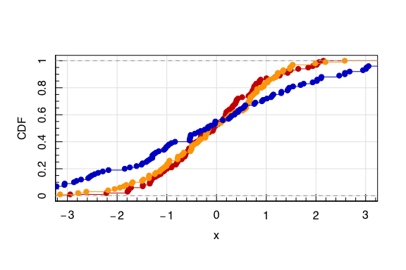
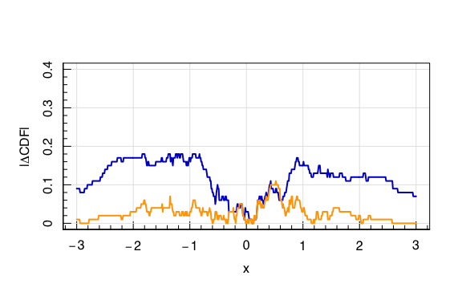
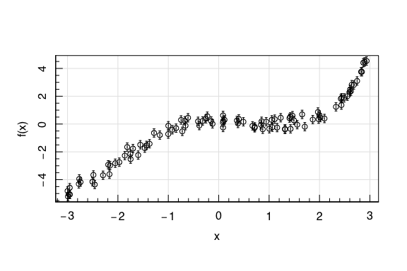
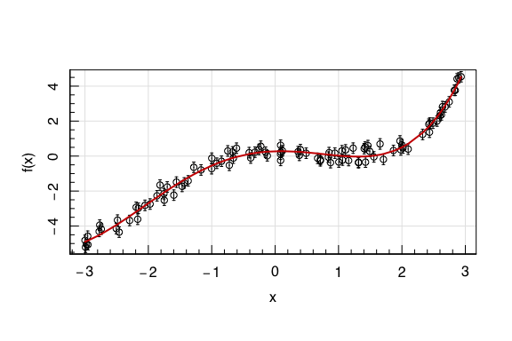
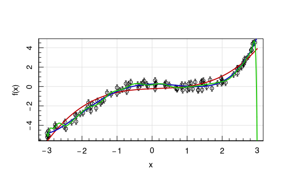
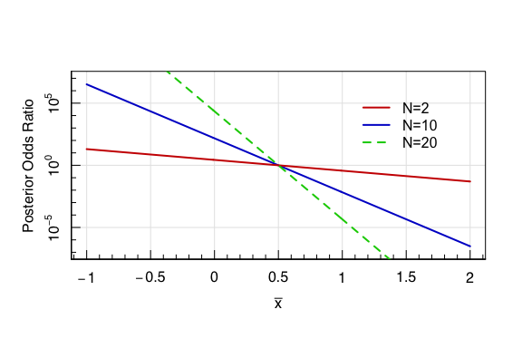
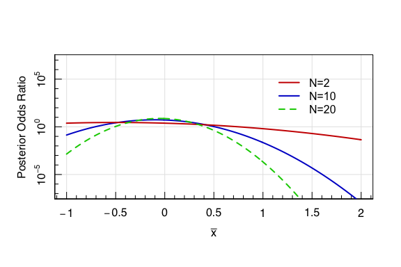

Introduction to Statistics for Astronomers and Physicists
================
Dr Angus H Wright
2022-02-09


# Section 4: Introduction <!--{{{-->

<!--Setup {{{-->
<style type="text/css">
.python { 
  background-color: 
    RColorBrewer::brewer.pal(1,"Set2");
} 
.out { 
  max-height: 300px;
  overflow-y: auto;
  background-color: inherit;
}
</style>

**Parameter Simulation, Optimisation, & Inference**

(or “Applying statistics in modern scientific analyses”)

We apply our understanding of Bayesian statistics to the common problems
of parameter simulation, optimisation, and inference. Students will
learn the fundamentals of hypothesis testing, quantifying
goodness-of-fit, and parameter inference. We discuss common errors in
parameter inference, including standard physical and astrophysical
biases that corrupt statistical analyses. <!--}}}-->

<!--}}}-->

# Exam Registration

The examination is now registered on ecampus!


Registration for the course exam is open from **now until next tuesday
13.07**.

If you are unsure about whether or not you want to take the exam, then
register now and cancel later! You have until **20.07** to cancel your
request to take the course exam.

## What will be examined

The course exam will cover all material up to and including **next
week’s lecture on Machine Learning Methods**.

I will provide a detailed synopsis of what topics will be examinable to
the students who register for the exam. The exam will draw on all the
material covered in the lectures up until next weeks course.

# What we learnt last week <!--{{{-->

Last week we focussed on bad statistical practices and things that you
should avoid. We did that by demonstrating how easy it is to generate
“significant” results, as determined by something we called the “t-test”
and the “p-value”.

What we were actually doing was using the t-test and its associated
p-value to make a *decision* about whether to accept or reject the null
hypothesis.

This is known as **hypothesis testing**.

Today we’re going to start with a fly-by of some other tools for
hypothesis testing, and a look at some methods of frequentist model
fitting tools. However both of these we will be using as a means to an
end, rather than the focus of the lecture.

Instead, we’re going to use our brief discussion of frequentist tools to
leverage a more interesting discussion of Bayesian tools for model
comparison, and an introduction into building complex models.

<!--}}}-->

# More Hypothesis Tests <!--{{{-->

## One-sample t-test

What we were doing last week was calculating a particular test
statistic, the t-statistic:

$$
t = \\frac{\\bar{x}-\\mu}{s/\\sqrt{n}},
$$

We then calculated the number of possible samples that could produce a
t-statistic that was at least as extreme as ours, given that the null
hypothesis was true. We did this using the analytic t-distribution:

$$
p(t; \\nu)   =   \\frac{\\Gamma(\\frac{\\nu+1}{2})}{\\Gamma\\left(\\frac{\\nu}{2}\\right)\\sqrt{\\pi \\nu}}\\left(1+\\frac{t^2}{\\nu}\\right)^{-(\\nu+1)/2}
$$

This number gave us the **p-value**; a frequentist metric for performing
hypothesis tests, which provided us with a means of determining whether
or not we believed a dataset was (in)consistent with the null
hypothesis.

This gave us a method to compare a distribution of data (or rather the
mean of a distribution of data) to another point. The t-test therefore
provides us with a method for comparing the significance of differences
between the *mean and variance* of a dataset and a single point. This is
the **one-sample t-test**.

There are, of course, many types of hypotheses that we may want to test,
and so there are other test statistics that can be created.

# Two sample t-test

We may want to compare two distributions directly, in which case we
could **two-sample t-test**, that compares the (in)consistency between
two samples means and variances. The two-sample t-test uses a slightly
modified estimator, to account for the the fact we are now interested in
the difference between two sample means, and that both samples have an
associated variance:

$$
t=\\frac{\\bar{x}\_1-\\bar{x}\_2}{s\_p\\sqrt{\\frac{1}{n\_1}+\\frac{1}{n\_2}}},
$$

where $\\bar{X\_1}$ and $\\bar{X\_2}$ and the sample means for samples 1
and 2, and *n*<sub>1</sub> and *n*<sub>2</sub> are the respective sample
sizes. *s*<sub>*p*</sub> is the pooled standard deviation for the two
samples, given as:

$$
s\_p=\\sqrt{\\frac{(n\_1-1) s\_1^2 + (n\_2-1) s\_2^2}{n\_1+n\_2-2}},
$$
where *s*<sub>1</sub> and *s*<sub>2</sub> are the variances of sample 1
and 2 respectively.

``` r
x <- rnorm(50, mean = 1, sd = 1)
y <- rnorm(30, mean = 1, sd = 1)
# Do x and y have the same mean and variance?
t.test(x, y)            
```

``` out
## 
##  Welch Two Sample t-test
## 
## data:  x and y
## t = 0.40494, df = 67.917, p-value = 0.6868
## alternative hypothesis: true difference in means is not equal to 0
## 95 percent confidence interval:
##  -0.3833103  0.5784837
## sample estimates:
## mean of x mean of y 
## 0.9351973 0.8376106
```

``` r
#What about now? 
x <- rnorm(50, mean = 0.5, sd = 1.5)
y <- rnorm(30, mean = 1, sd = 1)
# Do x and y have the same mean and variance?
t.test(x, y)            
```

``` out
## 
##  Welch Two Sample t-test
## 
## data:  x and y
## t = -1.8992, df = 68.807, p-value = 0.06173
## alternative hypothesis: true difference in means is not equal to 0
## 95 percent confidence interval:
##  -1.18241050  0.02909599
## sample estimates:
## mean of x mean of y 
## 0.3894504 0.9661076
```

``` r
#Or now? 
x <- rnorm(50, mean = 0, sd = 1)
y <- rnorm(30, mean = 1, sd = 1.5)
# Do x and y have the same mean and variance?
t.test(x, y)            
```

``` out
## 
##  Welch Two Sample t-test
## 
## data:  x and y
## t = -3.1546, df = 60.399, p-value = 0.002505
## alternative hypothesis: true difference in means is not equal to 0
## 95 percent confidence interval:
##  -1.4050479 -0.3147239
## sample estimates:
## mean of x mean of y 
## 0.1331692 0.9930551
```

# F-test

If we were only interested in determining whether or not two
distributions share a common variance. Commonly used in this
circumstance is the F-test, which tests whether or not the **variances**
of two distributions are (in)consistent. We won’t go into the F-test at
length here, however know that both **python** and **R** have routines
to perform F-tests for samples of data trivially.

``` r
x <- rnorm(50, mean = -1, sd = 1)
y <- rnorm(30, mean = 1, sd = 1)
# Do x and y have the same variance?
var.test(x, y)                  
```

``` out
## 
##  F test to compare two variances
## 
## data:  x and y
## F = 1.1158, num df = 49, denom df = 29, p-value = 0.7654
## alternative hypothesis: true ratio of variances is not equal to 1
## 95 percent confidence interval:
##  0.5605852 2.0992150
## sample estimates:
## ratio of variances 
##           1.115763
```

``` r
x <- rnorm(50, mean = 0, sd = 2)
y <- rnorm(30, mean = 0, sd = 1)
# What about now? 
var.test(x, y)                  
```

``` out
## 
##  F test to compare two variances
## 
## data:  x and y
## F = 3.6495, num df = 49, denom df = 29, p-value = 0.0003777
## alternative hypothesis: true ratio of variances is not equal to 1
## 95 percent confidence interval:
##  1.833577 6.866169
## sample estimates:
## ratio of variances 
##           3.649468
```

# Kolmogorov-Smirnov two-sample test

Another common test that you will likely run into is the KS-test. The
KS-test computes the maximum difference between the CDFs of two samples,
as a means of determining the level of (in)consistency between two
samples. Again, this can be trivially computed in both **R** and
**python**, and we can visualise it quite simply as well.

Suppose we have two samples that are drawn from different underlying
Gaussian distributions:

``` r
set.seed(666)
x1<-rnorm(1e2)
x2<-rnorm(1e2)
y<-rnorm(1e2,sd=2)
```

We can plot the ECDFs for these data:

``` r
magplot(ecdf(x1), xlim=c(-3,3), ylim=c(0,1), xlab='x', ylab='CDF',col='red3')
lines(ecdf(x2), col='orange')
lines(ecdf(y), col='blue3')
```


We can then ask what is the *maximum* difference between these two CDFs?

``` r
xsteps=seq(-3,3,by=0.01)
magplot(xsteps, abs(ecdf(x1)(xsteps)-ecdf(y)(xsteps)),
        xlim=c(-3,3), ylim=c(0,0.4), xlab='x', ylab=expression('|'*Delta*"CDF|"), 
        type='l', grid=TRUE,lwd=2,col='blue3')
lines(xsteps, abs(ecdf(x1)(xsteps)-ecdf(x2)(xsteps)),
        col='orange',lwd=2)
```


The KS.test is widely used (rightly or wrongly), and can be performed
trivially in all modern programming languages:

``` r
ks.test(x1,x2)
```

``` out
## 
##  Two-sample Kolmogorov-Smirnov test
## 
## data:  x1 and x2
## D = 0.11, p-value = 0.5806
## alternative hypothesis: two-sided
```

``` r
ks.test(x1,y)
```

``` out
## 
##  Two-sample Kolmogorov-Smirnov test
## 
## data:  x1 and y
## D = 0.19, p-value = 0.0541
## alternative hypothesis: two-sided
```

``` r
ks.test(x1,y,alternative='greater')
```

``` out
## 
##  Two-sample Kolmogorov-Smirnov test
## 
## data:  x1 and y
## D^+ = 0.17, p-value = 0.05558
## alternative hypothesis: the CDF of x lies above that of y
```

<!--}}}-->

# Hypothesis Testing and Modelling <!--{{{-->

With respect to simple models (of, say, one parameter), one may wish to
explore many types of hypothesis:

> -   Simple null vs Simple Alternative hypotheses:
>     *H*<sub>0</sub> = *θ*<sub>0</sub> vs
>     *H*<sub>1</sub> = *θ*<sub>1</sub>.
> -   Simple null vs Composite Alternative hypotheses:
>     *H*<sub>0</sub> = *θ*<sub>0</sub> vs
>     *H*<sub>1</sub> ≠ *θ*<sub>0</sub>.
> -   Composite null vs Composite Alternative hypotheses:
>     *H*<sub>0</sub> ≤ *θ*<sub>0</sub> vs
>     *H*<sub>1</sub> &gt; *θ*<sub>0</sub>.

You can probably begin to see how these sorts of hypothesis tests
naturally can be extended into the realm of modelling, specifically with
respect to fitting/optimizing models to data.

## Fitting a model

Let’s say that we have a dataset which can be binned, and a model that
predicts the number of observations per-bin. One hypothesis we could
ask, per-bin, is “how (in)consistent is this bin’s count with my
hypothesised model *H*<sub>0, *i*</sub> for bin *i*?”. We can use the
squared difference between the observed *x* and expected *m* values,
normalised by the magnitude of the expected *m* for that bin, and then
extend that question to all datapoints. Our test statistic is therefore:

$$
\\chi^2=\\sum^k\_{i=1}\\frac{(x\_i-m\_i)^2}{m\_i}
$$
This is the *χ*<sup>2</sup> statistic. We can then use this statistic to
fit a model to our data by minimising the value of *χ*<sup>2</sup>.

This is a very popular classical method for model fitting. It has some
particular benefits:

> -   Bins that are pathological compared to others might flag
>     problematic data and be removed. These may be particularly good
>     *or* particularly bad parts of fit.
> -   The *χ*<sup>2</sup> minimisation gives us a measure of **goodness
>     of fit** for free, because the *χ*<sup>2</sup> distribution is
>     analytic and we can compute a p-value to determine whether we find
>     (in)consistency with the null hypothesis (that the data are
>     generated from our hypothesised model).

However it has some significant drawbacks:

> -   Low numbers of data points per bin cause pathological behaviour;
>     the test fails with small N.
> -   A fundamental statistical fact: **binning your data is bad**. At
>     best, it causes information loss; at worst, it introduces biases
>     that invalidate your analysis.

# Non-linear Least Squares

The second widely popular classic method of model fitting is non-linear
least squares fitting, where we minimise the weighted residuals between
a model and the available data (and their associated uncertainties).
This is a branch of **maximum likelihood analyses**, which does exactly
what it says in the name: finds the model parameters that maximise a
likelihood given the data.

Again, tools for doing maximum likelihood analyses are commonplace in
both **python** and **R**. In particular, non-linear least squares gives
us a method for fitting data which have both values and uncertainties.

Let’s explore briefly a simple regression problem involving a polynomial
of degree 4.

``` r
set.seed(42)
#Create some random x samples 
x<-runif(1e2,min=-3,max=3)
#Generate our function 
coefs<-runif(5,-0.1,0.1)+rnorm(5,sd=0.2)
y<-coefs[1]+coefs[2]*x+coefs[3]*x^2+coefs[4]*x^3+coefs[5]*x^4
#Add noise
y<-y+rnorm(length(x),sd=0.3)
yerr<-rep(0.3,length(y))
#Plot the data
magplot(x,y,xlab='x',ylab='f(x)')
magerr(x,y,ylo=yerr)
```



Now we can use non-linear least squares to fit a model to the data:

``` r
#Fit a model using non-linear least squares 
rm(fit)
```

    ## Warning in rm(fit): object 'fit' not found

``` r
fit<-nls(y~A+B*I(x)+C*I(x^2)+D*I(x^3)+E*I(x^4),
         start=data.frame(A=1,B=1,C=1,D=1,E=1),weights=1/yerr^2)
#plot the data and the model 
magplot(x,y,xlab='x',ylab='f(x)')
magerr(x,y,ylo=yerr)
lines(x[order(x)],predict(fit)[order(x)],lwd=2,col='red3')
```



``` r
summary(fit)
```

``` out
## 
## Formula: y ~ A + B * I(x) + C * I(x^2) + D * I(x^3) + E * I(x^4)
## 
## Parameters:
##    Estimate Std. Error t value Pr(>|t|)    
## A  0.275457   0.057128   4.822  5.4e-06 ***
## B  0.114112   0.041964   2.719  0.00778 ** 
## C -0.599764   0.038756 -15.475  < 2e-16 ***
## D  0.171513   0.006666  25.730  < 2e-16 ***
## E  0.064113   0.004555  14.075  < 2e-16 ***
## ---
## Signif. codes:  0 '***' 0.001 '**' 0.01 '*' 0.05 '.' 0.1 ' ' 1
## 
## Residual standard error: 0.9818 on 95 degrees of freedom
## 
## Number of iterations to convergence: 1 
## Achieved convergence tolerance: 8.901e-07
```

``` r
print(coefs)
```

``` out
## [1]  0.38160647  0.06796347 -0.62419916  0.17406846  0.06473855
```

So we get out a fairly accurate set of model parameters. But what about
if we don’t know the true underlying model? What if we use a polynomial
of lower (or higher) order?

``` r
#Fit a model using linear models  
fit<-lm(y~poly(x,degree=4,raw=TRUE))
fit_lower<-lm(y~poly(x,degree=3,raw=TRUE))
fit_higher<-lm(y~poly(x,degree=6,raw=TRUE))
fit_crazy<-lm(y~poly(x,degree=35,raw=TRUE))
#plot the data and the model 
testx<-seq(-3,3,by=0.01)
magplot(x,y,xlab='x',ylab='f(x)')
magerr(x,y,ylo=yerr)
lines(testx,predict(newdata=list(x=testx),fit),lwd=2,col='grey')
lines(testx,predict(newdata=list(x=testx),fit_lower),lwd=2,col='red3')
lines(testx,predict(newdata=list(x=testx),fit_higher),lwd=2,col='blue3')
lines(testx,predict(newdata=list(x=testx),fit_crazy),lwd=2,col='green3')
```

    ## Warning in predict.lm(newdata = list(x = testx), fit_crazy): prediction from a rank-deficient fit
    ## may be misleading



``` r
summary(fit_lower); summary(fit_higher)
```

``` out
## 
## Call:
## lm(formula = y ~ poly(x, degree = 3, raw = TRUE))
## 
## Residuals:
##      Min       1Q   Median       3Q      Max 
## -1.06947 -0.42332 -0.01294  0.35130  1.01780 
## 
## Coefficients:
##                                  Estimate Std. Error t value Pr(>|t|)    
## (Intercept)                      -0.22667    0.07796  -2.907  0.00453 ** 
## poly(x, degree = 3, raw = TRUE)1  0.15503    0.07315   2.119  0.03663 *  
## poly(x, degree = 3, raw = TRUE)2 -0.07360    0.01786  -4.121 8.01e-05 ***
## poly(x, degree = 3, raw = TRUE)3  0.16029    0.01156  13.861  < 2e-16 ***
## ---
## Signif. codes:  0 '***' 0.001 '**' 0.01 '*' 0.05 '.' 0.1 ' ' 1
## 
## Residual standard error: 0.5147 on 96 degrees of freedom
## Multiple R-squared:  0.9453, Adjusted R-squared:  0.9436 
## F-statistic: 552.7 on 3 and 96 DF,  p-value: < 2.2e-16
```

``` out
## 
## Call:
## lm(formula = y ~ poly(x, degree = 6, raw = TRUE))
## 
## Residuals:
##      Min       1Q   Median       3Q      Max 
## -0.54725 -0.22710 -0.01727  0.19306  0.60262 
## 
## Coefficients:
##                                   Estimate Std. Error t value Pr(>|t|)    
## (Intercept)                       0.244800   0.067254   3.640 0.000448 ***
## poly(x, degree = 6, raw = TRUE)1  0.083317   0.075200   1.108 0.270745    
## poly(x, degree = 6, raw = TRUE)2 -0.530087   0.087221  -6.078 2.66e-08 ***
## poly(x, degree = 6, raw = TRUE)3  0.185613   0.032584   5.696 1.42e-07 ***
## poly(x, degree = 6, raw = TRUE)4  0.041554   0.025936   1.602 0.112507    
## poly(x, degree = 6, raw = TRUE)5 -0.001207   0.003100  -0.389 0.697973    
## poly(x, degree = 6, raw = TRUE)6  0.001771   0.002035   0.870 0.386500    
## ---
## Signif. codes:  0 '***' 0.001 '**' 0.01 '*' 0.05 '.' 0.1 ' ' 1
## 
## Residual standard error: 0.2962 on 93 degrees of freedom
## Multiple R-squared:  0.9824, Adjusted R-squared:  0.9813 
## F-statistic: 867.2 on 6 and 93 DF,  p-value: < 2.2e-16
```

``` r
print(coefs)
```

``` out
## [1]  0.38160647  0.06796347 -0.62419916  0.17406846  0.06473855
```

How do we determine which of these models is superior? Or more
importantly, how can we tell if either of these models is preferred by
the data?

## F-test for model complexity

One method that is useful to know is utilising the F-test as a method of
determining whether increasing the complexity of a given model is
justified.

As mentioned previously, the F-test is a measure of differences in
**variance**, and so we can use the F-test to determine whether an
increase in model complexity creates a *significant* decrease in the
variance of the data residuals.

This can be done trivially with models fitted using “linear methods” in
**R** for example, using `var.test()`.

``` r
var.test(fit_lower,fit)
```

``` out
## 
##  F test to compare two variances
## 
## data:  fit_lower and fit
## F = 3.0531, num df = 96, denom df = 95, p-value = 1.142e-07
## alternative hypothesis: true ratio of variances is not equal to 1
## 95 percent confidence interval:
##  2.038895 4.569810
## sample estimates:
## ratio of variances 
##           3.053094
```

There is a significant difference in the fit variances when going from 3
to 4 degrees in our polynomial, and so this change is justified. Going
from 4 to 5:

``` r
var.test(fit,fit_higher)
```

``` out
## 
##  F test to compare two variances
## 
## data:  fit and fit_higher
## F = 0.98895, num df = 95, denom df = 93, p-value = 0.9566
## alternative hypothesis: true ratio of variances is not equal to 1
## 95 percent confidence interval:
##  0.6581308 1.4847396
## sample estimates:
## ratio of variances 
##          0.9889508
```

shows no significant improvement in the variance. What about if we
ratchet-up the number of degrees to a ridiculous value?

``` r
var.test(fit,fit_crazy)
```

``` out
## 
##  F test to compare two variances
## 
## data:  fit and fit_crazy
## F = 0.95632, num df = 95, denom df = 70, p-value = 0.8326
## alternative hypothesis: true ratio of variances is not equal to 1
## 95 percent confidence interval:
##  0.611500 1.473574
## sample estimates:
## ratio of variances 
##          0.9563173
```

<!--}}}-->

# Bayesian Hypothesis Testing <!--{{{-->

As Bayesian statistics is concerned with determining estimates of
underlying model parameters given the data, model comparison and
hypothesis testing between different models becomes a natural extension
of standard Bayesian methods.

Take the simplest possible example: &gt; + Simple null vs Simple
Alternative hypotheses: *H*<sub>0</sub> = *θ*<sub>0</sub> vs
*H*<sub>1</sub> = *θ*<sub>1</sub>.

Let’s keep things general here and not use too many specifics. We have
two hypotheses about the model that generates our data:
*H*<sub>0</sub> = *θ*<sub>0</sub> vs *H*<sub>1</sub> = *θ*<sub>1</sub>.
These hypotheses are mutually exclusive and exhaustive (that is,
{*H*<sub>0</sub>, *H*<sub>1</sub>} = *Ω*). Next assume we have some
appropriate test statistic
*T* = *T*(*X*<sub>1</sub>, …, *X*<sub>*n*</sub>).

By Bayes Theorem, we have:
$$
P(H\_0\|T) = \\frac{P(T\|H\_0)P(H\_0)}{P(T\|H\_0)P(H\_0) + P(T\|H\_1)P(H\_1)}
$$
Given that the hypotheses are mutual exclusivity and exhaustive:
*P*(*H*<sub>1</sub>\|*T*) = 1 − *P*(*H*<sub>0</sub>\|*T*)
so
$$
\\frac{P(H\_0\|T)}{P(H\_1\|T)} = \\frac{P(H\_0)}{P(H\_1)} \\times \\frac{P(T\|H\_0)}{P(T\|H\_1)}
$$
This is the **posterior odds ratio**, and the last ratio is known as the
**Bayes factor**. Notice that, therefore, if the prior odds ratio is
unity (i.e. that $\\frac{P(H\_0)}{P(H\_1)}=1$), then the posterior odds
equals the Bayes factor.

<!--}}}-->

# Jeffery’s Hypothesis Tests <!--{{{-->

“If the posterior odds ratio exceeds unity, we accept *H*<sub>0</sub>.
Otherwise, we reject *H*<sub>0</sub> in favour of *H*<sub>1</sub>.”

The **Jeffreys Hypothesis testing criterion** above has a few important
benefits over classical methods of hypothesis testing.

-   There is no specification of a “significance level” that determines
    whether or not a hypothesis is accepted/rejected.
-   It is easily generalisable to many many hypotheses: you just accept
    the one with the highest posterior probability.

There is one important philosophical difference as well. In accepting
*H*<sub>0</sub> as the preferred model, we do not assume that it is the
*true* model. We are simply stating that, with the currently available
data, *H*<sub>0</sub> is the more probable alternative.

The “Jeffreys Scale” gives a slightly larger dynamic range to the amount
of evidence that is encapsulated in the posterior odds ratio:

<table style="text-align: center; margin-left: auto; margin-right: auto; border: none;">
<tbody>
<tr>
<th>
$\\frac{P(H\_0\|T)}{P(H\_1\|T)}$
</th>
<th>
Strength of evidence
</th>
</tr>
<tr>
<td>
 &lt; 10<sup>0</sup>
</td>
<td>
Negative (supports *H*<sub>1</sub>)
</td>
</tr>
<tr>
<td>
10<sup>0</sup> to $10^{\\frac12}$
</td>
<td>
Barely worth mentioning
</td>
</tr>
<tr>
<td>
$10^{\\frac12}$ to 10<sup>1</sup>
</td>
<td>
Substantial
</td>
</tr>
<tr>
<td>
10<sup>1</sup> to $10^{\\frac32}$
</td>
<td>
Strong
</td>
</tr>
<tr>
<td>
$10^{\\frac32}$ to 10<sup>2</sup>
</td>
<td>
Very strong
</td>
</tr>
</tbody>
</table>
<!--}}}-->

# Bayesian Model Comparison

## Simple Null vs Simple Alternative <!--{{{-->

Suppose we have *X*\|*θ* ∼ *N*(*θ*, 1), and *H*<sub>0</sub> : *θ* = 0 vs
*H*<sub>1</sub> : *θ* = 1.

We observe the random sample *X*<sub>1</sub>, …, *X*<sub>*n*</sub>, and
form the sufficient test statistic
$T=\\bar{X} = \\frac{1}{N}\\sum\_{i=1}^N X\_i$.

We have $T\|H\_0\\sim N\\left(0,\\frac{1}{N}\\right)$ and
$T\|H\_1\\sim N\\left(1,\\frac{1}{N}\\right)$.

Assume a priori that we have no prior preference over the models
$P(H\_0)=P(H\_1)=\\frac{1}{2}$. Therefore the posterior odds ratio is:
$$
\\begin{align}
\\frac{P(H\_0\|T)}{P(H\_1\|T)}&=  \\frac{P(H\_0)}{P(H\_1)} \\times \\frac{P(T\|H\_0)}{P(T\|H\_1)}\\\\
&=\\frac{0.5}{0.5}\\times\\frac{
\\left(\\frac{N}{2\\pi}\\right)^\\frac{1}{2}\\exp\\left(-0.5N\\bar{X}^2\\right)}{
\\left(\\frac{N}{2\\pi}\\right)^\\frac{1}{2}\\exp\\left\[-0.5N(\\bar{X}-1)^2\\right\]}\\\\
&=\\exp\\left\[-0.5N(2\\bar{X}-1)\\right\]
\\end{align}
$$

Let’s now look at some simulated data:

``` r
x1<-rnorm(10,mean=1.2)
x2<-rnorm(10,mean=0.2)
post_ratio<-function(x) exp(-0.5*length(x)*(2*mean(x)-1))
print(post_ratio(x1)); print(post_ratio(x2))
```

``` out
## [1] 2.769178e-05
```

``` out
## [1] 1436.165
```

We can now look at what the posterior odds ratio looks like, in this
case, for a range of means and values of *N*:

``` r
post_ratio<-function(xbar,N) exp(-0.5*N*(2*xbar-1))
xbar<-seq(-1,2,by=0.01)
magplot(xbar,post_ratio(xbar,N=10),type='l',log='y',lwd=2,col='blue3',
        xlab=expression(bar(x)),ylab='Posterior Odds Ratio',ylim=c(1e-7,1e7))
lines(xbar,post_ratio(xbar,N=2),lwd=2,col='red3')
lines(xbar,post_ratio(xbar,N=20),lwd=2,col='green3',lty=2)
legend('topright',legend=paste0("N=",c(2,10,20)),lwd=2,lty=c(1,1,2),
       col=c("red3","blue3","green3"),bty='n',inset=0.1)
```



<!--}}}-->

## Simple Null vs Composite Alternative <!--{{{-->

Suppose we have a marginally more complex hypothesis test:
*H*<sub>0</sub> : *θ* = *θ*<sub>0</sub> versus
*H*<sub>1</sub> : *θ* ≠ *θ*<sub>0</sub>.

Again, let *T* = *T*(*X*<sub>1</sub>, …, *X*<sub>*n*</sub>) denote our
appropriate test statistic. As before:
$$
\\begin{align}
\\frac{P(H\_0\|T)}{P(H\_1\|T)}&=  \\frac{P(H\_0)}{P(H\_1)} \\times \\frac{P(T\|H\_0)}{P(T\|H\_1)}\\\\
&=\\frac{P(H\_0)}{P(H\_1)} \\times\\frac{
P(T\|H\_0,\\theta\_0)}{
\\int P(T\|H\_1,\\theta)P\_1(\\theta)\\textrm{d}\\theta}
\\end{align}
$$
where *P*<sub>1</sub>(*θ*) is a prior for *θ* under model
*H*<sub>1</sub>. The Bayes factor in this case is therefore the ratio of
the likelihood under *H*<sub>0</sub> to the *averaged* likelihood under
*H*<sub>1</sub>.

Again, let’s look at some simulated data. Suppose again that we have
*X*\|*θ* ∼ *N*(*θ*, 1), and *H*<sub>0</sub> : *θ* = 0 versus
*H*<sub>1</sub> : *θ* ≠ 0. Again we observe a random sample
*X*<sub>1</sub>, …, *X*<sub>*n*</sub> and we form the sufficient
statistic $T=\\bar{X} = \\frac{1}{N}\\sum\_{i=1}^N X\_i$.

Our likelihood under this model is
$T\|\\theta\\sim N\\left(\\theta,\\frac{1}{N}\\right)$ and let us assume
*θ* ∼ *N*(1, 1) under *H*<sub>1</sub>.

Once again, we assume that the two hypotheses are equally likely a
priori: $P(H\_0)=P(H\_1)=\\frac{1}{2}$. We therefore find the posterior
odds ratio:
$$
\\begin{align}
\\frac{P(H\_0\|T)}{P(H\_1\|T)}
&=\\frac{P(H\_0)}{P(H\_1)} \\times\\frac{
P(T\|H\_0,\\theta\_0)}{
\\int P(T\|H\_1,\\theta)P\_1(\\theta)\\textrm{d}\\theta} \\\\
&=\\frac{0.5}{0.5}\\times\\frac{
\\left(\\frac{N}{2\\pi}\\right)^\\frac{1}{2}\\exp\\left(-0.5N\\bar{X}^2\\right)}{
\\int\\left(\\frac{N}{2\\pi}\\right)^\\frac{1}{2}\\exp\\left\[-0.5N(\\bar{X}-\\theta)^2\\right\]
(2\\pi)^{\\frac{1}{2}}\\exp\\left\[-0.5(\\theta-1)^2\\right\]\\textrm{d}\\theta}\\\\
&=\\frac{
\\sqrt{2\\pi}\\exp\\left(-0.5N\\bar{X}^2\\right)}{
\\int\\exp\\left\\{-0.5\\left\[\\left(\\theta-1\\right)^2+N\\left(\\theta-\\bar{X}\\right)^2\\right\]\\right\\}
\\textrm{d}\\theta}\\\\
&=\\sqrt{N+1}\\exp\\left\\{-0.5\\left\[\\frac{\\left(N\\bar{x}+1\\right)^2}{N+1}-1\\right\]\\right\\}
\\end{align}
$$
Let us take our two sets of observations from previously:

``` r
x1<-rnorm(10,mean=1.2)
x2<-rnorm(10,mean=0.2)
post_ratio<-function(x) sqrt(length(x)+1)*exp(-0.5*(((length(x)*mean(x)+1)^2)/(length(x)+1)-1))
print(post_ratio(x1)); print(post_ratio(x2))
```

``` out
## [1] 2.934396e-05
```

``` out
## [1] 2.130369
```

``` r
post_ratio<-function(xbar,N) sqrt(N+1)*exp(-0.5*(((N*xbar+1)^2)/(N+1)-1))
xbar<-seq(-1,2,by=0.01)
magplot(xbar,post_ratio(xbar,N=10),type='l',log='y',lwd=2,col='blue3',
        xlab=expression(bar(x)),ylab='Posterior Odds Ratio',ylim=c(1e-7,1e7))
lines(xbar,post_ratio(xbar,N=2),lwd=2,col='red3')
lines(xbar,post_ratio(xbar,N=20),lwd=2,col='green3',lty=2)
legend('topright',legend=paste0("N=",c(2,10,20)),lwd=2,lty=c(1,1,2),
       col=c("red3","blue3","green3"),bty='n',inset=0.1)
```



Note that these distributions are **asymetric** about 0. Why is this?

<!--}}}-->

## Simple Null vs Composite Alternative: Additional Parameters <!--{{{-->

We can extend this method of model comparison to models with additional
parameters trivially (there is nothing in the development thus far that
required our model to only test a single variable *θ*). However an
interesting note is the simplicity with which we can compare models that
have additional parameters *which we don’t wish to test*.

In the standard bayesian marginalisation approach, we can simply
integrate over the parameters that we aren’t interested in.

Suppose we have *X*\|*θ*, *σ*<sup>2</sup> ∼ *N*(*θ*, *σ*<sup>2</sup>)
and *H*<sub>0</sub> : {*θ*=0,*σ*<sup>2</sup>&gt;0} versus
*H*<sub>0</sub> : {*θ*≠0,*σ*<sup>2</sup>&gt;0}. I.e the same situation
as previously, except now the variance of the distribution is also
unknown.

If our *X*<sub>*i*</sub> are i.i.d. observations, then
*T*(*x̄*, *s*<sup>2</sup>) is sufficient to test (*θ*, *σ*<sup>2</sup>).
The posterior odds is then:
$$
\\frac{P(H\_0\|\\bar{x},s^2)}{P(H\_1\|\\bar{x},s^2)}
=\\frac{P(H\_0)}{P(H\_1)} \\times\\frac{
\\int P(\\bar{x}\|\\theta=0,\\sigma^2)P(\\sigma^2)\\textrm{d}\\sigma^2}{
\\int\\int P(\\bar{x}\|\\theta\\neq0,\\sigma^2)P(\\theta,\\sigma^2)\\textrm{d}\\theta\\textrm{d}\\sigma^2} 
$$

In the same way, the method can also extend to composite hypotheses on
both *H*<sub>0</sub> and *H*<sub>1</sub>, and thus requires integrations
on both the numerator and denominator.

<!--}}}-->

# Bayesian Modelling <!--{{{-->

The previous examples of how to calculate model preferences is all well
and good, but this is where the magic happens.

Because there is some uncertainty in expressing/specifying any single
model:
*f*(*θ*, *x*) = *f*(*x*\|*θ*)*f*(*θ*)
we can instead construct a single model that we define as being the
union of all alternative models that we might wish to entertain. We will
then provide a prior over the suite of encompassed models.

Take an example where we have two models that we think might be
appropriate for our dataset, both of which fall within the general
“Gamma” family of distributions.

Recall that the Gamma family of distributions all take the format:
$$
f(x\|\\alpha,\\beta,\\gamma)=\\frac{\\gamma\\beta^\\alpha}{\\Gamma(\\alpha)}x^{\\alpha\\gamma-1}\\exp\\left(-\\beta x^\\gamma\\right)
$$
Our two hypothesised models are a Weibull distribution:
*f*<sub>1</sub>(*x*\|*β*, *γ*) = *γ**β**x*<sup>*γ* − 1</sup>exp (−*β**x*<sup>*γ*</sup>)
and a two-parameter Gamma distribution:
$$
f(x\|\\alpha,\\beta)=\\frac{\\beta^\\alpha}{\\Gamma(\\alpha)}x^{\\alpha-1}\\exp\\left(-\\beta x\\right)
$$
We can analyse these two models in the same way as previously. Require
that these two hypotheses be exhaustive
(*P*(*m*<sub>1</sub>) = 1 − *P*(*m*<sub>2</sub>)), and formulate the
values of *α*, *β*, *γ*.

However, we could alternatively specify a single **encompassing** model
that is just a generalised gamma distribution. This distribution
contains both of the previous 2 models *and many many more*. Nominally
it is no more or less sensible to formulate our model comparison using
priors on *α*, *β*, *γ* instead of on *m*<sub>1</sub>, *m*<sub>2</sub>,
and we can construct priors that recover the behaviour of having only
the two models in any case:
$$
f(\\alpha,\\beta,\\gamma)=
\\begin{cases}
f(\\alpha,\\beta,\\gamma) & \\textrm{if}\\;\\; \\alpha=1 \\\\
f(\\alpha,\\beta,\\gamma) & \\textrm{if}\\;\\; \\gamma=1 \\\\
0 & \\textrm{otherwise} \\\\
\\end{cases}
$$

<!--}}}-->

# What did we just do? <!--{{{-->

We just demonstrated that we can perform model comparison within the
bayesian framework by specifying a generic model and providing priors on
the parameters that govern that model. In this way, the likelihood that
we specified was general: we didn’t pick particular values for the
models in the likelihood, rather we specified a distribution of possible
likelihoods and gave (possibly broad) priors on the variables that
govern the distribution of possible models.

This leads us to an interesting class of models known (appropriately) as
**Bayesian hierarchical models** (BHMs).

<!--}}}-->
