Introduction to Statistics for Astronomers and Physicists
================
Dr Angus H Wright
2022-02-08


# Section 1: Introduction <!--{{{-->

<!--Setup {{{-->
<style type="text/css">
.python { 
  background-color: 
    RColorBrewer::brewer.pal(1,"Set2");
} 
.out { 
  max-height: 300px;
  overflow-y: auto;
  background-color: inherit;
}
</style>
<!--}}}-->

In the simplest possible terms, there are two skills that are required
to analyse any question using data and statistics. The first skill
involves understanding how to describe a given dataset, which frequently
involves reducing the information contained within the data into
interpretable chunks. The second skill involves being able to draw
justifiable conclusions from the data at hand. In this section, we will
develop the first skill, starting in the simplest possible terms and
building complexity from there.

## **Data Description and Summarisation (Weeks 1-2)**

When working in empirical science, modelling and understanding datasets
is paramount. In this module we start by discussing the fundamentals of
data modelling. We start by discussing theories of point and interval
estimation, in the context of summary statics (e.g. expectation values,
confidence intervals), and estimation of data correlation and
covariance. Students will learn the fundamentals of data mining and
analysis, in a way that is applicable to all physical sciences.

Topics include:

> -   Part (a):
>     -   Notation and Nomenclature
>     -   Types of Data
>     -   Frequency Measures and Graphical Data
>     -   Measures of Central Tendency and Dispersion
> -   Part (b):
>     -   Comparison between various Point and Dispersion Statistics
>     -   Graphical Comparisons between Distributions
>     -   Correlation and Covariance
>     -   Practical Data Mining

<!--}}}-->

# Useful Properties of Point and Dispersion Estimates <!--{{{-->

When using point estimates as summaries of data, it is useful to
understand some fundamental properties of each statistic. In each of the
subcategories below we detail useful properties of each estimator, and
important conceptual details about them.

# The Mean <!--{{{-->

Recall that, for an arbitrary dataset of variables
${\\bf x} = {x\_1,x\_2,\\dots,x\_n}$, the mean is defined as:

$$
{\\rm mean}(x)\\equiv\\bar{x} = \\frac{1}{n}\\sum\_{i=1}^{n}x\_i.
$$

## Important Properties of the Mean

> -   Scaling the data scales the mean:

$$ {\\rm mean}(k{\\bf x}) = k\\times{\\rm mean}({\\bf x}) $$

> -   Translating the data also translates the mean:

$$ {\\rm mean}({\\bf x}+c) = {\\rm mean}({\\bf x})+c $$

> -   The sum of signed differences from the mean is zero:

$$ \\sum\_{i=1}^n (x\_i - {\\rm mean}({\\bf x})) = 0 $$

> -   The average squared distance between all data *x*<sub>*i*</sub>
>     and a single point *μ* is minimised at the mean:

$$
\\underset{\\mu}{\\rm argmin{}}\\sum\_{i=1}^{n}(x\_i-\\mu)^2=\\bar{x}
$$

### Proof

We can prove that the mean minimises the mean square distance to all
data by finding the minima of the function:
$$
\\begin{align}
\\frac{\\delta}{\\delta \\mu}\\sum\_{i=1}^{n}(x\_i-\\mu)^2 &= -2\\sum\_{i=1}^{n}(x\_i-\\mu) \\\\
&=0
\\end{align}
$$
so:
$$
\\begin{align}
\\sum\_{i=1}^{n}(x\_i-\\mu)&=0 \\\\
\\sum\_{i=1}^{n}x\_i - \\sum\_{i=1}^{n}\\mu &= 0 \\\\
\\therefore\\mu &= \\frac{1}{n}\\sum\_{i=1}^{n}{x\_i}\\\\
&\\equiv \\bar{x}
\\end{align}
$$

<!--}}}-->

# The Standard Deviation <!--{{{-->

Recall that, for an arbitrary dataset of variables
${\\bf x} = {x\_1,x\_2,\\dots,x\_n}$, the sample standard deviation is
defined as:

$$
\\begin{align}
{\\rm std}({\\bf x})\\equiv s &= \\sqrt{\\frac{1}{n}\\sum\_{i=1}^{n}(x\_i-\\bar{x})^2} \\\\
&= \\sqrt{{\\rm mean}(x\_i-\\bar{x})^2}.
\\end{align}
$$

The unbiased estimator of the population standard deviation is:
$$
\\hat{\\sigma} = \\sqrt{\\frac{1}{n-1}\\sum\_{i=1}^{n}(x\_i-\\bar{x})^2}.
$$

## Important Properties of the Standard Deviation

> -   Translating the data does not change the standard deviation:

$$ {\\rm std}({\\bf x}+C) = {\\rm std}({\\bf x}) $$

> -   Scaling the data scales the standard deviation:

$$ {\\rm std}(k{\\bf x}) = k\\times{\\rm std}({\\bf x}) $$

> -   For *n* observations of an arbitrary variable *x*, whose standard
>     deviation is *s*, there are at most $\\frac{n}{k^{2}}$ data points
>     lying *k* or more standard deviations away from the mean.

Assume we construct a length *n* dataset of variable *y* with *m* data
that are *k* standard deviations from the mean. The fraction of data
beyond *k* standard deviations is *r* = *m*/*n*. Furthermore, let’s
assume *ȳ* = 0 (which is fine, because of the translation point above).
Therefore:
$$
{\\rm std}({\\bf y})\\equiv s\_y=\\sqrt{\\frac{1}{n}\\sum\_{i=1}^{n}y\_i^2}
$$
Let’s now make our dataset as pathological as possible. To start, we’ll
assign *n* − *m* data points to have *y*<sub>0</sub> = 0, because these
contribute 0 to the standard deviation. We’ll then place the other *m*
elements at exactly *k* standard deviations from 0;
*y*<sub>1</sub> = *k**s*<sub>*y*</sub>,. For this very strange dataset,
the standard deviation becomes:
$$
\\begin{align}
s\_y&=\\sqrt{\\frac{1}{n}\\sum\_{i=1}^{m}y\_1^2 + \\sum\_{i=m+1}^{n} y\_0^2 } \\\\
&=\\sqrt{\\frac{mk^2s\_y^2}{n}} \\\\
&=\\sqrt{rk^2s\_y^2} 
\\end{align}
$$
so:
$$
s\_y^2=rk^2s\_y^2 \\\\
\\therefore r=\\frac{1}{k^2}
$$
As this was the most pathological dataset possible, we therefore
conclude that *for any dataset*, the maximal fraction of data that can
sit *k* standard deviations away from the mean is
*r* = *k*<sup> − 2</sup>.

> -   For any dataset, there must be at least one data point more than
>     one standard deviation from the mean.

Given the formula for the standard deviation:
$$
s = \\sqrt{\\frac{1}{n}\\sum\_{i=1}^{n}(x\_i-\\bar{x})^2}
$$
where again we can generalise to an arbitrary dataset with *x̄* = 0:
$$
s\_0 = \\sqrt{\\frac{1}{n}\\sum\_{i=1}^{n}x\_i^2}
$$
So
$$
n\\times s^2 = \\sum\_{i=1}^{n}x\_i^2
$$
The right hand side here is the sum of all squared deviations from the
mean. However:
$$
\\sum\_{i=1}^{n}x\_i^2 \\leq n\\times {\\rm max}(x\_i^2). 
$$
That is, the sum of all deviations must be less than or equal to *n*
times the maximal squared deviation. Therefore:
$$
\\begin{align}
n\\times s^2 &\\leq n\\times {\\rm max}(x\_i^2).\\\\ 
s^2 &\\leq {\\rm max}(x\_i^2). 
\\end{align}
$$
So there must be at least 1 data value that is greater than or equal to
the standard deviation.

<!--}}}-->

# The Median <!--{{{-->

Recall that, for an arbitrary dataset of variables
${\\bf x} = {x\_1,x\_2,\\dots,x\_n}$, the median is defined as:

$$
{\\rm med}({\\bf x}) \\equiv \\tilde{x}\_{0.5} = 
\\begin{cases} 
  x\_{\[(n+1)/2\]} & n\\in 2\\mathbb{Z}-1 \\\\
  (x\_{\[n/2\]}+x\_{\[n/2+1\]})/2 & n\\in2\\mathbb{Z}
\\end{cases}
$$

## Important Properties of the Median

> -   Scaling the data scales the median:

$$ {\\rm med}(k{\\bf x}) = k\\times{\\rm med}({\\bf x}) $$

> -   Translating the data also translates the median:

$$ {\\rm med}({\\bf x}+c) = {\\rm med}({\\bf x})+c $$

<!--}}}-->

# The nMAD <!--{{{-->

Recall that, for an arbitrary dataset of variables
${\\bf x} = {x\_1,x\_2,\\dots,x\_n}$, the normalised median absolute
deviation from median (nMAD) is defined as:

$$
{\\rm nMAD}(x) = 1.4826\\times{\\rm med}(\|x\_i-\\tilde{x}\_{0.5}\|).\_\\,
$$

## Important Properties of the nMAD

> -   Translating the data does not change the nMAD:

$$ {\\rm nMAD}({\\bf x}+C) = {\\rm nMAD}({\\bf x}) $$

> -   Scaling the data scales the nMAD:

$$ {\\rm nMAD}(k{\\bf x}) = k\\times{\\rm nMAD}({\\bf x}) $$

<!--}}}-->

# The Quantile Function <!--{{{-->

Recall that the quantile function is the inverse of the cumulative
distribution function, which in practice we compute using linear
interpolation between rank-ordered values of the arbitrary variable *x*.

The quantile function is useful for many reasons, but one principle use
is in the definition of dispersion measures such as the “interquartile
range”.

## The Interquartile Range (IQR)

A “quartile” is a quantile that splits the dataset into quarters. The
four standard quartiles are therefore defined as being the data within:

> -   the $0^{\\rm th}$ and $25^{\\rm th}$ percentiles;
> -   the $25^{\\rm th}$ and $50^{\\rm th}$ percentiles;  
> -   the $25^{\\rm th}$ and $75^{\\rm th}$ percentiles; and
> -   the $75^{\\rm th}$ and $100^{\\rm th}$ percentiles.

The Interquartile Range is defined as the difference between the
$25^{\\rm th}$ and $75^{\\rm th}$ percentiles (i.e. the range containing
the inner two quartiles, or the middle 50% of the data):

$$
{\\rm iqr}({\\bf x})={\\rm percentile}({\\bf x},0.75)-{\\rm percentile}({\\bf x},0.25)
$$

## Important Properties of the IQR

> -   Translating the data does not change the IQR:

$$ {\\rm iqr}({\\bf x}+C) = {\\rm iqr}({\\bf x}) $$

> -   Scaling the data scales the IQR:

$$ {\\rm iqr}(k{\\bf x}) = k\\times{\\rm iqr}({\\bf x}) $$

<!--}}}-->
<!--}}}-->

# Comparing the statistics <!--{{{-->

How do these different statistics compare? What makes one more useful
than another for a particular dataset?

## Central Tendency

For Gaussian data with many observations, the mean and median are
essentially equivalent. However real world datasets are messy, and data
is very rarely “purely” Gaussian.

The primary pitfall with measures of central tendency come from the
presence of outlier data. Given that the mean minimises the average
distance to *all* data, the presence of outliers in a dataset can
catastrophically bias the statistic.

As an example, let’s explore a similar dataset to one we’ve already
seen. In Section 1a we discussed the sizes of mice depicted in Disney
movies. Let’s look at a similar sort of dataset, but with many many more
observations:

A statistician is working as a wildlife consultant part-time. They are
called to catalogue the sizes of all mice present on the grounds in and
around the Disney World resort in Florida, for conservation purposes.
Being a contentious statistician, they do exactly as they are asked. The
resulting dataset is below:

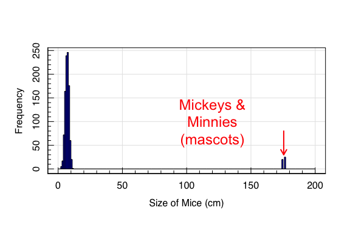

If we compute the point statistics of central tendency for this dataset:

``` r
#Central Tendency statistics for mice 
mean(mice_nov); median(mice_nov);
```

``` out
## [1] 14.25428
```

``` out
## [1] 7.081477
```

The presence of the mascots completely ruins our mean estimate of the
mice heights. However, the median statistic doesn’t fall into the same
trap.

## Dispersion

The story gets even worse when we want to calculate the dispersion
tatistics:

``` r
#Dispersion for mice 
sd(mice_nov); mad(mice_nov); IQR(mice_nov)
```

``` out
## [1] 34.38242
```

``` out
## [1] 1.557553
```

``` out
## [1] 2.105527
```

The catastrophic failure of the standard deviation here is a combination
of the inclusion of the problematic mean estimate and the requirement
that standard deviations have few data-points at many standard
deviations from the mean. Recall our formular for the fraction of data
that can reside *k* standard deviations from the mean:
$r\\leq \\frac{1}{k^2}$. In this dataset, the outliers make up 4.31% of
the dataset. Therefore, they can reside ***at most*** 4.82 standard
deviations from the mean. In reality, though, the outliers here *aren’t*
drawn from the same Gaussian distribution as the rest of the data, and
in truth reside 112.67 standard deviations from the mean.

Crucially, the nMAD statistic is robust to the outliers, as it uses
median statistics in its computation.

## Comparing multiple datasets

To finally punctuate the importance of understanding the datasets you
are analysing (and selecting the appropriate tools to summarise the
data), let’s consider a second dataset.

A different person performed the same survey as our original
statistician, but did so 6 months *beforehand*. This earlier survey was
conducted by an up-and-coming star in the statistics world, who is
particularly well respected because of her ability (unlike some other
statisticians) to consistently distinguish between a real mouse and a
6ft tall human in a mouse costume.

Her survey results, compared to our initial dataset, are shown below.

``` r
mice_may<-rnorm(1e3,mean=7,sd=1.5)
maghist(mice_nov,breaks=seq(0,200,by=1),xlab='Size of Mice (cm)', ylab='Frequency', 
        col='blue3',
        verbose=FALSE,freq=TRUE)
maghist(mice_may,breaks=seq(0,200,by=1),
        col=hsv(a=0.5),add=TRUE,
        verbose=FALSE,freq=TRUE)
legend('topright',legend=c("First Survey","Second Survey"),
       pch=15,col=c('red','blue3'), bty='n',inset=0.1)
```

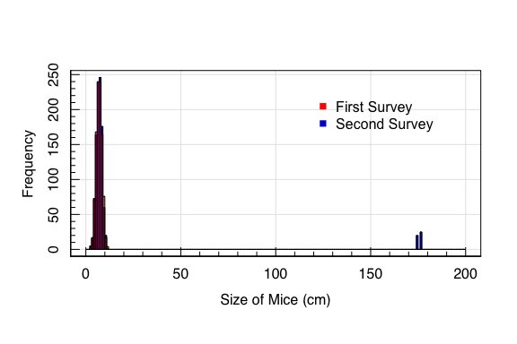

The results of these two surveys, ignoring the outliers, are identical.
However if we were to summarise these data only using mean statistics…

``` r
#Central Tendency statistics for two mice studies
mean(mice_nov); mean(mice_may);
```

``` out
## [1] 14.25428
```

``` out
## [1] 7.012647
```

…then we would be forced to draw the conclusion that the activities at
Disney World (in the intervening 6 months between the surveys) have
caused the local mouse population to double in their average size!

<!--}}}}-->

# Graphical Distribution Summarisation <!--{{{-->

As is clear from the above, it is frequently useful to explore data
distributions with multiple statistics, to describe the data in a more
complete fashion and ensure that our analysis is robust to systematic
failures. .

Additionally, one can explore univariate distributions using tools other
than point statistics.

We have already seen how graphical tools are particularly useful for
exploring datasets. In the previous lecture we discussed the utility of
histograms and KDEs for plotting distributions of data in
one-dimenstion. Here we extend this to some other useful distributions,
and particularly focus on comparisons between different samples of
observations of a single variable.

# KDEs (again) <!--{{{-->

We saw in the previous slides how the histogram made it clear that the
dataset we were analysing was contaminated by outliers. This is also
possible (and arguably easier to see) in a KDE:

``` r
magplot(density(mice_nov,from=0,to=200,bw=1),xlab='Size of Mice (cm)', ylab='Density', 
        col='blue3',type='l')
lines(density(mice_may,from=0,to=200,bw=1),col=hsv(a=0.5))
legend('topright',legend=c("First Survey","Second Survey"),
       lty=1,lwd=2,col=c('red','blue3'), bty='n',inset=0.1)
```

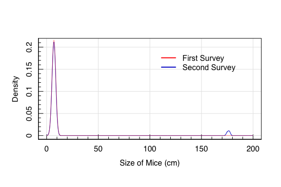

KDEs are therefore a flexible and useful tool for comparing
distributions of data in a single dimension, across different samples of
observations.

<!--}}}-->

# Box-and-Whisker Plots <!--{{{-->

When the number of samples becomes large, though, overplotting many
lines (i.e. from many KDEs) can become confusing and/or make it
difficult to quickly visualise key information.

The box-and-whisker plot is a solution to this. The box-and-whisker plot
essentially visualises a number quantiles of a given dataset
simultaneously, while also showing the outliers. The box-and-whisker
plot for our mice datasets look as below:

``` r
boxplot(list(First=mice_may,Second=mice_nov),ylab='Mice height (cm)')
```

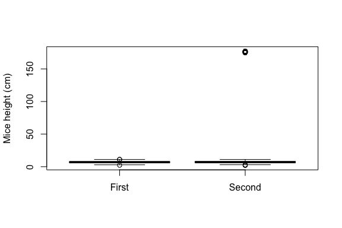

Notice that, because the boxplot shows quantiles, the default range here
(with the outliers) is somewhat unhelpful. Instead we can zoom on the
important area of the plot:

``` r
boxplot(list(First=mice_may,Second=mice_nov),notch=TRUE,ylim=c(3,12),
        ylab='Mice height (cm)')
```


The ‘box’ in the box-and-whisker plots shows the interquartile range of
the data, while the line inside the box shows the median. The “whiskers”
extend to the largest data point that is not deemed to be an “outlier”.
Outliers are shown as crosses. Finally, the “notch” on the box shows the
uncertainty on the median, which is computed using the IQR:

$$
\\Delta \\tilde{x}\_{0.5} = \\pm 1.58 \\frac{IQR}{\\sqrt{n}}\_\\,
$$

<!--}}}-->

# Violin Plots <!--{{{-->

Violin plots are a way of constructing graphs that utilise the full KDE
information without crowding that is associated with overlapping KDEs.

``` r
#Load the ggplot2 library
library(ggplot2)
#Create a combined dataset
df<-data.frame(height=c(mice_may,mice_nov),
               survey=c(rep("May",length(mice_may)),
                        rep("Nov",length(mice_nov))))
#plot the violin diagram for both datasets
ggplot(df, aes(x = survey, y = height)) +
  geom_violin(aes(fill = survey), trim = FALSE) +
  theme_classic() +
  theme(legend.position = "none")
```

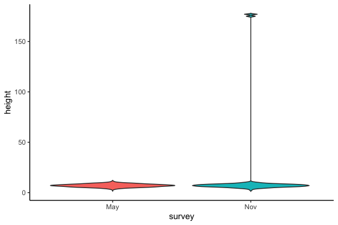

Again we can trim down the y-limits if we want:

``` r
#plot the violin diagram with points
ggplot(df, aes(x = survey, y = height)) +
  ylim(c(3,12))+
  geom_violin(aes(fill = survey), trim = FALSE) +
  theme_classic() +
  theme(legend.position = "none")
```

    ## Warning: Removed 52 rows containing non-finite values (stat_ydensity).

    ## Warning: Removed 113 rows containing missing values (geom_violin).

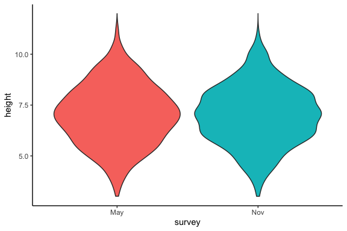

The utility of ggplot here (and of the violin plot in general) is that
it is easy to include additional information that helps understanding,
without causing a saturation of information.

For example, we can add the individual data to the figure:

``` r
#plot the violin diagram with points
ggplot(df, aes(x = survey, y = height)) +
  ylim(c(3,12))+
  geom_violin(aes(fill = survey), trim = FALSE) +
  geom_point(pch='.') +
  theme_classic() +
  theme(legend.position = "none")
```

    ## Warning: Removed 52 rows containing non-finite values (stat_ydensity).

    ## Warning: Removed 113 rows containing missing values (geom_violin).

    ## Warning: Removed 52 rows containing missing values (geom_point).


Or even add a box-and-whisker plot within the violin:

``` r
#plot the violin diagram with boxplot
ggplot(df, aes(x = survey, y = height)) +
  ylim(c(3,12))+
  geom_violin(aes(fill = survey), trim = FALSE) +
  geom_boxplot(width = 0.1) +
  theme_classic() +
  theme(legend.position = "none")
```

    ## Warning: Removed 52 rows containing non-finite values (stat_ydensity).

    ## Warning: Removed 52 rows containing non-finite values (stat_boxplot).

    ## Warning: Removed 113 rows containing missing values (geom_violin).

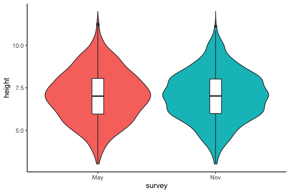

<!--}}}-->

# Quantile-Quantile Plots <!--{{{-->

Another tool for comparing univariate distributions is the
quantile-quantile (or QQ) plot. The QQ plot has a number of uses that
will become increasingly relevant in the later sections, but for now
we’ll introduce them generally.

The QQ plot does what it says in the name: it plots the quantiles of two
distributions against one-another:

``` r
qqplot(mice_may,mice_nov,xlab='Mice Heights (May Survey)',ylab='Mice Heights (Nov Survey)')
abline(0,1,col='red',lty=2)
```

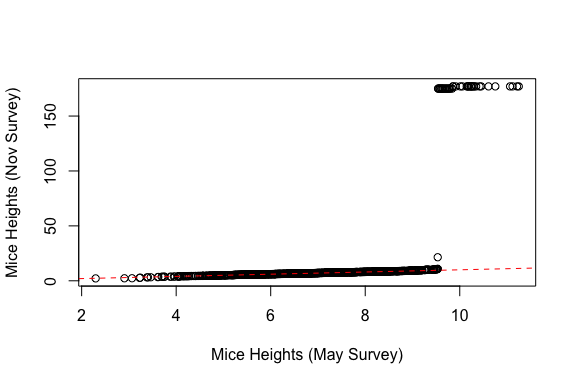

Here you can see that the vast majority of the data lie on the
one-to-one relation (shown by the red dashed line). This is clearer if
we require the plot to have a fixed 1:1 aspect ratio (and convert the
plot type to a line so that we can see the data extends beyond the edge
of the plot!):

``` r
qqplot(mice_may,mice_nov, xlim=c(0,20), ylim=c(0,20),type='l',lwd=2,
       xlab='Mice Heights (May Survey)',ylab='Mice Heights (Nov Survey)')
abline(0,1,col='red',lty=2)
```

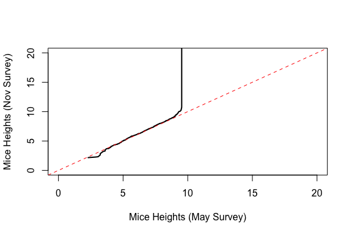

QQ plots are very useful because they encode a lot of information about
the differences between one-dimensional data. Let’s take a few example
datasets.

``` r
#Construct some Gaussian data with different properties
zero_mean<-rnorm(1e3,mean=0,sd=1) #A standard mean=0, stdev=1 gaussian
negative_mean<-rnorm(1e3,mean=-2,sd=1) #A Gaussian with negtive mean, stdev=1
positive_mean<-rnorm(1e3,mean=2,sd=1) #A Gaussian with positive mean, stdev=1
layout(matrix(1:4,ncol=2,nrow=2,byrow=TRUE)); par(mar=c(3,3,1,1))
qqplot(zero_mean,positive_mean); abline(0,1,col='red',lty=2)
qqplot(zero_mean,negative_mean); abline(0,1,col='red',lty=2)
qqplot(positive_mean,negative_mean); abline(0,1,col='red',lty=2)
```

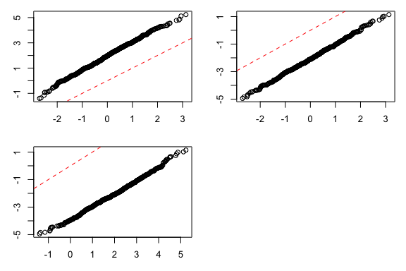

So, shifts in the mean are clearly shown as displacement in the QQ data
away from the 1:1 line. Similarly, differences in the dispersion of the
data are visible:

``` r
#Construct some Gaussian data with different properties
standard_scatter<-rnorm(1e3,mean=0,sd=1) #A standard mean=0, stdev=1 gaussian
smaller_scatter<-rnorm(1e3,mean=0,sd=0.5) #A Gaussian with less dispersion
larger_scatter<-rnorm(1e3,mean=0,sd=2) #A Gaussian with greater dispersion
layout(matrix(1:4,ncol=2,nrow=2,byrow=TRUE)); par(mar=c(3,3,1,1))
qqplot(standard_scatter,smaller_scatter); abline(0,1,col='red',lty=2)
qqplot(standard_scatter,larger_scatter); abline(0,1,col='red',lty=2)
qqplot(larger_scatter,smaller_scatter); abline(0,1,col='red',lty=2)
```

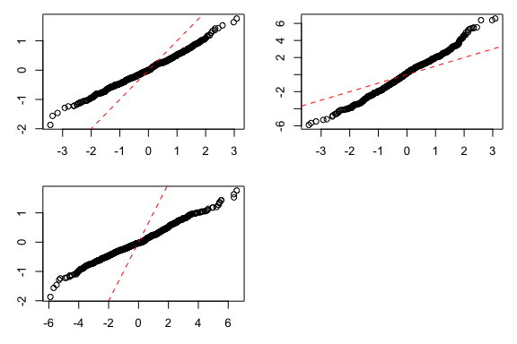

So differences in the distribution dispersion are shown as differences
in the slope of the QQ plot with respect to the 1:1 line.

We can also find the influence of outliers (which we can probably guess
from the first dataset…):

``` r
#Construct some Gaussian data with different properties
standard_normal<-rnorm(1e3,mean=0,sd=1) #A standard mean=0, stdev=1 gaussian
outlier_normal<-c(rnorm(1e3,mean=0,sd=1),
                  runif(100,min=-10,max=10)) 
layout(1)
qqplot(standard_normal,outlier_normal); abline(0,1,col='red',lty=2)
```

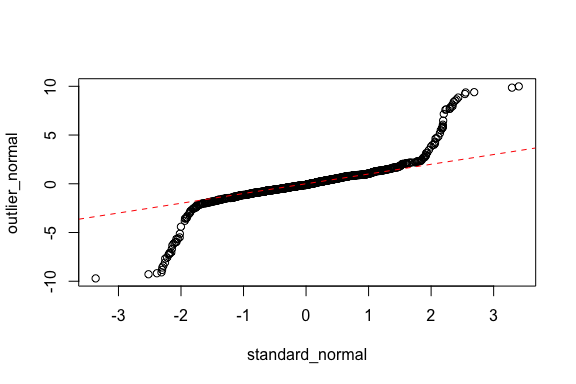

And so outliers cause shifts in the tails of the QQ plot. Bringing all
this together, we can compare (for example) a ficticious dataset *Y* to
an expected model distribution that follows
$X\_{\\rm model}\\sim N(\\mu=0,\\sigma=1)$:

``` r
#Construct our Model dataset 
model<-rnorm(1e5,mean=0,sd=1)
#Compare the model to the dataset "Y"
qqplot(Y,model); abline(0,1,col='red',lty=2)
```

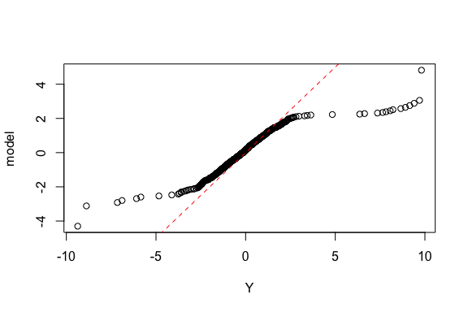

What can you conclude about our dataset Y compared to our model?

<!--}}}-->
<!--}}}-->

# Graphical Comparisons for Data with Two (or more) dimensions <!--{{{-->

Until now, we have essentially explored datasets with only one variable
(and how to compare different sets of observations of this one
variable). We now want to extend our analysis to datasets that contain
two (or more) variables.

# Scatter Plots <!--{{{-->

The first option for essentially all comparisons between multiple
variables is almost always to produce a scatter plot. These are the
simplest method of comparing observations of multiple variables.

``` r
#Create a dataset with two variables 
df<-data.frame(X=rnorm(1e3,mean=0,sd=1),Y=rnorm(1e3,mean=100,sd=1))
#Plot the data as a scatter plot 
magplot(df$X,df$Y,xlab="X",ylab="Y")
```

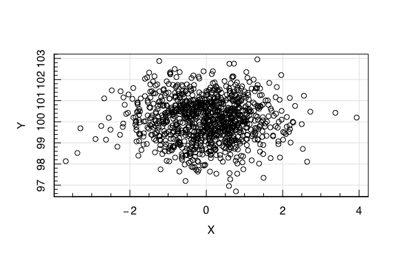

The first important point about plotting distributions of data in
multiple dimensions, is that you should **always be aware of the scales
of the axes**. For data that is expected to have the same dynamic range
in both dimensions (that is, similar dispersion), it is almost always
preferable to plot the data with fixed aspect ratio:

``` r
#Plot the data as a scatter plot with fixed aspect ratio
magplot(df$X,df$Y,xlab="X",ylab="Y",asp=1)
```

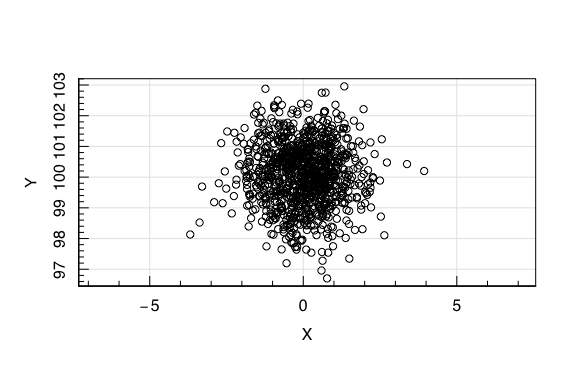

For data with very different aspect ratios, this is not practical (and
can lead to misinterpretation of relationships between variables when
there are none):

``` r
#Create a dataset with two variables of different dispersion
df<-data.frame(X=rnorm(1e3,mean=0,sd=1),Y=rnorm(1e3,mean=100,sd=50))
#Plot the data as a scatter plot with fixed aspect ratio
magplot(df$X,df$Y,xlab="X",ylab="Y",asp=1)
```

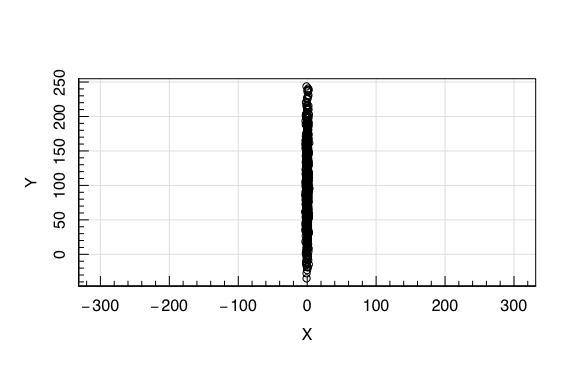

This gives us two options when plotting data of different dynamic
ranges:

-   Tailor the axes to be appropriately scaled for each variable; or
-   Plot the data in “standard” coordinates (called “whitening” the data
    in machine-learning language).

## Standard coordinates

Standard coordinates are useful for visualising relationships between
two variables when we are not interested (primarily) in the absolute
values of the variable central tendency and dispersion measures.

Standard coordinates are achieved by subtracting the arithmetic mean
from each variable, and dividing by the sample standard deviation. In
other words, we transform the data to have *x̄* = 0 and
*σ*<sub>*x*</sub> = 1.

``` r
#Transform the dataset of two variables of different dispersion to 
#Standard coordinates
df_standard<-as.data.frame(scale(df)) #scale returns a matrix by default
colnames(df_standard)<-colnames(df)
#Plot the data as a scatter plot with fixed aspect ratio
magplot(df_standard$X,df_standard$Y,
        xlab="X (standard coords)",ylab="Y (standard coords)",asp=1)
```

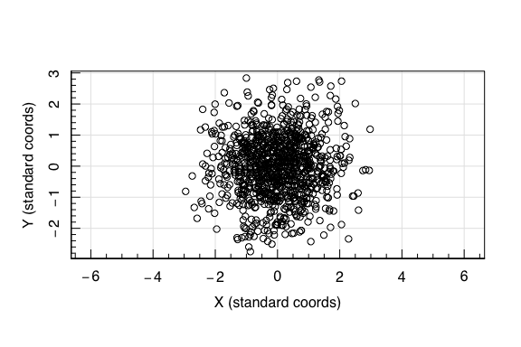

<!--}}}-->

# KDEs (again again) <!--{{{-->

Once again, we can utilise KDEs to visualise relationships between
datasets, this time in two dimensions. As with our 1D KDEs, we need to
specify a kernel (with which we effectively smooth-out the data), but
now our kernel needs to be two-dimensional.

An example of 2D KDEs is available within the *magicaxis* package in the
form of the function *magcon*. This function allows use to plot the 2D
KDE as an image, with contours, etc, easily and flexibly.

``` r
#We'll use the "faithful" built-in dataset here
faithful<-get(data("faithful"))
#2D KDE of our whitened dataset in magicaxis
magcon(faithful$eruptions,faithful$waiting, 
       xlab="Eruption length of Old Faithful (min)",
       ylab="Waiting Time till next Eruption (min)",
       xlim=c(0.5, 6),ylim=c(40, 110))
```

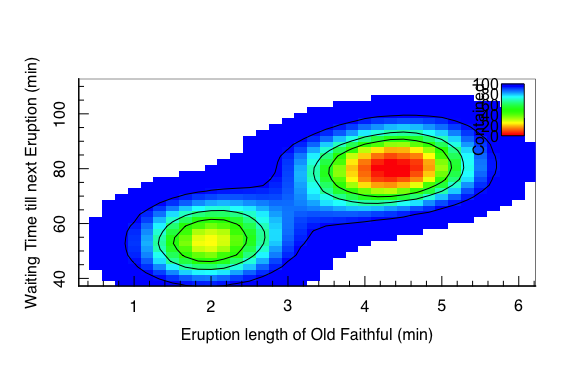

As always, the ggplot2 suite of plotting functions also has very nice
implementations of 2D KDEs:

``` r
#2D KDE of our whitened dataset in ggplot2
m<-ggplot(faithful, aes(x = eruptions, y = waiting)) +
 xlab("Eruption length of Old Faithful (min)") + 
 ylab("Waiting Time till next Eruption (min)") +
 geom_point() +
 xlim(0.5, 6) +
 ylim(40, 110)
# 2D KDE as contours: 
m + geom_density_2d()
```

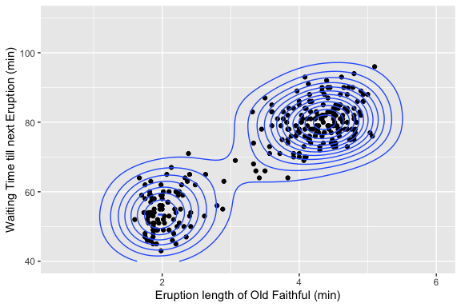

``` r
# 2D KDE as filled images: 
m + geom_density_2d_filled(alpha = 0.5)
```

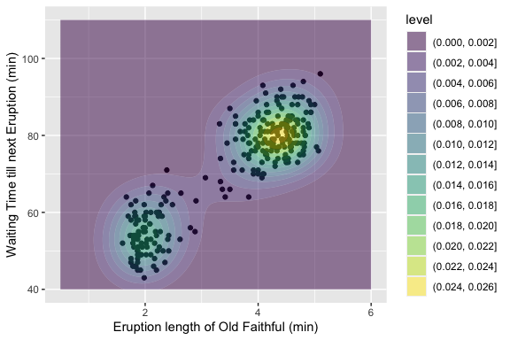

``` r
# or with both: etcetc
m + geom_density_2d_filled(alpha = 0.5) +
  geom_density_2d(size = 0.25, colour = "black")
```


<!--}}}-->
<!--}}}-->

# Summarising relationships in 2D <!--{{{-->

When provided with datasets containing multiple dimensions, we are
frequently interested in determining relationships between variables.
Looking again at our “faithful” dataset:

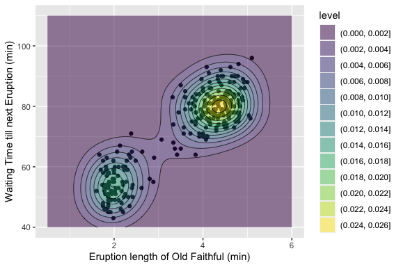

There is a clear relationship between the duration of the eruption and
the time until the next eruption. This relationship may have an
underlying physical cause that we are interested in, or it may be
coincidental. Determining the relationship between variables, and their
significance, is therefore an important topic in statistics.

<!--}}}-->

# Covariance and Correlation <!--{{{-->

We’ve previously explored the concept of variance and standard
deviation. For a single variable, recall that the variance was defined
as:

$$
\\begin{align}
\\tilde{s}^2 &= \\frac{1}{n}\\sum\_{i=1}^{n} (x\_i-\\bar{x})^2 \\\\
&= {\\rm mean}\[x\_i-{\\rm mean}(x\_i)\]^2
\\end{align}
$$

The **covariance** of two variables is then defined as the joint
variance between each variable:

$$
{\\rm cov}(X,Y) = {\\rm mean}\[(x\_i-{\\rm mean}(x\_i))\\times(y\_i-{\\rm mean}(y\_i))\]
$$

We will discuss the covariance formula more later in the course, but for
now you can see that the definition formally makes sense if you compute
the covariance of a variable with itself:

$$
\\begin{align}
{\\rm cov}(X,X) &= {\\rm mean}\[(x\_i-{\\rm mean}(x\_i))\\times(x\_i-{\\rm mean}(x\_i))\] \\\\
&= {\\rm mean}\[(x\_i-{\\rm mean}(x\_i))^2\] \\\\
&\\equiv \\tilde{s}^2
\\end{align}
$$

The covariance of two variables describes the degree of joint variation
that exists between two variables. For our “faithful” dataset, we find
that the covariance is 13.9778078. This value, though, is dependent on
the absolute dispersion of the dataset. That is, if we were to convert
the faithful dataset into standard coordinates, the covariance changes:
0.9008112.

## Pearson Correlation <!--{{{-->

It is therefore often useful to compute the amount of **correlation**
between variables, that is invariate under scaling of the variables. For
this we can compute the so-called **Pearson correlation coefficient**:

$$
{\\rm cor}(X,Y) = \\frac{{\\rm cov}(X,Y)}{s(X)s(Y)}
$$

The correlation coefficient varies between  − 1 (for perfectly
negatively correlated data), and 1 (for perfectly positively correlated
data). For our faithful dataset, we have:

``` r
#Compute ourselves 
with(faithful,
  cov(eruptions,waiting)/(sd(eruptions)*sd(waiting))
)
```

``` out
## [1] 0.9008112
```

``` r
#Use the internal function 
cor(faithful$eruptions, faithful$waiting)
```

``` out
## [1] 0.9008112
```

The covaraiance and correlation values are useful for computing the
relationships between any two variables. For datasets with two or more
variables, the covariance can be computed for all combinations of
different variable combinations, to create the **covariance matrix** and
**correlation matrix**:

$$
{\\rm cov}(\\Omega) = 
\\begin{pmatrix}
{\\rm var}(X\_1)  & {\\rm cov}(X\_1,X\_2) & \\dots & {\\rm cov}(X\_1,X\_n) \\\\
{\\rm cov}(X\_2,X\_1)  & {\\rm var}(X\_2) & \\dots & {\\rm cov}(X\_2,X\_n) \\\\
\\vdots & \\vdots & \\ddots & \\vdots \\\\
{\\rm cov}(X\_n,X\_1)  & {\\rm cov}(X\_n,X\_2) & \\dots & {\\rm var}(X\_n)
\\end{pmatrix}
$$
$$
{\\rm cor}(\\Omega) = 
\\begin{pmatrix}
1  & {\\rm cor}(X\_1,X\_2) & \\dots & {\\rm cor}(X\_1,X\_n) \\\\
{\\rm cor}(X\_2,X\_1)  & 1 & \\dots & {\\rm cor}(X\_2,X\_n) \\\\
\\vdots & \\vdots & \\ddots & \\vdots \\\\
{\\rm cor}(X\_n,X\_1)  & {\\rm cor}(X\_n,X\_2) & \\dots & 1
\\end{pmatrix}
$$

We can compute these matrices for our faithful dataset:

``` r
cov(faithful); cor(faithful)
```

``` out
##           eruptions   waiting
## eruptions  1.302728  13.97781
## waiting   13.977808 184.82331
```

``` out
##           eruptions   waiting
## eruptions 1.0000000 0.9008112
## waiting   0.9008112 1.0000000
```

Pearson correlation, however, should be used with caution. For linear
data, the coefficient is sensible. However for strongly non-linear data
the coefficient is less interpretable:

<!--Image Template-{{{-->


<!--}}}-->

<!--}}}-->

## Spearman Correlation <!--{{{-->

There are other correlation formalisms that attempt to circumvent the
problems of the Pearson correlation coefficient is to utilise an
associated measure called the **Spearman Rank Correlation**. The
Spearman Rank Correlation is defined as the Pearson correlation between
the *rank-orders of the variables*.

This formalism means that highly non-linear data which are simple
transformations of one-another have high Spearman correlation, even when
the Pearson correlation is small.

As a demonstration, we’ll construct a dataset with one non-linear
variable, but which is exactly correlated to another (in the intuiative
sense: knowing one perfectly informs the other).

``` r
#Define a simple Gaussian dataset 
obs<-data.frame(X=rnorm(1e3,mean=0,sd=1))
#Create a non-linear variable 
obs$Y<-obs$X^3
#Plot the data
magplot(obs,xlab="X",ylab="Y")
```

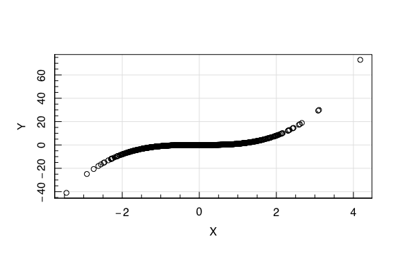

``` r
#Calculate the Pearson Correlation
cor(obs)
```

``` out
##           X         Y
## X 1.0000000 0.7386731
## Y 0.7386731 1.0000000
```

So Pearson tells us that the variables are corrlated at the  ∼ 70%
level, while a quick look at our figure shows us that this is clearly an
underestimate.

If we compute the pearson correlation of the rank-ordered variables,
though:

``` r
#Calculate the Pearson Correlation of the rank-orders of the data
cor(order(obs$X),order(obs$Y))
```

``` out
## [1] 1
```

This makes sense intuitively, because the function *Y* is monotonically
increasing and perfectly correlated to *X* (albeit non-linearly). This
is the Spearman Rank correlation:

``` r
#Spearman Rank Correlation 
cor(obs,method='spearman')
```

``` out
##   X Y
## X 1 1
## Y 1 1
```

Let’s now see if the Spearman correlation can recover the correlation of
one of our We can now look at one of the strange Pearson results from
our figure:

``` r
#Define a simple dataset with Zero Pearson Correlation 
obs<-data.frame(X=runif(1e5,min=-1/2*pi,max=1/2*pi))
obs$Y<-runif(1e5,min=-0.3,max=0.3)-cos(obs$X)
magplot(obs,xlab='X',ylab='Y',pch='.')
```

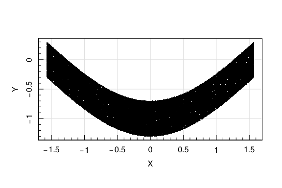

``` r
cor(obs); cor(obs,method='spearman')
```

``` out
##              X            Y
## X  1.000000000 -0.004813213
## Y -0.004813213  1.000000000
```

``` out
##              X            Y
## X  1.000000000 -0.003053893
## Y -0.003053893  1.000000000
```

Notice that the rank correlation is unable to recover the correlation
between non-monotonically increasing variables! In this way, the
correlation coefficients are describing the joint information between
two variables. In the monotonically increasing case, knowledge of *X*
perfectly informs us abou *Y* *and vice-versa*. However in the
non-monotonic case, the knowlege of *X* perfectly informs *Y*, however
the converse is not true.

<!--}}}-->
<!--}}}-->

# Interpreting Correlation (**IMPORTANT**) <!--{{{-->

If you only learn one thing from this course, this is probably what you
should learn.

We are inclined (as humans) to interpret correlations as causal
relationships. Sometimes this may be justified, **but often it is not**.

<!--Image Template-{{{-->


<!--}}}-->

Here we can see that the number of divorces in the US state of Maine is
inversely correlated with the consumption of margarine per person in the
USA.

The conclusion is clear: **Eating margarine in LA will invariably lead
to a divorce in Maine**.

Or more accurately: no, of course it won’t.

This is an example of a spurious correlation. Such correlations are
possible (and indeed likely!) when you have few observations of many
variables.

## A sneak peak at probability

As a demonstration, let’s say that here we have made 10 observations and
found a correlation of  ∼ 0.8. Let’s assume that this discovery came
from a catalogue containing *p* = 1000 variables, all of which are
totally random. What fraction of these variables do we expect to have a
correlation of 80% or more?

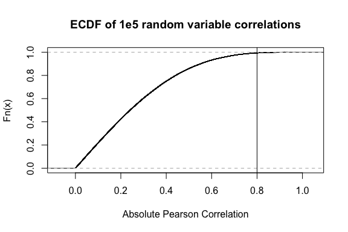

``` out
## 0.65 % of variables have 80% correlation or more
```

Said differently, there is a 1 in 153 chance that two totally random
variables will have an absolute correlation of 0.8 or higher.

## What does this mean?

The likelihood of finding “significant” correlations between truely
random data is non-zero, and grows with decreasing numbers of
observations and increasing numbers of observed variables.

The problem is further complicated by the existence of **confounding
variables**.

A confounding variable is one that acts upon both the dependent and
independent variables in a measurement of correlation, and thereby
creates a spurious correlation between the two.

``` r
#A simple Gaussian dataset 
obs<-data.frame(Z=rnorm(1E3,mean=0,sd=1))
#A new variable that correlates with Z
obs$X<-sin(obs$Z)+runif(1e3,min=-0.2,max=0.2)
#And another new variable that correlates with Z
obs$Y<-obs$Z^3+runif(1e3,min=-0.2,max=0.2)
```

We’ve created two variables that correlate with *Z*. But what if we
never actually *observed* the variable *Z*… We would instead plot *X*
and *Y*:

``` r
#Plot X and Y
magplot(obs$X,obs$Y,xlab='X',ylab='Y',ylim=c(-10,10))
```

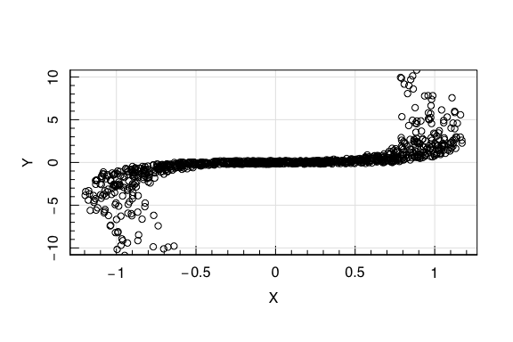

``` r
#Rank Correlation 
cor(obs$X,obs$Y,method='spearman')
```

``` out
## [1] 0.9064995
```

And be tempted to decide that there is a **causal** relationship between
these two parameters, when in fact none exists.

Thus we have demonstrated the common but extremely important statistical
fact:

<font color="blue" size="12"> Corrlation does not equal Causation!
</font>

<!--}}}-->
