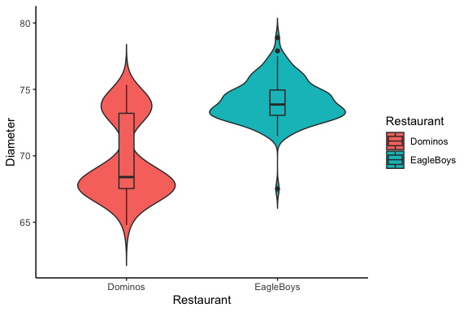

Introduction to Statistics for Astronomers and Physicists
================
Dr Angus H Wright
2022-02-09


# Statistics in practice <!--{{{-->

Choosing which statistic (and analysis methods) to use is frequently
determined by the type of data that you are analysing. For the remainder
of this chapter, we are going to perform some practical data mining.

For this purpose, I have selected a dataset for us that is **highly
relevant to all physics and astronomy students living in Germany in
2021**.

We will be exploring a dataset of:

-   <center>
    <font size="10" color="black"> Pizza Sizes from two Australian
    Restaurants in 2012 </font>
    </center>

We will intentionally begin our exploration into this dataset with no
additional information. Our goal will be to utilise the various
statistics that we have learnt about so far.

<!--}}}-->

# Employing the statistics we’ve learnt so far <!--{{{-->

We will start by reading in our dataset as a data.frame:

<!--R CodeBlock Template-{{{-->

``` r
#Read in the pizza dataset with R
library(data.table) 
df<-fread("pizzadata.csv") 
```

<!--}}}-->

The remainder of this section is going to be a bit of a “choose your own
adventure”. I will provide options, and you can vote for which path to
go down. We’ll slowly build up a picture of what’s happening in the
dataset, and eventually will be able to make an informed choice about
which pizza we should have bought when we were in Australia in 2012.

## Example: Choose your own adventure <!--{{{-->

You are walking through the forest and you come to a small cottage made
entirely out of candy! What do you do?

> -   Option 1: [Go inside (to discuss the merits of brick and
>     mortar)](#(4))
> -   Option 2: [Take a photo, for the ’gram](#(5))
> -   Option 3: [I’m smart enough to stay away from that…](#(6))

[Let’s get started](#(7))

<!--}}}-->

# Going inside leads to… <!--{{{-->

## **A Nobel Prize?!**

After deciding not to unfairly judge someones house without hearing
their story, you knock on the door of the candy house.

You’re greeted by an educated young lady who has a lengthy discussion
with you about the little understood merits of using candy as
sustainable housing.

With your expertise in physics, and her ingenious mind for
candy-construction, you pioneer a new form of housing that is able to be
revolutionise impoverished communities all over the world.

Your success with the candy-house genius is so profound, that the Nobel
committee deems it worthy of not one, but all the nobel prizes on offer:
Physics, Chemistry, Economics, Medicine, Peace, and even Literature!

*Congratulations*!

[Back](#(3))

<!--}}}-->

# Taking a photo leads to… <!--{{{-->

## **Prison?!**

After deciding to take a sneaky photo for the ’gram, you post it with a
snappy quip that is sure to get the followers laughing (“I can’t Hansel
how cool this house is!”).

Unfortunately for you, the photo is flagged for copyright infringement
by the eccentric billionaire known only as “Gretel”.

In retrospect, the house has nothing to do with her, but the wheels are
already in motion. She brings the full force of her literature empire
down upon you, smearing your name in local newspapers, and filing
frivolous lawsuit after frivolous lawsuit.

Eventually, broken and bankrupt from the constant court cases, you are
given the option to plead guilty to theft of intellectual property or
continue with the never-ending court cases. You don’t see much of a
choice…

Why did you have to take that photo?!

[Back](#(3))

<!--}}}-->

# Keeping on walking leads to… <!--{{{-->

## **DEATH?!**

After deciding not to explore the strange candy house, you decide to
keep walking along the forest path.

But it’s getting late, and your phone is low on battery. And you get
yourself horribly lost.

Now it’s dark, you have no phone, you’re cold, you can hear wolves
gathering…

It’s now that you remember that, for some reason, you’re carrying a
backpack filled with raw sausages. *And the animals know*.

You throw the bag and run, but the wolves are quickly finished with the
sausages. They hear you running blindly in the distance. And they’re
still hungry…

[Back](#(3))

<!--}}}-->

# First Step in (Data-)Mining Pizzas <!--{{{-->

Let’s start.

You are presented with a dataset that is of Pizza’s in Australia, and no
other information. You want to make an informed decision about what
pizza to order for your dinner. Pick your first step in analysis:

> -   Option 1: [What columns does the data have?](#(9))
> -   Option 2: [How many observations are there?](#(10))
> -   Option 3: [What is the average?](#(8))

[Back to the start](#(7))

<!--}}}-->

# “What is the average”? <!--{{{-->

The real question is, what does is mean to take an average of a dataset
that we know nothing about?! Probably best to learn some basics about
the dataset first…

[Back to the start](#(7))

<!--}}}-->

# Checking the format of the data <!--{{{-->

It is always sensible to start by asking “what is the format of the data
that I’ve been given”.

<!--R CodeBlock Template-{{{-->

``` r
#Columns of the Pizzas data frame 
colnames(df) 
```

    ## [1] "Restaurant" "Base"       "Topping"    "Diameter"

``` r
#Or just print some of the data frame
head(df)
```

    ##    Restaurant         Base       Topping Diameter
    ## 1:    Dominos  ThinNCrispy       Supreme  74.6760
    ## 2:    Dominos  ThinNCrispy BBQMeatlovers  75.2602
    ## 3:    Dominos      DeepPan      Hawaiian  68.7324
    ## 4:    Dominos  ThinNCrispy       Supreme  69.7230
    ## 5:    Dominos ClassicCrust      Hawaiian  67.5386
    ## 6:    Dominos      DeepPan BBQMeatlovers  68.9864

``` r
#Or we can print the structure for the most info
str(df)
```

    ## Classes 'data.table' and 'data.frame':   250 obs. of  4 variables:
    ##  $ Restaurant: chr  "Dominos" "Dominos" "Dominos" "Dominos" ...
    ##  $ Base      : chr  "ThinNCrispy" "ThinNCrispy" "DeepPan" "ThinNCrispy" ...
    ##  $ Topping   : chr  "Supreme" "BBQMeatlovers" "Hawaiian" "Supreme" ...
    ##  $ Diameter  : num  74.7 75.3 68.7 69.7 67.5 ...
    ##  - attr(*, ".internal.selfref")=<externalptr>

<!--}}}-->

So, we can see that there are 3 qualitative variables (of character
type) and 1 quantitative variable (of numeric type), and there are 250
observations. It may not be clear yet whether the qualitative variables
are nominal or ordinal, though.

[What comes next?](#(11))

<!--}}}-->

# Checking the number of observations <!--{{{-->

Checking the number of observations of the data is a sensible thing to
do to start, but we don’t necessarily need to do this as a stand-alone
step. Nonetheless:

<!--R CodeBlock Template-{{{-->

``` r
#Number of observations of the Pizzas dataset
nrow(df)
```

    ## [1] 250

<!--}}}-->

So there are 250 observations within the dataset.

[Back to the start](#(7))

<!--}}}-->

# Analysing the variables <!--{{{-->

We now know the variables that are present in our dataset. The next step
is to learn a little more about our data.

Which personality do you think suits you best?

> -   Option 1: [The Savvy Restaurateur (What Restaurants are
>     there?)](#(12))
> -   Option 2: [The Discerning Critic (What bases & toppings are
>     there?)](#(13))
> -   Option 3: [The Value Seeker (What diameters are there?)](#(14))

[Back to the start](#(7))

<!--}}}-->

# The Restaurants <!--{{{-->

We already know from our (minimal) starting information that there
should be two restaurants here. But what are they, and are there equal
numbers of observations from each restaurant?

``` r
#Restaurants in the Pizzas Dataset 
table(df$Restaurant)
```

    ## 
    ##   Dominos EagleBoys 
    ##       125       125

So we have exactly the same number of observations from each restaurant!
That should make things easy going forward!

[Back to the variables](#(11))

<!--}}}-->

# The Bases and Toppings <!--{{{-->

We now also want to learn a bit about the other variables in the
dataset; Bases and Toppings. What values can these variables take, and
what is the relative frequency of each of the observations?

``` r
#Bases in the Pizzas Dataset 
table(df$Base)
```

    ## 
    ## ClassicCrust      DeepPan     MidCrust    ThinCrust  ThinNCrispy 
    ##           42           83           43           39           43

Starting with bases, these are clearly ordinal; there is a natural
ranking (thin to thick) but the difference between thin and classic is
not quantitative (at least, not without additional information that we
don’t have).

``` r
#Toppings in the Pizzas Dataset 
table(df$Topping)
```

    ## 
    ## BBQMeatlovers      Hawaiian  SuperSupremo       Supreme 
    ##            85            84            40            41

Toppings on the other hand are nominal; there’s no natural ordering of
BBQ and Hawaiian and Supreme.

Looking at the relative frequency of observations:

``` r
#Frequency of Bases
table(df$Base)/nrow(df)
```

    ## 
    ## ClassicCrust      DeepPan     MidCrust    ThinCrust  ThinNCrispy 
    ##        0.168        0.332        0.172        0.156        0.172

``` r
#Frequency of Toppings
table(df$Topping)/nrow(df)
```

    ## 
    ## BBQMeatlovers      Hawaiian  SuperSupremo       Supreme 
    ##         0.340         0.336         0.160         0.164

There seems to be some pretty clear differences coming out of the
dataset now. For example, there are some topping observations (BBQ and
Hawaiian) that have ∼twice the number of observations as the others.
Additionally, there seem to be near-duplicates in the base and topping
values (“ThinCrust” and “ThinNCrispy”). This could be important?

[Back to the variables](#(11))

<!--}}}-->

# The Diameters <!--{{{-->

This is really the primary variable of interest in this dataset, however
we shouldn’t discount the importance of the other data. All the
information is going to be relevant when we wish to understand the
dataset here.

As a continuous variable, we have many options of how to look at the
diameter dataset.

> -   Option 1: [The Point-y End (Let’s work with point
>     statistics)](#(15))
> -   Option 2: [The Visual Learner (Let’s try some
>     visualisations)](#(16))

[Back to the variables](#(11))

<!--}}}-->

# Get to the Point(-Statistics) <!--{{{-->

When exploring the diameter data, we can look directly at point
statistics that are designed to show the central tendency and the
dispersion of our diameter data.

So far we’ve focussed on three measures of central tendency in the
course, and on three measures of dispersion.

``` r
#Define a mode function 
mode<-function(X) { 
  dens<-density(X)
  return(dens$x[which(dens$y==max(dens$y))])
}
#Central tendency of Pizza Diameters 
mean(df$Diameter); median(df$Diameter); mode(df$Diameter)
```

    ## [1] 71.90283

    ## [1] 73.0631

    ## [1] 73.69366

``` r
#Dispersion of Pizza Diameters 
sd(df$Diameter); mad(df$Diameter); IQR(df$Diameter)
```

    ## [1] 3.241996

    ## [1] 2.485431

    ## [1] 5.97535

Recall that the nMAD should reproduce the standard deviation for
Gaussian data, but here we see a slight difference in the dispersion
estimates from the two measures. The IQR isn’t really related to the
standard deviation and so we can’t directly compare the two (NB: IQR is
generally larger than the standard deviation for most datasets).

Otherwise the mean, median, and mode all show reasonably similar values.
Nothing too unusual it seems.

[Let’s look at some figures](#(16))

<!--}}}-->

# Visualise and Attack <!--{{{-->

Let’s look at the data with a histogram:

``` r
#Histogram of the diameters 
library(magicaxis)
maghist(df$Diameter, breaks=40,col='blue2',xlab='Diameter (cm)', ylab='Frequency',
        freq=TRUE, verbose=FALSE)
```


There appears to be two peaks here…

> -   Option 1: [Split by Restaurant?](#(17))
> -   Option 2: [Split by Base?](#(18))
> -   Option 3: [Split by Topping?](#(19))

> -   [What’s Next](#(20))

# Diameter Conditioned by Restaurant?

What about if we split the data by the Restaurant?

``` r
#Violin plot of the diameters by Restaurant
library(ggplot2)
ggplot(df, aes(x = Restaurant, y = Diameter, fill=Restaurant)) +
  geom_violin(position = position_dodge(0.7), trim = FALSE) +
  geom_boxplot(position = position_dodge(0.7), width = 0.1) +
  theme_classic() 
```



We’ve split the data here into a **conditional distribution** of
diameter and Restaurant.

> -   [Go Back](#(16))

# Diameter Conditioned by Base?

What about if we split the data by the Base?

``` r
#Violin plot of the diameters by Base
library(ggplot2)
ggplot(df, aes(x = Base, y = Diameter, fill=Base)) +
  geom_violin(position = position_dodge(0.7), trim = FALSE) +
  geom_boxplot(position = position_dodge(0.7), width = 0.1) +
  theme_classic() 
```


We’ve split the data here into a **conditional distribution** of
diameter and Base.

> -   [Go Back](#(16))

# Diameter Conditioned by Topping?

What about if we split the data by the Topping?

``` r
#Violin plot of the diameters by Topping
library(ggplot2)
ggplot(df, aes(x = Topping, y = Diameter, fill=Topping)) +
  geom_violin(position = position_dodge(0.7), trim = FALSE) +
  geom_boxplot(position = position_dodge(0.7), width = 0.1) +
  theme_classic() 
```


We’ve split the data here into a **conditional distribution** of
diameter and Topping.

> -   [Go Back](#(16))

# What have we learnt?

There’s clearly joint information here that’s important..

-   Restaurants clearly differ
-   But there’s complexity in the base choice.

How do we decide what to order?

# Diameter conditioned on both Base and Restaurant

``` r
#Violin plot of the diameters by Topping
library(ggplot2)
ggplot(df, aes(x = Base, y = Diameter, fill=Restaurant)) +
  geom_violin(position = position_dodge(0.7), trim = FALSE) +
  geom_boxplot(position = position_dodge(0.7), width = 0.1) +
  theme_classic() 
```


<!--}}}-->
<!--}}}-->
