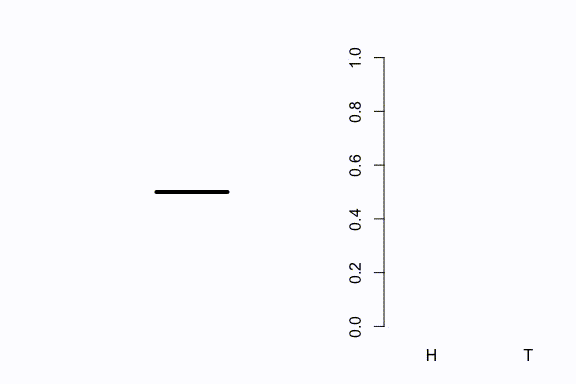
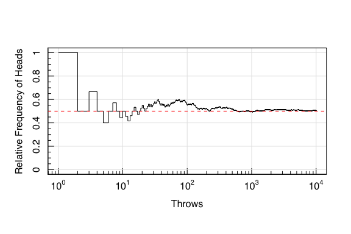
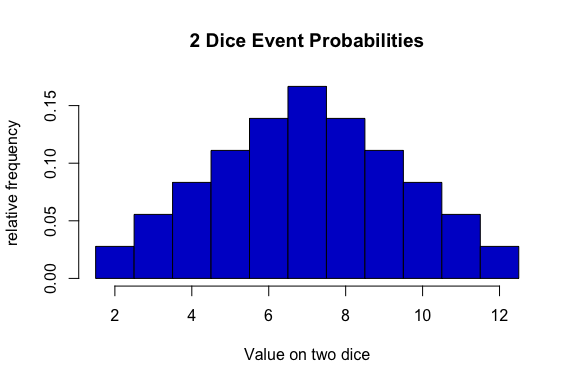

Introduction to Statistics for Astronomers and Physicists
================
Dr Angus H Wright
2022-02-09


# Section 2: Introduction <!--{{{-->

<!--Setup {{{-->
<style type="text/css">
.python { 
  background-color: 
    RColorBrewer::brewer.pal(1,"Set2");
} 
.out { 
  max-height: 300px;
  overflow-y: auto;
  background-color: inherit;
}
</style>
<!--}}}-->

**Section 2: Probability & Decision Making (Weeks 3-5)**

For all aspects of modern science, an understanding of probability is
required. We cover a range of topics in probability, from decision
theory and the fundamentals of probability theory, to standard
probabilistic distributions and their origin. From this module, students
will gain an insight into different statistical distributions that
govern modern observational sciences, the interpretation of these
distributions, and how one accurately models distributions of data in an
unbiased manner.

Topics include:

> -   Decision theory
> -   Fundamentals of probability
> -   Statistical distributions and their origins

<!--}}}-->

# Reminder of Set Notation <!--{{{-->

In this section, we will explore the fundamentals of probability. For
this, we will use set notation quite heavily. The important things to
remember about set notation are:

> -   A set *X* is defined as a collection of items, grouped by curly
>     brackets:
>     *X* = {*x*<sub>1</sub>, *x*<sub>2</sub>, …, *x*<sub>*n*</sub>}
> -   The size (or cardinality) of a set is given by \|*X*\|.
> -   A set with cardinality of 0 is the empty set, which has the symbol
>     ∅.

# Events and Outcomes

Given an experiment, there can be a set of possible results. These
results are known as **outcomes**. Every run of an experiment will
produce one, *and only one*, outcome.

## Sample Space

When we toss a coin, there are two possible outcomes: Heads (H) or Tails
(T). This is therefore the total set of available outcomes, known as the
**sample space** (*Ω*).


*Ω* = {*H*, *T*}

If we were to toss our coin twice, the set of available outcomes
increases:

*Ω* = {*H**H*, *H**T*, *T**H*, *T**T*}

Now: consider a game which only ends when you throw a head *and then* a
tail. What is the sample space of outcomes of this game?

-   
    *Ω* = {*H**T*, *H**H**T*, *T**H**T*, *H**H**H**T*, *T**H**H**T*, *T**T**H**T*, *H**H**H**H**T*, …}

This sample space is infinite, but is still totally valid.

<!--}}}-->

# Probability derives from Outcomes <!--{{{-->

The available outcomes of our single coin-toss experiment are:

*Ω* = {*H*, *T*}

If we were to perform this experiment *N* times (i.e. run *N*
**trials**), we could record the number of occurrences of each outcome
*A*. We can then observe the relative frequency of each outcome:

$$
f\_{A} = \\frac{\\\#(A)}{N}\_{}
$$

We can perform this experiment using a simulated coin toss in **R**:

<!--R Animated Figure Template-{{{-->


<!--}}}-->

If we plot this as a running “Relative Frequency of Heads”:

<!--R CodeBlock Template-{{{-->

``` r
vals<-rbinom(1E4,1,0.5)
magplot(1:length(vals),cumsum(vals)/1:length(vals),
        type='s',ylab='Relative Frequency of Heads',xlab='Throws',
        ylim=c(0,1),log='x')
abline(h=0.5,lty=2,col='red')
```


<!--}}}-->

We can see that, as the number of throws becomes large, the relative
frequency tends towards 50%. With this knowledge, we can define the
probability of an outcome *A* as the relative frequency of the outcome
after infinitely many trails:

$$
P(A)=\\lim\_{N\\to\\infty}\\frac{\\\#(A)}{N}\_{}. 
$$

This gives us some information about probability already.

> -   Because probability derives from relative frequency of
>     observations:
>     0 ≤ *P*(*A*) ≤ 1

Furthermore, when we look at the probability of all possible outcomes
(i.e.  *A*<sub>*i*</sub> ∈ *Ω*):

> -   *Ω* is the sample space of all outcomes, so the sum of all
>     relative frequencies must be 1:
>     ∑<sub>*A*<sub>*i*</sub> ∈ *Ω*</sub>*P*(*A*<sub>*i*</sub>) = 1.

<!--}}}-->

# Probability Trees <!--{{{-->

Outcomes of experiments can be visualised using probability trees, that
summarise all possible outcomes (and strings of outcomes).

``` r
library(DiagrammeR)
mermaid("
  graph LR
    Start --> H[H, P=0.5]
    Start --> T[T, P=0.5]
    H --> HH[H, P=0.5]
    H --> HT[T, P=0.5]
    T --> TH[H, P=0.5]
    T --> TT[T, P=0.5]
    HH --> HHout[HH, P=0.25]
    HT --> HTout[HT, P=0.25]
    TH --> THout[TH, P=0.25]
    TT --> TTout[TT, P=0.25]
")
```

<div id="htmlwidget-2c37ce644abdbb8af70d" style="width:80%;height:384px;" class="DiagrammeR html-widget"></div>
<script type="application/json" data-for="htmlwidget-2c37ce644abdbb8af70d">{"x":{"diagram":"\n  graph LR\n    Start --> H[H, P=0.5]\n    Start --> T[T, P=0.5]\n    H --> HH[H, P=0.5]\n    H --> HT[T, P=0.5]\n    T --> TH[H, P=0.5]\n    T --> TT[T, P=0.5]\n    HH --> HHout[HH, P=0.25]\n    HT --> HTout[HT, P=0.25]\n    TH --> THout[TH, P=0.25]\n    TT --> TTout[TT, P=0.25]\n"},"evals":[],"jsHooks":[]}</script>
<!--}}}-->

# Rolling a Die <!--{{{-->

Lets increase the complexity of our experiment, by using a standard
6-sided die instead of a coin. The sample space of observations for the
die is:

*Ω* = {1, 2, 3, 4, 5, 6}

We can simulate a roll of a fair die in **R** in a few ways, but using
`sample` is the most intuitive:

``` r
#Simulating a dice roll
sample(1:6,size=1)
```

``` out
## [1] 5
```

We can simulate many rolls of the die by increasing the value of `size`,
and specifying that `replace=TRUE`:

``` r
#Simulating many dice rolls
sample(1:6,size=30,replace=TRUE)
```

``` out
##  [1] 5 3 6 4 3 6 4 5 1 3 1 6 2 1 6 3 5 3 3 2 4 4 5 1 2 1 6 5 6 5
```

The `replace` function is best understood using a different analogy:
Consider that, instead of a die, we had a sack with marbles numbered
1 −  − 6. Our “roll” in this situation is to pull one marble from the
sack. The `replace` option specifies that, after we’ve read the number
on our marble, we want to put it back in the bag prior to performing our
next “roll”. Said another way: each roll of the dice *doesn’t know*
about the outcomes of the previous rolls. The rolls are **independent**,
and the outcomes of each roll are **disjoint**.

The probability of each number appearing on our fair die is 1/6:

``` r
#Probability with Dice
table(sample(1:6,size=1E4,replace=TRUE))/1E4
```

``` out
## 
##      1      2      3      4      5      6 
## 0.1649 0.1681 0.1671 0.1642 0.1639 0.1718
```

But what is the probability, say, of rolling a prime number?

## Events

An **event** is defined as a set of outcomes. Take our example of the
prime number roll on a dice. Let’s call our event ℰ:

ℰ = {2, 3, 5}

The probability of observing event ℰ is the sum of the probabilities of
observing each of the independent outcomes within the event:

*P*(ℰ) = ∑<sub>*A*<sub>*i*</sub> ∈ ℰ</sub>*P*(*A*<sub>*i*</sub>)

If the event contains all possible outcomes (that is, the event space is
the sample space: ℰ = *Ω*), then we recover our earlier summation

*P*(*Ω*) = 1.

Given the above two properties, observing any event that is not *A*,
which is denoted as the compliment of *A*:

*P*(*A*<sup>𝒸</sup>) = 1 − *P*(*A*).

Given the complementarity rule, if the event space contains no outcomes
(that is, it is the empty set: ℰ = *Ω*<sup>𝒸</sup> = ∅), then the
probability of the event is 0:

So, what is the probability of observing a prime number when we roll a
fair die:

<!--}}}-->

# Rolling two Dice <!--{{{-->

Lets now complicate the sample space further by looking at the outcome
of rolling two dice at the same time, and summing together the results.

Firstly, let’s look at the sample space of this experiment.

As before, each die has the outcomes *A* = {1, 2, 3, 4, 5, 6}. The
sample space of the two-dice roll is the set of all possible **ordered
combinations** or **permutations** of two draws from these values.

We can construct this sample space by hand:

We can also construct the sample space in **R** using the `expand.grid`
function, which produces all possible permutations of two vectors:

``` r
expand.grid(1:6,1:6)
```

``` out
##    Var1 Var2
## 1     1    1
## 2     2    1
## 3     3    1
## 4     4    1
## 5     5    1
## 6     6    1
## 7     1    2
## 8     2    2
## 9     3    2
## 10    4    2
## 11    5    2
## 12    6    2
## 13    1    3
## 14    2    3
## 15    3    3
## 16    4    3
## 17    5    3
## 18    6    3
## 19    1    4
## 20    2    4
## 21    3    4
## 22    4    4
## 23    5    4
## 24    6    4
## 25    1    5
## 26    2    5
## 27    3    5
## 28    4    5
## 29    5    5
## 30    6    5
## 31    1    6
## 32    2    6
## 33    3    6
## 34    4    6
## 35    5    6
## 36    6    6
```

With two fair die, the probability of observing each of these outcomes
is equal:

However, our game specified that we wanted to calculate the *sum* of the
dice, which changes the event space we are interested in. The summation
obviously doesn’t care whether we observe 1 + 4 or 4 + 1 on our dice, it
only cares that we have observed the *event*
ℰ<sub>𝒾</sub> = 5
.

What is the probability, then, of all distinct *events* in our two-dice
roll?

``` r
hist(rowSums(expand.grid(1:6,1:6)),breaks=seq(1.5,12.5,by=1),
     xlab='Value on two dice',ylab='relative frequency',freq=FALSE,
     col='blue3',main='2 Dice Event Probabilities')
```



This distribution therefore demonstrates the probability of observing
each event (defined as a distinct summed value on the dice).

We can verify this using our simple simulation of dice rolls:

``` r
#Probability with Dice
hist(rowSums(expand.grid(1:6,1:6)),breaks=seq(1.5,12.5,by=1),
     xlab='Value on two dice',ylab='relative frequency',freq=FALSE,
     col='blue3',density=10,lwd=2,main='2 Dice Event Probabilities')
hist(rowSums(matrix(sample(1:6,size=1E4,replace=TRUE),ncol=2)),
     breaks=seq(1.5,12.5,by=1),lwd=2,
     col='red',density=10,angle=-45,freq=FALSE,add=TRUE)
legend('topright',legend=c("Event Probability","Observations"),
       col=c("blue3","red"),pch=15)
```


<!--}}}-->

## Joint Probability

The **joint probability** of two outcomes is the probability of
observing both outcomes at the same time. With our two dice, the joint
probability of any two numbers was
*P*(*A* ∩ *B*) = *P*(*A*) × *P*(*B*)
.

> -   Observations are **independent** if and only if
>     *P*(*A* ∩ *B*) = *P*(*A*) × *P*(*B*)
>     .

# Independence <!--{{{-->

Independence is an important concept in probability, and one that can
lead to incorrect inference. Let’s look at two examples:

## Modelling independence

Consider the case where you are on the jury of a criminal trial. A
criminal was identified by matching a sample of DNA to a database of
many thousands of people.

The probability of incorrectly matching DNA to a random person is 0.01%,
and such incorrect/chance matches are independent. There are 20 000
people in the DNA database. The police find a match, and take the
matching person to trial.

The prosecution stands before the jury and says they have *damning*
evidence. The probability of the DNA match being wrong is 0.01%, and so
there is a 99.99% chance that this person is guilty.

## Independence and Trends

You stand at a roulette table in a Casino, where you want to bet on
whether the ball will land on red or black. The roulette table has a
record of the last 25 rolls:

``` out
## 
##   Red Black 
##    25     0
```

You know that the probability of rolling “Black” and “Red” is equal:
*P*(*B*) = *P*(*R*)
. You know that, in the long term, the relative frequency of black and
red should be the same. So you conclude that, therefore, you ought to
bet on “Black”.

<!--}}}-->

# Independent Probabilities

Let’s look at our criminal case first.

We want to ask the question: what is the probability that we observed
*at least 1 match in our database* purely by chance?

*P*(chance match in database) = 1 − *P*(no chance match in the database)

The probability of incorrectly matching DNA to a random person is 0.01%:

*P*(chance match with person *i*) = 0.0001

So

*P*(no chance match with person *i*) = 0.9999

Now we compute our joint probability. Chance matches are independent, so
we multiply our probabilities together: :

So there is only a 13.5% probability of **not** finding at least 1 match
purely by chance! Or rather, an 86.5% probability that the match was
random chance.

# The Gamblers Paradox

Now let’s look at our Roulette table again. The last 25 observations of
the table were all Red:

``` out
## 
##   Red Black 
##    25     0
```

The probability of observing 26 “Red” observations in a row is
*P*(ℰ = 26 × *R*) = 0.5<sup>26</sup> ≈ 1.5 × 10<sup> − 8</sup>
. So surely we should Bet on Black now?!

The problem is that we have considered the wrong probability here. Yes,
the probability of observing 26 “Red” spins in a row is very small, *but
so is observing 25 “Red” spins and then one “Black” spin!*

The logical error here is that we have implicitly assumed that “the
universe” knows about the last 25 spins, and now wants to rectify its
mistake. In reality, the number that we have calculated above is the
probability of seeing 26 “Red” spins *before any spin is made*. But once
the spins are made, the probability resets. So the probability of seeing
another red is just
*P*(*R*) = 0.50
.

Let’s have a spin and see what we get….

``` out
## 
##   Red Black 
##    26     0
```

Whoops!
