Introduction to Statistics for Astronomers and Physicists
================
Dr Angus H Wright
Updated 2022-02-09


# Section 2: Introduction <!--{{{-->

<!--Setup {{{-->
<style type="text/css">
.python { 
  background-color: 
    RColorBrewer::brewer.pal(1,"Set2");
} 
.out { 
  max-height: 300px;
  overflow-y: auto;
  background-color: inherit;
}
</style>
<!--}}}-->

**Section 2: Probability & Decision Making (Weeks 3-5)**

For all aspects of modern science, an understanding of probability is
required. We cover a range of topics in probability, from decision
theory and the fundamentals of probability theory, to standard
probabilistic distributions and their origin. From this module, students
will gain an insight into different statistical distributions that
govern modern observational sciences, the interpretation of these
distributions, and how one accurately models distributions of data in an
unbiased manner.

Topics include:

> -   Decision theory
> -   Fundamentals of probability
> -   Statistical distributions and their origins

<!--}}}-->

# Probabilistic Distributions <!--{{{-->

Todays lecture is going to be all about understanding some useful
probabilistic distributions. This list is not exhaustive, there are
other standard distributions not listed here that you may want to
investigate yourself, or come across in your own career. Nonetheless,
the distributions that we will discuss today are all useful for
understanding various problems in physics, astronomy, and statistics.

## Discrete Distributions

> -   Bernoulli Random Variables
> -   Geometric Distribution
> -   Binomial Distribution
> -   Poisson Distribution

## Continuous Distributions

> -   Uniform Distribution
> -   Gaussian Distribution
> -   Gamma Distribution
> -   Beta Distribution
> -   Student t-Distribution
> -   *χ*<sup>2</sup>-Distribution
> -   Pareto Distribution

<!--}}}-->

# The PMF, PDF, CDF, Quantile Function <!--{{{-->

Before we begin our exploration of statistical distributions, though, we
first need to recall some information from previous lectures, and learn
two new concepts.

## The Probability Mass and Density Functions (PMF/PDF)

We’ve discussed probability mass and density functions previously in the
course already, even if we haven’t described them as such. The
probability mass function (or PMF) is defined as the probability of
observing a discrete value *x* given an arbitrary sample space *Ω*.
Going back to our initial definition of probability, this can be
considered to be (in the limit of large *n*), the relative frequency of
observing the value *x* in the set of all outcomes.

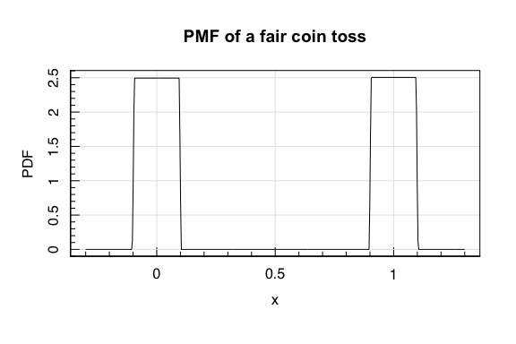

For non-discrete distributions, the probability of observing any
particular single value is always 0 (because there are an infinite
number of possible values in any finite interval). As such a probability
mass function is non-sensical for continuous data. Instead, the
probability distribution of continous data is defined as the relative
probability of finding a value *x* *over some finite range*. This is the
**probability density function** or PDF.

The formal definition of the PDF is therefore:

*P*(*a* ≤ *X* ≤ *b*) = ∫<sub>*a*</sub><sup>*b*</sup>*p*(*x*)*d**x*
In practice we use infinitesimally small intervals to define the PDF.

Some important properties of the PDF:

> -   The PDF is non-negative, because the *P*(*u*) &lt; 0 would require
>     ∫<sub>*u* − *ϵ*</sub><sup>*u* + *ϵ*</sup>*p*(*x*)*d**x* &lt; 0
>     , which is impossible.
> -   The PDF must integrate to 1, which we can see if we make the
>     interval \[*a*, *b*\] = \[ − ∞, ∞\]:

$$
\\begin{aligned}
P(-\\infty\\leq X \\leq \\infty) &= \\int\_{-\\infty}^{\\infty} p(x)\\mathrm{d}x \\\\
&= 1
\\end{aligned}
$$

For example the PDF of train delays at a fictitious railway company that
is totally fabricated and does not exist in Germany (or any other
country) is:
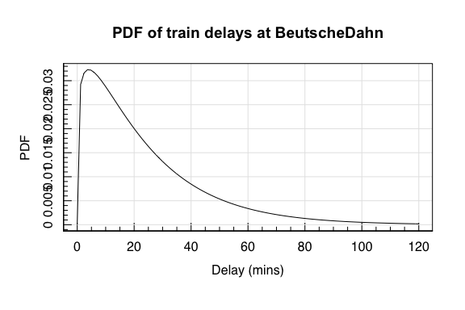
So while in reality the probability of having two delays that are
*exactly* the same is  ∼ 0, the probability of seeing a a delay within
some interval is a well defined function. For example, the probability
of seeing a train arrive with no delay is *P*(*X* = 0) = 0.

## Cumulative Distribution Function (CDF)

We’ve discussed the CDF somewhat at length previously. For our train
delays, the CDF is:
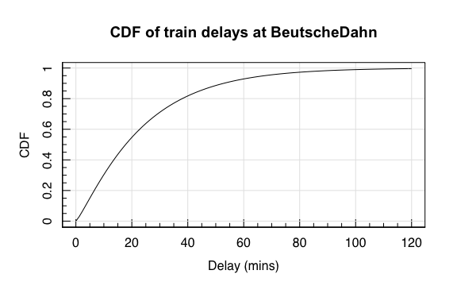
The CDF is extremely useful for measuring the fraction of probability
mass that is being below or equal to some value *X*. In the above case,
the probability that our train arrives with less than a 20 minute delay
is  ∼ 50%.

**Thanks BeutscheDahn! **

## The Quantile Function

Again, we’ve looked at this somewhat at length. For analytic
(invertable) functions, the quantile function is the inverse of the
cumulative distribution function.

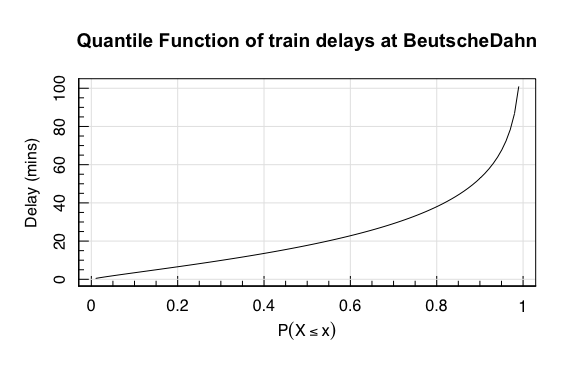
<!--}}}-->

# Expectation and Expected Values <!--{{{-->

In the first section of this course, we presented formulae for the mean,
standard deviation, variance, and covariance of a sample of
observations. These are *descriptive statistics*, in that they describe
a dataset.

We can use these same statistics to describe the properties of a
*probability distribution* from which we draw random variables. These
are **expectations**.

The **expectation value** of a discrete variable *X*, with sample space
*Ω*, and probability distribution *P* is defined as:
𝔼\[*X*\] = ∑<sub>*x* ∈ Ω</sub>*x**P*(*X* = *x*)

For continuous data, we simply reformulate this sum as an integral:
𝔼\[*X*\] = ∫<sub>*x* ∈ Ω</sub>*x**p*(*x*)*d**x*

Let’s take an example of a fair dice roll, and compute the expectation
value of each roll. Assume a fair six-sided die
(*p*<sub>*i*</sub> = 1/6  ∀  *i* ∈ \[1, 6\]).

$$
\\begin{aligned}
\\mathbb{E}\[X\]&=\\sum\_{x\\in\\mathcal{\\Omega}} xP(X=x) \\\\
&=1\\times \\frac{1}{6} + 2\\times \\frac{1}{6} + \\dots + 6\\times\\frac{1}{6} \\\\
&=\\frac{1}{6}(1+2+\\dots+6)\\\\
&=\\frac{1}{n}\\sum\_{i=1}^{n} x\_i \\\\
&=\\bar{x}
\\end{aligned}
$$

So the expectation value is just the arithmetic mean of the probability
distribution!

We can then also calculate other statistics, like the variance:

$$
\\begin{aligned}
\\textrm{var}\[X\]&=\\mathbb{E}\[(X-\\mathbb{E}\[X\])^2\]\\\\
&= \\mathbb{E}\\left\[ X^2 - 2X\\mathbb{E}\[X\] + (\\mathbb{E}\[X\])^2 \\right\]\\\\
&= \\mathbb{E}\\left\[ X^2 \\right\] - 2\\mathbb{E}\[X\]\\mathbb{E}\[X\] + (\\mathbb{E}\[X\])^2 \\\\
&= \\mathbb{E}\\left\[X^2\\right\]-(\\mathbb{E}\[X\])^2
\\end{aligned}
$$

Now:
$$
\\begin{aligned}
\\textrm{var}\[X\]&=\\mathbb{E}\\left\[X^2\\right\]-(\\mathbb{E}\[X\])^2 \\\\
&=\\frac{1}{n}\\sum\_{i=1}^{n} x^2\_i - \\left(\\frac{1}{n}\\sum\_{i=1}^{n} x\_i\\right)^2 
\\end{aligned}
$$

Or the covariance:

$$
\\begin{aligned}
\\textrm{cov}\[X,Y\]&=\\mathbb{E}\\left\[(X-\\mathbb{E}\[X\])(Y-\\mathbb{E}\[Y\])\\right\] \\\\
&= \\mathbb{E}\\left\[ XY + X\\mathbb{E}\[Y\] - \\mathbb{E}\[X\]Y + \\mathbb{E}\[X\]\\mathbb{E}\[Y\] \\right\]\\\\
&= \\mathbb{E}\\left\[ XY \\right\] - 2\\mathbb{E}\[X\]\\mathbb{E}\[Y\] + \\mathbb{E}\[X\]\\mathbb{E}\[Y\] \\\\
&= \\mathbb{E}\\left\[XY\\right\]-\\mathbb{E}\[X\]\\mathbb{E}\[Y\]
\\end{aligned}
$$

Recall once again that, if *X* and *Y* are independent,
𝔼\[*X**Y*\] = 𝔼\[*X*\]𝔼\[*Y*\], and so cov\[*X*, *Y*\] = 0.

These formulae can be used to compute the mean and variance of arbitrary
probability distributions. We will start looking at examples of these
now.

<!--}}}-->

# The Bernoulli Random Variable <!--{{{-->

We started our discussion of probability and statistics with a simple
experiment: a single toss of a coin. When we have an experiment whose
outcome is restricted to one of two outcomes (“success/failure”,
“yes/no”) the variable *X* is said to be a Bernoulli random variable.

The Bernoulli random variable is defined as taking the value 1 with a
probability *p*, and the value 0 with a probability 1 − *p*. Therefore
the PMF of a Bernoulli Random Variable is:
$$
\\begin{aligned}
X&\\sim \\textrm{Bern}(p) \\\\
P(X=x)&=
\\begin{cases}
1-p & \\textrm{if } x=0\\\\
p & \\textrm{if } x=1\\\\
\\end{cases}
\\end{aligned}
$$
The related cumulative distribution function is therefore:
$$
F(x)=
\\begin{cases}
0 & \\textrm{if } x&lt;0 \\\\
1-p & \\textrm{if } 0\\leq x&lt;1 \\\\
1 & \\textrm{if } x\\geq 1
\\end{cases}
$$

The Bernoulli Random Variable has the following useful properties:

> -   Expectation: 𝔼\[*X*\] = *p*

$$
\\begin{aligned}
\\mathbb{E}\[X\] &= \\sum\_{x\\in\\mathcal{\\Omega}} xP(X=x) \\\\
&=  0\\times(1-p) + 1\\times p \\\\
&= p
\\end{aligned}
$$

> -   Variance: var\[*X*\] = *p*(1 − *p*).

$$
\\begin{aligned}
\\textrm{var}\[X\] &= \\mathbb{E}\\left\[X^2\\right\]-(\\mathbb{E}\[X\])^2 \\\\
&= \\sum\_{x\\in\\mathcal{\\Omega}} \\left\[x^2P(X=x^2)\\right\] - \\left\[\\sum\_{x\\in\\mathcal{\\Omega}} xP(X=x)\\right\]^2  \\\\
&=  \\left\[0^2\\times(1-p) + 1^2\\times p\\right\] - p^2 \\\\
&= p-p^2 \\\\
&= p(1-p)
\\end{aligned}
$$

If *p* = 0 or *p* = 1, then the Bernoulli random variable follows the
**degenerate distribution**; a distribution with only one outcome (and
so no randomness is possible). The degenerate distribution can be
trivially seen from the above to have mean *p* and variance 0, which
makes sense!

<!--}}}-->

# The Geometric Distribution <!--{{{-->

We have a biased coin, that throws heads with a probability
*P*({*H*}) = *p*. We flip this coin *until* the first head appears. The
number of flips that we have to make is a discrete random variable that
takes integer values greater than or equal to 1.

Each toss of the coin has the probability *p* of being a head, and so
has a probability (1 − *p*) of being a tail. In order for us to observe
*n* tosses, we must have thrown (*n* − 1) tails in a row, and then a
head. Therefore the probability of seeing *n* tosses is:

*P*(*X* = *n*) = (1 − *p*)<sup>(*n* − 1)</sup>*p*.
This is the PMF of the **geometric distribution**. It is defined only
for positive integers *n* ≥ 1 and 0 ≤ *p* ≤ 1.

The geometric distribution describes probability of observing a number
of independent trials, which have some probability of success *p*, prior
to observing a success (at which point your experiment ends).

> -   Expectation: 𝔼\[*X*\] = *p*
> -   Variance: var\[*X*\] = *p*(1 − *p*).

<!--}}}-->

# The Binomial Distribution <!--{{{-->

A different statistic that may be of interest is how often you expect
your biased coin to throw heads given *n* tosses. In this case we’re
asking how many times *k* do I observe ‘success’ in *n* trials. The
probability of seeing *k* successes from *n* trials: *p*<sup>*k*</sup>.
Consequently the probability of seeing the *n* − *k* failues is:
(1 − *p*)<sup>*n* − *k*</sup>. Finally, there are:
$$
\\frac{n\\times (n-1)\\times(n-2)\\times\\dots\\times(n-k+1)}
{k\\times (k-1)\\times(k-2)\\times\\dots\\times1}
$$
  
ways of constructing *k* successes from *n* trials (when order of
appearance doesn’t matter). Therefore, the probability of observing *k*
successes from *n* trials with our coin is:

$$
\\begin{aligned}
k&\\sim \\textrm{Bin}(n,p) \\\\ 
P(k; n, p) &= \\frac{n!}{k!(n-k)!}\\,p^k(1-p)^{n-k},
\\end{aligned}
$$
This is the PMF of the **binomial function**.

The observant here will recognise the coefficient from last lecture.
This is called the *binomial coefficient*, which we presented as being
read as \`*n* choose *k*’:

$$
P(k; n, p) = {n\\choose k}p^k(1-p)^{n-k}.
$$

The binomial function has the properties:

> -   Expectation: $𝔼\[*X*\] = *N**p*
> -   Variance: var\[*X*\] = *N**p*(1 − *p*)

## The Multinomial Distribution <!--{{{-->

The natural extension of the binomial distribution is to allow for
multiple binomial outcomes, like in our urn model.

If we perform *N* independent realisations of an experiment with
*k* ∈ *Ω* outcomes, where the *i*<sup>th</sup> outcome has probability
*p*<sub>*i*</sub>: the probability of observing outcome 1
*n*<sub>1</sub> times, outcome 2 *n*<sub>2</sub> times, etc, follows the
multinomial distribution PMF:

$$
\\begin{aligned}
n\_1,n\_2,\\dots,n\_k &\\sim \\textrm{Multi}(N,p\_1,p\_2,\\dots,p\_k)\\\\
P(n\_1, n\_2, \\dots,n\_k; N, p\_1,p\_2,\\dots,p\_k) &= \\frac{N!}{n\_1!n\_2!\\dots n\_k!}\\,p\_1^{n\_1}p\_2^{n\_2}\\dots p\_k^{n\_k},
\\end{aligned}
$$
for non-negative integers
*n*<sub>1</sub>, *n*<sub>2</sub>, …, *n*<sub>*k*</sub> and where
$\\sum\_{i=1}^k n\_i = N$.

We can use the multinomial distribution, for example, so get the PMF of
our 2-dice roll that we studied in previous lectures:

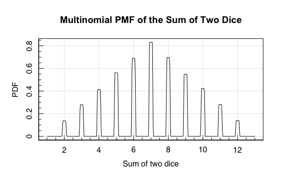

The multinomial distribution has the properties:

> -   Expectation: 𝔼\[*X*<sub>*i*</sub>\] = *N**p*<sub>*i*</sub>
> -   Variance:
>     var\[*X*<sub>*i*</sub>\] = *N**p*<sub>*i*</sub>(1 − *p*<sub>*i*</sub>)

<!--}}}-->
<!--}}}-->

# The Poisson Distribution <!--{{{-->

Consider an experiment where we want to know the number of occurrences
of an event within a fixed time window: say, the number of atomic decay
processes in a box per hour. Because we are interested in counts per
hour, the value of our outcomes are non-negative integers.

We can make two additional constraints:

> -   The decay processes happen with a fixed rate; and
> -   The time between decay processes is independent of the interval
>     between previous decays.

Given this experiment, the resulting observations will follow the
**Poisson distribution**, which has the PMF:
$$
\\begin{aligned}
k&\\sim \\textrm{Po}(\\lambda) \\\\
P(k; \\lambda) &= e^{-\\lambda}\\frac{\\lambda^k}{k!},
\\end{aligned}
$$
where *λ* is the so-called \`intensity’ parameter which governs the
shape of the distribution. We can calculate the expectation of the
Poisson distribution using our standard formula (but this is a bit more
involved than previously…):

$$
\\begin{aligned}
\\mathbb{E}\[X\] &= \\sum\_{x\\in\\mathcal{\\Omega}} xP(X=x) \\\\
&=  \\sum\_{x=1}^{\\infty} x\\frac{e^{-\\lambda}\\lambda^x}{x!} \\\\
&=  \\sum\_{x=1}^{\\infty} \\frac{e^{-\\lambda}\\lambda^x}{(x-1)!} \\\\
&=  \\lambda e^{-\\lambda}\\sum\_{x=1}^{\\infty} \\frac{\\lambda^{(x-1)}}{(x-1)!} \\\\
&=  \\lambda e^{-\\lambda}\\left(\\frac{\\lambda^0}{0!}+ \\frac{\\lambda^1}{1!} + \\dots \\right)\\\\
&=  \\lambda e^{-\\lambda}\\sum\_{x=0}^{\\infty} \\frac{\\lambda^x}{x!} \\\\
&=  \\lambda e^{-\\lambda}e^{\\lambda} \\\\
&=  \\lambda
\\end{aligned}
$$

So the *λ* parameter describes the **expectation** of the Poisson
distribution!

We can perform the same exercise to calculate the variance (you can try
this yourself), and we find that the **variance** of the Poisson
distribution is *also* *λ*.

The Poisson distribution has the property:

> -   𝔼\[*X*\] = var\[*X*\] = *λ*.

The PMF of a Poissonion random variable, for a range of values of *λ*
is:

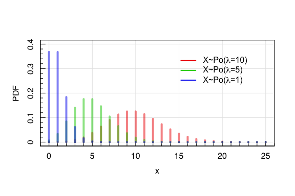

The Poisson distribution is very important in the natural sciences, as
signals that we measure are frequently actually integrated counts over a
period of time. In astronomy, for example, observed fluxes of galaxies
are determined by the number of photons received at the detector during
an observation. Therefore the minimal uncertainty is determined by the
Poisson distribution. This is particularly relevant in the high-energy
regime, because *γ*-ray photons are relatively rare. As such, flux
uncertainties at these short-wavelengths are generally Poisson-noise
dominated.

One further important point about the Poisson distribution we can
determine using some intuition.

Consider a Poisson variable. The expected number of occurances of an
event in some period *t* is *λ*. How many events would you intuitively
expect to observe in a period 2*t*?

-   2*λ* is the sensible result, given both intuition and what we know
    about the expectation value.

But the poisson variable need not be constrained to *temporal* events; I
can just as easily construct a poisson random variable that determines
the number of events observed in a spatial interval *x*. Take, e.g., the
number of insects per unit area in a field. If the insect movements are
random and independent, then the number of insects per unit area ought
to be a random poisson variable.

But this means that in twice the area we ought to find twice the number
of insects. Putting this into more rigorous mathematical context: In
some multi-dimensional domain 𝒟, the number of spatially random
observations within a subset *s* of 𝒟 is a Poisson random variable with
intensity *m*(*s*)*λ*, where *m*(*s*) is the area/volume of *s*.

Models such as these are useful in Physics and Astronomy because they
capture the properties that:

> -   the within the domain are randomly distributed; and
> -   the probability that you find a point doesn’t depend on where you
>     are in the domain.

<!--}}}-->

# Continuous Distributions

Until now we have looked exclusively at discrete distributions. We will
now shift focus to continuous distributions.

# The Uniform Distribution <!--{{{-->

The first continuous distribution that we will examine is the most
simple. The **uniform distribution** is characterised by a lower bound
*a* and upper bound *b* (where *a* &lt; *b*), with constant probability
density in between:

$$
\\begin{aligned}
X&\\sim U(a,b) \\\\
p(X=x)&=
\\begin{cases}
0 & \\textrm{if } x&lt;a \\\\
\\frac{1}{b-a} & \\textrm{if } a\\leq x\\leq b \\\\
0 & \\textrm{if } x&gt;b
\\end{cases}
\\end{aligned}
$$

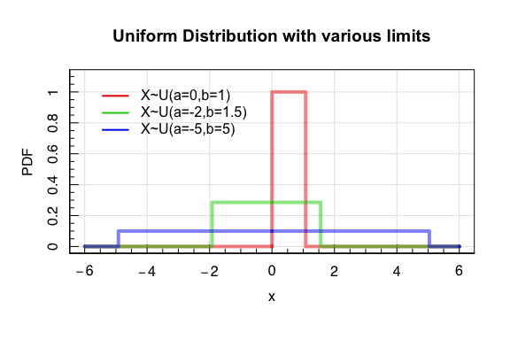

The Uniform distribution has properties:

> -   Expectation $\\mathbb{E}\[X\]=\\frac{a+b}{2}$
> -   Variance $\\textrm{var}\[X\]=\\frac{(b-a)^2}{12}$

The uniform distribution is useful when considering random events over a
fixed interval. For example: Consider the scenario where the tram to RUB
arrives at Bochum Hauptbahnhof every 5 minutes during peak travel times.
If people arrive at the station randomly and without knowing the
schedule, how long can they expect to wait for a tram?

The waiting times in this scenario is a random uniform variable:

$$
\\begin{aligned}
X&\\sim U(0,5) \\\\
p(X=x)&=
\\begin{cases}
\\frac{1}{5} & \\textrm{if } 0\\leq x\\leq 5 \\\\
0 & \\textrm{otherwise}
\\end{cases}
\\end{aligned}
$$
The expectation of this distribution is $\\mathbb{E}\[X\]=\\frac{5}{2}$,
so the expected waiting time is 2.5 minutes. Similarly, we can compute
the probability of waiting less than 1 minute using the cumulative
probability distribution (which for the uniform distribution is
trivial):

$$
P(X&lt;x)=
\\begin{cases}
0 & \\textrm{if } x&lt;a \\\\
\\frac{x-a}{b-a} & \\textrm{if } a\\leq x\\leq b \\\\
1 & \\textrm{if } x&gt;b
\\end{cases}
$$
So for our train waiting times:
$$
P(X&lt;x)=
\\begin{cases}
0 & \\textrm{if } x&lt;a \\\\
\\frac{x}{5} & \\textrm{if } 0\\leq x\\leq 5 \\\\
1 & \\textrm{if } x&gt;5
\\end{cases}
$$
which means that there is a 20% chance of waiting less than 1 minute.

<!--}}}-->

# The Beta Distribution <!--{{{-->

The second continuous distribution that we’re going to look at is the
**beta distribution**. The beta distribution is not one that you are
likely familiar with, but it is useful for two reasons:

> -   It is an extremely flexible function that is defined over a finite
>     range; and
> -   It is widely used in congugate analyses (which we will explore in
>     the next section of the course).

The Beta distribution is defined as:
$$
\\begin{aligned}
X&\\sim\\textrm{Be}(a,b)\\\\
p(X=x;a,b)&=\\frac{\\Gamma(a) \\Gamma(b)}{\\Gamma(a+b)}x^{a-1}(1-x)^{b-1},
\\end{aligned}
$$
where *Γ* is the Gamma function, defined as:
*Γ*(*n*) = (*n* − 1)!
for integer values *n*, and:
*Γ*(*z*) = ∫<sub>0</sub><sup>∞</sup>*x*<sup>*z* − 1</sup>*e*<sup> − *x*</sup>*d**x*
for any complex number with a positive real component ℛ(*z*) &gt; 0.

The variability of the Beta distribution as a function of shape
parameters *a* and *b* are shown below:

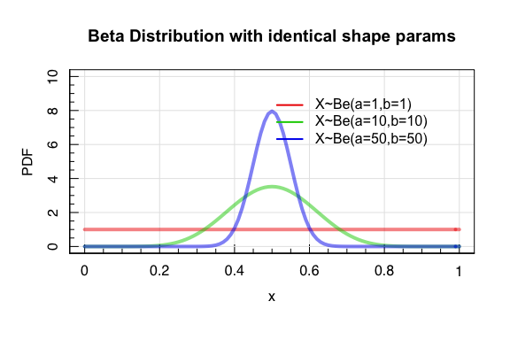
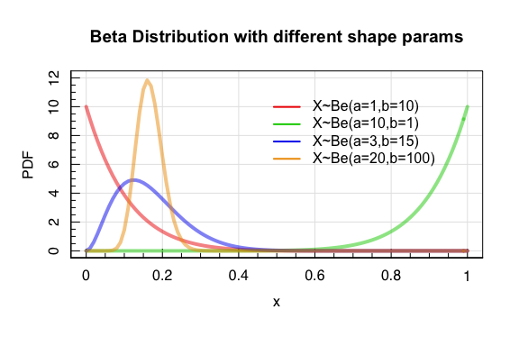

The Beta distribution has the properties:

> -   Expectation $\\mathbb{E}\[X\]=\\frac{a}{a+b}$
> -   Variance $\\textrm{var}\[X\]=\\frac{ab}{(a+b)^2(a+b+1)}$

<!--}}}-->

# The Gamma Distribution <!--{{{-->

Similar to the Beta distribution, the **gamma distribution** will become
relevant later in the course due to its use in conjugate analyses. The
gamma distribution is defined by two parameters, the shape parameter *a*
and the scale parameter *s*. The gamma distribution PDF is defined as:
$$
\\begin{aligned}
X&\\sim \\textrm{Ga}(a,s) \\\\
p(X=x; a, s) &= \\frac{s^a x^{a -1}e^{-\\beta x}}{\\Gamma(\\alpha)}. 
\\end{aligned}
$$
As with the Beta distribution, the Gamma distribution is extremely
flexible. In fact, the Gamma distribution encompasses (as special cases
with particular parameter combinations) many interesting distributions
that you will likely already be familiar with, such as the exponential
distribution and the *χ*<sup>2</sup>-distribution (the latter of which
we will discuss in a few slides time!).

The variability of the Gamma distribution as a function of shape
parameter *a* and scale parameter *s* are shown below:

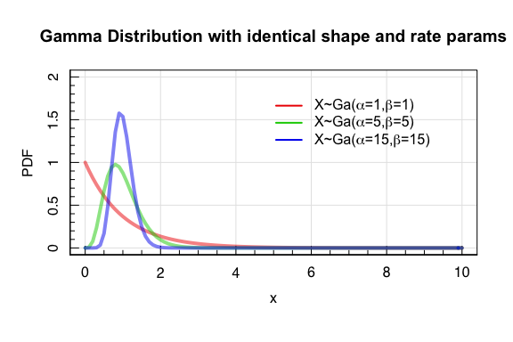


The Gamma Distribution has properties:

> -   Expectation $\\mathbb{E}\[X\]=\\frac{a}{s}$
> -   Variance $\\textrm{var}\[X\]=\\frac{a}{s^2}$

<!--}}}-->

# The Gaussian Distribution <!--{{{-->

Everyone in this course is undoubtably familiar with the **Gaussian
Distribution**, and it is one of the most important distributions in
statistics.

A random variable *X* which follows a Gaussian distribution with mean
*μ* and variance *σ*<sup>2</sup> has the PDF:
$$
\\begin{aligned}
X&\\sim N(\\mu,\\sigma^2) \\\\
p(X=x; \\mu,\\sigma^2) &= \\frac{1}{\\sqrt{2 \\pi \\sigma^2}}e^{-\\frac{(x - \\mu)^2}{2 \\sigma^2}},
\\end{aligned}
$$

The cumulative distribution function of the Gaussian distribution is
widely used because of the frequency with which variables are modelled
as being Gaussian. The CDF is defined as:
*Φ*(*X* = *x*) = ∫<sub> − ∞</sub><sup>*x*</sup>*p*(*t*)*d**t*
There is no analytic formulae for the CDF of the
*N*(*μ*, *σ*<sup>2</sup>) gaussian, and so the values are computed using
numerical and computational methods.

A useful special case of the Gaussian distribution is the so-called
“standard” Gaussian: *X* ∼ *N*(0, 1):
$$
\\begin{aligned}
X&\\sim N(0,1) \\\\
p(X=x) &= \\frac{1}{\\sqrt{2 \\pi}}e^{-\\frac{x^2}{2}},
\\end{aligned}
$$

It is possible to transform any gaussian variable into a standard
gaussian variable using the so-called *Z*-transformation:
$$
\\begin{aligned}
X&\\sim N(\\mu,\\sigma^2) \\\\
Z&=\\frac{X-\\mu}{\\sigma} \\\\ 
\\therefore Z&\\sim N(0,1)
\\end{aligned}
$$

This is useful for many reasons, particularly in modelling and
understanding biases, but here we will use the transformation to derive
some useful properties of the gaussian distribution:

$$
\\begin{aligned}
P(X\\leq b) &= P\\left(\\frac{X-\\mu}{\\sigma} \\leq \\frac{b-\\mu}{\\sigma}\\right)  \\\\
&= P\\left(Z \\leq \\frac{b-\\mu}{\\sigma}\\right) \\\\
&= \\Phi(\\frac{b-\\mu}{\\sigma}).
\\end{aligned}
$$

> -   The probability of a Gaussian random variable being less than some
>     value *b*, for an arbitrary mean and variance, is equal to the
>     probability mass below the equivalent Z-score in the standard
>     gaussian.

By symmetry and integral constraints we can equally demonstrate that:

$$
\\begin{aligned}
P(X &gt; a) &= 1 - \\Phi(\\frac{a-\\mu}{\\sigma}); \\\\
P(a \\leq X \\leq b) &= \\Phi(\\frac{b-\\mu}{\\sigma}) - \\Phi(\\frac{a-\\mu}{\\sigma}); \\\\
\\Phi(-a) &= 1-\\Phi(a); \\\\
P(-a &lt; Z &lt; a) &= 2\\Phi(a)-1. 
\\end{aligned}
$$

The Gaussian Distribution has properties:

> -   Expectation 𝔼\[*X*\] = *μ*
> -   Variance var\[*X*\] = *σ*

<!--}}}-->

## The Multivariate Gaussian Distribution <!--{{{-->

One can extend the Gaussian Distribution to multiple dimensions, forming
the **multivariate gaussian distribution**. The multivariate Gaussian
distribution is characterised by a vector of means *μ* and a
**covariance matrix** *Σ*:
*X* ∼ *N*<sub>*k*</sub>(*μ*, *Σ*),

The primary difference between the description of the univariate and
multivariate Gaussian distributions is therefore that the multivariate
gaussian requires the specification of the covariance matrix, which we
discussed in previous lectures:
$$
\\Sigma = 
\\begin{pmatrix}
{\\rm var}(X\_1)  & {\\rm cov}(X\_1,X\_2) & \\dots & {\\rm cov}(X\_1,X\_n) \\\\
{\\rm cov}(X\_2,X\_1)  & {\\rm var}(X\_2) & \\dots & {\\rm cov}(X\_2,X\_n) \\\\
\\vdots & \\vdots & \\ddots & \\vdots \\\\
{\\rm cov}(X\_n,X\_1)  & {\\rm cov}(X\_n,X\_2) & \\dots & {\\rm var}(X\_n)
\\end{pmatrix}
$$
The covariance matrix encodes the degree of mutual variance between the
different gaussian components. In cases with zero covariance:

$$
\\begin{aligned}
X&\\sim N\_2(\\mu,\\Sigma)\\\\
\\mu&=\\{-2,3\\} \\\\
\\Sigma &= 
\\begin{pmatrix}
4  & 0 \\\\
0  & 1 \\\\
\\end{pmatrix}
\\end{aligned}
$$

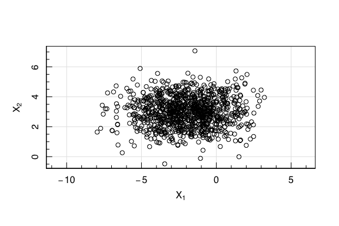

Or the case of significant covariance:
$$
\\begin{aligned}
X&\\sim N\_2(\\mu,\\Sigma)\\\\
\\mu&=\\{-2,3\\} \\\\
\\Sigma &= 
\\begin{pmatrix}
4  & 2 \\\\
2  & 1 \\\\
\\end{pmatrix}
\\end{aligned}
$$

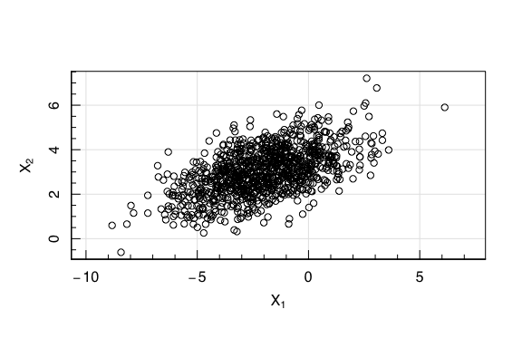

<!--}}}-->

# What’s with all the Gaussians?! <!--{{{-->

In the natural sciences, we see the Gaussian distribution *a lot*. We
typically formulate our uncertainties as Gaussian, we model physical
processes as Gaussian, and we quote significances in terms of Gaussians.
**Why do we do this??**

## Central Limit Theorem (CLT) <!--{{{-->

In a simplified manner, the central limit theorem states that, for an
arbitrary distribution with mean *μ* and variance *σ*<sup>2</sup>, we
can draw *n* observations at random and calculate their mean
*M*<sub>*n*</sub>. The distribution
$$
\\left\[\\frac{M\_n-\\mu}{\\sigma/\\sqrt{n}}\\right\]\\rightarrow N(0,1)
$$
as *n* → ∞.

This is a pretty remarkable statement. It means that (in certain
conditions that I don’t raise here, but just know that they are met in
*many* circumstances), averaging over random variables will produce a
Gaussian distribution of results *regardless of the shape of the
distribution the samples are drawn from*!

Let’s do an experiment. In our experiment, we observe a random variable
that follows a Gamma distribution:
*X* ∼ *G**a*(1, 2)
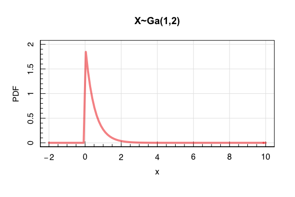

It should go without saying: the gamma distribution we have picked
doesn’t look very gaussian. But what happens if we are interested in the
properties of sub-samples of our population, say, the mean of sets of 2
observations? Or 4? Or 16?

The expectation of this distribution is
$\\mathbb{E}\[X\]=\\frac{a}{s}=0.5$ (from earlier). If we take our
observations and compute the expectation of discrete subsets of the
observations we find the below:

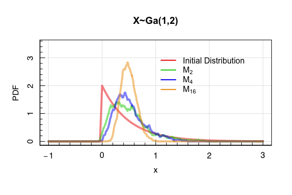

To demonstrate just *how good* the approximation is, we can standardise
the distributions and overplot a *N*(0, 1) gaussian:

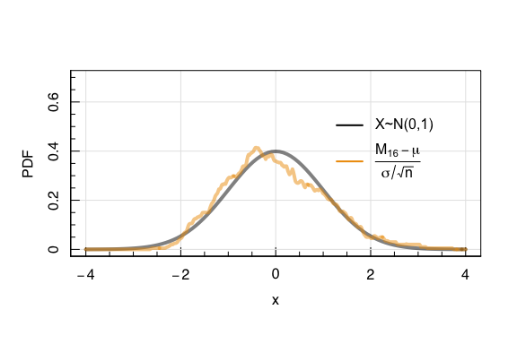

This result has profound implications for the experimental sciences. It
is the reason why we model complex systems as Gaussian distributions. It
gives rise to Gaussian distributions in systems where repeat random
events are the norm (e.g. repeated scattering of particles drives their
energy to the expectation), causes us to model our uncertainties as
gaussians (because final observed quantities are the cumulative result
of many underlying processes), and leads us to compare models by quoting
“sigma” differences.

Finally, one last comment about the CLT. The tails of the gaussian
distribution are remarkable tight: we expect more than 95% of gaussian
observations to reside within 2 standard deviations of the mean. However
in the CLT, the convergence happens most rapidly in the *centre* of the
distribution. This means that, in the limit of small numbers of
observations, we expect the CLT converge on the Gaussian distribution
fastest at the centre of the distribution, and slowest in the wings.

> -   As a result, gaussian modelling distributions of objects which
>     only enact few averagings will tend to ignore the presence of the
>     outlier that are expected, leading to problems. **Always pay
>     attention to the tails of your distributions**.

<!--}}}-->
<!--}}}-->

# The Student t-Distribution <!--{{{-->

Given our observation about the wings of the convergence to a gaussian
in the CLT, we are motivated to explore different distributions that
account for this behaviour.

We can define a new statistic *t* which is our mean statistic from
before:
$$
t = \\frac{\\bar{x}-\\mu}{s/\\sqrt{N}},
$$

Given the *t* variable, we can compute the **student t-distribution**:
$$
p(t; N) =   \\frac{\\Gamma(\\frac{1}{2} N)}{\\sqrt{\\pi (N-1)} \\Gamma\\left\[\\frac{1}{2} (N-1)\\right\]}\\left(1+\\frac{t^2}{N-1}\\right)^{-N/2}
$$
Frequently, though, we will see this distribution parameterised in terms
of the ‘degrees of freedom’ *ν* = (*N* − 1).

Nonetheless, this still looks complicated, but the limits are the most
relevant for understanding. When *N* is large, the student
*t*-distribution converges to the gaussian distribution, as we wanted.
However, for small *N*, the distribution converges to the Lorentzian (or
Cauchy) distribution, which contains the strong wings that we expect.

We can demonstrate the above limiting behaviour easiest when computing
the t-statistic for initially gaussian observations (rather than our
one-sided Gamma distribution from last slide). We perform exactly the
same game, though. We average *n* observations from an initially
Gaussian distribution, and plot the distribution of our *t* statistic
above (with their centroids shifted for clarity):
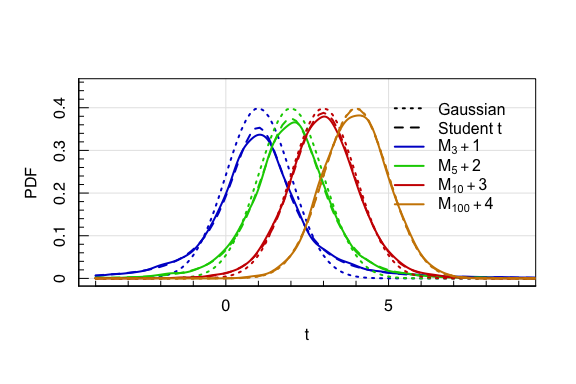

The Student t-Distribution has properties:

> -   Expectation $\\mathbb{E}\[X\]=\\frac{a}{s}$
> -   Variance $\\textrm{var}\[X\]=\\frac{a}{s^2}$

<!--}}}-->

# The *χ*<sup>2</sup> Distribution <!--{{{-->

Again related to the CLT is the ***χ*<sup>2</sup> distribution**. The
*χ*<sup>2</sup> distribution is that which we find when summing random
*squared deviations* from a Normal distribution. The **χ*<sup>2</sup>
distribution* is extremely common in the experimental sciences, as it is
the classic metric that is used in the quantification of
*goodness-of-fit* of a model to data. In this application it is
frequently referred to as the Pearson *χ*<sup>2</sup> statistic.

The *χ*<sup>2</sup> statistic is defined as:
$$
\\chi^2 \\equiv C = \\sum\\limits\_{i=1}^N \\frac{(x\_i - \\mu)^2}{\\sigma^2}.
$$
For the *χ*<sup>2</sup> distribution the degrees of freedom is given by
*ν* = *N*. The *χ*<sup>2</sup> distribution is then defined as:

$$
p(C; \\nu) = \\frac{1}{2^{\\nu/2} \\Gamma(\\nu/2)} C^{\\nu/2-1} e^{-C/2}
$$

Use of the *χ*<sup>2</sup> statistic in quantifying goodness-of-fit is
frequently summarised in the literature as *reduced *χ*<sup>2</sup>*,
generally formulated as $\\chi^2\_{\\rm r}=\\chi^2/\\nu\_{}$. The choice
of this statistic is that the expectation of the *χ*<sup>2</sup>
variable is *ν*: 𝔼\[*χ*<sup>2</sup>/*ν*\] = 1. However, model fits in
the literature generally perform maximum likelihood optimisation, which
aims to find the *mode* of the PDF, rather than to produce samples that
report the mean/expectation. Looking at the *χ*<sup>2</sup>
distribution, it’s clear that the distribution is asymmetric, and so
these results will converge on different answers:
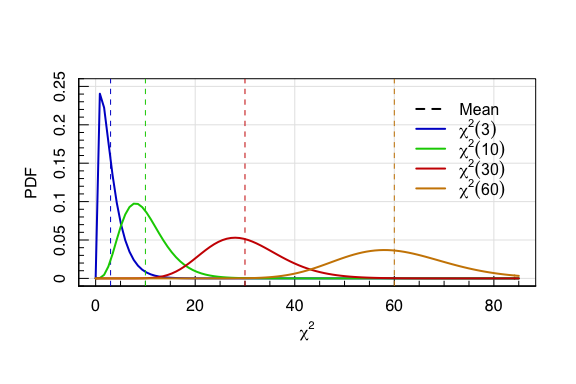

The **mode** of the distribution is actualy at *ν* − 2. Therefore, the
appropriate formulation of the reduced *χ*<sup>2</sup> is for maximum
likelihood fits is:
$$
\\chi^2\_{\\rm r}=\\frac{\\chi^2}{\\nu-2}\_{}
$$

The *χ*<sup>2</sup> Distribution has properties:

> -   Expectation 𝔼\[*X*\] = *ν*
> -   Variance var\[*X*\] = 2*ν*

<!--}}}-->

# Wealth and equality <!--{{{-->

Consider 1, 000 people who each have $1, 000. We take two of these
people at random, and give a fixed fraction of their total worth to the
other (think of this a transaction of some kind). We then repeat this
process 100, 000 times.

What will the final distribution of wealth look like?

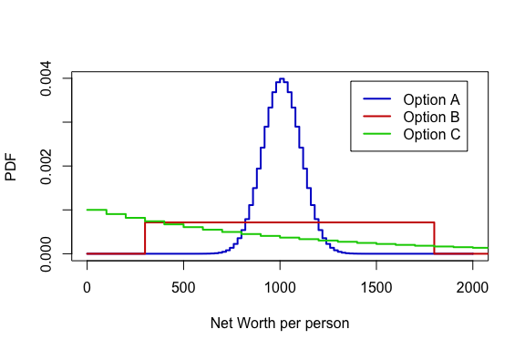

<!--}}}-->

# Can you get away with tax fraud? <!--{{{-->

For totally legitimate, not-illegal reasons: you need to fabricate a
series of transactions to “pad out” a table of real transactions, such
that your fabricated numbers are indistinguishable from “real”
transactions. The transaction values range from large (many thousands of
dollars) to small (a few cents).

What distribution would the values of the first significant digit of the
numbers take? e.g. if the numbers are all written in scientific
notation:
$$
\\begin{aligned}
1.3&\\times10^{1}\\\\
7.6&\\times10^{-2}\\\\
5.1&\\times10^{2}\\\\
 &\\vdots \\\\
9.0&\\times10^{-1}\\\\
2.3&\\times10^{3}\\\\
\\end{aligned}
$$
What will the histogram of the numbers in front of the “.” look like?

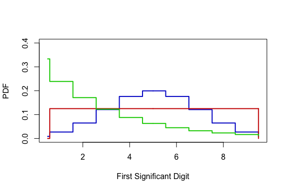
<!--}}}-->

# The Pareto Distribution <!--{{{-->

The last distribution that we explore in this section is the Pareto
distribution, which is a probability function that follows a truncated
power-law. The Pareto probability distribution is defined as:
$$
p(x) = 
\\begin{cases} 
\\frac{\\alpha x^\\alpha\_m}{x^{\\alpha+1}} & x\\ge x\_m \\\\
0 & x&lt;x\_m
\\end{cases}
$$
for *x*<sub>*m*</sub> &gt; 0.

The Pareto distribution is named for Vilfredo Pareto, who first used the
probability distribution to demonstrate wealth disparity. We can repeat
this demonstration quite simply.

Consider 1, 000 people who each have $1, 000. We take two of these
people at random, and give a fixed fraction of their total worth to the
other (think of this a transaction of some kind). We then repeat this
process 100, 000 times.

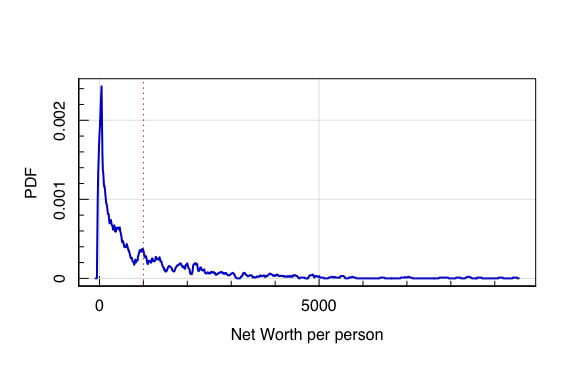

Power-law functions are reasonably common in natural sciences, as many
natural processes tend toward the power law. The represent relationships
between parameters where a relative change in one quantity produces a
proportional relative change in another quantity, regardless of the
magnitude of the various parameters. Notable astronomical examples
include Keplers third law, and the stellar initial mass function.
Notable physical examples include the Stefan-Boltzman law and all
inverse-square laws (electrostatics, gravitation, etc).

One interesting demonstration of the power law is in Benfords Law. This
is not directly related to physics or astronomy (unless you are doing
something *very* questionable with your grant applications…).

Benfords Law, also called the first-digit law, states that the leading
digit of listings of numbers that span multiple decades (i.e. many
orders of magnitude) will tend to be preferentially valued 1; and the
probability of finding larger values is inversely proportional to the
digits value:
$$
P(D)=\\log\_{10}\\left(1+\\frac{1}{D}\\right).
$$

``` r
x<-10^runif(1e4,-3,3)
y<-gsub('0','',gsub(fixed=T,'.','',as.character(x)))
y<-helpRfuncs::vecsplit(y,"",1)
maghist(as.numeric(y),breaks=1:10-0.5,verbose=F,col='blue3',freq=F,
xlab='Leading digit',ylab='PDF')
lines(col='red',lty=2,1:9,log10(1+1/(1:9)),lwd=2)
legend('topright',inset=0.1,legend=c('1000 values in 10^[-3,3]','Benfords Law'),
       pch=c(15,NA),lty=c(NA,2),col=c('blue3','red'))
```

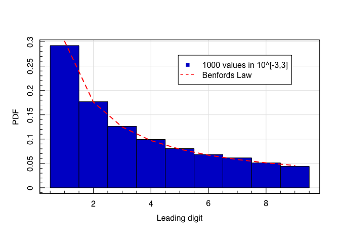

The Pareto Distribution has properties:

> -   Expectation

$$\\mathbb{E}\[X\]=
\\begin{cases}
\\infty & \\alpha \\leq 1 \\\\
\\frac{\\alpha x\_m}{\\alpha-1} & \\alpha &gt; 1 \\\\
\\end{cases}
$$

> -   Variance

$$
\\textrm{var}\[X\]=
\\begin{cases}
\\infty & \\alpha \\in (1,2\] \\\\
\\left(\\frac{x\_m}{\\alpha-1}\\right)^2 \\frac{\\alpha}{\\alpha-2} & \\alpha &gt; 2 \\\\
\\end{cases}
$$

<!--}}}--->
