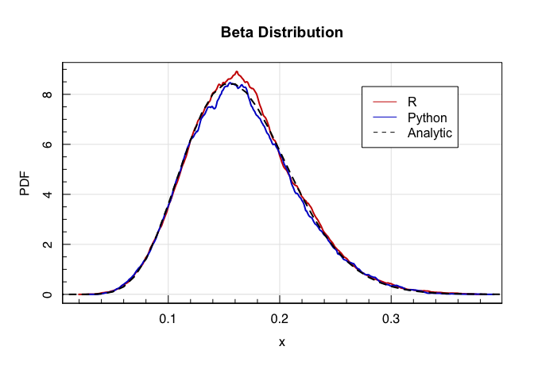
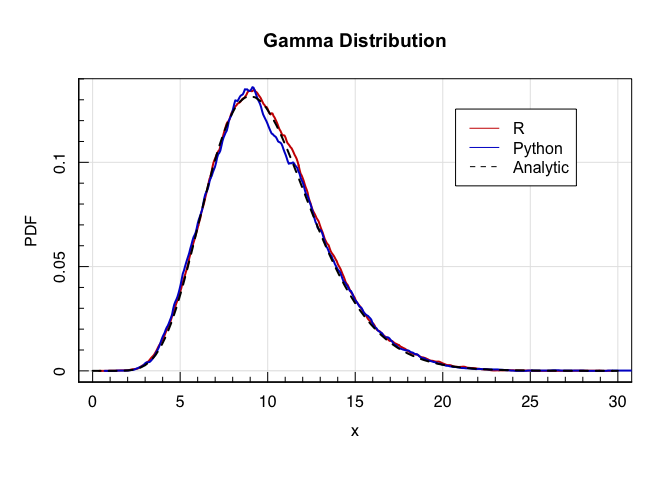

Introduction to Statistics for Astronomers and Physicists
================
Dr Angus H Wright
2022-02-09


# Section 2: Introduction <!--{{{-->

<!--Setup {{{-->
<style type="text/css">
.python { 
  background-color: 
    RColorBrewer::brewer.pal(1,"Set2");
} 
.out { 
  max-height: 300px;
  overflow-y: auto;
  background-color: inherit;
}
</style>
<!--}}}-->

**Section 2: Probability & Decision Making (Weeks 3-5)**

For all aspects of modern science, an understanding of probability is
required. We cover a range of topics in probability, from decision
theory and the fundamentals of probability theory, to standard
probabilistic distributions and their origin. From this module, students
will gain an insight into different statistical distributions that
govern modern observational sciences, the interpretation of these
distributions, and how one accurately models distributions of data in an
unbiased manner.

Topics include:

> -   Decision theory
> -   Fundamentals of probability
> -   Statistical distributions and their origins

<!--}}}-->

# Generating Data <!--{{{-->

If we want to generate a synthetic dataset, we first need to decide upon
the properties of the dataset that we wish to create.

Let’s say we want to create a distribution of data that represents
tosses of a fair coin. What properties should that distribution have?
What properties should the *individual observations* have?

<!--}}}-->

# Sampling and Simulation <!--{{{-->

In the empirical sciences we are frequently interested in generating
samples from various distributions, be this for Monte Carlo simulations
or parameter estimation and model exploration (more on this later).

Whatever the application, the role of sampling and simulation is to
generate various which have the statistical properties of some specified
model or target distribution. This naturally leads to two questions:

-   How can this be done?
-   How can this be done *efficiently*?

To some extent, we only really care about the former case. However
efficiency can often lead to insight about a statistical model itself,
in addition to saving on time and/or CPU resources.

<!--}}}-->

# Generating Data <!--{{{-->

If we want to generate a synthetic dataset, we first need to decide upon
the properties of the dataset that we wish to create.

Let’s say we want to create a distribution of data that represents
tosses of a fair coin. What properties should that distribution have?
What properties should the *individual observations* have?

-   Bimodal with only two possible values (i.e. Binomial)
-   Equal chance of both outcomes
-   Independence of the observations

<!--}}}-->

# Random Numbers <!--{{{-->

Truly random numbers follow no predictable sequence and have no
periodicity. Generally speaking, true randoms numbers can only be
generated from truly random processes, which we can observe and use as a
means of generating random numbers.

Examples of truly random processes include thermal noise and quantum
mechanical processes.

There exist modern tools to produce truly random numbers, should they be
required for simulation or other purposes. An example is the **R**
`qrandom` package, which generates truly random numbers by querying an
experiment that continuously monitors the quantum fluctuations of a
vacuum chamber at the Australian National University. [See their website
here.](https://qrng.anu.edu.au/)

> The vacuum is described very differently in the quantum physics and
> classical physics. In classical physics, a vacuum is considered as a
> space that is empty of matter or photons. Quantum physics however says
> that that same space resembles a sea of virtual particles appearing
> and disappearing all the time. This is because the vacuum still
> possesses a zero-point energy. Consequently, the electromagnetic field
> of the vacuum exhibits random fluctuations in phase and amplitude at
> all frequencies. By carefully measuring these fluctuations, we are
> able to generate ultra-high bandwidth random numbers.

We can query their experiment and produce a sequence of truly random
numbers using the `qrandom` function:

``` r
#True random numbers in R
library(qrandom) 
qrandom(5)
```

``` out
## [1]  32 188   1 189  18
```

However, requiring an internet link to Australia for your project may
seem like overkill, and querying such an experiment takes time. So in
practice, we will essentially always settle for using a sequence of
numbers that looks very much like random numbers, but which are not.

<!--}}}-->

# Pseudo-random numbers <!--{{{-->

Computers are (currently) deterministic machines. That is, they will
always produce the same output from the same input. This means that they
are inherently incapable of generating ‘truly’ random numbers.

However, given the importance that random numbers play in scientific
computing and the natural sciences, sophisticated algorithms have been
developed that allow deterministic machines to generate finite
*sequences* of numbers that appear, for all mathematical intents and
purposes, to be truly random. These are called **pseudo-random
numbers**.

Pseudo-random numbers are statistically random over a finite sequence,
but are nonetheless *deterministic*. That means that they will always
follow the same sequence given the same starting point. We can show this
in practice by performing random draws after resetting the starting
point, called the **random seed**:

``` r
#Pseudo-random numbers in R
#Set the seed value to be 666
set.seed(666)
#Generate 5 random numbers on [1,256]
runif(5,min=1,max=256)
```

``` out
## [1] 198.46397  51.29217 250.39353  52.33847  93.11733
```

``` r
#Generate another 5 random numbers on [1,256]
runif(5,min=1,max=256)
```

``` out
## [1] 190.366045 250.575752 128.018996   4.395538  67.286263
```

``` r
#But if we reset the seed...
set.seed(666)
#and generate 5 random numbers on [1,256] again
#we get the same numbers that we started with
runif(5,min=1,max=256)
```

``` out
## [1] 198.46397  51.29217 250.39353  52.33847  93.11733
```

Algorithms which generate pseudo-random numbers are frequently complex,
but nonetheless we can demonstrate their basis simply using one of the
earliest pseudo-random number generators: the **linear-congruential
generator**.

Suppose we wish to generate a sequence of pseudo-random numbers with a
dynamic range of 2<sup>16</sup> (i.e. the 16-bit integers). The linear
congruential method proceeds as follows:

*m*, *a*, and *b* are integers, and *x*<sub>0</sub> is the starting
(‘seed’) value with the requirement that
0 ≤ *x*<sub>0</sub> ≤ *m* − 1
. We can define a sequence of pseudo-random numbers using the recursion
relation:

*x*<sub>*k* + 1</sub> = (*a**x*<sub>*k*</sub> + *b*) mod  *m*
where *x* mod  *y* refers to the modulus of *x* and *y*. This generates
a sequence where 0 ≤ *x*<sub>*k*</sub> ≤ *m* − 1.

We can code this up trivially, of course, but must be careful about the
choice of *a*, *b*, and *m*. For example, naively picking two random
integers for *a* and *b* (let’s say 7 and 59), choosing 2<sup>16</sup>
for our *m*, and a seed value of *x*<sub>0</sub> = 666 produces the
below distribution of ‘random’ numbers:


As you can see, many of these choices lead to catastrophic failures of
the generator. Others lead to random numbers with considerable
periodicity (which leads to spikes in returned histogram).

However, choosing the *a* and *b* factors wisely can lead to very
reasonable behaviour. We can choose two prime numbers, and find
something that seems to work reasonably well:


In practice, both **R** and **python** have much more complex random
number generators available (within **base R** and **numpy**
respectively).

The pseudo-random number generator that is the default in **R**, for
example, is the so-called “Mersenne-Twister” generator. If we compare
this to our estimates from the LC method (with primes), we get the below
(for 10<sup>4</sup> random uniform numbers on \[0, 255\]):

The two methods look quite comparable in this histogram; in fact, one
might be inclined to say that the LC random numbers are better, because
the distribution is flatter… but is that the case? Do true random
numbers have structure?

We can check! Here’s how the MT algorithm compares to the *true* random
numbers that we get from the ANU quantum vacuum experiment:


So the MT algorithm seems to be doing a sensible job here in terms of
the amount of structure in the random numbers.

Something that is more important, but which you can’t see from these
histograms, is how the behaviour of the two algorithms in terms of their
**period** is very different. The LC generator that we’ve constructed
has a maximum period of *m* *if and only if* the parameters *a* and *b*
are chosen to satisfy some specific requirements. The Mersenne-Twister
algorithm, however, has a period of 2<sup>19937</sup> − 1; functionally
infinite for the essentially all applications.

<!--}}}-->

# Random Variables <!--{{{-->

The primary use of random numbers in statistics is in the generation of
random variables.

Throughout this course already we have frequently created datasets that
follow one or many of the statistical distributions from the last
chapter. Generally this has been with the goal of demonstrating some
statistical property, such as the behaviour of the distributions
themselves, or some statistical property.

For this purpose, we generally want to construct realisations of a
variable as if it were drawn from a truly random process that has the
underlying PDF that we are interested in.

## Independent and Identically Distributed

Realisations of data which are random (which by definition makes them
independent) and which follow the PDF of a given target distribution are
said to be **independent and identically distributed** (i.i.d.)
observations. This is a term that we will see *frequently* over the
remained of the course, particularly whenever we discuss **simulation**
of data from a particular distribution.

However there are also other reasons that one may want to generate
random realisations of data, beyond just wanting to have ‘fake data’.
Random variables can be a useful tool for discovering insight about
distributions and statistics. An example is **Monte Carlo integration**,
which uses distributions of random variables to derive an empirical
estimate of an integral. We’ll discuss this in a few slides time.

<!--}}}-->

# What is simulation?

Simulation is an attempt to generate a deterministic sequence of numbers
that cannot be distinguished from true random variables by any
appropriate statistical test.

Put simply: it is the method of generating i.i.d. observations from some
target distribution.

There are many ways to generate i.i.d. observations *provided* that we
have access to random (or pseudo-random) numbers. For almost all
standard distributions, in fact, tools to perform these random draws are
standard in both **R** and **python**. For such distributions we don’t
need to try anything clever, we can just use what we’ve been provided
directly.

<!--}}}-->

# Direct Sampling

For standard/analytic distributions, there are frequently tools
available for **direct sampling**. These are available in both **R** and
**python**. Indeed, we have used these *extensively* over the course of
this lecture series already.

Below we demonstrate a (far from complete) series of examples for random
sampling functions in **R** and **python**.

## Binomial Distribution

<!--Joint Codeblock-{{{-->
<table style="width: 90%">
<colgroup>
<col span="1" style="width: 45%;">
<col span="1" style="width: 45%;">
</colgroup>
<tbody>
<tr>
<td rblock>
<!--{{{-->

``` r
#in R
prob<-0.3
size<-1
rrand<-rbinom(1e4,size=size,prob=prob)
rbinom(3,size=size,prob=prob)
```

``` out
## [1] 1 0 0
```

</td>
<!--}}}-->
<td pythonblock>
<!--{{{-->

``` python
#in python 
import numpy as np
pyrand=np.random.binomial(r.size,r.prob,size=4000)
np.random.binomial(r.size,r.prob,size=3)
```

``` out
## array([0, 0, 1])
```

</td>
<!--}}}-->
</tr>
</tbody>
</table>


<!--}}}-->

## Uniform Distribution

<!--Joint Codeblock-{{{-->
<table style="width: 90%">
<colgroup>
<col span="1" style="width: 45%;">
<col span="1" style="width: 45%;">
</colgroup>
<tbody>
<tr>
<td rblock>
<!--{{{-->

``` r
#in R
limits=c(10,50)
rrand<-runif(1e4,min=limits[1],max=limits[2])
runif(3,min=limits[1],max=limits[2])
```

``` out
## [1] 34.45401 22.45004 25.61125
```

</td>
<!--}}}-->
<td pythonblock>
<!--{{{-->

``` python
#in python 
import numpy as np
pyrand=np.random.uniform(r.limits[0],r.limits[1],size=4000)
np.random.uniform(r.limits[0],r.limits[1],size=3)
```

``` out
## array([12.04692687, 35.4234754 , 47.10067197])
```

</td>
<!--}}}-->
</tr>
</tbody>
</table>


<!--}}}-->

## Gaussian Distribution

<!--Joint Codeblock-{{{-->
<table style="width: 90%">
<colgroup>
<col span="1" style="width: 45%;">
<col span="1" style="width: 45%;">
</colgroup>
<tbody>
<tr>
<td rblock>
<!--{{{-->

``` r
#in R
mean<-12
sd<-3
rrand<-rnorm(1e4,mean=mean,sd=sd)
rnorm(3,mean=mean,sd=sd)
```

``` out
## [1] 10.66597 14.60777 12.73638
```

</td>
<!--}}}-->
<td pythonblock>
<!--{{{-->

``` python
#in python 
import numpy as np
pyrand=np.random.normal(r.mean,r.sd,size=4000)
np.random.normal(r.mean,r.sd,size=3)
```

``` out
## array([14.35720539,  8.0130987 , 12.2339926 ])
```

</td>
<!--}}}-->
</tr>
</tbody>
</table>


<!--}}}-->

## Beta Distribution

<!--Joint Codeblock-{{{-->
<table style="width: 90%">
<colgroup>
<col span="1" style="width: 45%;">
<col span="1" style="width: 45%;">
</colgroup>
<tbody>
<tr>
<td rblock>
<!--{{{-->

``` r
#in R
shape=c(10,50)
rrand<-rbeta(1e4,shape1=shape[1],shape2=shape[2])
rbeta(3,shape1=shape[1],shape2=shape[2])
```

``` out
## [1] 0.1739278 0.2475732 0.1340271
```

</td>
<!--}}}-->
<td pythonblock>
<!--{{{-->

``` python
#in python 
import numpy as np
pyrand=np.random.beta(r.shape[0],r.shape[1],size=4000)
np.random.beta(r.shape[0],r.shape[1],size=3)
```

``` out
## array([0.21767415, 0.19439201, 0.24086045])
```

</td>
<!--}}}-->
</tr>
</tbody>
</table>


<!--}}}-->

## Gamma Distribution

<!--Joint Codeblock-{{{-->
<table style="width: 90%">
<colgroup>
<col span="1" style="width: 45%;">
<col span="1" style="width: 45%;">
</colgroup>
<tbody>
<tr>
<td rblock>
<!--{{{-->

``` r
#in R
shape=c(10)
rrand<-rgamma(1e4,shape=shape)
rgamma(3,shape=shape)
```

``` out
## [1]  7.938579  7.899424 11.600961
```

</td>
<!--}}}-->
<td pythonblock>
<!--{{{-->

``` python
#in python 
import numpy as np
pyrand=np.random.gamma(r.shape,size=4000)
np.random.gamma(r.shape,size=3)
```

``` out
## array([11.38875395,  5.89174237, 13.50407456])
```

</td>
<!--}}}-->
</tr>
</tbody>
</table>


<!--}}}-->

## And many many more

<!--}}}-->

# Inversion Sampling <!--{{{-->

We are able to sample/simulate from an arbitrary univariate distribution
perfectly using the **inversion sampling** method, provided that we are
able to generate random observations from a uniform distribution
*u* ∼ *U*(0, 1).

We start with our i.i.d. random variable *u*, drawn from the uniform
distribution with density:
$$
f(u)=
\\begin{cases}
1&\\textrm{if}\\,\\,\\,u\\in\[0,1\] \\\\
0&\\textrm{otherwise}
\\end{cases}
$$

If our target function is *F*, such that i.i.d. observations from this
distribution are *X* ∼ *F*, then *F*(*X*) ∼ *U*(0, 1). This is known as
the probability integral transformation (or PIT).

This means that we can use the inversion of *F*, *F*<sup> − 1</sup>, to
generate samples directly from F given a uniform random variable:

It’s easiest to understand how this works in practice. Let’s construct
an arbitrary piecewise function, and then generate random samples from
it. Our piecewise function is:
$$
p(x)\\propto
\\begin{cases}
X\\sim N(3,1) & 1\\leq x &lt; 2.5 \\\\
X\\sim U(1.5,3) & 2.5\\leq x\\leq3 \\\\
X\\sim N(3.5,0.2) & 3&lt;x\\leq4 \\\\
X\\sim U(4,5) & 4\\leq x \\leq 5 \\\\
0 & \\textrm{otherwise}
\\end{cases}
$$

The functional form of this piecewise function is shown in the figure
below.

``` r
compfunc<-function(x) { 
  vals<-rep(NA,length(x))
  vals[which(x<1)]<-0
  vals[which(x>=1 & x<2.5)]<-dnorm(x[which(x>=1&x<2.5)],3,1)
  vals[which(x>=2.5 & x<=3)]<-dunif(x[which(x>=2.5&x<=3)],1.5,3)
  vals[which(x>3 & x<=4)]<-dnorm(x[which(x>3&x<=4)],3.5,0.2)
  vals[which(x>=4 & x<=5)]<-dunif(x[which(x>=4&x<=5)],4,5)
  vals[which(x>5)]<-0
  return=vals
}
magplot(seq(0,6,len=1e3),compfunc(seq(0,6,len=1e3)),xlab='X',ylab='f(x)',
        type='l',lwd=2,col='blue3',xlim=c(0,5))
```


We can see that the distribution is a bit of a roller-coaster, with
discontinuities and various different functions mixed into one. However
the function is univariate and invertible, which means that we can
sample directly from it using inversion sampling.

    ## Warning in regularize.values(x, y, ties, missing(ties), na.rm = na.rm): collapsing to unique 'x'
    ## values


Therefore, if you function is univariate and invertible, then inversion
sampling is an excellent (zero-loss!) method for simulating/sampling
from the distribution.

<!--}}}-->

# Rejection Sampling <!--{{{-->

There are often cases, however, where the function that we want to
sample is not univariate and/or is not invertible. In this regime, we
need a different method for generating samples from the distribution.
Fortunately, with our trusty *U* ∼ *U*(0, 1) random samples, this is
still possible.

The basis of rejection sampling is to simulate data from a distribution
that is easy to sample from, but to only *accept* those simulated
observations with some probability *p*.

By choosing *p* correctly, we can ensure that the sequence of accepted
values are i.i.d. draws from the desired distribution.

Suppose our piecewise function from last slide were not invertible. We
can bound this function by a rectangle and simulate points
{*x*<sub>*i*</sub>, *y*<sub>*i*</sub>} uniformly over the rectangle. We
then reject points that do not lie under the curve *f*(*x*). The
*x*-coordinates of the remaining points will then be samples from
*f*(*x*).

``` r
magplot(seq(0,6,len=1e3),compfunc(seq(0,6,len=1e3)),xlab='X',ylab='f(x)',
        type='l',lwd=2,col='blue3',xlim=c(0.5,6.5),ylim=c(0,2.1))
rect(1,0,5,2.1,density=0,border='black',lty=2)
points(runif(2e3,1,5),runif(2e3,0,2.1),pch=20,cex=0.2)
legend('topright',legend=c("Target Distribution", "Bounding Rectangle", "Samples"), 
       lty=c(1,2,NA),pch=c(NA,NA,20),col=c('blue3','black','black'),bg='white',
       cex=0.5,inset=0.05,lwd=2)
```


The algorithm is simple, and proceeds as follows:

> 1.  Simulate *X* ∼ *g*(*x*)
> 2.  Simulate *Y* ∼ *U*(*y*<sub>0</sub>, *y*<sub>1</sub>)
> 3.  If *Y* ≤ *f*(*X*): accept *X* as a sample

Using the above to generate samples from our piecewise function we have:

``` r
magplot(seq(0,6,len=1e3),compfunc(seq(0,6,len=1e3)),xlab='X',ylab='f(x)',
        type='l',lwd=2,col='blue3',xlim=c(0.5,6.5),ylim=c(0,2.1))
rect(1,0,5,2.1,density=0,border='black',lty=2)
xsamp<-runif(1e4,1,5)
ysamp<-runif(1e4,0,2.1)
points(xsamp,ysamp,pch=20,cex=0.2,col=ifelse(ysamp<=compfunc(xsamp),'red3','black'))
dens<-density(xsamp[which(ysamp<=compfunc(xsamp))],bw=0.1/sqrt(12),kern='rect')
lines(dens$x,dens$y*2.5,lwd=2,col='purple')
legend('topright',legend=c("Target Distribution", "Bounding Rectangle", 
                           'Rejected Samples', "Accepted Samples",'Sampled PDF'), 
       lty=c(1,2,NA,NA,1),pch=c(NA,NA,20,20,NA),cex=0.5,lwd=2,
       col=c('blue3','black','black','red3','purple'),bg='white',inset=0.05)
```


The efficiency of this model depends primarily on how many points are
rejected, and therefore on the appropriateness of the bounding
rectangle. As we can see in our example, we reject a *lot* of data
points, especially at low values of *x*.

<!--}}}-->

# Adaptive Rejection Sampling <!--{{{-->

To improve the efficiency of the rejection sampling method, we can
utilise a non-rectangular space in which we generate our initial
samples. Furthermore, if we want to sample from distributions which are
unbounded (i.e. which don’t have nice hard boundaries like our piecewise
function) we cannot use a rectangular bounding box.

We can therefore modify the rejection sampling method to permit the
bounding function to take on any functional form *K**g*(*x*), where
*g*(*x*) is the density distribution of any function that we can easily
simulate from and *K* is some scaling constant.

In this form, the adaptive rejection sampling algorithm takes the form:

> 1.  Simulate *X* ∼ *g*(*x*)
> 2.  Simulate *Y* ∼ *U*(0, *K**g*(*X*)
> 3.  If *Y* ≤ *f*(*X*); accept *X* as a sample

Again, we can demonstrate this with our piecewise function. Our
piecewise function is right-skewed and resides on a fixed range, which
makes it perfect to be enclosed by a Beta function.

``` r
magplot(seq(0,6,len=1e3),compfunc(seq(0,6,len=1e3)),xlab='X',ylab='f(x)',
        type='l',lwd=2,col='blue3',xlim=c(0.5,6.5),ylim=c(0,2.1))
lines(seq(0,6,len=1e3),1.2*dbeta(seq(0,6,len=1e3)/5.5,3,2),lty=2)
xsamp<-5.5*rbeta(1e4,3,2)
ysamp<-runif(1e4,0,1.2*dbeta(xsamp/5.5,3,2))
points(xsamp,ysamp,pch=20,cex=0.2,col=ifelse(ysamp<=compfunc(xsamp),'red3','black'))
dens<-density(xsamp[which(ysamp<=compfunc(xsamp))],bw=0.1/sqrt(12),kern='rect')
lines(dens$x,dens$y*2.5,lwd=2,col='purple')
legend('topright',legend=c("Target Distribution", "Bounding Be(X/5.5;3,2)", 
                           'Rejected Samples', "Accepted Samples",'Sampled PDF'), 
       lty=c(1,2,NA,NA,1),pch=c(NA,NA,20,20,NA),cex=0.6,
       col=c('blue3','black','black','red3','purple'),bg='white',inset=0.05)
```


We can see here that, because we’ve rejected fewer samples, the quality
of the PDF is better given the same number of simulated points.

The reason that this works is as follows:

Let *X* be a random variable from any distribution *g*(*x*), such that
*f*(*x*) ≤ *K**g*(*x*) ∀*x* for some value *K*. Let
*h*(*x*) = *f*(*x*)/*K**g*(*x*) be the probability that *x* is accepted.

Then:
*P*(*X* ≤ *x* ∩ *X* accepted) = ∫<sub> − ∞</sub><sup>*x*</sup>*g*(*y*)*h*(*y*)d*y*
and
*P*(*X* accepted) = ∫<sub> − ∞</sub><sup>∞</sup>*g*(*y*)*h*(*y*)d*y*
Recall the definition of conditional probability:

So

So the accepted values have the PDF *f*. Furthermore: so the probability
that a source will be accepted, and thereby the efficiency of the
method, is determined by how well *f*(*x*) and *K**g*(*x*) agree. If a
large value of *K* is required, then the acceptance probability will be
low.

<!--}}}-->

# Monte Carlo Simulations

Another widely used application of sampling and simulation (which is
related to rejection sampling) is so-called **Monte Carlo integration**.

Take a simple example: estimating the value of *π*. We can start with a
unit square, and generate i.i.d. uniform observations of *X* and *Y*:
*X*, *Y* ∼ *U*( − 1.5, 1.5)
We can compute the number of {*X*<sub>*i*</sub>, *Y*<sub>*i*</sub>}
pairs that reside within the unit circle. The number of sources in the
circle is related to integral of the circle over \[ − 1.5, 1.5\], which
is equal to *p**i*.

So, we can use the ratio of the number of samples with
*X*<sub>*i*</sub><sup>2</sup> + *Y*<sub>*i*</sub><sup>2</sup> ≤ 1<sup>2</sup>
to the total number of random uniform samples as an estimate of the
integral:
*π* = ∫<sub> − 1.5</sub><sup>1.5</sup>∫<sub> − 1.5</sub><sup>1.5</sup>*x*<sup>2</sup> + *y*<sup>2</sup> d*x*d*y*


The accuracy of this is related to the number of accepted samples. So if
we shrink down the volume:


More rigorously, Monte Carlo integration involves the approximation of a
multi-dimensional integral using a non-deterministic approach (as
opposed to area-under-curve approximations using, e.g., the trapezoidal
rule).

Given some multi-dimensional integral *I* defined over some parameter
space *Ω*:
*I* = ∫<sub>*Ω*</sub>*f*(*x̃*)d*x̃*
The volume of *Ω* is:
*V* = ∫<sub>*Ω*</sub>d*x̃*.
The Monte Carlo simulation approach then simulates random variables *X*
over *Ω*, and approximates the integral as:

In the case of our estimate of *π*, our function *f*(*x̃*) is defined as:
$$
f(\\tilde{x})=
\\begin{cases}
1 & \\textrm{if}\\,\\, x\_1^2+x\_2^2\\leq 1\\\\
0 & \\textrm{otherwise}
\\end{cases}
$$
The Volume of our parameter space is
*Ω* = *U*( − 1.5, 1.5), *U*(1.5, 1.5): Which gives our integral
estimate:
$$
I\\approx\\frac{9}{N}\\sum\_{i=1}^{N}{f(\\tilde{x})}\_{}.
$$

We can also use Monte Carlo simulation to estimate distribution
expectations for complex systems which may not have well defined
analytic expectations, even if the distribution is unbounded. Put
simply, if we can generate Monte Carlo samples from the distribution,
then we can estimate the expectation and variance from those samples.

For example, what is the mean and standard deviation of our piecewise
function?

``` r
magplot(seq(0,6,len=1e3),compfunc(seq(0,6,len=1e3)),xlab='X',ylab='f(x)',
        type='l',lwd=2,col='blue3',xlim=c(0.5,6.5),ylim=c(0,2.1))
xsamp<-5.5*rbeta(1e4,3,2)
ysamp<-runif(1e4,0,1.2*dbeta(xsamp/5.5,3,2))
dens<-density(xsamp[which(ysamp<=compfunc(xsamp))],bw=0.1/sqrt(12),kern='rect')
lines(dens$x,dens$y*2.5,lwd=2,col='red3')
legend('topright',legend=c("Target Distribution",'Sampled PDF','Sample Expectation','True Mean'), 
       lty=c(1,1,2,2),pch=c(NA,NA,NA),
       col=c('blue3','red3','black','orange2'),bg='white',inset=0.05)
abline(v=sum(seq(0,6,by=0.01)*compfunc(seq(0,6,by=0.01)))/sum(compfunc(seq(0,6,by=0.01))),lty=2,col='orange2',lwd=2)
abline(v=mean(xsamp[which(ysamp<=compfunc(xsamp))]),lty=2,lwd=2)
mtext(side=3,text=bquote(E(x)*"="*.(mean(xsamp[which(ysamp<=compfunc(xsamp))]))))
```


# Next Week’s Lecture

I will be travelling next week, and so instead of a live lecture in this
timeslot we will be using the **inverted classroom** philosophy. This
means that:

> -   I will post the pre-recorded lecture on the Moodle page at the
>     start of the week.
> -   You must watch the lecture in your own time **before** our normal
>     lecture slot.
> -   We will then meet during our normal lecture time to host a
>      ∼ 1*h**o**u**r* discussion session about the lecture.

For the inverted classroom to work well, it is crucial that you come
prepared with questions.

## What’s it on?

Next weeks lecture is, I think, one of the most interesting in the
entire course. It is our first lecture in Section 3: **Bayesian
Statistics**. In this lecture, I will go through the basics of Bayesian
Statistics, how it differs from Frequentist Statistics, and we will
begin to explore some of the most important aspects of the theory, such
as prior specification.
