Introduction to Statistics for Astronomers and Physicists
================
Dr Angus H Wright
Updated: 2022-02-08


# Before we begin <!--{{{-->

<!--Setup {{{-->
<style type="text/css">
.python { 
  background-color: 
    RColorBrewer::brewer.pal(1,"Set2");
} 
.out { 
  max-height: 300px;
  overflow-y: auto;
  background-color: inherit;
}
</style>
<!--}}}-->

Take a pen and paper, and write down your answers to the questions
below. We’re going to have three scenarios, and for these I want you to
think honestly about your responses and record them. They’re only for
you to see, so think about your responses and put them down honestly.
They will be very useful as we go through the lecture (and you might
learn something fun about your brain along the way!).

# First night back in the pub…

After a long lockdown, the pandemic has eased and you and your friends
meet at the pub for the first time in over a year. Everyone starts
talking about how they spent their time in lockdown.

## Scenario One: The Drunken Coin Toss

One friend announces to the group that he spent lockdown teaching
himself how to predict the future. He proudly announces that not only
can he predict everyone’s future, but he can also see the outcomes of
any event before it happens. The group challenges him to prove it, by
correctly predicting the outcome of a fair coin toss 10 times in a row.

## Scenario Two: The Wine Critic

A second friend says that he spent the lockdown “learning how to be a
wine critic”. You suppose that it’s possible that he spent a year
studying the fine details of wine production, or perhaps this is just be
a euphemism for “I drank lots of cheap wine during the lockdown”… The
group challenges him to prove his skills, by correctly identifying
whether an unlabelled glass of wine comes from a vineyard in France or
Spain 10 times in a row.

## Scenario Three: The Classical Pianist

A third friend says that she spent the lockdown re-learning how to play
classical piano. She says that she had learned to play classical piano
as a child, and the long time in lockdown gave her the perfect
opportunity to renew her passion for playing. The group challenges her
to prove it, but alas there is no piano in the bar. Therefore they
decide to test her knowledge by challenging her to correctly identify
whether a piece of classical music is by Beethoven or Mozart 10 times in
a row.

# Sceptic or Believer?

Each of these scenarios present the person with a challenge. Without
focussing on the statistics (just yet), your job is to now come up with
a figure that demonstrates how likely **you think** the person is to
succeed their challenge.

Start by drawing three empty axes like the below. They should go from 0
to 1 on the x-axis, and the x-axis should be labelled “fractional chance
of success”. Make three of these empty graphs, and label them as
Scenario One, Scenario Two, and Scenario Three.

``` r
#Set up the axes
magplot(1,xlim=c(0,1),ylim=c(0,8),xlab="fractional chance of success",ylab="PDF",
        type='n',frame.plot=FALSE,labels=c(T,F),main='Scenario <NUM>')
```

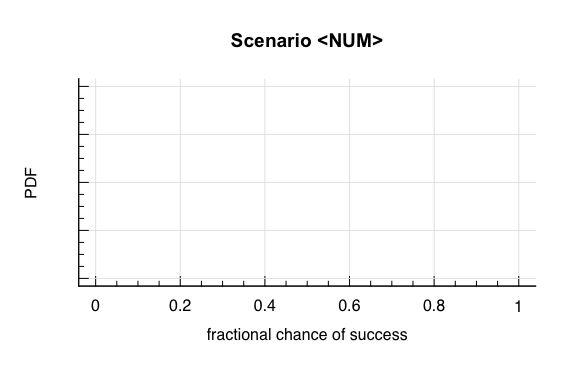

So can start by asking yourself: what probability do you think that the
person has of succeeding their challenge? Remember that the challenges
all state that they must guess correctly *all 10 times*. If they get
*any* of the 10 guesses wrong, then they fail their challenge.

You can start simple: just come up with a single value of how likely you
think it is that the three people succeed in making all 10 guesses
correctly.

> -   Is it 1% (meaning that there’s basically no way they will
>     succeed)?

``` r
#Setup the axes
magplot(1,xlim=c(0,1),ylim=c(0,8),xlab="fractional chance of success",ylab="PDF",
        type='n',frame.plot=FALSE,labels=c(T,F))
#They've got basically no chance of success
abline(v=0.01,lty=2,lwd=2)
```


> -   Is it 50% (meaning that they have a 50:50 chance of guessing all
>     10 correctly)?

``` r
#Setup the axes
magplot(1,xlim=c(0,1),ylim=c(0,8),xlab="fractional chance of success",ylab="PDF",
        type='n',frame.plot=FALSE,labels=c(T,F))
#They've got a 50:50 chance of success
abline(v=0.5,lty=2,lwd=2)
```

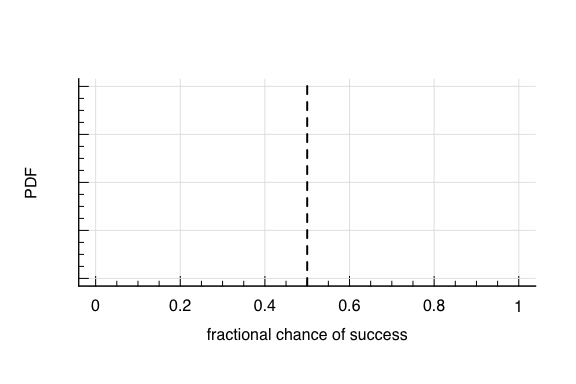

> -   Is it 99% (meaning that they’re basically guaranteed to succeed)?

``` r
#Setup the axes
magplot(1,xlim=c(0,1),ylim=c(0,8),xlab="fractional chance of success",ylab="PDF",
        type='n',frame.plot=FALSE,labels=c(T,F))
#Very confident of success
abline(v=0.99,lty=2,lwd=2)
```

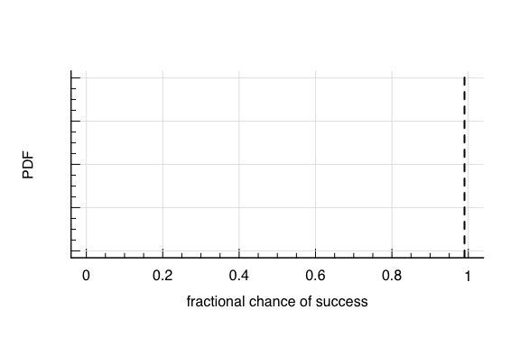

Once you’ve marked your point-estimates of the probability of success
for each of the three challenges, you can now extend these to full
probability distributions.

> -   Are you pretty confident in your guess? So the PDF is narrow and
>     centred on your estimate?

``` r
#Setup the axes
magplot(1,xlim=c(0,1),ylim=c(0,8),xlab="fractional chance of success",ylab="PDF",
        type='n',frame.plot=FALSE,labels=c(T,F))
#Pretty confident that they've got 50% chance of success
abline(v=0.50,lty=2,lwd=2)
curve(dnorm(x,0.5,0.05),from=0,to=1,add=T,lwd=2)
```

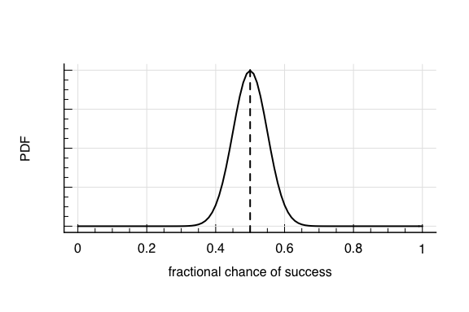

> -   Are you totally unsure? So the PDF is totally flat, and all
>     outcomes are equally likely?

``` r
#Setup the axes
magplot(1,xlim=c(0,1),ylim=c(0,8),xlab="fractional chance of success",ylab="PDF",
        type='n',frame.plot=FALSE,labels=c(T,F))
#Absolutely no idea; equal chance from 0% to 100%
abline(v=0.50,lty=2,lwd=2)
curve(dunif(x),from=-0,to=1,add=T,lwd=2,type='s')
```

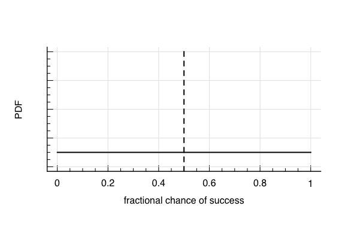

> -   If you’re very confident one-way or another (i.e. near 0% or
>     100%), how rapidly does the tail of your PDF go to zero
>     probability?

``` r
#Setup the axes
magplot(1,xlim=c(0,1),ylim=c(0,8),xlab="fractional chance of success",ylab="PDF",
        type='n',frame.plot=FALSE,labels=c(T,F))
#Very confident "fail"
abline(v=0.01,lty=2,lwd=2,col='red3')
curve(dbeta(x,0.1,10),from=-0,to=1,add=T,lwd=2,type='l',col='red3')
#Only weakly confident "succeed"
abline(v=0.99,lty=2,lwd=2,col='blue3')
curve(dbeta(x,1,0.5),from=-0,to=1,add=T,lwd=2,type='l',col='blue3')
legend("top",legend=c("Very confident 'fail'", "Weakly confident 'succeed'"),
       lty=1,lwd=2,col=c("red3","blue3"),bg='white')
```

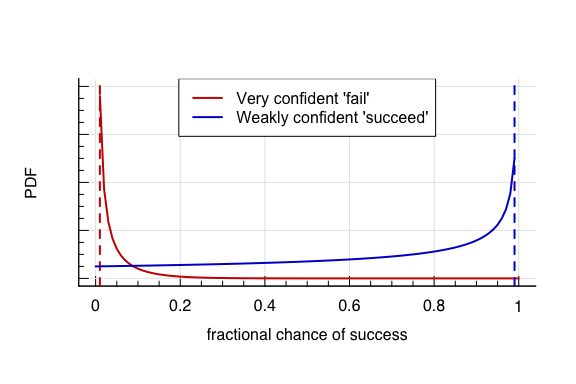

Once you’ve drawn your graphs for the three outcomes, proceed to the
next slide.

# What happens?

The time has come for the challenges!

## Scenario One: The Drunken Coin Toss

First up is your good friend the drunken fortune teller. You take a coin
from your own pocket, so that you know that it is fair. You proceed to
toss the coin 10 times, and each time your friend guesses the outcome
while the coin is in the air.

-   **He guesses correctly all 10 times**

## Scenario Two: The Wine Critic

Up next is the “wine expert”. You ask the barman to prepare, out of
sight of the group, 10 glasses containing wine from either France or
Spain. He numbers the glasses 1 to 10, and gives them to you to
administer the challenge. This bartender, it seems, has a degree in
experimental design and is ensuring that the challenge is held under the
strictest double-blind conditions, to ensure that there is no cheating.

You give the glasses of wine one-by-one to your friend, and record
whether he thinks the wine comes from France or Spain. You take his
responses back to the bartender.

-   **He has guessed correctly all 10 times**

## Scenario Three: The Classical Pianist

Lastly we have the challenge for our friend the classical pianist. The
group goes through their music libraries and selects 10 songs that are
written by either Mozart or Beethoven. They make the test as difficult
as possible by purposely avoiding any songs that are widely popular
(like the “duh duh duh duuuuuhhhhhhh” one).

The play the 10 songs one at a time for your friend.

-   **She guesses correctly all 10 times**

# What do you think?

In all three challenges, our friends are victorious! How do these
observations align with what you have in your graphs? Or more
importantly:

-   **How does the outcomes of the challenges change your opinions?**

Let’s take a moment to redraw your three probability graphs. Draw three
more empty axes, and again label them as Scenarios 1/2/3. However, this
time we’ve already seen the results of the challenges. So let’s instead
make the x-axis “fractional chance they’re telling the truth”, so:

> -   0 means that they’re lying, and that they can’t:
>     -   see the future
>     -   tell the difference between wines
>     -   tell the difference between the classical pieces
> -   1 means that they’re telling the truth, and that they *can*:
>     -   see the future
>     -   tell the difference between wines
>     -   tell the difference between the classical pieces

``` r
#Setup the axes
magplot(1,xlim=c(0,1),ylim=c(0,8),xlab="fractional chance they're telling the truth",ylab="PDF",
        type='n',frame.plot=FALSE,labels=c(T,F),main='Scenario <NUM>')
```

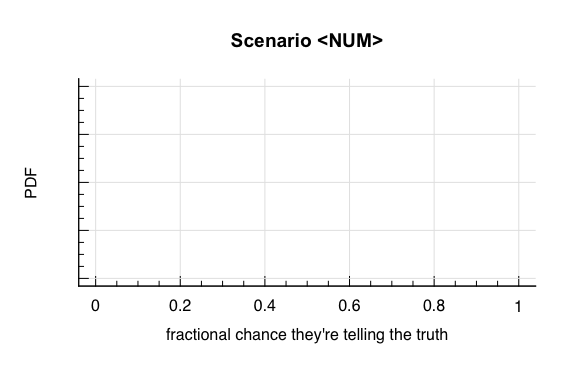

I now want you to draw PDFs that show what you think the probability is
that they are telling the truth, given what we have seen in the
challenges.

Keep these graphs nearby, as they will be useful to reflect upon as we
go through today’s lecture.

<!--}}}-->

# Section 3: Introduction <!--{{{-->

**Section 3: Bayesian Statistics (Weeks 7-9)**

Bayes theorem led to a revolution in statistics, via the concepts of
prior and posterior evidence. In modern astronomy and physics,
applications of Bayesian statistics are widespread. We begin with a
study of Bayes theorem, and the fundamental differences between
frequentest and Bayesian analysis. We explore applications of Bayesian
statistics, through well studied statistical problems (both within and
outside of physics).

<!--}}}-->

# Classical Inference <!--{{{-->

During the course so far, we have frequently described the concept of
extracting information about a “population” *Ω* from a “sample” of
observations drawn from that population. This process is called
statistical inference, and until this point we have been interested in
“**Classical Inference**”.

## Searching the forest

Let’s take an example. A forestry commission wants to know (or rather
estimate) how many trees in a large forest suffer from a particular
disease.

It’s impractical to check every tree in the forest, and so they instead
select a sample of *n* trees to test.

If *θ* is true fraction of trees that have the disease, then each tree
in the sample *n*, independent of all others, will be diseased with the
probability *θ*.

Let *X* be the random variable corresponding to the number of diseased
trees in the sample *n*. The commission will therefore use *X* = *x* to
draw some inference about the population parameter *θ*.

Such an inference could be of the form of:

-   a **point estimate**: *θ̂* = 0.1
-   a **confidence interval**: *θ* ∈ \[0.08, 0.12\] at 95% confidence
-   a **hypothesis test**: reject the hypothesis that *θ* &lt; 0.07 at
    the 5% significance level
-   a **prediction**: predict that 15% of trees will be affected by next
    year
-   a **decision**: decide to identify and remove diseased trees.

Generally speaking, such inference will be made by specifying some
probability model:
*p*(*x*\|*θ*)
which determines the probability of how different values of *X* are
distributed, given a particular value of *θ*.

In our forestry example, we have two possible outcomes (diseased or not
diseased). So the appropriate probability model is the binomial
function:
*X*\|*θ* ∼ Bin(*n*, *θ*)

One method of estimating the value of *θ* is to maximise the likelihood
of *X* = *x* with respect to *θ*. We will look at this more later, but
in the simplest terms we are finding the value of *θ* that is *most
likely* to produce the observed distribution of *X* = *x*. In this case,
we have the **maximum likelihood** estimate of *θ*.

In this case, the parameter *θ* is being treated as a *constant*. This
is the cornerstone of classical statistical theory.

<!--}}}-->

# Bayesian Inference <!--{{{-->

The fundamental difference between Classical and Bayesian statistics is
that, in Bayesian statistical inference, *θ* is treated as a *random*
quantity. This means that inference can be made by analysing
probabilities alone.

Bayesian Inference is based on the concept of the **posterior
probability distribution**:
*p*(*θ*\|*x*)

We obtain the posterior probability distribution via **Bayes Rule**,
which we have already seen during our discussion of conditional
probability:
$$
p(\\theta\|x)=\\frac{p(x\|\\theta)p(\\theta)}{p(x)},
$$
where the denominator in this equation:
*p*(*x*) = ∫*p*(*θ*)*p*(*x*\|*θ*)d*θ*
is the probability of observing the data *x*, is independent of *θ* for
a fixed *x*, and can be considered a constant.

The **unnormalised posterior density** is Bayes Rule without this
constant denominator:
*p*(*θ*\|*x*) ∝ *p*(*θ*)*p*(*x*\|*θ*)

The value conditional probability of observing the data given the model
*p*(*x*\|*θ*) is as we showed before in the classical inference.

## And most importantly:

*p*(*θ*) is the **prior probability distribution**, which represents the
beliefs that we have about the possible values of *θ* *prior* to
observing any information (i.e. from the data).

<!--}}}-->

# Prior Distribution <!--{{{-->

When trying to estimate *θ*, we almost always have some prior knowledge,
or belief, about the value of *θ* before taking any data into
consideration.

Take, for example, the case of a data model
*X*\|*θ* ∼ Bin(*n* = 10, *p* = *θ*), and observations (i.e. number of
successful trials out of *n*) *x* = 10. Given these observations and the
data model alone, we would reject the hypothesis
H<sub>0</sub> : *θ* ≤ 0.5 in favour of H<sub>1</sub> : *θ* ≥ 0.5 with
certainty. Said differently, the maximum likelihood of *p*(*x*\|*θ*) in
the classical inference sense is *θ* = 1.

This might not seem like an issue *a priori*, however this is where we
start to reflect on the outcomes of our three scenarios from the
beginning of the lecture.

# Back to the pub…

We had three scenarios that we considered. They were:

## Scenario One: The Drunken Coin Toss

One friend announces to the group that he spent lockdown teaching
himself how to predict the future. He proudly announces that not only
can he predict everyone’s future, but he can also see the outcomes of
any event before it happens. The group challenges him to prove it, by
correctly predicting the outcome of a fair coin toss 10 times in a row.

> -   He correctly predicts the coin toss 10 times in a row.

## Scenario Two: The Wine Critic

A second friend says that he spent the lockdown “learning how to be a
wine critic”. You suppose that it’s possible that he spent a year
studying the fine details of wine production, or perhaps this is just be
a euphemism for “I drank lots of cheap wine during the lockdown”… The
group challenges him to prove his skills, by correctly identifying
whether an unlabelled glass of wine comes from a vineyard in France or
Spain 10 times in a row.

> -   He correctly picks the origin of the wine 10 times in a row.

## Scenatio Three: The Classical Pianist

A third friend says that she spent the lockdown re-learning how to play
classical piano. She says that she had learned to play classical piano
as a child, and the long time in lockdown gave her the perfect
opportunity to renew her passion for playing. The group challenges her
to prove it, but alas there is no piano in the bar. Therefore they
decide to test her knowledge by challenging her to correctly identify
whether a piece of classical music is by Beethoven or Mozart 10 times in
a row.

> -   She correctly identifies the composer 10 times in a row.

## The classical interpretation

Each of these scenarios presents the same binomial experiment, with the
same outcome: *X*\|*θ* ∼ Bin(10, *θ*) and *x* = 10.

Based on these data alone, we would be forced to draw the same
conclusion in each case; *θ* = 1. However our **prior beliefs** are
likely to be somewhat at odds with this result. In classical inference
this is of no consequence, however in *Bayesian* inference this can have
a significant influence over our conclusions…

## What did Angus’ graphs look like?

For my starting graphs, I produced the below distributions for what I
expected the outcomes of the challenges to be. You can tell from my
graphs that I’m a pretty all-or-nothing kind of gambler…

> -   I don’t believe that the friend can see the future. At all.
> -   I think it’s unlikely that the friend studied wine all lockdown,
>     but I’m not completely closed off to the possibility…
> -   I think that getting back into piano sounds like something totally
>     reasonable, especially if you had learned it originally as a
>     child, so there’s a good chance she will win the challenge.

``` r
#Set up the axes
magplot(1,xlim=c(0,1),ylim=c(0,20),xlab="fractional chance of success",ylab="PDF",
        type='n',frame.plot=FALSE,labels=c(T,T),main='All Scenarios')
curve(dbeta(x,0.1,100),col='red3',lty=1,lwd=2,add=TRUE,from=0,to=0.1)
curve(dbeta(x,0.7,1),col='green3',lty=2,lwd=2,add=TRUE)
curve(dbeta(x,10,0.5),col='blue3',lty=1,lwd=2,add=TRUE)
legend('top',legend=paste("Scenario",1:3),col=c("red3","green3","blue3"),lty=c(1,2,1),inset=0.05,bg='white',lwd=2)
```

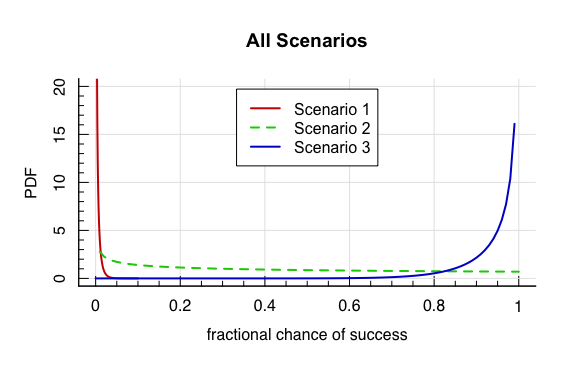

These graphs represent our **prior** on *θ* in each of the three
scenarios.

Look back on your priors now. How do they compare with mine? Perhaps
you’re much more open to the possibility that your friend can actually
see into the future? Or perhaps you have no idea about wine, and so had
no idea if it was hard or difficult to tell the difference between
bottles from France and Spain?

Importantly, **there are no wrong answers**. The graphs you’ve drawn are
**your** prior belief.

## Opinions about the results

The prior that you specified (provided you did so honestly) is likely to
be highly related to how you *felt* about the outcomes of the different
challenges. This is highly related to your second set of graphs. That
is, how much did your graphs change **after** you heard about the
outcomes of the challenges. For me, my graphs looked like this:

``` r
#Set up the axes
magplot(1,xlim=c(0,1),ylim=c(0,8),xlab="fractional chance of success",ylab="PDF",
        type='n',frame.plot=FALSE,labels=c(T,T),main='All Scenarios')
curve(dbeta(x,1,100),col='red3',lty=1,lwd=2,add=TRUE,from=0,to=0.1)
curve(dbeta(x,1,0.5),col='green3',lty=2,lwd=2,add=TRUE,from=0,to=1)
curve(dbeta(x,100,0.5),col='blue3',lty=1,lwd=2,add=TRUE,from=0,to=1)
legend('top',legend=paste("Scenario",1:3),col=c("red3","green3","blue3"),lty=c(1,2,1),inset=0.05,bg='white',lwd=2)
```

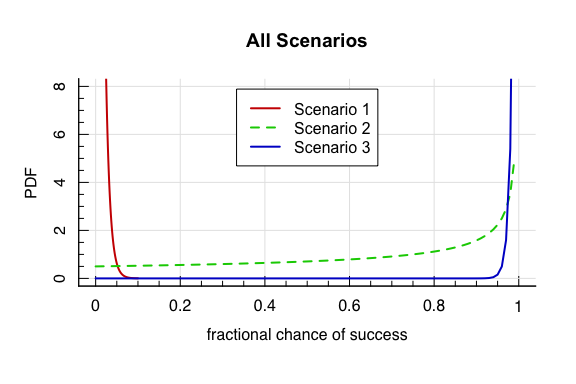

So you can see that:

> -   my opinion of the fortune teller is essentially unchanged;
> -   my opinion about the wine-drinker has flipped: I now believe that
>     there’s the greatest chance that he’s telling the truth. And;
> -   for the classical pianist, the observations of the data have
>     further hardened my belief that she is telling the truth, such
>     that it’s now almost a single value at 1.

On your graphs we wrote the *x*-axis as “fraction chance that they’re
telling the truth”, but this is really no different from “fractional
chance that they succeed in another round of the challenge”.

# Bayesian Inference and the Prior

What we’ve just drawn on the last slide (and on your own pages) is
essentially your prior belief on the outcome of the challenge, and the
resulting **posterior probability distribution** after observing the
data.

## This is the important part:

Every one of you was presented with the same data. However you all had
different prior distributions. This means that *you will all have
different posterior distributions too*.

The essential basis of Bayesian inference is that experiments are not
abstract devices. Invariably we have some knowledge about the process
being investigated before we observe any data, and Bayesian statistics
provides us with a mechanism for drawing inference from this combination
of prior knowledge and data.

<!--}}}-->

# Characteristics of Bayesian Statistics <!--{{{-->

We can identify four fundamental aspects that characterise the Bayesian
approach to statistical inference.

## Prior Information

All problems are unique to having their own context. That context
derives prior information, and it is the formulation and exploitation of
this prior knowledge that sets Bayesian statistics apart from Classical
statistics.

## Subjective Probability

Bayesian Statistics formalises explicitly the notion that all
probabilities are subjective; based on an individuals prior knowledge
and the knowledge at hand.

## Self-consistency

By treating *θ* as a random variable, it emerges that the whole
development of Bayesian inference stems from probability theory only.
This means that all statistical inference issues can be addressed as
probability statements about *θ*, which we can derive directly from the
posterior distribution.

## No “adhockery”

Bayesian inference side-steps the tendency (in classical statistics and
inference) to invent ad-hoc criteria for judging and comparing
estimators (point estimates, confidence intervals, etc), by relying on
the posterior distribution itself to express (in straightforward
probabilistic terms) the entire inference about an unknown *θ*.

# Review of Bayes Theorem (I)

In its basic form, Bayes Theorem is a simple result of conditional
probabilities. Indeed, this is how we first came to discover it a few of
lectures ago. If *A* and *B* are two events with *P*(*A*) &gt; 0, then:
$$
P(B\|A)=\\frac{P(A\|B)P(B)}{P(A)}
$$

The use of Bayes Theorem in probability applications is to reverse the
conditioning of events. That is, to show how the probability of *B*\|*A*
is related to *A*\|*B*.

A slight extension of Bayes Theorem is obtained by conditioning events
*C*<sub>1</sub>, …, *C*<sub>*k*</sub>, which partition the sample space
*Ω* so that *C*<sub>*i*</sub> ∩ *C*<sub>*j*</sub> = 0 if *i* ≠ *j*, and
*C*<sub>1</sub> ∪ *C*<sub>2</sub> ∪ … ∪ *C*<sub>*k*</sub> = *Ω*. In this
circumstance the computation of Bayes Theorem becomes:
$$
P(C\_i\|A)=\\frac{P(A\|C\_i)P(C\_i)}{\\sum\_{j=0}^k P(A\|C\_j)P(C\_j)}\\;\\;\\;\\;\\forall\\;i=1,\\dots,k
$$

This formulation is useful because it allows us to consider simple
experiments in order to explore the details of Bayes Theorem.

# Return of the Urn

Consider an urn that contains six balls of unknown colours. Three balls
are drawn at random *without* replacement, and all are found to be
black. What is the probability that there are **no** black balls left in
the urn?

Let *A* be the event that 3 black balls are drawn from the urn, and
*C*<sub>*i*</sub> be the event that there are truly *i* black balls in
the urn.

By Bayes Theorem:
$$
P(C\_3\|A)=\\frac{P(A\|C\_3)P(C\_3)}{\\sum\_{j=0}^6 P(A\|C\_j)P(C\_j)}
$$
The probability *P*(*A*\|*C*<sub>3</sub>) is simple to calculate:
$$
P(A\|C\_3) = \\frac{3}{6}\\times\\frac{2}{5}\\times\\frac{1}{4}
$$
However the crucial issue is this:

**What values do we assign to
*P*(*C*<sub>0</sub>), …, *P*(*C*<sub>6</sub>).** Remember that these are
our prior beliefs about there being *i* black balls in the bag *prior*
to seeing any data.

Without any additional information, we might logically assume that all
outcomes are equally likely:
$$
P(C\_i)=\\frac{1}{k}
$$
where *k* = 7 (because there are 7 possible outcomes;
*C*<sub>0</sub>, *C*<sub>1</sub>, …, *C*<sub>6</sub>).

Using this prior:
$$
\\begin{align}
P(C\_3\|A)=& \\frac{P(A\|C\_3)P(C\_3)}{\\sum\_{j=0}^{6}P(A\|C\_j)P(C\_j)} \\\\
=& \\frac{\\left(\\frac{3}{6}\\times\\frac{2}{5}\\times\\frac{1}{4}\\right)\\times\\frac{1}{7}}
{\\frac{1}{7}\\times\\left\[0+0+0+
\\left(\\frac36\\times\\frac25\\times\\frac14\\right)+
\\left(\\frac46\\times\\frac35\\times\\frac24\\right)+
\\left(\\frac56\\times\\frac45\\times\\frac34\\right)+
1
\\right\]} \\\\
&=\\frac{1}{35}
\\end{align}
$$

So the data have updated our prior belief from $P(C\_3)=\\frac{1}{7}$ to
$P(C\_3\|A)=\\frac{1}{35}$. Put in words, the event that there is only 3
black balls in the Urn is much less likely having seen the data than we
believed it to be previously.

<!--}}}-->

# Review of Bayes Theorem (II) <!--{{{-->

As we mentioned previously, stated in terms of random variables (with
probability densities generally denoted by *p*) Bayes Theorem then takes
the form:
$$
p(\\theta\|x)=\\frac{p(x\|\\theta)p(\\theta)}{\\int p(\\theta)p(x\|\\theta)\\textrm{d}\\theta}. 
$$

This is the notation that we will use regardless of whether *x* is a
continuous random variable or discrete. As per normal, when *x* is a
continuous random variable *p* will represent the *probability density
function (pdf)* of *x*, whereas when *x* is a discrete random variable
*p* will refer to the *probability mass function (pmf)* of *x*.

Similarly, *θ* can be continuous or discrete, but in the discrete case
the integral in the denominator becomes the summation that we’ve already
encountered:
∑<sub>*j*</sub>*p*(*θ*<sub>*j*</sub>)*p*(*x*\|*θ*<sub>*j*</sub>).

Note that the denominator of Bayes Theorem marginalises over *θ* (and so
is only a function of *x*). Therefore for fixed data, Bayes Theorem can
be rewritten as the proportionality:
*p*(*θ*\|*x*) ∝ *p*(*x*\|*θ*)*p*(*θ*)
That is, the posterior probability is proportional to the prior
probability times the likelihood *p*(*x*\|*θ*).

<!--}}}-->

# Bayesian Updating <!--{{{-->

There are 4 key steps in the Bayesian approach:

1.  Specification of the likelihood model *p*(*x*\|*θ*);
2.  Determination of the prior *p*(*θ*);
3.  Calculation of the posterior distribution *p*(*θ*\|*x*); and
4.  Draw inference from the posterior distribution.

<!--}}}-->

# Computation <!--{{{-->

Implementing Bayes Theorem in practice can be computationally difficult,
often due to the difficulty in determining the normalising integral in
the denominator.

For some choices of prior-likelihood combinations this integral can be
avoided, but generally speaking specialised techniques are required to
simply solve the calculation.

Let’s go back to our three scenarios one last time. My prior
distributions were all Beta distributions:
$$
\\theta\\sim\\textrm{Be}(\\alpha,\\beta)\\\\
p(\\theta;\\alpha,\\beta)=\\frac{\\Gamma(\\alpha) \\Gamma(\\beta)}{\\Gamma(\\alpha+\\beta)}\\theta^{\\alpha-1}(1-\\theta)^{\\beta-1},
$$
For the three different scenarios, my three prior distributions were:
$$
\\theta\_1\\sim\\textrm{Be}(\\alpha=0.1,\\beta=100)\\\\
\\theta\_2\\sim\\textrm{Be}(\\alpha=0.7,\\beta=1)\\\\
\\theta\_3\\sim\\textrm{Be}(\\alpha=10,\\beta=0.5)\\\\
$$

``` r
#Set up the axes
magplot(1,xlim=c(0,1),ylim=c(0,20),xlab=expression(p(theta)),ylab="PDF",
        type='n',frame.plot=FALSE,labels=c(T,T),main='All Scenarios')
curve(dbeta(x,0.1,100),col='red3',lty=1,lwd=2,add=TRUE,from=0,to=0.1)
curve(dbeta(x,0.7,1),col='green3',lty=2,lwd=2,add=TRUE)
curve(dbeta(x,10,0.5),col='blue3',lty=1,lwd=2,add=TRUE)
legend('top',legend=paste("Scenario",1:3),col=c("red3","green3","blue3"),lty=c(1,2,1),inset=0.05,bg='white',lwd=2)
```

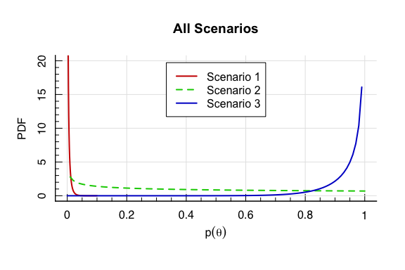

The likelihood function that we were looking at for these scenarios were
all the same Binomial distribution:
$$
X\\sim\\textrm{Bin}(n,\\theta) \\\\
p(X=x\|\\theta)={n\\choose x}\\theta^x(1-\\theta)^{n-x}
$$
and the observation was *x* = 10.

We can compute the posterior probability distributions for my three
priors both analytically and empirically. Let’s start with the analytic
approach.

Our likelihood is of the form:
$$
p(x\|\\theta)={10\\choose x}\\theta^x(1-\\theta)^{10-x}
$$
My priors are each of the form:
$$
\\begin{align}
p(\\theta;\\alpha,\\beta)&=\\frac{\\Gamma(\\alpha) \\Gamma(\\beta)}{\\Gamma(\\alpha+\\beta)}\\theta^{\\alpha-1}(1-\\theta)^{\\beta-1}\\\\
&\\propto \\theta^{\\alpha-1}(1-\\theta)^{\\beta-1} 
\\end{align}
$$

Therefore, by Bayes Theorem:
$$
\\begin{align}
p(\\theta\|x)&\\propto p(x\|\\theta)p(\\theta) \\\\
&\\propto\\theta^x(1-\\theta)^{n-x}\\times\\theta^{\\alpha-1}(1-\\theta)^{\\beta-1}\\\\
&=\\theta^{x+\\alpha-1}(1-\\theta)^{n-x+\\beta-1}
\\end{align}
$$
We know that *p*(*θ*\|*x*) must be a probability distribution, and this
last line has the same functional form as a Beta distribution. Therefore
it must be the case that:
*θ*\|*x* ∼ Be(*x* + *α*, *n* + *β* − *x*)

So the effect of observing the data on my priors is to update the Beta
distribution parameters from {*α*, *β*} to {*x* + *α*, *n* + *β* − *x*}.
This means that we can simply plot the posterior distributions:

``` r
#Set up the axes
magplot(1,xlim=c(0,1),ylim=c(0,20),xlab=expression(p(theta*'|'*x)),ylab="PDF",
        type='n',frame.plot=FALSE,labels=c(T,T),main='All Scenarios')
curve(dbeta(x,10.1,100),col='red3',lty=1,lwd=2,add=TRUE,from=0,to=0.5)
curve(dbeta(x,10.7,1),col='green3',lty=2,lwd=2,add=TRUE)
curve(dbeta(x,20,0.5),col='blue3',lty=1,lwd=2,add=TRUE)
legend('top',legend=paste("Scenario",1:3),col=c("red3","green3","blue3"),lty=c(1,2,1),inset=0.05,bg='white',lwd=2)
```

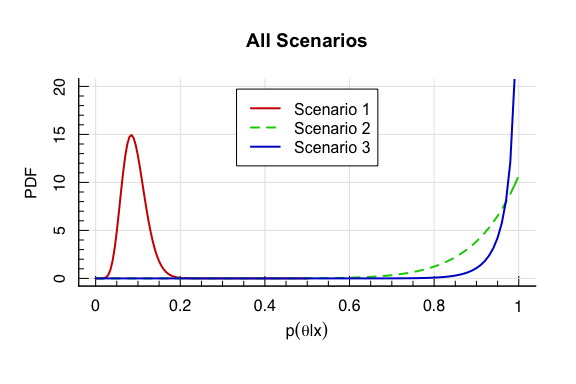

We can then compare these to my “after” figures, and get an idea as to
how-much I am “naturally” thinking like a Bayesian!

``` r
#Set up the axes
magplot(1,xlim=c(0,1),ylim=c(0,8),xlab="fractional chance of success",ylab="PDF",
        type='n',frame.plot=FALSE,labels=c(T,T),main='All Scenarios')
curve(dbeta(x,1,100),col='red3',lty=1,lwd=2,add=TRUE,from=0,to=0.1)
curve(dbeta(x,1,0.5),col='green3',lty=2,lwd=2,add=TRUE,from=0,to=1)
curve(dbeta(x,100,0.5),col='blue3',lty=1,lwd=2,add=TRUE,from=0,to=1)
legend('top',legend=paste("Scenario",1:3),col=c("red3","green3","blue3"),lty=c(1,2,1),inset=0.05,bg='white',lwd=2)
```


So, firstly, this shows that I probably should have been more swayed by
the abilities of the fortune teller; or rather that I was subconsciously
assigning a much stronger prior than what I actually drew. This is an
important point: application of an overly strong (or weak) prior can
lead to differences in the posterior that are unexpected. Put simply: I
was *never* going to be convinced that a friend had learnt to see into
the future, so the prior I specified was *still* not strong enough to
represent my true prior belief.

We see a similar story for the wine drinker: I was swayed somewhat, but
the true posterior is moved by more still.

Finally, my instinct for the musician was about right.

## Lessons Learnt

The prior is of **pivotal** importance in Bayesian Statistics. Here we
have 3 scenarios with *exactly the same data*, but the inference that I
would draw from the posteriors above are wildly different. And they will
be different for each of you as well, depending on how you specified
your prior beliefs.

But do not fear: we will start next weeks lecture with an in-depth look
at priors.

# The three important lessons

There were a few very important points that we covered today in our
introduction to Bayesian Statistics, that are important that you
understand.

> 1.  Classical statistical inference is interested in objective
>     likelihoods of observations given a static, constant model *θ*.
>     Bayesian statistical inference formalises experiments and
>     inference as a subjective exercise, via the combination of prior
>     information and the objective likelihood.
> 2.  Given the *same data*, different priors will lead to wildly
>     different posterior inferences (i.e. the fortune teller vs the
>     classical musician).
> 3.  Strong prior specification can have important impacts on
>     inference. Over- and under-estimation of the prior probability
>     (especially when there are few observations) can lead to
>     unexpected results.

<!--}}}-->
