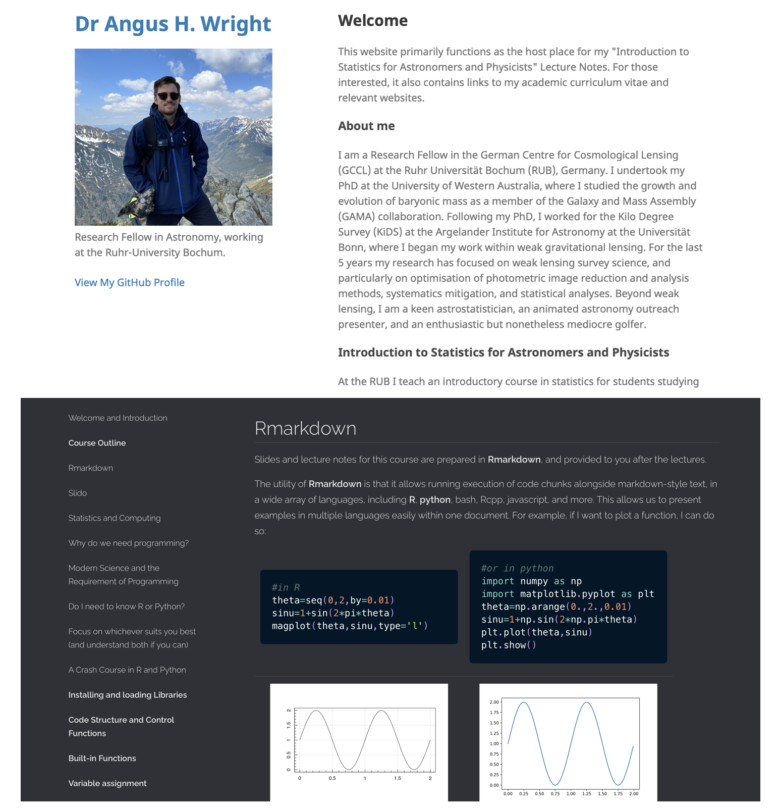

# Welcome <!--{{{-->
<center>
<!--Setup {{{-->
```{r setup, include=FALSE}
rrepos <- getOption("repos")
rrepos["CRAN"] <- "https://cloud.r-project.org"
options(repos=rrepos)
options(width=100)
library(reticulate)
library(magicaxis)
library(particles) 
library(tidygraph) 
library(ggplot2)
library(magicaxis)
knitr::opts_chunk$set(echo = TRUE)
knitr::opts_chunk$set(tidy = FALSE)
knitr::opts_chunk$set(class.output = "out")
knitr::opts_chunk$set(out.width="50%")
knitr::opts_chunk$set(fig.align="center")
#knitr::opts_chunk$set(fig.asp=1)
knitr::knit_engines$set(python = reticulate::eng_python)  
par(mar=c(3,3,1,1))
set.seed(666)
```
```{css, echo=FALSE}
.python { 
  background-color: 
    RColorBrewer::brewer.pal(1,"Set2");
} 
.out { 
  max-height: 300px;
  overflow-y: auto;
  background-color: inherit;
}
```
<!--}}}-->

Welcome to the Introduction to Statistics for Astronomers and Physicists course
for the Summer Semester 2022.

# Course Philosophy <!--{{{-->

What is this course?

> - A practical introduction to statistics for astronomers and physicists 
> - Designed for those with little-to-no previous statistics education 
> - The course (and lecture notes) are _not_ a statistics reference text 

How will we do this? 

> - The course will borrow heavily from standard statistical problems and thought experiments 
> - We will discuss common statistical and logical fallacies 
> - Problems will use a mixture of tools simultaneously: 
>   - plain English
>   - math
>   - computer code
>   - graphs
>   - diagrams 
>   - and more.

<!--}}}-->

<!--}}}-->

# Course Outline <!--{{{-->

This course will be taught in 4 parts, each spanning from 2-4 weeks  

- **Section 1**: Data Description, Analysis, and Modelling (Weeks 1-2)
- **Section 2**: Probability & Decision Making (Weeks 3-5)
- **Section 3**: Bayesian Statistics (Weeks 6-8)
- **Section 4**: Parameter Simulation, Optimisation, and Analysis (Weeks 9-12)

# **Section 1**: Data Description, Analysis, and Modelling (Weeks 1-2)
<center>

When working in empirical science, modelling and understanding datasets is
paramount. In this module we start by discussing the fundamentals of data
modelling. We start by discussing theories of point and interval estimation, in
the context of summary statics (e.g. expectation values, confidence intervals),
and estimation of data correlation and covariance. Students will learn the
fundamentals of data mining and analysis, in a way that is applicable to all
physical sciences.

</center>

Topics include:

> + Types of data 
> + Point & interval estimation 
> + Correlation & covariance
> + Fundamentals of data exploration/mining
> + Introduction to data visualisation 

# **Section 2**: Probability & Decision Making (Weeks 3-5)
<center>

For all aspects of modern science, an understanding of probability is required.
We cover a range of topics in probability, from decision theory and the
fundamentals of probability theory, to standard probabilistic distributions and
their origin. From this module, students will gain an insight into different
statistical distributions that govern modern observational sciences, the
interpretation of these distributions, and how one accurately models
distributions of data in an unbiased manner.

</center>

Topics include:

> + Decision theory
> + Fundamentals of probability
> + Statistical distributions and their origins

# **Section 3**: Bayesian Statistics (Weeks 6-8)
<center>

Bayes theorem led to a revolution in statistics, via the concepts of prior and
posterior evidence. In modern astronomy and physics, applications of Bayesian
statistics are widespread. We begin with a study of Bayes theorem, and the
fundamental differences between frequentest and Bayesian analysis. We explore
applications of Bayesian statistics, through well studied statistical problems
(both within and outside of physics).

</center>

Topics include: 

> + Frequentist & Bayesian statistics
> + Bayes theory
> + Prior specification
> + Hypothesis testing   

# **Section 4**: Parameter Simulation, Optimisation, and Analysis (Weeks 9-12)
<center>

We apply our understanding of Bayesian statistics to the common problems of
parameter simulation, optimisation, and inference. Students will learn the
fundamentals of Monte Carlo Simulation, Markov Chain Monte Carlo (MCMC)
analysis, hypothesis testing, and quantifying goodness-of-fit. We discuss common
errors in parameter inference, including standard physical and astrophysical
biases that corrupt statistical analyses.

</center>

Topics include:  
  
> + Monte Carlo Simulation
> + Markov-Chain Monte Carlo 
> + Fitting high dimensional data
> + Machine Learning 

<!--}}}-->

# Rmarkdown <!--{{{-->

Slides and lecture notes for this course are prepared in **Rmarkdown**, and
provided to you after the lectures.

<center>
<table style="width: 90%">
    <colgroup>
       <col span="1" style="width: 45%;">
       <col span="1" style="width: 45%;">
    </colgroup>
    <tbody> <tr>
<td rblock> <!--{{{-->
``` {r, rblock-zero, fig.height=4, fig.width=6, out.width='90%', eval=FALSE}  
#in R
theta=seq(0,2,by=0.01)
sinu=1+sin(2*pi*theta)
magplot(theta,sinu,type='l')
```
</td> <!--}}}-->
<td pythonblock> <!--{{{-->
``` {python, pyblock-zero, fig.height=4, fig.width=6, out.width="90%", eval=FALSE}
#or in python
import numpy as np
import matplotlib.pyplot as plt
theta=np.arange(0.,2.,0.01)
sinu=1+np.sin(2*np.pi*theta)
plt.plot(theta,sinu)
plt.show()
```
</td> <!--}}}-->
</tr><tr>
<td rblock> <!--{{{-->
``` {r, rblock-zero, fig.height=4, fig.width=6, out.width='90%',eval=TRUE,echo=FALSE} 
```
</td> <!--}}}-->
<td pythonblock> <!--{{{-->
``` {python, pyblock-zero, fig.height=4, fig.width=6, out.width="90%", eval=TRUE, echo=FALSE}
```
</td> <!--}}}-->
</tr></tbody></table>

# Rmarkdown <!--{{{-->

Information generated and stored within blocks is persistent, and code-blocks
with different engines can also cross-communicate. 

<center>
<table style="width: 90%">
    <colgroup>
       <col span="1" style="width: 45%;">
       <col span="1" style="width: 45%;">
    </colgroup>
    <tbody> <tr>
<td rblock> <!--{{{-->
``` {r, rblock-one, out.width='90%', eval=FALSE}  
#Create some data in R
#E.g. random draws from f~N(0,1)
x=rnorm(1e3) 
y=rnorm(1e3) 
#Default plot in R
plot(x,y)
```
</td> <!--}}}-->
<td pythonblock> <!--{{{-->
``` {python, pyblock-one, out.width="90%", eval=FALSE}
#and access it directly in python
plt.scatter(r.x,r.y)
plt.show()
```
</td> <!--}}}-->
</tr><tr>
<td rblock> <!--{{{-->
``` {r, rblock-one, out.width='90%',eval=TRUE,echo=FALSE} 
```
</td> <!--}}}-->
<td pythonblock> <!--{{{-->
``` {python, pyblock-one, out.width="90%", eval=TRUE, echo=FALSE}
```
</td> <!--}}}-->
</tr></tbody></table>

<!--}}}-->

# Slido <!--{{{-->

To promote interaction, we will use **Slido**. 

> + Questions can be asked anonymously
> + All questions are good questions!! 
> + Once a question is registered, support by clicking the "thumbs up".
>  - Thumb means: "Oh! I want to know the answer to that too!".
>  - Questions are ranked by popularity
>  - I'll try to answer all questions, but the most popular questions first 
> + **Most importantly**: I will use the questions to improve the lecture 
>  - Course notes will better cover things you don't understand
>  - Course will be more relevant to you 
>  - The course will improve over time! 

So ask whenever and about whatever you think is relevant/interesting/unclear.
The more the better!

<!--}}}-->

# Learning Objectives <!--{{{--> 
An example of the Learning Objectives for a later lecture are given here: 

> **Learning Objectives**: Summarising relationships in 2D 
> 
> Understand graphical methods of exploring observations in two or more variables, such as: 
> 
> > - **Scatter plots**
> > - **KDEs**
> 
> Understand the concepts of: 
> 
> > - **covariance** 
> > - **correlation** 
> 
> Be able to describe the construction of a **covariance/correlation matrix**
> 
> Understand the differences between **Pearson and Spearman Correlation**, and 
> describe the uses of each. 
> 
> Understand the limitations of correlation measures, and the logical fallacy 
> of correlation and causation. 
> 
> Understand the concept of **confounding variables** and their role in correlation. 

<!--}}}-->
# Lecture Notes, Slides <!--{{{--> 

The lecture notes for the course, as well as the slides, are available via the 
website of the lecturer: [https://anguswright.github.io](https://anguswright.github.io) 

<center>
{width=1000px}

<!--}}}-->

# Statistics and Computing <!--{{{-->
<center>

This is a lecture course on Statistics and Statistical methods. 

* So why do we care about computer code?!

<!--}}}-->

# Why do we need programming? <!--{{{-->

Modern physics and astronomy requires an understanding of programming. 

<center>
<!---->
{width=1000px}

# Why do we need programming? 
<center>

<!---->
{width=1000px}

# Why do we need programming? 
<center>

<!---->
{width=1000px}

# Why do we need programming? 
<center>

The surprise? His work was computed entirely _by hand_. 

<!---->
{width=1000px}

# Reproducing Holmberg in 2022 
<center>

```{r funcs, echo=FALSE} 
vtot<-function(gr) {
  v<-velocity(gr)
  v<-sqrt(v[,1]^2+v[,2]^2)
  v<-v-min(v)
  v<-v/max(v)
  v<-v*2/3
  return=v
}
map<-function(C) {
  if (exists('minmax')) { 
    #print(paste("Minmax:",paste(collapse=' ',minmax)))
    #print(range(C),minmax)
    C[which(C<minmax[1])]<-minmax[1]
    C[which(C>minmax[2])]<-minmax[2]
    C<-C-minmax[1]
    C<-C/(minmax[2]-minmax[1])
  } else { 
    #print(paste("Range:",paste(collapse=' ',range(C))))
    C<-C-min(C)
    C<-C/max(C)
  }
  C<-(1-C)*2/3
 # print(range(C))
  return=C
}
pos.plot<-function(gr) 
  magplot(pch=20,cex=cex,col=c(rep(cols[1],N.part),rep(cols[2],N.part)),
  position(gr),xlim=c(-box,box),ylim=c(-box,box))
arr.plot<-function(gr) {  
  parm<-par(mar=c(2,2,1,1))
  vx<-velocity(gr)[,1]
  vx.per<-c(mean(vx[1:N.part]),mean(vx[-(1:N.part)]))
  vx[1:N.part]<-vx[1:N.part]-vx.per[1]
  vx[-(1:N.part)]<-vx[-(1:N.part)]-vx.per[2]
  vy<-velocity(gr)[,2]
  vy.per<-c(mean(vy[1:N.part]),mean(vy[-(1:N.part)]))
  vy[1:N.part]<-vy[1:N.part]-vy.per[1]
  vy[-(1:N.part)]<-vy[-(1:N.part)]-vy.per[2]
  
  #print(range(sqrt(vx^2+vy^2)))
  #print(range(map(sqrt(vx^2+vy^2))))
  magplot(position(gr),col=hsv(map(sqrt(vx^2+vy^2))),pch=20,cex=cex,
                     xlim=c(-box,box),ylim=c(-box,box),asp=1,
          mtline = 1,
          xlab=expression(Delta*x),ylab=expression(Delta*y),
          labels=c(F,F,F,F),side=1:4)

  suppressWarnings({
  arrows(position(gr)[,1],position(gr)[,2],
         position(gr)[,1]+vx*fact,
         position(gr)[,2]+vy*fact,
         length=0.05,col=hsv(map(sqrt(vx^2+vy^2)),a=0.7)
  )
  
  arrows(mean(position(gr)[-(1:N.part),1]),
         max(position(gr)[-(1:N.part),2])+
           abs(diff(range(position(gr)[-(1:N.part),2])))/2,
         mean(position(gr)[-(1:N.part),1])+vx.per[2]*fact,
         max(position(gr)[-(1:N.part),2])+
           abs(diff(range(position(gr)[-(1:N.part),2])))/2+
           vy.per[2]*fact,
         length=0.05,lwd=2
  )
  arrows(mean(position(gr)[ (1:N.part),1]),
         min(position(gr)[ (1:N.part),2])-
           abs(diff(range(position(gr)[ (1:N.part),2])))/2,
         mean(position(gr)[ (1:N.part),1])+vx.per[1]*fact,
         min(position(gr)[ (1:N.part),2])-
           abs(diff(range(position(gr)[ (1:N.part),2])))/2+
           vy.per[1]*fact,
         length=0.05,lwd=2
  )
  })
  par(parm)
  return=range(sqrt(vx^2+vy^2))
}
```

```{r nbody clock, echo=FALSE} 
cex<-1.0
box<-20
N.step<-10
N.part<-37
N.gal<-2
radius<-1
f.grav<-0.06
v.scale<-1
x.offset<-  -(5)
y.offset<-   (5)
vel.pec<-  1.5
vx.offset<- 0.3
v.mult<-sqrt(f.grav*v.scale)
fact<-2e-1/v.mult

tmp<-create_empty(N.part) %>%
  simulate(alpha=1,alpha_target=1,alpha_decay=0,velocity_decay = 0,
           setup = phyllotactic_genesis(radius=radius))

#Single "galaxy"
pos.x<-position(tmp)[,1]
pos.y<-position(tmp)[,2]
phi = pi-atan(pos.y/pos.x)
vel.tot = sqrt(pos.x^2+pos.y^2)*v.mult
vel.x = vel.tot*sin(phi)*ifelse(pos.x<0,-1,1)
vel.y = vel.tot*cos(phi)*ifelse(pos.x<0,-1,1)

#Two "Galaxies" 
if (N.gal>1) { 
  vy.offset<-vel.pec*v.scale
  pos.x<-c(pos.x+x.offset,
           pos.x-x.offset)
  pos.y<-c(pos.y+y.offset,
           pos.y-y.offset)
  vel.x<-c(vel.x-vx.offset,
          (vel.x+vx.offset))
  vel.y<-c(vel.y-vy.offset,
          (vel.y+vy.offset))
} else { 
  vx.offset<-vy.offset<-0
}

holmberg.clockwise <- create_empty(N.part*N.gal) %>%
  simulate(alpha=1,alpha_target=1,alpha_decay=0,velocity_decay = 0,
           setup = predefined_genesis(pos.x,pos.y,vel.x,vel.y)) %>%
  wield(manybody_force,f.grav,theta=0.01,min.dist=0.01,max.dist=0.1)

```

```{r nbody anticlock, echo=FALSE} 
cex<-1.0
box<-20
N.step<-10
N.part<-37
N.gal<-2
radius<-1
f.grav<-0.06
v.scale<-1
x.offset<-  -(5)
y.offset<-   (5)
vel.pec<-  1.5
vx.offset<- 0.3
v.mult<-sqrt(f.grav*v.scale)
fact<-2e-1/v.mult

tmp<-create_empty(N.part) %>%
  simulate(alpha=1,alpha_target=1,alpha_decay=0,velocity_decay = 0,
           setup = phyllotactic_genesis(radius=radius))

#Single "galaxy"
pos.x<-position(tmp)[,1]
pos.y<-position(tmp)[,2]
phi = pi-atan(pos.y/pos.x)
vel.tot = sqrt(pos.x^2+pos.y^2)*v.mult
vel.x = -vel.tot*sin(phi)*ifelse(pos.x<0,-1,1)
vel.y = -vel.tot*cos(phi)*ifelse(pos.x<0,-1,1)

#Two "Galaxies" 
if (N.gal>1) { 
  vy.offset<-vel.pec*v.scale
  pos.x<-c(pos.x+x.offset,
           pos.x-x.offset)
  pos.y<-c(pos.y+y.offset,
           pos.y-y.offset)
  vel.x<-c(vel.x-vx.offset,
          (vel.x+vx.offset))
  vel.y<-c(vel.y-vy.offset,
          (vel.y+vy.offset))
} else { 
  vx.offset<-vy.offset<-0
}

holmberg.anticlockwise <- create_empty(N.part*N.gal) %>%
  simulate(alpha=1,alpha_target=1,alpha_decay=0,velocity_decay = 0,
           setup = predefined_genesis(pos.x,pos.y,vel.x,vel.y)) %>%
  wield(manybody_force,f.grav,theta=0.01,min.dist=0.01,max.dist=0.1)
```

<center>

<table style="width: 90%">
    <colgroup>
       <col span="1" style="width: 45%;">
       <col span="1" style="width: 45%;">
    </colgroup>
    <tbody> <tr>
<td clock> <!--{{{-->
``` {r, fig.height=5, fig.width=6, out.width='90%', eval=TRUE,echo=FALSE,warning=FALSE}  
rm("minmax")
minmax.clock<-arr.plot(holmberg.clockwise)
```
</td> <!--}}}-->
<td clockanim> <!--{{{-->
```{r nbody-anim-clock, fig.show='animate', ffmpeg.format='gif', dev='jpeg', aniopts='loop=FALSE', interval=0.3,echo=FALSE, fig.height=5, fig.width=6, out.width='90%', fig.asp=1,warning=FALSE}
rm("minmax")
minmax<-minmax.clock
sim<-holmberg.clockwise %>% evolve(N.step,arr.plot)
```
</td> <!--}}}-->
</tr><tr>
<td anticlock> <!--{{{-->
``` {r, fig.height=5, fig.width=6, out.width='90%', eval=TRUE,echo=FALSE,warning=FALSE}  
rm("minmax")
minmax.anticlock<-arr.plot(holmberg.anticlockwise)
```
</td> <!--}}}-->
<td anticlockanim> <!--{{{-->
```{r nbody-anim-anticlock, fig.show='animate', ffmpeg.format='gif', dev='jpeg', aniopts='loop=FALSE', interval=0.3,echo=FALSE, fig.height=5, fig.width=6, out.width='90%', fig.asp=1,warning=FALSE}
rm("minmax")
minmax<-minmax.anticlock
sim<-holmberg.anticlockwise %>% evolve(N.step,arr.plot)
```
</td> <!--}}}-->
</tr></tbody></table>
</center>

---

<center>
<!---->
{width=1000px}

---

<table style="width: 90%">
    <colgroup>
       <col span="1" style="width: 45%;">
       <col span="1" style="width: 45%;">
    </colgroup>
    <tbody> <tr>
<td clockanim_freeze> <!--{{{-->
```{r nbody-anim-freeze-clock, echo=FALSE, fig.height=5, fig.width=6, out.width='90%', fig.asp=1,warning=FALSE}
rm("minmax")
minmax<-minmax.clock
graph<-holmberg.clockwise %>% evolve(7)
arr.plot(graph)
```
</td> <!--}}}-->
<td anticlockanim> <!--{{{-->
```{r nbody-anim-freeze-anticlock, echo=FALSE, fig.height=5, fig.width=6, out.width='90%', fig.asp=1,warning=FALSE}
rm("minmax")
minmax<-minmax.anticlock
graph<-holmberg.anticlockwise %>% evolve(7)
arr.plot(graph)
```
</td> <!--}}}-->
</tr></tbody></table>
</center>

---

<center> <font size="12" color="black">  But scalability is the main benefit </font> </center>

--- 

```{r nbody big, echo=FALSE, out.width='80%'} 
cex<-0.2
box<-100
N.step<-100
N.part<-1e3
N.gal<-2
radius<-1
f.grav<-0.06
v.scale<-1
x.offset<-  -(10)
y.offset<-   (40)
vel.pec<-  4.5
vx.offset<- 0.3
v.mult<-sqrt(f.grav*v.scale)
fact<-2e-1/v.mult

tmp<-create_empty(N.part) %>%
  simulate(alpha=1,alpha_target=1,alpha_decay=0,velocity_decay = 0,
           setup = phyllotactic_genesis(radius=radius))

#Single "galaxy"
pos.x<-position(tmp)[,1]
pos.y<-position(tmp)[,2]
phi = pi-atan(pos.y/pos.x)
vel.tot = sqrt(pos.x^2+pos.y^2)*v.mult
vel.x = vel.tot*sin(phi)*ifelse(pos.x<0,-1,1)
vel.y = vel.tot*cos(phi)*ifelse(pos.x<0,-1,1)

#Two "Galaxies" 
if (N.gal>1) { 
  vy.offset<-vel.pec*v.scale
  pos.x<-c(pos.x+x.offset,
           pos.x-x.offset)
  pos.y<-c(pos.y+y.offset,
           pos.y-y.offset)
  vel.x<-c(vel.x-vx.offset,
          (vel.x+vx.offset))
  vel.y<-c(vel.y-vy.offset,
          (vel.y+vy.offset))
} else { 
  vx.offset<-vy.offset<-0
}

holmberg.big <- create_empty(N.part*N.gal) %>%
  simulate(alpha=1,alpha_target=1,alpha_decay=0,velocity_decay = 0,
           setup = predefined_genesis(pos.x,pos.y,vel.x,vel.y)) %>%
  wield(manybody_force,f.grav,theta=0.01,min.dist=0.01,max.dist=0.9)
```
```{r nbody-anim-big, fig.show='animate', ffmpeg.format='gif', dev='jpeg', aniopts='loop=FALSE', interval=0.1,echo=FALSE, fig.height=6, fig.width=6, out.width='80%', fig.asp=1,warning=FALSE}
rm("minmax")
minmax<-arr.plot(holmberg.big)
sim<-holmberg.big %>% evolve(N.step,arr.plot)
```

<!--}}}-->

# Modern Science and the Requirement of Programming <!--{{{-->

The need for programming in the modern physical sciences is 
linked to the importance of statistics. 

> - Modern science is increasingly reliant on large and/or complex datasets
> - These can only be analysed with modern statistical methods 

Take a simple optimisation problem, as an example: 

<center>
<table style="width: 90%">
    <colgroup>
       <col span="1" style="width: 45%;">
       <col span="1" style="width: 45%;">
    </colgroup>
    <tbody> <tr>
<td rblock> <!--{{{-->
\begin{equation} 
\begin{gathered}
Y = {\rm Beta}(X, \alpha,\beta) + {\rm noise} \\
0\leq X \leq 1 \\
\alpha, \beta \in [0,\infty)
\end{gathered}
\end{equation}
</td> <!--}}}-->
<td pythonblock> <!--{{{-->
```{r echo=FALSE, fig.height=4, fig.width=6, out.width='100%'} 
x=runif(1e3)
opar<-par(mar=c(3,3,0,0))
truth=c(3.2,7.7)
y=dbeta(x=x,shape1=truth[1],shape2=truth[2])+rnorm(length(x),mean=0,sd=0.1)
magplot(x,y,ylab=expression(paste('Beta'(alpha,beta))),xlab='x',pch=20,col='blue3')
par(opar)
```
</td> <!--}}}-->
</tr></tbody></table>

# A simple optimisation

One might be inclined to attempt to fit a model to these data by-hand, using
trial and error:

<center>
```{r trial-and-error, fig.show='animate', ffmpeg.format='gif', dev='jpeg', aniopts='loop=FALSE', interval=2,echo=FALSE, fig.height=4, fig.width=6, out.width='90%'}
model.x=seq(0,1,by=0.01)
for (i in 1:20) { 
  model.alpha=runif(1,min=0,max=10)
  model.beta=runif(1,min=0,max=10)
  model.y=dbeta(model.x,model.alpha,model.beta)
  magplot(x,y,ylab=expression(paste('Beta'(alpha,beta))),xlab='x',pch=20,col='blue3',
          main=paste("a=",round(digits=2,model.alpha),"; b=",round(digits=2,model.beta)))
  lines(model.x,model.y,col='red')
}
model.alpha=2.8
model.beta=6.7
```

# A simple optimisation

Using this approach we can get a reasonable fit with $\alpha=`r model.alpha`,\beta=`r model.beta`$: 

<center>

```{r echo=FALSE, fig.height=4, fig.width=6, out.width='80%'} 
model.y=dbeta(model.x,model.alpha,model.beta)
magplot(x,y,ylab=expression(paste('Beta'(alpha,beta))),xlab='x',pch=20,col='blue3',
        main=paste("a=",round(digits=2,model.alpha),"; b=",round(digits=2,model.beta)))
lines(model.x,model.y,col='red',lwd=2)
```
</center>

But is this solution near the truth? How close is good enough? And what are the
uncertainties on the parameters? 

# True optimisation

```{r}
#Estimate parameters using Nonlinear Least Squares (nls) in R 
fit_R=nls(y~dbeta(x,alpha,beta), #The function to fit
          data=list(x=x,y=y),    #The data 
          start=list(alpha=2,beta=5), #The initial guess
          algorithm='port',      #The algorithm 
          lower=c(0,0))          #The lower bounds
best_R=summary(fit_R)$parameters
```
``` {python, fig.height=4, fig.width=6, out.width='90%'}
#Estimate parameters using scipy.optimize.curve_fit in python
import scipy.optimize
import scipy.stats
best_py, cov_py = scipy.optimize.curve_fit(
         scipy.stats.beta.pdf, #The function to fit
         r.x, r.y,         #The data
         p0=[2,5],         #The initial guess 
         bounds=(0,np.inf),#The lower and upper bounds
         method='trf')     #The fitting algorithm
```

# True optimisation

<center>
<table style="width: 90%">
    <colgroup>
       <col span="1" style="width: 45%;">
       <col span="1" style="width: 45%;">
    </colgroup>
    <tbody> <tr>
<td rblock> <!--{{{-->
```{r, echo=FALSE, fig.height=4, fig.width=6, out.width='90%'}
model.y=dbeta(model.x,best_R[1],best_R[2])
magplot(x,y,ylab=expression(paste('Beta'(alpha,beta))),xlab='x',pch=20,col='blue3',
        main=paste("a=",round(digits=2,best_R[1]),"; b=",round(digits=2,best_R[2])))
lines(model.x,model.y,col='red',lwd=3)
```
</td> <!--}}}-->
<td pythonblock> <!--{{{-->
```{python, echo=FALSE, fig.height=4, fig.width=6, out.width='90%'} 
plt.scatter(r.x,r.y)
model_x=np.arange(0.,1.,0.01)
plt.plot(model_x,scipy.stats.beta.pdf(model_x,best_py[0],best_py[1]),color='r')
plt.title("a="+str(np.round(best_py[0],2))+"; b="+str(np.round(best_py[1],2)))
```
</td> <!--}}}-->
</tr></tbody></table>


Obviously these fits are superior to those which we can reach by-hand in terms
of accuracy, effort, and runtime. 

# True optimisation

But the most important benefit is in terms of
*uncertainty estimation*. Statistical computing is important for a wide range of
reasons, but arguably the first and most important reason is for the computation
of measures of uncertainty.

```{r}
#Model statistics in R
summary(fit_R)
```

# True optimisation

<center>
<table style="width: 90%">
    <colgroup>
       <col span="1" style="width: 45%;">
       <col span="1" style="width: 45%;">
    </colgroup>
    <tbody> <tr>
<td rblock> <!--{{{-->
<center> Best-fit model in `R` </center>
```{r,echo=FALSE,eval=TRUE, fig.height=4, fig.width=6, out.width='90%'}
sigma = summary(fit_R)$sigma
conf.int = outer(model.y, c(-1,1)*sigma, '+')
magplot(x,y,ylab=expression(paste('Beta'(alpha,beta))),xlab='x',pch=20,col='blue3',
        main=paste("a=",round(digits=2,best_R[1]),"±",round(digits=2,best_R[3]),"; ",
                   "b=",round(digits=2,best_R[2]),"±",round(digits=2,best_R[4])))
lines(model.x,model.y,col='red',lwd=2,lty=1)
lines(model.x,conf.int[,1],col='red',lwd=2,lty=2)
lines(model.x,conf.int[,2],col='red',lwd=2,lty=2)
legend('topright',legend=c('Data','Best-fit Model','1-sigma uncertainty'),
       pch=c(1,NA,NA),lty=c(NA,1,2),col=c("black","red","red"),lwd=2,inset=c(0.05,0.05))
```  
</td> <!--}}}-->
<td pythonblock> <!--{{{-->
<center> Best-fit model in `python` </center>
```{python, echo=FALSE, fig.height=4, fig.width=8, out.width='90%'} 
plt.scatter(r.x,r.y,label='Data')
sigma_py=np.sqrt(cov_py)
plt.plot(model_x,scipy.stats.beta.pdf(model_x,best_py[0],best_py[1]),color='r',label='Best-fit Model')
plt.plot(model_x,scipy.stats.beta.pdf(model_x,best_py[0],best_py[1])-r.sigma,'--',color='r',label='1-sigma uncertainty')
plt.plot(model_x,scipy.stats.beta.pdf(model_x,best_py[0],best_py[1])+r.sigma,'--',color='r')
plt.title("a="+str(np.round(best_py[0],2))+"±"+str(np.round(sigma_py[0,0],2))+"; "+
          "b="+str(np.round(best_py[1],2))+"±"+str(np.round(sigma_py[1,1],2)))
plt.legend()
```
</td> <!--}}}-->
</tr></tbody></table>

<!--}}}-->

# Do I need to know `R` or `python`? <!--{{{-->

<center>
Overall, there is one major consideration that will
(and should) drive your choice of which language to learn first: 

- <center> <font size="12" color="black">  What languages do your colleagues use
most? </font> </center>

<!--}}}-->

# Focus on whichever suits you best (and understand both if you can) <!--{{{-->

Any perceived benefit or detriment of the languages will invariably be
overwhelmed by whether or not you are able to share and discuss code together
with your colleagues. So, this is mostly a case where joining the herd is
probably the sensible choice.

# What's the difference between `R` and `Python`?  

`R`: 

> - developed as a statistics and data analysis language
> - many data analysis tools are available natively 
> - Additional tools are available through the Comprehensive R Archive Network (CRAN)
>   - over 10k packages that are all *required* to be fully documented

`python`: 

> - is a general programming language 
> - packages are available to install via `pip` and `conda`
> - is popular, and popular packages are therefore crowd-vetted 

# What will we use here?

> - I code primarily in `R` 
> - Nonetheless, everything here can be done equally easily in `python`

The vast majority of examples in this course will be programmed in `R`.

**However**, I am happy to rewrite examples in `python` that you think
would be particularly useful! 

<br />
<br />
<br />

<center> 
Tell me what problems you would like rewriten!
</center>

<!--}}}-->
 
# A Crash Course in `R` and `python` <!--{{{-->
A few important NBs: 

 + Much of the information here focuses on _simplicity_ rather than
   _efficiency/elegance_.

 + There may be other/better ways to perform the below operations. 

 + This list of "good/important things to know" is certainly not exhaustive. 

 + You can always learn more advanced operations in `R` and `python` via
   [this very useful website](https://www.google.com).
   
<br />
<br />

I am _certainly_ not a `python` expert. 

# A Crash Course in `R` and `python` <!--{{{-->

The following slides cover:

> - Installing and loading libraries/packages
> - Variable assignment 
> - Variable types 
> - Data types 
> - Code structure 
> - Data indexing 
> - Reading and Writing data
> - Plotting 
<!--}}}-->

# FAQ: What are `python2` and `python3`? <!--{{{-->

Like all things, `python` has different versions. 

When the language itself changes in some significant way, the primary version 
number is updated: `python2` becomes `python3`. 

- `python3` code is not compatible with the `python2` interpreter, 
nor vice-versa.

Still major (but not _that_ major) changes happen too, and these cause the secondary 
version number to change: `python3.5` becomes `python3.6`. 

**Importantly:** The developers of `python` officially removed support for all `python2` versions 
a few years ago. 

There is _no reason_ that you, in 2022, should be using `python2`. 

For the remainder of this course, whenever I say `python` I will mean `python3`. 

<!--}}}-->

# Installing and loading Libraries <!--{{{-->

Packages in `R` are installed from _within_ the `R` session, whereas
`python` packages are installed from the command line with a separate function
`pip`:
<center>
<table style="width: 90%">
    <colgroup>
       <col span="1" style="width: 45%;">
       <col span="1" style="width: 45%;">
    </colgroup>
    <tbody> <tr>
<td rblock> <!--{{{-->
``` {r, fig.height=4, fig.width=6, out.width='90%', eval=FALSE, results=FALSE}  
#within the R session
#Install a packages called "remotes"
install.packages("remotes") 
```
</td> <!--}}}-->
<td pythonblock> <!--{{{-->
``` {bash, fig.height=4, fig.width=6, out.width="90%", eval=FALSE, results=FALSE}
#from the _commandline_
#install the numpy package using pip 
pip install numpy
```
</td> <!--}}}-->
</tr></tbody></table>
</center>

To load these packages into `R` and `python` something we've already seen a few times: 
<center>
<table style="width: 90%">
    <colgroup>
       <col span="1" style="width: 45%;">
       <col span="1" style="width: 45%;">
    </colgroup>
    <tbody> <tr>
<td rblock> <!--{{{-->
``` {r, fig.height=4, fig.width=6, out.width='90%', eval=FALSE, results=FALSE,messages=FALSE}  
#in R: load the remotes package
library("remotes") 
```
</td> <!--}}}-->
<td pythonblock> <!--{{{-->
``` {python, fig.height=4, fig.width=6, out.width="90%", eval=FALSE, results=FALSE}
#in python: load numpy
import numpy as np
```
</td> <!--}}}-->
</tr></tbody></table>
</center>

To install packages from github: 
<center>
<table style="width: 90%">
    <colgroup>
       <col span="1" style="width: 45%;">
       <col span="1" style="width: 45%;">
    </colgroup>
    <tbody> <tr>
<td rblock> <!--{{{-->
``` {r, fig.height=4, fig.width=6, out.width='90%', eval=FALSE, results=FALSE,messages=FALSE}  
#in R: load the remotes package
library("remotes") 
#and install the "Rfits" package 
#from github user ASGR:
install_github("ASGR/Rfits")
```
</td> <!--}}}-->
<td pythonblock> <!--{{{-->
``` {bash, fig.height=4, fig.width=6, out.width="90%", eval=FALSE, results=FALSE}
#from the commandline
#pip install the django package
pip install git+https://github.com/django/django.git
```
</td> <!--}}}-->
</tr></tbody></table>
</center>

<!--}}}--> 

# Code Structure and Control Functions <!--{{{-->

The `python` and `R` languages differ in the structure of their code: 

<center>
<table style="width: 90%">
    <colgroup>
       <col span="1" style="width: 45%;">
       <col span="1" style="width: 45%;">
    </colgroup>
    <tbody> <tr>
<td rblock> <!--{{{-->
``` {r, fig.height=4, fig.width=6, out.width='90%', eval=FALSE}  
#Conditional statements in R
#If statements 
if (condition) { 
  #Evaluate if condition == true
} else { 
  #Evaluate if condition == false
}

#For statements 
for (var in sequence) { 
  #Evaluate 
}

#While statements 
while (condition) { 
  #Evaluate until condition == false
}
```
</td> <!--}}}-->
<td pythonblock> <!--{{{-->
``` {python, fig.height=4, fig.width=6, out.width="90%", eval=FALSE}
#Conditional statements in python
#If statements 
if condition:  
  #Evaluate if condition == true
else:
  #Evaluate if condition == false

#For statements 
for var in sequence:  
  #Evaluate 

#While statements 
while condition: 
  #Evaluate until condition == false
```
</td> <!--}}}-->
</tr></tbody></table>  
</center>

# Code Structure and Control Functions in `R`

The difference in "valid formatting" is clearest with nested loops:

``` {r, fig.height=4, fig.width=6, out.width='90%', eval=TRUE}  
#Valid Nested for loops in R 
mat<-matrix(0,3,3)
#Standard nested For loops 
for (col in 1:ncol(mat)) { 
  for (row in 1:col) { 
    mat[row,col]<-1
  }
}
mat
```

# Code Structure and Control Functions in `R`

``` {r, fig.height=4, fig.width=6, out.width='90%', eval=TRUE}  
#Without the brackets works...
mat<-matrix(0,3,3)
for (col in 1:ncol(mat)) 
  for (row in 1:col) 
    mat[row,col]<-2
mat
#... but only for one line at a time
mat<-matrix(0,3,3)
for (col in 1:ncol(mat)) 
  for (row in 1:col) 
    silly<-"mistake"
    mat[row,col]<-3
mat
```

# Code Structure and Control Functions in `R`

``` {r, fig.height=4, fig.width=6, out.width='90%', eval=TRUE}  
#To hammer the point: 
#This works too (but please don't)
mat<-matrix(0,3,3)
for 
(col 
in 
1:ncol(mat)
)
{
for (row in 1:col) { mat[row,col]<-4
}} 
mat
```

# Code Structure and Control Functions in `python`

Conversely `python` has only one valid format for nested loops: 
``` {python, fig.height=4, fig.width=6, out.width="90%", eval=TRUE, error=TRUE}
#Valid Nested for loops in python 
mat=np.zeros([3,3])
#Standard nested For loops 
for col in range(mat.shape[0]): 
  for row in range(col):  
    mat[row,col]=1
mat
```

<!--}}}--> 

# Built-in Functions <!--{{{-->

> - In `R`, many statistical and mathematical operations are available within
the base language
> - In `python`, the majority of the base
`R` functionality can be inherited from three of the most widely used (by
physicists and astronomers at least) packages in `python`: `numpy`, `scipy`, and
`astropy`. 
>   - most scientific `python` programs will start by importing one or all of
these packages.

Recall our "random function that we named ${\rm Beta}$: 

$$ Y = {\rm Beta}(X, \alpha,\beta) + {\rm noise} $$

This is a standard statistical distribution called "the Beta function", which 
is described by the "shape" parameters $\alpha$ and $\beta$. We will discuss 
this distribution more in a few weeks time. 

# Built-in Functions Example: ${\rm Beta}$

In `R`, the ${\rm Beta}$ family of distributions are native. 
For example if we want to evaluate the value of a particular beta function (like
the one from earlier) at some $x$ value:

```{r eval=TRUE} 
#Return the value of a Beta PDF at x=1
dbeta(0.1,shape1=3.2,shape2=7.7)
```

In `python` the ${\rm Beta}$ distributions come within the `scipy` package:

```{python, eval=TRUE}
#Load the library using the short name "stat"
import scipy
#Return the value we want
scipy.stats.beta.pdf(0.1,3.2,7.7)
```

# A note about `python` syntax 

In `python` the `.` indicates access to "attributes" of an object. We'll see 
more about this later, but this is important to understand now. 

> - The package `scipy`
>   - Has a module `stats` 
>     - Which contains a function called `beta` 
>       - Which has a property `pdf` 

Importantly, we can shortcut some of this at the `import` stage. 
```{python, eval=TRUE}
#Import the stats module 
import scipy.stats as stat
#Use the function 
stat.beta.pdf(0.1,3.2,7.7)
```

We can even import just a specific function: 
```{python, eval=TRUE}
#Import the beta function
from scipy.stats import beta 
#Use the function 
beta.pdf(0.1,3.2,7.7)
```

# Built-in Functions: `help()` 

If we want to know more about a function in `R`, we 
use the `help()` command, or type the function name with 
a leading question mark:

``` {r, fig.height=4, fig.width=6, out.width='90%', eval=TRUE}  
#Documentation for the Beta functions in R
help(dbeta) # or ?dbeta 
```
`R` has _very_ rigorous standards of documentation:

> + Function description; 
> + Function usage; 
> + Argument definitions; 
> + Detailed information about the function and its uses; 
> + Notes about possible pitfalls; 
> + Authorship and citation information; 
> + References to related publications; 
> + Lists of related functions; and
> + Examples. 

# Built-in Functions: Examples  

The last item is particularly useful, as examples for almost all functions in `R`
can be run by just using the `example()` function:

``` {r, fig.height=4, fig.width=6, out.width='90%', eval=FALSE}  
#Running examples for functions in R
example(dbeta)
```

# Built-in Functions: `help()`  

Documentation for `python` functions can also be seen in a similar manner: 

``` {python, fig.height=4, fig.width=6, out.width='90%', eval=TRUE}  
#Documentation for the Beta functions in python
help(stat.beta)
```

Notice that the `python` documentation here is **enormous**. It contains: 

> - `fit`: Return MLEs for shape
> - `cdf`: Cumulative distribution function of the given RV.
> - `expect`: Calculate expected value of a function with respect to the distribution by numerical integration.
> - `fit_loc_scale`: Estimate loc and scale parameters from data using 1st and 2nd moments.
> - `isf`: Inverse survival function (inverse of sf) at q of the given RV.
> - `logcdf`: Log of the cumulative distribution function at x of the given RV.
> - `logpdf`: Log of the probability density function at x of the given RV.
> - `logsf`: Log of the survival function of the given RV.
> - `nnlf`: Return negative loglikelihood function.
> - `pdf`: Probability density function at x of the given RV.
> - `ppf`: Percent point function (inverse of cdf) at q of the given RV.
> - `sf`: Survival function (1 - cdf) at x of the given RV.
> - `entropy`: Differential entropy of the RV.
> - `freeze`: Freeze the distribution for the given arguments.
> - `interval`: Confidence interval with equal areas around the median.
> - `mean`: Mean of the distribution.
> - `median`: Median of the distribution.
> - `moment`: n-th order non-central moment of distribution.
> - `rvs`: Random variates of given type.
> - `stats`: Some statistics of the given RV.
> - `std`: Standard deviation of the distribution.
> - `support`: Return the support of the distribution.
> - `var`: Variance of the distribution.
> - `__dict__`: dictionary for instance variables
> - `__weakref__`: list of weak references to the object (if defined)
> - `random_state`: Get or set the RandomState object for generating random variates.

<!--}}}--> 

# Variable assignment <!--{{{-->

Variable assignment in `R` and `python` can be done in the standard way
using `=`.

<center>
<table style="width: 90%">
    <colgroup>
       <col span="1" style="width: 45%;">
       <col span="1" style="width: 45%;">
    </colgroup>
    <tbody> <tr>
<td rblock> <!--{{{-->
``` {r, fig.height=4, fig.width=6, out.width='90%', eval=TRUE}  
#in R
a=10
b=a+4
print(b)
```
</td> <!--}}}-->
<td pythonblock> <!--{{{-->
``` {python, fig.height=4, fig.width=6, out.width="90%", eval=TRUE}
#or in python
a=10
b=a+4
print(b)
```
</td> <!--}}}-->
</tr></tbody></table>
</center>

More traditionally the `R` assignment character is the "arrow": `<-`.
That is, I can rewrite the `R` assignments above as: 
``` {r, fig.height=4, fig.width=6, out.width='90%', eval=TRUE}  
#using arrows in R
rm("b") #get rid of the old "b"
exists("b") #Good, it's gone!
a<-10
b<-a+4
print(b)
```

# Arrows in `R` 

While assignment with the `=` is assumed to be right-to-left,
assignment in the arrow notation follows the direction of the arrow...
``` {r, fig.height=4, fig.width=6, out.width='90%', eval=TRUE}  
#right-to-left arrows
rm('b') #get rid of the old "b"
exists('b') #Good, it's gone!
10->a
a+4->b
print(b)
```

The arrow notation has **one common catastrophic failure**: 

> - "`a< -3`" ('is $a$ less than minus $3$?'), vs
> - "`a<-3`" ('assign $3$ to $a$'). 

# Arrows in `R`

The main cause for this catastrophic failure is that "successful
assignment" evaluates to `TRUE`. See the below code for example:

<center>
<table style="width: 90%">
    <colgroup>
       <col span="1" style="width: 45%;">
       <col span="1" style="width: 45%;">
    </colgroup>
    <tbody> <tr>
<td rblock> <!--{{{-->
```{r,eval=TRUE}
#a is 9 
a=9
#Catastrophic Failure 
if (a<-3) { 
  print("Yes, a is < -3") 
} else { 
  print("No, a is > -3") 
}
```
</td> <!--}}}-->
<td pythonblock> <!--{{{-->
```{r,eval=TRUE}
#a is 9 
a=9
#Expected Behaviour 
if (a< -3) { 
  print("Yes, a is < -3") 
} else { 
  print("No, a is > -3") 
}
```
</td> <!--}}}-->
</tr></tbody></table>
</center>

<!--}}}--> 

# Custom Functions <!--{{{-->
<center>

Functions in `R` and `python` are specified in similar ways, but with
slightly different syntax. Lets construct a custom function that computes the
root-mean-square of two vectors:

<center>
<table style="width: 90%">
    <colgroup>
       <col span="1" style="width: 45%;">
       <col span="1" style="width: 45%;">
    </colgroup>
    <tbody> <tr>
<td rblock> <!--{{{-->
``` {r, fig.height=4, fig.width=6, out.width='90%', eval=TRUE}  
#Custom Functions in R
rms<-function(a,b) { 
  return(sqrt(a^2+b^2))
}
x<-seq(0,1,len=10)
y<-seq(2,3,len=10)
rms(a=x,b=y)
```
</td> <!--}}}-->
<td pythonblock> <!--{{{-->
``` {python, fig.height=4, fig.width=6, out.width="90%", eval=TRUE, error=TRUE}
#Custom Functions in python
def rms(a,b): 
  return np.sqrt(a**2+b**2)

x=np.linspace(0,1,num=10)
y=np.linspace(2,3,num=10)
rms(a=x,b=y)
```
</td> <!--}}}-->
</tr></tbody></table>
</center>

<!--}}}--> 

# Variable types <!--{{{-->

Both languages have various variable types:

<center>
<table style="width: 90%">
    <colgroup>
       <col span="1" style="width: 45%;">
       <col span="1" style="width: 45%;">
    </colgroup>
    <tbody> <tr>
<td rblock> <!--{{{-->
``` {r, fig.height=4, fig.width=6, out.width='90%', eval=FALSE}  
#Types in R
a=3        #numeric
a=3.1415   #numeric
a="3.1415" #character
```
</td> <!--}}}-->
<td pythonblock> <!--{{{-->
``` {python, fig.height=4, fig.width=6, out.width="90%", eval=FALSE}
#Types in python
a=3        #int
a=3.1415   #float
a="3.1415" #str
```
</td> <!--}}}-->
</tr></tbody></table>
</center>

`python3` uses dynamic typecasting in division `/`, **which `python2` does not!**
<center>
<table style="width: 90%">
    <colgroup>
       <col span="1" style="width: 45%;">
       <col span="1" style="width: 45%;">
    </colgroup>
    <tbody> <tr>
<td rblock> <!--{{{-->
``` {r, fig.height=4, fig.width=6, out.width='90%', eval=TRUE}  
#Arithmetic in R
a=10
b=14
print(b/a)
```
</td> <!--}}}-->
<td pythonblock> <!--{{{-->
``` {python, fig.height=4, fig.width=6, out.width="90%", eval=TRUE}
#Arithmatic in python3
a=10
b=14
print(b/a)
```
</td> <!--}}}-->
</tr></tbody></table>
</center>

# Variable typecasting <!--{{{-->

You can see what is happening directly by looking at the `class()` (in `R`) or
`type()` (in `python`) of the variables:
<center>
<table style="width: 90%">
    <colgroup>
       <col span="1" style="width: 45%;">
       <col span="1" style="width: 45%;">
    </colgroup>
    <tbody> <tr>
<td rblock> <!--{{{-->
``` {r, fig.height=4, fig.width=6, out.width='90%', eval=TRUE}  
#Variable classes in R
c=b/a
class(a); class(b); class(c)
```
</td> <!--}}}-->
<td pythonblock> <!--{{{-->
``` {python, fig.height=4, fig.width=6, out.width="90%", eval=TRUE}
#Variable types in python
c=b/a
type(a); type(b); type(c)
```
</td> <!--}}}-->
</tr></tbody></table>
</center>

Note that if we force `R` to treat the input variables as integers, we see the
same dynamic typecasting:

<!--{{{-->
``` {r, fig.height=4, fig.width=6, out.width='90%', eval=TRUE}  
#Typecast in R
a=as.integer(a)
b=as.integer(b)
c=b/a
class(a); class(b); class(c)
```
<!--}}}-->

# Variable typecasting <!--{{{-->

So, in basically all practical respects, `python` has converged to the `R`
behaviour in this regard. 

<center>
<table style="width: 90%">
    <colgroup>
       <col span="1" style="width: 45%;">
       <col span="1" style="width: 45%;">
    </colgroup>
    <tbody> <tr>
<td rblock> <!--{{{-->
``` {r, fig.height=4, fig.width=6, out.width='90%', eval=TRUE}  
#Integers in R
as.integer(10) == as.numeric(10)
```
</td> <!--}}}-->
<td pythonblock> <!--{{{-->
``` {python, fig.height=4, fig.width=6, out.width="90%", eval=TRUE}
#Integers in python
int(10) == float(10) 
```
</td> <!--}}}-->
</tr></tbody></table>
</center>

Which makes sense, because the value of $10$ is still the same whether you're
counting discretely (`integer`s) or continuously (`numeric`/`float`).
<!--}}}--> 

# Data types <!--{{{-->

In `R` and `python` there are many different ways to combine chunks of
variables. We're going to focus on a subset of these within `R`: 

>  - vectors;
>  - arrays; 
>  - lists; and  
>  - data.frames.

And on their `python` equivalents: 

>  - `numpy` arrays;
>  - `numpy` ndarrays; 
>  - lists & dictionaries; and 
>  - `pandas` data frames.


# Vectors and np.arrays <!--{{{-->

In `R`, the vector is a fundamental unit to the
structure of the language, and as a result essentially all operations that you
perform can be done in a vectorised fashion. In `python`, (the most widely
used implementation of) vectors are implemented within the `numpy` package.

<center>
<table style="width: 90%">
    <colgroup>
       <col span="1" style="width: 45%;">
       <col span="1" style="width: 45%;">
    </colgroup>
    <tbody> <tr>
<td rblock> <!--{{{-->
``` {r, fig.height=4, fig.width=6, out.width='90%', eval=TRUE}  
#Vectors in R
vec=c(1,2,3,4,5,6)
print(vec); class(vec)
```
</td> <!--}}}-->
<td pythonblock> <!--{{{-->
``` {python, fig.height=4, fig.width=6, out.width="90%", eval=TRUE}
#Vectors in python
vec=np.array([1,2,3,4,5,6])
print(vec); type(vec)
```
</td> <!--}}}-->
</tr></tbody></table>
</center>

Vectors allow vector arithmetic:

<table style="width: 90%">
    <colgroup>
       <col span="1" style="width: 45%;">
       <col span="1" style="width: 45%;">
    </colgroup>
    <tbody> <tr>
<td rblock> <!--{{{-->
``` {r, fig.height=4, fig.width=6, out.width='90%', eval=TRUE}  
#Vector Arithmetic in R
a=seq(0,100,length=12)
b=seq(100,30,length=12)
#now do some arbitrary arithmetic
sum((a+b)/sqrt(a^2+b^2))
```
</td> <!--}}}-->
<td pythonblock> <!--{{{-->
``` {python, fig.height=4, fig.width=6, out.width="90%", eval=TRUE}
#Vector Arithmetic in python
a=np.linspace(0,100,num=12)
b=np.linspace(100,30,num=12)
#now do some arbitrary arithmetic
((a+b)/np.sqrt(a**2+b**2)).sum()
```
</td> <!--}}}-->
</tr></tbody></table>

# Beware the carat in `python `!
<center>
<table style="width: 90%">
    <colgroup>
       <col span="1" style="width: 45%;">
       <col span="1" style="width: 45%;">
    </colgroup>
    <tbody> <tr>
<td rblock> <!--{{{-->
``` {r, fig.height=4, fig.width=6, out.width='90%', eval=TRUE}  
#Vector Arithmetic in R
a=seq(0,100,length=12)
b=seq(100,30,length=12)
#now do some arbitrary arithmetic
sum((a+b)/sqrt(a^2+b^2))
```
</td> <!--}}}-->
<td pythonblock> <!--{{{-->
``` {python, fig.height=4, fig.width=6, out.width="90%", eval=TRUE}
#Vector Arithmetic in python
a=np.linspace(0,100,num=12)
b=np.linspace(100,30,num=12)
#now do some arbitrary arithmetic
((a+b)/np.sqrt(a**2+b**2)).sum()
```
</td> <!--}}}-->
</tr><tr>
<td rblock> <!--{{{-->
``` {r, fig.height=4, fig.width=6, out.width='90%', eval=TRUE}  
#Double Star exponentiation in R
sum((a+b)/sqrt(a**2+b**2))
```
</td> <!--}}}-->
<td pythonblock> <!--{{{-->
``` {python, fig.height=4, fig.width=6, out.width="90%", eval=TRUE, error=TRUE}
#Bitwise XOR operator (i.e. *not* exponentiation) in python
((a+b)/np.sqrt(a^2+b^2)).sum()
```
</td> <!--}}}-->
</tr></tbody></table>

<!--}}}-->

# Arrays and np.ndarrays <!--{{{-->

> - In `python` the $1$D `np.array` is a special case of the `np.ndarray`
> - In `R` vectors and arrays are different classes. 

``` {r, fig.height=4, fig.width=6, out.width='60%', eval=TRUE}  
#Vectors vs Arrays in R
a=seq(0,100,length=12)
b=array(seq(100,30,length=12))
str(a); str(b); identical(a,b)
#but arithmetic is identical
sum((a+b)/sqrt(a^2+b^2))
```

# Matricies 

When we make the step up to two-dimensional arrays in `R`, we find that there is
another class: `matrix`: 

``` {r, fig.height=4, fig.width=6, out.width='60%', eval=TRUE}  
#Vectors vs Arrays in R
a=array(1:50,dim=c(10,5)) #2D array with dim 10x5
b=matrix(1:50,nrow=10,ncol=5) #matrix with dim 10x5
class(a); class(b); identical(a,b)
```

The main reason for the distinction: matrices are _everywhere_ in mathematics, 
and so _many_ functions operate on matrices
directly, but are not designed for higher dimensional arrays. 

In `python` one can generate arrays with $2$ or more
dimensions using a range of techniques, depending on initialisation:

``` {python, fig.height=4, fig.width=6, out.width="60%", eval=TRUE}
#Multidimensional arrays in python
a=np.ones([10,5]) #filled with 1s
b=np.zeros([10,5]) #filled with 0s
c=np.ndarray([10,5]) #filled arbitrarily 
```

# Multi-dimensional Arrays 

To construct an multidimensional array from a predefined vector of numbers, we 
create a vector and "reshape" it into the desired
multi-dimensional array. 

> - In `R`, we initialise an array by providing a "data" vector
to the array function. **Importantly**: the data vector is replicated until the
desired array is filled. 

``` {r, fig.height=4, fig.width=6, out.width='60%', eval=TRUE}  
#multidimensional array in R
a=array(seq(0,1,len=12),dim=c(3,5,2))
b=array(seq(0,1,len=10),dim=c(3,5,2))
print(a); print(b)
```

> - In `python`, we cannot reshape a vector into an array with more/fewer entries
than the original vector (which makes sense, because we are "reshaping", not
instantiating a new object):
``` {python, fig.height=4, fig.width=6, out.width="60%", eval=TRUE,error=TRUE}
#multidimensional array with repition in python
a=np.linspace(0,1,num=12).reshape([3,5,2]) #FAILS
```

We can create array with regular structure using the `concatenate()` or
`repeat()` functions in combination with `reshape()`.
``` {python, fig.height=4, fig.width=6, out.width="60%", eval=TRUE}
#Variable repetion in array creation
a=np.linspace(0,1,num=10)
a=np.concatenate((a,a,a)).reshape([3,5,2])
b=np.linspace(0,1,num=10).repeat(3).reshape([3,5,2]) 
print(a); np.all(a==r.b); np.all(b==r.b)
```

<!--}}}-->

# Lists and dictionaries <!--{{{-->

`python` and `R` both have the functionality to specify complex structures of
data called lists. 

> - In `R`, the `list()` is an extremely flexible data structure
that is generally used for storing highly complex combinations of data types.
> - `python` has two implementations of list-like structures: 
>    - the list: which is indexed by number and is defined using square brackets `[...]`
>    - and the dictionary: which is indexed by name and is defined using curly braces `{...}`.

Declaration of lists in `R` uses the `list()` function: 
``` {r, fig.height=4, fig.width=6, out.width='90%', eval=TRUE}  
#Lists in R
mylist=list(a=a,b=b,vec=c(1,2,3,4,5,6),str="this is a string")
str(mylist)
```

# `python` lists and dictionaries <!--{{{-->

In `python` we declare lists with square brackets `[...]` and 
dictionaries with curly braces `{...}`:
``` {python, fig.height=4, fig.width=6, out.width="90%", eval=TRUE}
#Lists in python
mylist=[a,b,(1,2,3,4,5,6),
        "this is a string"]
print(mylist)
mydict={"a":a,"b":b,
        "vec":(1,2,3,4,5,6),
        "str":"this is a string"}
print(mydict)
```

# Lists and dictionaries 

While the list and dictionary types in `python` must be referenced by number
and name respectively, the `R` list can be accessed in both manners (i.e. they
are ordered _and_ named, rather than one-or-the-other):

<center>
<table style="width: 90%">
    <colgroup>
       <col span="1" style="width: 45%;">
       <col span="1" style="width: 45%;">
    </colgroup>
    <tbody> <tr>
<td rblock> <!--{{{-->
``` {r, fig.height=4, fig.width=6, out.width='90%', eval=TRUE}  
#List indexing in R
mylist[[4]]; mylist[["str"]]; mylist$str 
```
</td> <!--}}}-->
<td pythonblock> <!--{{{-->
``` {python, fig.height=4, fig.width=6, out.width="90%", eval=TRUE,error=TRUE}
#Lists indexing in python
mylist[3]; mydict["str"]; #These work
mylist['str']; mydict[3]; #These error
```
</td> <!--}}}-->
</tr></tbody></table>
</center>

# The Python 'tuple' 

There is a special form of _uneditable_ list in `python` called the **tuple**.

``` {python, fig.height=4, fig.width=6, out.width="90%", eval=TRUE,error=TRUE}
#Tuples in python 
#Tuples are formally defined using parentheses 
tup = ( np.zeros([2,2]), "string", 90. ) 
tup 
```
``` {python, fig.height=4, fig.width=6, out.width="90%", eval=TRUE,error=TRUE}
#But this works too!
tup = np.zeros([3,3]), "stringier", 0.99 
tup
```

Once defined, a tuple cannot be modified: 

``` {python, fig.height=4, fig.width=6, out.width="90%", eval=TRUE,error=TRUE}
#Tuples cannot be edited
tup[1]='modified'
```
The most common use of tuples in `python` is in function `return` statements,
where you can do something interesting called "unpacking":
``` {python, fig.height=4, fig.width=6, out.width="90%", eval=TRUE,error=TRUE}
#Define a function that returns a tuple 
def myFunction(): 
  return ( np.ones([2,2]), "new string", 10. ) 
#Unpack the results on-the-fly
mat, newstr, val = myFunction()
print(newstr)
```

This unpacking is _unnamed_. You need to know the position-order of the
values returned by the function and unpack it in the correct order, lest the
following happen:

``` {python, fig.height=4, fig.width=6, out.width="90%", eval=TRUE,error=TRUE}
#Bad Unpack 
newstr, mat, val = myFunction()
#Whoops
print(newstr)
```
<!--}}}-->

# Data frames and pandas data frames <!--{{{-->

The final data type is a generalisation on the matrix/2D array, which allows for
arbitrary variable types per column. 

> - In `R` the `data.frame` is a native data
type, and the more advanced `data.table` type is available through the
`data.table` package. 
> - In `python`, `DataFrame` is available through the pandas
package

Data frames provide a natural way to store _catalogues_. 

# Playing with data frames 

Let's make use of one of `R`'s available datasets [(of which there are
lots!)](https://stat.ethz.ch/R-manual/R-devel/library/datasets/html/00Index.html),
called "Hitters" and containing "Major League Baseball Data from the $1986$ and
$1987$ seasons":

``` {r, fig.height=4, fig.width=6, out.width='90%', eval=TRUE}  
#Data Frames in R
df=get(data("Hitters",package='ISLR'))
#Let's just look at a few columns
df=df[,1:4]
print(head(df))
```
We'll use the same `R` data frame and convert it to a
pandas `data.frame` in `python`:
``` {python, fig.height=4, fig.width=6, out.width="90%", eval=TRUE}
#Data Frames in python
import pandas as pd
#For simplicity, inherit R's data 
df=pd.DataFrame(r.df)
print(df.head())
```

# Data frames and pandas data frames <!--{{{-->

Note that the data frames here are named in both columns and rows, and so can be
accessed by either name or index (this is not unique to data frames in `R`,
though):

<center>
<table style="width: 90%">
    <colgroup>
       <col span="1" style="width: 45%;">
       <col span="1" style="width: 45%;">
    </colgroup>
    <tbody> <tr>
<td rblock> <!--{{{-->
``` {r, fig.height=4, fig.width=6, out.width='90%', eval=TRUE}  
#Data Frame referencing in R
print(df[141,])
#Index like an array with name/number/both
df[141,'HmRun']; df['-Jose Canseco',3]; 
#Index like a list
df$HmRun[141]; df[["HmRun"]][141]
```
</td> <!--}}}-->
<td pythonblock> <!--{{{-->
``` {python, fig.height=4, fig.width=6, out.width='90%', eval=TRUE, error=TRUE}  
#Data Frame referencing in python
print(df.iloc[[82]])
#Index by numbers with iloc
print(df.iloc[82,2])
#Index by name with loc
print(df.loc['-Don Mattingly','HmRun'])
#Index in dictionary/list style
print(df.HmRun[82])
```
</td> <!--}}}-->
</tr></tbody></table>
</center>

# Data frames and pandas data frames <!--{{{-->

One of the strengths of data frames is the easy of subsetting/selecting data:

<center>
<table style="width: 90%">
    <colgroup>
       <col span="1" style="width: 45%;">
       <col span="1" style="width: 45%;">
    </colgroup>
    <tbody> <tr>
<td rblock> <!--{{{-->
``` {r, fig.height=4, fig.width=6, out.width='90%', eval=TRUE}  
#Data Frame subsetting in R (I)
print(df[df$HmRun>30,]) 
```
</td> <!--}}}-->
<td pythonblock> <!--{{{-->
``` {python, fig.height=4, fig.width=6, out.width='90%', eval=TRUE, error=TRUE}  
#Data Frame subsetting in python (I)
print(df.loc[df.HmRun>30])
```
</td> <!--}}}-->
</tr></tbody></table></center>

or using indexing with the `R` `which()` or `python` `np.where()` functions:

<center>
<table style="width: 90%">
    <colgroup>
       <col span="1" style="width: 45%;">
       <col span="1" style="width: 45%;">
    </colgroup>
    <tbody> <tr>
<td rblock> <!--{{{-->
``` {r, fig.height=4, fig.width=6, out.width='90%', eval=TRUE}  
#Data Frame subsetting in R (II)
print(df[which(df$HmRun>30),]) 
```
</td> <!--}}}-->
<td pythonblock> <!--{{{-->
``` {python, fig.height=4, fig.width=6, out.width='90%', eval=TRUE, error=TRUE}  
#Data Frame subsetting in python (II)
print(df.iloc[np.where(df.HmRun>30)])
```
</td> <!--}}}-->
</tr></tbody></table>
</center>

# Data frames and pandas data frames

This allows us to trivially select complex subsets of data for analysis. For
example, we can look at the correlation between the rate of successful hits and
runs:

``` {r, fig.height=4, fig.width=6, out.width='90%', eval=TRUE}  
#Data Frame manipulation in R
df$HitRate<-df$Hits/df$AtBat #Define a new column
df[["RunRate"]]<-df$Runs/df$AtBat #This works too
#Ratio of mean RunRate, split by median in HitRate
print(
  mean(df[df$HitRate>median(df$HitRate),"RunRate"])/ 
  mean(df[df$HitRate<median(df$HitRate),"RunRate"])  
)
```

And the equivalent in `python`:

``` {python, fig.height=4, fig.width=6, out.width='90%', eval=TRUE, error=TRUE} 
#Data Frame manipulation in python
df['HitRate']=df.Hits/df.AtBat #Define a new column
df.insert(4,"RunRate",df.Runs/df.AtBat) #This works too
##Ratio of mean RunRate, split by median in HitRate
hiMean=df.RunRate.loc[df.HitRate>np.median(df.HitRate)].mean()
loMean=df.RunRate.loc[df.HitRate<np.median(df.HitRate)].mean()  
print(hiMean/loMean)
```
<!--}}}-->

<!--}}}-->

# Indexing **(!!_IMPORTANT_!!)** <!--{{{-->

There is one difference between `R` and `python` that is absolutely fundamental
and _cannot_ be avoided. 

> + `R` objects are "1-indexed"
> + `python` objects are "0-indexed"

This means that the first element in an array (i.e. the element without any
other elements in-front of it...) is the "$1^{\rm st}$" element in
`R`, and the "$0^{\rm th}$" element in python:  

<center>
<table style="width: 90%">
    <colgroup>
       <col span="1" style="width: 45%;">
       <col span="1" style="width: 45%;">
    </colgroup>
    <tbody> <tr>
<td rblock> <!--{{{-->
``` {r, fig.height=4, fig.width=6, out.width='90%', eval=TRUE}  
#Indexing in R
arr=c("a","b","c","d","e")
arr[1]
arr[length(arr)]
```
</td> <!--}}}-->
<td pythonblock> <!--{{{-->
``` {python, fig.height=4, fig.width=6, out.width="90%", eval=TRUE, error=TRUE}
#Indexing in python
arr=np.array(["a","b","c","d","e"])
arr[1]
arr[arr.shape[0] - 1]
```
</td> <!--}}}-->
</tr></tbody></tbody></table>

You can think of $1$-indexing as being a counting index
("first element, second element,  third element, ..."), whereas $0$-indexing is an
offset index ('zero elements away from first, one element away from first,
two..."). 

The different choice of indexing affects negative indexing too: 

<center>
<table style="width: 90%">
    <colgroup>
       <col span="1" style="width: 45%;">
       <col span="1" style="width: 45%;">
    </colgroup>
    <tbody> <tr>
<td rblock> <!--{{{-->
``` {r, fig.height=4, fig.width=6, out.width="90%", eval=TRUE, error=TRUE}
#Zero and Negative indexing in R
arr[0]; arr[c(0,1)]; arr[-1]; arr[c(-1,0)] 
```
</td> <!--}}}-->
<td pythonblock> <!--{{{-->
``` {python, fig.height=4, fig.width=6, out.width="90%", eval=TRUE, error=TRUE}
#Negative indexing in python
ind=np.array([0,1,2])
arr[ind]; arr[ind-1]
```
</td> <!--}}}-->
</tr></tbody></tbody></table>
</center>

Finally, the indexing difference means that sequence construction differs
between the languages (so to be consistent with the indexing):

<center>
<table style="width: 90%">
    <colgroup>
       <col span="1" style="width: 45%;">
       <col span="1" style="width: 45%;">
    </colgroup>
    <tbody> <tr>
<td rblock> <!--{{{-->
``` {r, fig.height=4, fig.width=6, out.width='90%', eval=TRUE}  
#Sequence generation in R
seq(5)
```
</td> <!--}}}-->
<td pythonblock> <!--{{{-->
``` {python, fig.height=4, fig.width=6, out.width="90%", eval=TRUE, error=TRUE}
#Sequence generation in python 
np.arange(5)
```
</td> <!--}}}-->
</tr></tbody></tbody></table></center>

<!--}}}--> 

# Object Orientated vs Functional Code <!--{{{-->

To demonstrate the distinction between functional and object oriented
programming, let's look at some simple matrix multiplication of eigenvectors and
eigenvalues. 

> - In `R` we can do an eigen-decomposition using the `eigen()` function
> - In `python` we use the `numpy.linalg.eig()` function

<center>
<table style="width: 90%">
    <colgroup>
       <col span="1" style="width: 45%;">
       <col span="1" style="width: 45%;">
    </colgroup>
    <tbody> <tr>
<td rblock> <!--{{{-->
``` {r, fig.height=4, fig.width=6, out.width='90%', eval=TRUE}  
#Functional code in R
#Start with a symmetric matrix
mat<-matrix(c(6,2,2,3),nrow=2)
#Calculate the eigenvalues and eigenvectors 
eig<-eigen(mat)
#Check the results: A = V.diag(lambda).V^T 
eig$vectors %*% diag(eig$values) %*% t(eig$vectors)
```
</td> <!--}}}-->
<td pythonblock> <!--{{{-->
``` {python, fig.height=4, fig.width=6, out.width="90%", eval=TRUE}
#Object-Oriented python
#Start with a symmetric matrix
mat=np.array([6,2,2,3]).reshape(2,2)
#Calculate the eigenvalues and eigenvectors 
eigVals, eigVecs = np.linalg.eig(mat)
#Check the results: A = V.diag(lambda).V^T 
eigVecs.dot(np.diag(eigVals)).dot(eigVecs.T)
```
</td> <!--}}}-->
</tr></tbody></tbody></table></center>  

We can actually make the difference clearer on the `R` side by
invoking the matrix multiplication function in a more 'traditional' fashion:

``` {r, fig.height=4, fig.width=6, out.width='90%', eval=TRUE}  
#Fully Functional inner/dot products in R
`%*%`(`%*%`(eig$vectors,diag(eig$values)),t(eig$vectors))
```  

Note that `python3.5` introduced a stand-alone functional-operator for matrix
multiplication `@` that brings the `R` and `python` implementations back into
line:

``` {python, fig.height=4, fig.width=6, out.width="90%", eval=TRUE}
#Using the functional @ operator in Python 3.5+:
eigVecs @ np.diag(eigVals) @ eigVecs.T
```
<!--}}}--> 

# Object Oriented Programming and Classes <!--{{{-->

In `python` programming in particular, you will definitely run into object
"classes". 

In `python` we define a class in a similar manner to function definitions:

``` {python, fig.height=4, fig.width=6, out.width="90%", eval=TRUE}
#Class definition in python
class Human: 
  name="Angus"
  occupation="Lecturer"
  height=165.0
  age=32

person1= Human()
print(person1.name)
print(person1)
person1
```

# Object Oriented Programming and Classes

The power of classes comes with the combination of attributes and methods. 
There are three main methods that every class should have: 
> - initialisation (`__init__`),
> - print (`__str__`), and 
> - representation (`__repr__`). 

``` {python, fig.height=4, fig.width=6, out.width="90%", eval=TRUE}
#Class definition in python
class Human: 
  def __init__(self, name, occupation, height, weight, age): 
    self.name=name
    self.occupation=occupation
    self.height=height
    self.weight=weight
    self.age=age
   
  def __str__(self): 
    return f'Person named {self.name} is {self.age} years old, {self.height}cm tall ' \
           f'and weighs {self.weight}kg.'  
           
  def __repr__(self): 
    return f'Human("{self.name}","{self.occupation}","{self.height}","{self.weight}","{self.age}")' 

person1= Human("Angus","Lecturer",165.0,65.0,30)
print(person1.name)
print(person1)
person1
```

# Object Oriented Programming and Classes

We can define additional arbitrary functions to the class, such as functions that 
"grow" our `Human` object by $1$ or $n$ years: 

``` {python, fig.height=4, fig.width=6, out.width="90%", eval=TRUE}
#Class definition in python
class Human: 
  def __init__(self, name, occupation, height, weight, age): 
    self.name=name
    self.occupation=occupation
    self.height=height
    self.weight=weight
    self.age=age
  
  def __str__(self): 
    return f'Person named {self.name} is {self.age} years old, {self.height}cm tall ' \
           f'and weighs {self.weight}kg.'  
           
  def __repr__(self): 
    return f'Human("{self.name}","{self.occupation}","{self.height}","{self.weight}","{self.age}")' 
  
  def grow1(self): 
    self.age += 1 
    self.weight += 1.0
    self.height -= 0.5
    return self 
  
  def grow_n(self,n): 
    self.age += n 
    self.weight += 1.0*n
    self.height -= 0.5*n
    return self 


person1= Human("Angus","Lecturer",165.0,65.0,30)
print(person1)
print(person1.grow1())
print(person1.grow_n(10).grow1().grow1())
print(person1)
person1
```

Note that the functions which act on self act in-place!

# Object orientation in `R`

There are actually 4 different ways to implement object-oriented programming in
`R`, that are known as `S3`, `S4`, `RC`, and `R6`. 

We won't use "OOP" in `R` in this course, but it's worth demonstrating briefly
how one can do it: 

``` {r, fig.height=4, fig.width=6, out.width="90%", eval=TRUE}
#Unlike S3, S4, and RC, R6 is currently not in base R.
library(R6)
#Class definition in R
Human <- R6Class("Human", list(
  name = NULL,
  occupation=NULL,
  height = NA, 
  weight = NA, 
  age = NA,
  initialize = function(name, occupation, height, weight, age) {
    self$name <- name
    self$occupation <- occupation
    self$height <- height
    self$weight <- weight
    self$age <- age
  },
  print = function() { 
    cat(paste('Person named',self$name,'is',self$age,'years old, '))
    cat(paste(self$height,'cm tall and weighs ',self$weight,'kg.\n',sep=''))
  },
  grow1 = function(){  
    self$age <- self$age + 1 
    self$weight <- self$weight + 1.0
    self$height <- self$height - 0.5
    return=self 
  },
  grow_n = function(n){ 
    self$age <- self$age + n 
    self$weight <- self$weight + 1.0*n
    self$height <- self$height - 0.5*n
    return=self 
  }
))

person1= Human$new("Angus","Lecturer",165.0,65.0,32)
print(person1)
print(person1$grow1())
print(person1$grow_n(10)$grow1()$grow1())
print(person1)
person1
```

Note that `R` produces consistent output as `print()` when you just request the
object (as in the last line). If you want to see a version of the object as
would be produced by `python`'s `__repr__`, then you can use the function
`dput()`:

``` {r, fig.height=4, fig.width=6, out.width="90%", eval=TRUE}
#Equivalent of __repr__ output in R
dput(person1)
```

<!--}}}--> 

# Plotting my Data <!--{{{-->

Both `R` and `python` have very sophisticated plotting capabilities. 

`python`'s `matplotlib` is a widely used tool for producing
figures. 
> - [with lots of examples online](https://matplotlib.org/stable/gallery/index.html).

In `R` one can trivially plot lots of things using the base code. 
> - Additional packages such as `magicaxis` and `ggplot` are extremely powerful

# Plotting Data in `R` 

This is the code to plot the data+model+uncertainty figures
from earlier in `R`:

```{r echo=FALSE, fig.height=4, fig.width=6, out.width='80%'} 
x=runif(1e3)
truth=c(3.2,7.7)
y=dbeta(x=x,shape1=truth[1],shape2=truth[2])+rnorm(length(x),mean=0,sd=0.1)
```

```{r,echo=TRUE,eval=TRUE, fig.height=4, fig.width=6, out.width='90%'}
#Plotting in R with base "plot"
#Plot the scatter plot with a title 
plot(x,y,ylab=expression(paste('Beta'(alpha,beta))),xlab='x',pch=20,col='blue3',
        main=paste("a=",round(digits=2,best_R[1]),"±",round(digits=2,best_R[3]),"; ",
                   "b=",round(digits=2,best_R[2]),"±",round(digits=2,best_R[4])))
#Overplot the best-fit model line
lines(model.x,model.y,col='red',lwd=2,lty=1)
#Overplot the uncertainty region
lines(model.x,conf.int[,1],col='red',lwd=2,lty=2)
lines(model.x,conf.int[,2],col='red',lwd=2,lty=2)
#Add a legend
legend('topright',legend=c('Data','Best-fit Model','1-sigma uncertainty'),
       pch=c(1,NA,NA),lty=c(NA,1,2),col=c("black","red","red"),lwd=2,
       inset=c(0.05,0.05))
```  

We can use the `magicaxis` package, which provides a layer on-top of base plotting 
to optimise how figures are styled: 

```{r,echo=TRUE,eval=TRUE, fig.height=4, fig.width=6, out.width='90%'}
#Plotting in R with magicaxis
library(magicaxis)
#Plot the scatter plot with a title 
magplot(x,y,ylab=expression(paste('Beta'(alpha,beta))),xlab='x',pch=20,col='blue3',
        main=paste("a=",round(digits=2,best_R[1]),"±",round(digits=2,best_R[3]),"; ",
                   "b=",round(digits=2,best_R[2]),"±",round(digits=2,best_R[4])))
#Overplot the best-fit model line
lines(model.x,model.y,col='red',lwd=2,lty=1)
#Overplot the uncertainty region
lines(model.x,conf.int[,1],col='red',lwd=2,lty=2)
lines(model.x,conf.int[,2],col='red',lwd=2,lty=2)
#Add a legend
legend('topright',legend=c('Data','Best-fit Model','1-sigma uncertainty'),
       pch=c(1,NA,NA),lty=c(NA,1,2),col=c("black","red","red"),lwd=2,inset=c(0.05,0.05))
```  

# Plotting Data in `python` 

Here is our equivalent plot in `python` using `matplotlib`: 

```{python, echo=TRUE, fig.height=4, fig.width=8, out.width='90%'} 
#Plotting with matplotlib in python 
import matplotlib.pyplot as plt
#Do the standard scatter plot 
plt.scatter(r.x,r.y,label='Data')
#Overplot the best-fit model line 
plt.plot(model_x,scipy.stats.beta.pdf(model_x,best_py[0],best_py[1]),color='r',label='Best-fit Model')
#Overplot the uncertainty region 
plt.plot(model_x,scipy.stats.beta.pdf(model_x,best_py[0],best_py[1])-r.sigma,'--',color='r',label='1-sigma uncertainty')
plt.plot(model_x,scipy.stats.beta.pdf(model_x,best_py[0],best_py[1])+r.sigma,'--',color='r')
#Add a title 
plt.title("a="+str(np.round(best_py[0],2))+"±"+str(np.round(sigma_py[0,0],2))+"; "+
          "b="+str(np.round(best_py[1],2))+"±"+str(np.round(sigma_py[1,1],2)))
#Add a legend 
plt.legend()
```

Finally, as a demonstration of the available plotting tools in R, I'm again
going to exploit the `example()` function... 

Here we have an example of sky-plots with `magicaxis`: 

```{r,echo=TRUE,eval=TRUE, fig.height=4, fig.width=6, out.width='90%'}
#Sky-plots in R with magicaxis
example("magproj")
```  

Or image plotting a colour image with `magicaxis`: 

```{r,echo=TRUE,eval=TRUE, fig.height=4, fig.width=6, out.width='90%'}
#Sky-plots in R with magicaxis
library(FITSio)
example("magimageWCSRGB", run.dontrun = TRUE)
```  

# Plotting data frames in `R` 

Finally, here's an example of the default plot for data frames in R: 

```{r,echo=TRUE,eval=TRUE, fig.height=4, fig.width=6, out.width='90%'}
#Data frame plots in R 
#Make a data frame with random gaussian data
cat<-data.frame(X=rnorm(1e3))
#Add some spuriously correlated variables 
cat$Y<-cat$X+rnorm(1e3,sd=0.5)
cat$Z<-cat$Y^2+rnorm(1e3)
#Include a character variable, just because we can
cat$Str<-sample(LETTERS[1:5],1e3,replace=TRUE,prob=c(0.05,0.5,0.2,0.15,0.1))
#This is our data
cat
#This is the default plot (but with transparent filled dots)
plot(cat,pch=20,col=hsv(v=0,a=0.1))
```  

and the `magicaxis` equivalent: 

```{r,echo=TRUE,eval=TRUE, fig.height=4, fig.width=6, out.width='90%'}
#Data frame plots with magicaxis in R 
cat$Str<-NULL #Remove the string data 
magtri(cat,pch=20,col=hsv(v=0,a=0.8))
```

<!--}}}--> 


<!--}}}-->

