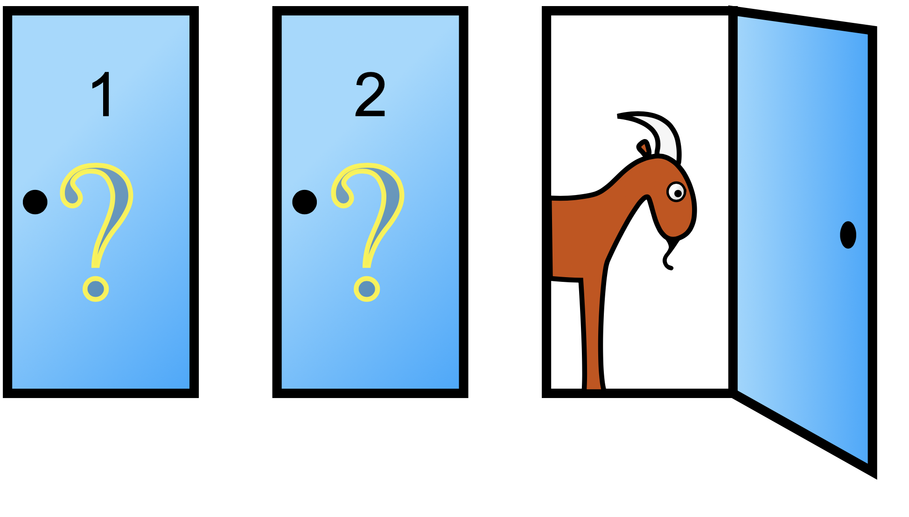
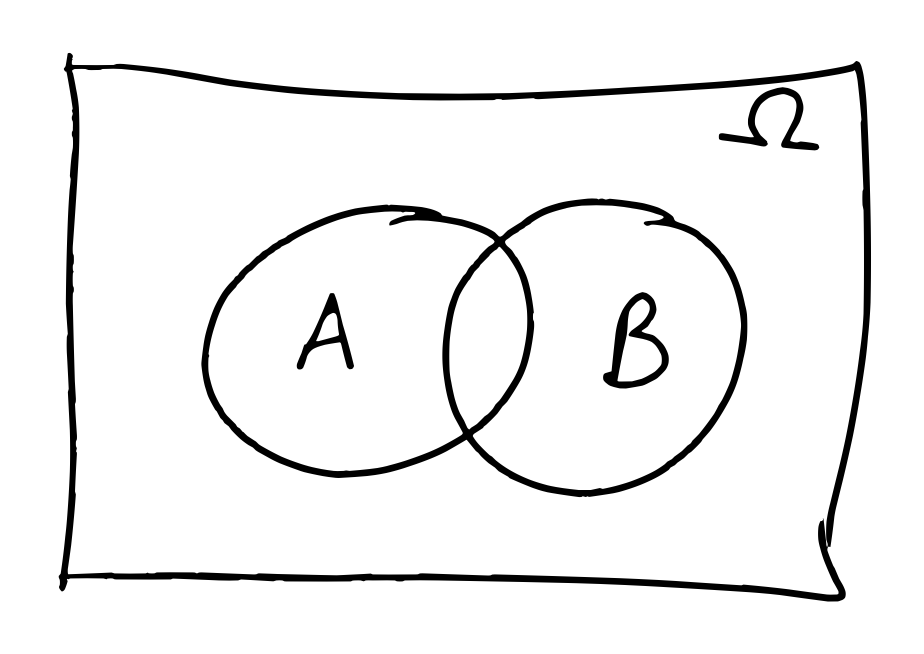
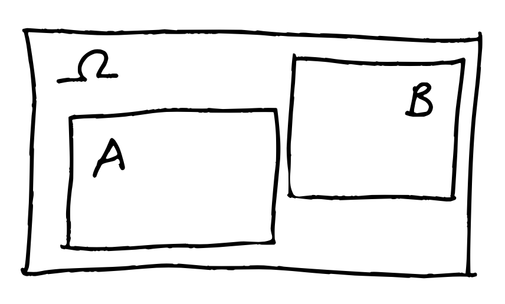

# Section 2: Introduction <!--{{{-->
<!--Setup {{{-->
```{r setup, include=FALSE}
rrepos <- getOption("repos")
rrepos["CRAN"] <- "https://cloud.r-project.org"
options(repos=rrepos)
options(width=100)
library(magicaxis)
knitr::opts_chunk$set(echo = TRUE)
knitr::opts_chunk$set(tidy = FALSE)
knitr::opts_chunk$set(class.output = "out")
knitr::opts_chunk$set(out.width="50%")
knitr::opts_chunk$set(fig.align="center")
#knitr::opts_chunk$set(fig.asp=1)
knitr::knit_engines$set(python = reticulate::eng_python)  
par(mar=c(3,3,1,1))
set.seed(666)
```
```{css, echo=FALSE}
.python { 
  background-color: 
    RColorBrewer::brewer.pal(1,"Set2");
} 
.out { 
  max-height: 300px;
  overflow-y: auto;
  background-color: inherit;
}
```
<!--}}}-->

**Section 2: Probability & Decision Making (Weeks 3-5)**

For all aspects of modern science, an understanding of probability is required.
We cover a range of topics in probability, from decision theory and the
fundamentals of probability theory, to standard probabilistic distributions and
their origin. From this module, students will gain an insight into different
statistical distributions that govern modern observational sciences, the
interpretation of these distributions, and how one accurately models
distributions of data in an unbiased manner.

Topics include:

> + Decision theory
> + Fundamentals of probability
> + Statistical distributions and their origins

<!--}}}-->

# The Birthday Problem (Question) <!--{{{-->

How many people do you need to have in a room before there is a more than $50\%$ chance that at least two will share a
birthday? 

<!--}}}-->

# A Game Show (Question) <!--{{{-->

Suppose you're on a game show, and you're given the choice of three doors: 

> + Behind one door is a car. 
> + Behind the other two doors are goats. 
> + **IMPORTANT:** you want the car.
> + You pick a door: say No. $1$
> + The host of the game show, who knows what's behind every door, opens one of the other doors, say No. $3$, which
has a goat behind it. 
> + He then says to you, "Do you want to pick door No. $2$?" Is it to your advantage to switch your choice? 
> + **ACTUALLY IMPORTANT**: In this version of the problem the host _always_ opens a door which isn't yours _and_ which
    has a goat. 



<font size="2"> Image credit: <a href="https://commons.wikimedia.org/w/index.php?curid=1234194">Cepheus</a> </font>

<!--}}}-->

# Picking up where we left off <!--{{{-->

In the last lecture, we discussed a few important ideas that lead to the concept of probability, independence, and
`paradoxes' like the gamblers fallacy. Some of these concepts will be important to our development over this lecture, 
and so are worth revising before the beginning of this lecture. 

<!--}}}-->

## Outcomes, Events, Sample Spaces <!--{{{-->

Assume we have an experiment where we flip a fair coin twice. The **outcomes** of the coin tosses are the possible 
observations (sets of Heads or Tails) that we make from our experiment. The collection of all outcomes is
the **sample space**:  

$$\Omega = \{ HH, HT, TH, TT \} $$

An **event** is a collection of outcomes, such as the event that I see one head
and one tail: 

$$\mathcal{E} = \{ HT, TH \}.$$ 

<!--}}}-->

## Probability Calculations  <!--{{{-->

We demonstrated that the frequency of observations is related to the probability
of each outcome in the limit of large numbers of observations: 

$$
P(A)=\lim_{N\to\infty}\frac{\#(A)}{N}_{}.
$$

This consideration led to the definition of a few probability laws based around
individual outcomes $A_i \in \Omega$: 

> + $0 \leq P(A_i) \leq 1$: Probabilities must be between $0$ (impossible) and $1$ (guaranteed). 
> + $\sum_{A_i \in \Omega} P(A_i) = 1$: The sum of all possible outcomes must be $1$ (guaranteed). 

<!--}}}-->

## Independence  <!--{{{-->

We discussed the concept of independence, with particular focus on how
independent events can fool your intuition. 

> + People often underestimate how improbable sequences of independent events are. 
> + People often reason poorly about independent outcomes because of a subconscious 
    belief that previous outcomes should influence future ones (the gamblers fallacy). 

<!--}}}-->

## Visualisations of Probabilities and Sets <!--{{{-->

We presented two methods of visualising probabilities (and sequences of probabilistic events): 

> + the urn model; and
> + the probability tree. 

<!--}}}-->

## The Urn model  <!--{{{-->

The urn model is a simple way of visualising probabilistic events. 


We discussed the urn model last week in the context of the **R** `sample` function, which can be 
used to simulate random probabilistic events (such as a dice roll or a coin toss). 

<!--}}}-->

## The Probability Tree  <!--{{{-->

We can visualise the above draws from our urn using the probability tree as well: 

```{r, fig.height=4, fig.width=6, out.width='80%', eval=TRUE}
library(DiagrammeR)
mermaid("
  graph LR
    Start --> S[S, P=0.66]
    Start --> W[W, P=0.33]
    W --> WW[W, P=0.33]
    W --> WS[S, P=0.66]
    S --> SW[W, P=0.33]
    S --> SS[S, P=0.66]
    WW --> WWout[WW, P=0.11]
    WS --> WSout[WS, P=0.22]
    SW --> SWout[SW, P=0.22]
    SS --> SSout[SS, P=0.44]
")
```
<!--}}}-->

# Venn Diagrams  <!--{{{-->

One visualisation tool that we didn't look at last week, but which is sometimes 
very useful to understand, is the Venn diagram. 



Thinking again about our urn, we have: 


<!--}}}-->

## Independence  <!--{{{-->

Two events in an experiment sample space ($A,B\in\Omega$) are independent. 
How do they appear in our Venn diagram? 




+ The first plot shows two **disjoint** events. That is: if we observe $A$, then we cannot observe $B$. Therefore they 
  cannot be independent, as information about $A$ informs us about $B$. 
+ The second plot shows two **independent** events. If we observe $A$, our probability of observing $B$ is relatively unchanged. 

The latter point is a nuanced one, and it is worth understanding. The probability of observing $A$ and $B$ in our Venn diagram is equal, 
because they cover equal fractions of the sample space. If we observe $A$, our observation now restricts us to the box containing $A$ only. 
But $A$ and $B$ are independent, which means that the observation of $A$ can't inform us about $B$. So the probability of observing $B$ must 
be relatively unchanged. That is, the intersection of B and A $(A\cap B)$ must occupy the same fraction of $A$ as $B$ occupies in $\Omega$.  

+ $P(A\cap B)/P(A) = P(B)/P(\Omega)$

Remember, though, that $$P(\Omega)=1$$ and therefore 

+ $P(A\cap B) = P(A)\times P(B)$ if $A$ and $B$ are independent. 

<!--}}}-->

# Independence and Non-independence   <!--{{{-->

Independent events are extremely important in statistics, especially in the context of random variables (which we will 
discuss later in this section). 
However non-independent events are also extremely important. These are cases where a subsequent outcome is dependent 
on the previous results. An obvious example is returning to our **urn**: 


Here our draws are independent, and computing the probability of the observed outcome is straightforward (that is, the 
joint probability of observing a $2$ and then an $8$):

$$
\begin{aligned}
P(2\cap 8) &= P(2)\times P(8) \\
&= \frac{1}{8}\times \frac{1}{8} \\
&= \frac{1}{64}
\end{aligned}
$$

However, how does this change if we choose not to replace the first ball that we draw? 


<!--}}}-->

# Conditional Probability <!--{{{-->

This is where the concept of **conditional probability** becomes relevant. Given a sample space $\Omega$ 
of outcomes and a collection of events, the conditional probability of B, conditioned on A, is the probability 
that B occurs given that A has definitely occurred

$$
P(B|A)
$$

With our urn example, if we do not replace the $2$ after our first draw, this has fundamentally altered the 
possible outcomes of the next draw, and therefore changed the probabilities involved. For our second draw, what now want
to know is the probability of observing an $8$ _given that_ we just observed a $2$. 
Said differently, the second draw computes the probability of observing an $8$ _conditioned upon_ our 
prior observation of a $2$. 

In this example we can compute the conditional probability logically: 


$$
\begin{aligned}
P(2\cap 8) &= P(2)\times P(8|2) \\
&= \frac{1}{8}\times \frac{1}{7} \\
&= \frac{1}{56}. 
\end{aligned}
$$

This example is a very trivial one, but consider a slightly different calculation. 

Suppose we draw two balls from our urn, with replacement. We want to calculate the probability of drawing two balls with
a combined value greater than or equal to 10. 

The "win" event space is therefore: 

$$
\begin{aligned}
\mathcal{E}=\{ & 8+2,8+3,8+4,8+5,8+6,8+7,8+8,\\
               & 7+3,7+4,7+5,7+6,7+7,7+8,\\
               & 6+4,6+5,6+6,6+7,6+8,\\
               & 5+5,5+6,5+7,5+8,\\
               & 4+6,4+7,4+8,\\
               & 3+7,3+8,\\
               & 2+8\}. 
\end{aligned}
$$

There are 64 possible ways of drawing $2$ balls from a bag of $8$ with replacement, which means that we have a $7/16$ chance
of winning this game. However, suppose now that we **know** that our first draw is an
$8$. How does this information influence our chance of winning? 

If we first observe an $8$, there are $7$ subsequent draws which will earn us a victory: 

$$ 
\mathcal{E}|8 = \{ 8+2,8+3,8+4,8+5,8+6,8+7,8+8 \} 
$$

Therefore the probability of winning given our first draw is an $8$ jumps to $P(\mathcal{E}|8)=7/8$. What about if we **know** that our 
first draw is a $2$? 

$$ 
\mathcal{E}|2 = \{ 2+8 \} 
$$

And so our probability of winning is a lowly $P(\mathcal{E}|2)=1/8$. With this simple example we can see how important
conditional probability is, and how event probabilities can be wildly influenced by different conditionalisation. 

<!--}}}-->

## The Probability Tree (again) <!--{{{-->

The conditional probability can be usefully read-off of a probability tree as well, which (for discrete problems) can be
very useful. 

Looking again at our urn problem: 

```{r, fig.height=4, fig.width=6, out.width='80%', eval=TRUE}
library(DiagrammeR)
mermaid("
  graph LR
    Start --> S[S, P=0.66]
    Start --> W[W, P=0.33]
    W --> WW[W, P=0.33]
    W --> WS[S, P=0.66]
    S --> SW[W, P=0.33]
    S --> SS[S, P=0.66]
    WW --> WWout[WW, P=0.11]
    WS --> WSout[WS, P=0.22]
    SW --> SWout[SW, P=0.22]
    SS --> SSout[SS, P=0.44]
")
```
we can see that the conditional probability of drawing (e.g.) no striped ball is: 

$$
P({WW})=0.33
$$

However the probability of observing no striped ball _given_ that we observe a white ball with our first draw: 

$$
P(WW | W)  = \frac{P(WW)}{P(WW) + P(WS)}
$$

<!--}}}-->


# The Birthday Problem (Answer) <!--{{{-->

How many people do you need to have in a room before there is a more than $50\%$ chance that at least two will share a
birthday? 

The birthday problem is another example of a statistical paradox; a problem where your intuition will almost certainly 
have failed you. 

To calculate the number of people required to have a $50\%$ chance that two share a birthday is quite simple. First we
make some simplifying assumptions: 

> + There are 365 days in a year 
> + Birthdays are totally random 

Neither of these are true: but the former has a small affect, and the latter makes our answer an _over-estimate_ of the
number of people required, because birthdays tend to cluster around particular times of the year. 

The probability of finding two people with a shared birthday is: 

$$
P(\textrm{shared birthday}) = 1-P(\textrm{no shared birthday}) 
$$

Calculating the probability of people _not_ sharing a birthday is easier, because it's 
a simple conditional probability. The probability of each additional person not sharing 
a birthday depends on the number of previous observations. 

$$
\begin{aligned}
P(\textrm{no shared birthday}) = &P(\textrm{person 1 has a birthday})\times \\
&P(\textrm{person 2 has a birthday different from person 1})\times \\
&P(\textrm{person 3 has a birthday different from persons 1 and 2})\times \dots \\
= & P(\textrm{no shared birthday}|\textrm{0 other birthdays})\times \\
  & P(\textrm{no shared birthday}|\textrm{1 other birthday})\times \\
  & P(\textrm{no shared birthday}|\textrm{2 other birthdays})\times\dots \\
= & \frac{365}{365}\times\frac{364}{365}\times\frac{363}{365}\times\frac{362}{365}\times\dots \\
= & \left(\frac{1}{365}\right)^n\times{365}\times{364}\times{363}\times\dots 
\end{aligned}
$$

We can then calculate this probability simply: 

<!--R CodeBlock Template-{{{-->
```{r, fig.height=4, fig.width=6, out.width='80%', eval=TRUE} 
magplot(1:100,1-(1/365)^(1:100)*cumprod(365:266),type='s',col='red',xlab='Number of People',
     ylab='Prob. of Two People Sharing')
abline(h=0.5,lty=2)
```
<!--}}}-->

Therefore, there needs to be only $23$ people in a group before there is a more-than-$50\%$ chance 
that two will share a birthday. This certainly sounds counter-intuitive, however this is because (again) 
our intuition isn't well suited to conditional inference. 

In this particular case, a common cause of incorrect inference is driven by a conflation between 
"any two people sharing a birthday" and "someone sharing the same birthday as _me_". The former 
represents a series of conditional probabilities, whereas the latter is a series of independent 
probabilities. 

The number of people required to be in a room so that the probability of someone sharing 
_your_ birthday is greater than $50\%$ is over $250$. Note that in that group, though, there 
will likely be others who will jointly share a birthday before you!

```{r, fig.height=4, fig.width=6, out.width='80%', eval=TRUE} 
magplot(1:300,1-(364/365)^(1:300),type='s',col='red',xlab='Number of People',
     ylab='Prob. of Someone Sharing YOUR Birthday')
abline(h=0.5,lty=2)
```

<!--}}}-->

# Computing Conditional Probability <!--{{{-->

We now want to derive an expression for the conditional probability $P(B|A)$. 

We can start with our venn diagram again: 


Our conditionalisation means that we know our probability must reside within $A$. 
We want to know $P(B|A)$: the probability that it lies within _both_ $A$ and $B\cap A$. 

If the outcome lies in $A$, then it must fall within either $A\cap B$ or $A\cap B^\mathcal{c}$. 
Therefore: 

$$
P(B|A)+P(B^\mathcal{c}|A)=1
$$

Additionally, we can use our link between probability and relative frequency to our advantage. 
If some outcome $C\cap A$ is $k$ times more likely than $B\cap A$, then $P(C\cap A)=kP(B\cap A)$. 
But crucially, this must be true regardless of whether $A$ is observed first or not (the order 
of observation doesn't change the relative positions of items in our venn diagram). So $P(C|A)=kP(B|A)$: 

$$
P(B|A) \propto P(B\cap A)
$$

To determine the coefficient of proportionality ($c$) we can use the above expressions: 

$$
\begin{aligned}
P(B|A)&=1-P(B^\mathcal{c}|A) \\
P(B|A)+P(B^\mathcal{c}|A)&=1 \\
P(B|A)+P(B^\mathcal{c}|A)&=cP(B\cap A)+cP(B^\mathcal{c}\cap A) \\
cP(B\cap A)+cP(B^\mathcal{c}\cap A)&=cP(A)=1 \\
\frac{P(B\cap A)}{P(A)}+\frac{P(B^\mathcal{c}\cap A)}{P(A)}&=1 
\end{aligned}
$$

and so: 

$$
P(B|A)=\frac{P(B\cap A)}{P(A)}.
$$

The intersection and the conditional probability are therefore very closely related. 
The probability of $B$ conditioned upon $A$ is the probability of $B$ _and_ $A$, divided 
by the total probability of $A$. Said differently; the intersection probability has range 
$0\leq P(B\cap A)\leq P(A)$, while the conditional probability has the range $0\leq P(B|A)\leq 1$. 

This can be a guide as to how to think about the intersection (i.e. $P(B \cap A)$) and the conditional probability. 
The former provides a probability in the _absence_ of any additional information/observations. The 
conditional probability, however, provides probability based on the _knowledge_ that we have already 
made some observation. 

We can use our Venn diagrams again to learn about conditional probability and independence: 


We can use this formula to infer the conditional probability $P(B|A)$ in these two scenarios. 
Clearly on the left the intersection is 0: $P(B\cap A)=0$. And therefore the conditional probability 
is also zero. On the right, recall that we asserted that these events were independent, and therefore 
had the same fractional area of intersection between $(A$ and $B)$ and $(B$ and $\Omega)$: 

> + $P(B\cap A)/P(A) = P(B)$

But notice now that the LHS of this equation is just the conditional probability $P(B|A)$. So: 

> + $P(B|A)=P(B)$ for independent events

That is, if events are independent, conditionalisation doesn't have any impact (which makes sense!). 

Lastly, there is one additional (very important!) observation we can make. Given that the intersection of 
two probabilities is unchanged under ordering: $P(B\cap A)=P(A\cap B)$, this means that: 

$$
\begin{aligned}
P(B|A)&=\frac{P(B\cap A)}{P(A)} \\
P(A|B)&=\frac{P(A\cap B)}{P(B)} \\
\therefore P(B|A)&= \frac{P(A|B)P(B)}{P(A)} 
\end{aligned}
$$

This turns out to be an extremely valuable relationship known as **Bayes Rule**, and it will form the basis 
of the _majority_ of the second half of this course!

<!--}}}--> 

# Playing Poker <!--{{{-->

Let's have a break now and play some poker. We will start with a simple version of the game: 

> + The game is played with a standard 52 card deck 
> + You are dealt $5$ cards, all face down 

What is the probability that you are dealt a royal flush (AKQJ10 in one suit)? 

To compute the number of $k$ possible combinations of $N$ possible outcomes _when ordering does not matter_ we can use 
combinatorics: 

$$
\frac{N!}{k!(N-k)!} = {N \choose k}
$$

The number of possible royal flush hands (ignoring the order) is 4: one for each suit. 
The number of possible $5$ card hands (ignoring the order) is: 

$$
{52 \choose 5 } = 2\,598\,960
$$

Therefore the probability of being dealt a royal flush in our game of poker is: 

$$
P(\textrm{royal flush}) = \frac{4}{2\,598\,960} = \frac{1}{649\,740}.
$$

Let's say now, though, that you are dealt your five card hand and the fifth card lands face-up. It is a $4$ of diamonds. 

What is the conditional probability that you have a royal flush ($P(\textrm{royal flush}|4\diamondsuit)$)

Your sloppy dealer makes the same mistake a second time, but this time the card which lands face-up is the ace of
spades. What is the conditional probability that you have a royal flush ($P(\textrm{royal flush}|A\spadesuit)$)

Let's define some events:

> + $A$ is the event that the last card you get is the ace of spades _and_ you get a royal flush
> + $B$ is the event that the last card you get is the ace of spades

The conditional probability of $A$ given $B$, from our formula, is: 

$$
P(A|B)=\frac{P(A\cap B)}{P(B)}.
$$

$P(B)$ is easy to compute; the $A\spadesuit$ is just a normal card in the deck. $P(B)=\frac{1}{52}$. 
The joint probability of getting the ace of spades and having a royal flush is: 

$$
\frac{\textrm{the number of royal flushes where the last card is}\,A\spadesuit}{\textrm{total number of 5 card hands}}
$$

The numerator is simply the number of ways of drawing the spade royal flush while ensuring that the $A\spadesuit$ is 
the last card drawn: $4\times3\times2\times1$. The denominator is just the number of available combinations of $5$ cards: 
$52\times51\times50\times49\times48$. So: 


$$
P(\textrm{royal flush}|A\spadesuit)=\frac{1}{249\,900}. 
$$

So seeing the Ace makes a big difference, but you still probably wouldn't want to bet the house... 

<!--}}}--> 

# The Prosecutors Fallacy <!--{{{-->

Reasoning logically with conditional probabilities is difficult. 

One prominent logical fallacy that happens with statistics is known as the prosecutors fallacy. This is the implicit assumption 
that conditional probabilities are reversible. 

A prosecutor at court presents evidence $\mathcal{E}$. They argue that the defendant is guilty because the probability
of finding the evidence given innocence $P(\mathcal{E}|\mathcal{I})$ is small. But this is totally irrelevant. The real
question is what is the probability that the defendant is innocent given the evidence: $P(\mathcal{I}|\mathcal{E})$. 

The distinction is relevant, because the conditionalisation can have vastly different outcomes (one can be very large
while the other is very small). 

We can relate these quantities with our formula from earlier: 

$$
\begin{aligned}
P(\mathcal{I}|\mathcal{E}) &= \frac{P(\mathcal{E}|\mathcal{I})P(\mathcal{I})}{P({\mathcal{E})}} \\
&=\frac{P(\mathcal{E}|\mathcal{I})P(\mathcal{I})}{P(\mathcal{E}|\mathcal{I})P(\mathcal{I})+P(\mathcal{E}|\mathcal{I^\mathcal{c}})P(\mathcal{I^\mathcal{c}})}
\end{aligned}
$$

The assumed similarity between $P(\mathcal{I}|\mathcal{E})$ and $P(\mathcal{E}|\mathcal{I})$ is clearly violated if
$P(\mathcal{I})$ is large, or if $P(\mathcal{E}|\mathcal{I^\mathcal{c}})$ is much smaller than
$P(\mathcal{E}|\mathcal{I})$. 

This may seem familiar to you from last week, when we discussed the DNA matching problem. In that example, we considered
independence between the failures in the database. This leads to another damaging possibility: treating truly
conditionally dependent events as independent. 

## In Summary

Always be careful about your reasoning regarding conditional probability and about independent events. These lead to 
logical fallacies that can completely negate the accuracy of your work. Always ask yourself two fundamental questions: 

> + What am I interested in: $P(A|B)$? or $P(B|A)$? 
> + Am I modelling possibly dependent events as independent? 

Consider this trivial example: 

> + What is the conditional probability of winning the lottery given that you buy a ticket? 
> + What is the conditional probability of having bought a ticket given that you win the lottery? 

<!--}}}-->

# The Monty Hall Problem <!--{{{-->

Suppose you're on a game show, and you're given the choice of three doors: 

> + Behind one door is a car. 
> + Behind the other two doors are goats. 
> + **IMPORTANT:** you want the car.
> + You pick a door: say No. $1$
> + The host of the game show, who knows what's behind every door, opens one of the other doors, say No. $3$, which
has a goat behind it. 
> + He then says to you, "Do you want to pick door No. $2$?" Is it to your advantage to switch your choice? 
> + **ACTUALLY IMPORTANT**: In this version of the problem the host _always_ opens a door which isn't yours _and_ which
    has a goat. 


<font size="2"> Image credit: <a href="https://commons.wikimedia.org/w/index.php?curid=1234194">Cepheus</a> </font>

We want to know the conditional probability that there is a car behind door $1$ given we now know that there is a goat
behind door $3$. 

$$
P(C_1|G_3)= \frac{P(G_3|C_1)P(C_1)}{P(G_3|C_1)P(C_1)+P(G_3|C_2)P(C_2)+P(G_3|C_3)P(C_3)}
$$

To work this out, we need to know $P(G_3|C_1)$, $P(G_3|C_2)$, and $P(G_3|C_3)$. That is, the probability that the 
host chose to show us the goat behind door 3, given the three possible locations of the car: 

> + $P(G_3|C_3)=0$, because there cannot be both a goat and a car behind door 3.
> + $P(G_3|C_1)=\frac{1}{2}$, because the host can choose randomly from the two doors with goats behind them. 
> + $P(G_3|C_2)=1$, because there is only one door that (a) has a goat behind it and (b) isn’t the door we picked. 

We can substitute these values into the formula, and we find: 

$$
P(C_1|G_3)=\frac{1}{3}.
$$

**What?!**

This means that, given the parameters of the game show, it is in your interest to switch doors. How can this be?

To understand this we can use the tools that we've compiled over the course of the last two lectures. Firstly, this is
what a probability tree for this problem looks like, where we only show the branches that produce the relevant outcomes:

```{r, fig.height=4, fig.width=6, out.width='80%', eval=TRUE, echo=FALSE}
mermaid("
  graph LR
    Door1 --> G1[G1, P=0.5]
    Door1 --> G2[G2, P=0.5]
    G1 --> G1Show3[Show3, P=1]
    G2 --> G2Show3[Show3, P=0.5]
    G1Show3 --> Car2[Car2, P=0.5]
    G2Show3 --> Car1[Car1, P=0.25]
")
```

This shows that the total conditional probability of the car being behind door $1$ is $P=0.25$, whereas the conditional
probability of the car being behind door $2$ is $P=0.5$. Hence our ratio of probabilities being $1/3$. 

This is not an intuitive result! However, you can begin to understand how the result comes about by considering some
extreme examples. 

Consider a circumstance where there are $100$ doors rather than $3$. In this scenario, the game-show host opens not just one 
"wrong" door, but $98$. In this circumstance, the initial probability that you picked the correct answer was $1/100$, and 
now the host _knowingly_ discarded $98$ wrong doors. Does your intuition tell you that it makes more sense to switch now? 

<!--}}}-->

# Anomaly detection <!--{{{-->

The last discussion that we will have in this section on conditional probability is regarding the difficulty of anomaly
detection: that is, why it's difficult to reliably detect rare events. 

There are many cases in Astronomy and Physics where anomaly detection is interesting/desirable. Discovering new and
rare phenomena is an obvious example, be they exotic particles in a detector or exotic transients in the universe. 

When discussing accuracy of detection it is worth understanding the different types of result: 
```{r, fig.height=4, fig.width=6, out.width='80%', eval=TRUE, echo=FALSE}
print(data.frame('Compare'=c('Measured-True','Measured-False'), 'Reality-Positive'=c('True Positive', 'False Negative (Type II)'), 'Reality-Negative'=c('False Positive (Type I)', 'True Negative')))
```
The "Types" are included because these names are sometimes used for specific types of failures. 

The difficulty in anomaly detection arises because, as an event becomes rare, the accuracy of tests required to minimise
false positives (Type 1) becomes prohibitively large. 

Let's consider two examples: detecting a common event, and detecting a rare event, with an experiment of fixed accuracy. 

## A common event

A decay process occurs in nature with probability $0.4$. You have an experiment that detects this emission with a
probability of $0.6$, and produces a false positive with probability $0.1$. What is the conditional probability that you
witness a true decay _and_ the experiment produces a positive detection?

```{r, fig.height=4, fig.width=6, out.width='80%', eval=TRUE, echo=FALSE}
print(data.frame('Compare'=c('Positive Detection','Negative Detection'), 'True Decay'=c(0.6, 0.4), 'No Decay'=c(0.1, 0.9)))
```

Let $\mathcal{d}$ be the event that a true decay occurs, and $\mathcal{P}$ be the event that the experiment produces a 
positive detection. 

$$
\begin{aligned}
P(\mathcal{d}|\mathcal{P})&=\frac{P(\mathcal{P}|\mathcal{d})P(\mathcal{d})}{P(\mathcal{P})} \\
&=\frac{P(\mathcal{P}|\mathcal{d})P(\mathcal{d})}{P(\mathcal{P}|\mathcal{d})P(\mathcal{d}) + P(\mathcal{P}|\mathcal{d^c})P(\mathcal{d^c})} \\
&=\frac{0.6\times 0.4}{0.6\times 0.4 + 0.1\times 0.6} \\
&=0.8 
\end{aligned}
$$

So your experiment only has to be approximately accurate to produce reliable detections when the event it common. 

## A rare event

Let's now consider a similar scenario, except the probability of our decay occurring in nature is very small:
$P(\mathcal{d})=0.001$. The experiment, though, has improved to $99.9\%$ accuracy, and only $1\%$ false-positive rate. 

```{r, fig.height=4, fig.width=6, out.width='80%', eval=TRUE, echo=FALSE}
print(data.frame('Compare'=c('Positive Detection','Negative Detection'), 'True Decay'=c(0.999, 0.001), 'No Decay'=c(0.01, 0.99)))
```
Again we compute our probability that we actually detected the event: 

$$
\begin{aligned}
P(\mathcal{d}|\mathcal{P})&=\frac{P(\mathcal{P}|\mathcal{d})P(\mathcal{d})}{P(\mathcal{P})} \\
&=\frac{P(\mathcal{P}|\mathcal{d})P(\mathcal{d})}{P(\mathcal{P}|\mathcal{d})P(\mathcal{d}) + P(\mathcal{P}|\mathcal{d^c})P(\mathcal{d^c})} \\
&=\frac{0.999\times 0.001}{0.999\times 0.001 + 0.01\times 0.999} \\
&=0.09 
\end{aligned}
$$

So despite our experiment becoming much much more accurate, the probability that we make a true detection is less than
10%. Said differently, $10$ out of every $11$ detections will be false. 

```{r, fig.height=4, fig.width=6, out.width='80%', eval=TRUE, echo=FALSE}
mermaid("
  graph LR
    Start --> Decay[Decay, P=0.001]
    Start --> NoDecay[No Decay, P=0.999]
    Decay --> D_Exp_Pos[Experiment Detection, P=0.999]
    NoDecay --> nD_Exp_Pos[Experiment Detection, P=0.01]
    D_Exp_Pos --> NobelPrize[Nobel Prize, P=0.000999]
    nD_Exp_Pos --> IgnobelPrize[Ignobel Prize, P=0.00999]
")
```

<!--}}}-->


