# Section 4: Introduction <!--{{{-->
<!--Setup {{{-->
```{r setup, include=FALSE}
rrepos <- getOption("repos")
rrepos["CRAN"] <- "https://cloud.r-project.org"
options(repos=rrepos)
options(width=100)
library(magicaxis)
knitr::opts_chunk$set(echo = TRUE)
knitr::opts_chunk$set(tidy = FALSE)
knitr::opts_chunk$set(class.output = "out")
knitr::opts_chunk$set(out.width="50%")
knitr::opts_chunk$set(fig.align="center")
#knitr::opts_chunk$set(fig.asp=1)
knitr::knit_engines$set(python = reticulate::eng_python)  
par(mar=c(3,3,1,1))
set.seed(666)
```
```{css, echo=FALSE}
.python { 
  background-color: 
    RColorBrewer::brewer.pal(1,"Set2");
} 
.out { 
  max-height: 300px;
  overflow-y: auto;
  background-color: inherit;
}
```

**Parameter Simulation, Optimisation, & Inference**

(or "Applying statistics in modern scientific analyses")

We apply our understanding of Bayesian statistics
to the common problems of parameter simulation, optimisation, and inference.
Students will learn the fundamentals of hypothesis testing, quantifying
goodness-of-fit, and parameter inference. 
We discuss common errors in parameter inference, including
standard physical and astrophysical biases that corrupt statistical analyses.
<!--}}}-->

<!--}}}-->

# Bayesian Modelling <!--{{{-->

The previous examples of how to calculate model preferences is all well and good, 
but this is where the magic happens. 

Because there is some uncertainty in expressing/specifying any single model: 
$$
f(\theta,x)=f(x|\theta)f(\theta)
$$
we can instead construct a single model that we define as being the union of 
all alternative models that we might wish to entertain. We will then provide 
a prior over the suite of encompassed models. 

Take an example where we have two models that we think might be appropriate 
for our dataset, both of which fall within the general "Gamma" family of 
distributions. 

Recall that the Gamma family of distributions all take the format: 
$$
f(x|\alpha,\beta,\gamma)=\frac{\gamma\beta^\alpha}{\Gamma(\alpha)}x^{\alpha\gamma-1}\exp\left(-\beta x^\gamma\right)
$$
Our two hypothesised models are a Weibull distribution: 
$$
f_1(x|\beta,\gamma)=\gamma\beta x^{\gamma-1}\exp\left(-\beta x^\gamma\right)
$$
and a two-parameter Gamma distribution: 
$$
f(x|\alpha,\beta)=\frac{\beta^\alpha}{\Gamma(\alpha)}x^{\alpha-1}\exp\left(-\beta x\right)
$$
We can analyse these two models in the same way as previously. Require that these 
two hypotheses be exhaustive ($P(m_1)=1-P(m_2)$), and formulate the values 
of $\alpha,\beta,\gamma$.  

However, we could alternatively specify a single **encompassing** model that is 
just a generalised gamma distribution. This distribution contains both of the 
previous $2$ models _and many many more_. Nominally it is no more or less 
sensible to formulate our model comparison using priors on $\alpha,\beta,\gamma$ 
instead of on $m_1,m_2$, and we can construct priors that recover the behaviour 
of having only the two models in any case: 
$$
f(\alpha,\beta,\gamma)=
\begin{cases}
f(\alpha,\beta,\gamma) & \textrm{if}\;\; \alpha=1 \\
f(\alpha,\beta,\gamma) & \textrm{if}\;\; \gamma=1 \\
0 & \textrm{otherwise} \\
\end{cases}
$$

<!--}}}-->

# What did we just do? <!--{{{-->

We just demonstrated that we can perform model comparison within the bayesian 
framework by specifying a generic model and providing priors on the parameters 
that govern that model. In this way, the likelihood that we specified was 
general: we didn't pick particular values for the models in the likelihood, 
rather we specified a distribution of possible likelihoods and gave (possibly 
broad) priors on the variables that govern the distribution of possible models. 

This leads us to an interesting class of models known (appropriately) as 
**Bayesian hierarchical models** (BHMs). 

<!--}}}-->

# Start small <!--{{{-->

As a demonstration of the power of BHMs, we're going to spend the remainder 
of this lecture demonstrating how we can take an initially simple model, and 
with few logical steps, can construct an much more complex model that has 
exceptional explanatory power. 

The dataset that we're going to explore today to demonstrate this process 
is one from the US, where $8$ high-schools reported on the possible benefits of 
giving students additional coaching prior to the SAT-V ("scholastic 
aptitude test - verbal") exams. 

Under randomisation, students at each school were given either extra coaching 
or not. SATs are designed to be resilient to short-term efforts, however all 
schools think that their program is useful/effective nonetheless. 

There's no prior reason to expect that any program is more or less effective 
than the others. 

## The data 

We have $J=8$ independent experiments, with coaching effects $\theta_j$ being 
judged by $n_j$ i.i.d. normally distributed observations $y_{ij}$, each with 
(assumed) known error variance $\sigma^2$. 

That is: 
$$
y_{ij}|\theta_j \sim N(\theta_j,\sigma^2),\;\; i=1,\dots,n_j;\;\; j=1,\dots,J
$$
The estimated effect of the coaching at each school is given by the mean $\bar{y}_j$, 
with the standard error on the estimate $\sigma_j^2$. 
$$
\bar{y}_j = \frac{1}{n_j}\sim_{i=1}^{n_j} y_{ij} \\
\sigma_j = \sqrt\frac{\sigma^2}{n_j}
$$

The likelihood for each $\theta_j$ can be expressed in terms of the sufficient 
statistic: 
$$
\bar{y}_{j}|\theta_j\sim N(\theta_j,\sigma_j^2)
$$

```{r, fig.height=4, fig.width=6, out.width='80%', eval=TRUE} 
dat<-data.frame(Estimated_Effect=c(28,8,-3,7,-1,1,18,12),
                Standard_Error=c(15,10,16,11,9,11,10,18))
rownames(dat)<-LETTERS[1:8]
print(dat)
```

# Methods of analysis 

```{r, fig.height=4, fig.width=6, out.width='80%', eval=TRUE} 
print(dat)
```

## Each to their own

There are multiple ways that we could approach the modelling of this dataset. 
The first option is to treat each experiment independently, as the data 
have been provided. We will call this the **separate** analysis. 

At first glance, there is a mixed-bag of results. Some schools show reasonably 
large effects ($\theta_j\geq 18$), some show small effects 
($0\leq \theta_j\leq 12$), and some show small negative effects. 

However, each estimate also has a large standard error. This makes it difficult 
to distinguish between the different results. The $95\%$ posterior credibility 
intervals for these results all significantly overlap. 

## All together now 

The large overlap between the individual credible intervals might suggest that 
all of the experiments are trying to measure the same underlying quantity. So 
we might prefer to assume that $\theta_j=\theta_0\;\forall j\in\{1,\dots,J\}$. 
That is, that all the values of $\theta_j$ are the same. Given this hypothesis, 
we can estimate the value of each $\theta_j$ using the **pooled** average 
$\bar{y}$. 

Said differently: assuming that all experiments have the same effect (and 
produce random independent estimates) then we can treat the $8$ experiments as a 
i.i.d. observations from the underlying truth, with known variances. 

We can estimate this quantity simply: 
$$
\bar{y} = \frac{\sum_{j=1}^J w_j\bar{y}_j}{\sum_{j=1}^J w_j} 
$$
where $w_j=1/\sigma^2_j$. 
```{r, fig.height=4, fig.width=6, out.width='80%', eval=TRUE} 
ybar<-with(dat,{ 
  weight<-1/Standard_Error^2
  return(sum(weight*Estimated_Effect)/sum(weight))
})
print(ybar)
```
The variance of this estimate is the inverse of the sum of the weights: 
$$
\textrm{var}(\bar{y}) = \frac{1}{\sum_{j=1}^J w_j} 
$$
```{r, fig.height=4, fig.width=6, out.width='80%', eval=TRUE} 
var_ybar<-with(dat,{ 
  weight<-1/Standard_Error^2
  return(1/sum(weight))
})
print(var_ybar)
```

So we have an estimate of $\theta_j\sim N(`r round(ybar,digits=2)`,`r round(var_ybar,digits=2)`)$. 

**Does this seem reasonable?**

Take the experiment at school A as a test case: 

+ In the independent analysis: $\hat{\theta}_1=28$ and $\hat{\sigma}_1=15$. 
+ In the pooled analysis: $\hat{\theta}_1=`r round(ybar,digits=2)`$ and 
$\hat{\sigma}_1=`r round(sqrt(var_ybar),digits=2)`$. 

Putting these results into words, the first estimate tells us that the probability 
of the true $\theta_j$ being greater than $28$ is $\frac{1}{2}$. However this is 
hard to reconcile with our third experiment, which has $\hat{theta}_3=-3$. 
Conversely, the latter estimate tells us that probability of the true $\theta_1$ is 
less than $-1$ is also $\frac{1}{2}$. This is similarly difficult to justify. 

## A Hierarchical Model 

We can display our two previous models as **directed acyclic graphs**: 

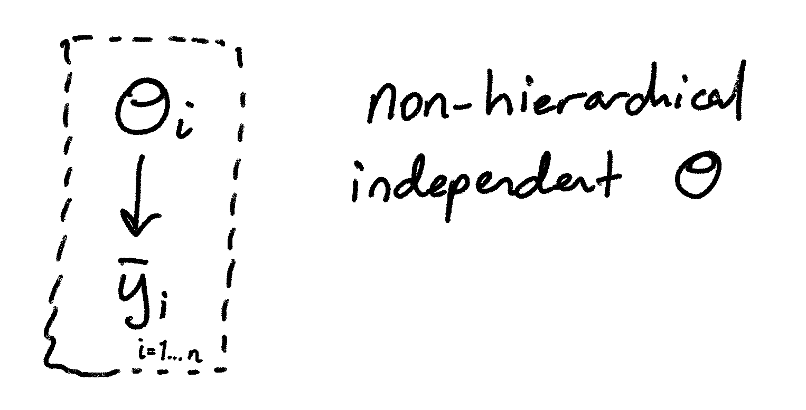
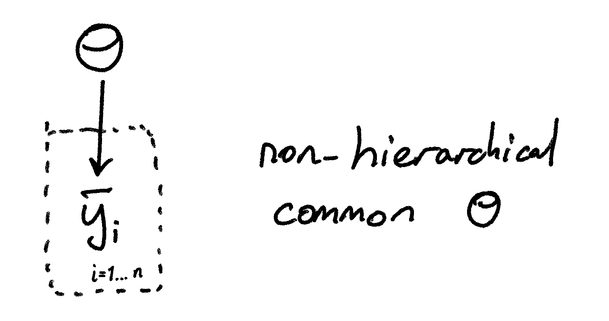

These show how the variable we observe ($\bar{y}_i$) is related to the 
parameter of interest $\theta$. In the first instance (i.e the separate 
estimates), we assumed that each school observed a totally independent 
$theta_i$. In the second case (i.e. the pooled estimate), however, 
we assumed that $\theta$ was a constant. 

Let's now instead assume that the values of $\theta_j$ are drawn from a normal 
distribution. The properties of the normal distribution we will determine with 
two **hyper-parameters** $(\mu, \tau)$. 

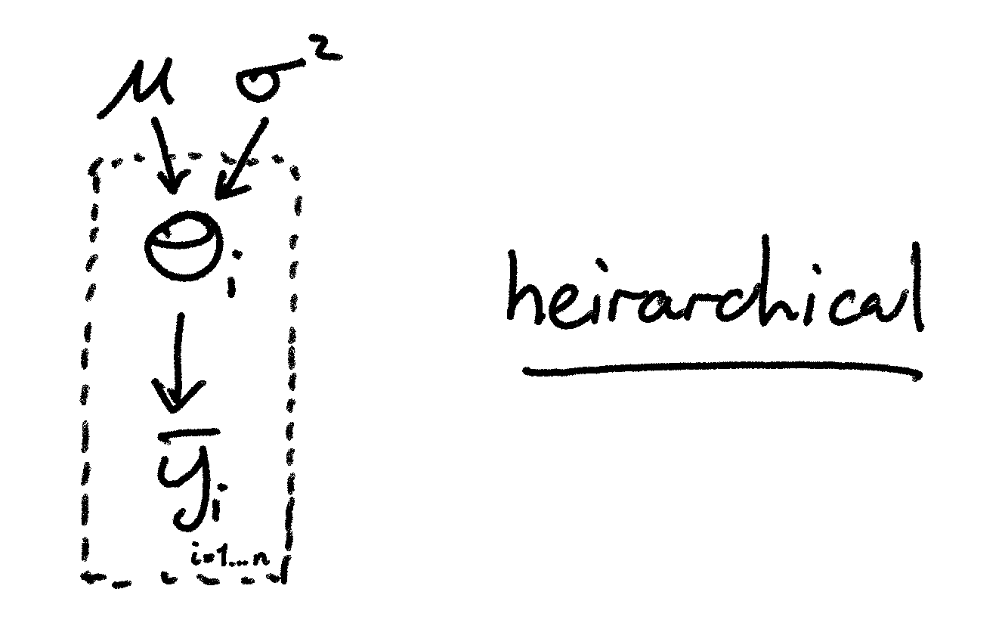

Mathematically, we are defining the joint probability of all our $\theta_i$ as 
the product of the probabilities of observing the data, given that 
each $\theta_i$ is drawn from a parent population $N(\mu,\tau)$. 
$$
\begin{align}
f(\theta_1,\dots,\theta_J|\mu,\tau) &= \prod_{j=1}^{J} N(\theta_j|\mu,\tau^2) \\
&=\int \prod_{j=1}^{J}\left[N\left(\theta_j|\mu,\tau^2\right)\right]f(\mu,\tau)\textrm{d}(\mu,\tau)
\end{align}
$$

This is a **hierarchical model**, which can interpret the $\theta_j$'s as being
randomly drawn from some shared parent distribution. Why is this useful?

There are physical reasons that you might expect this to be the case, but 
for now let's ignore those. We initially had the problem of determining whether 
or not to choose the independent or pooled estimate. However in our 
hierarchical model: 

1. As $\tau\rightarrow 0$: the $\theta_j$ values are drawn from a narrower and 
narrower range around $\mu$. In the limit, $\theta_j=\mu\;\forall j\in\{1,\dots,J\}$,
and so we have the **pooled estimate**. 
2. As $\tau\rightarrow \infty$: the $\theta_j$ values become independent of each other. 
That is, if we know $\theta_1$ with absolute certainty, this gives us no information 
about $\theta_2$. This is therefore the **independent/separate estimate**. 

For finite, non-zero values of $\tau$, our result will therefore be some 
**mixture** of the pooled and separate analyses. 

## Important implications

The smaller $\tau$, the more related are the individual values of $\theta_j$. 
This means that they contribute more to the estimates of $\theta_j$ for the other 
experiments: the experiments "borrow strength" from one-another. 

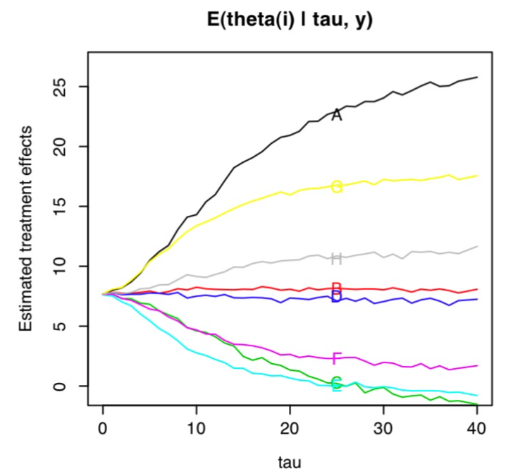
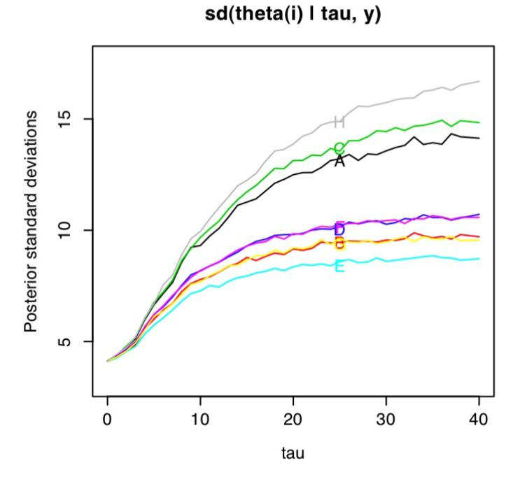

<!--}}}-->

# Building a model 

As our last exercise in Bayesian Hierarchical Models, we're going to build 
a complex hierarchical model from scratch, using nothing but logic. 

## Consider the following scenario

You have two passions in life: statistics, and watching videos of dogs on the 
internet. These passions are largely separated, until one-day when you discover 
the unbridled joy of televised dog shows...

# The Dog-show dataset 

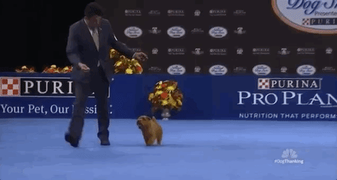


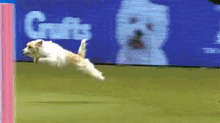

After an extensive period of time researching dog shows, you see a trend 
emerging. Some dogs, regardless of the level of training, seem to perform 
poorly in dog shows. From your extensive viewing... 

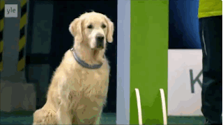

...your background research into historical dogs...

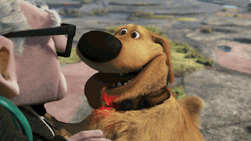

...and your detailed study of canine brain function during maturity...

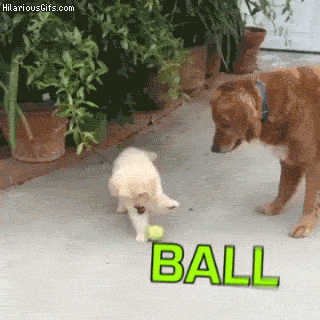

...you come to the conclusion that the systematically poor performance of 
some breeds of dog in these dog shows is attributable to **distraction**. 

You therefore come up with a simple statistical test. 
You observe the performance the performance of $17$ dogs in a dog show, which 
are either border collies ($n=11$) or golden retrievers ($n=6$). Each dog 
was monitored through a series of $30$ different tests, which were all reaction 
based: that is, faster reaction times equate to better scores. 

You now need to build a model for analysing the dogs results, and trying to 
determine whether or not there is a systematic difference between the two 
populations. 

# Modelling the Dog-show data

We want to know whether the reaction time of one portion of our sample is 
different (or more specifically: slower) than the other. 
Let's call our border collies sample $m_i=1$, and our golden retrievers $m_i=2$. 
The measured reaction time of dog $i$ from test $j$ is $y_{ij}$.  
We can start by making some very simple assumptions:

+ All dogs share a common uncertainty in reaction time $\sigma_y$; 
+ All collies share a common reaction time $\mu_1=\mu$;
+ All retrievers have a common slower reaction time $\mu_2=\mu+\beta$. 

That is: 
$$
y_{ij}\sim N(\mu,\sigma_y^2)\;\;\textrm{if}\;\;m=1 \\
$$
and
$$
y_{ij}\sim N(\mu+\beta,\sigma_y^2)\;\;\textrm{if}\;\;m=2 \\
$$

We can form this into a single model using an indicator variable $S_i$, which 
is:
$$
S_i=
\begin{cases}
0 & \textrm{if}\;\; m_i=1 \\
1 & \textrm{if}\;\; m_i=2 \\
\end{cases}
$$

This gives us the model: 
$$
y_{ij}|\phi\sim N(\mu+S_i\beta,\sigma_y^2), 
$$
where $\phi=(\mu,\beta,\sigma_y^2,S_i)$ is the list of model parameters. 

Using our graph, this model is: 

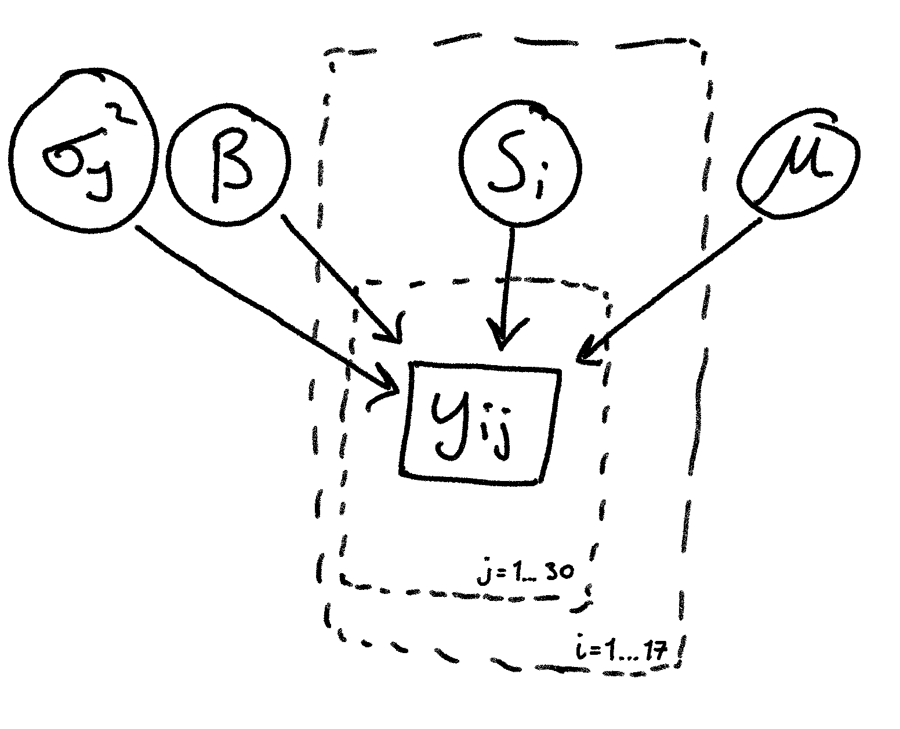

But is this a sensible model? Do we think that this will adequately capture 
all the complexities of the dataset? 

# Increased Complexity: Intra-breed variability

Let's develop our model further by removing the expectation that all dogs of 
the same breed will have the same mean reaction time. Instead, let's say that
all breeds of dog share a common _parent distribution_ of mean reaction times,
from which they are randomly drawn. That is: 

$$
\alpha_i|\phi\sim N(\mu+S_i\beta,\sigma_\alpha^2); \\
y_{ij}|\alpha_i,\phi \sim N(\alpha_i,\sigma_y^2);\\
\phi=(\mu,\sigma_\alpha^2,\beta,\sigma_y^2,S_i)
$$

We've therefore modified our graph: 

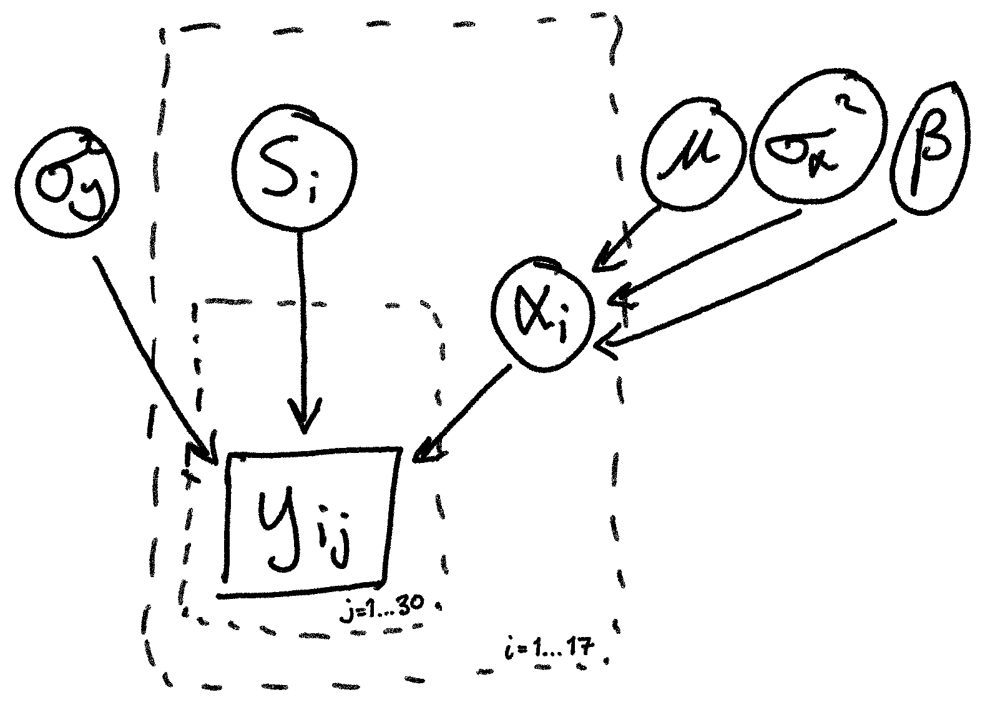

We now have a hierarchical model. Should we stop there? 

# The missing ingredient

Let's remind ourself of the problem at hand. We're trying to model the reaction
times of dogs in the show, based (currently) solely on the breed and a random
draw from the population of possible reaction times. Consider the evidence
though:


The performance here is clearly not driven by an innately slower reaction time, 
but by the fact that the dog was **distracted**. That distraction is currently 
not in our model. But we can add it fairly easily! 

Consider the model whereby only golden retrievers get distracted, and they get 
distracted with some probability $\lambda$. If distracted, their reaction time 
score is pathologically slowed by some amount $\tau$. We can formulate this 
using a single Binomial draw (i.e. a Bernoulli trial), which constructs an
indicator variable $z_ij$ to apply the catastrophic delay:
$$
\alpha_i|\phi\sim N(\mu+S_i\beta,\sigma_\alpha^2); \\
z_{ij}|\phi=
\begin{cases} 
0 & \textrm{if}\;\; S_i =0 \\
\textrm{Bin}(1,\lambda) & \textrm{otherwise} 
\end{cases}\\
y_{ij}|\alpha_i,z_{ij},\phi \sim N(\alpha_i+z_{ij}\tau,\sigma_y^2);\\
\phi=(\mu,\sigma_\alpha^2,\beta,\sigma_y^2,S_i,\tau,\lambda)
$$
Thus we reach our new model: 

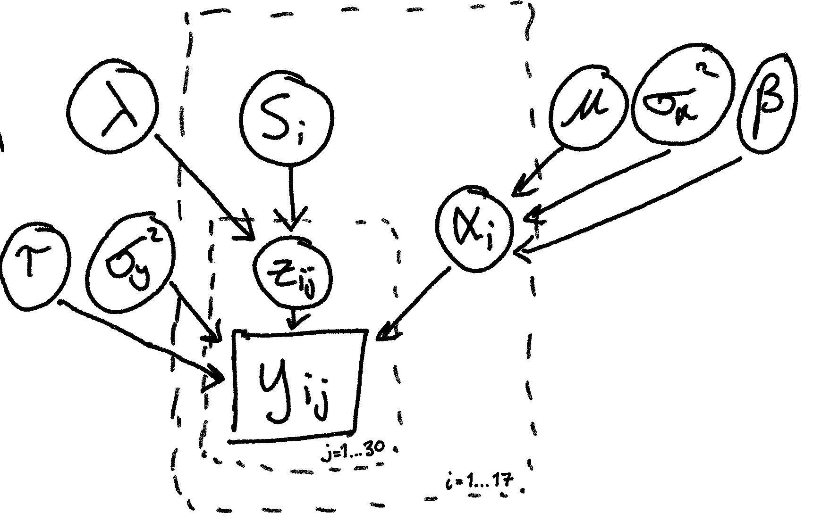

This model has the relevant parameters of most interest to us: 

+ $\beta$: the delay in reflexes for all golden retrievers 
+ $\lambda$: the proportion of retrievers that get pathologically distracted 
+ $\tau$: the amount of delay when pathologically distracted. 

And additional model variables: 

+ $\mu$: collie parent distribution reaction time mean 
+ $\sigma_y$: intrinsic reaction time dispersion for all dogs 
+ $\sigma_\alpha$: intrinsic dispersion in reaction time values per dog

And final indicator variables: 

+ $S_i$: determines if the $i^\textrm{th}$ dog is collie or retriever; 
+ $z_{ij}$: determines if the $i^\textrm{th}$ dog is a retriever who was distracted. 

# Take home points: the dog-show dataset

We started with an extremely simple model akin to: 


and with a few small steps came to a model with considerable complexity: 


This is a general lesson about BHMs. With the flexibility allowed by the framework, 
one can construct highly complex models with relative ease, sample over the 
parameters, and perform posterior inference. 

In our case, a posterior analysis of this dataset finds that

+ $\beta\approx 3$ sec; 
+ $\lambda\approx 0.55$; and
+ $\tau\approx 15$ sec. 

That is: Golden retrievers are, intrinsically as a population, only $3$ seconds 
slower in the trials than the border collies. However when they get distracted, 
they lose a whopping $15$ seconds. And most surprisingly: this happens $55\%$ of
the time. 

But one thing remains obvious: they're still good dogs. 

# Finishing up the course

To end the course, we're going to have an introduction to **Machine Learning** 
techniques. While these need not necessarily fall under the umbrella of 
"statistics" per-se, machine learning is a useful tool for data exploration 
and analysis. Additionally it involves many concepts that we've already 
covered, and will be of valuable use to you in your careers within and 
beyond academia. 

Our introduction to machine learning will be fairly brief, however hopefully 
will give you an understanding of the fundamentals such that you can efficiently 
explore the topic on your own afterwards. 

In this machine learning introduction, we will cover: 

> + Types of Machine Learning: supervised, unsupervised, and reinforcement 
> + Uses of Machine Learning 
> + Supervised Learning: The Neural Network
> + Unsupervised Learning: The Self-Organising Map 
> + Biases in Machine Learning

# Machine Learning: What is it? 

Machine learning is the study of a class of algorithms that improve themselves 
over time, by using their current state and the available data. 

## Types of machine learning

There are three main categories of machine learning methods: 

> + Supervised Learning
> + Unsupervised Learning 
> + Reinforcement Learning 

## Supervised learning 

**Supervised learning** maps some vectorised dataset onto some scalar data: 
$\vec{x}\mapsto y$. In essence, it is a form of regression that does not 
require us to specify a model. Examples include linear regression, random 
forests, and support vector machinery. 

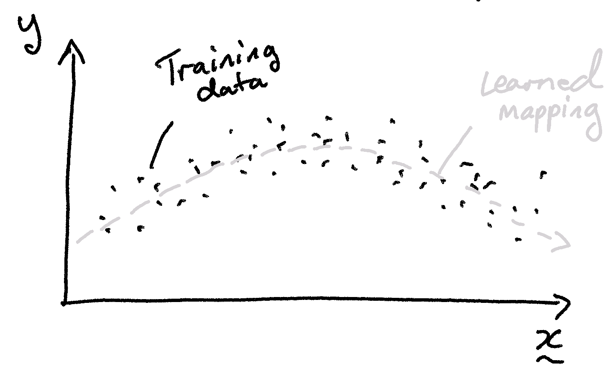

## Unsupervised learning 

**Unsupervised learning** has no required output: there is no $y$ to which we
are trying to map. Examples include SOM, PCA, and ICA. 

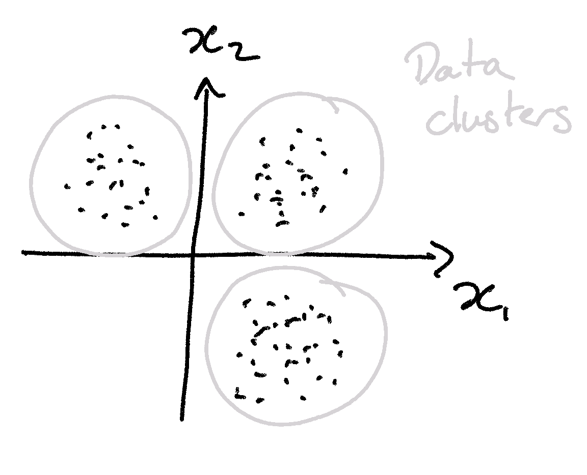

## Reinforcement learning (Not discussed here)

**Reinforcement learning** is a combination of both these methods. It invokes 
some method of generating data for use in achieving some pre-defined "goal", 
via some reward (e.g. lower variance, fewer outliers, etc). 


# Supervised Machine Learning: Artificial Neural Networks

**Artificial Neural Networks** are a common form of machine learning framework,
that are based on biological networks. In the method there are "neurons" that
link together and allow data to be variously weighted and combined to form 
complex functions. 

Each neuron is a simple item: 

+ Neurons receive inputs and produce a single output 
+ The output can be sent to multiple other neurons 

The output of a single neuron is a weighted sum of all the inputs, where the 
weights are given along each particular connection. 

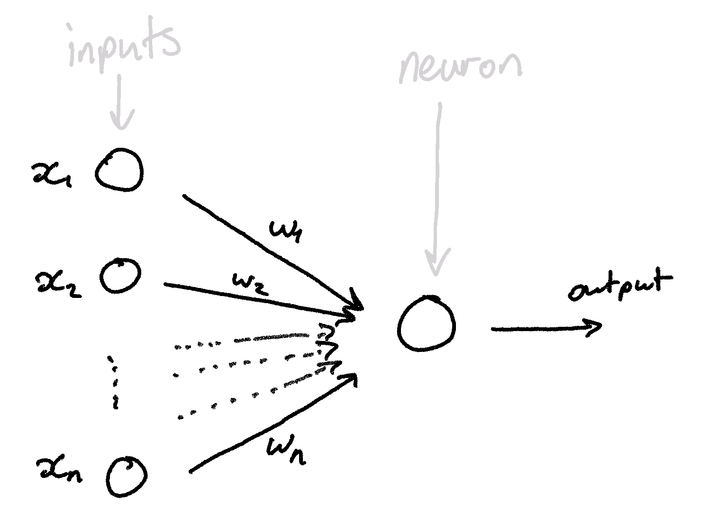

Within the neurons, the weights and data are combined, and passed through 
an "activation function" to get the output number: 

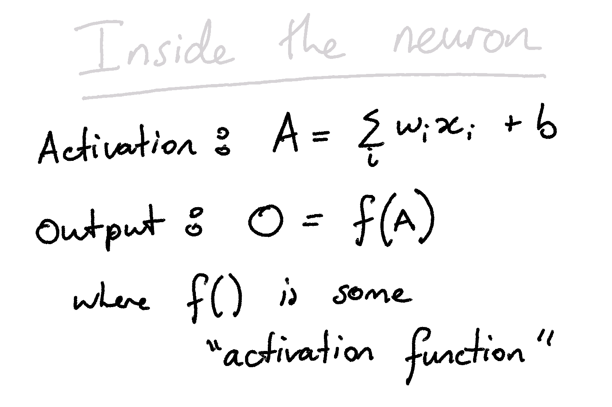

We can then form a network of Neurons: 

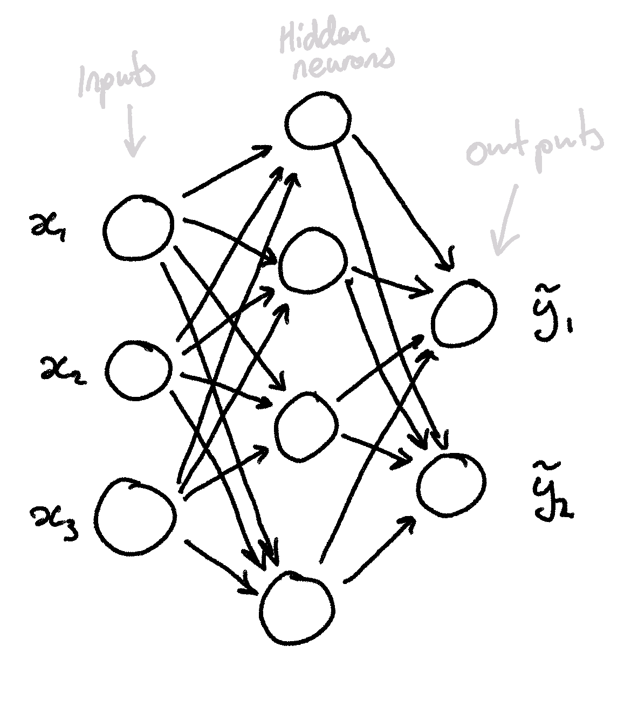

These diagrams are all well and good. But really, the best way to understand 
neural networks is to play with one: 

[We can do that here!](http://playground.tensorflow.org/)

# Unsupervised Machine Learning: SOM

My personal favourite flavour of unsupervised machine learning is the 
**self-organising map**. 

The SOM is a form of unsupervised _manifold_ learning, in that it fits a 
2-dimensional manifold to an $N$-dimensional parameter space. 

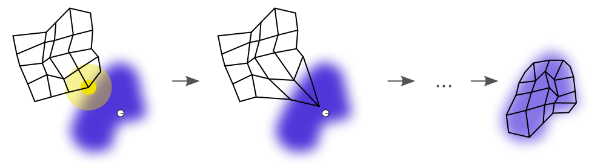

This allows the SOM to be used to great effect in both dimensionality 
reduction and classification. Let's take a hypothetical $N$-dimensional 
dataset, that consists of two populations: 

```{r, fig.height=4, fig.width=6, out.width='80%', eval=TRUE} 
set.seed(42)
#Generate some Random Data 
dat<-NULL
for (i in 1:2) { 
  #Random parameters that govern the distributions
  params<-runif(6,-5,5)
  #Random offsets between parameters in 3D
  offset<-sample(c(-1,1),size=3,replace=T)*i*10
  dati<-data.frame(X=rnorm(1e4,mean=params[1]-offset[1],sd=abs(params[2])+1),
                   Y=rnorm(1e4,mean=params[3]-offset[2],sd=abs(params[4])+1),
                   Z=rnorm(1e4,mean=params[5]-offset[3],sd=abs(params[6])+1),
                   group=LETTERS[i])
  #Add to the data pile
  dat<-rbind(dat,dati)                
}                
#Plot the data
plot(dat,pch=20,col=hsv(v=0,a=0.1),cex=0.5)
```

We can fit a self-organising map to these data: 
```{r, fig.height=4, fig.width=6, out.width='80%', eval=TRUE} 
set.seed(42)
library(kohonen)
som<-kohtrain(dat,train.expr=c("X","Y","Z"),som.dim=c(41,41),n.cores=4)
plot(som,shape='straight',heatkeywidth = 2)
```

This is the 2D histogram of the nD surface that the SOM has mapped. 


We can now visualise which parts of the SOM sit within which parts of the 
n-dimensional space by painting the SOM by the values of each parameter: 

```{r, fig.height=4, fig.width=12, out.width='80%', eval=TRUE} 
#Plot the SOM Painted by Components
layout(cbind(1,2,3))
par(mar=c(0,0,0,0))
for (i in 1:3) 
  plot(som,property=i,shape='straight',heatkeywidth = 2,ncol=1e3)
```

And finally we can do some classification. Let's split the the SOM into two 
groups, based on how close the cells are to one-another in the n-dimensional 
space. We can then assign sources in the cells to either "population 1" or 
"population 2", and see how accurate our classification was... 

```{r, fig.height=4, fig.width=6, out.width='80%', eval=TRUE} 
set.seed(42)
#Construct the cell classifications
group.som<-generate.kohgroups(som,n.cluster.bins=2)
#Plot the classifications
plot(group.som,property=group.som$cell.clust,shape='straight',heatkeywidth=3)
#Show the confusion
table(paste(dat$group,group.som$clust.classif,sep='<->'))
```
So we can see that the classification works perfectly! But this was a pretty easy 
test, with clearly separated data in all axes. 

Let's now make our dataset much more complex and more intermixed:
```{r, fig.height=6, fig.width=6, out.width='80%', eval=TRUE} 
set.seed(1904)
dat<-NULL
#Make a more comoplicated data set 
for (i in 1:10) { 
  #Random parameters to govern the distributions
  params<-runif(8,-5,5)
  #Random offsets between the parameters in 3D
  offset<-sample(c(-1,1),size=4,replace=T)*i*sample(c(1,2,5),size=4,replace=T)
  dati<-data.frame(W=rnorm(6e2,mean=params[7]-offset[4],sd=abs(params[8])+1),
                   X=rnorm(6e2,mean=params[1]-offset[1],sd=abs(params[2])+1),
                   Y=rnorm(6e2,mean=params[3]-offset[2],sd=abs(params[4])+1),
                   Z=rnorm(6e2,mean=params[5]-offset[3],sd=abs(params[6])+1),
                   group=LETTERS[i])
  #Add the dataset to the pile
  dat<-rbind(dat,dati)                
}
plot(dat,pch=20,col=hsv(v=0,a=0.1),cex=0.5)
```

I think that it's safe to say that clustering this dataset by hand would be 
difficult. Firstly, the data are in 4D, so one would need to visualise 
individual 3D blocks, assign clusters, and iterate the process. However with 
the SOM, we can classify this (and arbitrarily highly-dimensional) data with 
only a few lines of code. 

```{r, fig.height=4, fig.width=6, out.width='80%', eval=TRUE} 
set.seed(666)
#Train the SOM 
som<-kohtrain(dat,train.expr=c("W","X","Y","Z"),som.dim=c(41,41),n.cores=4)
#Plot the trained SOM 
plot(som,shape='straight',heatkeywidth = 2)
```
```{r, fig.height=4, fig.width=16, out.width='80%', eval=TRUE} 
#Plot the SOM Painted by Components
layout(cbind(1,2,3,4))
for (i in 1:4) 
  plot(som,property=i,shape='straight',heatkeywidth = 2)
```
```{r, fig.height=4, fig.width=6, out.width='80%', eval=TRUE} 
#Classify SOM cells
group.som<-generate.kohgroups(som,n.cluster.bins=10)
#Plot the classifications 
layout(1)
plot(group.som,property=group.som$cell.clust)
#Create the confusion matrix
library(caret)
classif<-LETTERS[group.som$clust.classif]
print(confusionMatrix(factor(classif,levels=LETTERS[1:10]),
                      factor(dat$group,levels=LETTERS[1:10])))  
```

# **Important**: Biases in Machine Learning 

Machine learning is very much _in vogue_ at the moment in the natural sciences. 
However there are two principle problems for which machine learning should 
never be used: 

## Extrapolation 

Machine learning algorithms are prone to over-fitting. This, more than anything 
else, can be seen in the catastrophic failure of extrapolations in machine
learning methods. 

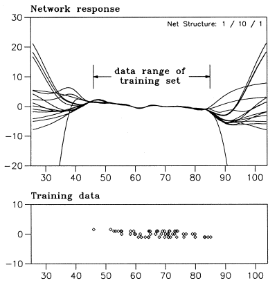

## Covariate Shift 

Extrapolation, in many regards, is an obvious issue. However the next issue 
is considerably more subtle. 

**Covariate shift** refers to the existance of a difference in the samples 
used for training and analysing a machine learning algorithm (well, and any 
other algorithm really). 


