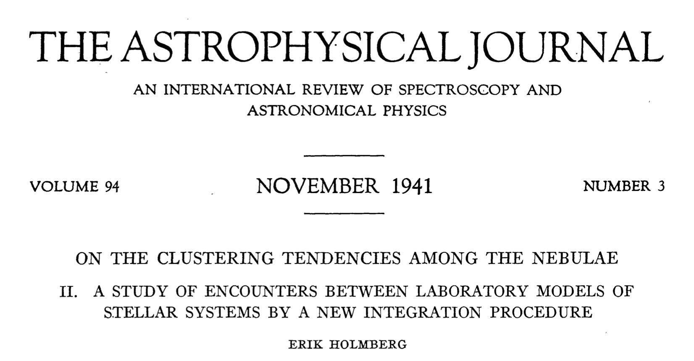
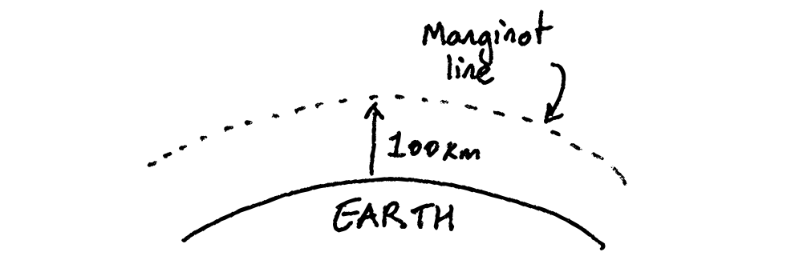
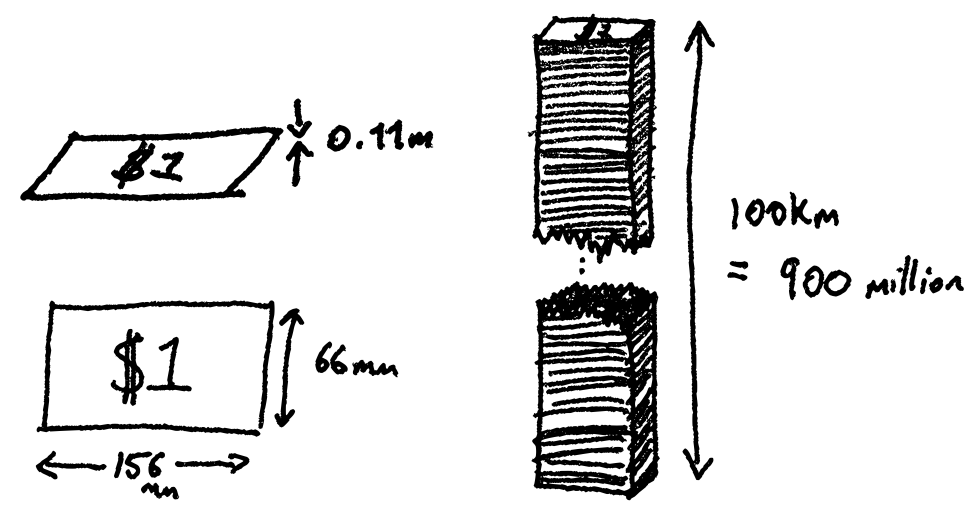
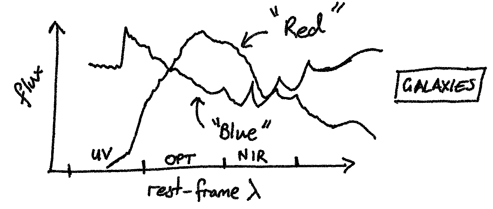
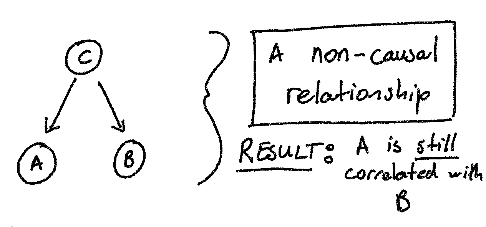
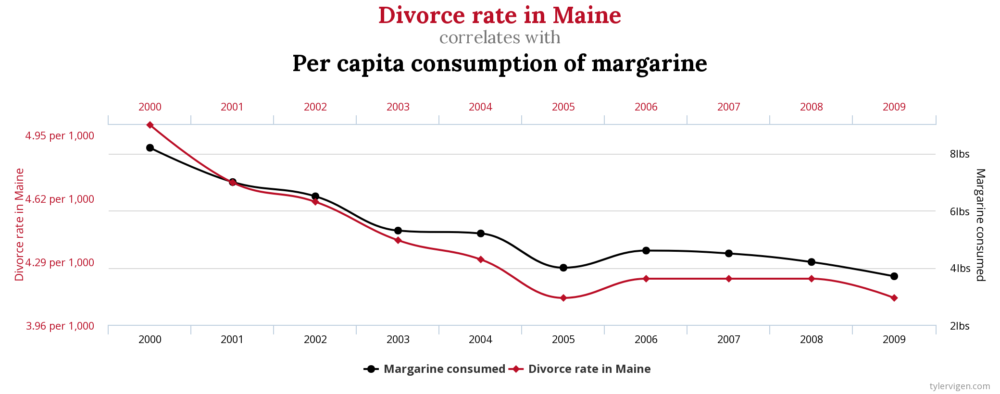
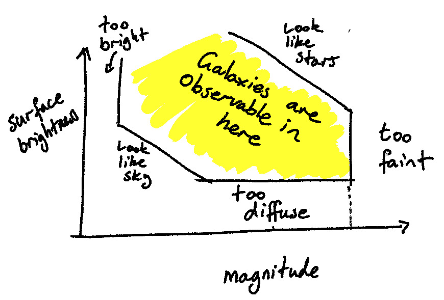
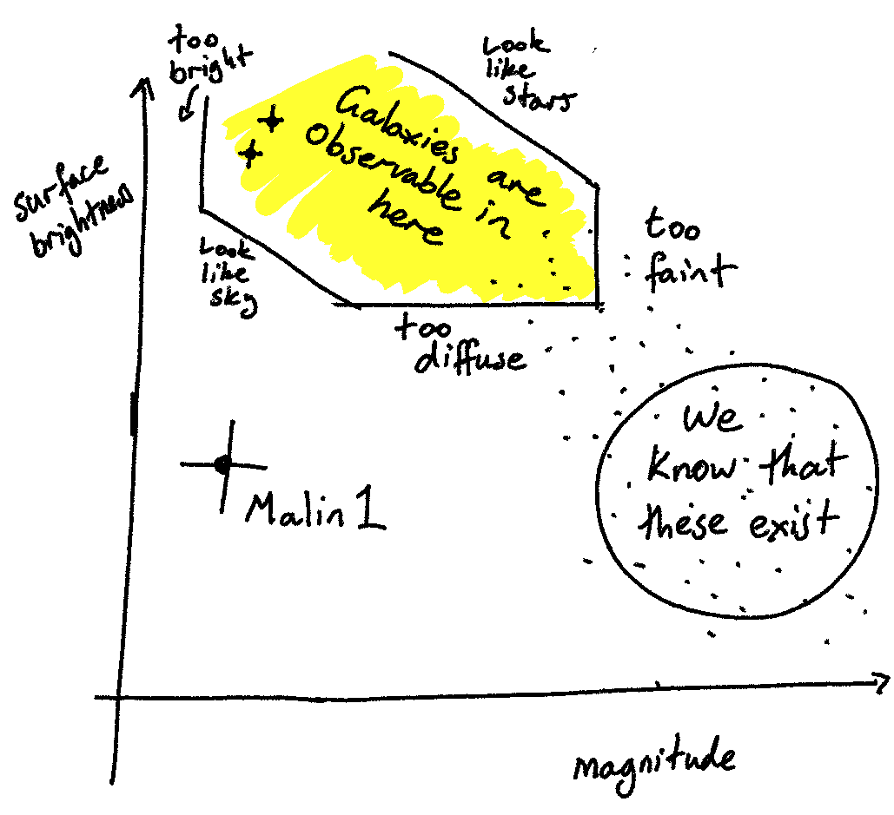
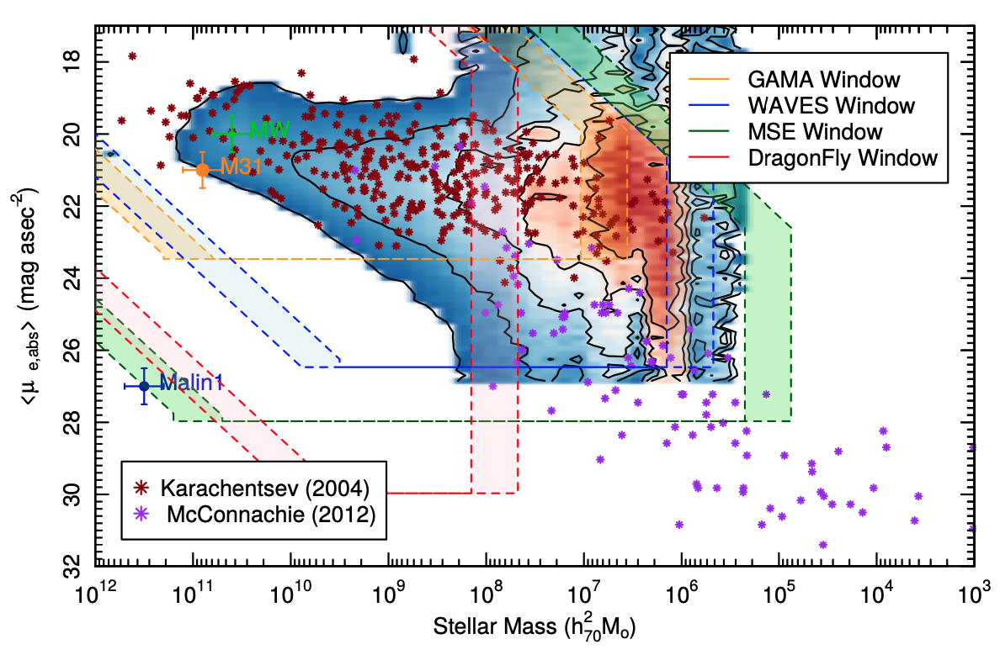
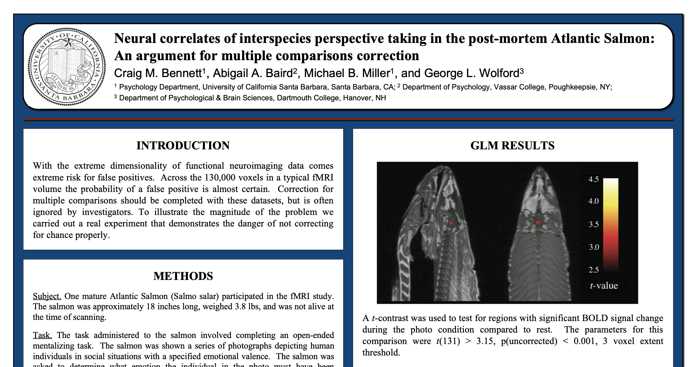

# Performing Modern Astronomical Research <!--{{{-->
<!--Setup {{{-->
```{r setup, include=FALSE}
rm(list=ls())
rrepos <- getOption("repos")
rrepos["CRAN"] <- "https://cloud.r-project.org"
options(repos=rrepos)
options(width=100)
library(reticulate)
library(magicaxis)
library(particles) 
library(tidygraph) 
library(ggplot2)
library(magicaxis)
knitr::opts_chunk$set(echo = FALSE)
knitr::opts_chunk$set(warning = FALSE)
knitr::opts_chunk$set(output = FALSE)
knitr::opts_chunk$set(echo = FALSE)
knitr::opts_chunk$set(tidy = FALSE)
knitr::opts_chunk$set(class.output = "out")
knitr::opts_chunk$set(out.width="50%")
knitr::opts_chunk$set(fig.align="center")
#knitr::opts_chunk$set(fig.asp=1)
knitr::knit_engines$set(python = reticulate::eng_python)  
par(mar=c(3,3,1,1))
set.seed(666)
```
```{css, echo=FALSE}
.python { 
  background-color: 
    RColorBrewer::brewer.pal(1,"Set2");
} 
.out { 
  max-height: 300px;
  overflow-y: auto;
  background-color: inherit;
}
```
<!--}}}-->
<!--}}}-->

Regardless of your field of study, your career stage, your affiliation, or 
any other specialisation that makes you a unique, identifiable member of the 
astronomical community, there are two things that can be unequivocally said 
about every single astronomer: 

> - They need to know how to write computer code 
> - They need to have been taught some statistics 

<!--}}}-->

---

# Statistics & Computers <!--{{{-->

Modern physics and astronomy requires an understanding of programming. From
theoreticians writing models to experimentalists writing analysis pipelines,
most physicists and astronomers will use read, write, or use a computer program
every day.

<!--}}}-->

## N-body Simulation <!--{{{--> 

An excellent example of this is the N-body simulation. The simulation of large 
gravitational bodies (stars/galaxies/clusters) using point-masses. The term 
was coined by von Hoerner in 1960. 

<center>

</center>

<!--}}}-->


## Holmberg (1941) <!--{{{--> 

However, in 1941,  20 years prior to a
famous work by Sebastian von Hoerner that established the field (and name)
N-body Simulations, Erik Holmberg
performed the first simulations of colliding galaxies.

<center>

</center>

<!--}}}-->

Holmberg's work was exceptional for a number of reasons, but has become famous
because of _how_ it was completed. Holmberg simulated the collisions of rotating
spiral galaxies:

<center>

</center>

And generated tidal disruption features that are now seen commonly in merging
spiral galaxies:

<center>

</center>

<!--}}}-->

## The surprise? <!--{{{--> 

His work was computed entirely _by hand_. Holmberg used
arrangements of lightbulbs to simulate groups of stars, and photometers to
compute the gravitational pull of all mass-elements on each-other per unit time.

<center>

</center>

<!--}}}-->

---

# Reproducing Holmberg in 2021 <!--{{{-->
```{r funcs, echo=FALSE} 
vtot<-function(gr) {
  v<-velocity(gr)
  v<-sqrt(v[,1]^2+v[,2]^2)
  v<-v-min(v)
  v<-v/max(v)
  v<-v*2/3
  return=v
}
map<-function(C) {
  if (exists('minmax')) { 
    #print(paste("Minmax:",paste(collapse=' ',minmax)))
    #print(range(C),minmax)
    C[which(C<minmax[1])]<-minmax[1]
    C[which(C>minmax[2])]<-minmax[2]
    C<-C-minmax[1]
    C<-C/(minmax[2]-minmax[1])
  } else { 
    #print(paste("Range:",paste(collapse=' ',range(C))))
    C<-C-min(C)
    C<-C/max(C)
  }
  C<-(1-C)*2/3
 # print(range(C))
  return=C
}
pos.plot<-function(gr) 
  magplot(pch=20,cex=cex,col=c(rep(cols[1],N.part),rep(cols[2],N.part)),
  position(gr),xlim=c(-box,box),ylim=c(-box,box))
arr.plot<-function(gr) {  
  parm<-par(mar=c(2,2,1,1))
  vx<-velocity(gr)[,1]
  vx.per<-c(mean(vx[1:N.part]),mean(vx[-(1:N.part)]))
  vx[1:N.part]<-vx[1:N.part]-vx.per[1]
  vx[-(1:N.part)]<-vx[-(1:N.part)]-vx.per[2]
  vy<-velocity(gr)[,2]
  vy.per<-c(mean(vy[1:N.part]),mean(vy[-(1:N.part)]))
  vy[1:N.part]<-vy[1:N.part]-vy.per[1]
  vy[-(1:N.part)]<-vy[-(1:N.part)]-vy.per[2]
  
  #print(range(sqrt(vx^2+vy^2)))
  #print(range(map(sqrt(vx^2+vy^2))))
  magplot(position(gr),col=hsv(map(sqrt(vx^2+vy^2))),pch=20,cex=cex,
                     xlim=c(-box,box),ylim=c(-box,box),asp=1,
          mtline = 1,
          xlab=expression(Delta*x),ylab=expression(Delta*y),
          labels=c(F,F,F,F),side=1:4)

  suppressWarnings({
  arrows(position(gr)[,1],position(gr)[,2],
         position(gr)[,1]+vx*fact,
         position(gr)[,2]+vy*fact,
         length=0.05,col=hsv(map(sqrt(vx^2+vy^2)),a=0.7)
  )
  
  arrows(mean(position(gr)[-(1:N.part),1]),
         max(position(gr)[-(1:N.part),2])+
           abs(diff(range(position(gr)[-(1:N.part),2])))/2,
         mean(position(gr)[-(1:N.part),1])+vx.per[2]*fact,
         max(position(gr)[-(1:N.part),2])+
           abs(diff(range(position(gr)[-(1:N.part),2])))/2+
           vy.per[2]*fact,
         length=0.05,lwd=2
  )
  arrows(mean(position(gr)[ (1:N.part),1]),
         min(position(gr)[ (1:N.part),2])-
           abs(diff(range(position(gr)[ (1:N.part),2])))/2,
         mean(position(gr)[ (1:N.part),1])+vx.per[1]*fact,
         min(position(gr)[ (1:N.part),2])-
           abs(diff(range(position(gr)[ (1:N.part),2])))/2+
           vy.per[1]*fact,
         length=0.05,lwd=2
  )
  })
  par(parm)
  return=range(sqrt(vx^2+vy^2))
}
```

```{r nbody clock, echo=FALSE} 
cex<-1.0
box<-20
N.step<-10
N.part<-37
N.gal<-2
radius<-1
f.grav<-0.06
v.scale<-1
x.offset<-  -(5)
y.offset<-   (5)
vel.pec<-  1.5
vx.offset<- 0.3
v.mult<-sqrt(f.grav*v.scale)
fact<-2e-1/v.mult

tmp<-create_empty(N.part) %>%
  simulate(alpha=1,alpha_target=1,alpha_decay=0,velocity_decay = 0,
           setup = phyllotactic_genesis(radius=radius))

#Single "galaxy"
pos.x<-position(tmp)[,1]
pos.y<-position(tmp)[,2]
phi = pi-atan(pos.y/pos.x)
vel.tot = sqrt(pos.x^2+pos.y^2)*v.mult
vel.x = vel.tot*sin(phi)*ifelse(pos.x<0,-1,1)
vel.y = vel.tot*cos(phi)*ifelse(pos.x<0,-1,1)

#Two "Galaxies" 
if (N.gal>1) { 
  vy.offset<-vel.pec*v.scale
  pos.x<-c(pos.x+x.offset,
           pos.x-x.offset)
  pos.y<-c(pos.y+y.offset,
           pos.y-y.offset)
  vel.x<-c(vel.x-vx.offset,
          (vel.x+vx.offset))
  vel.y<-c(vel.y-vy.offset,
          (vel.y+vy.offset))
} else { 
  vx.offset<-vy.offset<-0
}

holmberg.clockwise <- create_empty(N.part*N.gal) %>%
  simulate(alpha=1,alpha_target=1,alpha_decay=0,velocity_decay = 0,
           setup = predefined_genesis(pos.x,pos.y,vel.x,vel.y)) %>%
  wield(manybody_force,f.grav,theta=0.01,min.dist=0.01,max.dist=0.1)

```

```{r nbody anticlock, echo=FALSE} 
cex<-1.0
box<-20
N.step<-10
N.part<-37
N.gal<-2
radius<-1
f.grav<-0.06
v.scale<-1
x.offset<-  -(5)
y.offset<-   (5)
vel.pec<-  1.5
vx.offset<- 0.3
v.mult<-sqrt(f.grav*v.scale)
fact<-2e-1/v.mult

tmp<-create_empty(N.part) %>%
  simulate(alpha=1,alpha_target=1,alpha_decay=0,velocity_decay = 0,
           setup = phyllotactic_genesis(radius=radius))

#Single "galaxy"
pos.x<-position(tmp)[,1]
pos.y<-position(tmp)[,2]
phi = pi-atan(pos.y/pos.x)
vel.tot = sqrt(pos.x^2+pos.y^2)*v.mult
vel.x = -vel.tot*sin(phi)*ifelse(pos.x<0,-1,1)
vel.y = -vel.tot*cos(phi)*ifelse(pos.x<0,-1,1)

#Two "Galaxies" 
if (N.gal>1) { 
  vy.offset<-vel.pec*v.scale
  pos.x<-c(pos.x+x.offset,
           pos.x-x.offset)
  pos.y<-c(pos.y+y.offset,
           pos.y-y.offset)
  vel.x<-c(vel.x-vx.offset,
          (vel.x+vx.offset))
  vel.y<-c(vel.y-vy.offset,
          (vel.y+vy.offset))
} else { 
  vx.offset<-vy.offset<-0
}

holmberg.anticlockwise <- create_empty(N.part*N.gal) %>%
  simulate(alpha=1,alpha_target=1,alpha_decay=0,velocity_decay = 0,
           setup = predefined_genesis(pos.x,pos.y,vel.x,vel.y)) %>%
  wield(manybody_force,f.grav,theta=0.01,min.dist=0.01,max.dist=0.1)
```

<center>


<table style="width: 90%">
    <colgroup>
       <col span="1" style="width: 45%;">
       <col span="1" style="width: 45%;">
    </colgroup>
    <tbody> <tr>
<td clock> <!--{{{-->
``` {r, fig.height=5, fig.width=6, out.width='90%', eval=TRUE,echo=FALSE,warning=FALSE}  
rm("minmax")
minmax.clock<-arr.plot(holmberg.clockwise)
```
</td> <!--}}}-->
<td anticlock> <!--{{{-->
``` {r, fig.height=5, fig.width=6, out.width='90%', eval=TRUE,echo=FALSE,warning=FALSE}  
rm("minmax")
minmax.anticlock<-arr.plot(holmberg.anticlockwise)
```
</td> <!--}}}-->
</tr><tr>
<td clockanim> <!--{{{-->
```{r nbody-anim-clock, fig.show='animate', ffmpeg.format='gif', dev='jpeg', aniopts='loop=FALSE', interval=0.3,echo=FALSE, fig.height=5, fig.width=6, out.width='90%', fig.asp=1,warning=FALSE}
rm("minmax")
minmax<-minmax.clock
sim<-holmberg.clockwise %>% evolve(N.step,arr.plot)
```
</td> <!--}}}-->
<td anticlockanim> <!--{{{-->
```{r nbody-anim-anticlock, fig.show='animate', ffmpeg.format='gif', dev='jpeg', aniopts='loop=FALSE', interval=0.3,echo=FALSE, fig.height=5, fig.width=6, out.width='90%', fig.asp=1,warning=FALSE}
rm("minmax")
minmax<-minmax.anticlock
sim<-holmberg.anticlockwise %>% evolve(N.step,arr.plot)
```
</td> <!--}}}-->
</tr></tbody></table>
</center>

<center>


<table style="width: 90%">
    <colgroup>
       <col span="1" style="width: 45%;">
       <col span="1" style="width: 45%;">
    </colgroup>
    <tbody> <tr>
<td clockanim_freeze> <!--{{{-->
```{r nbody-anim-freeze-clock, echo=FALSE, fig.height=5, fig.width=6, out.width='90%', fig.asp=1,warning=FALSE}
rm("minmax")
minmax<-minmax.clock
graph<-holmberg.clockwise %>% evolve(7)
arr.plot(graph)
```
</td> <!--}}}-->
<td anticlockanim> <!--{{{-->
```{r nbody-anim-freeze-anticlock, echo=FALSE, fig.height=5, fig.width=6, out.width='90%', fig.asp=1,warning=FALSE}
rm("minmax")
minmax<-minmax.anticlock
graph<-holmberg.anticlockwise %>% evolve(7)
arr.plot(graph)
```
</td> <!--}}}-->
</tr></tbody></table>
</center>

# But "Scalability" is the main benefit

```{r nbody big, echo=FALSE} 
cex<-0.2
box<-100
N.step<-100
N.part<-1e3
N.gal<-2
radius<-1
f.grav<-0.06
v.scale<-1
x.offset<-  -(10)
y.offset<-   (40)
vel.pec<-  4.5
vx.offset<- 0.3
v.mult<-sqrt(f.grav*v.scale)
fact<-2e-1/v.mult

tmp<-create_empty(N.part) %>%
  simulate(alpha=1,alpha_target=1,alpha_decay=0,velocity_decay = 0,
           setup = phyllotactic_genesis(radius=radius))

#Single "galaxy"
pos.x<-position(tmp)[,1]
pos.y<-position(tmp)[,2]
phi = pi-atan(pos.y/pos.x)
vel.tot = sqrt(pos.x^2+pos.y^2)*v.mult
vel.x = vel.tot*sin(phi)*ifelse(pos.x<0,-1,1)
vel.y = vel.tot*cos(phi)*ifelse(pos.x<0,-1,1)

#Two "Galaxies" 
if (N.gal>1) { 
  vy.offset<-vel.pec*v.scale
  pos.x<-c(pos.x+x.offset,
           pos.x-x.offset)
  pos.y<-c(pos.y+y.offset,
           pos.y-y.offset)
  vel.x<-c(vel.x-vx.offset,
          (vel.x+vx.offset))
  vel.y<-c(vel.y-vy.offset,
          (vel.y+vy.offset))
} else { 
  vx.offset<-vy.offset<-0
}

holmberg.big <- create_empty(N.part*N.gal) %>%
  simulate(alpha=1,alpha_target=1,alpha_decay=0,velocity_decay = 0,
           setup = predefined_genesis(pos.x,pos.y,vel.x,vel.y)) %>%
  wield(manybody_force,f.grav,theta=0.01,min.dist=0.01,max.dist=0.9)
```
```{r nbody-anim-big, fig.show='animate', ffmpeg.format='gif', dev='jpeg', aniopts='loop=FALSE', interval=0.1,echo=FALSE, fig.height=6, fig.width=6, out.width='80%', fig.asp=1,warning=FALSE}
rm("minmax")
minmax<-arr.plot(holmberg.big)
sim<-holmberg.big %>% evolve(N.step,arr.plot)
```

--- 

# Astronomy and Statistics <!--{{{-->

It is uncontroversial (I think?!) to say that having an understanding of 
programming is vital to modern astronomical research. 

Less appreciated, and certainly less obvious to any student working their 
way toward becoming a future astronomer (i.e. you!), is the fact that an 
understanding of statistics is **just as important** a skill as programming.

## "Well that's a bit exaggerated, Angus"  <!--{{{-->

Maybe... 

But there is a common misconception in some astronomical fields that only people 
working in large surveys (and with many sources) require an understanding of 
statistics. This is **unequivocally** false, as you will see repeatedly 
throughout this lecture. 

Unfortunately, though, one 90 minute lecture is an insufficient amount of time 
to teach (let alone learn!) the nuances of statistical analysis methods and best
practices. Indeed, in a standard Astrostatistics lecture series, we would spend
one 90 minute lecture on **each** the topics of:

> * Introducing statistical computing 
> * Understanding and exploring data 
> * Describing and modelling data  
> * Understanding Probability 
> * Bayesian Statistics 
> * Modelling probabilistic events 
> * Complex analysis methods (MCMC) 
> * Machine Learning methods 
> * My favourite: "How to not be wrong"

and much more. Unfortunately learning these in one hour is not possible, and 
skimming through them typically does more harm than good. 

<!--}}}-->

# Statistical Methods vs Statistical Awareness 

This lecture will therefore not cover statistical methods. Instead we will spend 
the next hour trying to develop our **statistical awareness**: our ability to
recognise and understand the sorts of statistical biases that can wreak havoc
with otherwise solid astronomical analyses. 


## What we'll cover today

In this lecture we will discuss statistics and statistical fallacies in the 
context of astronomy. Or, framed in a slightly more fun way: 

> <center><font color="blue" size="12">  How to **invalidate** your research in 7 easy steps! </font></center>

> 1) Looking at your data 
> 2) Making selections on your data
> 3) Using data which has uncertainties 
> 4) Focussing on interesting sources
> 5) Fitting models to your data
> 6) Trying to find "truth" in your data
> 7) Reproducing previous work  

## Statistical Paradoxes 

Many of the errors we will discuss today result from *statistical paradoxes*. 
These are not paradoxes in the sense that "they break physical laws and 
rigorous logic", but rather they are paradoxes because (for the vast majority of 
people) your brain instinctively draws the wrong conclusion. 

# A simple numerical paradox 

A trivial example of a mathematical fallacy is one that is likely well known 
to all of us here: the fallacy of large numbers. 

This fallacy says, quite simply, that your brain is incapable of 
rationalising/comprehending  large numbers (or conversely, that humans 
generally think that numbers are large when they, mathematically speaking, 
are not). 

This is a fallacy we encounter every day in astronomy. 

> - The Andromeda galaxy is $\sim 11$ million light-years away
> - The Universe is $\sim 13$ billion years old
> - There are $\sim 100$ billion stars in the Milky Way Galaxy 

The human brain is not constructed to innately understand these sorts of numbers, 
and this leads to bias. 

### Take the humble sheet of paper

> - This is a stack of 130 sheets of standard format A4 paper. 
> - Without trying to crunch the numbers, ask your gut: how tall is $100$ billion sheets of paper? 

---

#  The humble sheet of paper

Standard format A4 paper has a thickness of $0.04$mm. $100$ billion sheets is 
therefore: 
$$
0.04 {\rm \, mm} \times 10^{-6} {\rm \,km/mm} \times 100\times 10^9 = 4\,000{\rm \,km}
$$

---

# *Non-Astronomy Aside*: Billionaires and the Manginot line

You've likely all seen Jeff Bezos (and other billionaires) voyages into space recently. 


The "important point" is called the Manginot line, and is 100km above the earth's 
surface. 



> - A US$\$1$ bill is $0.1$ mm thick 
> - A 100km tall pile of US$\$1$ bills is $\sim 900$ million bills tall



> - Jeff Bezos' net worth is 177 billion USD
> - Jeff Bezos could make 196 100km-tall piles of US$\$1$ bills.
> - Stacked alongside one-another...


> - Jeff Bezos could make a dollar bill tower that is 100km tall and larger 
than a standard-sized single bed. He could sleep above the Manginot line on a 
tower made of nothing but his own wealth 
> - With any luck he would stay there  

<!--}}}-->

--- 

```{r toy-universe, include=FALSE}
library(celestial)
library(magicaxis)
cat<-Rfits::Rfits_read_table("~/Research/Bochum/SHARK/KiDS_Sample_4sqdeg/SURFS_SHARK_LC_4sqdeg_testcols.fits",verbose=T)
cat$gi<-cat$g_SDSS_apparent - cat$i_SDSS_apparent
cat$mstar<-cat$mstars_bulge+cat$mstars_disk
cat$mtotal<-cat$mstar+cat$mvir_hosthalo
cat2<-cat[which(abs(cat$r_SDSS_apparent) < 25),]
za_map<-cosmapfunc("z","UniAgeAtz",ref='Planck15')
```

# Outline 

In this lecture we will discuss statistics and statistical fallacies in the 
context of astronomy. Or, framed in a slightly more fun way: 

**How to invalidate your research in 7 easy steps!**

1) Looking at your data 
2) Making selections on your data
3) Using data which has uncertainties 
4) Focussing on interesting sources
5) Fitting models to your data
6) Trying to find "truth" in your data
7) Reproducing previous work  

# Method 1: Looking at your data

Let's start with a simple physical dataset in multiple dimensions that we want 
to investigate. For the vast majority of this lecture we're going to work with 
a simulated **toy universe** that I have constructed. Galaxies in this universe 
are simple and easy to model, the universe obeys basic cosmological principles,
telescopes and detectors produce perfectly Gaussian uncertainties. 

> * In short, my toy universe is an astronomers idea of **heaven**.

To start our exploration into my mock universe, we're going to look at the
distribution of galaxies in my universe. Galaxies are observed with telescopes
and fluxes are measured in various filters. We use these fluxes to measure
galaxy redshifts and galaxy properties using "Spectral Energy Distribution" 
modelling.

<!--

-->


Galaxies have a number of physical parameters estimated, and a number of 
additional properties are included (e.g. environment). 

## Relationships between parameters 

When plotting data in multiple dimensions, we will frequently find properties 
that show some sort of relationship. That is: variation in one parameter is 
coincident with variation in another parameter. This behaviour is called 
**correlation**. 


If one parameter is related to another, we are generally interested in 
determining if that relationship is **causal**; that is, whether or not it 
is indicative of some underlying physical process that links the two 
parameters. 


### A sneak peak at probability
As a demonstration, let's say that in our toy universe we have a catalogue 
of $10$ galaxies, with $1000$ properties measured for each galaxy. A truly 
spectacular dataset. We decide a relationship is worth investigating if it 
contains an $80\%$ correlation or more. 

**But**, our toy universe is cruel: someone corrupted our dataset, and 
(unbeknownst to us) all the variable are filled with completely random 
values. 

What fraction of our random variables do we expect to have a correlation of $80\%$ or more? 

```{r, fig.height=4, fig.width=6, out.width='80%', eval=TRUE, echo=FALSE} 
library(foreach)
cor_vals=foreach(i=1:1e5,.combine='c')%do%{abs(cor(runif(10),runif(10)))}
plot(ecdf(cor_vals),xlab='Absolute Pearson Correlation',
     main='ECDF of 1e5 random variable correlations')
abline(v=0.8)
cat(paste(round(length(which(cor_vals>0.8))/length(cor_vals)*100,digits=2),
    "% of variables have 80% correlation or more"))
```

Said differently, there is a 1 in 
`r floor(1/(length(which(cor_vals>0.8))/length(cor_vals)))` chance that two
totally random variables in our survey will have an absolute correlation 
of $0.8$ or higher. 

### What does this mean? 

The likelihood of 
finding "significant" correlations between truly random data is non-zero, and 
grows with decreasing numbers of observations and increasing numbers of 
observed variables. 

> -**Working with small samples does not mean you can ignore statistics**

The problem is further complicated by the existence of **confounding variables**. 



A confounding variable is one that acts upon both the dependent and independent 
variables in a measurement of correlation, and thereby creates a spurious 
correlation between the two. 

```{r, include=FALSE} 
layout(cbind(1,2))
par(mar=c(3,3,1,1))
```
```{r, fig.height=4, fig.width=6, out.width='80%', eval=TRUE, echo=TRUE} 
#A simple Gaussian dataset 
obs<-data.frame(Z=rnorm(1E3,mean=0,sd=1))
#A new variable that correlates with Z
obs$X<-sin(obs$Z)+runif(1e3,min=-0.2,max=0.2)
#And another new variable that correlates with Z
obs$Y<-(1-obs$Z/4*runif(1e3,min=0.8,max=1.2))^3
#Plot them 
with(obs, {
  magplot(Z,X,xlab="Z",ylab="X",pch='.') 
  magplot(Z,Y,xlab="Z",ylab="Y",pch='.') 
})
```

We've created two variables that correlate with $Z$. But what if we never
actually _observed_ the variable $Z$... We would instead plot $X$ and $Y$: 

```{r, fig.height=4, fig.width=6, out.width='60%', eval=TRUE, echo=TRUE} 
#Plot X and Y
magplot(obs$X,obs$Y,xlab='X',ylab='Y',ylim=c(-2,7),pch='.')
#Rank Correlation 
cor(obs$X,obs$Y,method='spearman')
```

And be tempted to decide that there is a **causal** relationship between these
two parameters, when in fact none exists. 


## A fundamental distinction 



Here we can see that the number of divorces in the US state of Maine is
correlated with the consumption of margarine per person in the USA. 

The conclusion is clear: 

> - **Eating margarine in LA will invariably lead to a divorce in Maine** (you monster!). 

Or more accurately: 

> - No, of course it won't.

This is an example of a spurious correlation. Such correlations are possible
(and indeed likely!) when you have few observations of many variables (more on 
this later). 

## If you only remeber **one thing** from this lecture...

Thus have demonstrated the common but extremely important statistical fact, 
and Method 1 for invalidating your research: 

> - Looking for correlations in your data _and then assuming that these correlations are causal_.

> - <center><font color="blue" size="12">  Correlation does not equal Causation! </font></center>

## One final galaxy example

Let's go back to our toy universe and look at one last correlation: 
the distribution of **intrinsic galaxy brightness** vs the age of the 
universe: 

```{r,out.width='70%'}
magplot(za_map(cat2$zobs),cat2$r_SDSS_absolute,pch='.',xlab='Universe Age (Gyr)',
ylab='Intrinsic Brightness (M)',ylim=c(-13,-27),unlog='')
```

This correlation suggests that galaxies were, on the whole, brighter at earlier 
times in the universe, and that they are dimming over time. Is this correlation 
causal? Or spurious? Or something else? 

---

# Method 2: Making Selections on your data

Prior to performing any observational astronomical analysis, we need data. 
However there are too many galaxies in the visible universe to observe with 
any one instrument, so astronomical samples are *never* complete. That is, 
they are always a subset of the total population of all galaxies in the universe. 

Selecting samples is therefore a fundamental part of astronomical analyses. It is 
unavoidable. However, whenever we perform even simple sample selections, we open the door to 
pathological biases in our analysis. 

> - **No matter what data you use, statistics governs your selection function and therefore your ~~soul~~ biases**

Let's go back to our toy universe. This is our plot of intrinsic galaxy 
brightness vs Universe age from the last section: 
```{r, out.width='70%'}
magplot(za_map(cat2$zobs),cat2$r_SDSS_absolute,pch='.',xlab='Universe Age (Gyr)',
ylab='Intrinsic Brightness (M)',ylim=c(-13,-27),unlog='')
```

Now let's plot the relationship between *observed brightness* and distance:

```{r, out.width='70%'}
magplot(cat2$zobs,cat2$r_SDSS_apparent,pch='.',xlab='Redshift',
ylab='Observed Brightness (m)',ylim=c(27,13),unlog='')
```


There is a clear relationship between these two properties, and an obvious 
(artificial) cut-off in the distribution of apparent brightness at $m=25$. 

This cut-off is the **magnitude limit** of our toy survey.  

What influence does the magnitude limit of our survey have on the distribution 
of intrinsic brightness? 

## Malmquist Bias 

```{r, out.width='70%'}
magplot(za_map(cat2$zobs),cat2$r_SDSS_absolute,pch='.',xlab='Universe Age (Gyr)',
ylab='Intrinsic Brightness (M)',ylim=c(-13,-27),xlim=c(1,14),col='blue3',unlog='')
lines(za_map(seq(0.1,3,by=0.1)),25.5-cosdistDistMod(seq(0.1,3,by=0.1),ref='Planck15'),lty=2,col='black',lwd=3)
run<-magrun(za_map(cat2$zobs),cat2$r_SDSS_absolute,bins=10,diff=T)
points(pch=20,col='red3',run$x,run$y)
magerr(col='red3',run$x,run$y,ylo=run$ysd)
legend("bottomleft",legend=c("Observed Galaxies","Magnitude Limit","Mean Brightness"),
       pch=c(20,NA,20),lty=c(NA,2,1),
       col=c("blue3","black","red3"),bg='white',inset=0.1,lwd=2)
```

This is an observational bias called "Malmquist Bias". It refers to the bias
that one observes in the mean intrinsic brightness of galaxies as a function of
distance, caused by the fact observed brightness is a strong function of
distance.


This effect means that galaxy properties, measured as a function of redshift or in 
wide chunks of redshift, must account for the changing galaxy population. In
this way, Malmquist bias is a form of **survivor bias**.

A common place that Malmquist bias occurs is in the modelling of galaxy 
distribution functions, such as the galaxy stellar mass function (GMSF) or 
galaxy Luminosity function (GLF). Failing to account for Malmquist bias in 
these measurements leads to catastrophic errors:

```{r, out.width='70%'}
magplot(cat2$zobs,log10(cat2$mstar),pch='.',xlab='Redshift',
ylab='Stellar Mass',ylim=c(6,13),xlim=c(0,3),col='blue3',unlog='y')
run<-magrun(cat2$zobs,log10(cat2$mstar),bins=10,diff=T)
points(pch=20,col='red3',run$x,run$y)
magerr(col='red3',run$x,run$y,ylo=run$ysd)
legend("bottomright",legend=c("Observed Galaxies","Mean Brightness"),
       pch=c(20,20),lty=c(NA,1),
       col=c("blue3","red3"),bg='white',inset=0.1,lwd=2)
```
```{r, out.width='70%'} 
dens<-density(bw=0.2/sqrt(12),kern='rect',from=6.5,to=12,log10(cat2$mstar))
dens$y<-dens$y / cosvol(4,zmax=1,zmin=0.1)[1]/1E6
magplot(dens,type='n',
        xlab='Stellar Mass',ylab='Number Density',unlog='xy',log='y',ylim=c(1e-6,1e-2))
nbins=4
bins<-seq(0.0,1.0,by=0.25)
cols<-RColorBrewer::brewer.pal("Set2",n=nbins)
for (i in 1:nbins) { 
  ind<-which(cat2$zobs > bins[i] & cat2$zobs <= bins[i+1])
  dens<-density(bw=0.2/sqrt(12),kern='rect',from=6.5,to=13,log10(cat2$mstar[ind]))
  dens$y<-dens$y / dens$y[runif(1,250,250)]*5E-5
  #dens$y<-dens$y / cosvol(1,zmax=max(cat2$zobs[ind]),zmin=min(cat2$zobs[ind]),ref='Planck15')[1]/1E6
  lines(dens,
        lwd=2,col=cols[i])
}
legend('topright',legend=paste0(bins[1:nbins],"< z ≤",bins[1:nbins+1]),
       col=cols,lwd=2,lty=1,bg='white',inset=0.1)

```

Thus we have Method 2 for invalidating your research: 

> - Failing to correct for observational selection functions present in **every dataset**.


## Survivor Bias 

The general term for a bias that originates because a studies sample is not 
representative of the general population because of some selection effect 
is known as **survivor bias** (in the sense that the remaining sample has 
"survived" some test). 

In real astronomical survey imaging, survivor biases are caused by much more
than simple magnitude selections (although the magnitude limit is often the most
dominant selection). A good example of this is the **bivariate brightness distribution**: 


The BBD showcases the 4 major selection effects that impact survey images in 
astronomy: 



The particular problem with these selections is that we *know* galaxies exist 
outside these limits, because we have (often by accident) discovered them. 






# **Non-Astronomy Aside:** The original "survivor bias" 

The name originates from the studies of military aircraft during the dawn of 
airborne warfare. In an effort to protect aircraft from destruction, the planes 
ought to be shielded with armour. 

Military analysts noted that planes were generally most heavily damaged on 
their wings and tails when they returned from battle. And so they decided that 
it was necessary to fortify these areas. However armour is heavy, and reduces the 
efficiency of the aircraft. So they contracted statistician Abraham Wald to 
optimise the placement of armour on the aircraft. 


Wald returned to the analysts with a recommendation that was somewhat unexpected: 
Armour the parts of the plane that **don't** have any bullet holes. 

The reason was simple: bullet's do not preferentially strike wings and tails. 
They should be randomly distributed over the fuselage, but they are not. 

Therefore, there must be some selection effect that means planes with 
bullet holes on the wings and tails *preferentially* return home. Why? 
Because planes that get shot in the engine crash! 

---

# Method 3: Using data which has uncertainties

> 1) All observational data has uncertainties, because no instrument is perfect. 
> 2) All models have uncertainties, because no model looks exactly like the real 
universe. 
> 3) Ergo: you will always be working with uncertain quantities. 


## "Monte Carlo" realisations  

**Monte Carlo** realisations refer to data that are generated by adding 
random perturbations to the data values. A simple example is the simulation 
of uncertainties given some "true" underlying distribution. 

Back to the toy universe: our observed galaxies have some distribution of 
"true" stellar mass (now corrected for Malmquist Bias!): 

```{r, out.width='70%'} 
ind<-which(cat$zobs>0.1 & cat$zobs < 0.2 & cat$r_SDSS_apparent < 25)
dens<-density(bw=0.5/sqrt(12),kern='rect',from=8,to=12,log10(cat$mstar[ind]),n=4e2)
dens$y<-dens$y / cosvol(4,zmax=0.2,zmin=0.1,ref='Planck15')[1]/1E6
magplot(dens,type='l',lwd=2,
        xlab='Stellar Mass',ylab='Number Density',unlog='xy',log='y',ylim=c(2e-6,1e-2))
legend('topright',legend=c("True Stellar Masses"),
       col=c("black","red3"),lwd=2,lty=1,bg='white',inset=0.1)
```

What happens if we add a small amount of noise to our estimated stellar masses?

```{r, out.width='70%'} 
ind<-which(cat$zobs>0.1 & cat$zobs < 0.2 & cat$r_SDSS_apparent < 25)
dens<-density(bw=0.5/sqrt(12),kern='rect',from=8,to=12,log10(cat$mstar[ind]),n=4e2)
dens$y<-dens$y / cosvol(4,zmax=0.2,zmin=0.1,ref='Planck15')[1]/1E6
magplot(dens,type='l',lwd=2,
        xlab='Stellar Mass',ylab='Number Density',unlog='xy',log='y',ylim=c(2e-6,1e-2))
dens<-density(bw=0.5/sqrt(12),kern='rect',from=8,to=12,
              log10(cat$mstar[ind])+rnorm(length(ind),sd=0.4),n=4e2)
dens$y<-dens$y / cosvol(4,zmax=0.2,zmin=0.1,ref='Planck15')[1]/1E6
lines(dens,type='l',lwd=2,col='red3')
legend('topright',legend=c("True Stellar Masses","Noisy Stellar Masses"),
       col=c("black","red3"),lwd=2,lty=1,bg='white',inset=0.1)
```


## Eddington Bias 

This effect known as "Eddington Bias", and is most apparent when modelling a
property that follows a simple power law distribution, and a constant Gaussian
uncertainty on the parameter:

```{r, out.width='70%'} 
x<-10^seq(0,3,by=0.001)
y<-x^-1
fun<-approxfun(y=x,x=cumsum(y)/sum(y),rule=2)
samp<-fun(runif(1e7))
dens<-density(bw=0.5/sqrt(12),kern='rect',samp,n=4e2,na.rm=T,from=2)
#norm<-dens$y[200]
norm=1
dens$y<-dens$y / norm
magplot(dens,type='l',lwd=2,ylim=c(5e-6,1e0),xlim=c(10,1e3),
        xlab='Property',ylab='Number Density',unlog='xy',log='xy')
dens<-density(bw=0.5/sqrt(12),kern='rect',na.rm=T,from=10,
              samp+rnorm(length(ind),sd=8),n=4e2)
dens$y<-dens$y / norm
lines(dens,type='l',lwd=2,col='red3')
legend('topright',legend=c("True Property","Noisy Property"),
       col=c("black","red3"),lwd=2,lty=1,bg='white',inset=0.1)
```

It is caused by the distribution of sources being highly asymmetric. You can 
think of this probabilistically: 

- The probability that any one source scatters by $\pm 10$ is very small. 
- At any one point on the x-axis, there are more sources to the left than the 
right
- Ergo: there is a greater absolute chance that sources from the left will scatter 
rightward, than vice versa. 

Thus we have Method 3 for invalidating your research: 

> - Failing to account for the influence of observational uncertainties on your 
models and derived data distributions. 

---

# Method 4: Focussing on interesting sources

In many areas of astronomy and astrophysics, extreme and rare phenomena are a
focus for study and are highly prized as "the most interesting sources". Examples 
include extreme stars (blue stragglers, variables, super-giants), extreme galaxies 
(rings, AGN, mergers), or rare objects (exotic transients, strong gravitational 
lenses). 

Selecting and focussing on these rare and extreme objects is generally very 
attractive, as frequently they are sensitive laboratories for understanding 
underlying physical phenomena. 

However simply focussing on extreme phenomena can in itself lead to biases in
analysis. This effect is particularly dangerous in temporal studies, but 
also arises in other areas. 

Let's say that we are working in the field of stellar transients, and we want 
to know if the variability of a source is impacted by the environment that the 
source resides in. Specifically, whether interactions between star clusters 
reduce the overall variability of stars. 

We start by constructing a sample of sources. Using existing data, we take a
population of variable stars, and select a sample which are both extremely
variable and which reside in stellar clusters that are undergoing violent
interaction.

```{r, out.width='70%'} 
stat<-rnorm(1e5)
samp<-which(stat> 1)
dens<-density(bw=0.1/sqrt(12),kern='rect',stat,n=4e2,na.rm=T,from=-5,to=5,
              weight=rep(1,length(stat)))
magplot(dens,type='l',lwd=2,xlim=c(-5,5),
        xlab='Relative Variability',ylab='Number',unlog='',log='')
dens<-density(bw=0.1/sqrt(12),kern='rect',na.rm=T,from=-5,to=5,
              stat[samp],n=4e2,weight=rep(1,length(samp)))
lines(dens,type='l',lwd=2,col='red3')
abline(v=mean(stat[samp]),lty=3,col='red3')
legend('topleft',legend=c("Full Sample","Selected Sample","Mean"),
       col=c("black","red3","grey"),lwd=2,lty=c(1,1,3),bg='white',inset=0.05)
```

We then return to these transients with our telescope at a later date time 
(much longer than the period of variation in the sources). And we reobserve our 
sample. 

```{r, out.width='70%'} 
dens<-density(bw=0.1/sqrt(12),kern='rect',stat,n=4e2,na.rm=T,from=-5,to=5,
              weight=rep(1,length(stat)))
magplot(dens,type='n',lwd=2,xlim=c(-5,5), col='grey',
        xlab='Property',ylab='Number',unlog='',log='')
dens<-density(bw=0.1/sqrt(12),kern='rect',na.rm=T,from=-5,to=5,
              stat[samp],n=4e2,weight=rep(1,length(samp)))
lines(dens,type='l',lwd=2,col='red3')
abline(v=mean(stat[samp]),lty=3,col='red3')
stat<-rnorm(1e5)
dens<-density(bw=0.1/sqrt(12),kern='rect',stat,n=4e2,na.rm=T,from=-5,to=5,
              weight=rep(1,length(stat)))
lines(dens,type='n',lwd=2,xlim=c(-5,5),
        xlab='Property',ylab='Number',unlog='',log='')
dens<-density(bw=0.1/sqrt(12),kern='rect',na.rm=T,from=-5,to=5,
              stat[samp],n=4e2,weight=rep(1,length(samp)))
lines(dens,type='l',lwd=2,col='blue3')
abline(v=mean(stat[samp]),lty=3,col='blue3')
#legend('topright',legend=c("Full Sample Orig","Full Sample New", "Selected Sample Orig", "Selected Sample New"),
#       col=c("grey","black","red3","blue3"),lwd=2,lty=1,bg='white',inset=0.05)
legend('topright',legend=c("Selected Sample Orig", "Selected Sample New","Mean"),
       col=c("red3","blue3",'black'),lwd=2,lty=c(1,1,3),bg='white',inset=0.05)
```

We conclude that the interaction has significantly reduced the variability of 
our sources, and **we publish**. 

**What is wrong with this?** 

## Regression to the mean 

This effect is known as 'regression to the mean', It refers to the phenomenon 
whereby a random variable that is initially selected to be extreme will naturally 
tend to less extreme values under subsequent observations. 

The mechanism to safeguard against this phenomenon is to ensure that your sample 
contains sources that are both sensitive **and insensitive** to the effect you 
are trying to measure. In our example, this would mean defining two samples: 

- One with extreme variability **and** residing in an interacting cluster
- One with extreme variability **and not** residing in an interacting cluster

```{r, out.width='70%'} 
dens<-density(bw=0.1/sqrt(12),kern='rect',stat,n=4e2,na.rm=T,from=-5,to=5,
              weight=rep(1,length(stat)))
magplot(dens,type='n',lwd=2,xlim=c(-5,5), col='grey',
        xlab='Property',ylab='Number',unlog='',log='')
dens<-density(bw=0.1/sqrt(12),kern='rect',na.rm=T,from=-5,to=5,
              stat[samp],n=4e2,weight=rep(1,length(samp)))
lines(dens,type='l',lwd=2,col='red3')
abline(v=mean(stat[samp]),lty=3,col='red3')
stat<-rnorm(1e5)
dens<-density(bw=0.1/sqrt(12),kern='rect',stat,n=4e2,na.rm=T,from=-5,to=5,
              weight=rep(1,length(stat)))
lines(dens,type='n',lwd=2,xlim=c(-5,5),
        xlab='Property',ylab='Number',unlog='',log='')
dens<-density(bw=0.1/sqrt(12),kern='rect',na.rm=T,from=-5,to=5,
              stat[samp],n=4e2,weight=rep(1,length(samp)))
lines(dens,type='l',lwd=2,col='blue3')
abline(v=mean(stat[samp]),lty=3,col='blue3')
#legend('topright',legend=c("Full Sample Orig","Full Sample New", "Selected Sample Orig", "Selected Sample New"),
#       col=c("grey","black","red3","blue3"),lwd=2,lty=1,bg='white',inset=0.05)
legend('topright',legend=c("Selected Sample Orig", "Selected Sample New","Mean"),
       col=c("red3","blue3",'black'),lwd=2,lty=c(1,1,3),bg='white',inset=0.05)
```

Thus we have Method 4 for invalidating your research: 

> - Focussing on extrema, failing to account for the pathological selections, and 
ignoring the properties global samples. 

### **Non-astronomy Aside** 
This effect is extremely common in social and medical sciences, where it goes 
by another name: *the placebo effect*. Contrary to popular belief, there is only 
very mild evidence that placebo's actually have (quantitative) pharmacological
benefit. The overwhelming majority of reports claiming to show concrete increases 
in medical well-being after the administration of a placebo are simply finding 
regression to the mean. 

---

# Method 5: Fitting models to your data

## The p-value 

In this lecturers opinion, the **p-value** is easily the most misunderstood,
misused, and/or misrepresented concept in statistics. So what is the p-value, 
and what is it not. 

> + **What does the p-value tell you**: 
The p-value represents the fraction of samples that would produce a test 
statistic that is as extreme as the one observed, given that the proposed 
(generally null) hypothesis is true. 

> + **What is the p-value _not_ tell you**: 
The p-value does _not_ tell you anything about the probability that the proposed 
hypothesis is correct, _nor_ about whether or not the data can be explained as 
being produced by random chance. 

Nonetheless, the p-value is widely used in the academic literature as a tool 
for hypothesis testing, and/or for justification that experimental evidence 
is incompatible with the _null hypothesis_ (i.e. that there is no underlying 
effect/difference). 

Let's assume that we are willing to believe an effect if it has a p-value of 
$\alpha$ or less; otherwise you reject the effect in favour of the null 
hypothesis. The probability that you accept a hypothesis that is actually 
_false_, is the fraction of samples that would give you a satisfactory 
p-value even though the null hypothesis was true. But this value is just 
$\alpha$. So you can consider the p-value as being the probability that you 
have accepted a hypothesis that is false. 

## Additional Observations 

A significant statistical fallacy in significance estimation comes from the 
ability of researchers to adaptively observe more data. 

Consider an experiment where we make $n$ observations of a variable $X$. 
We compute our statistic of choice, say the t.test, and calculate a p-value. 

We find that our p-value is on the cusp of being "significant". We therefore 
decide to perform some additional observations, and find that the p-value 
decreases below our required threshold. Confident that these additional data 
have confirmed our effect is real: 

**We Publish**

Can you see a problem with this process? 

### Simulating the effect:

Again this is an effect that we can simulate easily. Let us create a 
dataset of $n$ observations, and compute the p-value. 

``` {r, fig.height=4, fig.width=6, out.width='80%', eval=TRUE,echo=FALSE}
set.seed(25)
obs<-rnorm(1e2)
print(t.test(obs))
```
We now decide to observe more data, in a batch of $10$ observations. 
``` {r, fig.height=4, fig.width=6, out.width='80%', eval=TRUE,echo=FALSE}
obs<-c(obs,rnorm(10))
print(t.test(obs))
```
Bingo! We cross the threshold of $p<0.05$ and we rush straight to the publisher. 

But what happens if we were to continue observing data? 

``` {r, fig.height=4, fig.width=6, out.width='80%', eval=TRUE,echo=FALSE}
p<-NULL
for (i in seq(10,length(obs),by=10)) { 
  p<-c(p,t.test(obs[1:i])$p.value)
}
for (i in 1:100) { 
  obs<-c(obs,rnorm(10))
  p<-c(p,t.test(obs)$p.value)
}
magplot(seq(10,length(obs),by=10),p,type='l',col='black',lwd=2,
        xlab='Number of Observations',ylab='p-value')
abline(h=0.05,lty=3,col='red3')
```

## p-Hacking 

This effect is known most colloquially as **p-hacking** (although that term 
can be applied to many of the practices that we discuss here). 
Generally speaking the problem is that we can _decide_ when to stop taking 
observations based on the significance threshold we want to achieve. This 
allows us to keep observing data until we work our way down to a significant
result.

We can ask the question: how often can I hack my way to significance with 
up to $1000$ observations taken $10$ at a time? 

``` {r, fig.height=4, fig.width=6, out.width='80%', eval=TRUE,echo=FALSE}
#P-hacking simulation with R
p.hack<-function(seed,nmax=1e3,nstep=10,p.thresh=0.05) { 
  #Set the seed
  set.seed(seed)
  # Create a vector of 1e3 values
  obs = rnorm(nmax)
  # Compute the p-value in bins of 100 observations 
  steps<-seq(100,nmax,by=nstep)
  #Setup the p-value vector
  p<-rep(NA,length(steps))
  publish<-FALSE
  for (i in 1:length(steps)) { 
    #Calculate p
    p[i]<-t.test(obs[1:steps[i]])$p.value
    #Do we satisfy the threshold?
    if (p[i]<=p.thresh) { 
      #To the publisher! 
      publish<-TRUE
      break
    }
  }
  return=publish
}
published<-sapply(FUN=p.hack, X=sample(1e6,1e3)) 
print(table(published)/length(published))
```
So by selectively observing more data, we publish $30\%$ of the time given a 
statistical significance threshold of $0.05$. 

Thus we have Method 5 for invalidating your research (a double whammy): 

> - Failing to understand, and therefore abusing the meaning of, p-values
> - Modifying our analysis samples until we reach 'significance'


---

# Method 6: Trying to find "truth" in your data

### Variable Selection <!--{{{-->

We are scientists working to determine any interesting relationships present 
in our data. 

Our dataset contains $n=1e2$ observations (of galaxies, or particle collisions, 
etc), and we measured $20$ different variables for each observation. 
 
``` {r, fig.height=4, fig.width=6, out.width='90%', eval=TRUE,echo=FALSE}
set.seed(42)
nobs<-1e2
nvar<-20
obs<-as.data.frame(matrix(rnorm(nobs*nvar),nrow=nobs,ncol=nvar))

```
We have theoretical expectations of what the data ought to show for each of 
our variables, which we have already subtracted from each column. 
So the null hypothesis in these data is always $\theta_i=0$, and we 
can compare how our data differs from the null 
hypothesis using a t-test. 

So let's look at our first variable: 
``` {r, fig.height=4, fig.width=6, out.width='90%', eval=TRUE}
summary(obs$V1) 
t.test(obs$V1)
```
Nothing significant there... what about for our second variable? 
``` {r, fig.height=4, fig.width=6, out.width='90%', eval=TRUE}
summary(obs$V2) 
t.test(obs$V2)
```
Also nothing... let's keep going... 

The fourth variable: 
``` {r, fig.height=4, fig.width=6, out.width='90%', eval=TRUE}
summary(obs$V4) 
t.test(obs$V4)
```

... the ninth...
``` {r, fig.height=4, fig.width=6, out.width='90%', eval=TRUE}
summary(obs$V9) 
t.test(obs$V9)
```

... the fourteenth...
``` {r, fig.height=4, fig.width=6, out.width='90%', eval=TRUE}
summary(obs$V14) 
t.test(obs$V14)
```

... the seventeenth...
``` {r, fig.height=4, fig.width=6, out.width='90%', eval=TRUE}
summary(obs$V17) 
t.test(obs$V17)
```

Aha!! We've found a significant relationship! The $17^{\textrm{th}}$ variable is 
discrepant from the null hypothesis with a p-value of `r t.test(obs$V17)$p.value`. 

We write up our discovery, publish the result, and our discovery is enshrined in 
the literature forever. 

### What is the problem with this? 

The process I've described above is known as **data-dredging**, the
**look-elsewhere effect**, or the **problem of multiple comparisons**. 

The core issue here is that we're looking at many different chunks of the 
data, any not taking that into account when we decide whether what we've found 
is significant. 

Recall the p-value for many experiments: 
``` {r, fig.height=4, fig.width=6, out.width='80%', eval=TRUE,echo=FALSE}  
#Visualising the p-value in R
set.seed(666)
#Generate random data
obs<-rnorm(1e4)
#Calculate the p-value 
pval<-pnorm(abs(obs))-pnorm(-abs(obs))
#Plot the p-value 
maghist(pval,breaks=1e2,xlab='p-value',ylab='PDF',verbose=FALSE,col='white',
        freq=FALSE)
curve(dunif,lwd=2,col='blue3',add=T,type='s')
```
We have used in this example a threshold of $p<0.05$. We therefore expect to 
find this p-value given random fluctuations in $1$ out of every $20$ cases. 
In our example we have $20$ variables. So it makes sense that we found a 
"significant" effect for $1$ variable. 

Thus we have Method 6 for invalidating your research: 

> - Data dredging, or analysing multiple hypotheses and not accounting for this 
in our modelling. 

# **Non-Astronomy Aside**: An Empathetic Fish <!--{{{--> 

Do fish feel empathy? 

This was a question posed by a group of researches working within the 
functional magnetic resonance imaging (fMRI) community in 2009. fMRI 
studies use the magnetic resonance to produce highly detailed internal images 
of people (and in this case, fish). The field uses analysis techniques that 
are designed to identify activity within (particularly) the brain that can 
be correlated with an external stimulus, in order to identify parts of the 
brain that are responsible for different things, or to just demonstrate that 
comprehension is occurring. 

The case of this experiment was to show whether or not an Atlantic Salmon 
would react differently when shown images of people, rather than images of 
inanimate objects. 

The researchers placed the fish in an MRI, and presented it with images of 
humans and other pictures. They analysed the data using standard processing 
tools, and found a significant discovery of activity in the brain of the 
salmon that correlated with the researchers presenting the fish with images 
of humans. 

The problem? 

> + **The salmon was frozen at the time of study** 



<!--}}}-->

# **A Disturbing Aside:** How much published research is wrong? <!--{{{--> 

Let's assume that we're looking at a field of research where there are 
$500$ ongoing experiments, all exploring different possible physical 
relationships. Of those $500$ experiments, $50$ of them are real physical 
relationships. 

If all researchers use a metric of $p<0.05$ as their determination for 
whether an effect is real or not, _and researchers only publish when they 
find a significant result_, what will the fraction of published results that 
are wrong?

### A simple simulation 

We can construct a simulation to demonstrate this situation. We simply 
simulate $500$ draws from a Gaussian, where $50$ draws have $\mu\neq 0$ and the 
rest have $\mu= 0$. We can then compute the p-value for each of these 
experiments, and "publish" those with 'significant' findings. Assume that we 
know the true parameter variance $s^2=1$, for simplicity. 

``` {r, fig.height=4, fig.width=6, out.width='90%', eval=TRUE}  
#simulated experiments in R
set.seed(666)
run.experiments<-function(n=1e3,frac.true=0.1,p.thresh=0.05,stat.pwr=0.8,pub.only=FALSE) {
### n: Number of experiments being analysed 
### frac.true: Fraction of true relationships
### p.thresh: P-value required for significance 
### stat.pwr: Statistical Power per experiment 
#Number of true relationships; 10% of total
real<-c(rep(TRUE,n*frac.true),rep(FALSE,n*(1-frac.true)))
#Accurate measurements for the true relationships?
accurate<-ifelse(runif(n*frac.true)<=stat.pwr,TRUE,FALSE)
#Lucky measurements for the false relationships?
measurement<-rnorm(n*(1-frac.true))
lucky<-ifelse(pnorm(abs(measurement))-pnorm(-abs(measurement))<=p.thresh,TRUE,FALSE)
#So the Results
significant<-rep(NA,n)
#Real relationship with an accurate measurement 
significant[ real][ accurate]<-TRUE
#Real relationship with an inaccurate measurement 
significant[ real][!accurate]<-FALSE
#False relationship with a lucky sample 
significant[!real][ lucky]<-TRUE
#False relationship with an unlucky sample 
significant[!real][!lucky]<-FALSE
#Results: 
if (!pub.only) { 
  cat("All Results:\n")
  print(table(paste(ifelse(real,"TrueEffect","NoEffect"),
                    ifelse(significant,"SignificantResult","NoResult"),sep='+'))/n
  )
}
cat("Published Results:\n")
print(table(paste(ifelse(real[significant],"TrueEffect","NoEffect"),
                  "SignificantResult",sep='+'))/length(which(significant))
)
}
run.experiments()
```

Standard scientific practice is that only measured relationships get 
published, so while we have $85\%$ insignificant findings, these generally 
never see the light of day. Instead we only look at the significant results.

So: If _everything is working as it should_, roughly one-third of all published 
papers that use $p\leq 0.05$ as a threshold for publication ought to be 
false-positives. This fraction is determined by the following important numbers: 

+ The **Statistical Power**: how probable an experiment is to find a true
relationship when one does exist
+ The **Ratio of true-to-false hypotheses**: if we have many many more false 
hypotheses than true ones, this effect is exacerbated
+ The **Significance Threshold**: what magic number people select for determining 
whether or not an effect is significant (i.e. the p-value threshold). 

If we have particularly insightful and disciplined researchers: 
``` {r, fig.height=4, fig.width=6, out.width='90%', eval=TRUE}  
run.experiments(frac.true=0.5,stat.pwr = 0.95,pub.only=TRUE)
```
But if, for example, researchers are incentivised to explore greater numbers 
of exotic hypotheses with less and less prior justification: 
``` {r, fig.height=4, fig.width=6, out.width='90%', eval=TRUE}  
run.experiments(frac.true=0.01,pub.only=TRUE)
```


<!--}}}--> 

---

# Method 7: Reproducing previous work

Generally speaking, the reproduction of previous work is an extremely valuable 
task. Here we show the dark side of being aware of the literature. 


Take, as an example, measurements of the coefficient of charge-parity violation:


The figure above was taken from Jeng (2005), and was originally printed in 
Franklin (1984): "Forging, cooking, trimming, and riding on the bandwagon".

The figure shows **Confirmation Bias**. 

Confirmation bias is the tendency for researchers to continue adapting their 
results until they agree with some prior belief. 

The figure demonstrates the problem nicely. Prior to 1973, there was a 
consensus on the value that $|\eta_\pm|$ ought to hold. However in 
the early seventies, there was a shift in the consensus: and all observations 
began to cluster around that particular value. 

The pre- and post-1973 distributions of $|\eta_\pm|$ are catastrophically 
inconsistent with one-another. The cause: confirmation bias. 
Similar effects have been seen in measurements of the speed of light, and in the 
build-up to the discovery of the Higgs Boson. 

### Real World Example: the $\theta^+$ penta-quark <!--{{{--> 

Confirmation bias, however, need not require previous measurements. Humans can 
have a prior belief about a particular result, and simply analyse their data 
until that result is observed. 

Such was the case with the discovery of the $\theta^+$ penta-quark. 

In 2002, a japanese lab published the discovery of the $\theta^+$ penta-quark 
at greater than $5\sigma$ significance (a false positive rate of 1 in ~20 million). 
Subsequently over the next $4$ years $11$ other research groups searched for and 
found high-significance detections of the same penta-quark. 

However, subsequent searches with more sensitive equipment failed to find any 
evidence for the penta-quark. In the same year, one group quoted an $8\sigma$ 
detection of the pentaquark, while another group performing the exact same 
experiment at a different lab with comparable statistical power found 
_nothing_. 

The problem here is that researchers were not **blinded** to their data. They 
knew the signal that they were trying to detect, and they found it. 

As such **blind** analyses are now a staple in many fields within the 
natural sciences, including cosmology and high-energy particle physics. 

Thus we have Method 7 for invalidating your research: 

> - Not blinding your analyses, and thereby (sub)consciously modifying your 
data to reproduce your expectations. 

--- 

# Summary 

- Looking for correlations in your data _and then assuming that these correlations are causal_.
- Failing to correct for observational selection functions present in **every dataset**.
- Failing to account for the influence of observational uncertainties on your 
models and derived data distributions. 
- Focussing on extrema, failing to account for the pathological selections, and 
ignoring the properties global samples. 
- Failing to understand, and therefore abusing the meaning of, p-values
- Modifying our analysis samples until we reach 'significance'
- Data dredging, or analysing multiple hypotheses and not accounting for this 
in our modelling. 
- Not blinding your analyses, and thereby (sub)consciously modifying your 
data to reproduce your expectations. 
