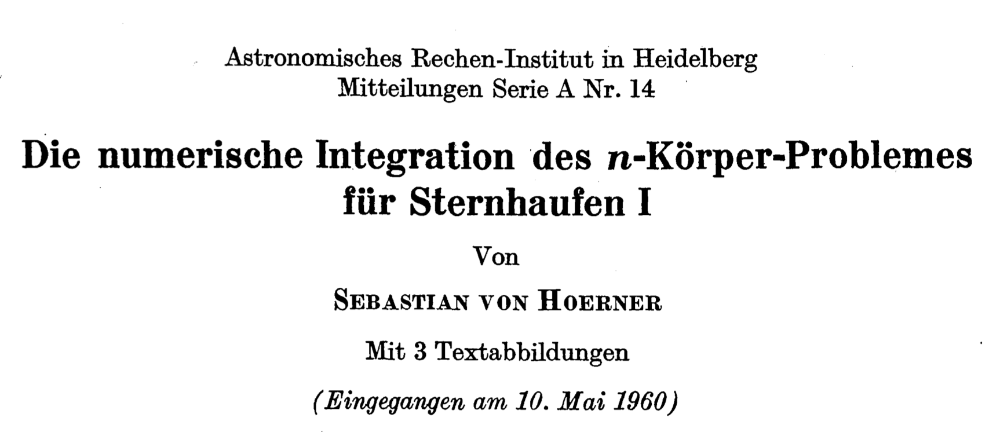
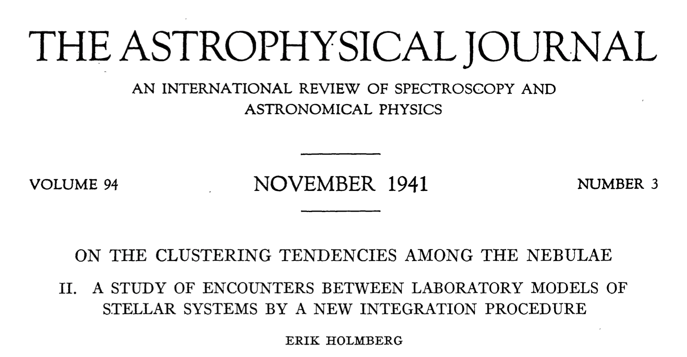
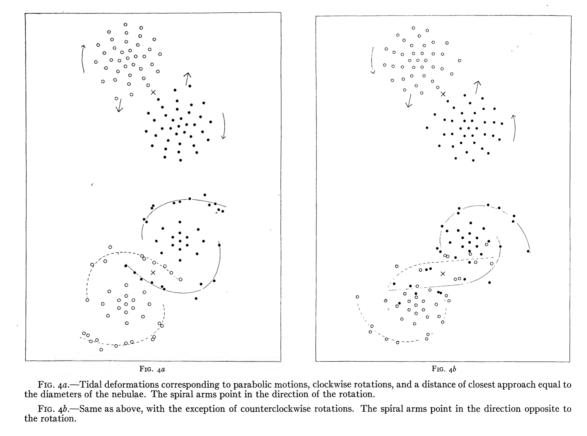

# Welcome and Introduction <!--{{{-->
<!--Setup {{{-->
```{r setup, include=FALSE}
rrepos <- getOption("repos")
rrepos["CRAN"] <- "https://cloud.r-project.org"
options(repos=rrepos)
options(width=100)
library(magicaxis)
knitr::opts_chunk$set(echo = TRUE)
knitr::opts_chunk$set(tidy = FALSE)
knitr::opts_chunk$set(class.output = "out")
knitr::opts_chunk$set(out.width="50%")
knitr::opts_chunk$set(fig.align="center")
#knitr::opts_chunk$set(fig.asp=1)
knitr::knit_engines$set(python = reticulate::eng_python)  
par(mar=c(3,3,1,1))
set.seed(666)
```
```{css, echo=FALSE}
.python { 
  background-color: 
    RColorBrewer::brewer.pal(1,"Set2");
} 
.out { 
  max-height: 300px;
  overflow-y: auto;
  background-color: inherit;
}
```
<!--}}}-->

Welcome to the Introduction to Statistics for Astronomers and Physicists course
for the Summer Semester 2021.

## Course Philosophy <!--{{{-->

This course is designed to be a practical introduction to statistics for
astronomers and physicists who are starting their research careers and have had
little (or perhaps no) previous education in statistics and statistical data
analysis. The course (and these lecture notes) are not designed to be a
statistics reference text. Rather the material presented here is designed to
guide students on a suitable path towards robust data analysis and research.

The course will present many aspects of data analysis that are widely relevant
to modern astronomy and physics. We will borrow heavily from standard
statistical problems and thought experiments in an effort to convey important
points, and demonstrate common statistical and logical fallacies. Problems will
almost always be explored using a mixture of tools simultaneously: plain
English, math, computer code, graphs, and more.

<!--}}}-->

<!--}}}-->

# Course Outline <!--{{{-->

This course will be taught in 4 parts, each spanning from 2-4 weeks  

**Section 1: Data Description, Analysis, and Modelling (Weeks 1-2)** 

When working in empirical science, modelling and understanding datasets is
paramount. In this module we start by discussing the fundamentals of data
modelling. We start by discussing theories of point and interval estimation, in
the context of summary statics (e.g. expectation values, confidence intervals),
and estimation of data correlation and covariance. Students will learn the
fundamentals of data mining and analysis, in a way that is applicable to all
physical sciences.

Topics include:

+ Types of data 
+ Point & interval estimation 
+ Correlation & covariance
+ Fundamentals of data exploration/mining
+ Introduction to data visualisation 

**Section 2: Probability & Decision Making (Weeks 3-5)**

For all aspects of modern science, an understanding of probability is required.
We cover a range of topics in probability, from decision theory and the
fundamentals of probability theory, to standard probabilistic distributions and
their origin. From this module, students will gain an insight into different
statistical distributions that govern modern observational sciences, the
interpretation of these distributions, and how one accurately models
distributions of data in an unbiased manner.

Topics include:

+ Decision theory
+ Fundamentals of probability
+ Statistical distributions and their origins

**Section 3: Bayesian Statistics (Weeks 6-8)**

Bayes theorem led to a revolution in statistics, via the concepts of prior and
posterior evidence. In modern astronomy and physics, applications of Bayesian
statistics are widespread. We begin with a study of Bayes theorem, and the
fundamental differences between frequentest and Bayesian analysis. We explore
applications of Bayesian statistics, through well studied statistical problems
(both within and outside of physics).

Topics include: 

+ Frequentist & Bayesian statistics
+ Bayes theory
+ Prior specification
+ Hypothesis testing   

**Section 4: Parameter Simulation, Optimisation, and Analysis (Weeks 9-12)**  

We apply our understanding of Bayesian statistics to the common problems of
parameter simulation, optimisation, and inference. Students will learn the
fundamentals of Monte Carlo Simulation, Markov Chain Monte Carlo (MCMC)
analysis, hypothesis testing, and quantifying goodness-of-fit. We discuss common
errors in parameter inference, including standard physical and astrophysical
biases that corrupt statistical analyses.

Topics include:  
  
+ Monte Carlo Simulation
+ Markov-Chain Monte Carlo 
+ Fitting high dimensional data
+ Machine Learning 

<!--}}}-->

# Rmarkdown <!--{{{-->

Slides and lecture notes for this course are prepared in **Rmarkdown**, and
provided to you after the lectures.

The utility of **Rmarkdown** is that it allows running execution of code chunks
alongside markdown-style text, in a wide array of languages, including **R**,
**python**, bash, Rcpp, javascript, and more. This allows us to present examples
in multiple languages easily within one document. For example, if I want to plot
a function, I can do so:
<table style="width: 90%">
    <colgroup>
       <col span="1" style="width: 45%;">
       <col span="1" style="width: 45%;">
    </colgroup>
    <tbody> <tr>
<td rblock> <!--{{{-->
``` {r, rblock-zero, fig.height=4, fig.width=6, out.width='90%', eval=FALSE}  
#in R
theta=seq(0,2,by=0.01)
sinu=1+sin(2*pi*theta)
magplot(theta,sinu,type='l')
```
</td> <!--}}}-->
<td pythonblock> <!--{{{-->
``` {python, pyblock-zero, fig.height=4, fig.width=6, out.width="90%", eval=FALSE}
#or in python
import numpy as np
import matplotlib.pyplot as plt
theta=np.arange(0.,2.,0.01)
sinu=1+np.sin(2*np.pi*theta)
plt.plot(theta,sinu)
plt.show()
```
</td> <!--}}}-->
</tr><tr>
<td rblock> <!--{{{-->
``` {r, rblock-zero, fig.height=4, fig.width=6, out.width='90%',eval=TRUE,echo=FALSE} 
```
</td> <!--}}}-->
<td pythonblock> <!--{{{-->
``` {python, pyblock-zero, fig.height=4, fig.width=6, out.width="90%", eval=TRUE, echo=FALSE}
```
</td> <!--}}}-->
</tr></tbody></table>

Information generated and stored within blocks is persistent, and code-blocks
with different engines can also cross-communicate. This means that, for example,
we can:
<table style="width: 90%">
    <colgroup>
       <col span="1" style="width: 45%;">
       <col span="1" style="width: 45%;">
    </colgroup>
    <tbody> <tr>
<td rblock> <!--{{{-->
``` {r, rblock-one, out.width='90%', eval=FALSE}  
#Create some data in R
#E.g. random draws from f~N(0,1)
x=rnorm(1e3) 
y=rnorm(1e3) 
#Default plot in R
plot(x,y)
```
</td> <!--}}}-->
<td pythonblock> <!--{{{-->
``` {python, pyblock-one, out.width="90%", eval=FALSE}
#and access it directly in python
plt.scatter(r.x,r.y)
plt.show()
```
</td> <!--}}}-->
</tr><tr>
<td rblock> <!--{{{-->
``` {r, rblock-one, out.width='90%',eval=TRUE,echo=FALSE} 
```
</td> <!--}}}-->
<td pythonblock> <!--{{{-->
``` {python, pyblock-one, out.width="90%", eval=TRUE, echo=FALSE}
```
</td> <!--}}}-->
</tr></tbody></table>

<!--}}}-->

# Slido <!--{{{-->

In addition to the lecture notes and slides, all students can post on-the-fly
questions about the materials via slido. To access slido, you simply scan the QR
code with your smartphone camera or join at slido.com using the event ID listed
in the window.

Once you are connected to the event, you simply post your questions whenever you
like. You should all try to **ask as many questions as you like**! The reasons
that this will work best when you ask as many questions as possible are:

+ Questions can be asked anonymously, so you can ask freely and without anxiety. 
+ All questions are good questions!! 
+ Once a question is registered, everyone is able to add support by clicking the
"thumbs up".
  - Think of this as being a way of saying "Oh! I want to know the answer to
  that too!".
  - Questions are ranked by popularity, so vote for questions you want to have
  answered too!
  - I'll try to answer all questions, but the most popular questions will float
  to the top and get answered quickly!
+ **Most importantly**: I will be able to use questions that were asked and/or
were popular to update the lecture notes
  - Course notes will better cover things you don't understand
  - Course will be more relevant to you 
  - The course will improve over time! 

So ask whenever and about whatever you think is relevant/interesting/unclear.
The more the better!

<!--}}}-->

# Statistics and Computing <!--{{{-->

This is a lecture course on Statistics and Statistical methods; so why do we
care about computer code?!

It is of course possible to discuss statistics entirely on-paper. However using
computer code allows us to explore practical statistics in real time, rather
than limiting ourselves purely to equations and diagrams (**Full disclosure**:
We will use these a lot in this course too!).

Additionally (and probably more importantly) the goal of this course is for you
to learn how to apply statistics to the problems that you will encounter over
the course of your academic careers; and to do so _properly_. Therefore, an
entirely on-paper statistics course isn't likely to be overly useful. My goal is
for you to be able to leave this course with the skills to actually apply these
concepts in real-life applications without difficulty.

<!--}}}-->

# Why do we need programming? <!--{{{-->

Modern physics and astronomy requires an understanding of programming. From
theoreticians writing models to experimentalists writing analysis pipelines,
most physicists and astronomers will use read, write, or use a computer program
every day.

An excellent example of this is the N-body simulation. In 1941, Erik Holmberg
performed the first simulations of colliding galaxies, 20 years prior to a
famous work by Sebastian von Hoerner that established the field (and name)
N-body Simulations.





Holmberg's work was exceptional for a number of reasons, but has become famous
because of _how_ it was completed. Holmberg simulated the collisions of rotating
spiral galaxies:



And generated tidal disruption features that are now seen commonly in merging
spiral galaxies:


The surprise? His work was computed entirely _by hand_. Holmberg used
arrangements of lightbulbs to simulate groups of stars, and photometers to
compute the gravitational pull of all mass-elements on each-other per unit time.


Of course nowadays we can run a simulation like this in seconds on any laptop
(or smartphone, if you really want to!). This allows measurements to be more
accurate, more detailed, and more reproducible. All of these are fundamental to
modern natural science.

<!--}}}-->

# Modern Science and the Requirement of Programming <!--{{{-->

The ubiquitousness of programming in the modern physical sciences is 
linked to the important role that statistics plays in these fields. Modern
science is increasingly reliant on large and/or complex datasets, which
fundamentally must be analysed using modern statistical methods. A classic
example is model optimisation (which we will cover in detail in this course):
let us take a relatively simple dataset that we know follows a generic beta
distribution, and attempt to model this dataset using a function containing 2
parameters:

$$ Y = Beta(X, \alpha,\beta) + {\rm noise} \\
0\leq X \leq 1 \\
\alpha, \beta \in [0,\infty)
$$

```{r echo=FALSE, fig.height=4, fig.width=6, out.width='80%'} 
x=runif(1e3)
truth=c(3.2,7.7)
y=dbeta(x=x,shape1=truth[1],shape2=truth[2])+rnorm(length(x),mean=0,sd=0.1)
magplot(x,y,ylab=expression(paste('Beta'(alpha,beta))),xlab='x',pch=20,col='blue3')
```
One might be inclined to attempt to fit a model to these data by-hand, using
trial and error:

```{r trial-and-error, fig.show='animate', ffmpeg.format='gif', dev='jpeg', aniopts='loop=FALSE', interval=2,echo=FALSE, fig.height=4, fig.width=6, out.width='80%'}
model.x=seq(0,1,by=0.01)
for (i in 1:20) { 
  model.alpha=runif(1,min=0,max=10)
  model.beta=runif(1,min=0,max=10)
  model.y=dbeta(model.x,model.alpha,model.beta)
  magplot(x,y,ylab=expression(paste('Beta'(alpha,beta))),xlab='x',pch=20,col='blue3',
          main=paste("a=",round(digits=2,model.alpha),"; b=",round(digits=2,model.beta)))
  lines(model.x,model.y,col='red')
}
model.alpha=2.8
model.beta=6.7
```

Using this approach we can get a reasonable fit with $\alpha=`r model.alpha`,\beta=`r model.beta`$: 

```{r echo=FALSE, fig.height=4, fig.width=6, out.width='80%'} 
model.y=dbeta(model.x,model.alpha,model.beta)
magplot(x,y,ylab=expression(paste('Beta'(alpha,beta))),xlab='x',pch=20,col='blue3',
        main=paste("a=",round(digits=2,model.alpha),"; b=",round(digits=2,model.beta)))
lines(model.x,model.y,col='red',lwd=2)
```

But is this solution near the truth? How close is good enough? And what are the
uncertainties on the parameters? These are all important in modern science, and
they are precisely the sort of questions/problems that computers/programs are
designed to tackle. With just one command, we can use R/python to reach a more
accurate solution, in a fraction of the time.

```{r}
#Estimate parameters using Nonlinear Least Squares (nls) in R 
fit_R=nls(y~dbeta(x,alpha,beta), #The function to fit
          data=list(x=x,y=y),    #The data 
          start=list(alpha=2,beta=5), #The initial guess
          algorithm='port',      #The algorithm 
          lower=c(0,0))          #The lower bounds
best_R=summary(fit_R)$parameters
```
``` {python, fig.height=4, fig.width=6, out.width='90%'}
#Estimate parameters using scipy.optimize.curve_fit in python
import scipy.optimize
import scipy.stats
best_py, cov_py = scipy.optimize.curve_fit(
         scipy.stats.beta.pdf, #The function to fit
         r.x, r.y,         #The data
         p0=[2,5],         #The initial guess 
         bounds=(0,np.inf),#The lower and upper bounds
         method='trf')     #The fitting algorithm
```
```{r, echo=FALSE, fig.height=4, fig.width=6, out.width='90%'}
model.y=dbeta(model.x,best_R[1],best_R[2])
magplot(x,y,ylab=expression(paste('Beta'(alpha,beta))),xlab='x',pch=20,col='blue3',
        main=paste("a=",round(digits=2,best_R[1]),"; b=",round(digits=2,best_R[2])))
lines(model.x,model.y,col='red',lwd=3)
```
```{python, echo=FALSE, fig.height=4, fig.width=6, out.width='90%'} 
plt.scatter(r.x,r.y)
model_x=np.arange(0.,1.,0.01)
plt.plot(model_x,scipy.stats.beta.pdf(model_x,best_py[0],best_py[1]),color='r')
plt.title("a="+str(np.round(best_py[0],2))+"; b="+str(np.round(best_py[1],2)))
```

Obviously these fits are superior to those which we can reach by-hand in terms
of accuracy, effort, and runtime. But the most important benefit is in terms of
*uncertainty estimation*. Statistical computing is important for a wide range of
reasons, but arguably the first and most important reason is for the computation
of measures of uncertainty.

```{r}
#Model statistics in R
summary(fit_R)
```
```{r,echo=FALSE,eval=TRUE, fig.height=4, fig.width=6, out.width='90%'}
sigma = summary(fit_R)$sigma
conf.int = outer(model.y, c(-1,1)*sigma, '+')
magplot(x,y,ylab=expression(paste('Beta'(alpha,beta))),xlab='x',pch=20,col='blue3',
        main=paste("a=",round(digits=2,best_R[1]),"±",round(digits=2,best_R[3]),"; ",
                   "b=",round(digits=2,best_R[2]),"±",round(digits=2,best_R[4])))
lines(model.x,model.y,col='red',lwd=2,lty=1)
lines(model.x,conf.int[,1],col='red',lwd=2,lty=2)
lines(model.x,conf.int[,2],col='red',lwd=2,lty=2)
legend('topright',legend=c('Data','Best-fit Model','1-sigma uncertainty'),
       pch=c(1,NA,NA),lty=c(NA,1,2),col=c("black","red","red"),lwd=2,inset=c(0.05,0.05))
```  

And the equivalent in **python**: 

```{python}
#Model parameters and covariance in python
print(best_py,cov_py) 
```
```{python, echo=FALSE, fig.height=4, fig.width=8, out.width='90%'} 
plt.scatter(r.x,r.y,label='Data')
sigma_py=np.sqrt(cov_py)
plt.plot(model_x,scipy.stats.beta.pdf(model_x,best_py[0],best_py[1]),color='r',label='Best-fit Model')
plt.plot(model_x,scipy.stats.beta.pdf(model_x,best_py[0],best_py[1])-r.sigma,'--',color='r',label='1-sigma uncertainty')
plt.plot(model_x,scipy.stats.beta.pdf(model_x,best_py[0],best_py[1])+r.sigma,'--',color='r')
plt.title("a="+str(np.round(best_py[0],2))+"±"+str(np.round(sigma_py[0,0],2))+"; "+
          "b="+str(np.round(best_py[1],2))+"±"+str(np.round(sigma_py[1,1],2)))
plt.legend()
```

<!--}}}-->

# Do I need to know R or Python? <!--{{{-->

Despite what the internet will tell you, today there is very little separating
the two languages in terms of functionality. Both languages can be run as a
subprocess of the other, both have well developed tools for data analysis and
machine learning, and both have a wealth of tutorials and guides to help new
users enter the game.

+ <p style="color:blue"> Overall, there is one major consideration that will
(and should) drive your choice of which language to learn first: </p>

- <center> <font size="12" color="black">  What languages do your colleagues use
most? </font> </center>

<!--}}}-->

# Focus on whichever suits you best (and understand both if you can) <!--{{{-->

Any perceived benefit or detriment of the languages will invariably be
overwhelmed by whether or not you are able to share and discuss code together
with your colleagues. So, this is mostly a case where joining the herd is
probably the sensible choice.

## **What's the difference between R and Python?**  

### R
**R** was originally developed as a statistics and data analysis language, and
so many data analysis tools are available natively within base **R**. Additional
tools are available through the Comprehensive R Archive Network (CRAN), which
contains over 10k packages that are all *required* to be fully documented. This
means that if you want to perform a particular flavour of statistical analysis,
there is a good chance that well developed code already exists within **R** to
do it (or at least to get you started).

### Python 

**Python**'s strength lies within the its use as a general programming language
beyond data analysis. Packages are available to install via conda, and are
generally reliable despite (often) a lack of documentation.

### What do I use?

Personally I code primarily in **R**. This is useful for this course, as much of
the analysis tools that we will use are available in base **R**. Nonetheless, as
I said above, it is entirely possible to redo much of this analysis in
**python**. Typically the only draw-back to doing so is that the code is longer
(most complex models in **R** can be specified in few lines).

### What will you see in this course?

In practice, the vast majority of examples in this course will be programmed in
**R**. 

_**However**_, I am happy to rewrite examples in **python** that you think
would be particularly useful! 

So please let me know which of the examples/problems that we explore during the
course that you would like to see written in **python**, and I will add them to
the course notes.

Finally, as you will likely see in the following sections, if you can understand
one, then you can probably understand both. In this lecture we will go through
some examples of **R** and **python** code, so that you have an introduction to
the important parts (and can follow along without much trouble).

<!--}}}-->
 
# A Crash Course in R and Python <!--{{{-->
<!--Intro{{{-->
For the remainder of this chapter, we will be going through a crash course in
**R/python** basics. There are _many_ online tools that you can use to teach
yourself both of these languages. In this course, you will be seeing a fair bit
of **R** (in particular) but also **python**. If you are already familiar with
**python**, then this section may be useful as a "Rosetta stone" of sorts. If
you are unfamiliar with either language, then this section will hopefully give
an introduction to the syntax/methods for using **R** and/or **python**.

A few important NBs: 

 + Much of the information here focuses on _simplicity_ rather than
   _efficiency/elegance_.

 + There may be other/better ways to perform the below operations. 

 + This list of "good/important things to know" is certainly not exhaustive. 

 + You can always learn more advanced operations in **R** and **python** via
   [this very useful website](https://www.google.com).

Additionally, I am _certainly_ not a **python** expert. I have tried to
construct the below comparisons/conversions between **R** and **python** in the
fairest possible manner. If you think that there is a simpler/more
efficient/more elegant implementation of any **python** snippets below (or if
something I've written is just plain wrong!) then please let me know and I will
update the notes accordingly!

The following slides cover:

> - Variable assignment 
> - Variable types 
> - Data types 
> - Code structure 
> - Data indexing 
> - Installing and loading libraries/packages
> - Reading and Writing data
> - Plotting 
> - Interfacing between **R** and **python**
<!--}}}-->

# **Installing and loading Libraries** <!--{{{-->

The first important step in using **R** and **python** efficiently is to
understand how to install and load libraries/packages. These are tools which
have been written by a third party and made available for all users to access
and use. Both **R** and **python** have a plethora of available packages. It is
very rare to need to code up a statistical method yourself, as it has most
likely already been written (with speed tricks and important checks/balances).
Packages in **R** are installed from _within_ the **R** session, whereas
**python** packages are installed from the command line with a separate function
"pip":
<table style="width: 90%">
    <colgroup>
       <col span="1" style="width: 45%;">
       <col span="1" style="width: 45%;">
    </colgroup>
    <tbody> <tr>
<td rblock> <!--{{{-->
``` {r, fig.height=4, fig.width=6, out.width='90%', eval=FALSE, results=FALSE}  
#within the R session
#Install a packages called "remotes"
install.packages("remotes") 
```
</td> <!--}}}-->
<td pythonblock> <!--{{{-->
``` {bash, fig.height=4, fig.width=6, out.width="90%", eval=FALSE, results=FALSE}
#from the _commandline_
#install the numpy package using pip 
pip install numpy
```
</td> <!--}}}-->
</tr></tbody></table>

To load these packages into **R** and **python** something we've already seen a few times: 
<table style="width: 90%">
    <colgroup>
       <col span="1" style="width: 45%;">
       <col span="1" style="width: 45%;">
    </colgroup>
    <tbody> <tr>
<td rblock> <!--{{{-->
``` {r, fig.height=4, fig.width=6, out.width='90%', eval=FALSE, results=FALSE,messages=FALSE}  
#in R: load the remotes package
library("remotes") 
```
</td> <!--}}}-->
<td pythonblock> <!--{{{-->
``` {python, fig.height=4, fig.width=6, out.width="90%", eval=FALSE, results=FALSE}
#in python: load numpy
import numpy as np
```
</td> <!--}}}-->
</tr></tbody></table>

The "as np" section of the import in **python** is not required, but it makes
using the package in **python** a lot simpler. This is because **python** tends
to push users towards "object-oriented" programming style, whereas **R** lends
itself naturally to a more "functional" programming style. We'll discuss what
this means later.

In **R**, packages are available primarily through CRAN. Some packages are
available through the separate "Bioconductor" entity, and these must be
installed differently (but similarly easily). The "remotes" package that we just
installed and subsequently loaded, however, allows us to directly install
packages that are on, e.g., github. **Python** has similar
functionality within pip: 
<table style="width: 90%">
    <colgroup>
       <col span="1" style="width: 45%;">
       <col span="1" style="width: 45%;">
    </colgroup>
    <tbody> <tr>
<td rblock> <!--{{{-->
``` {r, fig.height=4, fig.width=6, out.width='90%', eval=FALSE, results=FALSE,messages=FALSE}  
#in R: load the remotes package
library("remotes") 
#and install the "Rfits" package 
#from github user ASGR:
install_github("ASGR/Rfits")
```
</td> <!--}}}-->
<td pythonblock> <!--{{{-->
``` {bash, fig.height=4, fig.width=6, out.width="90%", eval=FALSE, results=FALSE}
#from the commandline
#pip install the django package
pip install git+https://github.com/django/django.git
```
</td> <!--}}}-->
</tr></tbody></table>

<!--}}}--> 

# **Code Structure and Control Functions** <!--{{{-->

An important difference between the **python** and **R** languages is the format
of the code itself. **Python** imposes strict formatting requirements on the
code, whereby blocks of code are linked together via leading whitespaces (i.e.
indentation). **R** imposes no formatting restriction on codeblocks, instead
using brackets. This means that **R** can seem overly verbose with brackets at
times. As a demonstration, here is the formatting required for a standard set of
control functions that are used in **R** and python: if, for, and while
statements.

<table style="width: 90%">
    <colgroup>
       <col span="1" style="width: 45%;">
       <col span="1" style="width: 45%;">
    </colgroup>
    <tbody> <tr>
<td rblock> <!--{{{-->
``` {r, fig.height=4, fig.width=6, out.width='90%', eval=FALSE}  
#Conditional statements in R
#If statements 
if (condition) { 
  #Evaluate if condition == true
} else { 
  #Evaluate if condition == false
}

#For statements 
for (var in sequence) { 
  #Evaluate 
}

#While statements 
while (condition) { 
  #Evaluate until condition == false
}
```
</td> <!--}}}-->
<td pythonblock> <!--{{{-->
``` {python, fig.height=4, fig.width=6, out.width="90%", eval=FALSE}
#Conditional statements in python
#If statements 
if condition:  
  #Evaluate if condition == true
else:
  #Evaluate if condition == false

#For statements 
for var in sequence:  
  #Evaluate 

#While statements 
while condition: 
  #Evaluate until condition == false
```
</td> <!--}}}-->
</tr></tbody></table>  

As you can see, the code here looks largely the same for both languages. The key
point to understand is that the formatting in the **R** code block is there by
choice, not necessity. This is clearest with nested loops:

``` {r, fig.height=4, fig.width=6, out.width='90%', eval=TRUE}  
#Valid Nested for loops in R 
mat<-matrix(0,3,3)
#Standard nested For loops 
for (col in 1:ncol(mat)) { 
  for (row in 1:col) { 
    mat[row,col]<-1
  }
}
mat

#Without the brackets works...
mat<-matrix(0,3,3)
for (col in 1:ncol(mat)) 
  for (row in 1:col) 
    mat[row,col]<-2
mat

#... but only for one line at a time
mat<-matrix(0,3,3)
for (col in 1:ncol(mat)) 
  for (row in 1:col) 
    silly<-"mistake"
    mat[row,col]<-3
mat

#To hammer the point: 
#This works too (but please don't)
mat<-matrix(0,3,3)
for 
(col 
in 
1:ncol(mat)
)
{
for (row in 1:col) { mat[row,col]<-4
}} 
mat
```

Conversely python has only one valid format for nested loops: 
``` {python, fig.height=4, fig.width=6, out.width="90%", eval=TRUE, error=TRUE}
#Valid Nested for loops in python 
mat=np.zeros([3,3])
#Standard nested For loops 
for col in range(mat.shape[0]): 
  for row in range(col):  
    mat[row,col]=1
mat
```

<!--}}}--> 

# **Built-in Functions** <!--{{{-->

One major difference between **R** and **python** regards functions that are
built into the base language. In **R**, many statistical and mathematical
operations are available within the base language, because of its
history/development from the statistics language "S". As a result, one can do a
great many powerful things in base **R** (i.e. without the need to look for,
install, and load additional packages). In **python**, the majority of the base
**R** functionality can be inherited from three of the most widely used (by
physicists and astronomers at least) packages in python: _numpy_, _scipy_, and
_astropy_. As a result, most scientific **python** programs will start by
importing one or all of these packages.

We've already seen this in practice here, where (for example) we've utilised the
numpy vectorisation,  linear algebra functions, and scipy model optimisation in
order to reproduce behaviour that was available in base **R**. Another important
functionality which we hid was the ability to generate data following various
statistical distributions. This is core to many statistics applications that we
will explore, and so we'll revisit it now.
In the section on "Modern Science and the Requirement of Programming", we
generated data that followed a Beta function: $ Y = Beta(X, \alpha,\beta) + {\rm
noise} $ (NB: we will look more into this and other functions later in the
course). In **R** we can generate this data using the suite of Beta distribution
functions, which allow the calculation of the density, distribution function,
quantile function, and random generation from the function:

``` {r, fig.height=4, fig.width=6, out.width='90%', eval=TRUE}  
#Documentation for the Beta functions in R
help(dbeta) # or ?dbeta 
```

The above launches the documentation page for this **R**. As we have noted
previously, **R** has _very_ rigorous standards of documentation for all
functions that are present on CRAN and in the base code, including:

+ Function description; 
+ Function usage; 
+ Argument definitions; 
+ Detailed information about the function and its uses; 
+ Notes about possible pitfalls; 
+ Authorship and citation information; 
+ References to related publications; 
+ Lists of related functions; and
+ **Examples**. 

The last item is particularly useful, as examples for almost all functions in R
can be run by just using the "example" function:

``` {r, fig.height=4, fig.width=6, out.width='90%', eval=FALSE}  
#Running examples for functions in R
example(dbeta)
```

Documentation for **python** functions can also be seen in a similar manner, if
they exist (which they do for most mainstream functions in some form or
another):

``` {python, fig.height=4, fig.width=6, out.width='90%', eval=TRUE}  
#Documentation for the Beta functions in python
help(scipy.stats.beta)
```

This is an example of where **R** and **python** have the same functionality in
the base code (i.e. with the help functions), and where **python** requires the
additional scipy package to perform functions available in base **R** (i.e. with
the beta distributions). Note thought that this is not necessarily a
limitation/criticism of either language, as loading an additional package is
generally trivial in both languages.

Put simply, **R** and **python** base functions differ mostly in the fact that
most functions available within _numpy_ and _scipy_ are available within base
**R**.

<!--}}}--> 

# **Variable assignment** <!--{{{-->

Variable assignment in **R** and **python** can be done in the standard way
using "=".

<table style="width: 90%">
    <colgroup>
       <col span="1" style="width: 45%;">
       <col span="1" style="width: 45%;">
    </colgroup>
    <tbody> <tr>
<td rblock> <!--{{{-->
``` {r, fig.height=4, fig.width=6, out.width='90%', eval=TRUE}  
#in R
a=10
b=a+4
print(b)
```
</td> <!--}}}-->
<td pythonblock> <!--{{{-->
``` {python, fig.height=4, fig.width=6, out.width="90%", eval=TRUE}
#or in python
a=10
b=a+4
print(b)
```
</td> <!--}}}-->
</tr></tbody></table>

More traditionally the **R** assignment character is the "arrow": `<-`.
That is, I can rewrite the **R** assignments above as: 
``` {r, fig.height=4, fig.width=6, out.width='90%', eval=TRUE}  
#using arrows in R
rm("b") #get rid of the old "b"
exists("b") #Good, it's gone!
a<-10
b<-a+4
print(b)
```
The arrow notation is mostly historical, and in practice there is little
difference between the arrow notation and the equals notation. Some small
differences: While assignment with the "=" is assumed to be right-to-left,
assignment in the arrow notation follows the direction of the arrow... This
means that it's possible to assign left-to-right:
``` {r, fig.height=4, fig.width=6, out.width='90%', eval=TRUE}  
#right-to-left arrows
rm('b') #get rid of the old "b"
exists('b') #Good, it's gone!
10->a
a+4->b
print(b)
```
But of course, in practice you will never use this functionality. The arrow
notation has **one common catastrophic failure**, which is the difference in
behaviour between "a<-3" ('assign 3 to a') and "a< -3" ('is a less than minus
3?'). The main reason for the arrow's continued existence is that the "=" has a
secondary function as "named keyword specification" in function calls, which we
will discuss below.

Generally, for new users to **R** (and especially those who frequently switch
between **R** and python), using the "=" notation is probably preferable. In
this course you will see that I primarily use the arrow notation, because I was
taught **R** by picky R-purists during my Masters, and never broke the habit.
**Full Disclosure:** this means that I _frequently_ have to rewrite my python
assignments because I mistakenly fall into **R** notation.

2/10 would not recommend. 

<!--}}}--> 

# **Custom Functions** <!--{{{-->

Functions in **R** and **python** are specified in similar ways, but with
slightly different syntax. Lets construct a custom function that computes the
root-mean-square of two vectors:

<table style="width: 90%">
    <colgroup>
       <col span="1" style="width: 45%;">
       <col span="1" style="width: 45%;">
    </colgroup>
    <tbody> <tr>
<td rblock> <!--{{{-->
``` {r, fig.height=4, fig.width=6, out.width='90%', eval=TRUE}  
#Custom Functions in R
rms<-function(a,b) { 
  return(sqrt(a^2+b^2))
}
x<-seq(0,1,len=10)
y<-seq(2,3,len=10)
rms(a=x,b=y)
```
</td> <!--}}}-->
<td pythonblock> <!--{{{-->
``` {python, fig.height=4, fig.width=6, out.width="90%", eval=TRUE, error=TRUE}
#Custom Functions in python
def rms(a,b): 
  return np.sqrt(a**2+b**2)

x=np.linspace(0,1,num=10)
y=np.linspace(2,3,num=10)
rms(a=x,b=y)
```
</td> <!--}}}-->
</tr></tbody></table>

<!--}}}--> 

# **Variable types** <!--{{{-->

R and **python** have subtly different variable types, which prior to the
release of Python3 meant that the behaviour of R and **python** (when confronted
with the same expression) could behave very differently. However, this is now
less frequently the case. Nonetheless, understanding the different variable
types is important.

Python has distinct data types for integers ("int"), real numbers ("float"),
complex-numbers ("complex"), and strings ("str"). There are more, but for now
let's focus on these. This is slightly simplified in **R**, where there is
nominally no distinction between integers and real-numbers: all real-numbers are
classes as the "numeric" type. Therefore, broadly speaking, you can consider
**R** to have two variable types: "numeric" for real numbers and "character" for
strings (again, there are others, but let's focus on these for now).

<table style="width: 90%">
    <colgroup>
       <col span="1" style="width: 45%;">
       <col span="1" style="width: 45%;">
    </colgroup>
    <tbody> <tr>
<td rblock> <!--{{{-->
``` {r, fig.height=4, fig.width=6, out.width='90%', eval=FALSE}  
#Types in R
a=3        #numeric
a=3.1415   #numeric
a="3.1415" #character
```
</td> <!--}}}-->
<td pythonblock> <!--{{{-->
``` {python, fig.height=4, fig.width=6, out.width="90%", eval=FALSE}
#Types in python
a=3        #int
a=3.1415   #float
a="3.1415" #str
```
</td> <!--}}}-->
</tr></tbody></table>

Prior to **python3** this had important consequences, due to the way in
variables are dynamically "typecast" (that is, how they decide what 'type' a new
variable will inherit during mathematics). In **python2** the operation "14/10"
would result in 1, because these are integers and the divisor used "integer
floor division". This was updated in python3 to produce the far more logical
behaviour below:
<table style="width: 90%">
    <colgroup>
       <col span="1" style="width: 45%;">
       <col span="1" style="width: 45%;">
    </colgroup>
    <tbody> <tr>
<td rblock> <!--{{{-->
``` {r, fig.height=4, fig.width=6, out.width='90%', eval=TRUE}  
#Arithmetic in R
a=10
b=14
print(b/a)
```
</td> <!--}}}-->
<td pythonblock> <!--{{{-->
``` {python, fig.height=4, fig.width=6, out.width="90%", eval=TRUE}
#Arithmatic in python3
a=10
b=14
print(b/a)
```
</td> <!--}}}-->
</tr></tbody></table>

Both **R** and **python** here have the same result, because **python3** defines
"/" as a 'float' operator, and dynamically typecasts the integers to float prior
to computation. In **R** the need for this housekeeping is less obvious, because
even integer numbers are "numeric" from the start, but formally a similar
process takes place behind the scenes. This is another example of where the
behaviour of **R** and **python** are converging.

You can see this behaviour directly by looking at the "class" (in R) or "type"
(in python) of the variables:
<table style="width: 90%">
    <colgroup>
       <col span="1" style="width: 45%;">
       <col span="1" style="width: 45%;">
    </colgroup>
    <tbody> <tr>
<td rblock> <!--{{{-->
``` {r, fig.height=4, fig.width=6, out.width='90%', eval=TRUE}  
#Variable classes in R
c=b/a
class(a); class(b); class(c)
```
</td> <!--}}}-->
<td pythonblock> <!--{{{-->
``` {python, fig.height=4, fig.width=6, out.width="90%", eval=TRUE}
#Variable types in python
c=b/a
type(a); type(b); type(c)
```
</td> <!--}}}-->
</tr></tbody></table>
Note that if we force **R** to treat the input variables as integers, we see the
same dynamic typecasting:

<!--{{{-->
``` {r, fig.height=4, fig.width=6, out.width='90%', eval=TRUE}  
#Typecast in R
a=as.integer(a)
b=as.integer(b)
c=b/a
class(a); class(b); class(c)
```
<!--}}}-->

So, in basically all practical respects, **python** has converged to the **R**
behaviour in this regard. So much so that the formal comparisons now typecast as
well:
<table style="width: 90%">
    <colgroup>
       <col span="1" style="width: 45%;">
       <col span="1" style="width: 45%;">
    </colgroup>
    <tbody> <tr>
<td rblock> <!--{{{-->
``` {r, fig.height=4, fig.width=6, out.width='90%', eval=TRUE}  
#Integers in R
as.integer(10) == as.numeric(10)
```
</td> <!--}}}-->
<td pythonblock> <!--{{{-->
``` {python, fig.height=4, fig.width=6, out.width="90%", eval=TRUE}
#Integers in python
int(10) == float(10) 
```
</td> <!--}}}-->
</tr></tbody></table>
Which makes sense, because the value of 10 is still the same whether you're
counting discretely (integers) or continuously (numeric/float).
<!--}}}--> 

# **Data types** <!--{{{-->

Collections of variables can be made in different ways. These collections of
variables are actually classed as different variable types (so should go in the
previous section), but for ease-of-introduction we're making a distinction
between "types of variables" and "types of collections of variables".
In **R** and **python** there are many different ways to combine chunks of
variables. We're going to focus on a subset of these within **R** (specifically
'vectors', 'arrays', 'lists', and 'data.frames') and on their **python**
equivalents ('numpy arrays', 'numpy ndarrays', 'dictionaries', and 'pandas data
frames').

# Vectors and np.arrays <!--{{{-->

Collections of variables of a single type can be combined into vectors in both
**R** and **python**. In **R**, the vector is a fundamental unit to the
structure of the language, and as a result essentially all operations that you
perform can be done in a vectorised fashion. In **python**, (the most widely
used implementation of) vectors are implemented within the numpy package.

Let's make a simple vector in **R** and **python**, and then look at its format:
<table style="width: 90%">
    <colgroup>
       <col span="1" style="width: 45%;">
       <col span="1" style="width: 45%;">
    </colgroup>
    <tbody> <tr>
<td rblock> <!--{{{-->
``` {r, fig.height=4, fig.width=6, out.width='90%', eval=TRUE}  
#Vectors in R
vec=c(1,2,3,4,5,6)
print(vec); class(vec)
```
</td> <!--}}}-->
<td pythonblock> <!--{{{-->
``` {python, fig.height=4, fig.width=6, out.width="90%", eval=TRUE}
#Vectors in python
vec=np.array([1,2,3,4,5,6])
print(vec); type(vec)
```
</td> <!--}}}-->
</tr></tbody></table>
In **R** we have used the concatenate command "c" to construct our vector of
integers. Note that, because the vector is a fundamental object in **R**, it
simply retains the type "numeric"; however in **python** this form of variable
has the new type numpy.ndarray. As you can guess from the name, this is a
special 1-dimensional case of the n-dimensional array we will discuss next. The
implementation of numpy.ndarray is essentially the same as base vectors in
**R**, which means that simple vector arithmetic is possible simply in both
languages.

<table style="width: 90%">
    <colgroup>
       <col span="1" style="width: 45%;">
       <col span="1" style="width: 45%;">
    </colgroup>
    <tbody> <tr>
<td rblock> <!--{{{-->
``` {r, fig.height=4, fig.width=6, out.width='90%', eval=TRUE}  
#Vector Arithmetic in R
a=seq(0,100,length=12)
b=seq(100,30,length=12)
#now do some arbitrary arithmetic
sum((a+b)/sqrt(a^2+b^2))
```
</td> <!--}}}-->
<td pythonblock> <!--{{{-->
``` {python, fig.height=4, fig.width=6, out.width="90%", eval=TRUE}
#Vector Arithmetic in python
a=np.linspace(0,100,num=12)
b=np.linspace(100,30,num=12)
#now do some arbitrary arithmetic
((a+b)/np.sqrt(a**2+b**2)).sum()
```
</td> <!--}}}-->
</tr></tbody></table>
Note that there are two important differences between these snippets. Firstly,
here I've used the caret ("^") exponentiation operator in **R**. In **python**
_the caret signifies bitwise XOR, and has nothing to do with exponentiation_.
Note though that you can also exponentiate in **R** using the python/C/fortran
double-star "\*\*" notation as well. But if you frequently use notation in **R**
(as I do...) then this is possible gotcha. Secondly, you'll see that in the
**python** snippet the sum() command is tacked onto the end of the command,
rather than wrapping the command (as in the **R** snippet). I didn't _have_ to
write it this way, but did so to give you your first taste of the
object-oriented syntax of most **python** code. We'll discuss this more a bit
later.
<!--}}}-->

# Arrays and np.ndarrays <!--{{{-->

In **python** the 1D np.array is a special case of the ndarray, whereas in **R**
vectors and arrays are different classes. Internally this is because vectors do
not contain a "dimension" attribute (i.e. the do not carry dimension status
because they are "vectors"; they must have only one dimension). Or more
accurately, arrays and matrices in **R** are actually just vectors which contain
an additional dimension attribute. We can of course create a 1-dimensional array
in R, and the distinction from the vector is simply the dimension attribute.
``` {r, fig.height=4, fig.width=6, out.width='60%', eval=TRUE}  
#Vectors vs Arrays in R
a=seq(0,100,length=12)
b=array(seq(100,30,length=12))
str(a); str(b); identical(a,b)
#but arithmetic is identical
sum((a+b)/sqrt(a^2+b^2))
```

When we make the step up to two-dimensional arrays in **R**, we find that there
is another class: "matrix". The matrix is the special case of the 2D-array, and
functionally is identical to a 2D-array:
``` {r, fig.height=4, fig.width=6, out.width='60%', eval=TRUE}  
#Vectors vs Arrays in R
a=array(1:50,dim=c(10,5)) #2D array with dim 10x5
b=matrix(1:50,nrow=10,ncol=5) #matrix with dim 10x5
class(a); class(b); identical(a,b)
```
The main reason for the distinction between matrices and arrays is because the
2D matrix is ubiquitous in mathematics, and are natively supported by base
**R**.  As a result there are _many_ functions that operate on matrices
directly, but which are not designed for higher dimensional arrays. Having the
separate "matrix" class makes handling compatibility in base **R** and other
functions trivial. In **python** one can generate arrays with 2 or more
dimensions using a range of techniques, depending primarily on how you want
these arrays to be initialised (i.e. with 0s, 1s, or with arbitrary numbers).

``` {python, fig.height=4, fig.width=6, out.width="60%", eval=TRUE}
#Multidimensional arrays in python
a=np.ones([10,5]) #filled with 1s
b=np.zeros([10,5]) #filled with 0s
c=np.ndarray([10,5]) #filled arbitrarily 
```

To construct an multidimensional array from a predefined vector of numbers, then
this is done best by creating a vector and "reshaping" it into the desired
multi-dimensional array. However, we should not some different behaviour here in
R and **python**. In **R**, we initialise an array by providing a "data" vector
to the array function. **Importantly**: the data vector is replicated until the
desired array is filled. This means that arrays with repeated structure etc can
be trivially generated; but note that arrays in **R** are always filled
by-column.

``` {r, fig.height=4, fig.width=6, out.width='60%', eval=TRUE}  
#multidimensional array in R
a=array(seq(0,1,len=12),dim=c(3,5,2))
b=array(seq(0,1,len=10),dim=c(3,5,2))
print(a); print(b)
```

In **python**, we cannot reshape a vector into an array with more/fewer entries
than the original vector (which makes sense, because we are "reshaping", not
instantiating a new object):
``` {python, fig.height=4, fig.width=6, out.width="60%", eval=TRUE,error=TRUE}
#multidimensional array with repition in python
a=np.linspace(0,1,num=12).reshape([3,5,2]) #FAILS
```
However we can create array with regular structure using the 'concatenate' or
'repeat' functions in combination with 'reshape'.
``` {python, fig.height=4, fig.width=6, out.width="60%", eval=TRUE}
#Variable repetion in array creation
a=np.linspace(0,1,num=10)
a=np.concatenate((a,a,a)).reshape([3,5,2])
b=np.linspace(0,1,num=10).repeat(3).reshape([3,5,2]) 
print(a); np.all(a==r.b); np.all(b==r.b)
```
Firstly we notice that the default plotting of arrays in **python** is different
to that in R; whereas **R** splits by index at the highest level, **python**
splits at the lowest. This is because in **python** follows the "C" convention
of filling arrays by incrementing the last index most rapidly (which you can see
in the print; the last index increments sequentially). This difference is much
more than cosmetic; notice that neither of the arrays a or b are filled in the
same manner as the **R** equivalent.

Internally the **python** "concatenate" method produces behaviour most like R's
vector recycling, so we'll focus on getting this to match between **R** and
**python**. If we assume that the discrepancy is caused by the R/python
fill-order philosophy, then we can use reshape's "order" option to try an
alternative filling style.
``` {python, fig.height=4, fig.width=6, out.width="60%", eval=TRUE}
#Alternate reshape ordering in python
a=np.linspace(0,1,num=10)
a=np.concatenate((a,a,a)).reshape([3,5,2],order='F')
np.all(a==r.b)
```
Bingo! Here we have specified the 'order' option to be 'F' for 'Fortran'-style
for filling the array, where the first index iterates the fastest (rather than
the last index, which is the default "C" functionality). This then produces a
match between the languages. Of course, when working within **R** or **python**
alone you just need to be internally consistent. But this difference might be
important when switching between languages (or mixing them, as discussed later).

<!--}}}-->

# Lists and dictionaries <!--{{{-->

Python and **R** both have the functionality to specify complex structures of
data called lists. In **R**, the "list" is an extremely flexible data structure
that is generally used for storing highly complex combinations of data types.
Python has two implementations of list-like structures: the list (which is
indexed by number) and the dictionary (which is indexed by name). There are
fundamental differences to how these are implemented under-the-hood in
**python**, but for now we'll focus on their use.

Declaration of lists in **R** uses the list() function: 
``` {r, fig.height=4, fig.width=6, out.width='90%', eval=TRUE}  
#Lists in R
mylist=list(a=a,b=b,vec=c(1,2,3,4,5,6),str="this is a string")
str(mylist)
```
In **python** we declare lists with square brackets and dictionaries with curly brackets:
``` {python, fig.height=4, fig.width=6, out.width="90%", eval=TRUE}
#Lists in python
mylist=[a,b,(1,2,3,4,5,6),
        "this is a string"]
print(mylist)
mydict={"a":a,"b":b,
        "vec":(1,2,3,4,5,6),
        "str":"this is a string"}
print(mydict)
```

While the list and dictionary types in **python** must be referenced by number
and name respectively, the **R** list can be accessed in both manners (i.e. they
are ordered _and_ named, rather than one-or-the-other):

<table style="width: 90%">
    <colgroup>
       <col span="1" style="width: 45%;">
       <col span="1" style="width: 45%;">
    </colgroup>
    <tbody> <tr>
<td rblock> <!--{{{-->
``` {r, fig.height=4, fig.width=6, out.width='90%', eval=TRUE}  
#List indexing in R
mylist[[4]]; mylist[["str"]]; mylist$str 
```
</td> <!--}}}-->
<td pythonblock> <!--{{{-->
``` {python, fig.height=4, fig.width=6, out.width="90%", eval=TRUE,error=TRUE}
#Lists indexing in python
mylist[3]; mydict["str"]; #This works
mydict[3]; mylist["str"]; #These error
```
</td> <!--}}}-->
</tr></tbody></table>

Notice that the list in **R** is also accessible using attribute-like
referencing ($, we'll discuss more about this a bit later).

Lists are useful due to their flexibility. You can make lists of lists of lists,
filled with arbitrary data types and structures of arbitrary size.

## The Python 'tuple' 

There is a special form of _uneditable_ list in **python** called the 'tuple'.
The tuple is important because of its frequent use in return statements, where a
function can return multiple/many objects all at once, grouped together into an
uneditable list: the tuple.

Tuples are important to understand because of the way that **python** interprets
unbracketed commas: as tuple creation statements! This means that you can
specify a set of variables, separated by commas, and this will be interpreted as
being a tuple. As a result, if a function returns a tuple of objects, these
objects can be "unpacked" on-the-fly as the function is evaluated:

``` {python, fig.height=4, fig.width=6, out.width="90%", eval=TRUE,error=TRUE}
#Tuples in python 
#Tuples are formally defined using parentheses 
tup = ( np.zeros([2,2]), "string", 90. ) 
tup 
```
``` {python, fig.height=4, fig.width=6, out.width="90%", eval=TRUE,error=TRUE}
#But this works too!
tup = np.zeros([3,3]), "stringier", 0.99 
tup
```
Once defined, a tuple cannot be modified: 
``` {python, fig.height=4, fig.width=6, out.width="90%", eval=TRUE,error=TRUE}
#Tuples cannot be edited
tup[1]='modified'
```
The most common use of tuples in **python** is in function return statements,
where you can do something interesting called "unpacking":
``` {python, fig.height=4, fig.width=6, out.width="90%", eval=TRUE,error=TRUE}
#Define a function that returns a tuple 
def myFunction(): 
  return ( np.ones([2,2]), "new string", 10. ) 
#Unpack the results on-the-fly
mat, newstr, val = myFunction()
print(newstr)
```

Notice that **python** has interpreted the comma-separated list as being a tuple
declaration, even without parentheses. This tuple is then matched to the tuple
that was returned from the function, and is unpacked element-by-element. This
unpacking is _unnamed_. That is, you need to know the position-order of the
values returned by the function and unpack it in the correct order, lest the
following happen:

``` {python, fig.height=4, fig.width=6, out.width="90%", eval=TRUE,error=TRUE}
#Bad Unpack 
newstr, mat, val = myFunction()
#Whoops
print(newstr)
```

Positional unpacking in this manner is fundamental to 'pythonic' code. Such
positional unpacking is also possible within R using various extensions (such as
the zeallot and wrapr packages), however **R** never prioritised such positional
returns, opting instead for named returns. We'll see some examples of this later
on.

<!--}}}-->

# Data frames and pandas data frames <!--{{{-->

The final data type is a generalisation on the matrix/2D array, which allows for
arbitrary variable types per column. In R the data.frame is a native data type,
and the more advanced "data.table" type is available through the "data.table"
package. In **python**, "DataFrame" is available through the pandas package, and
is designed to very closely mimic the data.frame/data.table functionality within
**R**.

The utility of data frames is that they are a natural way for us to store
catalogues of information. Additionally, data frames can be accessed in the same
manner as _both_ list and array data, because they hold similarities to both
types. This means that we can define a data frame with arbitrary variable types
per column, and access these data in whichever way we find most suitable.

Let's make use of one of R's available datasets [(of which there are
lots!)](https://stat.ethz.ch/R-manual/R-devel/library/datasets/html/00Index.html),
called "Hitters" and containing "Major League Baseball Data from the 1986 and
1987 seasons":
``` {r, fig.height=4, fig.width=6, out.width='90%', eval=TRUE}  
#Data Frames in R
df=get(data("Hitters",package='ISLR'))
#Let's just look at a few columns
df=df[,1:4]
print(head(df))
```
And for simplicity we'll use the same **R** data frame and convert it to a
pandas data.frame in python:
``` {python, fig.height=4, fig.width=6, out.width="90%", eval=TRUE}
#Data Frames in python
import pandas as pd
#For simplicity, inherit R's data 
df=pd.DataFrame(r.df)
print(df.head())
```
Note that the data frames here are named in both columns and rows, and so can be
accessed by either name or index (this is not unique to data frames in **R**,
though). :

<table style="width: 90%">
    <colgroup>
       <col span="1" style="width: 45%;">
       <col span="1" style="width: 45%;">
    </colgroup>
    <tbody> <tr>
<td rblock> <!--{{{-->
``` {r, fig.height=4, fig.width=6, out.width='90%', eval=TRUE}  
#Data Frame referencing in R
print(df[141,])
#Index like an array with name/number/both
df[141,'HmRun']; df['-Jose Canseco',3]; 
#Index like a list
df$HmRun[141]; df[["HmRun"]][141]
```
</td> <!--}}}-->
<td pythonblock> <!--{{{-->
``` {python, fig.height=4, fig.width=6, out.width='90%', eval=TRUE, error=TRUE}  
#Data Frame referencing in python
print(df.iloc[[82]])
#Index by numbers with iloc
print(df.iloc[82,2])
#Index by name with loc
print(df.loc['-Don Mattingly','HmRun'])
#Index in dictionary/list style
print(df.HmRun[82])
```
</td> <!--}}}-->
</tr></tbody></table>

One of the strengths of data frames is the easy of subsetting/selecting data, as
is a common task in lots of data analysis. For example, we can select the
players with more than 30 home runs using a logical statement:

<table style="width: 90%">
    <colgroup>
       <col span="1" style="width: 45%;">
       <col span="1" style="width: 45%;">
    </colgroup>
    <tbody> <tr>
<td rblock> <!--{{{-->
``` {r, fig.height=4, fig.width=6, out.width='90%', eval=TRUE}  
#Data Frame subsetting in R (I)
print(df[df$HmRun>30,]) 
```
</td> <!--}}}-->
<td pythonblock> <!--{{{-->
``` {python, fig.height=4, fig.width=6, out.width='90%', eval=TRUE, error=TRUE}  
#Data Frame subsetting in python (I)
print(df.loc[df.HmRun>30])
```
</td> <!--}}}-->
</tr></tbody></table>

or using indexing with the **R** "which" or **python** "np.where" functions:

<table style="width: 90%">
    <colgroup>
       <col span="1" style="width: 45%;">
       <col span="1" style="width: 45%;">
    </colgroup>
    <tbody> <tr>
<td rblock> <!--{{{-->
``` {r, fig.height=4, fig.width=6, out.width='90%', eval=TRUE}  
#Data Frame subsetting in R (II)
print(df[which(df$HmRun>30),]) 
```
</td> <!--}}}-->
<td pythonblock> <!--{{{-->
``` {python, fig.height=4, fig.width=6, out.width='90%', eval=TRUE, error=TRUE}  
#Data Frame subsetting in python (II)
print(df.iloc[np.where(df.HmRun>30)])
```
</td> <!--}}}-->
</tr></tbody></table>

This allows us to trivially select complex subsets of data for analysis. For
example, we can look at the correlation between the rate of successful hits and
runs:

``` {r, fig.height=4, fig.width=6, out.width='90%', eval=TRUE}  
#Data Frame manipulation in R
df$HitRate<-df$Hits/df$AtBat #Define a new column
df[["RunRate"]]<-df$Runs/df$AtBat #This works too
#Ratio of mean RunRate, split by median in HitRate
print(
  mean(df[df$HitRate>median(df$HitRate),"RunRate"])/ 
  mean(df[df$HitRate<median(df$HitRate),"RunRate"])  
)
```

And the equivalent in Python:

``` {python, fig.height=4, fig.width=6, out.width='90%', eval=TRUE, error=TRUE} 
#Data Frame manipulation in python
df['HitRate']=df.Hits/df.AtBat #Define a new column
df.insert(4,"RunRate",df.Runs/df.AtBat) #This works too
##Ratio of mean RunRate, split by median in HitRate
hiMean=df.RunRate.loc[df.HitRate>np.median(df.HitRate)].mean()
loMean=df.RunRate.loc[df.HitRate<np.median(df.HitRate)].mean()  
print(hiMean/loMean)
```

As you can see, these operations are all pretty equivalent in **R** and
**python**. **R** does have an ace in the hole, though, with the "data.table"
package. Data tables are similar to data frames in many ways (in fact they are
always jointly classed as data.table and data.frame), but are _much_ faster for
doing operations. So fast, in fact, that in benchmarking with large datasets
they frequently unbeaten in [_any
language_](https://h2oai.github.io/db-benchmark/).  For example, let's use
another dataset of airline arrivals into New York in 2013, to compute the
average arrival-time delay by carrier using data.table and pandas data.frame:

<!--aggregate(flights$arr_delay, by=list(flights$carrier), mean, na.rm=TRUE)-->
``` {r, fig.height=4, fig.width=6, out.width='90%', eval=TRUE}  
#Data Tables manipulation in R
library(microbenchmark)
library(data.table)
df=get(data("flights",package='nycflights13'))
#Make our data.table
dt=as.data.table(df)
print(dt)
#Compute the mean departure and arrival delays by carrier
print(dt[,.(arr=mean(arr_delay,na.rm=T),dep=mean(dep_delay,na.rm=T)),by=carrier])
#Benchmark the computation 
print(microbenchmark(
  datatable=dt[,.(arr=mean(arr_delay,na.rm=T),dep=mean(dep_delay,na.rm=T)),by=carrier]
))
```
And now in python: 
``` {python, fig.height=4, fig.width=6, out.width='90%', eval=TRUE, error=TRUE} 
import timeit
#Data Frame manipulation in python
df=pd.DataFrame(r.df)
#Setup a timer
time=np.zeros(100)
#Do 100 computations in the benchmarking
for i in range(100):
  start = timeit.default_timer()
  #Compute the mean of the arrival and departure delays by carrier
  group=df.groupby('carrier',as_index=False,sort=False,
    observed=True,dropna=False).agg({'arr_delay':'mean',
                                     'dep_delay':'mean'})
  stop = timeit.default_timer()
  time[i]=(stop - start)*1E3 #milliseconds
print('Pandas DataFrame (min, mean, max)\n', 
       time.min(), time.mean(), time.max() )
```
This example is found to be true in wider benchmarking tests like those linked
above, and is increasingly apparent with larger and larger datasets. So this is
an example where R's data-analysis focus leads to a measurable difference
between the languages.

<!--}}}-->

<!--}}}-->

# **!! _IMPORTANT_ !!** <!--{{{-->

We have already seen a few examples of where **R** and **python** differ, and
many many ways in which they are similar. There is one difference between the
languages, however, that is absolutely fundamental and _cannot_ be avoided. An
important one (which the keen-eyed of you may have already noticed!) is to do
with the indexing convention.

> + **R** objects are "1-indexed"
> + **python** objects are "0-indexed"

This means that the first element in an array (i.e. the element without any
other elements in-front of it...) is the "$1^{\rm st}$" element in
R, and the "$0^{\rm th}$" element in python:  

<table style="width: 90%">
    <colgroup>
       <col span="1" style="width: 45%;">
       <col span="1" style="width: 45%;">
    </colgroup>
    <tbody> <tr>
<td rblock> <!--{{{-->
``` {r, fig.height=4, fig.width=6, out.width='90%', eval=TRUE}  
#Indexing in R
arr=c("a","b","c","d","e")
arr[1]
arr[length(arr)]
```
</td> <!--}}}-->
<td pythonblock> <!--{{{-->
``` {python, fig.height=4, fig.width=6, out.width="90%", eval=TRUE, error=TRUE}
#Indexing in python
arr=np.array(["a","b","c","d","e"])
arr[1]
arr[arr.shape[0] - 1]
```
</td> <!--}}}-->
</tr></tbody></tbody></table>

It is clear from above, this has some very obvious consequences if converting
between **R** and **python** code.

In practice it is useful to think of 1-indexing as being a counting index
("first element, second element,  third element, ..."), whereas 0-indexing is an
offset index ('zero elements away from first, one element away from first,
two..."). Apart from simply changing the numbers that are needed to access the
same entries in an array, the different choice of indexing has an influence over
other behaviours too. For example, in **python**'s 0-indexing, the $-1^{\rm th}$
element can be interpreted as being "one element before first", which
wraps-around and becomes the _last_ element:
``` {python, fig.height=4, fig.width=6, out.width="90%", eval=TRUE, error=TRUE}
#Negative indexing in python
ind=np.array([0,1,2])
arr[ind]; arr[ind-1]
```
Conversely in **R** negative (and zero!) indices mean something quite different;
they are element deletions.
``` {r, fig.height=4, fig.width=6, out.width="90%", eval=TRUE, error=TRUE}
#Zero and Negative indexing in R
arr[0]; arr[c(0,1)]; arr[-1]; arr[c(-1,0)] 
```
A zero index in R literally means "no element", keeping consistent with the
'counting' index philosophy. This means that zero indices are ignored when
included with other non-zero indices. The negative indices remove the elements
that are referenced. To avoid confusion with **python**-like indexing, **R**
does not allow the mixture of negative (deletion) indices with positive
(reference) indices.

Finally, the indexing difference means that sequence construction differs between the languages (so to be consistent
with the indexing): 

<table style="width: 90%">
    <colgroup>
       <col span="1" style="width: 45%;">
       <col span="1" style="width: 45%;">
    </colgroup>
    <tbody> <tr>
<td rblock> <!--{{{-->
``` {r, fig.height=4, fig.width=6, out.width='90%', eval=TRUE}  
#Sequence generation in R
seq(5)
```
</td> <!--}}}-->
<td pythonblock> <!--{{{-->
``` {python, fig.height=4, fig.width=6, out.width="90%", eval=TRUE, error=TRUE}
#Sequence generation in python 
np.arange(5)
```
</td> <!--}}}-->
</tr></tbody></tbody></table>

<!--}}}--> 

# **Object Orientated vs Functional Code** <!--{{{-->

As mentioned above, **R** and **python** differ somewhat in the type of
programming to which they lend themselves. **R** is very much a functional
programming language at heart, meaning that tasks are completed by running
functions. Conversely, python is primarily geared towards object-oriented
programming. That said, both **R** and **python** have the ability to be run in
a functional or object-oriented fashion, but most code written in each language
is geared one-way or the other.
What this means in practice is that frequently the same code will look quite
different in **R** and **python**. But if you understand the difference between
functional and object-oriented styles of programming, it will make things
clearer.
To demonstrate the distinction between functional and object oriented
programming, let's look at some simple matrix multiplication of eigenvectors and
eigenvalues:

<table style="width: 90%">
    <colgroup>
       <col span="1" style="width: 45%;">
       <col span="1" style="width: 45%;">
    </colgroup>
    <tbody> <tr>
<td rblock> <!--{{{-->
``` {r, fig.height=4, fig.width=6, out.width='90%', eval=TRUE}  
#Functional code in R
#Start with a symmetric matrix
mat<-matrix(c(6,2,2,3),nrow=2)
#Calculate the eigenvalues and eigenvectors 
eig<-eigen(mat)
#Check the results: A = V.diag(λ).V^T 
eig$vectors %*% diag(eig$values) %*% t(eig$vectors)
```
</td> <!--}}}-->
<td pythonblock> <!--{{{-->
``` {python, fig.height=4, fig.width=6, out.width="90%", eval=TRUE}
#Object-Oriented python
#Start with a symmetric matrix
mat=np.array([6,2,2,3]).reshape(2,2)
#Calculate the eigenvalues and eigenvectors 
eigVals, eigVecs = np.linalg.eig(mat)
#Check the results: A = V.diag(λ).V^T 
eigVecs.dot(np.diag(eigVals)).dot(eigVecs.T)
```
</td> <!--}}}-->
</tr></tbody></tbody></table>  

The different philosophies are most apparent in the dot products. In **R**, the
external function `%*%`  operates on the different objects, whereas in
**python** the objects themselves have attributes that are enacted and chained
together. We can actually make the difference clearer on the **R** side by
invoking the matrix multiplication function in a more 'traditional' fashion:

``` {r, fig.height=4, fig.width=6, out.width='90%', eval=TRUE}  
#Fully Functional inner/dot products in R
`%*%`(`%*%`(eig$vectors,diag(eig$values)),t(eig$vectors))
```  

While we would generally never write this in normal day-to-day programming, it
makes the functional philosophy clearer. Operations in **R** generally tend to
invoke functions which wrap other functions. Conversely in **python**,
operations tend to be focussed on the objects that we want to operate on
themselves. However, it is worth noting that Python3.5 introduced a stand-alone
functional-operator for matrix multiplication that brings the **R** and
**python** implementations back into line:

``` {python, fig.height=4, fig.width=6, out.width="90%", eval=TRUE}
#Using the functional @ operator in Python 3.5+:
eigVecs @ np.diag(eigVals) @ eigVecs.T
```

It's worth noting that object orientation can be considered applicable to
modules/functions as well in **python**.  For example, the eigendecomposition
for non-symmetric matrices follows the rule: $A = V\lambda V^{-1}$, where
$V^{-1}$ denotes the inverse of V. In **R**, matrix inversion is computed using
the "solve" function. In **python**, matrix inversion is part of the numpy
"linear algebra" subset of functions. These are accessible via numpy through its
"linalg" attribute, much in the same way that "dot" was accessible previously
for our object "mat":

<table style="width: 90%">
    <colgroup>
       <col span="1" style="width: 45%;">
       <col span="1" style="width: 45%;">
    </colgroup>
    <tbody> <tr>
<td rblock> <!--{{{-->
``` {r, fig.height=4, fig.width=6, out.width='90%', eval=TRUE}  
#Non-symmetric eigendecomposition in R
mat<-matrix(c(1,3,2,4),nrow=2)
#Calculate the eigenvalues and eigenvectors 
eig<-eigen(mat)
#Check the results: A - V.diag(λ).V^-1 = 0 
eig$vectors %*% diag(eig$values) %*% solve(eig$vectors)
```
</td> <!--}}}-->
<td pythonblock> <!--{{{-->
``` {python, fig.height=4, fig.width=6, out.width="90%", eval=TRUE}
#Non-symmetric eigendecomposition in python 
mat=np.array([1,3,2,4]).reshape(2,2)
#Calculate the eigenvalues and eigenvectors 
eigVals, eigVecs = np.linalg.eig(mat)
#Check the results: A - V.diag(λ).V^-1 = 0 
eigVecs @ np.diag(eigVals) @ np.linalg.inv(eigVecs)
```
</td> <!--}}}-->
</tr></tbody></tbody></table>  

<!--}}}--> 

# **Object Oriented Programming and Classes** <!--{{{-->

In **python** programming in particular, you are guaranteed to run into object
classes. These are fundamental to object oriented programming, because these
form the bases of the objects themselves.

A class essentially describes a combination of variables ("properties") and
methods that are linked to a particular object/task. Said in words this doesn't
mean much, though, so it's easiest to understand classes using examples. In
Python we define a class in a similar manner to function definitions:

``` {python, fig.height=4, fig.width=6, out.width="90%", eval=TRUE}
#Class definition in python
class Human: 
  name="Angus"
  occupation="Lecturer"
  height=165.0
  age=31

person1= Human()
print(person1.name)
print(person1)
```

Here we created a class "Human" and used the class to create a variable
"person1". The class has properties "name","occupation","height", and "age", 
and we've printed the name by of "person1" using the "name" attribute. But if we 
print the whole person object we get a cryptic message showing the class and the 
location of the object in memory. 

The power of classes comes with the combination of attributes and methods. There
are three main methods that every class should have: initialisation
("\_\_init\_\_"), print ("\_\_str\_\_"), and representation ("\_\_repr\_\_"). Let's continue
with our "Human" class, but now add an initialisation method and a print method:

``` {python, fig.height=4, fig.width=6, out.width="90%", eval=TRUE}
#Class definition in python
class Human: 
  def __init__(self, name, occupation, height, weight, age): 
    self.name=name
    self.occupation=occupation
    self.height=height
    self.weight=weight
    self.age=age
   
  def __str__(self): 
    return f'Person named {self.name} is {self.age} years old, {self.height}cm tall ' \
           f'and weighs {self.weight}kg.'  

person1= Human("Angus","Lecturer",165.0,65.0,30)
print(person1.name)
print(person1)
```

You can see that now we can make an arbitrary "Human" on the fly, initialised 
with the information that we want. Additionally, when we print the object we now 
get a meaningful result. 

We can define additional arbitrary functions to the class: 
``` {python, fig.height=4, fig.width=6, out.width="90%", eval=TRUE}
#Class definition in python
class Human: 
  def __init__(self, name, occupation, height, weight, age): 
    self.name=name
    self.occupation=occupation
    self.height=height
    self.weight=weight
    self.age=age
  
  def __str__(self): 
    return f'Person named {self.name} is {self.age} years old, {self.height}cm tall ' \
           f'and weighs {self.weight}kg.'  
  
  def grow1(self): 
    self.age += 1 
    self.weight += 1.0
    self.height -= 0.5
    return self 
  
  def grow_n(self,n): 
    self.age += n 
    self.weight += 1.0*n
    self.height -= 0.5*n
    return self 


person1= Human("Angus","Lecturer",165.0,65.0,30)
print(person1)
print(person1.grow1())
print(person1.grow_n(10).grow1().grow1())
print(person1)
```

Note that the functions which act on self act in-place!

## Object orientation in R

There are actually 4 different ways to implement object-oriented programming in
R, that are known as S3, S4, RC, and R6. We won't use OOP in R in this course,
but it's worth demonstrating briefly how one performs the above class generation
in R using the R6 method (which is closest to pythons formalism).

``` {r, fig.height=4, fig.width=6, out.width="90%", eval=TRUE}
#Unlike S3, S4, and RC, R6 is currently not in base R.
library(R6)
#Class definition in R
Human <- R6Class("Human", list(
  name = NULL,
  occupation=NULL,
  height = NA, 
  weight = NA, 
  age = NA,
  initialize = function(name, occupation, height, weight, age) {
    self$name <- name
    self$occupation <- occupation
    self$height <- height
    self$weight <- weight
    self$age <- age
  },
  print = function() { 
    cat(paste('Person named',self$name,'is',self$age,'years old, '))
    cat(paste(self$height,'cm tall and weighs ',self$weight,'kg.\n',sep=''))
  },
  grow1 = function(){  
    self$age <- self$age + 1 
    self$weight <- self$weight + 1.0
    self$height <- self$height - 0.5
    return=self 
  },
  grow_n = function(n){ 
    self$age <- self$age + n 
    self$weight <- self$weight + 1.0*n
    self$height <- self$height - 0.5*n
    return=self 
  }
))

person1= Human$new("Angus","Lecturer",165.0,65.0,30)
print(person1)
print(person1$grow1())
print(person1$grow_n(10)$grow1()$grow1())
print(person1)
```

<!--}}}--> 

# **Reading and Writing Data** <!--{{{-->

Reading and writing data will not be overly important in this course, however it
is obviously an important part of understanding and using **R** and **python**
on a day-to-day basis. Both R and Python have the ability to read most standard
formats in a fast way. Here we compile a sample of read/write functions in 
each language, for reference. 

In **R** the base code can read and write ascii files, albeit in a slow-ish
manner. As such it is normally advantageous to use the data.table read/write 
functions, which are _blazingly_ fast, for reading ascii data. Similarly in 
**python**, pandas has a read_csv function that is C based and is reasonably 
fast. 

Let's generate some data and test the read speeds of a few various methods. 
We'll generate 1 million rows of data in 4 columns containing integers, reals, 
and strings. 
``` {r, eval=TRUE}
#Generate some fake data 
rstring<-function(n) { paste0(sample(LETTERS, n, TRUE),collapse='') }
cat<-data.frame(Index=sample(seq.int(1e4),size=1E6,replace=TRUE),
                Val_1=runif(1E6),
                Val_2=rnorm(1E6,sd=100),
                strings=replicate(1E6,rstring(10), TRUE))
head(cat)
#Output the data with data.table
library(data.table)
fwrite(file='fakedata.csv',cat)
```
Now let's read the dateset with R and python: 
<table style="width: 90%">
    <colgroup>
       <col span="1" style="width: 45%;">
       <col span="1" style="width: 45%;">
    </colgroup>
    <tbody> <tr>
<td rblock> <!--{{{-->
``` {r, fig.height=4, fig.width=6, out.width='90%', eval=TRUE}  
#ASCII File IO in R
#Read the file with the default read.csv 
system.time(cat<-read.csv("fakedata.csv"))
#Read the file with data.table::fread
system.time(cat<-fread("fakedata.csv"))
```
</td> <!--}}}-->
<td pythonblock> <!--{{{-->
``` {python, fig.height=4, fig.width=6, out.width="90%", eval=TRUE}
#ASCII File IO in python
def numpyrun(): 
  #Read with the numpy GenFromTxt
  start=timeit.default_timer()
  cat=np.genfromtxt("fakedata.csv")
  stop=timeit.default_timer()
  return (stop-start)
def pandasrun(): 
  #Read with the pandas read_csv
  start=timeit.default_timer()
  cat=pd.read_csv("fakedata.csv")
  stop=timeit.default_timer()
  return (stop-start)

print(numpyrun())
print(pandasrun())
```
</td> <!--}}}-->
</tr></tbody></tbody></table>

There are also functions in both **R** and **python** for reading/writing binary
data in standard science formats (e.g. FITS) and formats that are designed for
rapid reading/writing in each language (e.g. RDS, pickle, feather, etc).

<!--}}}--> 

# **Plotting my Data** <!--{{{-->

Both **R** and **python** have very sophisticated plotting capabilities. 

In particular, **python**'s _matplotlib_ is a widely used tool for producing
figures. There are a large number of examples of how one produces figures with
matplotlib available [online](https://matplotlib.org/stable/gallery/index.html).

In **R** one can trivially plot lots of things using the base code, and base
plots are frequently customised (behind the scenes) to make the results more
useful. Additionally, there are multiple packages available that add
functionality to the base plotting routines (such as _magicaxis_), or replace
the base plotting entirely (such as _ggplot_).

As a demonstration, here is how we plotted the data+model+uncertainty figures
from our section "Modern Science and the Requirement of Programming". Here is
the base R plotting routine:

```{r echo=FALSE, fig.height=4, fig.width=6, out.width='80%'} 
x=runif(1e3)
truth=c(3.2,7.7)
y=dbeta(x=x,shape1=truth[1],shape2=truth[2])+rnorm(length(x),mean=0,sd=0.1)
```

```{r,echo=TRUE,eval=TRUE, fig.height=4, fig.width=6, out.width='90%'}
#Plotting in R with base "plot"
#Plot the scatter plot with a title 
plot(x,y,ylab=expression(paste('Beta'(alpha,beta))),xlab='x',pch=20,col='blue3',
        main=paste("a=",round(digits=2,best_R[1]),"±",round(digits=2,best_R[3]),"; ",
                   "b=",round(digits=2,best_R[2]),"±",round(digits=2,best_R[4])))
#Overplot the best-fit model line
lines(model.x,model.y,col='red',lwd=2,lty=1)
#Overplot the uncertainty region
lines(model.x,conf.int[,1],col='red',lwd=2,lty=2)
lines(model.x,conf.int[,2],col='red',lwd=2,lty=2)
#Add a legend
legend('topright',legend=c('Data','Best-fit Model','1-sigma uncertainty'),
       pch=c(1,NA,NA),lty=c(NA,1,2),col=c("black","red","red"),lwd=2,
       inset=c(0.05,0.05))
```  

We can use the "magicaxis" package, which provides a layer on-top of base plotting 
to optimise how figures are styled: 

```{r,echo=TRUE,eval=TRUE, fig.height=4, fig.width=6, out.width='90%'}
#Plotting in R with magicaxis
library(magicaxis)
#Plot the scatter plot with a title 
magplot(x,y,ylab=expression(paste('Beta'(alpha,beta))),xlab='x',pch=20,col='blue3',
        main=paste("a=",round(digits=2,best_R[1]),"±",round(digits=2,best_R[3]),"; ",
                   "b=",round(digits=2,best_R[2]),"±",round(digits=2,best_R[4])))
#Overplot the best-fit model line
lines(model.x,model.y,col='red',lwd=2,lty=1)
#Overplot the uncertainty region
lines(model.x,conf.int[,1],col='red',lwd=2,lty=2)
lines(model.x,conf.int[,2],col='red',lwd=2,lty=2)
#Add a legend
legend('topright',legend=c('Data','Best-fit Model','1-sigma uncertainty'),
       pch=c(1,NA,NA),lty=c(NA,1,2),col=c("black","red","red"),lwd=2,inset=c(0.05,0.05))
```  

Here is our equivalent plot in **python** using matplotlib: 

```{python, echo=TRUE, fig.height=4, fig.width=8, out.width='90%'} 
#Plotting with matplotlib in python 
import matplotlib.pyplot as plt
#Do the standard scatter plot 
plt.scatter(r.x,r.y,label='Data')
#Overplot the best-fit model line 
plt.plot(model_x,scipy.stats.beta.pdf(model_x,best_py[0],best_py[1]),color='r',label='Best-fit Model')
#Overplot the uncertainty region 
plt.plot(model_x,scipy.stats.beta.pdf(model_x,best_py[0],best_py[1])-r.sigma,'--',color='r',label='1-sigma uncertainty')
plt.plot(model_x,scipy.stats.beta.pdf(model_x,best_py[0],best_py[1])+r.sigma,'--',color='r')
#Add a title 
plt.title("a="+str(np.round(best_py[0],2))+"±"+str(np.round(sigma_py[0,0],2))+"; "+
          "b="+str(np.round(best_py[1],2))+"±"+str(np.round(sigma_py[1,1],2)))
#Add a legend 
plt.legend()
```

Finally, as a demonstration of the available plotting tools in R, I'm again
going to exploit the "example" tool... 

Here we have an example of sky-plots with _magicaxis_: 

```{r,echo=TRUE,eval=TRUE, fig.height=4, fig.width=6, out.width='90%'}
#Sky-plots in R with magicaxis
example("magproj")
```  

Or image plotting a colour image with _magicaxis_: 

```{r,echo=TRUE,eval=TRUE, fig.height=4, fig.width=6, out.width='90%'}
#Sky-plots in R with magicaxis
library(FITSio)
example("magimageWCSRGB", run.dontrun = TRUE)
```  

Finally, here's an example of the default plot for data frames in R: 

```{r,echo=TRUE,eval=TRUE, fig.height=4, fig.width=6, out.width='90%'}
#Data frame plots in R 
#Make a data frame with random gaussian data
cat<-data.frame(X=rnorm(1e3))
#Add some spuriously correlated variables 
cat$Y<-cat$X+rnorm(1e3,sd=0.5)
cat$Z<-cat$Y^2+rnorm(1e3)
#Include a character variable, just because we can
cat$Str<-sample(LETTERS[1:5],1e3,replace=TRUE,prob=c(0.05,0.5,0.2,0.15,0.1))
#This is our data
cat
#This is the default plot (but with transparent filled dots)
plot(cat,pch=20,col=hsv(v=0,a=0.1))
```  

<!--}}}--> 


<!--}}}-->

