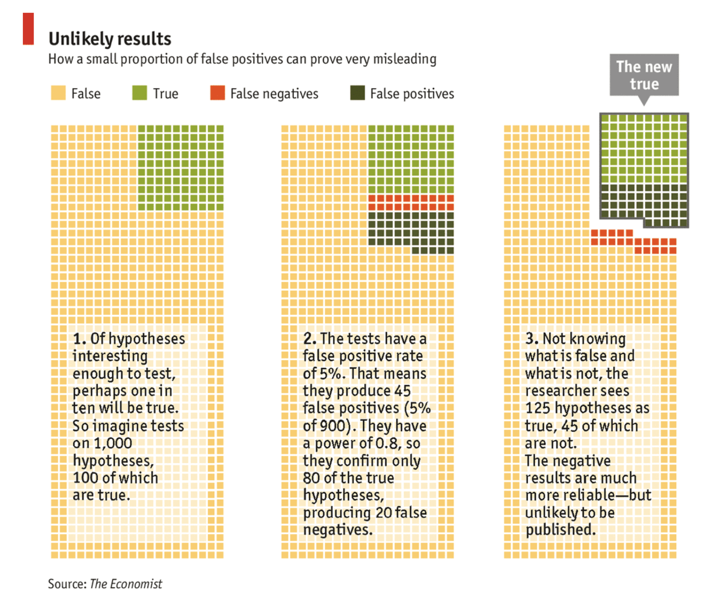
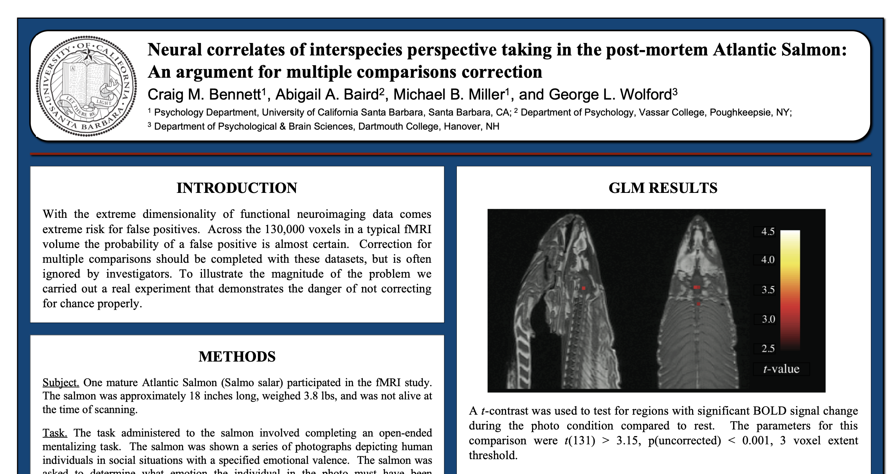
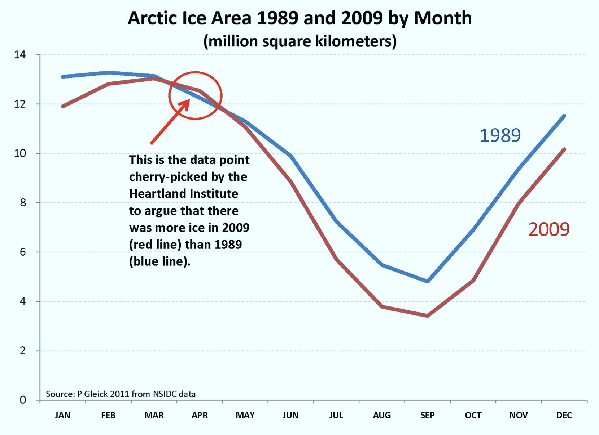
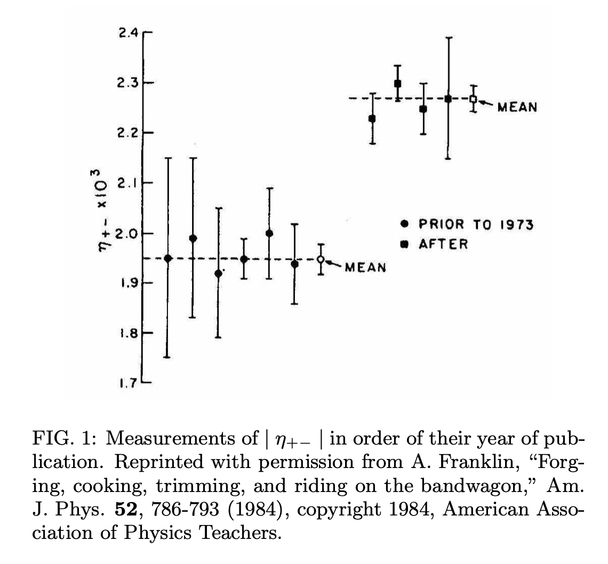

# Section 4: Introduction <!--{{{-->
<!--Setup {{{-->
```{r setup, include=FALSE}
rrepos <- getOption("repos")
rrepos["CRAN"] <- "https://cloud.r-project.org"
options(repos=rrepos)
options(width=100)
library(magicaxis)
knitr::opts_chunk$set(echo = TRUE)
knitr::opts_chunk$set(tidy = FALSE)
knitr::opts_chunk$set(class.output = "out")
knitr::opts_chunk$set(out.width="50%")
knitr::opts_chunk$set(fig.align="center")
#knitr::opts_chunk$set(fig.asp=1)
knitr::knit_engines$set(python = reticulate::eng_python)  
par(mar=c(3,3,1,1))
set.seed(666)
```
```{css, echo=FALSE}
.python { 
  background-color: 
    RColorBrewer::brewer.pal(1,"Set2");
} 
.out { 
  max-height: 300px;
  overflow-y: auto;
  background-color: inherit;
}
```

**Parameter Simulation, Optimisation, & Inference**

(or "Applying statistics in modern scientific analyses")

We apply our understanding of Bayesian statistics
to the common problems of parameter simulation, optimisation, and inference.
Students will learn the fundamentals of hypothesis testing, quantifying
goodness-of-fit, and parameter inference. 
We discuss common errors in parameter inference, including
standard physical and astrophysical biases that corrupt statistical analyses.
<!--}}}-->

<!--}}}-->

# The reason we're here <!--{{{-->

Our goal in this course is to formulate a basis for performing 
statistical analyses, in the natural sciences, that you can use for the 
rest of your academic careers. 

To do that, you need to be able to do the following: 

> + Be able to explore and understand complex datasets (Section 1)
> + Understand the probabilistic nature of experiments and 
experimental variables (Section 2) 
> + Have access to tools that allow you to estimate models from data (Section 3)
> + Understand how to interpret models/results to perform accurate 
**statistical inference** (Section 4). 

<!--}}}-->

# A Significant Conundrum <!--{{{--> 

Modern and future experiments will never produce data that covers the entire
population $\Omega$ of possible observations. Particles will always bounce 
off one-another in slightly different ways. Different parts of the universe will 
always present us with new and unique galaxies. There will always be more coins 
to toss and more die to roll. 

As a result, we will always be attempting to analyses models of variables
$\theta$ using samples of data, and therefore attempting inference using 
estimates of $\theta$ that are random variables. 

As a result, regardless of the experiment being undertaken, it is generally 
relevant to ask whether or not an observed relationship, parameter 
estimate, and/or measurement is "significantly" different from previous work 
and/or expectations from (e.g.) theory.

Said differently, whenever we measure a variable, it is sensible for us to ask
whether or not the estimated value is consistent with our model and/or previous 
estimates, given the expected random fluctuations of a random variable. 

## A simple demonstration: <!--{{{-->

Suppose we have a theory that the true average height of all human beings is 
$184$cm. Measuring the height of every human being is naturally unfeasible, so 
we are forced to take a sample of $n$ humans and just measure their average 
height. This estimate of the average height is a random variable, as it will 
vary from sample-to-sample. We wish to come up with a method for determining 
whether or not any difference between our estimate of the average height
$\theta$ and $184$cm is caused by random variation due to our sampling, or whether 
it demonstrates that the **true** average height is unlikely to be $184$cm. 

One method for performing such a determination would be to construct some 
interval (given the data) within which you expect the _true_ value of $\theta$
to reside with some (quite high) probability: say $95\%$. If you construct this 
interval and find that our hypothesised value of $184$cm resides outside it, 
then we can draw one of two conclusions: 

1) the value of $\theta=184$cm is unlikely to be correct; **or** 
2) we just got very unlucky with our chosen sample. 

This procedure provides us with a mechanism for determining whether the data 
that we have provides evidence to _contradict_ a particular hypothesis. 

<!--}}}--> 


<!--}}}--> 

# Aside: the merits of contradiction <!--{{{--> 

In the previous slide we formulated a method for assessing whether or not 
evidence contradicted a particular hypothesis. Why not, instead, come up with 
a measure of whether or not the data **agrees** with some hypothesis? 

Let me answer that question with another question: 

- How much evidence does it take to prove something is true? 
- How much evidence does it take to prove something is false? 

This is somewhat the nature of scientific inquiry: 

+ No amount of evidence can give absolute certainty that a hypothesis is true, 
it can only fail to show that it is false.
+ However you only need one piece of evidence to disprove a hypothesis. 

<!--}}}-->

# Significance <!--{{{--> 

Given our observed sample of human heights, we want to assess the
**significance** of the evidence against our particular hypothesis.

We can do this by calculating the fraction of samples of $n$ humans that would 
produce a sample mean that is as extreme as the one we observe **if** the 
hypothesis is true. 

Our hypothesis is that the population mean is $\hat{\mu}$, and we observe some
mean $\bar{x}$ from our sample of $n$ observations. We approximate the variance
of $\mu$ using the variance of our sample $s^2$, which gives us an estimate of
the standard error on $\hat\mu$: $s/\sqrt{n}$. 

We can then define a new random variable $t$ which we call our 
_test statistic_: 
$$
t = \frac{\bar{x}-\mu}{s/\sqrt{n}},
$$

You may recall that this is the **student t-statistic** from Section $2c$. The 
distribution of this variable therefore follows the student t-distribution. 
This distribution has an analytic PDF, and means that we can now trivially 
calculate the probability of observing a sample of data that have mean 
$\bar{x}$ given $\mu$, $n$, and $s$. 
Recall that the PDF of the student
t-distribution is:
$$
p(t; \nu)	=	\frac{\Gamma(\frac{\nu+1}{2})}{\Gamma\left(\frac{\nu}{2}\right)\sqrt{\pi \nu}}\left(1+\frac{t^2}{\nu}\right)^{-(\nu+1)/2}
$$
where $\nu=N-1$ is the degrees of freedom. 
The fraction of samples that have less extreme values of $\bar{x}$ **if** the 
true population mean is $\mu=\hat\mu$ is: 
$$
f=\int_{-|t|}^{|t|} p_t(x;\nu)\textrm{d}x
$$

Consider a very positive (or very negative) value of $t$; in these circumstances, 
$f$ will be close to $1$ (as $-|t|\leq x \leq |t|$ contains all the probability 
mass of the distribution). 

This indicates that essentially all random samples with $\nu$ degrees of freedom 
would have less extreme values of $t$ given the hypothesis that $\mu=\hat\mu$. 
A more convenient method of formulating this number is to look at its 
complement: 
$$
p=1-f
$$
which is the fraction of samples that have as extreme a value of $t$ given 
$\mu=\hat\mu$. This is known as the **p-value**. 

<!--}}}-->


# The p-value <!--{{{-->

In this lecturers opinion, the **p-value** is easily the most misunderstood,
misused, and/or misrepresented concept in statistics. So what is the p-value, 
and what is it not. 

> + **What does the p-value tell you**: 
The p-value represents the fraction of samples that would produce a test 
statistic that is as extreme as the one observed, given that the proposed 
(generally null) hypothesis is true. 

> + **What is the p-value _not_ tell you**: 
The p-value does _not_ tell you anything about the probability that the proposed 
hypothesis is correct, _nor_ about whether or not the data can be explained as 
being produced by random chance. 

Nonetheless, the p-value is widely used in the academic literature as a tool 
for hypothesis testing, and/or for justification that experimental evidence 
is incompatible with the _null hypothesis_ (i.e. that there is no underlying 
effect/difference). 

If we assume that we are willing to believe an effect if it has a p-value of 
$\alpha$ or less; otherwise you reject the effect in favour of the null 
hypothesis. The probability that you accept a hypothesis that is actually 
_false_, is the fraction of samples that would give you a satisfactory 
p-value even though the null hypothesis was true. But this value is just 
$\alpha$. So you can consider the p-value as being the probability that you 
have accepted a hypothesis that is false. 

## Using the p-value

In his original $1920$ publication, Fisher used $p<0.05$ as an example of 
a value that might be used to justify rejection of the null hypothesis, when 
taken in the context of the entire experimental landscape. 

We've said already what the p-value describes. So now a question: 

**Given purely random measurement bias, what distribution does the p-value take 
under many realisations of an experiment?** 

``` {r, fig.height=4, fig.width=6, out.width='80%', eval=TRUE}  
#What distribution should the p-value have? 
curve(dnorm(x,mean=0.5,sd=0.1),type='s',col='black',lwd=2,xlab='p-value',ylab='PDF')
curve(dunif(x),type='s',col='blue3',lwd=2,add=T)
curve(dbeta(x,shape1=1,shape2=0.1),type='s',col='red3',lwd=2,add=T)
curve(dbeta(x,shape1=0.1,shape2=1),type='s',col='green3',lwd=2,lty=2,add=T)
legend('topleft',inset=c(0.1,0.05),legend=c("Gaussian","Uniform","Exponential 1","Exponential 0"),
       col=c('black','blue3','red3','green3'),lwd=2,lty=c(1,1,1,2),bty='n',cex=0.7)
```

``` {r, fig.height=4, fig.width=6, out.width='80%', eval=TRUE}  
#Visualising the p-value in R
set.seed(666)
#Generate random data
obs<-rnorm(1e4)
#Calculate the p-value 
pval<-pnorm(abs(obs))-pnorm(-abs(obs))
#Plot the p-value 
maghist(pval,breaks=1e2,xlab='p-value',ylab='PDF',verbose=FALSE,col='white',
        freq=FALSE)
curve(dunif,lwd=2,col='blue3',add=T,type='s')
```
Which makes sense; the p-value describes the fraction of samples that have 
more extreme values than that which we observed, assuming the null hypothesis. 
If the null hypothesis is true, then we should see a p-value as extreme as 
$\alpha$ occur $\alpha\%$ of the time.  

But this begs an important question: if every scientist were to use $p<0.05$ as
a metric for "a significant result worthy of publication", what fraction of 
published results ought to be false positives? 

<!--}}}-->

# How much published research is wrong? <!--{{{--> 

Let's assume that we're looking at a field of research where there are 
$500$ ongoing experiments, all exploring different possible physical 
relationships. Of those $500$ experiments, $50$ of them are real physical 
relationships. 

If all researchers use a metric of $p<0.05$ as their determination for 
whether an effect is real or not, _and researchers only publish when they 
find a significant result_, what will the fraction of published results that 
are wrong?

# A simple simulation 

We can construct a simulation to demonstrate this situation. We simply 
simulate $500$ draws from a Gaussian, where $50$ draws have $\mu\neq 0$ and the 
rest have $\mu= 0$. We can then compute the p-value for each of these 
experiments, and "publish" those with 'significant' findings. Assume that we 
know the true parameter variance $s^2=1$, for simplicity. 

``` {r, fig.height=4, fig.width=6, out.width='90%', eval=TRUE}  
#simulated experiments in R
set.seed(666)
run.experiments<-function(n=1e3,frac.true=0.1,p.thresh=0.05,stat.pwr=0.8,pub.only=FALSE) {
### n: Number of experiments being analysed 
### frac.true: Fraction of true relationships
### p.thresh: P-value required for significance 
### stat.pwr: Statistical Power per experiment 
#Number of true relationships; 10% of total
real<-c(rep(TRUE,n*frac.true),rep(FALSE,n*(1-frac.true)))
#Accurate measurements for the true relationships?
accurate<-ifelse(runif(n*frac.true)<=stat.pwr,TRUE,FALSE)
#Lucky measurements for the false relationships?
measurement<-rnorm(n*(1-frac.true))
lucky<-ifelse(pnorm(abs(measurement))-pnorm(-abs(measurement))<=p.thresh,TRUE,FALSE)
#So the Results
significant<-rep(NA,n)
#Real relationship with an accurate measurement 
significant[ real][ accurate]<-TRUE
#Real relationship with an inaccurate measurement 
significant[ real][!accurate]<-FALSE
#False relationship with a lucky sample 
significant[!real][ lucky]<-TRUE
#False relationship with an unlucky sample 
significant[!real][!lucky]<-FALSE
#Results: 
if (!pub.only) { 
  cat("All Results:\n")
  print(table(paste(ifelse(real,"TrueEffect","NoEffect"),
                    ifelse(significant,"SignificantResult","NoResult"),sep='+'))/n
  )
}
cat("Published Results:\n")
print(table(paste(ifelse(real[significant],"TrueEffect","NoEffect"),
                  "SignificantResult",sep='+'))/length(which(significant))
)
}
run.experiments()
```

Standard scientific practice is that only measured relationships get 
published, so while we have $85\%$ insignificant findings, these generally 
never see the light of day. Instead we only look at the significant results.

So: If _everything is working as it should_, roughly one-third of all published 
papers that use $p\leq 0.05$ as a threshold for publication ought to be 
false-positives. This fraction is determined by the following important numbers: 

+ The **Statistical Power**: how probable an experiment is to find a true
relationship when one does exist
+ The **Ratio of true-to-false hypotheses**: if we have many many more false 
hypotheses than true ones, this effect is exacerbated
+ The **Significance Threshold**: what magic number people select for determining 
whether or not an effect is significant (i.e. the p-value threshold). 

If we have particularly insightful and disciplined researchers: 
``` {r, fig.height=4, fig.width=6, out.width='90%', eval=TRUE}  
run.experiments(frac.true=0.5,stat.pwr = 0.95,pub.only=TRUE)
```
But if, for example, researchers are incentivised to explore greater numbers 
of exotic hypotheses with less and less prior justification: 
``` {r, fig.height=4, fig.width=6, out.width='90%', eval=TRUE}  
run.experiments(frac.true=0.01,pub.only=TRUE)
```



<!--}}}--> 

<!--}}}-->

# Pratical Statistical Inference <!--{{{-->

So it's clear that the use of a standard threshold for p-values as a measure of 
significance can lead to problematic numbers of incorrect results being 
published in the literature. 

However, as we just saw, this effect can be 
calculated simply. So why is it a problem, provided that we can easily 
demonstrate the effect, and so account for it? Why not, for example, use the 
high-energy physics mantra of $p<0.001$ and be done with it? 

``` {r, fig.height=4, fig.width=6, out.width='90%', eval=TRUE}  
set.seed(666)
run.experiments(p.thresh=0.001,pub.only=TRUE)
```

# The Problem is Choice 


At it's simplest level, when provided an arbitrary dataset, our statistical
analyses will involve two steps:

1) **Data mining**: where we explore and summarise the data; and 
2) **Data modelling**: where we extract model parameters/trends, and test hypotheses. 

However in reality each of these steps involves many stages: 
With experimental data: 

* Samples must be defined; 
* Observations must be taken; 
* Defective data must be identified and removed; and more.  

When modelling the data: 

* formulate our hypotheses; 
* construct the likelihood; 
* perform our inference; and more. 

In this lecture, we're going to explore some of the dangers iherent to these 
processes. 
We will establish some of the fundamentals of hypothesis testing, 
specifically with respect to determining the significance of evidence.

## However:

While we could simply go through the definitions, standards, and best practices
for determining the significance of evidence, I think it is more educational 
(and shocking, and fun) to go about this from the _opposite_ direction. 

As such, today's lecture will be all about... 

<!--}}}-->

#  Bad Statistics: <br>(Non-exhaustive) Examples of what **not** to do <!--{{{-->

In this lecture, we're going to go through a step-by-step guide to 
**bad statistics**. We will use simulated data and real experiments to show how 
poor use of statistics can lead to pathologically incorrect conclusions, in a 
(hopefully light-hearted!) effort to demonstrate the pitfalls that careless 
scientists can find themselves falling into. 

This discussion of bad statistics will focus on a few main areas: 

> * Variable Selection 
> * Sample Selection 
> * Data Modification 
> * Additional Observation 
> * Confirmation 

**Importantly**: for the sake of this lecture, we are going to completely 
ignore the concept of spurious correlations (which we spoke about at the 
beginning of the lecture course). This effect, in reality, makes much of 
what we are about to discuss _much_ worse. 

<!--}}}-->

# Variable Selection <!--{{{-->

We are scientists working to determine any interesting relationships present 
in our data. 

Our dataset contains $n=1e2$ observations (of galaxies, or particle collisions, 
etc), and we measured $20$ different variables for each observation. 
So our dataset looks something like this: 
``` {r, fig.height=4, fig.width=6, out.width='90%', eval=TRUE,echo=FALSE}
set.seed(42)
nobs<-1e2
nvar<-20
obs<-as.data.frame(matrix(rnorm(nobs*nvar),nrow=nobs,ncol=nvar))
print(obs)
```
We have theoretical expectations of what the data ought to show for each of 
our variables, which we have already subtracted from each column. 
So the null hypothesis in these data is always $\theta_i=0$, and we 
can compare how our data differs from the null 
hypothesis using a t-test. 

So let's look at our first variable: 
``` {r, fig.height=4, fig.width=6, out.width='90%', eval=TRUE}
summary(obs$V1) 
t.test(obs$V1)
```
Nothing significant there... what about for our second variable? 
``` {r, fig.height=4, fig.width=6, out.width='90%', eval=TRUE}
summary(obs$V2) 
t.test(obs$V2)
```
Also nothing... let's keep going... 

The fourth variable: 
``` {r, fig.height=4, fig.width=6, out.width='90%', eval=TRUE}
summary(obs$V4) 
t.test(obs$V4)
```

... the ninth...
``` {r, fig.height=4, fig.width=6, out.width='90%', eval=TRUE}
summary(obs$V9) 
t.test(obs$V9)
```

... the fourteenth...
``` {r, fig.height=4, fig.width=6, out.width='90%', eval=TRUE}
summary(obs$V14) 
t.test(obs$V14)
```

... the seventeenth...
``` {r, fig.height=4, fig.width=6, out.width='90%', eval=TRUE}
summary(obs$V17) 
t.test(obs$V17)
```

Aha!! We've found a significant relationship! The $17^{\textrm{th}}$ variable is 
discrepant from the null hypothesis with a p-value of `r t.test(obs$V17)$p.value`. 

We write up our discovery, publish the result, and our discovery is enshrined in 
the literature forever. 

## What is the problem with this? 

The process I've described above is known as **data-dredging**, the
**look-elsewhere effect**, or the **problem of multiple comparisons**. 

The core issue here is that we're looking at many different chunks of the 
data, any not taking that into account when we decide whether what we've found 
is significant. 

Recall the p-value for many experiments: 
``` {r, fig.height=4, fig.width=6, out.width='80%', eval=TRUE,echo=FALSE}  
#Visualising the p-value in R
set.seed(666)
#Generate random data
obs<-rnorm(1e4)
#Calculate the p-value 
val<-pnorm(-abs(obs))-pnorm(abs(obs))
#Plot the p-value 
maghist(pval,breaks=1e2,xlab='p-value',ylab='PDF',verbose=FALSE,col='white',
        freq=FALSE)
curve(dunif,lwd=2,col='blue3',add=T,type='s')
```
We have used in this example a threshold of $p<0.05$. We therefore expect to 
find this p-value given random fluctuations in $1$ out of every $20$ cases. 
In our example we have $20$ variables. So it makes sense that we found a 
"significant" effect for $1$ variable. 

One can correct for this effect using a modification to the threshold that 
is required for determining "significance", to account for the fact that 
many variables are under analysis. The simplest example is the 
**Bonferroni correction**, which simply states that the threshold for 
significance when analysing $m$ different variables ought to be 
$\alpha^\prime=\alpha / m$. However there are many possible corrections. 
In **R** there are a number of them inbuilt, which we can run over our 
simulated data:
``` {r, fig.height=4, fig.width=6, out.width='80%', eval=TRUE,echo=FALSE}
set.seed(42)
nobs<-1e2
nvar<-20
obs<-as.data.frame(matrix(rnorm(nobs*nvar),nrow=nobs,ncol=nvar))
p <- sort(sapply(obs,function(X) t.test(X)$p.value))
p.adj    <- sapply(p.adjust.methods, function(meth) p.adjust(p, meth))
matplot(p, p.adj, ylab="p.adjust(p, meth)", type = "l", asp = 1, lty = 1:6,
        main = "P-value adjustments")
legend(0.7, 0.6, p.adjust.methods, col = 1:6, lty = 1:6)
```

## Real World Example: An Empathetic Fish <!--{{{--> 

Do fish feel empathy? 

This was a question posed by a group of researches working within the 
functional magnetic resonance imageing (fMRI) community in 2009. fMRI 
studies use the magnetic resonance to produce highly detailed internal images 
of people (and in this case, fish). The field uses analysis techniques that 
are designed to identify activity within (particularly) the brain that can 
be correlated with an external stimulus, in order to identify parts of the 
brain that are responsible for different things, or to just demonstrate that 
comprehension is occuring. 

The case of this experiment was to show whether or not an Atlantic Salmon 
would react differently when shown images of people, rather than images of 
inanimate objects. 

The researchers placed the fish in an MRI, and presented it with images of 
humans and other pictures. They analysed the data using standard processing 
tools, and found a significant discovery of activity in the brain of the 
salmon that correlated with the researchers presenting the fish with images 
of humans. 

The problem? 

+ **The salmon was frozen at the time of study** 



<!--}}}-->

<!--}}}-->

# Data Modification <!--{{{-->

Data modification can take a number of forms, however the most common are 
selecting specific subsets of data and/or rejecting 
certain portions of the data that are deemed to be "outliers". 
Data modification need not be malicious, or even intentional. At its 
weakest, we may simply discard data that we expect to be outliers. 
At its most malicious, it involves hand-selecting data that suit your 
hypothesis. These processes are generally referred to as **cherry-picking**. 

Let's generate a new dataset from scratch. 
Suppose now that we set a more strict requirement on our p-value, $p<0.01$, and 
that this is the first variable that we looked at (so no modification to our 
threshold is required). 

We're not quite there with our dataset: 
``` {r, fig.height=4, fig.width=6, out.width='80%', eval=TRUE,echo=FALSE}
set.seed(25)
obs<-rnorm(1e2)
hist(obs,breaks=20)
print(t.test(obs))
```
But what about those two pesky data points at $\sim 2$? Maybe we can convince 
ourselves that one of those is an error, because of something that went wrong 
in our experiment? We convince ourselves to drop one of those data points (after 
all, it's only $1\%$ of the data!). What happens to our p-value? 

``` {r, fig.height=4, fig.width=6, out.width='80%', eval=TRUE,echo=FALSE}
obs<-obs[-which.max(obs)]
print(t.test(obs))
```

**Off to the journal we go!** 

This is an example of cherry picking that is _very_ easy for researchers to 
fall into. This is because experimental data is messy; it's easy to fool 
yourself into thinking random fluctuations are bad data, and thereby 
justify their removal. This has a significant influence on determinations of 
significance, though, as we've just seen. 

## Real World Example: Climate Denialism <!--{{{--> 

The practice of **maliciously** cherry-picking data is also an important one 
to understand. This is the realm of people who wish to use statistics to push 
an agenda, and one of the most common places to find examples of this practice 
is in climate change denialism. 

In an effort to provide evidence that the globe is not warming, one 
climate change denier claimed in a newspaper article in 2011 that: 

"In fact, National Snow and Ice Data Center records show conclusively that in 
April 2009, Arctic sea ice extent had indeed returned to and surpassed 1989 
levels."

The implication of this statement is that there is no cause for alarm because 
there is no **systematic** reduction in sea ice between the two years. The 
assumption being that the lack of difference in April can be used to infer 
systematic difference over the whole year (or longer). 

Can you see the problem with this argument? 



<!--}}}-->

<!--}}}-->

# Additional Observation <!--{{{-->

A significant statistical fallacy in significance estimation comes from the 
ability of researchers to adaptively observe more data. 

Consider an experiment where we make $n$ observations of a variable $X$. 
We compute our statistic of choice, say the t.test, and calculate a p-value. 

We find that our p-value is on the cusp of being "significant". We therefore 
decide to perform some additional observations, and find that the p-value 
decreases below our required threshold. Confident that these additional data 
have confirmed our effect is real: 

**We Publish**

Can you see a problem with this process? 

## Simulating the effect:

Again this is an effect that we can simulate easily. Let us create a 
dataset of $n$ observations, and compute the p-value. 

``` {r, fig.height=4, fig.width=6, out.width='80%', eval=TRUE,echo=FALSE}
set.seed(25)
obs<-rnorm(1e2)
print(t.test(obs))
```
We now decide to observe more data, in a batch of $10$ observations. 
``` {r, fig.height=4, fig.width=6, out.width='80%', eval=TRUE,echo=FALSE}
obs<-c(obs,rnorm(10))
print(t.test(obs))
```
Bingo! We cross the threshold of $p<0.05$ and we rush straight to the publisher. 

But what happens if we were to continue observing data? 

``` {r, fig.height=4, fig.width=6, out.width='80%', eval=TRUE,echo=FALSE}
p<-NULL
for (i in seq(10,length(obs),by=10)) { 
  p<-c(p,t.test(obs[1:i])$p.value)
}
for (i in 1:100) { 
  obs<-c(obs,rnorm(10))
  p<-c(p,t.test(obs)$p.value)
}
magplot(seq(10,length(obs),by=10),p,type='l',col='black',lwd=2,
        xlab='Number of Observations',ylab='p-value')
abline(h=0.05,lty=3,col='red3')
```

This effect is known most colloquially as **p-hacking** (although that term 
can be applied to many of the practices that we discuss here). 
Generally speaking the problem is that we can _decide_ when to stop taking 
observations based on the significance threshold we want to achieve. This 
allows us to keep observing data until we work our way down to a significant
result.

We can ask the question: how often can I hack my way to significance with 
up to $1000$ observations taken $10$ at a time? 

``` {r, fig.height=4, fig.width=6, out.width='80%', eval=TRUE,echo=FALSE}
#P-hacking simulation with R
p.hack<-function(seed,nmax=1e3,nstep=10,p.thresh=0.05) { 
  #Set the seed
  set.seed(seed)
  # Create a vector of 1e3 values
  obs = rnorm(nmax)
  # Compute the p-value in bins of 100 observations 
  steps<-seq(100,nmax,by=nstep)
  #Setup the p-value vector
  p<-rep(NA,length(steps))
  publish<-FALSE
  for (i in 1:length(steps)) { 
    #Calculate p
    p[i]<-t.test(obs[1:steps[i]])$p.value
    #Do we satisfy the threshold?
    if (p[i]<=p.thresh) { 
      #To the publisher! 
      publish<-TRUE
      break
    }
  }
  return=publish
}
published<-sapply(FUN=p.hack, X=sample(1e6,1e3)) 
print(table(published)/length(published))
```
So by selectively observing more data, we publish $30\%$ of the time given a 
statistical significance threshold of $0.05$. 

<!--}}}-->

# Confirmation <!--{{{-->

Finally, we consider the influence of conscious and subconscious human biases 
on measurements. 

Experiments do not happen in windowless rooms in the depths of space. They 
are performed by human researchers who work in laboratories, and have a 
keen understanding of the _context_ in which their experiment takes place. 

In our discussion of bayesian statistics, we formulated this as a **good** thing. 
The prior knowledge that we bring to an experiment can play an important role 
in improving our statistical inference. However there is a dark side to 
prior knowledge: the (generally sub-)conscious drive to be "consistent". 

## Confirmation bias 

The last significant statistical fallacy that we will discuss today is 
one that is _extremely_ important: **confirmation bias**. 

Confirmation bias is the tendency for researchers to continue adapting their 
results until they agree with some prior belief. 

Take, as an example, measurements of the coefficient of charge-parity violation:



The figure above was taken from Jeng (2005), and was originally printed in 
Franklin (1984): "Forging, cooking, trimming, and riding on the bandwagon".

The figure demonstrates the problem nicely. Prior to 1973, there was a 
consensus on the value that $|\eta_\pm|$ ought to hold. However in 
the early seventies, there was a shift in the consensus: and all observations 
began to cluster around that particular value. 

The pre- and post-1973 distributions of $|\eta_\pm|$ are catastrophically 
inconsistent with one-another. The cause: confirmation bias. 
Similar effects have been seen in measurements of the speed of light, and in the 
build-up to the discovery of the Higgs Boson. 

## Real World Example: the penta-quark <!--{{{--> 

Confirmation bias, however, need not require previous measurements. Humans can 
have a prior belief about a particular result, and simply analyse their data 
until that result is observed. 

Such was the case with the discovery of the $\theta^+$ penta-quark. 

In 2002, a japanese lab published the discovery of the $\theta^+$ penta-quark 
at greater than $5\sigma$ significance (a false positive rate of 1 in ~20 million). 
Subsequently over the next $4$ years $11$ other research groups searched for and 
found high-significance detections of the same penta-quark. 

However, subsequent searches with more sensitive equipment failed to find any 
evidence for the penta-quark. In the same year, one group quoted an $8\sigma$ 
detection of the pentaquark, while another group performing the exact same 
experiment at a different lab with comparable statistical power found 
_nothing_. 

The problem here is that researchers were not **blinded** to their data. They 
knew the signal that they were trying to detect, and they found it. 

As such **blind** analyses are now a staple in many fields within the 
natural sciences, including cosmology and high-energy particle physics. 

<!--}}}-->

<!--}}}-->

# What have we learned <!--{{{-->

This has been an incomplete discussion of statistical fallacies. There are 
many more. Notable omissions include: 

> + Regression to the mean 
> + Spurious Correlation 
> + Survivor Bias 

Generally, the lesson here is to be very skeptical of using a p-value as a 
mechanism for determining whether or not something is "interesting", or 
"significant". 

<!--}}}-->

